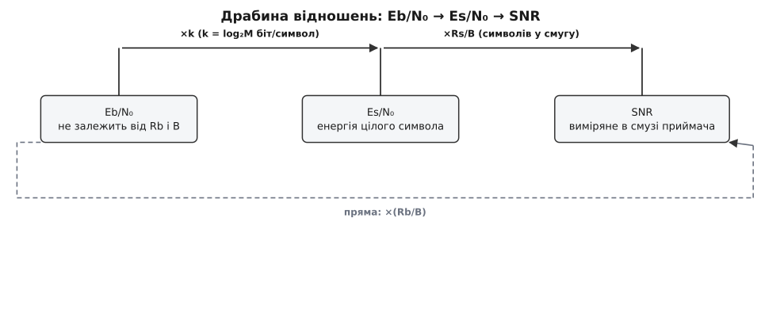
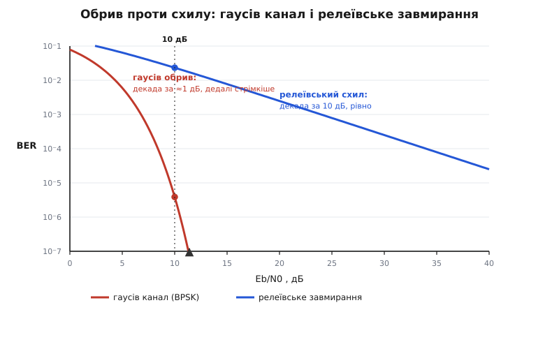

# 🧮 Q-функція і геометрія помилки: звідки береться формула водоспаду

Уся крива надійності BPSK стискається в один рядок:

```
BER = Q( √(2·Eb/N₀) )
```

Рядок короткий, а всередині нього — три речі, які зазвичай беруть на віру. Перша: що таке взагалі **Q** і чому в коді її рахують через якусь `erfc`. Друга: звідки в аргументі саме `√2` і саме `Eb/N₀`, а не голе відношення сигнал/шум — і чому та сама вісь однаково чесна для телефонного модема й для зонда біля Марса. Третя, найтонша: чому хвіст `e^(−x²/2)` робить обрив водоспаду прямовисним, і то настільки прямовисним, що пара децибелів справді вирішує все. Розберімо кожну з першопричини — не як формулу, яку треба запам'ятати, а як апарат, з якого ця формула **виводиться**.

## Q — хвіст, який довелося назвати

Почнімо з самої функції. **Q-функція** — це площа під правим хвостом стандартної гаусіани (середнє 0, дисперсія 1) праворуч від точки x:

```
Q(x) = P(Z > x) = ∫ₓ^∞ (1/√(2π))·e^(−u²/2) du
```

Читається просто: візьми стандартну нормальну випадкову величину Z і спитай, з якою ймовірністю вона вискочить далі, ніж на x. Три опорні точки видно без обчислень: `Q(0) = ½` (половина площі — праворуч від центру), `Q(+∞) = 0` (за нескінченність нічого не вискакує), і між ними функція худне — спершу поволі, потім катастрофічно швидко.

Тепер чому в коді пишуть не `Q`, а `0.5·erfc(...)`. Причина не в примсі бібліотек, а в глибшому факті: підінтегральна `e^(−u²/2)` **не має елементарної первісної**. Інтеграл від `e^(−u²)` не виражається ні через многочлени, ні через експоненти, ні через тригонометрію — це доводиться теоремою Ліувілля про інтегрування в скінченному вигляді. Раз первісної немає, площу під хвостом лишається тільки **назвати** й затабулювати. Математики зробили це першими: назву «функція похибок» (лат. *error function*, звідси `erf`) і саме позначення запропонував англійський математик Джеймс Ґлейшер 1871 року — саме через зв'язок із теорією похибок вимірювання; сам інтеграл ще 1809-го вписав у метод найменших квадратів Карл Фрідріх Ґаусс (усе це — усталений факт історії математики). Інженери зв'язку згодом перепакували той самий хвіст у зручнішу для себе `Q` (позначення закріпилося в класичному підручнику Возенкрафта й Джейкобса 1965 року). Дві функції, один інтеграл — тож варто раз і назавжди побачити місток між ними.

**Функція похибок і її доповнення** означені так:

```
erf(z)  = (2/√π) · ∫₀^z e^(−t²) dt          площа «ядра» від 0 до z
erfc(z) = 1 − erf(z) = (2/√π) · ∫_z^∞ e^(−t²) dt   решта — правий хвіст
```

Різниця з Q — у двох дрібницях: `erf` інтегрує `e^(−t²)` (без двійки в знаменнику показника), а нормування в неї `2/√π`, не `1/√(2π)`. Обидві дрібниці зникають однією заміною змінної. Підставмо в Q підстановку `u = t·√2` (тоді `du = √2·dt`, а нижня межа `u = x` стає `t = x/√2`):

```
Q(x) = ∫ₓ^∞ (1/√(2π))·e^(−u²/2) du
     = ∫_{x/√2}^∞ (1/√(2π))·e^(−t²)·√2 dt          (u = t√2)
     = (√2/√(2π)) · ∫_{x/√2}^∞ e^(−t²) dt
     = (1/√π) · ∫_{x/√2}^∞ e^(−t²) dt
     = ½ · erfc( x/√2 )
```

Ось і весь місток, і тепер видно, **звідки що**. Множник `√2` в аргументі — це плата за різні «одиниці ширини»: Q міряє відхилення в справжніх сигмах стандартної гаусіани, а `erf` живе в масштабі `e^(−t²)`, де роль сигми грає `1/√2`. Переклад між масштабами — саме `x/√2`. А половинка спереду — бо `erfc` за побудовою несе повне двобічне нормування `2/√π`, і згортання до одного хвоста ділить його навпіл. Тому рядок коду `0.5*math.erfc(x/math.sqrt(2))` — це буквально `Q(x)`, без жодного наближення.

Привчімо око до значень — вони знадобляться далі як опорні стовпи:

```
Q(0)    = 5.0·10⁻¹        (половина)
Q(1)    = 1.59·10⁻¹
Q(2)    = 2.28·10⁻²
Q(3)    = 1.35·10⁻³
Q(4)    = 3.17·10⁻⁵
Q(4.27) = 9.8·10⁻⁶  ≈ 10⁻⁵     ← запам'ятайте цю
Q(4.75) = 1.0·10⁻⁶
```

Придивіться до кроку між рядками: від Q(3) до Q(4) — падіння у ~24 рази за одну одиницю аргументу; від Q(4) до Q(4.75) — ще втричі за три чверті одиниці. Функція не просто спадає — вона **прискорюється** у спаданні. Ця деталь і є зерно водоспаду; повернімося до неї, коли складемо решту апарата.

> 🔧 **Навіщо це.** Q — це універсальний перекладач «скільки сигм до біди → з якою ймовірністю біда». Хай де в системі стоїть поріг — рішення про біт, спрацювання компаратора, викид напруги за допуск — відповідь на «як часто його перескочать» дає одне обчислення Q від «запасу в сигмах». Тому інженер, що знає лише σ шуму й відстань до порога, вже знає частоту помилок, не роблячи жодного додаткового заміру.

## Дві гаусіани й поріг — звідки береться √(2·Eb/N₀)

Тепер найцікавіше: чому аргументом Q для BPSK виявляється саме `√(2·Eb/N₀)`. Це не постулат — це **розв'язок задачі рішення** між двома дзвониками, і кожен шматок аргументу народжується в ній сам.

Картина така. [BPSK](book:communications/fsk-psk) шле один із двох протилежних символів: `s = +√Eb` для одиниці, `s = −√Eb` для нуля, де Eb — енергія, вкладена в біт. У [каналі AWGN](book:communications/awgn-channel) до символа додається гаусів шумовий поштовх n, і приймач бачить суму `r = s + n`. Поштовх розподілений нормально навколо нуля з дисперсією `σ² = N₀/2` — це дисперсія шуму на **одну** дійсну координату після узгодженого фільтра ([чому саме половина N₀ — розписано в математиці гаусового шуму](book:communications/awgn-channel/math-gaussian-noise.md)). Отже прийняте число r — випадкове, і його закон залежить від того, що слали. Якщо слали `+√Eb`, то r сидить дзвоником навколо `+√Eb`; якщо `−√Eb` — навколо `−√Eb`:

```
p(r | +) = 1/√(2πσ²) · e^(−(r − √Eb)² / (2σ²))
p(r | −) = 1/√(2πσ²) · e^(−(r + √Eb)² / (2σ²))
```

Два дзвоники однакової ширини, зсунуті на `2√Eb` один від одного. Приймач бачить одне число r і мусить угадати, який дзвоник його породив. Що робити — диктує **відношення правдоподібностей**: поділи одну щільність на другу й дивись, котра більша. Поділімо й спростімо показники (різниця квадратів `(r+√Eb)² − (r−√Eb)² = 4r√Eb`):

```
p(r|+) / p(r|−) = exp( [ (r+√Eb)² − (r−√Eb)² ] / (2σ²) )
                = exp( 4r√Eb / (2σ²) )
                = exp( 2r·√Eb / σ² )
```

Уся ця конструкція більша за одиницю рівно тоді, коли показник додатний, тобто коли `r > 0`. Ось і виявилося: за рівноймовірних символів оптимальне рішення — банальне **«дивись на знак r»**, а поріг сидить точно посередині між дзвониками, у нулі. Жодної мудрості; уся мудрість — у тому, що це рішення справді оптимальне, і в тому, де тепер помилка.

А помилка — коли шум перекинув r через нуль на чужу половину. Хай слали `+√Eb`; тоді `r = √Eb + n`, і хибне рішення стається, коли `r < 0`, тобто коли `n < −√Eb`. Гаусів шум симетричний, тож це те саме, що `n > √Eb`. Імовірність гаусовій величині з σ перевищити поріг `√Eb` — це рівно Q від «порога в сигмах»:

```
P(помилка | слали +) = P(n < −√Eb) = P(n > √Eb) = Q( √Eb / σ )
```

Через симетрію для `−√Eb` те саме число, тож повна ймовірність помилки біта дорівнює цьому Q. Лишилося підставити `σ = √(N₀/2)` — і аргумент згортається в знайомий вигляд:

```
√Eb / σ = √Eb / √(N₀/2) = √( Eb / (N₀/2) ) = √( 2·Eb/N₀ )

⇒   BER = Q( √(2·Eb/N₀) )
```

Кожен шматок тепер має адресу. `Eb` прийшло з енергії символа, `N₀/2` — з дисперсії шуму на координату, `√` — бо Q міряє **амплітудний** запас, а Eb/N₀ — енергетичний (квадрат амплітуди), двійка — з того, що поріг стоїть на повній піввідстані `√Eb`, а не на чверті. Звірмо на славнозвісній точці:

```
Eb/N₀ = 9.6 дБ → 10^0.96             = 9.12   (з децибел у рази)
аргумент = √(2 · 9.12)               = 4.27
BER = Q(4.27) = ½·erfc(4.27/√2)      = 9.8·10⁻⁶ ≈ 10⁻⁵
```

Ось звідки в таблиці головної теми береться рядок «9.6 дБ → 10⁻⁵»: він не виміряний і не підігнаний, а порахований з площі одного гаусового хвоста. І та сама `Q(4.27) ≈ 10⁻⁵`, яку ми взяли опорною в першому розділі, тут спрацювала як ключ.

## Зоопарк відношень: SNR, Es/N₀, Eb/N₀

Тепер друга обіцянка — навести лад у відношеннях. У формулу водоспаду ввійшло `Eb/N₀`, а не звичне `SNR`, і це не випадковість. Річ у тім, що голе відношення сигнал/шум **контрабандою** протягує в себе дві речі, яких у ньому бути не повинно, — швидкість потоку й ширину смуги. Розплутаймо.

Три величини, три різні знаменники:

```
SNR   = P_сигнал / P_шум         відношення потужностей у смузі приймача
Es/N₀ = енергія на символ / N₀    нормовано на символ
Eb/N₀ = енергія на біт   / N₀     нормовано на біт
```

Зв'язати їх — питання двох означень. Енергія на біт — це потужність, розмазана на час одного біта: `Eb = P_сигнал · Tb = P_сигнал / Rb`, де Rb — бітова швидкість. Спектральна густина шуму — це його потужність, розмазана по смузі: `N₀ = N / B`. Підставмо обидві в SNR і дивімося, що вийде:

```
SNR = P_сигнал / N = (Eb · Rb) / (N₀ · B) = (Eb/N₀) · (Rb/B)
```

Ось воно, голе й чесне. **SNR — це Eb/N₀, помножене на спектральну ефективність** `η = Rb/B` (скільки біт за секунду ви тиснете в кожен герц). Тепер видно, чому SNR двозначне: та сама якість «на біт» (те саме Eb/N₀) дає різне SNR залежно від того, широко чи тісно ви розмістилися в спектрі. Розтягни той самий потік на вдвічі ширшу смугу — миттєве SNR впаде вдвічі, хоча кожному бітові живеться однаково. Ділення на Rb і B прибирає цю двозначність — тому чесна вісь надійності саме `Eb/N₀`.

M-арні схеми додають ще один поверх. Коли символ несе не один біт, а `k = log₂M` бітів (BPSK — 1, QPSK — 2, [16-QAM](book:communications/fsk-psk) — 4, 64-QAM — 6), енергія символа збирає всі його біти: `Es = k·Eb`. А символів за секунду менше, ніж бітів, теж у k разів: `Rs = Rb/k`. Звідси весь місток:

```
k     = log₂ M               біт на символ
Es    = k · Eb               енергія символа = k енергій біта
Es/N₀ = k · (Eb/N₀)          відношення на символ у k разів більше
Rs    = Rb / k               символів за секунду у k разів менше
SNR   = (Es/N₀) · (Rs/B)     = (Eb/N₀) · (Rb/B)   — те саме двома шляхами
```



*Одна величина трьома поглядами. Праворуч по драбині — множимо (на k біт-на-символ, тоді на символьну ефективність), ліворуч — ділимо. Eb/N₀ стоїть найлівіше не випадково: з нього знято і швидкість, і смугу, тож саме на ньому чесно зустрічаються різні системи.*

Порахуймо два краї, щоб драбина ожила. **BPSK за Найквістом** (символьна швидкість дорівнює смузі, `Rs = B`, а `k = 1`, тож `Rb = B`): множник `Rb/B = 1`, і `SNR = Eb/N₀` рівно. Саме тому головну криву малюють проти Eb/N₀ й не завдають собі клопоту розрізняти — для BPSK це та сама вісь. А тепер **16-QAM за Найквістом** (`k = 4`, `Rs = B`):

```
SNR = Es/N₀ = k·(Eb/N₀) = 4·(Eb/N₀)
у децибелах: SNR(дБ) = Eb/N₀(дБ) + 10·log₁₀4 = Eb/N₀(дБ) + 6.0 дБ
```

Тобто виміряне на вході SNR = 16 дБ для 16-QAM означає Eb/N₀ = 10 дБ на біт: шість децибелів «зайвих» — це просто плата за те, що ви напхали вчетверо більше бітів у той самий герц. Переплутати ці шість децибелів — класична пастка бюджету лінії; драбина рятує від неї механічно. І ось глибший висновок усього розділу: **виграш кодування має сенс тільки тому, що вісь Eb/N₀ уже нормована**. Зсув кривої на «5 дБ ліворуч» — це чесна обіцянка «та сама надійність за втричі меншої енергії на біт» лише тоді, коли з осі знято швидкість і смугу. На осі голого SNR той самий зсув змішувався б зі зміною модуляції, і порівнювати коди було б неможливо.

## Чому водоспад прямовисний — асимптотика хвоста

Лишилася третя, найтонша обіцянка: чому крива не сповзає полого, а провалюється майже вертикально. Відповідь схована у **швидкості, з якою худне хвіст Q**, і щоб її побачити точно, а не на пальцях, треба одну коротку викладку — асимптотику хвоста.

Позначмо щільність стандартної гаусіани `φ(u) = (1/√(2π))·e^(−u²/2)`. У неї є чудова властивість: похідна дорівнює самій щільності, помноженій на `−u` (це видно прямим диференціюванням показника):

```
φ′(u) = −u · φ(u)     ⇒     φ(u) = −φ′(u) / u
```

Підставмо це у визначення Q і проінтегруймо частинами один раз:

```
Q(x) = ∫ₓ^∞ φ(u) du = ∫ₓ^∞ (−φ′(u)/u) du
     = [ −φ(u)/u ]ₓ^∞  −  ∫ₓ^∞ φ(u)/u² du
     = φ(x)/x  −  ∫ₓ^∞ φ(u)/u² du
```

Другий доданок менший за перший приблизно в `x²` разів (у ньому зайвий множник `1/u²` під інтегралом), тож для великих x ним можна знехтувати, і лишається напрочуд проста оцінка:

```
Q(x) ≈ φ(x)/x = e^(−x²/2) / (x·√(2π))
```

Звірмо на нашій опорній точці: `φ(4.27)/4.27 = 1.03·10⁻⁵` проти точного `9.8·10⁻⁶` — на п'ять відсотків завелико, і що більший x, то точніше (оцінка завжди трохи згори). П'ять відсотків нас не турбують: нам важлива не третя цифра, а **форма** — чисельник `e^(−x²/2)`. Логарифмуймо його, бо на графіку водоспаду вісь BER логарифмічна:

```
log₁₀ BER ≈ −(x²/2)·log₁₀e − log₁₀(x·√(2π))
```

Перший доданок панує над другим (той росте лише як логарифм). А тепер підставмо `x² = 2·Eb/N₀ = 2γ`, де `γ` — це Eb/N₀ у **разах**:

```
log₁₀ BER ≈ −γ·log₁₀e = −0.434·γ       (головний член)
```

Ось де ховається вся крутизна, і ховається вона у зіткненні двох шкал. Показник помилки **лінійний по γ у разах**. Але вісь графіка розмічена в **децибелах**, а децибели — це логарифм: `γ = 10^(γ_дБ/10)`. Порахуймо нахил кривої — скільки декад BER втрачається на кожен доданий децибел. Похідна логарифма BER по γ (у разах) майже стала, `≈ −0.434`; а один децибел по осі — це `dγ/dγ_дБ = γ·ln10/10 = 0.230·γ`. Перемножмо:

```
декад на децибел ≈ 0.434 · 0.230 · γ ≈ 0.1 · γ        (γ = Eb/N₀ у разах)
```

Проста й дивовижна відповідь. **Крутість водоспаду пропорційна самому Eb/N₀ у разах.** Звірмо з таблицею головної теми — вона мала б лягти точно:

```
Eb/N₀    γ (разів)   BER        нахил (декад/дБ, виміряний)   0.1·γ
  8 дБ     6.31      1.9·10⁻⁴          0.68                    0.63
  9 дБ     7.94      3.4·10⁻⁵          0.84                    0.79
 10 дБ    10.0       3.9·10⁻⁶          1.05                    1.00
 11 дБ    12.6       2.6·10⁻⁷          1.31                    1.26
```

Проста оцінка `0.1·γ` вгадує нахил майже влучно (легка перевага виміряного — від відкинутого члена `1/x`). І ось три висновки, кожен із яких видно просто з цього рядка. По-перше, біля 10 дБ нахил ≈ **одна декада на один децибел** — саме те, що в головній темі звучало як «кожен доданий децибел збиває BER на порядок». По-друге, нахил **росте** праворуч: що глибше падає крива, то стрімкіше, — водоспад не просто крутий, він **прискорюється** донизу, бо `γ` у формулі нахилу більшає. По-третє й найважливіше — усе це тому, що ймовірність помилки спадає як `e^(−(лінійне Eb/N₀))`: за лінійним рухом по осі стоїть **експонента від квадрата амплітудного запасу**, а експонента — найкрутіше, що буває.

Щоб відчути, наскільки це особливо, гляньмо на канал, де цієї експоненти **немає**. У [релеївському завміранні](book:communications/multipath-fading) амплітуда сигналу сама стрибає, і всереднена по завміраннях ймовірність помилки BPSK спадає не експоненційно, а лише **степенево** — обернено пропорційно до Eb/N₀ ([виведення — у математиці релеївського завмирання](book:communications/multipath-fading/math-rayleigh-fading.md)):

```
BER_Релея ≈ 1/(4·γ̄)          γ̄ — усереднене Eb/N₀ у разах
```

Логарифм цього — `−log₁₀γ̄ − 0.6`, а `log₁₀γ̄ = γ̄_дБ/10`, тож нахил тут **стала** `0.1` декади на децибел — рівно одна декада на **десять** децибелів, і вона не прискорюється ніколи.



*Одна експонента `e^(−x²/2)` відрізняє обрив від пологого схилу. Гаусів канал провалюється декадою на децибел і дедалі стрімкіше; релеївський сповзає декадою на десять децибелів і рівно. Тому в завміранні марно нарощувати потужність — і тому туди тягнуть рознесення й кодування, щоб повернути кривій експоненційний хвіст.*

Різниця в числах приголомшлива: на 10 дБ гаусів канал уже дає `4·10⁻⁶`, а релеївський — усе ще `2·10⁻²`, у п'ять тисяч разів гірше; щоб релеївському дійти до `2.5·10⁻⁵`, треба аж ~40 дБ. Ось чому в завміранні безглуздо просто «піддати потужності» — по пологому схилу кожні 10 дБ купують лише декаду, — і чому туди несуть рознесені антени й кодування: вони повертають кривій втрачений експоненційний хвіст, перетворюючи схил назад на обрив.

## Де це працює — три факти під одним графіком

Складімо все докупи, бо тепер від першопричини до цілої кривої можна пройти, не пропустивши ланки. **Q, виведена з erfc**, дає точне число помилок для будь-якого запасу в сигмах — без неї крива була б якісним «десь тут крутіше». **Задача рішення між двома дзвониками** перетворює цей запас на фізику модуляції: поріг посередині, помилка — хвіст за порогом, і аргумент згортається саме в `√(2·Eb/N₀)`. **Драбина відношень** робить горизонтальну вісь універсальною — і лише завдяки цій нормуванню виграш кодування можна чесно міряти децибелами зсуву. А **асимптотика хвоста** пояснює саму форму: показник, лінійний по Eb/N₀ у разах, на логарифмічно-децибеловому графіку дає нахил `≈ 0.1·γ` — обрив, що прискорюється донизу.

Тому крива надійності — не емпірична загогуля, а точний слід трьох математичних об'єктів: одного інтеграла без первісної, однієї задачі про поріг і однієї експоненти від квадрата. Кожен важіль інженера — потужність, антена, код, модуляція — це просто хід, що зсуває аргумент цієї Q; а прямовисність обриву, через яку пара децибелів вирішує все, — не властивість заліза, а властивість гаусового хвоста.
