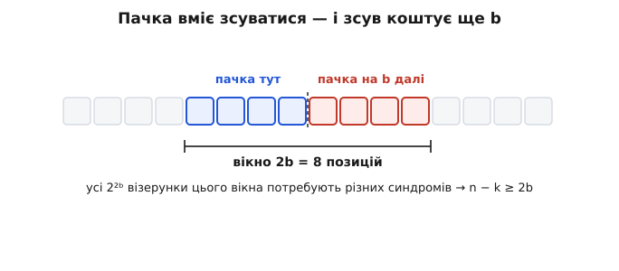
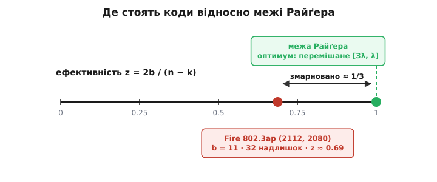

# 🧮 Межа Райґера: чому пачка коштує рівно вдвічі

<preknowlist>
- [Лінійні блокові коди](topic:communications/linear-block-codes) — код розбиває весь простір слів на суміжні класи (по одному синдрому на клас), а декодер зіставляє синдромові одну-єдину «дозволену» помилку в цьому класі. Уся межа тримається на простій лічбі цих класів.
- [Відстань Геммінга](topic:communications/hamming-distance) — мінімальна відстань коду й скільки помилок вона дає виправити; знадобиться, коли порівнюватимемо ціну пачки з ціною випадкових помилок.
</preknowlist>

Межа формулюється в одне речення: щоб гарантовано виправляти будь-яку пачку завширшки до `b`, лінійний код мусить віддати щонайменше **2b** перевірних символів. І одразу впадає в око той множник — **два**. Не `b`, не `b+1`, не `3b`, а рівно вдвічі більше за ширину пачки. Звідки він береться і чому так уперто саме два?

Відповідь не в глибокій алгебрі, а в майже дитячій лічбі — треба лише порахувати, скільки різних речей код зобов'язаний відрізняти одну від одної. Коли ця лічба стане на місце, проясниться не тільки чому множник дорівнює двом, а й дещо цінніше: чому одні коди сідають на цю межу впритул і вичавлюють із неї все, а інші — цілком робочі, ба навіть повсюдні — назавжди лишаються від неї на цілу третину осторонь.

## Що саме обіцяє код

Домовмося про слова точно, бо далі кожне важить. **Пачка завширшки `b`** — це помилка, усі перевернуті позиції якої вкладаються в якесь вікно з `b` сусідніх символів. Усередині вікна можуть бути й цілі символи; важлива не кількість перевернутих, а те, що всі вони тиснуться в смужку завширшки `b`. «Код виправляє всі пачки завширшки до `b`» означає: хоч би куди в слові така пачка впала й хоч би який візерунок вона мала, декодер відновлює точно те, що було відіслано.

Тепер згадаймо, як лінійний код узагалі щось виправляє. Він розбиває весь простір слів на **суміжні класи**: два слова лежать в одному класі тоді й лише тоді, коли їхня різниця — кодове слово, тобто коли вони дають **однаковий синдром**. Синдром — це все, що декодер бачить: він обчислює синдром прийнятого слова, за ним визначає клас і повертає з цього класу одну наперед призначену помилку (лідера класу). Отже код може виправити набір помилок тоді й лише тоді, коли всі вони **сидять у різних класах** — інакше дві помилки дали б однаковий синдром, і декодер не мав би змоги їх розрізнити.

Звідси вся задача стискається до одного питання, суто рахункового:

```
скільки пачок завширшки до b код зобов'язаний тримати в РІЗНИХ суміжних класах?
```

Скільки їх — стільки різних синдромів треба, а кількість різних синдромів у коду рівно `qⁿ⁻ᵏ` (для двійкового — `2ⁿ⁻ᵏ`). Уся межа Райґера вилущиться з цього рахунку. Але спершу — інтуїція, чому відповідь неминуче виходить удвічі більшою за `b`.

## Інтуїція: локалізувати коштує рівно стільки ж, скільки полагодити

Уявімо на мить, що хтось добрий підказав декодеру, **де саме** сидить пачка — дав готове вікно завширшки `b`, і лишилося тільки з'ясувати, які символи в ньому зіпсуто. Це вже не «помилка», а **стирання**: позиції відомі, невідомі лише значення. Полагодити `b` стертих символів — задача проста: це `b` невідомих, і щоб їх однозначно розв'язати, досить `b` перевірних символів (код виправляє `e` стирань, коли його мінімальна відстань перевищує `e`, тобто коли надлишку не менше `e`). Отже якби позиція пачки була відома наперед, ціна була б лише `b`, не `2b`.

Але канал мовчить про те, де він нашкодив. Знайти вікно — це **окрема робота**, і тут ховається вся сіль: локалізація коштує приблизно стільки ж, скільки сам ремонт, — ще `b`. Пачку треба спершу **знайти** (≈ `b`), а тоді **відновити** її вміст (≈ `b`); дві незалежні задачі — подвійна ціна.

```
позиція відома (стирання):   n − k ≥ b        полагодити b символів
позиція невідома (пачка):    n − k ≥ 2b       ще b — щоб її знайти
```

Другий `b` — це чистий податок на незнання, де вдарило. Такий самий податок платять і за випадкові помилки: виправити помилку завжди вдвічі дорожче, ніж заповнити стирання на тому ж місці, бо помилку треба ще й **виявити**. Ця інтуїція дає правильне число, але вона поки що махання руками — «локалізація коштує b» не виведено, а лише відчуто. Далі побачимо, як строгий рахунок класів робить цей другий `b` не метафорою, а точною величиною: пачка, що може зсунутися, змушує код розрізняти візерунки в вікні завширшки не `b`, а `2b`.

> 🔧 **Навіщо це.** Різниця між стиранням і помилкою — не абстракція, а важіль, за який тягнуть у реальних системах. Якщо приймач сам здатен **позначити**, де сталася біда — демодулятор знає, що на мить утратив синхронізацію; програвач компакт-диска знає, який кадр не прочитався, — то пачка з «помилки» перетворюється на «стирання», і бюджет коду на пачки миттю **подвоюється**: за той самий надлишок ви виправляєте вдвічі ширший провал. Тому декодери [Ріда–Соломона](topic:communications/reed-solomon) в CD, DVB й супутниковому мовленні навмисне приймають на вхід прапорці стирань від демодулятора — це найдешевший спосіб виторгувати назад той другий `b`, який межа Райґера бере за локалізацію.

## Формальний апарат: непересічні суміжні класи

Тепер зробімо інтуїцію строгою. Ключ до всього — одне спостереження про кодові слова.

**Твердження. У коді, що виправляє всі пачки завширшки до `b`, жодне ненульове кодове слово не буває пачкою завширшки до 2b.**

Доведімо. Нехай супротивно: є ненульове кодове слово `c`, і воно — пачка, тобто всі його ненульові символи вкладаються у вікно завширшки `L ≤ 2b`. Розріжмо це вікно навпіл: перші `b` позицій і решту `L − b ≤ b`. Позначмо `e₁` — частину `c` у першій половині, `e₂` — у другій. Обидві `e₁, e₂` — пачки завширшки до `b` (кожна вкладається у свою половину), їхні носії не перетинаються, і разом вони дають ціле:

```
c = e₁ + e₂        (носії роздільні, тож просто складаються)
```

А тепер придивімося. `c` — кодове слово, отже `e₁ = c − e₂`, тобто `e₁` і `−e₂` **відрізняються на кодове слово** — виходить, вони в одному суміжному класі. Але `e₁` — пачка завширшки до `b`, і `−e₂` теж (той самий носій, що й `e₂`). Якщо обидві ненульові, маємо дві **різні** пачки завширшки до `b` в одному класі — а це рівно те, чого код, за умовою, не допускає (він їх усі розводить по різних класах). Суперечність. Лишається випадок, коли одна половина порожня, скажімо `e₂ = 0`: тоді `c = e₁` — саме є ненульовою пачкою завширшки до `b`. Але `c` — кодове слово, отже воно в тому самому класі, що й нуль (клас самого коду), а нуль — це «жодної помилки», теж законна пачка (завширшки 0). Знову дві різні пачки — `c` і нуль — в одному класі, знову суперечність. Отже такого `c` немає: **короткої пачки-кодового-слова не існує**.

Звідси межа виводиться в один рух — простим підрахунком. Візьмімо всі слова, ненульові символи яких сидять у перших `2b` позиціях. Їх рівно `q²ᵇ` (у двійці — `2²ᵇ`): на кожну з `2b` позицій незалежно кладемо будь-який символ, решта позицій — нулі. Твердження: **усі вони в різних класах**. Справді, візьмімо два таких слова, `u ≠ v`. Їхня різниця `u − v` теж уся вкладена в перші `2b` позицій — тобто це пачка завширшки до `2b`. Якби `u` і `v` лежали в одному класі, ця різниця була б ненульовим кодовим словом-пачкою завширшки до `2b` — а щойно доведено, що такого не буває. Отже `u` і `v` — у різних класах.

Дістали `q²ᵇ` слів, кожне у своєму окремому класі. А всіх класів у коду рівно `qⁿ⁻ᵏ`. Частина не буває більшою за ціле:

```
q²ᵇ ≤ qⁿ⁻ᵏ        ⟹        n − k ≥ 2b
```



*Пачка може впасти будь-де, тож код мусить розрізняти дві сусідні пачки завширшки `b` — а вони разом накривають вікно завширшки `2b`. Усі `q²ᵇ` візерунки цього вікна зобов'язані мати різні синдроми; тому класів мусить бути не менше `q²ᵇ`, а це і є `n − k ≥ 2b`.*

Ось де інтуїтивний «другий `b`» набув точного тіла. Причина множника два — не в тому, що ремонт і локалізація магічно коштують порівну, а в тому, що **пачка вміє зсуватися**: пачка завширшки `b` при першому положенні й та сама пачка, зсунута на `b`, — це дві різні помилки, і різняться вони візерунком завширшки `2b`. Код, який тримає їх (і всі проміжні зсуви) у різних класах, змушений відрізняти геть усі `q²ᵇ` візерунки вікна `2b`. Половина вікна — «пачка тут», друга половина — «пачка на `b` далі»; саме через незалежність цих двох половин вікно виходить удвічі ширшим за пачку.

Варто оцінити, наскільки цей висновок міцний. Ми не припускали про код **нічого**, крім лінійності: ні циклічності, ні якоїсь особливої будови, ні алгебри над полем. Хоч би як хитро код було збудовано, обійти `n − k ≥ 2b` він не може — межа випливає з того, що частина не більша за ціле. І тримається вона над будь-яким алфавітом однаково: у формулі скрізь стоїть `q`, двійка тут не має жодного привілею.

### Дрібний приклад, де межа кусає

Перевірмо на пальцях, що буде, якщо надлишку забракне. Хай код має `n − k = 3` перевірні символи над двійкою — це `2³ = 8` різних синдромів. Спитаймо: чи виправить він усі пачки завширшки до `b = 2`? Межа каже ні, бо `2b = 4 > 3`. Побачмо це прямо. Пачок, чиї помилки сидять у перших `2b = 4` позиціях, є `2⁴ = 16` штук — а синдромів усього вісім. Шістнадцять слів у восьми класах: за принципом Діріхле щонайменше дві пачки неминуче падають в один клас, дають однаковий синдром — і декодер, побачивши цей синдром, не має жодного способу сказати, яка з двох сталася. Одну з них він неодмінно «виправить» не туди. Три перевірні символи фізично не вміщують чотирьох бітів невизначеності — і жодна кмітливість у виборі коду цього не змінить.

## Ефективність: наскільки надлишок працює на пачку

Межу зручно переписати як оцінку **корисності** надлишку. Якщо код витрачає `n − k` перевірних символів і виправляє пачки завширшки до `b`, означмо його **пачкову ефективність**:

```
z = 2b / (n − k)
```

Межа Райґера — це рівно твердження, що `z ≤ 1`. Величина `z` каже, яку частку свого надлишку код справді пускає на боротьбу з пачками, а яку марнує. Код, що досягає `z = 1`, звуть **оптимальним пачковим кодом**: у нього кожен перевірний символ працює на межі можливого, жоден не витрачено даремно. Код із `z = 0.5` віддає половину надлишку намарно — за ті самі перевірні символи оптимальний код ловив би вдвічі ширшу пачку.

Тепер `z` — наш мірний прут. Прикладімо його до двох способів робити пачкові коди й побачмо, хто де стоїть.



*Карта, якою пройдемося далі. Перемішане повторення `[3λ, λ]` сідає точно на стелю `z = 1` — жодного марного біта. Повсюдний Fire-код `802.3ap` тримається на `z ≈ 0.69`: третину надлишку він свідомо віддає за простоту й нульову затримку.*

## Перемішування сідає на межу впритул

Найдешевший спосіб приборкати пачку взагалі не потребує спеціального коду — досить [перемішування](topic:communications/interleaving). І що красиво: перемішування не просто «непогано працює», а **точно досягає** межі Райґера, якщо взяти за основу вже оптимальний малий код. Покажімо це числами, від найпростішого.

Візьмімо трикратне повторення — код `[3, 1]`: три біти на один інформаційний, кодові слова `000` і `111`. Голосуванням більшості він виправляє один перевернутий біт, тобто пачку завширшки `b = 1`. Порахуймо його ефективність: надлишок `n − k = 3 − 1 = 2`, отже `z = 2·1 / 2 = 1`. Повторення `[3,1]` **уже оптимальне** — на межі. (Це, до речі, пояснює, чому код Геммінга, попри всю свою елегантність, для пачок не оптимальний: у нього `n − k = 3` при `b = 1`, тобто `z = 2/3`. Повторення тут виграє.)

А тепер перемішаймо це повторення завглибшки `λ`. Складаємо `λ` кодових слів `[3,1]` у таблицю з `λ` рядків і трьох стовпців, а в ефір відсилаємо **не рядок за рядком, а стовпець за стовпцем**. Що це дає? Погляньмо, куди падає пачка завдовжки `λ` бітів ефіру. Ефір іде так: спершу весь перший стовпець (по одному біту з кожного з `λ` рядків), тоді другий, тоді третій. `λ` підряд узятих бітів ефіру — це хвіст одного стовпця плюс початок наступного, і разом вони зачіпають кожен рядок **рівно один раз**:

```
три слова [3,1] — рядки A, B, C; у ефір ідемо стовпець за стовпцем:

               стовпець 0   стовпець 1   стовпець 2
   слово A         1            4            7
   слово B         2            5            8
   слово C         3            6            9

пачка = слоти 3,4,5  →  слово C (слот 3), слово A (слот 4), слово B (слот 5)
                        по ОДНІЙ помилці в кожному слові
```

Кожне слово `[3,1]` дістає щонайбільше одну помилку — а одну воно лагодить. Отже перемішане повторення виправляє будь-яку пачку завширшки `b = λ`. А надлишок його — `λ` слів по два перевірні біти, тобто `n − k = 2λ`. Складаємо:

```
b = λ,   n − k = 2λ   ⟹   z = 2λ / 2λ = 1
```

![Таблиця 3×3 з рядків-слів [3,1], передавана стовпцями; пачка з трьох слотів ефіру лягає по одному в кожен рядок, унизу підрахунок b=3, n−k=6, z=1](img/interleave-meets-bound.svg)

*Перемішування завглибшки 3 перетворює оптимальне повторення `[3,1]` на оптимальний пачковий код `[9,3]`. Пачка з трьох слотів ефіру, хоч би де вона почалася, зачіпає кожне слово рівно раз — по одній виправній помилці. Надлишок `n − k = 6` рівно дорівнює `2b = 6`, тож `z = 1`: код сидить точно на межі Райґера.*

Оптимальне залишилося оптимальним. І це не випадковість цього прикладу, а загальне правило: перемішування завглибшки `λ` перетворює `(n, k)`-код, що виправляє пачки завширшки `b`, на `(λn, λk)`-код, що виправляє пачки завширшки `λb`, — і **множить `b` та `n − k` на те саме `λ`**. Ефективність `z = 2b/(n−k)` при цьому не зрушується ні на йоту. Тому: узяли оптимальний цеглинку-код — дістали оптимальний код будь-якого потрібного розмаху пачки. Перемішування — не латка й не милиця, а точний, межу-досяжний спосіб масштабувати захист від пачок, зібраний із найдешевших однопомилкових кодів.

Платня за це — не надлишок (його `z` тримає ідеальним), а **затримка й пам'ять**: щоб розкидати пачку завширшки `λb`, треба спершу набрати в буфер цілу таблицю з `λ` слів на обох кінцях. Глибина проти латентності — ось де перемішування бере свою ціну, а зовсім не в перевірних символах.

## Fire-коди: близько, але не впритул

А тепер протилежний полюс — коди, скроєні під пачку зумисне, як єдине цілісне кодове слово, без жодного перемішування. Класика тут — **Fire-коди** (циклічні коди, що ловлять одну пачку). Вони прекрасні інженерно: кодуються й декодуються одним коротким зсувним регістром, без буферів і без затримки перемішування — усе замкнено в межах одного блоку. Але за цю простоту доводиться платити ефективністю.

Fire-код, що виправляє пачки завширшки до `b`, вимагає надлишку

```
n − k = 3b − 1        (для чистого виправлення)
z = 2b / (3b − 1)  →  2/3
```

Тобто десь **дві третини** — і ні на крок ближче до одиниці, хоч як збільшуй `b`. Третину надлишку Fire-код відпускає намарно проти оптимального.

Це не суха теорія — рівно так стоять коди в живому залізі. Форвардна корекція для 10-гігабітного Ethernet по мідній підкладці (стандарт IEEE 802.3ap, 10GBASE-KR) використовує вкорочений Fire-код `(2112, 2080)`. Порахуймо його прямо:

```
надлишок  n − k = 2112 − 2080 = 32 біти
виправляє пачку завширшки  b = 11 бітів
перевірка формули Fire:  3b − 1 = 3·11 − 1 = 32   ✓ точно
ефективність:  z = 2·11 / 32 = 22 / 32 = 0.6875
```

Межа Райґера каже, що на пачку завширшки 11 у принципі досить `2b = 22` перевірних бітів. Fire-код бере 32 — на десять більше, ніж теоретичний мінімум, і сидить на `z ≈ 0.69`. Ці зайві десять бітів — не помилка конструктора, а свідома плата за те, що весь захист замкнено в одному блоці, без пам'яті перемішувача й без його затримки. Оптимальність — розкіш, і коли важливіші простота та нульова латентність, її свідомо не купують. Саме тут межа Райґера з абстрактної нерівності перетворюється на робочий прут, яким міряють, скільки ти лишив на столі: 22 проти 32, третина.

## Проти меж для випадкових помилок

Лишилося поставити межу Райґера поряд із її двоюрідними — межами на **випадкові** (розсіяні) помилки, — бо саме в цьому сусідстві видно, що вона насправді говорить.

Найпростіша з них — [межа Сінглтона](topic:math/coding-bounds): у будь-якого коду мінімальна відстань не більша за `n − k + 1`. Оскільки, щоб виправляти `t` випадкових помилок, потрібна відстань щонайменше `2t + 1`, звідси одразу випливає `n − k ≥ 2t`. Погляньте на це число — знову **двійка**, той самий множник, що й у Райґера. І з тієї самої причини: виправити одну випадкову помилку означає і **знайти** її позицію, і **відновити** значення — два синдромні символи на помилку. Коди [Ріда–Соломона](topic:communications/reed-solomon) досягають цієї межі точно (їх звуть MDS-кодами): за `n − k = 2t` вони виправляють будь-які `t` символьних помилок, жодного надлишку намарно.

Отже і Сінглтон, і Райґер дають однакову формулу «двічі по стільки». Уся різниця — в **одиниці ліку**. Сінглтон рахує **окремі** розсіяні помилки: `2` на кожну незалежну помилку. Райґер рахує **розмах однієї купи**: `2` на кожну одиницю ширини пачки. Пачка завширшки `b` може нести до `b` перевернутих символів — але вони суцільні, а це мізерна дещиця всіх візерунків вагою `b`. І все ж Райґер бере за неї ті самі `2b`, що Сінглтон бере за `b` **будь-де** розкиданих помилок.

То де ж тоді виграш від пачкового припущення? Він у тому, чого коштує альтернатива над **бітами**. Над символами (Рід–Соломон, MDS) обидві межі збігаються, і один код робить усе: за `n − k = 2t` він і `t` символьних помилок виправить, і будь-яку пачку, що вкладається в `t` символів, — оптимально в обох сенсах. А от над бітами двійкові коди від Сінглтона далеко (нетривіальних двійкових MDS-кодів не буває): щоб виправити `b` **довільно** розкиданих бітових помилок, двійковий код (той-таки BCH) з'їдає надлишку куди більше за `2b` — порядку `b·log₂n`. Пачкове ж припущення дозволяє заплатити рівно `2b`. Ось де справжня економія: не в тому, що пачку легше полагодити, ніж стільки ж розсіяних помилок, а в тому, що припущення «помилки суцільні» звужує коло візерунків, які код мусить розрізняти, з астрономічного до вузенької смужки завширшки `2b`.

Ту саму думку інакше показує [межа упаковки куль (Геммінга)](topic:communications/perfect-codes/math-sphere-packing-bound.md). Вона теж вимагає різних синдромів — але для **обсягу** всіх розсіяних візерунків: `n − k ≥ log_q V`, де `V` — скільки різних помилок вагою до `t` треба розвести по класах, а це сума біноміальних коефіцієнтів, число величезне. Для пачки ж «обсяг», який треба розвести, — лише суцільні візерунки одного вікна, `q²ᵇ` штук, і жодного біноміального роздування. Механізм той самий — різні синдроми для всього, що конче відрізнити, — але ціль незмірно менша, і тому підлога надлишку опускається так низько.

Отже всі три — Сінглтон, Геммінг, Райґер — це одна ідея в трьох одежах: **дай різні синдроми всьому, що мусиш розрізняти, і заплати надлишком не менше за логарифм від того, скільки цього «всього»**. Різняться вони лише тим, що саме треба розрізняти: будь-які `t` помилок (Сінглтон), увесь обсяг помилок вагою до `t` (Геммінг) чи будь-яку купу розмахом `b` (Райґер). А множник два в Райґері — це податок на локалізацію, той самий, що перетворює `b` стирань на `2b` для помилок.

## Що лишається в руках

Уся конструкція трималася на одному прийомі — **порахувати, скільки речей потребують різних синдромів**, — і застосований він двічі: до кулі коротких кодових слів (їх немає) і до вікна завширшки `2b` (їх `q²ᵇ`). Звідси все:

```
корекція пачки завширшки b:   n − k ≥ 2b          межа Райґера (будь-який лінійний код)
ефективність:                 z = 2b/(n−k) ≤ 1    частка надлишку, що працює на пачку
оптимум (z = 1):              перемішане повторення [3λ, λ] — сідає точно
Fire-коди:                    n − k = 3b − 1,  z → 2/3   (802.3ap: b=11, 32 надл., z≈0.69)
відома позиція (стирання):    n − k ≥ b           удвічі дешевше, ніж помилка
```

І одна думка, варта того, щоб носити її в голові: множник **два** в межі Райґера — це ціна незнання, де вдарила пачка. Половину надлишку код віддає на ремонт, другу половину — на пошук місця. Скажіть коду, де шукати (прапорець стирання), — і друга половина вивільниться, а бюджет на пачки подвоїться. У цьому проста арифметика всієї теми: пачка коштує вдвічі за свою ширину рівно тому, що вміє зсуватися, і код мусить бути готовий до неї в кожному положенні нараз.

---

Одне слово про ім'я. Межу вивів **S. H. Reiger** у праці «Codes for the Correction of "Clustered" Errors» (IRE Transactions on Information Theory, том IT-6, с. 16–21, 1960) — тож правильно вона межа **Райґера**. У світовій літературі її суціль пишуть «Rieger bound», переставивши місцями `i` та `e`; це усталена друкарська помилка, а не друге прізвище — автор підписувався саме Reiger. Факт добре задокументований першоджерелом, хоча хибне написання так і кочує підручниками досі.
