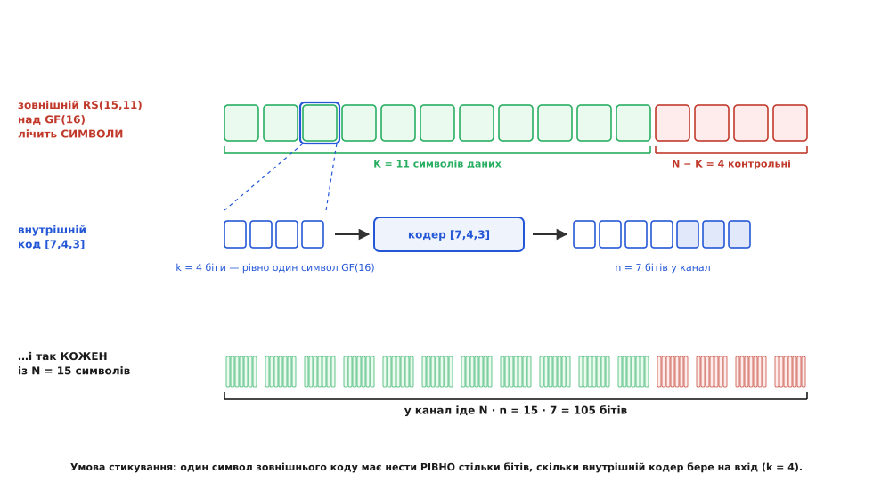
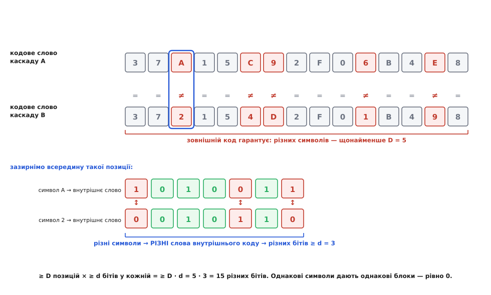
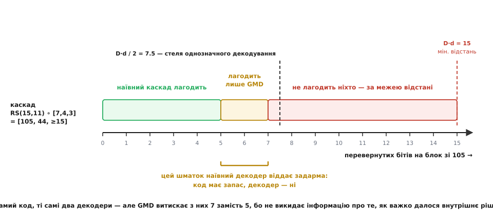

# 🧮 Математика каскаду: звідки беруться добутки

<preknowlist>
- [Відстань Геммінга](topic:communications/hamming-distance) — число позицій, у яких два слова різняться; мінімальна відстань коду — найменша відстань між двома його кодовими словами.
- [Лінійні блокові коди](topic:communications/linear-block-codes) — запис [n, k, d]: у канал іде n символів, k із них несуть дані; у лінійного коду мінімальна відстань дорівнює найменшій вазі ненульового кодового слова.
- [Рід–Соломон](topic:communications/reed-solomon) — код над скінченним полем GF(2ᵏ), що лічить не біти, а символи; MDS-код, тож його відстань D = N − K + 1.
- [Код Геммінга](topic:communications/hamming-code) — [7,4,3]: чотири біти даних, три контрольні, виправляє один перевернутий біт.
</preknowlist>

Будь-який блоковий код описують три числа: **довжина** n (скільки символів іде в канал), **розмірність** k (скільки з них несуть дані) і **мінімальна відстань** d (найтісніший просвіт між двома кодовими словами). Пишуть їх укупі — [n, k, d]. Зчепивши два коди, дістаємо третій, і його трійка не береться зі стелі: вона **обчислюється** з трійок вихідних кодів. Причому всі три числа складаються **множенням** — довжини, швидкості, відстані. Це не збіг і не мнемонічна вигадка: у кожному з трьох випадків працює той самий механізм, просто повернутий іншим боком. Розберімо його від першопричини — і побачимо заразом, де добуток дається задарма, де за нього платять, і чому найочевидніший спосіб декодувати каскад викидає рівно половину купленого.

## Умова стикування: чому два коди взагалі можна скласти

Почнімо з речі, яку легко проґавити, хоч на ній тримається вся конструкція. Два довільні коди зчепити **не можна**. Щоб каскад склався, між ними має бути точний стик, і саме він народжує всі добутки.

Зовнішній код працює над **великим алфавітом**. Візьмімо [Рід–Соломона](topic:communications/reed-solomon) над полем GF(16): його «літера» — не біт, а елемент поля, тобто одна з шістнадцяти можливих величин. Позначмо його параметри великими літерами: **[N, K, D]** — N символів на кодове слово, K символів даних, мінімальна відстань D символів.

Внутрішній код працює над **бітами**: **[n, k, d]** — бере k бітів, віддає n, мінімальна відстань d бітів.

Стик такий: **один символ зовнішнього коду має нести рівно стільки бітів, скільки внутрішній кодер бере на вхід.** Символ GF(16) — це чотири біти (бо 16 = 2⁴), тож внутрішній код мусить брати на вхід рівно чотири. [Код Геммінга](topic:communications/hamming-code) [7,4,3] бере чотири. Отже, RS над GF(16) і Геммінг [7,4,3] стикуються — не бо хтось так вирішив, а бо **k у внутрішнього коду збігається з k у показнику 2ᵏ зовнішнього алфавіту**. Ця одна буква k і є замком, що тримає каскад.

```
умова стикування:
  зовнішній код над алфавітом GF(2ᵏ)   ← символ несе рівно k бітів
  внутрішній код бере на вхід k бітів   ← той самий k

приклад: GF(2⁴) = GF(16)  ↔  внутрішній [7, 4, 3]
         4 = 4 ✓ — стикуються
```


*Як складається каскад RS(15,11) над GF(16) з внутрішнім [7,4,3]. Угорі — кодове слово зовнішнього коду: 15 символів, з них 11 даних і 4 контрольні; лічба тут іде в символах. Посередині — зум на один символ: чотири його біти — це рівно те, що бере на вхід внутрішній кодер, і на виході він дає сім. Унизу — те саме з кожним із 15 символів; у канал іде 15 · 7 = 105 бітів. Умова стикування (4 = 4) і є тим, завдяки чому конструкція взагалі складається.*

Тепер вивести всі три добутки — справа кількох рядків, бо картинка вже все каже.

## Довжина й розмірність: добуток без жодного дива

Зовнішній кодер віддає N символів. Кожен із них внутрішній кодер розгортає в n бітів. Скільки бітів піде в канал? N разів по n:

```
довжина каскаду:   nN бітів
```

Так само з даними. На вхід іде K символів зовнішнього коду, у кожному k бітів корисних даних:

```
розмірність каскаду:   kK бітів даних
```

Отже, каскад — це двійковий код **[nN, kK, ≥ dD]** — трійка, у якій кожна складова є добутком. Тут добуток очевидний до нудьги: множення просто рахує «скільки чогось у чомусь». Ця нудьга, однак, і є ключем — саме на ній стоять два наступні добутки, менш очевидні.

## Швидкість: добуток двох часток, що вижили

Швидкість коду R — частка каналу, зайнята корисними даними. Порахуймо її для каскаду прямо за означенням:

```
R = дані / канал = kK / (nN) = (K/N) · (k/n) = Rзовн · Rвнутр
```

Алгебра тривіальна, та за нею стоїть точна фізична думка, і варто її вимовити. **Швидкість — це не величина, а частка вцілілого.** Зовнішній код пропускає крізь себе частку K/N корисного вмісту; те, що вийшло, внутрішній код пропускає ще з часткою k/n. Частки, накладені одна на одну, **перемножуються** — так само, як два світлофільтри в стовпчику: перший лишає половину світла, другий — половину від того, що дійшло, разом чверть. Не три чверті: другий фільтр не знає й не може знати, що перший уже щось забрав, він просто ріже свою частку від того, що бачить.

Звідси одразу випливає найнеприємніший наслідок каскаду, і його краще зрозуміти зараз, ніж здивуватися потім: **надлишок теж перемножується**. Зовнішній RS(15,11) сам собою ощадний — лишає 73 % каналу під дані. Внутрішній [7,4,3] теж не марнотрат — лишає 57 %. А разом вони лишають 42 %: менш ніж половина каналу зайнята даними, хоч жоден із двох такої жадоби не виявляв. Каскад дорогий не тому, що хтось погано його спроєктував, а тому, що інакше й бути не може: шари не діляться платою, кожен бере своє повністю.

```
приклад: зовнішній RS(15,11) + внутрішній [7,4,3]

  Rзовн  = K/N = 11/15 ≈ 0.7333
  Rвнутр = k/n = 4/7   ≈ 0.5714
  Rкаскаду = 0.7333 · 0.5714 ≈ 0.4190

звірка навпростець:  kK / (nN) = 44 / 105 ≈ 0.4190 ✓
```

## Відстань: межа-добуток Форні

А тепер найцікавіше — і найглибше. Швидкість і довжина перемножилися майже механічно. Мінімальна відстань — інша річ: вона не «скільки чогось у чомусь», а **геометрична** властивість, найтісніший просвіт між двома кодовими словами. Чому б їй перемножуватися?

Спершу згадаймо, чому відстань узагалі важлива. Канал перевертає біти й тим зсуває надіслане слово вбік. Поки зсув менший за півдороги до найближчого сусіда, приймач ще розрізняє, звідки слово прийшло, — надіслане лишається найближчим. Тому мінімальна відстань d — це не абстракція, а прямий бюджет виправлення: код гарантовано лагодить ⌊(d−1)/2⌋ помилок. Відстань і є тим, що ми насправді купуємо кодом.

Тепер — доведення добутку. Воно коротке, і в цій короткості вся краса.

Візьмімо **два різні** повідомлення і простежмо, що з ними станеться.

**Крок перший.** Різні повідомлення зовнішній кодер переводить у **різні** кодові слова (кодер — взаємно однозначний, інакше повідомлення було б не відновити). Два різні кодові слова зовнішнього коду різняться щонайменше в **D** символьних позиціях — це просто означення його мінімальної відстані.

**Крок другий.** Погляньмо на одну таку позицію, де символи різні: скажімо, a ≠ b. Внутрішній кодер відображає a ↦ Свнутр(a) і b ↦ Свнутр(b). Оскільки a ≠ b, а кодер взаємно однозначний, це **два різні кодові слова внутрішнього коду**. А два різні слова внутрішнього коду різняться щонайменше в **d** бітах — знову просто за означенням його мінімальної відстані.

**Крок третій.** Позиції, де зовнішні символи **однакові**, дають однакові біти — рівно нуль різниць. Вони нічого не додають, але й нічого не псують.

**Підсумок.** Щонайменше D позицій, у кожній щонайменше d різних бітів:

```
dкаскаду ≥ D · d
```


*Схема доведення межі-добутку. Угорі й посередині — два кодові слова каскаду, показані на рівні символів (шістнадцяткові цифри = елементи GF(16)); зовнішній код гарантує, що різних символів щонайменше D = 5. Унизу — зум на одну таку позицію: символи A і 2 різні, тож внутрішній кодер дає два РІЗНІ слова коду Геммінга — 1010011 і 0010110, а вони різняться рівно в трьох бітах, тобто в d = 3. Позиції з однаковими символами дають однакові блоки й додають нуль. Разом: щонайменше 5 · 3 = 15 різних бітів.*

Ось де захована відповідь на «чому саме добуток». Не в алгебрі — в **одиницях лічби**. Зовнішній код рахує свій запас у **символах**: він обіцяє «щонайменше D монет різниці». Внутрішній код не додає монет — він **встановлює курс**: «кожна монета варта щонайменше d бітів». Добуток кількості на курс і дає багатство. Додавання вийшло б, якби коди стояли **поруч**, кожен зі своїм надлишком збоку; множення виходить, бо вони **вкладені** — одиниця лічби зовнішнього коду є цілим кодовим словом внутрішнього. Каскад — це не сума двох захистів, а **зміна валюти**, і саме тому з двох скромних кодів виходить один розкішний.

> 🔧 **Навіщо це.** Придивіться, на чому насправді тримається доведення: на **взаємній однозначності внутрішнього кодера**. Якби два різні символи зовнішнього коду відображалися в те саме внутрішнє слово, крок другий завалився б — різниця в символах дала б нуль різниці в бітах, і вся будівля впала б до d = 0. Це не педантизм, а робоче застереження: варто внутрішньому шарові десь злити два різні входи в один вихід (скажімо, через невдале виколювання бітів заради швидкості), і межа-добуток перестає діяти — тихо, без жодного повідомлення про помилку. У багатошаровій конструкції **найтихіша поломка — та, де нижній шар перестає розрізняти те, що верхній вважає різним.**

## Чому «щонайменше», а не «рівно»

Знак «≥» у D · d — не боязкість автора, і його варто прочитати уважно, бо він каже дещо про природу оцінки.

Річ у тім, що доведення всюди бере **найгірший** випадок. Воно припускає, що різних символьних позицій рівно D — а їх може бути більше. Воно припускає, що в кожній такій позиції внутрішні слова різняться рівно в d бітах — а вони можуть різнитися дужче. Реальна відстань каскаду — це мінімум по всіх парах кодових слів від суми справжніх бітових різниць, і ця сума майже завжди перевищує D · d.

Для **лінійних** кодів картина прозоріша. У лінійного коду мінімальна відстань дорівнює найменшій **вазі** ненульового кодового слова, тож досить порівнювати кожне слово з нулем:

```
вага слова каскаду = Σ ваг внутрішніх блоків усіх НЕнульових символів

нехай зовнішнє слово має вагу w (ненульових символів — w штук):
  кожен ненульовий символ → ненульове слово внутрішнього коду → вага ≥ d
  нульовий символ → нульовий блок → вага 0

  вага ≥ w · d ≥ D · d      (бо w ≥ D за означенням D)
```

Рівність настала б лише за подвійного збігу: мусить існувати зовнішнє слово ваги **рівно** D, у якого **всі** D ненульових символів переходять у внутрішні слова ваги **рівно** d. Збіг не безнадійний — у MDS-кодів на кшталт Рід–Соломона слів мінімальної ваги багато, і вибір значень символів широкий, — але й не гарантований. Тому D · d беруть як **проєктну гарантію**: те, на що можна спертися, не рахуючи справжньої відстані (а порахувати її для коду завдовжки 105 бітів уже недешево). У цьому й користь межі: вона дає **число, за яке можна відповідати**, не заглядаючи всередину.

## Скільки помилок це лагодить — і де наївний декодер губить половину

Зберімо приклад докупи. RS(15,11) над GF(16), зчеплений із Геммінгом [7,4,3]:

```
зовнішній RS(15,11) над GF(16):  N=15, K=11, D = N−K+1 = 5   (MDS)
внутрішній [7,4,3]:              n=7,  k=4,  d = 3

каскад:  довжина  nN = 7 · 15 = 105 бітів
         дані     kK = 4 · 11 = 44 біти
         швидкість  44/105 ≈ 0.419
         відстань   ≥ D·d = 5 · 3 = 15

→ гарантована стеля однозначного декодування:
     ⌊(15 − 1) / 2⌋ = 7 перевернутих бітів на блок зі 105
```

Сорок чотири біти даних, п'ятнадцять відстані. Одинак такої відстані на такій довжині коштував би незрівнянно дорожче — а тут вона склалася з коду, що лагодить **одну** помилку, і коду, що лагодить **дві**. Обіцянка виконана.

Тепер спробуймо цю обіцянку **отримати**. Найприродніший спосіб декодувати каскад — той самий, яким його кодували, тільки навпаки: спершу кожен із 15 блоків прогнати крізь внутрішній декодер, тоді 15 отриманих символів — крізь зовнішній. Порахуймо, що з цього вийде.

```
внутрішній [7,4,3] лагодить  tвнутр = ⌊(3−1)/2⌋ = 1 біт на блок
зовнішній RS(15,11) лагодить tзовн  = ⌊(5−1)/2⌋ = 2 символи на слово

коли наївний каскад падає?
  блок із 2 помилками — внутрішній декодер не витягне: віддасть НЕ ТОЙ символ
  трьох таких блоків досить, щоб перевищити tзовн = 2

найдешевша атака: 3 блоки × 2 помилки = 6 перевернутих бітів
→ гарантія наївного декодера: (tзовн + 1)·(tвнутр + 1) − 1 = 3 · 2 − 1 = 5 бітів
```

Ось де прикро. Код має відстань 15 і **як код** тримає 7 помилок. А наївний декодер здається на **шостій**. Шість бітів — це менше, ніж половина від того, за що вже заплачено швидкістю каналу; запас лежить у коді, просто дістати його цим способом не виходить. І це не дрібниця масштабу: у загальному вигляді (tзовн+1)(tвнутр+1) ≈ D·d/4, тоді як відстань дає D·d/2. **Наївне почергове декодування викидає рівно половину.**


*Скільки перевернутих бітів на блок зі 105 витримує каскад RS(15,11) ∘ [7,4,3]. Зелена зона — гарантія наївного почергового декодування: п'ять бітів, далі трьох блоків по дві помилки досить, щоб зовнішній код захлинувся. Бурштинова смуга — те, що код має, а наївний декодер не бере: шоста й сьома помилки. Червона зона — за межею D·d/2 = 7.5, там уже жоден декодер не розрізнить, звідки слово прийшло. GMD витискає з тих самих двох кодів усі сім.*

Чому так виходить? Бо внутрішній декодер **викидає інформацію**. Він відповідає «символ — A» з тим самим кам'яним обличчям і тоді, коли блок прийшов чистим, і тоді, коли довелося тягти його за вуха з відстані одиниці. Зовнішній код бачить п'ятнадцять однаково впевнених свідчень, хоч насправді троє з них — здогади. **Утрачено не біти, а зізнання.**

## Обмін: чому стирання коштує вдвічі дешевше за помилку

Перш ніж лагодити цю ваду, потрібен інструмент — і він варт окремої хвилини, бо це один із найкорисніших фактів усього кодування.

Коду з мінімальною відстанню D можна згодувати не лише помилки, а й **стирання** — позиції, про які відомо, що вони зіпсовані, хоч і невідомо, на що саме. І бюджет виглядає так:

```
код відстані D дає раду e помилкам і s стиранням, якщо   2e + s < D
```

Помилка коштує **два**, стирання — **один**. Звідки саме двійка? Виведімо. Викиньмо s стертих позицій зовсім — лишиться коротший код, і його відстань упала щонайбільше на s (кожна викинута позиція забирає не більш як одну одиницю різниці):

```
відстань після викидання s позицій  ≥  D − s
у цьому коротшому коді лагодимо  ⌊(D − s − 1)/2⌋ помилок

умова:  e ≤ ⌊(D − s − 1)/2⌋   ⟺   2e ≤ D − s − 1   ⟺   2e + s < D  ∎
```

Різниця в ціні має точний сенс. Стирання забирає одну одиницю бюджету, бо просто **зникає** з порівняння. Помилка забирає дві, бо шкодить двічі: вона й тягне слово геть від правильного сусіда, і водночас **тягне його до хибного** — назустріч. Позиція, про яку відомо, що вона брехлива, нікуди не тягне; позиція, що бреше непомітно, тягне в обидва боки. Ось чому «десь тут щось не так» удвічі цінніше за мовчазну брехню.

Для RS(15,11) з D = 5 це означає: 2 помилки, або 4 стирання, або 1 помилку + 2 стирання. Чотири стирання проти двох помилок — **удвічі більше полагоджених позицій за ту саму відстань**.

## GMD: як Форні повернув утрачену половину

Тепер видно, куди бити. Внутрішній декодер знає, **як важко** йому далося рішення, — просто нікому про це не каже. Треба лише змусити його зізнатися й перевести зізнання у стирання, які зовнішній код бере за півціни.

Це й зробив [Дейвід Форні](topic:communications/concatenated-codes/hist-forney-concatenation.md) 1966 року, назвавши свій алгоритм **узагальненим декодуванням за мінімальною відстанню** — GMD (*generalized minimum distance*). Опубліковано його того самого року, що й монографію про каскади, окремою статтею в IEEE Transactions on Information Theory (том IT-12, с. 125–131); це, за поширеною оцінкою, взагалі перший приклад декодування за м'яким рішенням. Атрибуція тут безсумнівна: обидві роботи Форні 1966 року, обидві доступні.

**Міра непевності.** Нехай для блоку i внутрішній декодер обрав найближче слово й віддав символ y′ᵢ. Візьмімо за міру його непевності відстань від прийнятого блоку до обраного слова, обрізану згори половиною відстані:

```
wᵢ = min( Δ(yᵢ, Свнутр(y′ᵢ)), d/2 )

  wᵢ = 0    — блок прийшов чистим: декодер нічого не виправляв, певність повна
  wᵢ велике — довелося тягти здалеку: рішення сумнівне
```

Обрізання на d/2 — не косметика. Далі d/2 непевність **насичується**: за півдороги між двома словами вже байдуже, наскільки саме ти заблукав, — гірше, ніж «однаково близько до двох», не буває. Тримати за цією межею більші числа значило б удавати, ніби ми розрізняємо ступені повного незнання.

**Ключова лема.** Ця міра — не інтуїція, а величина з доведеною властивістю. Нехай eᵢ — справжнє число перевернутих бітів у блоці i. Тоді:

```
якщо y′ᵢ — ПРАВИЛЬНИЙ символ:   eᵢ ≥ wᵢ
якщо y′ᵢ — ХИБНИЙ символ:        eᵢ ≥ d − wᵢ
```

Перший випадок майже тавтологія: коли декодер угадав, Свнутр(y′ᵢ) і є надіслане слово, тож Δ(yᵢ, Свнутр(y′ᵢ)) = eᵢ, а wᵢ — це eᵢ, ще й обрізане згори.

Другий випадок — нерівність трикутника. Хибне слово Свнутр(y′ᵢ) і надіслане cᵢ — два різні слова внутрішнього коду, тож між ними щонайменше d. Дорога від одного до одного веде повз прийняте yᵢ:

```
d ≤ Δ(Свнутр(y′ᵢ), cᵢ) ≤ Δ(Свнутр(y′ᵢ), yᵢ) + Δ(yᵢ, cᵢ) = Δ(Свнутр(y′ᵢ), yᵢ) + eᵢ
→ eᵢ ≥ d − Δ(Свнутр(y′ᵢ), yᵢ) ≥ d − wᵢ
```

(А в обрізаному випадку wᵢ = d/2 працює ще простіше: y′ᵢ — **найближче** слово, тож eᵢ = Δ(yᵢ, cᵢ) ≥ Δ(yᵢ, Свнутр(y′ᵢ)) ≥ d/2 = d − wᵢ.)

Прочитаймо лему по-людськи. Вона каже: **хибний символ не буває дешевим**. Щоб декодер збрехав упевнено (мале wᵢ), каналові довелося затягти блок аж під саме хибне слово — а це щонайменше d − wᵢ перевернутих бітів. Дешева брехня неможлива: або брехня дорога каналові, або вона видна по wᵢ. Саме тому wᵢ — чесний свідок, а не здогад.

**Алгоритм.** Далі — простий перебір порогів. Для кожного θ стираємо всі блоки з wᵢ ≥ θ, решту віддаємо зовнішньому декодерові з помилками й стираннями. Оскільки wᵢ пробігає лише значення 0, 1, …, ⌊d/2⌋, різних порогів усього близько d/2 — тобто зовнішній декодер треба запустити не більш як пів десятка разів.

**Чому хоч один поріг спрацює.** Найпрозоріше це видно, якщо на мить стирати блок **навмання** — з імовірністю 2wᵢ/d (чистий блок не стираємо ніколи, безнадійний — завжди). Порахуймо середню вартість того, що дістанеться зовнішньому декодерові:

```
E[2e′ + s] = Σ(хибні) 2·(1 − 2wᵢ/d)  +  Σ(усі) 2wᵢ/d
           = Σ(хибні) (2/d)·(d − wᵢ)  +  Σ(правильні) (2/d)·wᵢ
           ≤ Σ(хибні) (2/d)·eᵢ        +  Σ(правильні) (2/d)·eᵢ     ← ключова лема
           = (2/d) · Σ eᵢ  =  2e/d

отже, якщо помилок e < D·d/2, то  E[2e′ + s] < D
```

Обидва рядки леми зійшлися в одну оцінку — і ось де окупився обрізаний максимум: він рівно врівноважує два випадки. Якщо **середнє** значення 2e′ + s менше за D, то знайдеться бодай один набір стирань, де воно менше за D, — а це саме умова, за якої зовнішній код дає раду. Далі зникає й випадковість: величина 2e′ + s лінійна за рішеннями «стирати чи ні», а лінійна функція на кубі досягає мінімуму в **вершині** — тобто саме на пороговому наборі. Тому досить перебрати ті кілька порогів.

**Теорема Форні.** GMD виправляє **будь-який** набір із менш ніж D·d/2 помилок — за ціну одного внутрішнього декодування на блок плюс близько d/2 запусків зовнішнього декодера. Утрачена половина повернулася, і повернулася дешево.

## Той самий приклад, розібраний до кінця

Погляньмо, як GMD рятує саме ту атаку, що вбила наївний декодер. Каскад RS(15,11) ∘ [7,4,3]. Кидаємо **сім** помилок: три блоки по дві плюс один блок з однією.

Одна обставина зробить розбір точним до останнього числа. Геммінг [7,4,3] — [досконалий код](topic:communications/perfect-codes): кулі радіуса 1 навколо його шістнадцяти кодових слів устеляють увесь простір із 128 семибітних слів без просвітів і без перекриттів (16 · (1 + 7) = 128). Тому будь-яке прийняте слово лежить на відстані ≤ 1 рівно від **одного** кодового — і декодер **ніколи не вагається**: він завжди впевнено називає символ, навіть коли називає хибний. Для нас це зручно: обидві величини wᵢ рахуються точно, без «а що, як».

```
блоки з 2 помилками (3 шт.):
  Геммінг [7,4,3] — досконалий код: кожне слово простору лежить на відстані ≤1
  рівно від ОДНОГО кодового слова. Тож блок із 2 помилками опиняється за 1
  від ЧУЖОГО слова → декодер упевнено віддає ХИБНИЙ символ, а wᵢ = min(1, 1.5) = 1

блок з 1 помилкою (1 шт.):
  декодер виправляє правильно → символ ПРАВИЛЬНИЙ, але wᵢ = min(1, 1.5) = 1

чисті блоки (11 шт.):
  Δ = 0 → wᵢ = 0

наївний декодер:  3 хибні символи > tзовн = 2  →  ПАДІННЯ

GMD, поріг θ = 1 — стерти всі блоки з wᵢ ≥ 1:
  стерто s = 4 блоки (3 хибні + 1 правильний)
  серед нестертих помилок немає: e′ = 0
  перевірка бюджету:  2·0 + 4 = 4 < D = 5  ✓  →  RS відновлює все
```

Зверніть увагу на дрібницю, у якій уся суть. GMD стер і **невинний** блок — той, що декодувався правильно. І це не завадило: стирання коштує один, у бюджеті D = 5 його стало на чотири. **Помилятися в бік обережності дешево** — саме тому обмін працює. Наївний декодер тримався за три хибні символи, як за правду, і програв на шести помилках; GMD засумнівався в чотирьох (зокрема в одному даремно) і виграв на семи.

## Ціна добутку

Насамкінець — тверезий погляд, бо з усього сказаного легко зробити хибний висновок, ніби добуток є вигодою в усьому.

Порахуймо **відносну** відстань — відстань, поділену на довжину, бо тільки вона порівнянна між кодами різного розміру:

```
δкаскаду = D·d / (N·n) = (D/N) · (d/n) = δзовн · δвнутр
Rкаскаду = Rзовн · Rвнутр
```

Перемножуються **обидві** величини. І тут ховається халепа: множення двох чисел, менших за одиницю, робить результат меншим за кожне з них. Каскад не успадковує якість своїх ланок — він її **розбавляє**.

Наскільки? Це порахував 1971 року Віктор Зяблов (Інститут проблем передачі інформації, Москва): максимізуючи добуток по швидкості внутрішнього коду, він дістав межу, що й носить його ім'я. Нехай внутрішній код сягає межі Ґілберта–Варшамова, а зовнішній Рід–Соломон — межі Синглтона (найкраще, на що взагалі можна сподіватися від кожної ланки):

```
δZ(ρ) = max  (1 − ρ/r) · H⁻¹(1 − r)        r — швидкість внутрішнього коду
       ρ≤r≤1                                H — двійкова ентропія

на швидкості ρ = 0.5:
  межа Ґілберта–Варшамова (один код):   δ ≈ 0.110
  межа Зяблова (каскад):                 δ ≈ 0.015   (при r ≈ 0.675)

каскад програє в сім разів
```

Сім разів — це багато, і не варто це пом'якшувати. Каскад **не дає найкращого коду**. Він дає найкращий код із тих, що **можна декодувати**, — і в цьому вся суть задуму. Числа тут не приховують поразку, а називають ціну: приблизно семикратна втрата відстані в обмін на падіння вартості декодування з вибухової до поліномної. Для 1966 року то була не сумнівна оборудка, а єдина відома дорога до практичного коду поблизу межі Шеннона.

І це водночас пояснює, чому історія на каскаді не спинилася. Слабина сидить у самому «≥ D·d»: межа рахує **найгірший** випадок і мовчки припускає, що ланки нічого одна одній не кажуть. Коди, що згодом підійшли до межі Шеннона впритул — [LDPC](topic:communications/ldpc) і турбокоди, — саме цю мовчанку й зламали: замість того щоб внутрішній декодер один раз відрапортував зовнішньому і замовк, вони ганяють між ланками **м'які, ймовірнісні** здогади по колу, доки картина не устоїться. GMD — перший крок тією дорогою: зізнання wᵢ і є перший, найскромніший м'який здогад, який один шар передав іншому. Форні знайшов не лише конструкцію — він знайшов **щілину в добутку**, і в цю щілину згодом пройшло все сучасне кодування.
