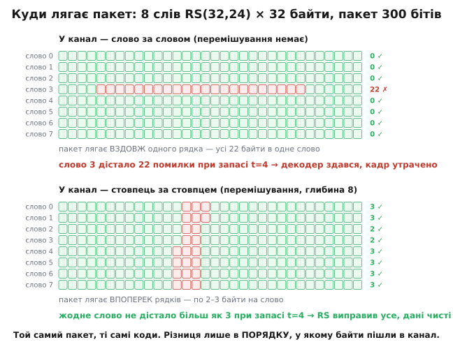
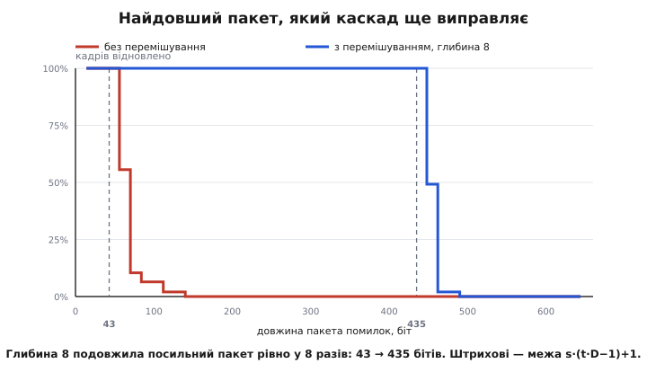

# ⚙️ Каскад у роботі: конвеєр від байта до байта

<preknowlist>
- [Рід–Соломон](book:communications/reed-solomon) — код над полем GF(2ᵐ), що лічить не біти, а символи; з N символів слова K несуть дані, а виправляє він до t = (N−K)/2 символьних помилок, хоч би скільки бітів усередині символу було побито.
- [Код Геммінга](book:communications/hamming-code) — найпростіший код, що лагодить один перевернутий біт: синдром прямо вказує номер зіпсутої позиції.
- [Перемішування](book:communications/interleaving) — перестановка символів перед відправкою, що розкидає суцільний пакет помилок по різних кодових словах.
- [Пакет помилок](book:communications/burst-error) — смуга підряд зіпсованих бітів від спалаху завад чи завмирання сигналу, на відміну від рідких поодиноких перевертів.
</preknowlist>

Каскад легко намалювати: два прямокутники, стрілка в канал, стрілка назад. Малюнок не бреше — і майже нічого не каже. Бо щойно доходить до діла, постає питання, на яке стрілочки не відповідають: **який саме пакет помилок цей каскад витримає — і звідки береться саме таке число?**

Тут ми зберемо конвеєр цілком і поставимо йому це питання. Не схему й не псевдокод — робочий шлях від байта до байта: зовнішній код, перемішування, внутрішній код, канал, що стріляє пакетом, і дорога назад до чистих даних. Наприкінці дістанемо число — найдовший посильний пакет — і формулу, з якої воно виводиться до біта, а замір підтвердить її з точністю до одного кроку сітки. Усе на чистому Python без жодної залежності; кожен блок можна запустити й помацати.

## Деталі, з яких складаємо

```
зовнішній:      RS(32,24) над GF(256) — 24 байти → 32 байти, запас t = 4 байтові помилки
перемішування:  блокове, глибина 8 слів
внутрішній:     Геммінг(7,4) — півбайт → 7 бітів, лагодить 1 перевернутий біт із семи

швидкість каскаду = (24/32) · (4/7) = 0.4286
кадр = 8 слів × 32 байти = 256 байтів даних+надлишку → 3584 біти в канал
```

Зовнішнім узято символьний код над байтами — і байт як одиниця лічби тут не дрібниця, а весь фокус: Рід–Соломонові байдуже, чи в зіпсутому байті перевернувся один біт, чи всі вісім, він однаково лічить це за одну помилку.

А от внутрішній обрано **не за силою**. Геммінг(7,4) слабенький, і взято його за одну властивість, без якої вся справа втратила б сенс: діставши **дві** помилки в семи бітах, він не просто не лагодить — він упевнено перевертає ще й третій біт і мовчки віддає не той півбайт. Ця тиха серійна брехня внутрішнього декодера і є та сама патологія, заради прибирання якої зовнішній код узагалі стоїть у схемі. Слабкий внутрішній код тут не вада демонстрації, а її суть: він дає рівно ту біду, яку каскад мусить долати.

## Поле, у якому живуть байти

Рід–Соломон рахує байтами, тож байти мусять уміти множитися й ділитися. Це дає GF(256) — поле з 256 елементів, де роль числа грає байт, додавання зводиться до XOR, а множення — до множення многочленів за модулем незвідного многочлена. Практично все зводиться до двох таблиць: пробігаємо степені породжувального елемента α = 2 і записуємо, який байт на якому кроці трапився.

```python
PRIM = 0x11D                      # x⁸+x⁴+x³+x²+1 — незвідний многочлен поля
EXP = [0] * 512                   # EXP[i] = αⁱ (подвоєно, щоб не брати модуль)
LOG = [0] * 256                   # LOG[αⁱ] = i

x = 1
for i in range(255):
    EXP[i] = x
    LOG[x] = i
    x <<= 1                       # множення на α — це зсув…
    if x & 0x100:
        x ^= PRIM                 # …і згортка назад у поле, коли виліз 9-й біт
for i in range(255, 512):
    EXP[i] = EXP[i - 255]

def mul(a, b):
    return 0 if a == 0 or b == 0 else EXP[LOG[a] + LOG[b]]

def div(a, b):
    return 0 if a == 0 else EXP[(LOG[a] + 255 - LOG[b]) % 255]

def pw(a, n):
    return EXP[(LOG[a] * (n % 255)) % 255]

def inv(a):
    return EXP[255 - LOG[a]]
```

Множення двох байтів стає додаванням їхніх логарифмів — саме тому таблицю EXP подвоєно до 512: сума двох логарифмів не перевищить 508, і модуль брати не доводиться. Дрібниця, а прибирає ділення з найгарячішого місця коду.

Число `0x11D` — не закон природи, а домовленість: годяться й інші незвідні многочлени, аби передавач і приймач узяли той самий. І домовленість ця цілком реальна. За розбором Даніеля Естевеса, який спирається на працю Макелійса й Свонсона, саме `x⁸+x⁴+x³+x²+1` узятий у Рід–Соломоні «Вояджера» — тобто поле нашої іграшки буквально те саме, що літає за межами Сонячної системи (те саме число, до речі, стоїть і в QR-кодах). А стандарт CCSDS пізніше усталив **інший** многочлен, `x⁸+x⁷+x²+x+1` (`0x187`), ще й з іншим базисом. Код той самий — RS(255,223), — а поля різні, тож декодер, написаний під одне, потоку іншого просто не прочитає. Статус: вторинне джерело, що посилається на працю JPL; параметри коду підтверджені й у документах CCSDS.

## Зовнішній код: RS(32,24)

Кодуємо систематично — дані лишаються собою, а контрольні байти дописуються в хвіст. Ідея: беремо многочлен даних, зсуваємо його на 8 позицій угору й ділимо на породжувальний многочлен g(x); остача і є ті вісім контрольних байтів. Тоді все слово націло ділиться на g — а це рівносильно тому, що воно занулюється в усіх коренях g.

```python
N, K = 32, 24
NSYM = N - K                      # 8 контрольних байтів
T = NSYM // 2                     # t = 4: стільки байтових помилок ловимо

def p_mul(p, q):
    r = [0] * (len(p) + len(q) - 1)
    for i, a in enumerate(p):
        if a:
            for j, b in enumerate(q):
                if b:
                    r[i + j] ^= mul(a, b)
    return r

def p_eval(p, x):                 # Горнер; старший степінь — перший
    y = 0
    for c in p:
        y = mul(y, x) ^ c
    return y

def rs_generator(nsym):
    g = [1]
    for i in range(nsym):
        g = p_mul(g, [1, pw(2, i)])   # g(x) = ∏ (x − αⁱ), i = 0…nsym−1
    return g

def rs_encode(msg, nsym):
    """Систематичне: дані лишаються як є, контрольні байти — остача."""
    g = rs_generator(nsym)
    buf = list(msg) + [0] * nsym
    for i in range(len(msg)):
        coef = buf[i]
        if coef:
            for j in range(1, len(g)):
                buf[i + j] ^= mul(g[j], coef)
    return list(msg) + buf[len(msg):]
```

Декодер робить чотири кроки, і кожен відповідає на своє питання. **Синдроми** питають «чи є взагалі біда»: підставляємо корені g у прийняте слово — чисте слово дасть самі нулі, бо воно на g ділиться. **Берлекемп–Мессі** питає «де саме»: шукає найкоротший регістр зсуву, що породжує знайдену послідовність синдромів, і цей регістр виявляється многочленом-локатором Λ(x). **Пошук Чіня** просто перебирає всі позиції й дивиться, де Λ занулюється. **Форні** питає «на скільки саме перевернуто» й видає величину поправки.

```python
def ev_low(p, x):                 # оцінка; молодший степінь — перший
    y, xp = 0, 1
    for c in p:
        y ^= mul(c, xp)
        xp = mul(xp, x)
    return y

def rs_syndromes(r, nsym):
    """Sⱼ = r(αʲ). Чисте слово ділиться на g → усі синдроми нульові."""
    return [p_eval(r, pw(2, j)) for j in range(nsym)]

def berlekamp_massey(S, nsym):
    """Найкоротший регістр, що породжує синдроми, — це локатор Λ(x)."""
    C, B = [1], [1]
    L, m, b = 0, 1, 1
    for n in range(nsym):
        d = S[n]
        for i in range(1, L + 1):
            d ^= mul(C[i], S[n - i])
        if d == 0:
            m += 1
            continue
        coef = div(d, b)
        if len(C) < len(B) + m:
            C = C + [0] * (len(B) + m - len(C))
        T_ = list(C)
        for i in range(len(B)):
            C[i + m] ^= mul(coef, B[i])
        if 2 * L <= n:
            L, B, b, m = n + 1 - L, T_, d, 1
        else:
            m += 1
    return C[:L + 1], L

def chien(lam, n):
    """Перебираємо позиції: де Λ(Xᵢ⁻¹) = 0, там помилка."""
    return [p for p in range(n) if ev_low(lam, inv(pw(2, n - 1 - p))) == 0]

def forney(S, lam, pos, n, nsym):
    """Yᵢ = Xᵢ · Ω(Xᵢ⁻¹) / Λ′(Xᵢ⁻¹), де Ω = S·Λ mod x^nsym."""
    omega = [0] * nsym
    for i, s in enumerate(S):
        if s:
            for j, l in enumerate(lam):
                if l and i + j < nsym:
                    omega[i + j] ^= mul(s, l)
    # формальна похідна: над GF(2ᵐ) виживають лише непарні степені
    lam_d = [(lam[k + 1] if (k + 1) % 2 else 0) for k in range(len(lam) - 1)]
    e = [0] * n
    for p in pos:
        X = pw(2, n - 1 - p)
        den = ev_low(lam_d, inv(X))
        if den == 0:
            return None
        e[p] = div(mul(X, ev_low(omega, inv(X))), den)
    return e

def rs_decode(r, nsym):
    """(слово, к-сть виправлень) або (None, −1) — чесна відмова."""
    S = rs_syndromes(r, nsym)
    if max(S) == 0:
        return list(r), 0
    lam, L = berlekamp_massey(S, nsym)
    if 2 * L > nsym:
        return None, -1
    pos = chien(lam, len(r))
    if len(pos) != L:
        return None, -1
    e = forney(S, lam, pos, len(r), nsym)
    if e is None:
        return None, -1
    out = [a ^ b for a, b in zip(r, e)]
    if max(rs_syndromes(out, nsym)) != 0:
        return None, -1
    return out, L
```

Зверніть увагу на три перевірки, що ведуть до `None`. Вони і є та риса, якої бракує внутрішньому кодові: зовнішній декодер уміє **здатися чесно**. Якщо локатор вийшов задовгим, або Чінь знайшов не стільки коренів, скільки обіцяв ступінь Λ, або виправлене слово все одно не дає нульових синдромів — значить, помилок більше за запас, і краще сказати «не подужав», ніж видати вигадку. Прогін на випадкових словах: **500 із 500** прогонів з чотирма й менше помилками виправлено точно, а на шести помилках декодер **500 разів із 500 чесно здався** й жодного разу не збрехав мовчки.

## Внутрішній код: Геммінг(7,4)

Півбайт іде в сім бітів. Позиції нумеруємо з одиниці, дані кладемо на 3, 5, 6, 7, а на степені двійки — 1, 2, 4 — контрольні біти, кожен збирає XOR тих позицій, у чиєму номері стоїть його розряд. Тоді синдром на прийомі — це просто **номер** зіпсутого біта, і виправлення зводиться до одного зсуву.

```python
def _enc4(d):
    b3, b5, b6, b7 = (d >> 3) & 1, (d >> 2) & 1, (d >> 1) & 1, d & 1
    b1, b2, b4 = b3 ^ b5 ^ b7, b3 ^ b6 ^ b7, b5 ^ b6 ^ b7
    return b1 | (b2 << 1) | (b3 << 2) | (b4 << 3) | (b5 << 4) | (b6 << 5) | (b7 << 6)

def _bit(w, i):
    return (w >> (i - 1)) & 1

def _dec7(w):
    s = ((_bit(w, 1) ^ _bit(w, 3) ^ _bit(w, 5) ^ _bit(w, 7))
         | ((_bit(w, 2) ^ _bit(w, 3) ^ _bit(w, 6) ^ _bit(w, 7)) << 1)
         | ((_bit(w, 4) ^ _bit(w, 5) ^ _bit(w, 6) ^ _bit(w, 7)) << 2))
    if s:
        w ^= 1 << (s - 1)         # синдром — це просто НОМЕР зіпсутого біта
    return (_bit(w, 3) << 3) | (_bit(w, 5) << 2) | (_bit(w, 6) << 1) | _bit(w, 7)

HAM_ENC = [_enc4(d) for d in range(16)]     # 16 слів по 7 бітів
HAM_DEC = [_dec7(w) for w in range(128)]    # будь-які 7 бітів → півбайт

def inner_encode(stream):
    bits = []
    for byte in stream:
        for nib in (byte >> 4, byte & 15):
            w = HAM_ENC[nib]
            bits.extend((w >> i) & 1 for i in range(7))
    return bits                              # 14 бітів на байт

def inner_decode(bits):
    out = []
    for i in range(0, len(bits), 14):
        hi = HAM_DEC[sum(bits[i + k] << k for k in range(7))]
        lo = HAM_DEC[sum(bits[i + 7 + k] << k for k in range(7))]
        out.append((hi << 4) | lo)
    return out
```

Обидві таблиці рахуються один раз на старті, і далі декодування півбайта — це **один пошук у масиві зі 128 комірок**. Жодної арифметики.

А тепер найважливіший замір усієї роботи. Проженемо крізь декодер усі 16 слів з усіма можливими одиничними й подвійними помилками:

```
одна помилка на слово:   112 із 112 випадків виправлено точно
дві помилки на слово:    336 із 336 — віддано НЕ ТОЙ півбайт, і жодного разу
                         декодер про це не повідомив; випадково вцілів 0 разів
```

Не «часто помиляється», а **завжди**, і завжди мовчки. Причина в тому, що код Геммінга **досконалий**: усі 128 семибітових слів розібрано між 16 кодовими словами без жодного залишку, кожне слово лежить не далі як за один переверт від рівно одного кодового. Тож зайвого місця, де можна було б сказати «щось не так», просто немає — прийнявши слово з двома перевертами, декодер бачить його як сусіда іншого кодового слова й слухняно «лагодить» до нього. Вихід внутрішнього декодера в смузі завади — це не шум, а **впевнена брехня**.

> 🔧 **Навіщо це.** Внутрішній код обирають не за тим, як рідко він падає, а за тим, **якої форми** його падіння. Геммінг(7,4), схибивши, псує рівно один півбайт — і не більше: збій не розповзається за межі своїх семи бітів. Саме обмежений радіус ураження й робить його придатним напарником: зовнішній код дістає шкоду компактну й полічену. Якби внутрішній декодер, спіткнувшись, ламав усе до кінця кадру — а декодер зі станом уміє й таке, — зовнішньому не лишилося б чого рятувати. Проєктуючи будь-який багатошаровий захист, питайте не лише «як часто нижній шар падає», а й «яку саме калюжу він по собі лишає»: прибирати її верхньому, і саме її розмір, а не частота, визначає, чи впорається той.

## Перемішування

Блокове перемішування — це просто матриця. Складаємо 8 слів RS рядками, а в канал віддаємо **стовпцями**: спершу нульовий байт кожного з восьми слів, тоді перший байт кожного, і так далі.

```python
DEPTH = 8                         # скільки слів RS живе в одному блоці

def interleave(rows):
    """Пишемо рядками (слово = рядок), читаємо стовпцями."""
    return [rows[r][c] for c in range(N) for r in range(DEPTH)]

def deinterleave(stream):
    rows = [[0] * N for _ in range(DEPTH)]
    for i, b in enumerate(stream):
        rows[i % DEPTH][i // DEPTH] = b
    return rows

def flat(rows):                   # «без перемішування» — слово за словом
    return [b for row in rows for b in row]

def unflat(stream):
    return [stream[r * N:(r + 1) * N] for r in range(DEPTH)]
```

Уся сила — в одному рядку `i % DEPTH`. Сусідні в каналі байти належать **різним** словам, тож будь-яка суцільна смуга біди роздається по словах порівну, по колу. Вісім слів — і кожне дістає щонайбільше кожен восьмий побитий байт.

## Канал і повний конвеєр

Пакет моделюємо чесно: у смузі завади приймач не так «перевертає біти», як узагалі втрачає ґрунт — кожен біт із імовірністю ½ виявляється не тим. Поза смугою канал бездоганний, щоб було видно чистий ефект пакета.

```python
def channel(bits, start, length, rng):
    """Пакет: у смузі завади кожен біт перевертається з імовірністю ½."""
    out = list(bits)
    for i in range(start, min(start + length, len(out))):
        if rng.random() < 0.5:
            out[i] ^= 1
    return out

def pipeline(data, burst_len, burst_at, rng, use_interleaver=True):
    rows = [rs_encode(data[r * K:(r + 1) * K], NSYM) for r in range(DEPTH)]   # зовнішній
    stream = interleave(rows) if use_interleaver else flat(rows)              # перемішування
    sent = inner_encode(stream)                                              # внутрішній
    got = channel(sent, burst_at, burst_len, rng)                           # канал
    stream2 = inner_decode(got)                                             # внутрішній⁻¹
    rows2 = deinterleave(stream2) if use_interleaver else unflat(stream2)   # перемішування⁻¹
    damage = [sum(a != b for a, b in zip(rows[r], rows2[r])) for r in range(DEPTH)]
    out = []
    for r in range(DEPTH):
        dec, _ = rs_decode(rows2[r], NSYM)                                  # зовнішній⁻¹
        if dec is None:
            return None, damage
        out.extend(dec[:K])
    return out, damage
```

Ось увесь каскад — дев'ять рядків. Дорога туди й дорога назад **дзеркальні**: що наклали останнім, те знімають першим. Порядок тут не справа смаку, а жорсткий припис, і трохи далі побачимо ціну помилки в ньому.

## Прогін

Даємо 192 байти даних, стріляємо пакетом на 300 бітів з позиції 1400 — і проганяємо той самий кадр двічі, міняючи **єдину** річ: чи ввімкнено перемішування.

```
кадр: 8 слів RS(32,24) × 32 байтів = 256 байтів → 3584 бітів у каналі
швидкість каскаду: (24/32)·(4/7) = 0.4286
запас зовнішнього коду: t = 4 байтових помилок на слово

пакет 300 бітів, з біта 1400 — з перемішуванням (глибина 8):
   побито байтів по словах: [3, 3, 2, 2, 3, 3, 3, 3]   (межа t=4)
   → дані ЧИСТІ, збігаються побайтно

пакет 300 бітів, з біта 1400 — без перемішування:
   побито байтів по словах: [0, 0, 0, 22, 0, 0, 0, 0]   (межа t=4)
   → зовнішній декодер ЗДАВСЯ, кадр утрачено
```

Двадцять два побитих байти — в обох випадках. Ті самі коди, той самий пакет, та сама шкода. Різниця лише в **порядку**, у якому байти пішли в канал: у першому разі шкода розмазана по вісьмох словах по два-три байти, і кожне слово впоралося власним запасом; у другому вся вона впала в одне слово, яке дістало 22 при запасі 4 — і згинуло.


*Куди лягає пакет. Кожна клітинка — байт; рядок — слово RS(32,24); червоне — те, що побив внутрішній декодер. Угорі байти йдуть у канал рядок за рядком, і смуга завади лягає **вздовж** одного рядка: слово 3 дістає всі 22 помилки й гине. Унизу байти йдуть стовпець за стовпцем, тож та сама смуга лягає **впоперек** рядків, і жодне слово не дістає більш як три. Перемішування не прибрало жодної помилки — воно лише перерозподілило їх.*

Останнє речення підпису варте окремої уваги, бо в ньому вся суть перемішування: **воно не виправляє нічого**. Це чиста перестановка, вона не додає ані біта надлишку й не прибирає ані однієї помилки. Усю роботу зробив Рід–Соломон — просто в першому разі йому дали посильну задачу, а в другому непосильну.

## Скільки він з'їдає

Тепер можна відповісти на питання, з якого починали, — і не заміром навмання, а виведенням.

Пакет завдовжки B бітів гуляє по потоку, де кожен байт займає s = 14 бітів каналу. Скільки байтових комірок він зачепить? Якщо лягти найгірше — не в лад із межами комірок, — то з країв надкусить іще по одній:

```
комірок під ударом:  ⌊(B + s − 2) / s⌋ + 1

рятівна умова: усі ці комірки роздано по D словах порівну, по колу,
тож найгіршому слову дістанеться ⌈комірок / D⌉ — а це має влізти в запас t:

  ⌊(B + s − 2)/s⌋ + 1 ≤ t · D

звідси найдовший ГАРАНТОВАНО посильний пакет:

  B_max = s · (t · D − 1) + 1

для нашого каскаду: s = 14, t = 4, D = 8
  B_max = 14 · (4·8 − 1) + 1 = 14 · 31 + 1 = 435 бітів
```

435 бітів — це 12% усього кадру суцільної біди, і каскад зі швидкістю 0.43 та найпростішим внутрішнім кодом виправляє її повністю. Перевіримо формулу заміром: беремо пакет заданої довжини, кидаємо його у випадкове місце кадру, женемо по 250 кадрів на точку й дивимося, скільки вціліло.


*Найдовший посильний пакет, заміряно на 250 кадрах у кожній точці. Обидві криві — обриви: доки шкода влазить у запас, кадр відновлюється **завжди**, щойно перестала — не відновлюється майже ніколи. Без перемішування (D = 1) обрив стоїть на 43 бітах, із глибиною 8 — на 435, і штрихові лінії показують, що обидва числа стоять рівно там, де їх поставила формула s·(t·D−1)+1. Праворуч від обриву криві падають не прямовисно, а за кілька десятків бітів: формула дає **гарантію** для найгіршого влучання, а пакетові ще треба в те найгірше місце влучити.*

Прогін по глибинах перетворює формулу на закон, який видно неозброєним оком. Для кожної глибини шукаємо найбільший пакет, який виправлено в усіх 120 прогонах поспіль (сітка з кроком 14 бітів — по одному байту):

```
глибина D │ кадр, байтів │ поріг, бітів │ теорія s·(t·D−1)+1
    1     │      32      │      42      │        43
    2     │      64      │      98      │        99
    4     │     128      │     210      │       211
    8     │     256      │     434      │       435
   16     │     512      │     882      │       883
```

Замір лягає на теорію в кожному рядку — рівно на один крок сітки нижче, бо справжня межа завжди припадає на «плюс один біт» після цілого числа байтів. Закон читається просто: **посильний пакет росте рівно пропорційно глибині**. Хочете витримати вдвічі довшу смугу завади — беріть удвічі глибше перемішування. Не сильніший код, не нижчу швидкість — саме глибину.

## Пастки

**Перемішування всередині одного слова — марна робота.** Це найпоширеніша хиба в міркуваннях про каскад, і вона тим підступніша, що звучить розумно: «розкидаймо байти всередині слова, щоб пакет не лежав купою». Не допоможе ані на біт. Рід–Соломонові байдуже, **де** лежать помилки — його обходить лише **скільки** їх; переставляння байтів усередині слова кількості не міняє. Замір безжальний:

```
поріг без перестановки: 42 біти
поріг З перестановкою:  42 біти   ← та сама межа, дарма
```

Ось чому глибину міряють **у словах, а не в байтах**: перемішування заробляє свій хліб винятково тим, що розкидає шкоду **між різними кодовими словами**. Матриця з одного рядка не перемішує нічого, хоч як його переставляй.

**Порядок шарів прибитий цвяхами.** Знімати обгортки треба точно у зворотному порядку: внутрішній декодер → зворотне перемішування → зовнішній декодер. Забудьте середню ланку — і зовнішній декодер дістане на вхід стовпці замість рядків, тобто байти з восьми різних слів упереміш. Пропустимо крізь такий конвеєр кадр по **бездоганному каналу, без жодної помилки**:

```
канал БЕЗ помилок, забули зворотне перемішування:
   декодер здався у 200/200 кадрів, тихо «виправив» у 0
```

Стовідсотковий провал на ідеальному каналі. Утішає хіба те, що провал **гучний**: RS не вдав, ніби все гаразд, — три його перевірки спіймали безглуздя й чесно повідомили. Ця пастка любить розбіжність версій: досить одному кінцеві лінії поміняти глибину чи порядок обходу матриці — і зв'язок не «погіршиться», а зникне начисто, ще й із симптомом «канал ідеальний, а даних нема».

**Глибина коштує не швидкості, а часу.** Перемішування — єдиний шар каскаду, що не бере за себе **жодного біта** надлишку: перестановка, і по всьому. Але дармовим воно не буває, і плата в нього своя. Щоб віддати в канал перший байт стовпця, треба вже мати на руках **усі вісім слів**; щоб віддати перший байт даних на прийомі — треба дочекатися цілого блоку. Глибина обертається на буфер і на затримку:

```
глибина D → буфер D · N байтів на обох кінцях
          → затримка ≈ повний блок = D · N символів

D = 8:  посильний пакет 435 бітів, буфер 256 байтів, затримка 3584 біти каналу
D = 64: посильний пакет 3571 біт, та буфер уже 2 КБ, а затримка — 28 672 біти каналу
```

Звідси й уся інженерія глибини: беруть найменшу, що покриває очікуваний пакет. «Вояджерові» вистачило глибини 4 (за Макелійсом і Свонсоном), стандарт CCSDS усталив 5 — сигнал однаково йде до Землі годинами, тож зайві мілісекунди буфера там нічого не важать. А в голосовому зв'язку чи в керуванні все навпаки: там затримка і є та річ, заради якої все робиться, тож глибоке перемішування недопустиме — і доводиться купувати стійкість надлишком, а не часом. Обмін «стійкість до пакетів ↔ затримка» — це те, що каскад кладе на стіл проєктувальникові.

**Внутрішній декодер бреше мовчки — і це можна полагодити.** Наш Геммінг(7,4) не має **жодного** способу поскаржитися: він досконалий, кожне семибітове слово комусь та належить. Через це зовнішній код мусить шукати помилки наосліп і платить дві контрольні позиції за кожну. Але варто взяти внутрішнім кодом такий, що вміє сказати «не знаю», — і кожен його зрив стає **стиранням**, позицією з відомою адресою, а за стирання зовнішній код бере вдвічі дешевше: 2t замість t. Наш каскад із того самого RS(32,24) прибирав би тоді не 4, а 8 побитих байтів на слово — тобто поріг пакета підскочив би вдвічі **задарма**, без зміни швидкості й без поглиблення перемішування. Чому саме вдвічі й що з цього вичавлює узагальнене декодування Форні — виводить [математика каскаду](book:communications/concatenated-codes/math-concatenation-params.md).

## Скільки це коштує

Наостанок — рахунок, що пояснює, чому каскад узагалі здійсненний. Полічимо множення в GF(256) на один кадр (256 байтів, 3584 біти каналу):

```
внутрішній декодер, чисто : 0 множень   (512 пошуків у таблиці)
внутрішній декодер, пакет : 0 множень   (512 пошуків у таблиці)
зовнішній декодер, ЧИСТО  : 2048 множень
зовнішній декодер, ПАКЕТ  : 6958 множень   ← у 3.4× дорожче
```

Три числа, і кожне промовисте. Внутрішній декодер не робить **жодного** множення — він зведений до пошуку в таблиці й коштує однаково, є біда чи нема. Це не випадковість, а вимога: він працює **на кожному біті**, на швидкості лінії, тож мусить бути тупим і швидким.

Зовнішній працює незрівнянно рідше: на той самий кадр внутрішній декодер спрацьовує 512 разів — по разу на кожні сім бітів, — а зовнішній лише вісім, по разу на слово. У 64 рази рідше; тому йому й дозволено бути розумним: поліноміальна алгебра, регістри зсуву, пошук коренів. Але й він ощадливий: на чистому кадрі його 2048 множень — це самі синдроми (8 слів × 8 синдромів × 32 байти = 2048 рівно), тобто просто перевірка «чи все гаразд», після якої він одразу повертається. Уся дорога машинерія — Берлекемп–Мессі, Чінь, Форні — вмикається **лише тоді, коли справді щось зламалося**, і коштує ті 3.4×.

Ось вона, економіка каскаду в трьох рядках: **дешеве — щомиті, дороге — зрідка, найдорожче — тільки на біду.** Один довгий код такої самої сили мусив би платити повну ціну на кожному кадрі й за кожен біт. Каскад же розкладає роботу так, що гарячий шлях лишається таблицею, а міркування трапляється рідко — і саме тому довгий код, який ще й можна порахувати, виявився не мрією, а двома сотнями рядків, що працюють на будь-якій машині.
