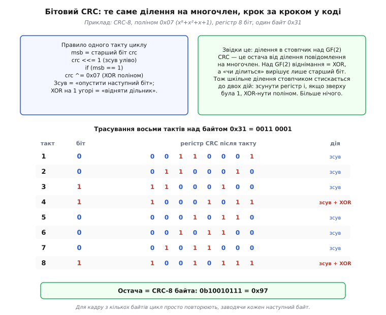
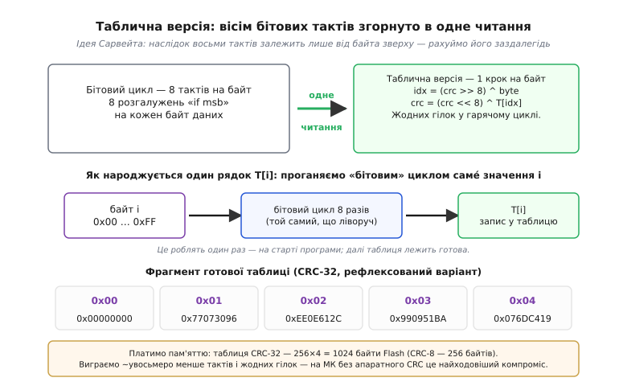
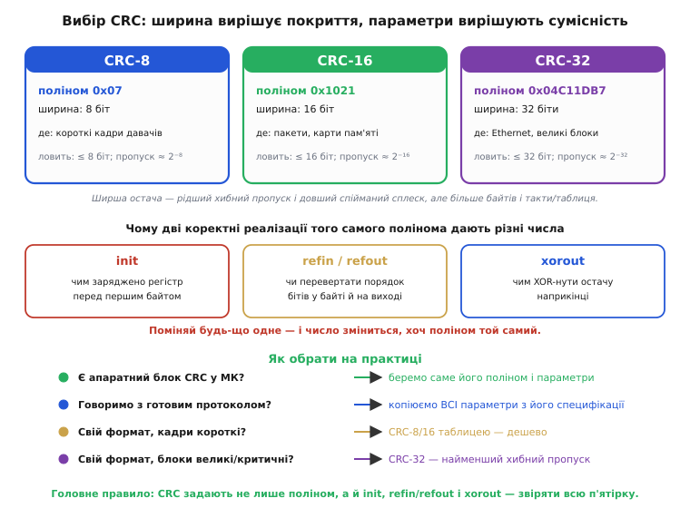

# CRC у коді: бітовий цикл, таблична версія і вибір полінома

> ⚙️ Алгоритмічна вставка про реалізацію [CRC](topic:communications/crc) у коді. Головна ідея проста: CRC — це **остача від ділення** повідомлення на наперед обраний многочлен, і саме ця остача їде поряд із даними, щоб приймач упіймав зіпсовані біти. Думка красива, але між нею і робочим кодом лежить прірва: ніхто на мікроконтролері не ділить багатобітні многочлени «як у підручнику». Цю прірву ми тут і закриваємо — переведемо ділення на многочлен у дві коротенькі реалізації (повільну бітову й швидку табличну) і розберемо, як не помилитися з вибором CRC. Чисту математику ділення над GF(2) тримає сусідня [🧮-вставка](topic:communications/crc/math-gf2-polynomials.md), а готовий блок усередині МК — [🔌-вставка](topic:communications/crc/comp-hardware-crc.md); тут — лише код і його ціна.

## Задача

Мета вузька й цілком практична: маючи буфер байтів (кадр для CAN, пакет поверх UART, блок у сховищі — усюди, де потрібен [CRC](topic:communications/crc)), порахувати його контрольну послідовність так, щоб **той самий байт у байт результат** отримав і приймач на іншому кінці лінії. Два обмеження роблять задачу нетривіальною саме на МК. По-перше, тут немає апаратного ділення многочленів, і навіть звичайне ділення цілих коштує дорого, тож «ділити» доведеться самими зсувами та XOR. По-друге, контрольну суму рахують **часто** — на кожен прийнятий і відправлений кадр, — тому ціна в тактах і в пам'яті Flash тут не абстракція, а те, що визначає, встигне приймач за потоком чи захлинеться.

## Ідея

Витоки рішення — прямо в [означенні CRC](topic:communications/crc) як остачі від ділення. Над полем GF(2) (двома значеннями, 0 і 1) додавання й віднімання — це **одна й та сама операція XOR** (саме тому [XOR](topic:electronics/xor-comparison) ще називають «додаванням за модулем 2»), а ділення в стовпчик зводиться до питання «чи вліз дільник» — і відповідь дає лише **старший біт** поточної остачі. Шкільне ділення «знеси цифру — відніми дільник» згортається тоді до двох дій: зсунути регістр остачі на біт уліво (це й є «знести наступний біт») і, якщо зверху щойно стояла одиниця, XOR-нути поліном (це й є «відняти дільник»). Більше в бітовому циклі немає нічого.


*CRC-8 з поліномом 0x07 над одним байтом 0x31. Ліворуч — правило одного такту (зсув, і за потреби XOR полінома) поряд із його походженням: це стиснуте ділення в стовпчик над GF(2). Праворуч — повне трасування восьми тактів: «верхній біт» вирішує, буде це лише зсув чи зсув із XOR, а внизу видно остачу 0b10010111 = 0x97. Для кадру з кількох байтів той самий цикл просто повторюють, заводячи в регістр кожен наступний байт.*

Бітовий варіант чесний і крихітний, та має одну очевидну ваду: вісім тактів циклу на **кожен** байт. І тут спрацьовує спостереження, яке й зробило CRC практичним: результат цих восьми тактів залежить **лише** від байта, що зайшов зверху, і поточного стану регістра. А раз залежність детермінована — її можна порахувати **наперед** для всіх 256 можливих байтів і скласти у таблицю. Тоді в гарячому циклі замість восьми ітерацій із розгалуженням лишається одне читання з таблиці й один XOR.


*Ідея Сарвейта: наслідок восьми бітових тактів передбачуваний, тож кожен рядок таблиці T[i] рахують один раз тим самим бітовим циклом — і далі на кожен байт даних роблять лише `idx → читання T[idx] → XOR`. Праворуч — справжній фрагмент таблиці CRC-32. Платимо за це пам'яттю (256×4 = 1024 байти для CRC-32, 256 байтів для CRC-8) і виграємо приблизно увосьмеро менше тактів без жодних гілок у циклі.*

Так народжуються **дві** реалізації одного й того самого CRC: бітова — еталонна, нею ж і будують таблицю; таблична — робоча, для гарячого шляху. Обидві дають однакове число; різниця лише в тактах і байтах Flash.

## Код

Спершу бітова версія — та, що буквально повторює крок-за-кроком ділення з фігури вище і слугує еталоном. Беремо конкретний CRC-8 із поліномом 0x07 (той самий, що на трасуванні вище дає 0x97), у «нормальному» записі — старший біт зліва:

```c
#include <stdint.h>
#include <stddef.h>

/* Еталонний бітовий CRC-8, поліном 0x07 (нормальний запис, старший біт зліва).
 * init/xorout — частина профілю; для «голого» CRC-8/0x07 обидва нулі.
 * Для CRC-16/32 змінюються лише типи, маска старшого біта (0x8000 / 0x80000000)
 * і домішування байта у ВЕРХНІЙ байт: crc ^= (uint16_t)byte << 8 тощо. */
uint8_t crc8_bitwise(const uint8_t *data, size_t len,
                     uint8_t init, uint8_t xorout)
{
    uint8_t crc = init;
    for (size_t i = 0; i < len; i++) {
        crc ^= data[i];                       /* домішуємо байт у верх регістру */
        for (int bit = 0; bit < 8; bit++) {
            if (crc & 0x80)                   /* старший біт == 1 → «дільник вліз» */
                crc = (uint8_t)((crc << 1) ^ 0x07);
            else
                crc = (uint8_t)(crc << 1);    /* приведення до uint8_t = маска width */
        }
    }
    return crc ^ xorout;                       /* фінальний штрих */
}
```

Тепер таблична версія — той самий результат, але читанням наперед порахованої таблиці. Саму таблицю будують **один раз** на старті (тим же бітовим циклом над значеннями 0…255):

```c
static uint8_t crc8_table[256];

/* Будуємо таблицю ОДИН раз — тим самим бітовим циклом над значеннями 0…255. */
void crc8_build_table(void)
{
    for (int i = 0; i < 256; i++) {
        uint8_t crc = (uint8_t)i;
        for (int bit = 0; bit < 8; bit++)
            crc = (crc & 0x80) ? (uint8_t)((crc << 1) ^ 0x07)
                               : (uint8_t)(crc << 1);
        crc8_table[i] = crc;                   /* наслідок восьми тактів для байта i */
    }
}

/* Гарячий цикл: одне читання таблиці й один XOR на байт. */
uint8_t crc8_table_lookup(const uint8_t *data, size_t len,
                          uint8_t init, uint8_t xorout)
{
    uint8_t crc = init;
    for (size_t i = 0; i < len; i++) {
        uint8_t idx = crc ^ data[i];  /* ширші CRC: idx = (crc >> (width-8)) ^ byte */
        crc = crc8_table[idx];        /*            crc = (crc << 8) ^ T[idx]       */
    }
    return crc ^ xorout;
}
```

Дві деталі вирішують сумісність — і саме на них спотикаються найчастіше. Регістр заряджають не нулем, а значенням **init** (часто 0xFFFF чи 0xFFFFFFFF): нульовий старт сліпий до ведучих нулів кадру, бо XOR з нулем нічого не міняє. А готову остачу XOR-ять зі сталою **xorout**. Ці дві сталі плюс питання, чи перевертати порядок бітів у байтах (рефлексія, **refin/refout**), і складають «паспорт» конкретного CRC — без збігу всієї п'ятірки два боки лінії порахують різні числа з одного полінома.


*Угорі — три ходові ширини: CRC-8 (поліном 0x07) для коротких кадрів давачів, CRC-16 (0x1021) для пакетів і карт пам'яті, CRC-32 (0x04C11DB7) для Ethernet і великих блоків; ширша остача ловить довші сплески й рідше дає хибний пропуск, але коштує більше. Посередині — параметри, через які дві коректні реалізації того самого полінома не сходяться: init, refin/refout і xorout. Унизу — просте дерево вибору: є апаратний блок або готовий протокол — копіюй їхні параметри; свій формат — бери ширину під довжину кадру й критичність.*

## Складність і пастки на МК

За вартістю обидві версії дешеві, але по-різному, і вибір між ними — це обмін такти ↔ пам'ять. Решта пасток тут специфічна для CRC і боляче тиха: помилка не «падає», а лише розходиться у числах між двома боками.

- **Такти проти Flash.** Бітова версія — нуль зайвої пам'яті, але вісім ітерацій на байт; на швидкому потоці кадрів цього може не вистачити. Таблична — ~увосьмеро швидша й без гілок, ціною 256 байтів (CRC-8) чи 1 КіБ (CRC-32) у Flash. На тісному МК це реальний компроміс, а не дрібниця; проміжні схеми «півбайтом» (таблиця на 16 записів) торгують те саме в інших пропорціях.
- **Розбіжність параметрів — головна біда.** Однакового полінома **замало**. Переплутаний init, забутий xorout чи не та рефлексія — і CRC «не сходиться», хоча код наче правильний. Рецепт: для готового протоколу (CAN, Modbus, SD-картки) брати **всю** п'ятірку з його специфікації, а не лише поліном.
- **Дві конвенції полінома.** Той самий CRC у різних джерелах записують **по-різному**: «нормально» (старший біт зліва) і «рефлексовано» (дзеркально, дрібним бітом уперед). 0x04C11DB7 і 0xEDB88320 — це **один** поліном CRC-32 у двох записах. Береш рефлексований запис — мусиш узяти й рефлексований цикл (зсуви вправо, XOR молодшим бітом), інакше отримаєш чуже число.
- **Порядок байтів у кадрі.** Сам CRC треба ще покласти в буфер у тому порядку байтів, якого чекає приймач, — і це той самий клопіт із [порядком байтів (endianness)](topic:programming/bits-bytes-endianness), що й деінде. Порахував правильно, а поклав «навпаки» — і перевірка на тому кінці провалиться на рівному місці.
- **CRC — не криптографія.** Він ловить **випадкові** спотворення, але не захищає від навмисної підробки: маючи CRC, неважко дібрати інші дані з тим самим числом. Для цілісності проти шуму — так; проти зловмисника — ні.

## Звідки це взялося

CRC не «винайшли одним розчерком» — він складався шарами, і це типова **колективна** історія. Саму ідею контрольної послідовності як остачі від ділення на многочлен запропонував **Вільям Веслі Пітерсон** (*W. Wesley Peterson*) 1961 року. Конкретний 32-бітний поліном, що згодом ліг в Ethernet, — уже робота **колективу**: його опублікували 1975 року дослідники з Технологічного інституту Джорджії (*Georgia Tech*) — **Джозеф Гаммонд**, **Джеймс Браун**, **Шян-Шіан Лю** — і **Кеннет Брайєр** (*Kenneth Brayer*) з корпорації Mitre, у звітах для лабораторій ВПС США; у стандарт Ethernet (IEEE 802.3) цей поліном увійшов пізніше — стандарт ухвалили 1983-го, опублікували 1985-го. А **табличну** реалізацію, без якої CRC не став би таким повсюдним у софті, популяризував **Діліп Сарвейт** (*Dilip V. Sarwate*) статтею в *Communications of the ACM* 1988 року. Тобто за звичним рядком `crc = (crc << 8) ^ T[idx]` стоять одразу математик, ціла дослідницька група й окремий автор зручного алгоритму — кожен зі своїм внеском, без єдиного «винахідника». Ширший контекст тих самих років — коли кодування з виявленням і виправленням помилок узагалі ставало інженерією — дає [📜-історія](topic:algorithms/bit-flips/hist-hamming.md) про Річарда Геммінга.

Підсумок: ідею «[остача від ділення](topic:communications/crc)» втілюють два коротких цикли, які цю остачу реально рахують на МК, плюс набір параметрів, що вирішують, чи порозуміються два боки лінії. Чому саме ці зсуви й XOR **математично** є діленням многочленів — розгортає [🧮-вставка](topic:communications/crc/math-gf2-polynomials.md); коли той самий рахунок робить не код, а блок у кремнії, — [🔌-вставка](topic:communications/crc/comp-hardware-crc.md).
