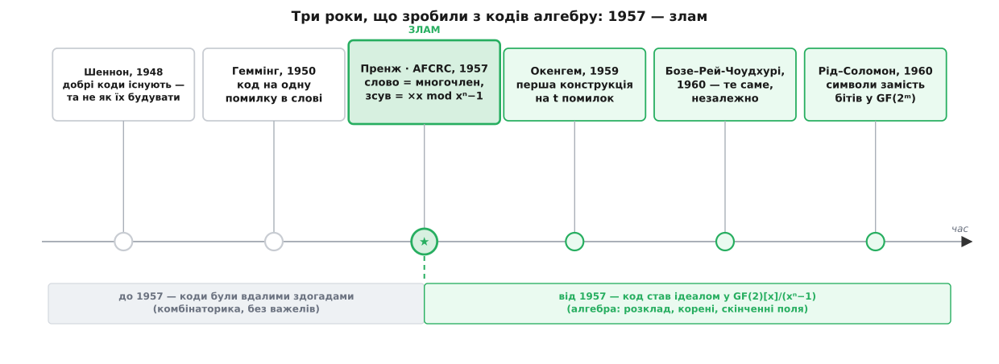
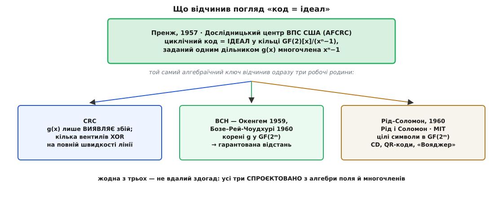

# 📜 Як зсув перетворив коди на алгебру

Наприкінці 1950-х Юджин Пренж зробив із виправлення помилок розділ алгебри — і зробив це майже непомітною дією: прочитав кодове слово як многочлен, а зсув його бітів по колу — як множення на x. Одна ця заміна погляду перетворила безладний музей вдалих знахідок на струнку теорію з машиною всередині.

Бо доти коди саме музеєм і були. [Клод Шеннон](topic:communications/shannon-capacity) 1948 року довів, що добрі коди існують, але не сказав, які саме; [Річард Геммінг](topic:communications/hamming-code) 1950-го дав перший робочий код на одну помилку; а далі кожен новий код був окремим витвором — своя матриця, свій розмір, своя сила, знайдені осяянням. Бракувало не так конкретного коду, як **мови**: коди були множинами бітових рядків, комбінаторними об'єктами, за які алгебрі не було чим ухопитися. Пренж дав цю мову.

## Кімната, де слово стало многочленом

**Юджин Пренж** (*Eugene Prange*, 1917–2006) — американський математик, ветеран Другої світової, що служив офіцером розвідки в Англії, а по війні навчався в Іллінойському та Гарвардському університетах. Наприкінці 1950-х він працював у Дослідницькому центрі ВПС США в Кембриджі (Air Force Cambridge Research Center, AFCRC) у Бедфорді, штат Массачусетс — одному з тих військових центрів, де тоді на державні гроші тихо визрівала майже вся молода теорія кодування.

1957 року він випустив технічний звіт із сухою назвою «Cyclic Error-Correcting Codes in Two Symbols» («Циклічні коди, що виправляють помилки, у двох символах»), AFCRC-TN-57-103, вересень 1957. У ньому Пренж уперше **систематично** виокремив клас кодів, замкнених щодо циклічного зсуву, — і зробив із цією замкненістю те, чого доти не робив ніхто: переписав її алгеброю.

Прийом був простий до зухвалості. Пронумеруй біти слова й прочитай їх як коефіцієнти многочлена над [GF(2)](topic:math/finite-fields) — полем із двох елементів, де додавання є XOR. Тоді один циклічний зсув — це рівно множення того многочлена на x, а старший член, що мав би «випасти» за край, повертається у вільний за правилом xⁿ = 1:

```
слово (c₀ c₁ … cₙ₋₁)  →  c(x) = c₀ + c₁x + … + cₙ₋₁xⁿ⁻¹
зсув по колу          →  x · c(x)   за модулем   xⁿ − 1
```

І ось де вся сіль. Бітовий рядок — це об'єкт комбінаторики, і ручок у нього мало. Многочлен у [кільці](topic:math/polynomial-rings) — об'єкт алгебри, а в алгебри ручок безліч: множники, корені, поля, ділення з остачею. Пренжів зсув, дрібничка з вигляду, і був тим містком, яким коди перейшли з першого світу в другий.

## Одна дія, що потягла все за собою

Далі все випливає майже само. Код лінійний — отже, замкнений щодо додавання. Пренж показав, що циклічний код замкнений ще й щодо множення на x. А коли множити на x можна, то й на x², і на x³, і на будь-яку їхню суму — тобто на **будь-який** многочлен. Множина, замкнена щодо додавання й щодо множення на будь-який елемент кільця, має в алгебрі точну назву — [ідеал](topic:math/ideal). Тож Пренжів висновок вимовляється одним рядком, від якого й досі відштовхується вся теорія:

Циклічні коди — це рівно **ідеали** кільця GF(2)[x]/(xⁿ−1).

Чому це вибух, а не просто гарне слово? Бо ідеали такого кільця **повністю перелічені**: кожен породжується одним дільником многочлена xⁿ−1. Питання «які взагалі бувають циклічні коди завдовжки n?» — доти безмежне — звелося до шкільного «розклади xⁿ−1 на множники й вибери дільник». Проєктування коду стало задачею про розклад многочлена.

```
n = 7:   x⁷ − 1 = (x+1)(x³+x+1)(x³+x²+1)      (над GF(2))
3 незвідні множники  →  2³ = 8 дільників  →  рівно 8 циклічних кодів довжини 7
```

Вісім — не «багато-багато десь там», а перелічуване вісім, кожен зі своїм g(x). Раптом коди можна не вишукувати навмання, а **виписувати списком**.

Тут варто бути точним щодо заслуг. Систематичне виокремлення циклічних кодів і сам многочленний погляд — Пренжеві, 1957 (його й називають першим, хто взявся досліджувати циклічні коди). Гостре формулювання «код = ідеал фактор-кільця» у тому вигляді, як його вчать сьогодні, викристалізувалося за кілька наступних років в американській алгебраїчній школі — насамперед у підручнику Веслі Пітерсона «Error-Correcting Codes» (1961), що звів усю цю арифметику докупи. Але двері відчинив саме зсув Пренжа.


*За три роки — з 1957-го по 1960-й — виправлення помилок стало алгеброю. 1957-й тут злам: ліворуч від нього коди — вдалі здогади комбінаторики, праворуч — ідеали в кільці многочленів, а з них уже течуть цілі родини BCH і Рід–Соломона.*

## Двері, що відчинилися

Щойно код став «вибором дільника g(x)», а дільник — «набором коренів у ширшому полі GF(2ᵐ)», з'явилася нечувана доти можливість: **замовляти** коду силу наперед. Признач g(x) корені у 2t сусідніх степенях примітивного елемента α — і мінімальна відстань коду гарантовано буде не меншою за 2t+1, тобто код виправить t помилок **за побудовою**, а не з ласки випадку. Код перестав бути знахідкою й став виробом на замовлення.

Ця конструкція — [коди BCH](topic:communications/bch-codes). До неї незалежно дійшли троє: француз **Алексіс Окенгем** (*Alexis Hocquenghem*, 1908–1990) 1959 року й двоє індійських математиків у США — **Радж Чандра Бозе** (*Raj Chandra Bose*, 1901–1987) з аспірантом **Двіджендрою Кумаром Рей-Чоудхурі** (*Dwijendra Kumar Ray-Chaudhuri*, нар. 1933) 1960-го. (Повна історія цих трьох імен — окрема добра драма.) Але головне для нашої розповіді інше: жоден із трьох не шукав навмання — усі **проєктували**, і проєктувати могли лише тому, що зсув уже перетворив коди на алгебру полів і многочленів.

А підніми алфавіт від окремих бітів до цілих символів того самого поля GF(2ᵐ) — дістанеш [коди Рід–Соломона](topic:communications/reed-solomon). Ірвінг Рід (*Irving S. Reed*) і Ґустав Соломон (*Gustave Solomon*) з Лінкольнівської лабораторії Массачусетського технологічного інституту опублікували їх того ж 1960 року у статті «Polynomial Codes over Certain Finite Fields»; згодом у них упізнали циклічного родича BCH над символами. Саме вони тепер боронять компакт-диски, QR-коди й знімки з далекого космосу.


*Один алгебраїчний ключ — «код = ідеал, заданий дільником g(x)» — відчинив одразу три робочі родини: CRC, що лише виявляє збій; BCH, якому відстань замовляють через корені; і Рід–Соломон, що працює з цілими символами. Жодну не знайшли навмання — усі три спроєктували з тієї самої алгебри.*

> 🔧 **Навіщо це.** Ідеальний погляд Пренжа коштовний двічі. По-перше, він робить коди **проєктовними**: хочеш відстань — замовляєш корені g(x). По-друге, робить їх **дешевими в залізі**: якщо весь код — це кратні одного короткого g(x), то й кодування, і перевірка зводяться до ділення на g(x), а його виконує звичайний [регістр зсуву зі зворотним зв'язком](topic:electronics/lfsr) — жменька тригерів і вентилів XOR на повній швидкості лінії. Тому [CRC](topic:communications/crc) — це той самий циклічний механізм, лише налаштований не виправляти, а тільки **виявляти** збій. Майже кожен код на гарячому шляху даних — циклічний саме через цю подвійну вигоду, і обидві її половини ростуть з одного кореня: зі зсуву, прочитаного як множення.

## Пренж не спинився на цьому

Відкривши жилу, він копав її далі. 1962 року у статті «The use of information sets in decoding cyclic codes» Пренж запропонував **декодування через інформаційні множини** — ідею, що через півстоліття лягла в основу криптографії, стійкої до квантового комп'ютера: стійкість шифросистем родини Мак-Еліса міряють саме складністю такого декодування. Його ж ім'я носить теорема Ґлісона–Пренжа про симетрії розширеного коду квадратичних лишків, доведена разом з Ендрю Ґлісоном. Людина, що прочитала зсув як множення, і далі знаходила в тому кільці нове.

За якихось три роки, з 1957-го по 1960-й, виправлення помилок із мішка спритних трюків стало алгебраїчною дисципліною з мотором усередині. І поворотним був не гучний прорив, а тиха заміна погляду — побачити в зсуві бітів множення на x і тим впустити в коди всю силу теорії кілець та полів.

Статус наведеного — усталений. Звіт Пренжа (AFCRC-TN-57-103, вересень 1957), публікації Окенгема (1959), Бозе й Рей-Чоудхурі (1960), Рід–Соломона (J. SIAM, 1960) та Пренжеве декодування через інформаційні множини (1962) звірені з першоджерелами й довідковою літературою. Особи названо точно: Пренж — американець; Окенгем — француз; Бозе й Рей-Чоудхурі — індійські математики бенгальського роду, що працювали у США; Рід і Соломон — американці з Лінкольнівської лабораторії MIT. Характеристику «циклічні коди = ідеали GF(2)[x]/(xⁿ−1)» подано як усталений результат алгебраїчної теорії кодування, а не як чийсь одноосібний винахід.
