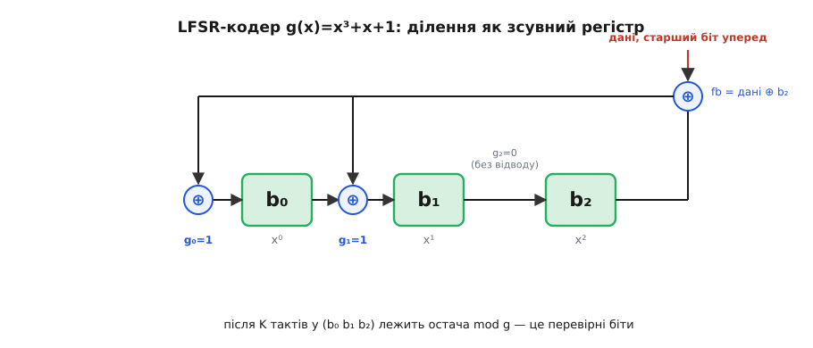
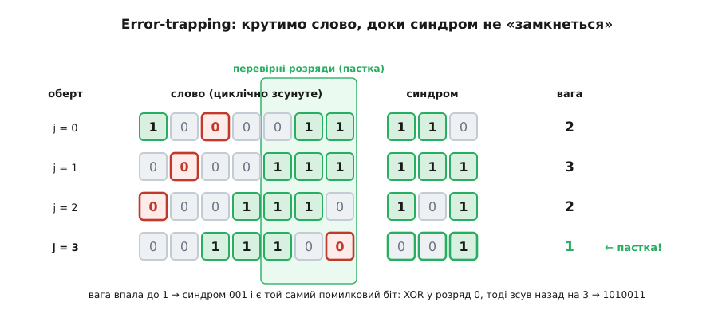

# ⚙️ Кодек циклічного коду: кодер, синдром і пастка для помилки в 60 рядках C

Ось повний робочий кодек [7, 4]-коду [Геммінга](topic:communications/hamming-code) з g(x) = x³ + x + 1 = `1011` — він кодує чотири біти даних у семибітове слово, ми псуємо на «дроті» один біт, а декодер відбудовує оригінал; мова — C, бо кожен рядок тут є бітовою арифметикою над [GF(2)](topic:math/finite-fields) на гарячому шляху, і код, який ви читаєте, майже буквально є вентилями в мікросхемі. Обіцянка циклічного коду — що «дороге» ділення многочленів насправді є жменею зсувів і XOR — легше за все повірити, коли бачиш, як вона працює.

Чому саме C, а не мова зі стеку. Тут немає бізнес-логіки, DTO чи виразності — є регістр, біти й XOR за такт. Ділення над GF(2) — це операція, заради якої залізо будують окремо; C лягає на неї один-в-один, а Python чи TypeScript лише сховали б за абстракцією саме те, що ми хочемо роздивитися. Тому весь кодек — прямий C без залежностей.

## Домовленість про біти — перш ніж писати хоч рядок

Найпоширеніша помилка в кодеках циклічних кодів живе не в алгебрі, а в порядку бітів. Тому спершу зафіксуймо **одну** домовленість і більше від неї не відступаймо.

Слово завдовжки n зберігаємо у звичайному цілому: **біт i числа — це коефіцієнт при xⁱ**. Тоді двійковий запис числа читається старшим степенем ліворуч, як на папері. Твірний многочлен g(x) = x³ + x + 1 стає числом `0b1011`. Дані сидять у старших бітах, а R = n − k перевірних бітів — у молодших. Усе далі підкоряється цьому; варто дзеркально перевернути домовленість (біт 0 — старший степінь) — і кожен зсув поїде не в той бік.

:::tabs
@tab C
```c
#include <stdint.h>
#include <stdio.h>

/* [7,4]-код Геммінга, g(x) = x³ + x + 1 */
#define N 7            /* довжина слова                     */
#define K 4            /* біти даних                        */
#define R (N - K)      /* перевірні біти = 3 = deg g        */
#define G 0x0Bu        /* 0b1011: біт i = коефіцієнт при xⁱ */
```
@tab C++
```cpp
#include <cstdint>

// [7,4]-код Геммінга, g(x) = x³ + x + 1
constexpr int N = 7;                            // довжина слова
constexpr int K = 4;                            // біти даних
constexpr int R = N - K;                        // перевірні біти = 3 = deg g
constexpr std::uint16_t G = 0x0Bu;              // 0b1011: біт i = коефіцієнт при xⁱ
```
:::

## Ділення, що вміє один регістр

Уся машина стоїть на одній операції — остача від ділення на g(x). Над GF(2) шкільне ділення в стовпчик спрощується до краю: віднімання — це XOR, а питання «чи вміщається g у провідний член» — це просто «чи стоїть одиниця у старшому розряді». Ідемо від верхнього біта вниз; де над степенем R стирчить одиниця, XOR-имо туди g, зсунутий так, щоб його старший член погасив саме цей біт.

:::tabs
@tab C
```c
/* остача word mod g(x): ділення XOR-зсувами.
   word — до N бітів; g має степінь R (старший біт g стоїть у розряді R). */
static uint16_t poly_rem(uint16_t word) {
    for (int i = N - 1; i >= R; --i)      /* від старшого біта вниз до розряду R */
        if (word & (1u << i))             /* провідний член ще стирчить? */
            word ^= (G << (i - R));       /* відняти g, вирівняний під xⁱ    */
    return word & ((1u << R) - 1);        /* лишилась остача степеня < R      */
}
```
@tab C++
```cpp
#include <cstdint>

// остача word mod g(x): ділення XOR-зсувами.
// word — до N бітів; g має степінь R (старший біт g стоїть у розряді R).
constexpr std::uint16_t poly_rem(std::uint16_t word) {
    for (int i = N - 1; i >= R; --i)      // від старшого біта вниз до розряду R
        if (word & (1u << i))             // провідний член ще стирчить?
            word ^= (G << (i - R));       // відняти g, вирівняний під xⁱ
    return word & ((1u << R) - 1);        // лишилась остача степеня < R
}
```
:::

Тут захована друга класична пастка — **вирівнювання степеня**. Старший біт g стоїть у розряді R; щоб його одиниця погасила біт i слова, g треба зсунути рівно на `i − R`. Зсунеш на `i` замість `i − R` — і код тихо ділитиме не на те, без жодної помилки компіляції.

## Кодування: дописати остачу

Кодуємо **систематично** — так, щоб дані лишалися видні у слові, а перевірні біти просто дописувалися збоку. Кодове слово c(x) = xᴿ·m(x) + [xᴿ·m(x) mod g(x)]: зсуваємо дані вгору на R розрядів, ділимо на g, а остачу кладемо в молодші R бітів, що звільнилися.

:::tabs
@tab C
```c
/* систематичне кодування: c = m·xᴿ + (m·xᴿ mod g) */
static uint16_t encode(uint16_t msg) {    /* msg — K бітів даних */
    uint16_t shifted = msg << R;          /* зсунути дані вгору на R      */
    return shifted | poly_rem(shifted);   /* дописати остачу в молодші R  */
}
```
@tab C++
```cpp
#include <cstdint>

// систематичне кодування: c = m·xᴿ + (m·xᴿ mod g)
constexpr std::uint16_t encode(std::uint16_t msg) { // msg — K бітів даних
    std::uint16_t shifted = static_cast<std::uint16_t>(msg << R); // зсунути дані вгору на R
    return shifted | poly_rem(shifted);             // дописати остачу в молодші R
}
```
:::

Для m = `1010` це дає shifted = `1010000`, остачу `011` — і слово `1010011`, де старші чотири біти досі читаються як дані, а три молодші порахувалися одним діленням.

## Той самий поділ — як тактований регістр

`poly_rem` жує все слово за раз. Мікросхема так не вміє: біти течуть до неї по одному за такт. Але те саме ділення тоді перетворюється на [регістр зсуву зі зворотним зв'язком (LFSR)](topic:electronics/lfsr) — R тригерів тримають поточну остачу, а відводи XOR стоять рівно там, де в g(x) стоять одиниці. Дані вкидаємо старшим бітом уперед; кожен такт: зворотний біт fb = вхід ⊕ старший тригер; зсув; якщо fb = 1 — додати відводи.


*Ділення на g(x) як залізо: три тригери остачі, відводи XOR там, де в g стоять одиниці (g₀=g₁=1), і жодного відводу там, де нуль (g₂=0). Один такт — один біт даних. Після K тактів у регістрі лежить та сама остача, що її `poly_rem` рахує над цілим словом.*

:::tabs
@tab C
```c
/* те саме кодування, але як робить залізо: R тригерів, дані —
   старшим бітом уперед, по одному за такт (механізм зі схеми вище) */
static uint16_t encode_lfsr(uint16_t msg) {
    uint16_t reg  = 0;                        /* R тригерів остачі            */
    uint16_t taps = G & ((1u << R) - 1);      /* g без старшого члена: відводи */
    for (int i = K - 1; i >= 0; --i) {        /* біти даних, старший уперед   */
        int in = (msg >> i) & 1;              /* вхідний біт                  */
        int fb = in ^ ((reg >> (R - 1)) & 1); /* зворотний зв'язок = вхід ⊕ b₂ */
        reg <<= 1;                            /* зсув b₀→b₁→b₂                */
        if (fb) reg ^= taps;                  /* де gᵢ=1 — додати fb          */
        reg &= (1u << R) - 1;                 /* тримати рівно R бітів        */
    }
    return (msg << R) | reg;                  /* дані у старших, остача — молодші */
}
```
@tab C++
```cpp
#include <cstdint>

// те саме кодування, але як робить залізо: R тригерів, дані —
// старшим бітом уперед, по одному за такт (механізм зі схеми вище)
constexpr std::uint16_t encode_lfsr(std::uint16_t msg) {
    std::uint16_t reg  = 0;                   // R тригерів остачі
    std::uint16_t taps = G & ((1u << R) - 1); // g без старшого члена: відводи
    for (int i = K - 1; i >= 0; --i) {        // біти даних, старший уперед
        int in = (msg >> i) & 1;              // вхідний біт
        int fb = in ^ ((reg >> (R - 1)) & 1); // зворотний зв'язок = вхід ⊕ b₂
        reg <<= 1;                            // зсув b₀→b₁→b₂
        if (fb) reg ^= taps;                  // де gᵢ=1 — додати fb
        reg &= (1u << R) - 1;                 // тримати рівно R бітів
    }
    return static_cast<std::uint16_t>((msg << R) | reg); // дані у старших, остача — молодші
}
```
:::

Обидві функції на m = `1010` повертають `1010011` — та сама остача, дві машини. Різниця в тому, що `encode_lfsr` — це буквально кілька тригерів і вентилів XOR, які ковтають по біту на повній швидкості лінії; ось чому кодування циклічного коду «коштує майже задарма», а той самий регістр, лише [зсувний](topic:electronics/shift-register), стоїть у кожному кадрі, захищеному [CRC](topic:communications/crc).

> 🔧 **Навіщо це.** Придивіться: одна й та сама операція «остача mod g» робить у кодеку три роботи — кодує (остача даних), перевіряє прийняте (синдром) і навіть крутиться всередині виправлення. Це не збіг, а вся суть циклічного коду: раз увесь код — це кратні одного g(x), то єдиний подільник на g і є той універсальний вузол, на якому тримається і кодер, і декодер. Тому в залізі циклічний кодек — це фактично один регістр із відводами, перемкнутий між режимами, а не три різні схеми.

## Синдром: чи ціле те, що прийшло

На прийомі ділимо здобуте слово на g(x). Остача — це **синдром**. Нульовий синдром означає, що слово ділиться на g націло, тобто є кратним g(x) — а отже, кодовим словом: видимої помилки немає. Ненульовий синдром означає, що помилка є, і — головне — саме його значення підказує, **де** вона.

:::tabs
@tab C
```c
/* синдром прийнятого слова = word mod g(x); 0 ⇒ помилки не видно */
static uint16_t syndrome(uint16_t word) { return poly_rem(word); }

static int weight(uint16_t v) {           /* вага Геммінга: скільки одиниць */
    int w = 0;
    while (v) { w += v & 1; v >>= 1; }
    return w;
}

static uint16_t rotl(uint16_t w) {        /* циклічний зсув уліво в N розрядах */
    uint16_t top = (w >> (N - 1)) & 1;    /* біт, що зіскакує зверху, — назад у молодший */
    return ((w << 1) | top) & ((1u << N) - 1);
}
static uint16_t rotr(uint16_t w) {        /* циклічний зсув управо в N розрядах */
    uint16_t bot = w & 1;                 /* молодший біт — наверх */
    return ((w >> 1) | (bot << (N - 1))) & ((1u << N) - 1);
}
```
@tab C++
```cpp
#include <bit>
#include <cstdint>

// синдром прийнятого слова = word mod g(x); 0 ⇒ помилки не видно
constexpr std::uint16_t syndrome(std::uint16_t word) { return poly_rem(word); }

// вага Геммінга через std::popcount з <bit>
constexpr int weight(std::uint16_t v) { return std::popcount(v); }

// циклічний зсув уліво в N розрядах
constexpr std::uint16_t rotl(std::uint16_t w) {
    uint16_t top = (w >> (N - 1)) & 1;
    return ((w << 1) | top) & ((1u << N) - 1);
}

// циклічний зсув управо в N розрядах
constexpr std::uint16_t rotr(std::uint16_t w) {
    uint16_t bot = w & 1;
    return ((w >> 1) | (bot << (N - 1))) & ((1u << N) - 1);
}
```
:::

## Пастка для помилки — error-trapping

Найкрасивіша частина. Одна помилка — це e(x) = xⁱ; прийняте слово дорівнює кодовому плюс xⁱ, тож синдром = xⁱ mod g. Можна було б наперед скласти табличку «позиція → синдром» і шукати в ній. Але є прийом дешевший і суто механічний — **error-trapping**, і це той самий циклічний зсув, лише повернений на службу декодеру.

Ключ ось у чому. Зсунути все слово на один крок по колу — це помножити його многочлен на x за модулем xⁿ − 1. А що при цьому робиться з синдромом? Оскільки g **ділить** xⁿ − 1 (та сама властивість, на якій стоїть увесь код), доданок, що «перескакує через край», щезає за модулем g — і зсув слова на один крок означає рівно **множення синдрому на x за модулем g**. Тобто крутити слово по колу й оновлювати синдром можна тим самим однокроковим діленням, яким ми вже володіємо.

Тепер сама пастка. Поки помилка сидить у старших розрядах, її синдром xⁱ mod g «розмазаний» і має вагу два-три. Та щойно помилка доїде до молодших R розрядів — тих самих перевірних, — стається диво: там степінь помилки менший за R, тож xⁱ mod g = xⁱ, і **синдром буквально дорівнює помилковому бітові**, а його вага падає до одиниці. Отже, рецепт: крути слово, доки вага синдрому не стане одиницею. У цю мить синдром — це і є той зсунутий помилковий біт: XOR-имо його у слово, докручуємо слово назад — і помилки нема.

:::tabs
@tab C
```c
/* виправлення однієї помилки методом error-trapping.
   Повертає виправлене слово; *ok=0, якщо помилок більше, ніж код тягне. */
static uint16_t decode(uint16_t recv, int *ok) {
    uint16_t s = syndrome(recv);
    if (s == 0) { *ok = 1; return recv; }         /* синдром нульовий — слово вже ціле */

    uint16_t w = recv;
    for (int j = 0; j < N; ++j) {
        if (weight(s) <= 1) {                     /* помилка «замкнулась» у перевірних розрядах */
            w ^= s;                               /* синдром і є той самий помилковий біт        */
            for (int back = 0; back < j; ++back)  /* докрутити слово назад на j кроків           */
                w = rotr(w);
            *ok = 1;
            return w;
        }
        w = rotl(w);                              /* ...крутимо слово по колу...        */
        s <<= 1;                                  /* ...а синдром множимо на x mod g:   */
        if (s & (1u << R)) s ^= G;                /* зайшов за степінь R — відняти g     */
    }
    *ok = 0;                                       /* за N обертів пастка не спрацювала — >1 помилки */
    return recv;
}
```
@tab C++
```cpp
#include <bit>
#include <cstdint>
#include <optional>

// виправлення однієї помилки методом error-trapping.
// Повертає std::optional з виправленим словом або std::nullopt при понад 1 помилці.
constexpr std::optional<std::uint16_t> decode(std::uint16_t recv) {
    std::uint16_t s = syndrome(recv);
    if (s == 0) return recv;                      // синдром нульовий — слово ціле

    std::uint16_t w = recv;
    for (int j = 0; j < N; ++j) {
        if (std::popcount(s) <= 1) {              // помилка у перевірних розрядах
            w ^= s;                               // синдром і є помилковий біт
            for (int back = 0; back < j; ++back)
                w = rotr(w);
            return w;
        }
        w = rotl(w);                              // крутимо слово по колу
        s <<= 1;                                  // синдром * x mod g:
        if (s & (1u << R)) s ^= G;                // відняти g при виході за R
    }
    return std::nullopt;                          // понад 1 помилка
}
```
:::

На нашому зіпсутому слові `1000011` (це `1010011` із перекинутим розрядом x⁴) синдром `110` має вагу два, тож пастка не спрацьовує одразу — слово починає крутитися:


*Синдром крутиться разом зі словом: `110 → 111 → 101 → 001`, вага `2 → 3 → 2 → 1`. На четвертому оберті помилковий біт заходить у перевірні розряди, вага падає до одиниці — синдром `001` і є той самий біт. XOR його у слово, докрутити назад на три оберти — і відновлено `1010011`.*

## Наскрізний прогін

Складімо все докупи: закодуємо чотири біти, зіпсуємо один на «дроті», продекодуємо назад.

:::tabs
@tab C
```c
/* друк n молодших бітів v старшим уперед — портативно, без %b */
static void pbits(const char *tag, uint16_t v, int n) {
    printf("%s", tag);
    for (int i = n - 1; i >= 0; --i) putchar(((v >> i) & 1) ? '1' : '0');
    putchar('\n');
}

int main(void) {
    uint16_t msg  = 0x0Au;                 /* дані 1010                    */
    uint16_t code = encode(msg);           /* → 1010011                    */
    pbits("дані      m = ", msg,  K);
    pbits("код       c = ", code, N);
    pbits("код(LFSR) c = ", encode_lfsr(msg), N);   /* та сама остача */

    uint16_t recv = code ^ (1u << 4);      /* внесемо одну помилку: розряд x⁴ */
    pbits("прийнято  r = ", recv, N);
    pbits("синдром   s = ", syndrome(recv), R);      /* 110 ≠ 0 */

    int ok;
    uint16_t fixed = decode(recv, &ok);
    pbits("виправл.  c = ", fixed, N);
    pbits("відновл.  m = ", (uint16_t)(fixed >> R), K);
    printf("ok = %d\n", ok);
    return 0;
}
```
@tab C++
```cpp
#include <bitset>
#include <iostream>
#include <string_view>

// друк n молодших бітів v через std::bitset
template <std::size_t Bits>
static void pbits(std::string_view tag, std::uint16_t v) {
    std::cout << tag << std::bitset<Bits>(v) << '\n';
}

int main() {
    std::uint16_t msg  = 0x0Au;                 // дані 1010
    std::uint16_t code = encode(msg);           // → 1010011
    pbits<K>("дані      m = ", msg);
    pbits<N>("код       c = ", code);
    pbits<N>("код(LFSR) c = ", encode_lfsr(msg)); // та сама остача

    std::uint16_t recv = code ^ (1u << 4);      // внесемо одну помилку: розряд x⁴
    pbits<N>("прийнято  r = ", recv);
    pbits<R>("синдром   s = ", syndrome(recv));   // 110 ≠ 0

    if (auto fixed = decode(recv)) {
        pbits<N>("виправл.  c = ", *fixed);
        pbits<K>("відновл.  m = ", *fixed >> R);
        std::cout << "ok = 1\n";
    } else {
        std::cout << "ok = 0\n";
    }
}
```
:::

Що друкує програма:

```
дані      m = 1010
код       c = 1010011
код(LFSR) c = 1010011
прийнято  r = 1000011
синдром   s = 110
виправл.  c = 1010011
відновл.  m = 1010
```

Одна перекинута одиниця не пройшла: декодер знайшов її циклічним зсувом і повернув `1010` слово в слово.

## Складність і пастки

**Складність.** Кодування через LFSR — це K тактів, по кілька вентилів на такт: O(k). Через `poly_rem` над цілим словом — O(n·(n − k)) простих XOR-ів. Синдром — так само O(n·(n − k)). Error-trapping робить щонайбільше n обертів, кожен коштує один крок ділення O(n − k), разом O(n·(n − k)). Для справжніх CRC чи BCH форма та сама, лише слова довші; коефіцієнт же в залізі — жменя вентилів, і саме тому циклічні коди сидять на гарячому шляху.

**Пастки** — рівно ті три, що їх ховає акуратний приклад:

- **Порядок бітів.** Обери раз: біт i числа = коефіцієнт при xⁱ. Дзеркальна домовленість (біт 0 — старший степінь) перевертає кожен зсув; змішаєш дві в одному файлі — дістанеш слова, що кодуються, але не декодуються.
- **Ширина регістра.** Після кожного XOR зі зворотним зв'язком регістр треба маскувати до R бітів (`reg &= (1u << R) - 1`), інакше він росте вгору й отруює остачу. Ціле для слова мусить мати щонайменше n бітів: `uint16_t` тягне n ≤ 16; для CRC-32 треба `uint32_t`, і там пильнуй, щоб `1u << 31` не переповнило знаковий `int` — бери `1uL`/`1ul` та беззнакові типи.
- **Вирівнювання степеня.** Старший член g стоїть у розряді R; гаси ним біт i зсувом на `i − R`, не на `i`. Ця однобітова похибка не падає компіляцією — вона просто дає сміття.

І ще дві межі, про які варто пам'ятати. По-перше, g **мусить** нести свій старший член: записати g як `0b011` замість `0b1011` — означає ділити на інший, неправильний многочлен. По-друге, ця пастка виправляє **одну** помилку, бо [7, 4]-код Геммінга має мінімальну відстань 3 (t = 1), а його швидкість R = 4/7 менша за 1/t = 1 — рівно та зона, де простий error-trapping працює без хитрощів. Більше помилок за оберт у перевірні розряди не «замкнути»: тоді беруть варіанти з покривними многочленами (метод, що його вигострив Тадао Касамі 1964 року) або всю алгебраїчну машинерію [кодів BCH](topic:communications/bch-codes) чи [Рід — Соломона](topic:communications/reed-solomon). Сам же прийом «крути слово, доки помилка не замкнеться» — класичний найпростіший декодер циклічних кодів, що виріс із того самого погляду на зсув як на множення; статус цього — усталений.
