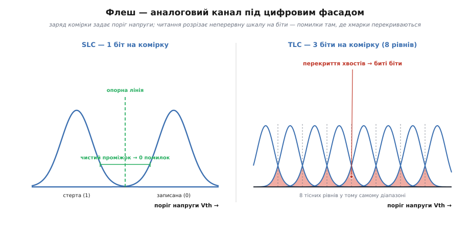
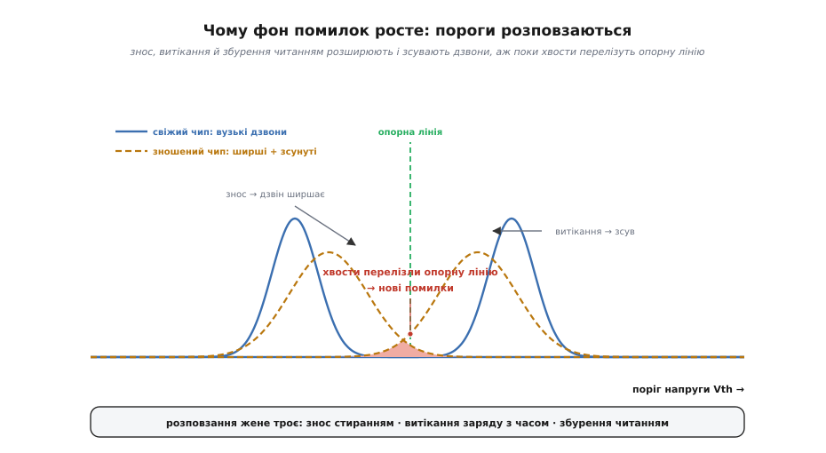

# ECC у флеш-пам'яті

<preknowlist>
- [ECC у пам'яті](topic:communications/ecc-ram-flash) — код виправлення дописує до кожного блоку контрольні біти й тихо лагодить перевернуті, поки їх менше за його межу.
- [Flash зсередини](topic:programming/flash-internals) — біт тут це заряд, замкнений у комірці; читають його, вимірюючи поріг напруги, а кожне стирання трохи зношує ізолятор.
- [Рівні комірки NAND (SLC/MLC/TLC/QLC)](topic:electronics/nand-cell-levels) — що більше бітів утиснуто в одну комірку, то тісніші проміжки напруги між станами й то вищий фоновий рівень помилок.
- [Код Геммінга](topic:communications/hamming-code) — базовий код, що синдромом знаходить і виправляє один перевернутий біт на слово.
</preknowlist>

Флеш-пам'ять зберігає дані не тому, що її комірки надійні, а тому, що над ними стоїть код. Це не фігура мови, а буквальний опис: сучасна NAND-мікросхема віддає стільки перевернутих бітів, що без виправлення була б непридатна для зберігання вже з перших тижнів служби. [ECC](topic:communications/ecc-ram-flash) — контрольні біти, дописані до кожної сторінки, — тут не запобіжник на випадок біди, а несуча стіна, без якої вся споруда розсипається.

І це головна відмінність флешу від оперативної пам'яті. У RAM код теж стоїть, але там він ловить рідкісну подію — [перевернутий космічною частинкою біт](topic:algorithms/bit-flips), збій, якого може не статися роками. У флеші помилки — не подія, а **постійний фон**, що лише густішає з віком носія. Тож придивімося до флешу очима коду: що це за канал, звідки в цілком справному чипі береться шум, чому цей шум росте — і як код мусив міцніти, щоб за ним устигати.

### Помилка — це заплилий поріг напруги

Щоб побачити, звідки беруться помилки, спустімося на рівень комірки. Біт у флеші — це **замкнений заряд**: комірка тримає певну кількість електронів в ізольованій «кишені», і саме цей заряд задає, за якої напруги комірка «відмикається» при читанні — її **поріг** (англ. *threshold voltage*, Vth). Порожня комірка відмикається за низької напруги, заряджена — за вищої. Читання — це одне-єдине питання: поріг цієї комірки вищий чи нижчий за опорну напругу? Нижчий — читаємо один біт, вищий — протилежний.

Отже, під цифровим фасадом флеш насправді **аналоговий**. Комірка зберігає не чистий нуль-чи-одиницю, а конкретну величину заряду, і читання лише **розрізає** цю неперервну шкалу опорною напругою на дискретні рівні. А заряд можна виміряти хіба приблизно й, гірше, він **не стоїть на місці**. Щойно поріг комірки поповз і перетнув опорну лінію — читання дає протилежний біт. Ось що таке «перевернутий біт» у флеші: не фізичний злам, а те, що аналогова величина заплила за межу, якою її ділили на біти.

Комірок мільярди, і жодні дві не заряджаються однаково точно. Ті, що мали б тримати один рівень, розсіюються навколо нього хмаркою — **розподілом** порогів у формі дзвона. Поки дзвони сусідніх рівнів стоять нарізно з чистим проміжком, опорна лінія лягає в цей проміжок і всіх розсортовує безпомилково. Помилки народжуються там, де **хвости сусідніх дзвонів перекриваються**: комірка з крайнього хвоста одного рівня заповзає на бік сусіда — і читання зараховує її не туди. Частка таких заблуканих комірок і є [сира частота бітових помилок](topic:communications/flash-ecc-budget) (RBER) — те, що код бачить на вході. Наскільки саме перекриття хвостів задає RBER, легко порахувати, узявши дзвони за гаусові: частка помилок падає різко, щойно проміжок між рівнями більшає бодай трохи проти ширини дзвона — [скільки помилок дає перекриття порогів](topic:communications/ecc-flash/math-vth-overlap.md).


*Флеш — аналоговий канал під цифровим фасадом. Заряд комірки задає поріг напруги (Vth); читання розрізає цю неперервну шкалу опорними лініями на біти. Ліворуч у SLC лише два рівні з широким чистим проміжком — дзвони не перекриваються, помилок нема. Праворуч у TLC у той самий діапазон утиснуто вісім рівнів; проміжки тісні, хвости сусідніх дзвонів **перекриваються** — і кожна комірка із зони перекриття читається неправильно. Помилки флешу — це перекриття хмарок порогів.*

### Кілька бітів у комірці — і чим за це платять

Тепер — рішення, що робить флеш дешевим і водночас пояснює всю драму з кодом. Заряд у комірці можна міряти не лише «є/нема», а **ступенями**: якщо навчитися розрізняти чотири рівні заряду, одна комірка нестиме два біти; вісім рівнів — три біти; шістнадцять — чотири. Так з'явилися покоління NAND: **SLC** (*single-level cell*, два стани — один біт), **MLC** (*multi*, чотири рівні — два біти), **TLC** (*triple*, вісім — три) і **QLC** (*quad*, шістнадцять — чотири). Кожен крок майже задарма множить ємність чипа — тим-то ринок і котиться в цей бік.

Але вікно напруги комірки не гумове. Утиснути в той самий діапазон удвічі більше рівнів означає удвічі **звузити проміжки** між сусідніми дзвонами. А дзвони своєї ширини не зменшують — вона задана фізикою заряджання. Виходить пастка: **той самий** дрейф порога, що в SLC не дотягнув би до опорної лінії, у TLC чи QLC легко перестрибує кілька тісних меж поспіль. Тому сирий рівень помилок не повзе, а **стрибає** з кожним поколінням: там, де SLC тримає RBER десь 10⁻⁶…10⁻⁴, QLC стартує вже з 10⁻³ і гірше — на порядки густіший фон, і це у **свіжого**, ще не зношеного чипа.

Звідси прямий наслідок для коду. У SLC-епоху вистачало [коду Геммінга](topic:communications/hamming-code) — «один биток на слово», бо більше й не траплялося. MLC підняв фон настільки, що знадобився код, здатний виправляти **десятки** бітів на сектор, — узяли [BCH](topic:communications/bch-codes) (за іменами Боуза, Рей-Чаудгурі й Хоквінгема), пряме узагальнення Геммінга на багато помилок. А коли настала пора щільних TLC і QLC, BCH почав захлинатися — і флеш перейшов на [LDPC](topic:communications/ldpc), код розрідженої перевірки парності, що тримає куди вищий фон помилок за майже тієї ж надлишковості. Код міцнішав не з примхи, а рівно тому, що канал під ним ставав дедалі шумнішим. Ця гонитва — окрема історія з датами й іменами: коли й чому флеш пересідав з коду на код і чому перехід на LDPC був важким — [як флеш вимагав дедалі міцнішого коду](topic:communications/ecc-flash/hist-code-escalation.md).

### Чому фон помилок росте з часом

Фон помилок свіжого чипа — лише початок. Найгірше, що він **не стоїть на місці**, а повзе вгору впродовж життя носія — і женуть його кілька окремих механізмів, кожен по-своєму зсуваючи чи розширюючи дзвони порогів.

**Знос стиранням** — головний. Щоб стерти комірку, крізь тонесенький ізолятор під нею **проганяють заряд** (квантовим тунелюванням). Кожне таке проганяння лишає в ізоляторі дефекти — пастки, крізь які заряд потім легше витікає. Що більше циклів «стерти-записати», то дірявіший ізолятор і то ширші дзвони. Саме тому флеш має **скінченний ресурс**: не через раптовий злам, а через поступове розповзання порогів, аж доки код перестає встигати. Фізику самого зносу докладно розбирає [сусідня тема](topic:electronics/flash-wear-leveling).

**Витікання з часом** (*retention* — утримання). Навіть якщо комірку не чіпати, замкнений заряд поволі просочується назовні — місяцями й роками. Дзвони сповзають у бік «порожньо», і біт, записаний рік тому, прочитати важче, ніж учорашній. Тому специфікації флешу окремо обумовлюють, скільки даних мусять протриматися без живлення (типово рік для споживчого носія); зношений наприкінці ресурсу чип тримає їх найгірше.

**Збурення читанням** (*read disturb*). Прикрий парадокс: саме читання теж псує дані. Щоб прочитати одну сторінку в NAND, на решту комірок того самого ланцюжка подають «пропускну» напругу, аби вони не заважали, — і ця напруга щоразу ледь-ледь підштовхує їхній заряд угору. Одне читання — дрібниця, але тисячі читань того самого блоку помалу зрушують чужі пороги, аж поки хтось перелізе межу. Тому інтенсивно читаний блок теж накопичує помилки, хоч у нього нічого не писали.


*Чому RBER росте впродовж життя носія. У свіжого чипа дзвони порогів вузькі й стоять по свій бік опорної лінії — помилок майже нема. Три механізми женуть їх один на одного: **знос стиранням** розширює дзвони (дірявий ізолятор), **витікання** зсуває їх у бік «порожньо», **збурення читанням** підштовхує чужі пороги. Разом вони заганяють хвости за опорну лінію — і зона перекриття (червоне) стає новими помилками. Код добирають так, щоб він тримав межу навіть за найгіршого, кінцевого RBER наприкінці ресурсу.*

### Де насправді працює код — у контролері, не в чипі

Хто ж рахує цей код — сама мікросхема пам'яті? Ні. Гола NAND-мікросхема **не вміє** виправляти помилки — вона лише віддає прочитане, з усіма перекрученими бітами. Код живе в **контролері** — окремому чипі (в SSD, eMMC, картці пам'яті чи вбудованому в мікроконтролер), що стоїть між хостом і сирою пам'яттю.

Влаштовано це так. До кожної **сторінки** даних NAND має причеплену **запасну зону** (англ. *spare area*, або OOB — *out-of-band*, «поза смугою» даних) — кілька зайвих байтів, куди контролер кладе контрольні біти. Коли хост просить сторінку, контролер читає **і дані, і запасну зону**, проганяє їх крізь свій **рушій ECC**, той виправляє стільки перевернутих бітів, скільки дозволяє код, — і хостові віддається вже **чистий** блок. Хост про всю цю боротьбу не знає; він бачить надійну пам'ять, а не сирий шумний канал під нею. Контролер робить і більше — веде [шар трансляції адрес (FTL)](topic:algorithms/ftl-flash-translation), розкладає знос, — але серцевина його роботи саме тут: перетворити ненадійну NAND на носій, що чесно тримає задану межу помилок. У найновіших чипів частину роботи взяла на себе сама пам'ять — **on-die ECC**, простенький код прямо на кристалі NAND, що прибирає найлегші поодинокі помилки ще до контролера; але це лише перший, дешевий шар, а важку роботу все одно тягне контролер.

Скільки ж місця з'їдають самі контрольні біти? Прикиньмо — і побачимо, що навіть сильний код обходиться в кілька відсотків.

**Приклад (ціна контрольних бітів).** Візьмімо сектор даних 1 КіБ і код BCH, що виправляє t = 40 бітів у ньому.

```
дані:            1 КіБ = 8192 біти
BCH над GF(2ᵐ):  на виправлення t бітів треба ≈ t·m контрольних бітів,
                 де m — розмір символу, а довжина слова ≤ 2ᵐ−1
                 8192 + запас ≤ 2¹⁴−1 = 16383   →   m = 14

контрольні біти ≈ t·m = 40 · 14 = 560 біт = 70 байтів
надлишок        = 70 / 1024 ≈ 6.8 %
```

Кількадесят зайвих байтів на кілобайт — і код прибирає до сорока перевернутих бітів у цьому кілобайті. Для порівняння: SLC-епосі вистачало Геммінга з якимось десятком контрольних бітів на той самий кілобайт — частка нижча за 0.2 %. Ціна захисту зросла разом із силою коду, але лишилася в межах кількох відсотків: як і в Геммінга, на довшому блоці кілька контрольних символів «обслуговують» багато даних, тож відносна ціна падає з розміром.

### Козир флешу — м'яке рішення

Лишилося пояснити, чому саме LDPC витіснив BCH, — і тут ховається найкрасивіша ідея всієї теми. Розгадка — в аналоговій природі флешу. Звичайне читання її **викидає** — воно ставить одне питання (поріг вищий чи нижчий за опорну лінію?) і повертає голий біт. Але ж комірка, що ледь-ледь перелізла межу, і комірка, що сидить глибоко у своєму рівні, дають той самий біт, хоча **впевненість** у них геть різна. Ця впевненість — цінна інформація, і звичайне читання її втрачає.

Флеш уміє її повернути. Досить прочитати комірку **кілька разів, щоразу трохи зсуваючи опорну напругу** (цей прийом звуть *read-retry*). Комірка, що змінює свій біт від найменшого зсуву лінії, сидить **упритул** до межі — їй віри мало. Комірка, що тримає свій біт за всіх зсувів, сидить глибоко — їй віри багато. Кілька перечитувань перетворюють голий біт на **м'яке рішення** (англ. *soft decision*): не просто «0 чи 1», а «0 з такою-от певністю».


*Тверде рішення викидає те, що м'яке зберігає. Ліворуч звичайне читання проводить **одну** опорну лінію: комірка на самій межі й комірка глибоко в рівні віддають однаковий біт, а різниця в певності гине. Праворуч кілька зсунутих перечитувань (*read-retry*) розмічають **смуги певності**: комірка з крайньої смуги — «майже напевно», з центральної — «дуже непевно». Ці м'які значення й живлять LDPC, який зважує кожен біт за довірою до нього — і тому витягує дані з куди шумнішого каналу, ніж BCH, що бачить лише голі біти.*

Ось у чому перевага LDPC. BCH — код **твердого рішення**: він їсть лише голі біти й нічого не знає про певність кожного. LDPC натомість **живиться м'якою інформацією**: він зважує кожен біт за його певністю й тому витягує дані з куди шумнішого каналу за ту саму надлишковість. Саме тому, коли фон помилок TLC/QLC переріс можливості BCH, флеш пересів на LDPC — не бо LDPC «математично кращий узагалі», а бо він **уміє скористатися** тим аналоговим запасом, який флеш здатен віддати, а BCH — ні. Механіку м'якого декодування (як певності перетворюються на ймовірності й «переконують» одна одну) розбирає [сама тема про LDPC](topic:communications/ldpc). Наскільки м'яке рішення виграє проти твердого на тому самому каналі — видно на маленькій моделі: [тверде й м'яке читання поруч](topic:communications/ecc-flash/proj-soft-read.md).

Задарма це не дається: кожне додаткове перечитування коштує **часу**. Тому контролер починає з одного швидкого твердого читання й береться за read-retry та м'яке декодування лише тоді, коли твердого забракло — тобто на зношеній, шумній пам'яті. Звідси знайоме явище: старий, добряче списаний накопичувач не тільки зношується, а й **читає повільніше** — бо дедалі частіше змушений перечитувати комірки по кілька разів, щоб код таки зійшовся.

> 🔧 **Навіщо це.** Розуміння, що флеш живе на коді, прямо впливає на рішення інженера, навіть якщо він ніколи не пише кодів виправлення сам. Перше: **вибір типу пам'яті — це вибір запасу міцності**. QLC дешевий і місткий, але стартує з високого фону помилок і має малий ресурс; для системи, що часто перезаписує (логер, буфер телеметрії), варто брати SLC чи pSLC — дорожче за байт, зате запас циклів на порядок більший. Друге: **лічильник виправлених бітів**, який віддає контролер, — це безцінний ранній сигнал зносу; він росте задовго до того, як блок відмовить, тож стежити за ним варто. Третє: якщо старий накопичувач раптом **читає повільніше** — це не «збіг», а read-retry: код уже змушений перечитувати комірки, тобто пам'ять близько до межі й дані час рятувати. І четверте: скінченність ресурсу флешу — не дефект, а прямий наслідок гонитви коду за шумом; проєктуючи збереження у вбудованій системі, це закладають у розрахунок, а не сподіваються, що «якось витримає».

Зведімо ниткою. Флеш — це аналоговий канал під цифровим фасадом: біт тут заряд, а «перевернутий біт» — заряд, чий поріг заплив за опорну лінію. Комірки розсіяні хмарками порогів, і помилки народжуються там, де хмарки перекриваються. Щоб здешевити пам'ять, у комірку кладуть дедалі більше рівнів — проміжки тісніють, і той самий дрейф дає дедалі густіший фон помилок; а знос, витікання й збурення читанням женуть цей фон угору впродовж усього життя носія. Код мусив бігти за шумом: від Геммінга в SLC до BCH у MLC й до LDPC у TLC/QLC — бо саме LDPC уміє скористатися м'яким рішенням, тим аналоговим запасом, який флеш здатен віддати перечитуванням. Уся ця машина живе в контролері й коштує кілька відсотків місця — і рівно завдяки їй фізично тлінна NAND віддає хостові чистий, надійний носій, аж доки код устигає виправляти більше помилок, ніж їх народжується.
