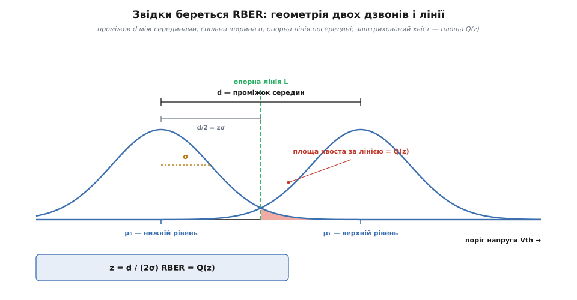

# 🧮 Скільки помилок дає перекриття порогів

<preknowlist>
- [Центральна гранична теорема](topic:math/central-limit) — сума багатьох дрібних незалежних доданків, хоч би звідки кожен узявся, збирається в той самий дзвін; тому й пороги мільярдів комірок лягають дзвоном.
- [Нормальний розподіл](topic:math/normal-distribution) — цей дзвін заданий рівно двома числами: серединою μ і шириною σ; частку його «хвоста» за якоюсь межею дає функція Q.
- [Рівні комірки NAND (SLC/MLC/TLC/QLC)](topic:electronics/nand-cell-levels) — у фіксоване вікно напруги втискають 2, 4, 8 чи 16 рівнів заряду; що більше рівнів, то тісніший проміжок між сусідами.
- [RBER — сира частота бітових помилок](topic:communications/flash-ecc-budget) — частка перевернутих бітів, яку пам'ять віддає кодові на вхід; саме її ми зараз виведемо з геометрії порогів.
</preknowlist>

Помилка у флеші — це аналогова величина, що заплила за межу, якою її ділили на біти. Сказати так — значить пообіцяти, що частку помилок можна не міряти, а **порахувати**: якщо ми знаємо, як розсіяні пороги й де стоїть опорна лінія, доля перевернутих бітів визначена геометрією. Виведімо цю формулу від першопринципів. Вона виявиться коротшою, ніж очікуєш, і лютішою, ніж підказує інтуїція «трохи розсунув дзвони — трохи менше помилок»: насправді проміжок між рівнями входить у відповідь **у квадраті під експонентою**, і саме звідси беруться і скінченний ресурс флешу, і стрибок помилок на порядки з кожним зайвим бітом у комірці.

## Означення: помилка — це площа хвоста за лінією

Візьмімо дві сусідні хмарки порогів. Комірки, що мали б тримати нижчий рівень, розсіяні дзвоном із серединою μ₀; комірки вищого рівня — дзвоном із серединою μ₁, і між серединами лежить **проміжок** d = μ₁ − μ₀. Обидва дзвони мають ту саму ширину σ (за визначенням — стандартне відхилення порогів; на око це піврозмах дзвона на висоті його вигину). Між ними, десь у проміжку, стоїть **опорна лінія** L — та сама напруга, з якою читання порівнює поріг кожної комірки: нижче L — читаємо один рівень, вище — сусідній.

Тепер спитаймо просте питання. Візьмімо комірку нижнього рівня. Її поріг — не точно μ₀, а якесь випадкове число з нижнього дзвона. Здебільшого воно менше за L, і комірка читається правильно. Але в дзвона є хвіст, що тягнеться праворуч, за лінію L. Комірка, чий поріг випав туди, — вона фізично справна, заряджена як слід, просто трохи «переборщила», — прочитається як **сусідній** рівень. Це і є перевернутий біт. А скільки таких комірок? Стільки, яка **частка площі** нижнього дзвона лежить праворуч від L. Помилка — це площа хвоста за лінією, буквально й без метафор.

Симетрично з іншого боку: комірка верхнього рівня, чий поріг випав ліворуч від L (недобрала заряду), прочитається як нижній рівень — теж помилка, теж хвіст, тепер лівий хвіст верхнього дзвона.

Лишається одне рішення проєктувальника: **де ставити лінію L?** Зсунеш її праворуч — зменшиш лівий хвіст верхнього дзвона, але роздмухаєш правий хвіст нижнього. Є одна точка, де сумарна площа двох хвостів найменша, — і це точка, де дзвони **перетинаються**. За рівних σ і рівних populяцій рівнів вона лежить точно посередині проміжку, на відстані d/2 від кожної середини:

```
L = μ₀ + d/2 = μ₁ − d/2
```

Це не довільний вибір і не зручність — це оптимум: будь-який зсув лінії від точки перетину лише додає помилок. (Контролер наперед не знає справжніх σ і populяцій, тож ставить лінію «на око» посередині; підкрутити її, дивлячись на самі дані, — це і є *read-retry*, коли пам'ять перечитують зі зсунутою опорною напругою.) Отже, найкраще, що взагалі можливо: лінія посередині, і кожен дзвін відрізаний нею на відстані d/2 від своєї середини.

## Чому пороги лягають саме дзвоном

Перш ніж рахувати площу хвоста, треба чесно спитати: а чому дзвін? Чому не якась інша хмарка? Тут працює одна з найглибших теорем усієї теорії ймовірностей. Кінцевий заряд у комірці — це **сума багатьох дрібних незалежних доданків**: скільки електронів заскочило за кожен імпульс програмування, скільки застрягло в пастках ізолятора, як щойно смикнув [випадковий телеграфний шум](topic:math/normal-distribution), як саме ця комірка відрізняється від сусідки за розміром на кілька атомів. Жоден доданок не панує; їх багато, і вони майже незалежні. А [центральна гранична теорема](topic:math/central-limit) каже: сума багатьох дрібних незалежних внесків, хоч би звідки кожен узявся, збирається в **той самий** дзвін — нормальний розподіл. Форма хмарки порогів — не припущення для зручності, а прямий наслідок того, що заряд накопичується з багатьох дрібниць.

> 🔧 **Навіщо це.** Дзвін заданий двома числами — серединою μ і шириною σ, — і вся інженерія флешу зводиться до боротьби за ці два числа. Середини рівнів розсовує сам дизайн комірки (де їх поставити у вікні напруги); ширину σ роздмухує фізика — знос, витікання, збурення. Усе, що робить контролер і технолог, — це або тримати d великим, або тримати σ малим. Формула нижче показує, що з цих двох важелів важливіший, і на скільки саме.

Той самий дзвін корисно записати в «нормованих» координатах. Виміряймо відстань не у вольтах, а **в сигмах**: наскільки поріг далекий від своєї середини, поділений на σ. Ця безрозмірна відстань — стандартна нормальна величина, і вся інформація про хвіст сидить у ній. Дзвін де Муавра (нормальну криву першим вивів Абрагам де Муавр 1733 року як наближення біномного розподілу, включно з площами хвостів; узагальнив її Лаплас, а ім'я «гаусова» пристало пізніше через працю Гаусса про метод найменших квадратів — тож назва умовна, а не свідчення першості) в нормованих координатах має один-єдиний вигляд, і площа його хвоста за відстанню z дістала окрему назву.

## Від хвоста до Q: апарат

Позначмо **Q(z)** — площу правого хвоста стандартного дзвона за межею z сигм від середини:

```
Q(z) = (1/√(2π)) · ∫  e^(−t²/2) dt        (інтеграл від t = z до +∞)
```

Це просто «яка частка комірок відхилилася від своєї середини далі, ніж на z сигм праворуч». Тепер підставмо нашу геометрію. Лінія стоїть на відстані d/2 від середини нижнього дзвона, а ширина дзвона — σ. Отже, у сигмах ця відстань дорівнює:

```
z = (d/2) / σ = d / (2σ)
```

І частка комірок нижнього рівня, що заповзли за лінію, — це рівно Q(z):

```
P(комірка нижнього рівня прочитається як верхній) = Q( d / 2σ )
```

Тепер зберімо повний RBER на цій межі. Половина комірок належить нижньому рівню й помиляється з імовірністю Q(d/2σ); половина належить верхньому й — за дзеркальною симетрією — помиляється з тією самою імовірністю. Частки populяцій ½ і ½ додаються, а множники скорочуються:

```
RBER = ½·Q(d/2σ)  +  ½·Q(d/2σ)  =  Q( d / 2σ )
```

Ось і вся формула. **Сира частота помилок на одній межі дорівнює Q від половини проміжку в сигмах.** Уся драма флешу — у поведінці цієї однієї функції.

Рахувати Q(z) вручну незручно (це «недобраний» інтеграл), тому його виражають через стандартну доповнювальну функцію похибки `erfc`, яка є в кожній бібліотеці й на кожному калькуляторі:

```
Q(z) = ½ · erfc( z / √2 )              ⇒     RBER = ½ · erfc( d / (2√2·σ) )
```

У коді це один рядок — той самий інтеграл хвоста, що задає ймовірність переплутати біт у радіоканалі ([BER = Q(√(2·Eb/N0))](topic:communications/ber-snr-curve)): скрізь, де гаусів шум зустрічає поріг рішення, з'являється те саме Q.

```python
from math import erfc, sqrt

def rber(d, sigma):
    "Частка помилок на одній межі: два дзвони на відстані d, спільна ширина sigma."
    z = d / (2 * sigma)               # запас у сигмах
    return 0.5 * erfc(z / sqrt(2))    # = Q(z), площа хвоста за опорною лінією

rber(0.40, 0.065)   # → 1.05e-03   свіжий TLC: проміжок 0.40 В, дзвін 0.065 В
rber(0.40, 0.090)   # → 1.31e-02   той самий чип, дзвін розповз до 0.090 В
```


*Звідки береться формула. Проміжок між серединами рівнів — d, ширина кожного дзвона — σ, опорна лінія стоїть посередині, на відстані d/2 від кожної середини. У сигмах ця відстань — z = d/2σ. Заштрихований правий хвіст нижнього дзвона за лінією — це комірки, що прочитаються як сусідній рівень; його площа й дорівнює Q(z). Уся сира частота помилок на цій межі — Q(d/2σ). Розсунути дзвони (більше d) або звузити їх (менше σ) — значить збільшити z і загнати хвіст у зникання.*

## Чому спад надекспоненційний — і чому це головне

Формула RBER = Q(d/2σ) виглядає сумирно, аж поки не глянеш, **як круто** Q падає. Для великих z у хвоста нормального дзвона є точне наближення:

```
Q(z) ≈  e^(−z²/2) / ( z·√(2π) )
```

Головний тут — множник **e^(−z²/2)**. Підставмо z = d/2σ і побачимо, що саме сидить у показнику:

```
RBER ≈  e^(−z²/2) / (…)  =  exp( − d² / (8σ²) ) / (…)
```

Ось воно, серце теми. Проміжок d входить у показник **у квадраті**. Це не звичайний експонент e^(−k·d), де подвоєння d квадратує помилку, — це e^(−k·d²), де показник сам росте з квадратом проміжку. Тому спад **надекспоненційний**: невеличке розсування дзвонів валить хвіст не в рази, а на порядки, і що далі, то швидше. Порахуймо цю крутість напряму — скільки порядків коштує кожні пів-сигми, на які поріг дальший від лінії:

```
z = 3.0 :  Q = 1.35·10⁻³
z = 3.5 :  Q = 2.33·10⁻⁴     (×5.8  за пів-сигми запасу)
z = 4.0 :  Q = 3.17·10⁻⁵     (ще ×7.3)
z = 5.0 :  Q = 2.87·10⁻⁷     (ще ×110)
```

Кожні пів-сигми запасу коштують дедалі більше порядків — бо локальний нахил кривої, −z/ln10 порядку на сигму, сам росте із z. У напівлогарифмічних координатах це означає, що крива RBER проти запасу — **не пряма** (пряма була б у звичайного експонента), а парабола, що загинається все крутіше вниз. Саме ця парабола і є «водоспадом» надійності: за лінійним рухом опорної точки по осі напруги стоїть квадратичний обвал у показнику помилки.

> 🔧 **Навіщо це.** Уся доля комірки залежить не від d і не від σ окремо, а від **одного** числа — запасу в сигмах z = d/2σ. QLC з широким дзвоном і SLC з вузьким можуть мати однаковісінький RBER, якщо збіглися їхні z; а два начебто схожі чипи з різницею в z всього на одну сигму розійдуться в надійності на порядки. Тому лічильник виправлених бітів, який віддає контролер, — це насправді вимірювач z: він росте не тому, що «щось зламалося», а тому, що знос повільно з'їдає запас у сигмах, і Q цей запас карає квадратично.


*Один графік, обидва важелі. По горизонталі — запас z = d/2σ у сигмах, по вертикалі (логарифмічно) — RBER = Q(z). Крива не пряма, а парабола: показник спаду сам квадратичний за z, тож рух ліворуч обвалює надійність надекспоненційно. Усе, що стискає проміжок d (зайвий рівень у комірці) або роздуває дзвін σ (знос, витікання, збурення), — це рух **ліворуч** по цій кривій, до густішого фону помилок. SLC і MLC сидять так далеко праворуч, що хвіст зникає; уся драма флешу відбувається на крутому лівому схилі, де живуть TLC і QLC.*

## Важіль перший: більше рівнів стискає проміжок

Тепер прикладімо формулу до першого важеля — числа рівнів у комірці. Вікно напруги комірки фіксоване фізикою (є найвища напруга, до якої безпечно заряджати, і найнижча). Назвімо його W. Якщо в це вікно втиснути L рівнів, між ними буде L−1 проміжків, і в найкращому разі — рівних:

```
SLC (2 рівні):  1 проміжок  →  d = W
MLC (4 рівні):  3 проміжки  →  d = W/3
TLC (8 рівнів): 7 проміжків  →  d = W/7
QLC (16 рівнів):15 проміжків →  d = W/15
```

Кожне покоління коротшає d приблизно вдвічі-втричі. А що RBER ≈ exp(−d²/8σ²), скорочення d б'є в показник **квадратично** — тому RBER не повзе, а стрибає на порядки. Порахуймо на наскрізних числах.

**Приклад (той самий кремній, TLC проти QLC).** Візьмімо представницькі числа свіжого TLC-чипа: проміжок d = 0.40 В, ширина дзвона σ = 0.065 В. Тоді вікно й QLC у ньому виходять так:

```
свіжий TLC:
    z = d/(2σ) = 0.40 / (2·0.065) = 0.40/0.130 = 3.08
    RBER = Q(3.08) = ½·erfc(3.08/√2) = ½·erfc(2.18) = ½·(2.1·10⁻³) = 1.0·10⁻³

те саме вікно, але 16 рівнів (QLC):
    W = 7·d = 7·0.40 = 2.8 В            (вікно з TLC)
    d(QLC) = W/15 = 2.8/15 = 0.187 В    (15 проміжків на 16 рівнів)
    z = 0.187 / (2·0.065) = 1.44
    RBER = Q(1.44) = ½·erfc(1.02) = ½·(1.50·10⁻¹) = 7.5·10⁻²
```

Той самий кристал, та сама фізика заряджання, той самий дзвін — лише вдвічі більше рівнів, — і сирий фон стрибнув із 1.0·10⁻³ до 7.5·10⁻², у **сімдесят п'ять разів**. Ось звідки в статті-власнику слова, що QLC стартує з фону на порядки густішого, ніж SLC: не через гіршу фізику комірки, а через геометрію тіснішого проміжку, яку Q карає квадратично.

І звідси — оцінка ціни. Щоб повернути QLC бодай до свіжого TLC-рівня 10⁻³, тобто до z = 3.08, при незмінному d(QLC) = 0.187 В дзвін довелося б звузити до:

```
σ' = d(QLC) / (2·3.08) = 0.187 / 6.16 = 0.030 В        (менш ніж половина колишньої ширини)
```

Ось справжня ціна кожного зайвого біта в комірці: або миритися з фоном помилок на два порядки густішим, або навчитися заряджати комірку **вдвічі точніше**. Саме за це друге платять переходом на об'ємну (3D) NAND і на покрокове програмування з дедалі меншим кроком — усе заради того, щоб стиснути σ й повернути запас, який з'їв зайвий рівень.

## Важіль другий: знос розширює дзвін

Другий важіль б'є в те саме z з іншого боку — не стискає d, а роздуває σ. Проміжок між рівнями заданий раз і назавжди дизайном, а от ширина дзвона **не стоїть на місці**: щоразу, як крізь ізолятор проганяють заряд на стирання, у ньому лишаються нові пастки, крізь які заряд потім легше й нерівномірніше витікає ([фізику зносу розбирає окрема тема](topic:electronics/flash-wear-leveling)). Комірки починають розходитися сильніше — дзвін ширшає. І та сама квадратична крутість Q, що робила стиснення d таким болючим, робить болючим і розповзання σ.

**Приклад (той самий TLC наприкінці ресурсу).** Проміжок незмінний, d = 0.40 В, але знос розповз дзвін із 0.065 до 0.090 В — приріст ширини всього на 38%.

```
z = d/(2σ) = 0.40 / (2·0.090) = 0.40/0.180 = 2.22
RBER = Q(2.22) = ½·erfc(2.22/√2) = ½·erfc(1.57) = ½·(2.6·10⁻²) = 1.3·10⁻²

зростання фону:  1.3·10⁻² / 1.0·10⁻³  ≈  13×
```

Тридцять вісім відсотків ширшого дзвона — і сирий фон погустішав **у тринадцять разів**, більше ніж на порядок. Не «трохи гірше з віком», а стрибок через увесь запас, який мав чип на початку. Ось чому флеш має скінченний ресурс: знос лінійно точить σ, а Q обвалює надійність від квадрата цього σ, і рано чи пізно RBER переростає межу, яку ще виправляє код. Обидва важелі — зайві рівні й знос — це один і той самий рух ліворуч по кривій водоспаду: перший стискає чисельник d, другий роздуває знаменник σ, а страждає їхнє відношення z, до якого Q така немилосердна.

## Де формула працює — і де ламається

Формула RBER = Q(d/2σ) — це кістяк, і чесно назвати, де вона гнеться.

**Одна межа проти цілої комірки.** Ми порахували помилку на **одній** межі між двома рівнями. У TLC чи QLC меж багато, і внутрішні рівні мають по два сусіди. Але тут рятує дві обставини. Перша: рівні кодують [кодом Ґрея](topic:communications/hamming-distance), де сусідні рівні різняться рівно **одним** бітом, тож переліз через одну межу перевертає один біт — помилки чесно рахуються по межах. Друга, важливіша: Q така крута, що панує **найвужча** межа. Досить одного тіснішого проміжку (а вони в реального чипа нерівні), щоб він забив собою всі решта, — бо його менше d квадратично витягує його Q над рештою. Тому повний RBER комірки — це, з доброю точністю, Q найгіршого проміжку, а не сума рівноправних доданків.

**Спільне σ — перше наближення.** Насправді дзвони різних рівнів не однакові: стерта хмара звичайно найширша, крайні рівні поводяться інакше за середні. Модель бере спільне σ, щоб дістати чисту формулу; точний RBER рахують по кожній межі зі своїми μ і σ. Але висновок — що доля тримається на найгіршому z — від цього лише міцніє.

**Хвости не строго гаусові.** Центральна гранична теорема гарантує дзвін у **центрі** розподілу, а на далеких хвостах реальні комірки поводяться гірше, ніж обіцяє e^(−z²/2): випадковий телеграфний шум і поодинокі «швидкі» комірки роблять хвіст **важчим** за гаусів. Тому Q(d/2σ) — це радше оптимістична оцінка для добре поведених комірок, ніж точний прогноз далекого хвоста; галузь тому й **міряє** справжній розподіл порогів, а не вірить дзвону на слово.

**Це лише вхід кодові.** Нарешті, порахований тут RBER — не кінець, а **початок** ланцюжка: це те, що пам'ять віддає кодові виправлення на вхід. Скільки з цього фону проскакує повз код і лишається в даних після декодера — окремий рахунок із біноміального хвоста, [скільки помилок проскакує повз код](topic:communications/flash-wear-leveling/math-uber-rber.md). Дві формули стоять одна за одною: гаусів хвіст порогів робить RBER, біноміальний хвіст RBER-а робить UBER.

---

Зведімо ниткою. Помилка у флеші — це площа хвоста дзвона порогів, що заплив за опорну лінію; а що дзвін гаусів (бо заряд — сума багатьох дрібниць, і так велить центральна гранична теорема), ця площа має один-єдиний вигляд: RBER = Q(d/2σ), частка хвоста за половиною проміжку в сигмах. Уся лють теми — у тому, що d входить у показник **у квадраті**: RBER ≈ exp(−d²/8σ²), тож спад надекспоненційний, і кожні пів-сигми запасу коштують дедалі більше порядків. Звідси обидва важелі стають одним рухом ліворуч по кривій водоспаду: зайвий рівень у комірці стискає d (SLC→TLC→QLC — фон стрибає в десятки й сотні разів), а знос роздуває σ (38% ширшого дзвона — фон у тринадцять разів густіший), і страждає їхнє спільне відношення z = d/2σ, до якого Q немилосердна. Тому запас у сигмах — а не вольти, не нанометри й не число циклів окремо — і є тим одним числом, за яке насправді б'ються і технолог, що звужує дзвін, і контролер, що перечитуванням шукає кращу лінію, і код, що мусить устигати за фоном, який ця геометрія невблаганно жене вгору.
