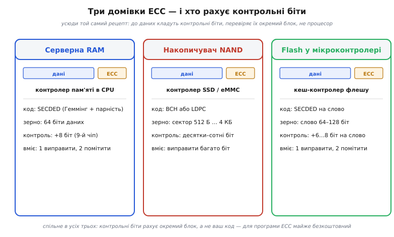
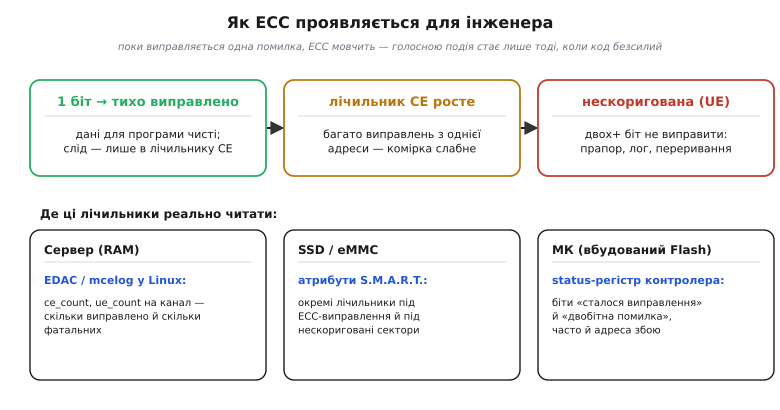

# 🔌 Де ECC у вашому залізі: серверні DIMM, контролери NAND, Flash-кеш МК

> Компонентна вставка до теми [«ECC у RAM і Flash»](topic:communications/ecc-ram-flash). Сама ідея ECC проста: до даних доточують контрольні біти так, щоб поодиноку помилку можна було не лише помітити, а й виправити — це **SECDED** у пам'яті й сильніший **BCH** у NAND. Тут — суто практичне: показати, **де саме** ця математика вже працює у звичайному залізі, на що вона перетворюється на платі й у регістрах, і чому в специфікації пам'ять із ECC завжди **ширша рівно на 8 біт**. Спираємося на кілька простих понять: [біти й слова](topic:programming/bits-bytes-endianness), [парність](topic:communications/parity-bit) і [відстань Геммінга](topic:communications/hamming-distance), сам [код Геммінга (7,4)](topic:communications/hamming-code), а ще на [планки пам'яті DDR](topic:electronics/sdram-ddr) з їхнім «дев'ятим чіпом».

## Клас пристрою: де живе ECC

ECC (*Error-Correcting Code* — код із виправленням помилок) — це не окрема мікросхема, яку можна припаяти, а **властивість тракту пам'яті**: трохи ширша шина плюс невеликий логічний блок, що рахує й перевіряє контрольні біти. Тому «клас пристрою» тут — не один компонент, а три типові домівки, де цей блок уже вбудовано й працює без жодного рядка вашого коду. Перша — **серверна оперативна пам'ять**: звична [планка DIMM](topic:electronics/sdram-ddr), але з дев'ятьма чіпами замість восьми, а перевіркою керує контролер пам'яті в процесорі. Друга — **контролер NAND-флешу** в будь-якому SSD, eMMC чи USB-носії: сирий NAND настільки схильний до помилок, що без сильного ECC його не прочитати. Третя, найближча вбудованику, — **вбудований Flash самого мікроконтролера**: прошитий код і константи на читанні проходять через крихітний ECC-блок кеш-контролера флешу. Рецепт усюди той самий — дані плюс контрольні біти, перевірені «на льоту» спеціальним блоком, — різниться лише сила коду під тип збоїв.

## Блок-схема: чому шина ширша рівно на 8 біт

Найвидиміший слід ECC — саме ця зайва ширина. У звичайній [планці пам'яті DDR](topic:electronics/sdram-ddr) восьмеро чіпів по 8 ліній даних складають спільне **64-бітне слово**. Додайте дев'ятий такий самий чіп — і слово стане **72-бітним**: 64 біти даних плюс 8 біт контролю. Звідси й «магічне» число 72 у специфікації серверних модулів, і те, що ECC-планка ширша за звичайну рівно на байт.

*Звідки береться число 72. Вісім чіпів віддають 64 біти даних, дев'ятий додає 8 контрольних — і контролер пам'яті читає все слово за один такт. Ці 8 біт реалізують код **SECDED**: одну помилку він виправляє мовчки, дві — гарантовано помічає (хоч і не виправляє). Це та сама логіка [коду Геммінга](book:communications/hamming-code), лише розгорнута на 64 біти й посилена одним бітом загальної парності.*

Чому саме вісім, видно з будови [коду Геммінга](topic:communications/hamming-code): щоб **виправити** один біт, контрольних треба приблизно log₂ від довжини слова, і для 64 біт сімох досить, аби однозначно вказати на винуватця (це число називають *синдромом* — *syndrome*). Восьмий біт — загальна парність слова; він добудовує «виправ один» до **SECDED** (*Single Error Correct, Double Error Detect*): дві одночасні помилки вже не прикинуться однією, а синдром чесно скаже «двох не виправити».

## Три розпіновки замість однієї

«Розпіновка» в ECC — це не цоколівка одного чіпа, а те, **куди під'єднані контрольні біти** в кожній домівці; різні вони тому, що різний і характер збоїв, проти яких стоїть код.

*Три типові домівки ECC поряд. Скрізь однаковий рецепт «дані + контрольні біти, перевірка в залізі», але зерно й сила коду різні: 64-бітне слово й SECDED у RAM; сектор у кілька кілобайтів і потужний BCH чи LDPC у NAND; коротке слово флешу й SECDED у мікроконтролері. Контрольні біти всюди рахує спеціальний блок, а не процесорне ядро.*

У **серверній RAM** контрольні біти живуть на окремому дев'ятому чіпі, а синдром рахує контролер пам'яті процесора. У **NAND** інакше: фізична сторінка має «запасну» зону (*spare area*) поряд із кожним сектором, і туди контролер пише довгий код **BCH** (*Bose–Chaudhuri–Hocquenghem*) чи сучасніший **LDPC** — десятки й сотні контрольних біт на сектор, аби виправляти багато перевернутих біт одразу. У **флеші мікроконтролера** зерно найменше: кілька зайвих біт на слово (типово 64–128 біт даних плюс 6–8 контрольних), і поодинока помилка виправляється прямо в конвеєрі читання.

## Підключення й «перший байт»: як ECC заговорює

Окремо **підключати** ECC не треба: у всіх трьох домівках він уже на платі й вмикається сам — досить вставити планку з дев'ятьма чіпами в систему, що підтримує ECC, а в накопичувачі й мікроконтролері він замкнений усередині й увімкнений від народження. Тому «перший байт» — момент, коли ECC уперше заговорює до інженера, — варто впізнавати, бо говорить він тихо. Поки виправляється **одна** помилка, програма дістає чисті дані й нічого не підозрює; єдиний слід — **лічильник виправлень** (*correctable error*, **CE**), що тихцем росте на одиницю. Голосною подія стає лише тоді, коли помилок **дві й більше** і код безсилий (*uncorrectable error*, **UE**): отут з'являється прапор у статус-регістрі, запис у журнал чи апаратне переривання.

*Як ECC проявляється для інженера. Зліва направо — ескалація: одна помилка тихо виправляється (росте лише лічильник CE); багато виправлень з однієї адреси натякають, що комірка слабне; нарешті нескоригована помилка (UE) стає видимою подією. Нижче — де ці лічильники реально читати: підсистема EDAC у Linux для серверної RAM, атрибути S.M.A.R.T. для накопичувача, status-регістр контролера флешу в мікроконтролері.*

Тож «заговорити» з ECC означає не надіслати команду, а **навчитися читати його лічильники**. На сервері їх показує підсистема ядра Linux **EDAC** (та утиліта `mcelog`): видно `ce_count` і `ue_count` на кожен канал. У накопичувача ту саму історію розповідають атрибути **S.M.A.R.T.** — окремі лічильники під ECC-виправлення й під нескориговані сектори. У мікроконтролері все ще прозоріше: контролер флешу має біти статусу на кшталт «сталося виправлення» й «двобітна помилка», а часто й регістр з **адресою** збійного слова.

> 🔧 **Навіщо це.** Лічильник CE — ваш ранній сигнал тривоги. Сервер, у якого `ce_count` щодня повзе вгору з однієї адреси, ще працює правильно, але вже кричить «заміни планку, доки CE не став UE». Те саме на накопичувачі: зростання ECC-виправлень у S.M.A.R.T. — це знос NAND у дії, привід робити резервні копії заздалегідь. ECC не лише рятує окремі читання, а й дає **метрику здоров'я пам'яті**.

## Типові граблі та варіації класу

Залишається окреслити межі — бо навколо ECC легко набудувати хибних сподівань.

- **ECC — не нескінченний щит.** Класичний SECDED у RAM виправляє **одну** помилку на слово й помічає дві; три перевернуті біти одразу він може й не побачити або «виправити» хибно. Це страховка від рідкісних поодиноких збоїв (зокрема частинкових [біт-фліпів](topic:algorithms/bit-flips)), а не дозвіл забути про надійність.
- **Тихе виправлення приховує деградацію.** CE виправляється мовчки, тож чіп, який сиплеться, легко проґавити, аж доки він не дасть фатальну UE. Без погляду на лічильники проблема ховатиметься до останнього.
- **«ECC» на планці треба ще підтримати системою.** Дев'ятий чіп нічого не дасть, якщо контролер пам'яті чи плата не вміють ECC: біти просто ігноруватимуться. ECC — властивість усього тракту, а не лише модуля.
- **У NAND ECC обов'язковий, не опційний.** Сирий NAND сипле помилками **постійно**, тож код мусить бути сильним під конкретний тип пам'яті; зі зносом чіпа BCH/LDPC підходить до межі — і сектор стає нечитабельним.
- **ECC ловить шум, а не зловмисника.** Як і [контрольні суми](topic:communications/checksums), він стоїть проти **випадкових** збоїв заліза, а не навмисної підміни: маючи доступ, контрольні біти легко перерахувати під підроблені дані.

Отже, ECC — та сама математика [коду Геммінга](topic:communications/hamming-code), лише вплавлена в залізо й розкладена по трьох домівках: SECDED на 72-бітному слові серверної RAM, потужний BCH чи LDPC на секторах NAND, скромний SECDED на словах вбудованого флешу МК. Скрізь контрольні біти рахує окремий блок, а не ваш код, тож для програми ECC майже безкоштовний — варто лише читати його лічильники й пам'ятати про межу «один виправити, два помітити». А коли треба тримати удар по цілих пошкоджених блоках, на сцену виходять символьні коди на кшталт [Ріда–Соломона](topic:communications/reed-solomon).
