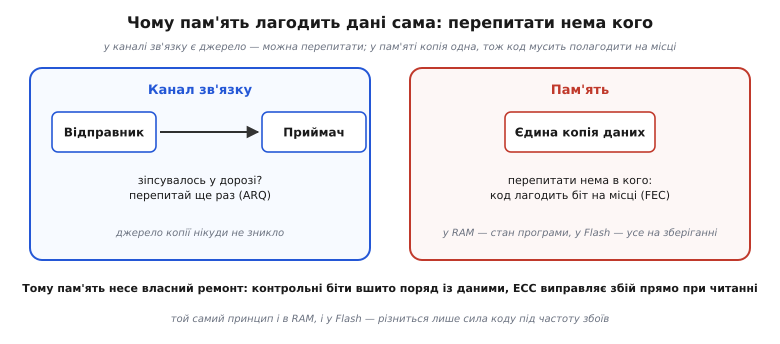
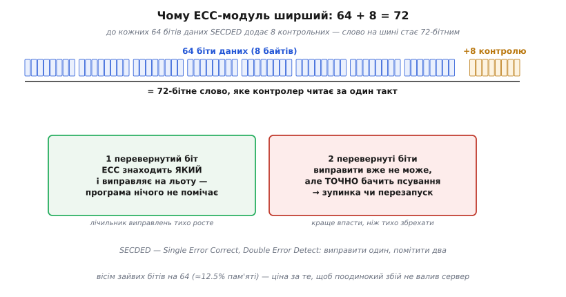
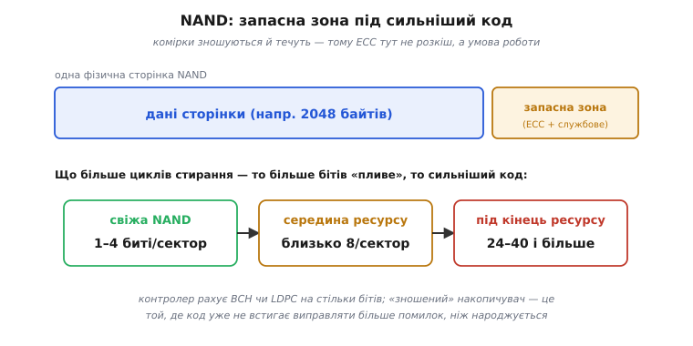

# ECC у пам'яті: код виправлення, вплавлений у залізо

<preknowlist>
- [Код Геммінга](book:communications/hamming-code) — контрольні біти на позиціях-степенях двійки; синдром прямо вказує, який біт перевернувся.
- [Відстань Геммінга](book:communications/hamming-distance) — на скільки бітів різняться два кодові слова; від неї залежить, скільки помилок код виправить, а скільки лише помітить.
- [Біт парності](book:communications/parity-bit) — один біт, що добудовує число одиниць до парного; ловить непарну кількість перевернутих бітів.
- [Біт-фліпи](book:algorithms/bit-flips) — коли зовнішній вплив (частинка, знос, витік заряду) перевертає збережений біт.
- [Комірка DRAM](book:electronics/dram-cell) — крихітний конденсатор, що зберігає біт зарядом і потроху його втрачає.
- [Планки DDR](book:electronics/sdram-ddr) — як складено модуль оперативної пам'яті з окремих мікросхем на спільну шину.
</preknowlist>

Уяви, що по каналу зв'язку прийшов зіпсований пакет. Нічого страшного: приймач бачить, що контрольна сума не збіглася, і **просить надіслати ще раз** — у джерела досі є оригінал, тож помилку легко перепитати. А тепер те саме, але в оперативній пам'яті: у слові, де лежить стан запущеної програми, космічна частинка перевернула біт. Перепитати нема в кого. RAM тримає **єдину** копію цього стану; ніякого «відправника», у якого лишився оригінал, не існує. Так само у Flash: збережений файл — це остання й єдина копія, і якщо комірка «попливла», по неї нема куди звернутися по правильне значення.

Звідси випливає жорстка вимога. Пам'ять не може розраховувати на повтор — вона мусить **виправляти помилку на місці**, самим фактом того, що з неї читають. Такий підхід, коли ремонт вбудовано наперед, а не викликають повторним запитом, називають **прямим виправленням помилок** (англ. *forward error correction*, FEC): до даних заздалегідь доточують надлишок, якого досить, щоб відновити зіпсоване без жодного другого джерела. Коди виправлення, вплавлені саме в пам'ять, звуть **ECC** (*error-correcting code*, код виправлення помилок), і стоять вони усюди, де перепитати ніде: у RAM, що тримає стан живих програм, і у Flash, що зберігає все надовго.


*Чому пам'ять лагодить дані сама. У каналі зв'язку є **джерело** копії: зіпсувалось у дорозі — приймач просто перепитує (повторний запит, ARQ). У пам'яті копія **одна** — перепитати нема в кого, тож виправлення мусить бути **прямим**: контрольні біти вшивають поряд із даними, і код відновлює поодинокий збій прямо в момент читання. Принцип той самий і в RAM, і у Flash — різниться лише сила коду під частоту збоїв.*

### Що таке ECC насправді: не мікросхема, а властивість тракту

Перше, що варто зрозуміти про ECC: це **не окрема мікросхема**, яку можна доточити збоку, а **властивість усього тракту пам'яті**. Тракт трохи розширюють — до кожної порції даних додають кілька ліній під контрольні біти — і ставлять невеликий логічний блок, що робить дві речі. На **запису** він рахує контрольні біти з даних і кладе їх поряд. На **читанні** — перераховує їх наново, порівнює з тим, що лежало, і за розбіжністю (її звуть **синдромом**, від грец. *syndromē* — «збіг ознак») або **виправляє** поодинокий перевернутий біт, або **піднімає тривогу**, якщо зіпсовано більше. Усе це відбувається в залізі, на швидкості пам'яті й **непомітно для програми**: у звичайному разі код нічого не просить від процесора й нічого не сповільнює.

Саме ця конструкція — ширший тракт плюс окремий перевірний блок — і є спільним хребтом ECC у будь-якому втіленні. Далі змінюється тільки одне: **сила коду**, тобто скільки бітів на порцію він уміє виправити. А сила диктується тим, **як часто й густо** сиплються помилки в конкретному типі пам'яті. Тому ECC найкраще розглядати у двох його природних домівках, де характер збоїв протилежний: рідкісний випадковий збій в оперативній пам'яті та постійний наростаючий фон — у флеш-пам'яті.

### Домівка перша: RAM і код SECDED

Почнімо з оперативної пам'яті. Її комірки — [крихітні конденсатори](book:electronics/dram-cell), кожен тримає біт мізерним зарядом. І саме заряд — уразливе місце. [Іонізуюча частинка](book:algorithms/bit-flips), пролітаючи крізь кристал, лишає по собі слід із вільних носіїв, і цього сліду вистачає, щоб додати чи прибрати заряд у комірці й **перевернути біт** прямо в працюючій програмі. Частинки беруться з двох джерел: вторинні частинки від космічних променів, що дощем сиплються крізь атмосферу, і альфа-частинки від слідів радіоактивних домішок у самому корпусі мікросхеми. Такий збій називають **м'яким** (*soft error*): комірка не зламалася, наступний запис у неї ляже правильно — зіпсувалося лише **значення**, що там лежало.

У домашньому комп'ютері це така рідкість, що з нею просто мируться: перевернеться раз на кілька місяців якийсь біт — найімовірніше в пікселі чи в даних, які й так скоро перезапишуться. Але **масштаб** усе змінює. Сервер тримає десятки й сотні гігабайтів і не вимикається роками; коли комірок у тисячі разів більше, а часу — у тисячі разів довше, рідкісна подія стає **регулярною**, і мовчазний переворот біта в чиємусь балансі чи покажчику вже неприпустимий. Тому серверну пам'ять захищають кодом.

Стандартний код для RAM — **SECDED** (*Single Error Correct, Double Error Detect* — «один виправити, два виявити»). Він **виправляє один** перевернутий біт у слові й **гарантовано помічає** два. Влаштований він як [код Геммінга](book:communications/hamming-code) з однією добудовою. Код Геммінга дає синдром, що прямо вказує, **який саме** біт перевернувся, — і цього досить, щоб виправити одиничну помилку. Але сам він не відрізняє одну помилку від двох: пара перевернутих бітів дасть такий самий на вигляд синдром, як якийсь один інший біт, — і код «виправить» геть не те, тихцем додавши ще одну помилку. Рятує **один додатковий [біт загальної парності](book:communications/parity-bit)** на все слово. При одиничній помилці і синдром ненульовий, і загальна парність порушена; при подвійній — синдром щось показує, а от парність **сходиться** (два перевороти її не міняють). Ось ця розбіжність і є сигналом «помилок дві, виправляти не смій, лише тривож». Точний доказ, чому для такого фокусу кодовим словам потрібна [відстань Геммінга](book:communications/hamming-distance) рівно чотири, розібрано у темі [SECDED: один виправити, два виявити](book:communications/secded).

Тепер порахуймо надлишок. Щоб синдром однозначно вказав на винуватця серед 64 бітів даних і самих контрольних, за побудовою Геммінга треба, аби 2ᵏ−1 накрило всю довжину слова; для 64 бітів даних вистачає **семи** контрольних бітів, а восьмий — та сама загальна парність, що добудовує «виправ один» до SECDED. Разом — **8 контрольних бітів на 64 біти даних**. Ось звідки й береться дивна на перший погляд деталь: [модуль ECC-пам'яті](book:electronics/sdram-ddr) має шину не 64, а **72** біти завширшки, а на планці стоїть **дев'ята** мікросхема — та, що несе ці вісім бітів контролю.


*Чому ECC-модуль ширший. До кожних 64 бітів даних SECDED додає 8 контрольних, тож слово на шині — 72 біти. Один перевернутий біт код **знаходить і виправляє на льоту** — програма нічого не помічає, лише лічильник виправлених помилок у системі тихо росте. Два перевернуті біти виправити вже не може, зате **точно бачить** псування й піднімає тривогу. Вісім зайвих бітів на 64 (≈12.5% пам'яті) — ціна за те, щоб поодинокий збій не валив сервер.*

У цій парі поведінок — уся інженерна філософія ECC. Одиничний збій (а він найімовірніший) виправляється **непомітно**: процесор отримує правильні дані, ніби нічого й не було, а система лише занотовує подію в лічильник «виправлених помилок». Подвійний збій виправити не вийде, та SECDED його принаймні **виявляє** й не дає пам'яті тихо збрехати: система свідомо зупиняється чи перезапускається. Це наріжний принцип надійних систем — **гучна відмова краща за тиху помилку**. Впасти чесно безпечніше, ніж віддати правдоподібне, але хибне число, на якому далі будуватимуться розрахунки: перше видно одразу й можна відреагувати, друге отруює результат непомітно.

Та в SECDED є прихований підступ, і випливає він з тієї самої межі «виправляю лише **один**». Якщо в слові вже сидить один непомічений збій, а поряд із часом ляже другий, разом вони складуться в **подвійну** помилку, яку код уже не полагодить: поодинокі збої, накопичуючись, дозрівають до невиправних. Щоб цього не сталося, надійні системи додають до ECC активний прийом — **очищення пам'яті** (*memory scrubbing*): фоновий процес неспішно обходить усю RAM, читає кожне слово, дає ECC виправити поодинокий збій і записує **виправлене** значення назад. Так одиничні збої прибирають, **не давши** їм зустрітися й дозріти до подвійних. Це наочно показує, що ECC — не пасивна наліпка, а активна стратегія: код не лише латає в мить читання, а й систематично «підмітає» пам'ять, тримаючи кількість збоїв у слові на безпечному рівні. Як підібрати період очищення, щоб воно встигало за темпом народження помилок, — окрема тема [очищення пам'яті](book:communications/memory-scrubbing).

### Домівка друга: Flash і код як умова роботи

Якщо в RAM код — це страховка від рідкісної випадковості, то у Flash-пам'яті він перестає бути страховкою й стає **умовою самого існування** пам'яті. Різниця не в силі коду, а в його **ролі**: без ECC оперативна пам'ять просто зрідка помилятиметься, а сучасна NAND без ECC не працюватиме взагалі.

Причина фізична. Комірка NAND зберігає біт (а часто й кілька бітів одразу) рівнем захопленого заряду, і цей заряд **тане** з часом та **розхитується** щоразу, коли комірку стирають і перезаписують. Тому [перевернуті біти](book:algorithms/bit-flips) тут — не виняткова подія, а **постійний фон**, що лише густішає в міру старіння накопичувача. Чому саме рівні заряду розпливаються й напливають один на одного, докладно розібрано в темі [ECC у флеш-пам'яті](book:communications/ecc-flash); нам зараз важливий наслідок: без сильного виправлення густа сучасна NAND була б непридатна для зберігання буквально з перших тижнів.

Тому в NAND кожну сторінку даних супроводжує **запасна зона** (*spare area*) — додаткові байти, де лежить ECC та службові поля. І код тут потрібен незрівнянно потужніший за Геммінга: замість «один биток на слово» він мусить виправляти **десятки** перевернутих бітів на сектор. Для цього беруть **BCH** — за іменами трьох математиків, що незалежно описали цей клас кодів наприкінці 1950-х: Боуза, Рей-Чаудгурі й Хоквінгема — узагальнення коду Геммінга, яке виправляє **багато** помилок одразу (окрема тема — [коди BCH](book:communications/bch-codes)). А в найновіших накопичувачах — ще сильніший **LDPC** (*low-density parity-check*, код розрідженої перевірки парності), що краще тримає високий фон помилок дрібних сучасних комірок (тема [LDPC](book:communications/ldpc)).


*У NAND кожна сторінка даних має **запасну зону** під ECC і службові поля. Оскільки комірки зношуються й течуть, потрібен код, що росте разом із дефектами: свіжа NAND має 1–4 перевернуті біти на сектор, до середини ресурсу — близько 8, а під кінець життя — десятки. Тому контролер рахує BCH чи LDPC на стільки бітів. «Зношений» накопичувач — це той, де код уже не встигає виправляти більше помилок, ніж народжується.*

Звідси випливає несподіване, але важливе розуміння того, що таке «смерть» флеш-пам'яті. Накопичувач відмовляє не тому, що комірки фізично розсипаються в пил, а тому, що кількість битих бітів на сектор **переростає** виправну спроможність коду. Поки ECC встигає латати більше помилок, ніж народжується, дані цілі; щойно дефектів стає більше за поріг коду — сектор оголошують непридатним і виводять з ужитку. Отже, ресурс Flash — це, по суті, **гонитва між зносом і кодом**: виробник підбирає силу ECC так, щоб накопичувач прожив обіцяну кількість циклів стирання, перш ніж код «захлинеться». А щоб знос не з'їдав одні й ті самі комірки, поки решта простоюють, контролер ще й рівномірно розкидає записи по всьому чіпу — це окремий прийом, [вирівнювання зносу](book:communications/flash-ecc-budget), що працює пліч-о-пліч з ECC: код лагодить помилки, вирівнювання відкладає момент, коли їх стане забагато.

### Скільки коштує захист і чому по-різному

Скільки ж пам'яті з'їдає весь цей захист — і чому в RAM він коштує помітних 12.5%, а в NAND за куди сильнішого коду майже нічого? Відповідь повчальна: **накладні витрати ECC падають із ростом блоку**, рівно з тієї причини, що закладена в коді Геммінга. Синдром із k бітів здатний вказати на будь-яку з 2ᵏ−1 позицій — тож що довший блок, то більше даних «обслуговує» кожен контрольний біт.

**Приклад (скільки коштує ECC).** Порівняймо частку контрольних бітів для слова RAM і сектора NAND.

```
RAM, SECDED на 64 біти даних:
  контрольних бітів = 8      (2⁷−1 = 127 ≥ 64+7 → 7 для Геммінга + 1 на DED)
  надлишок = 8 / 64 = 12.5%       →  шина 72 біти замість 64

якби SECDED ставили на 8 біт даних (коротке слово):
  потрібно 5 контрольних → надлишок = 5 / 8 ≈ 62%   (дорого!)

NAND, BCH «виправити 8 бітів» на сектор 512 байтів:
  контрольних ≈ 13 байтів у spare-зоні на 512 байтів даних
  надлишок ≈ 13 / 512 ≈ 2.5%       →  дешево навіть за сильного коду
```

Різниця величезна: на 8-бітному слові ECC коштував би дві третини пам'яті, на 64-бітному — вже лише восьму частину, а на півкілобайтовому секторі NAND навіть код на вісім помилок відбирає якихось два з половиною відсотки. Звідси й різні зерна в двох домівках. RAM працює **короткими словами**, бо процесор читає її дрібними випадковими порціями й не може чекати цілу сторінку заради одного числа, — тож 64 біти й 12.5% надлишку тут природна плата за швидкий випадковий доступ. Flash читають **цілими сторінками** в кілька кілобайтів однаково, тож брати великий сектор під ECC нічого не коштує — і саме тому там можна дозволити собі дуже сильний код майже задарма.

### Тихий сигнал, який варто чути

Є ще один наслідок ECC, який на практиці важить не менше за саме виправлення. Оскільки код рахує щоразу, коли пам'ять читають, він принагідно **веде статистику** — рахує, скільки помилок виправив і скільки виявив невиправних. І ці лічильники — безцінне вікно у здоров'я заліза.

Логіка проста. Поки виправляється **одна** помилка, подія тиха: програма дістає чисті дані, росте лише лічильник виправлень (*correctable error*, **CE**). Але якщо CE з однієї й тієї самої адреси повзе вгору день за днем — це майже певний знак, що конкретна комірка починає сипатися, і скоро дасть уже **невиправну** помилку (*uncorrectable error*, **UE**), яка зупинить систему. Тобто CE росте **до** того, як залізо реально відмовить, — і дає інженерові фору, щоб замінити планку чи зробити резервну копію заздалегідь, поки тиха помилка не стала гучною відмовою. Те саме і в накопичувача: зростання лічильника ECC-виправлень — це знос NAND у дії, ранній привід готуватися до заміни.

> 🔌 Той самий код живе у трьох звичних місцях заліза: 72-бітних серверних модулях пам'яті (DIMM із дев'ятою мікросхемою), контролерах NAND усередині SSD та eMMC і навіть у кеш-контролері флешу багатьох мікроконтролерів. Як вони виглядають, куди під'єднано контрольні біти й **де саме читати лічильники CE/UE** (підсистема EDAC у Linux, атрибути S.M.A.R.T. накопичувача, status-регістр контролера флешу) — у вставці [де ECC у вашому залізі](book:communications/ecc-ram-flash/comp-ecc-hardware.md).

> 🔧 **Навіщо це.** ECC впливає на ваші рішення, навіть якщо ви ніколи не пишете кодів виправлення самі. Перше: коли система **мусить** працювати безперервно й не має права на тиху помилку (сервер, промисловий контролер, апаратура в радіації), беріть пам'ять з **ECC** — це прямо купується ширшою шиною (72 біти замість 64) і дев'ятою мікросхемою на модулі. Друге: розуміння, що Flash живе на ECC, пояснює, чому накопичувачі мають **скінченний ресурс** і чому «зношена» пам'ять починає віддавати помилки лавиною, — це варто закладати, проєктуючи часті перезаписи чи логування у вбудованій системі. Третє: лічильники CE, які віддає і ECC-RAM, і контролер Flash, — це готовий **датчик деградації**; він спрацьовує заздалегідь, тож стежити за ним варто, а не чекати відмови.

### Де ECC безсилий

ECC у пам'яті — чудова, але **не всесильна** машина, і варто знати три її межі, щоб не будувати на ній хибних сподівань.

По-перше, це страховка від **шуму, а не від зловмисника**. Як і звичайні [контрольні суми](book:communications/checksums), ECC стоїть проти **випадкових** фізичних збоїв, а не навмисної підміни: маючи доступ до пам'яті, контрольні біти легко перерахувати під підроблені дані, і код нічого не запідозрить. По-друге, класичний SECDED виправляє рівно **один** біт на слово; три перевернуті біти одразу він може й не побачити або «виправити» хибно — тож ECC зменшує ризик, але не скасовує його. По-третє, ECC — властивість **усього тракту**: дев'ятий чіп на планці нічого не дасть, якщо контролер пам'яті чи материнська плата не вміють ECC — вісім контрольних бітів просто ігноруватимуться.

І є ще одна, найголовніша межа — уже не в реалізації, а в самій природі бітового коду. І [код Геммінга](book:communications/hamming-code), і SECDED, і навіть BCH чудово справляються з тим, для чого створені: з **поодинокими** збоями, розкиданими по пам'яті. Але що, як помилки приходять не поодинці, а суцільним **пакетом** — коли подряпина на диску, порошинка чи завмирання радіосигналу нищать сотні сусідніх бітів за раз? Проти такої [пакетної помилки](book:communications/burst-error) бітовий код безпорадний: у кожне окреме слово вцілить забагато перевернутих бітів, і жоден SECDED їх не витягне. Потрібен зовсім інший підхід — рахувати не окремими бітами, а цілими **символами**; саме так влаштований [Рід–Соломон](book:communications/reed-solomon), завдяки якому грає подряпаний CD і читається брудний QR-код.
