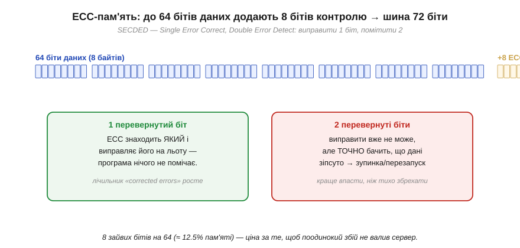

# ECC у RAM і Flash

[Код Геммінга](book:communications/hamming-code) легко сприйняти як навчальну вправу — сім бітів, один биток, синдром на пальцях. Та насправді цей самий механізм, ледь розширений, **захищає пам'ять, у якій зараз працює ця книга**. Коди виправлення, вбудовані в пам'ять, називають **ECC** (*error-correcting code*, код виправлення помилок), і вони стоять усюди, де перепитати дані ніде: у RAM, що тримає стан запущених програм, і у Flash, що зберігає все надовго. Ця тема показує ECC у живому залізі — і пояснює дрібну на вигляд, але промовисту деталь: чому модуль ECC-пам'яті на цілих вісім бітів **ширший** за звичайний.

### SECDED у серверній RAM: 64 + 8

Почнімо з оперативної пам'яті. Її комірки — [крихітні конденсатори](book:electronics/dram-cell), і саме вони — улюблена мішень для [космічних частинок](book:algorithms/bit-flips): пролітаючи крізь кристал, протон чи нейтрон може вибити заряд і перевернути біт прямо в працюючій програмі. У звичайному комп'ютері це рідкість, з якою миряться. У сервері, що тримає десятки гігабайтів і не вимикається роками, такі збої стаються регулярно — і там пам'ять захищають кодом.

Стандартний код для RAM — **SECDED** (*Single Error Correct, Double Error Detect*): він **виправляє один** перевернутий біт і **виявляє два**. Це прямий нащадок [коду Геммінга](book:communications/hamming-code): той самий синдром, що вказує биту позицію, плюс один додатковий біт загальної парності, який дозволяє відрізнити одиничну помилку (виправну) від подвійної (лише виявної). Аби захистити стандартні **64 біти** даних, SECDED потребує **8** контрольних бітів — і саме тому шина ECC-пам'яті має ширину не 64, а **72** біти.


*Чому ECC-модуль ширший. До кожних 64 бітів даних SECDED додає 8 контрольних бітів, тож слово на шині — 72 біти. Один перевернутий біт код **знаходить і виправляє на льоту** — програма нічого не помічає, лише лічильник виправлених помилок у системі тихо росте. Два перевернуті біти виправити вже не може, але **точно бачить**, що дані зіпсовано, і піднімає тривогу (зупинка чи перезапуск) — бо краще чесно впасти, ніж тихо віддати хибне число. Вісім зайвих бітів на 64 (≈12.5% пам'яті) — ціна за те, щоб поодинокий збій не валив сервер.*

У цій парі поведінок — уся філософія ECC. Одиничний збій (а він найімовірніший) виправляється **непомітно**: процесор отримує правильні дані, ніби нічого й не було, а система лише занотовує подію в лічильник «виправлених помилок» — за його зростанням адміністратор бачить, що модуль починає сипатися, ще до того, як той відмовить. Подвійний збій виправити не вийде, та SECDED його принаймні **виявляє** й не дає пам'яті тихо збрехати: система свідомо зупиняється або перезапускається. Це ключовий принцип надійних систем — **гучна відмова краща за тиху помилку**: впасти чесно безпечніше, ніж віддати правдоподібне, але неправильне число, на якому далі будуватимуться розрахунки.

Та SECDED виправляє лише **одну** помилку на слово — а отже, є прихована загроза: якщо в слові вже сидить один невиправлений збій і поряд із часом ляже **другий**, разом вони складуться в подвійну помилку, яку код уже не полагодить. Поодинокі збої, накопичуючись, перетворюються на невиправні. Щоб цього не сталося, серйозні системи застосовують **очищення пам'яті** (*memory scrubbing*): фоновий процес неспішно проходить усю RAM, читає кожне слово, дає ECC виправити поодинокий збій і записує **виправлене** значення назад. Так одиничні помилки прибираються, **не встигнувши** зустрітися й стати подвійними. Це наочний приклад того, що ECC — не пасивна наліпка, а активна стратегія: код не лише виправляє в момент читання, а й систематично «підмітає» пам'ять, тримаючи кількість збоїв у слові на безпечному рівні.

> 🔌 **Поряд — компонентна вставка:** *Де ECC у вашому залізі* — як виглядають 72-бітні серверні модулі пам'яті (DIMM з дев'ятою мікросхемою), де ховається ECC у контролерах NAND і навіть у кеші деяких мікроконтролерів, і як перевірити, чи працює ECC у вашій системі.

### BCH у Flash: код як умова роботи

Якщо в RAM ECC — це страховка від рідкісних частинок, то у Flash-пам'яті він уже не страховка, а **умова самого існування**. Причина фізична: комірки NAND **зношуються** з кожним стиранням і **течуть** із часом, тож [биті помилки](book:algorithms/bit-flips) тут не виняткова подія, а постійний фон, що лише густішає в міру старіння накопичувача. Без сильного виправлення сучасна NAND була б непридатна для зберігання вже з перших тижнів.

Тому в NAND кожну сторінку даних супроводжує **запасна зона** (*spare area*) — додаткові байти, де лежить ECC. І код тут потрібен куди потужніший за Геммінга: замість «один биток на слово» він мусить виправляти **десятки** битих бітів на сектор. Для цього беруть **BCH** (за іменами Боуза, Рей-Чаудгурі й Хоквінгема) — узагальнення [коду Геммінга](book:communications/hamming-code), що виправляє **багато** помилок, — а в найновіших накопичувачах ще сильніший **LDPC**.


*У NAND кожна сторінка даних має **запасну зону** під ECC і службові поля. Оскільки комірки зношуються й течуть, потрібен код, що росте разом із дефектами: свіжа NAND має 1–4 биті біти на сектор, до середини ресурсу — близько 8, а під кінець життя — десятки (24–40 і більше). Тому контролер рахує BCH чи LDPC на стільки бітів. «Зношений» накопичувач — це той, де код уже не встигає виправляти більше помилок, ніж народжується.*

Звідси випливає несподіване, але важливе розуміння того, що таке «смерть» Flash. Накопичувач відмовляє не тому, що комірки фізично розсипаються в пил, а тому, що кількість битих бітів на сектор **переростає** виправну спроможність коду. Поки ECC встигає виправляти більше помилок, ніж народжується, дані цілі; щойно дефектів стає більше за поріг коду — сектор оголошують непридатним і виводять з ужитку. Отже, ресурс Flash — це, по суті, **гонитва між зносом і кодом**: виробник підбирає силу ECC так, щоб накопичувач прожив обіцяну кількість циклів, перш ніж код «захлинеться».

Скільки ж пам'яті з'їдає весь цей захист? Корисно прикинути, і результат повчальний: накладні витрати ECC **падають** із ростом блоку — рівно з тієї причини, що закладена в [коді Геммінга](book:communications/hamming-code) (синдром із k бітів накриває аж 2ᵏ−1 позицій).

**Приклад (скільки коштує ECC).** Порівняймо частку контрольних бітів для слова RAM і сектора NAND.

```
RAM, SECDED на 64 біти даних:
  контрольних бітів = 8   (бо 2⁷−1 = 127 ≥ 64+7, тобто 7 для Геммінга + 1 на DED → 8)
  надлишок = 8 / 64 = 12.5%   →  шина 72 біти замість 64

якби SECDED ставили на 8 біт даних (коротке слово):
  потрібно ще 5 контрольних → надлишок 5/8 ≈ 62%  (дорого!)
  висновок: ширше слово — дешевший ECC на біт даних

NAND, BCH «виправити 8 бітів» на сектор 512 байтів:
  контрольних ≈ 13 байтів у spare-зоні на 512 байтів даних
  надлишок ≈ 13 / 512 ≈ 2.5%   →  дешево навіть за сильного коду
```
Той самий принцип, що й у [коді Геммінга](book:communications/hamming-code): на довшому блоці кілька контрольних бітів «обслуговують» багато даних, тож відносна ціна виправлення падає.

> 🔧 **Навіщо це.** ECC впливає на ваші рішення, навіть якщо ви ніколи не пишете кодів виправлення самі. Перше: коли система **мусить** працювати безперервно й не має права на тиху помилку (сервер, промисловий контролер, апаратура в радіації), беріть пам'ять з **ECC** — це прямо купується ширшою шиною (72 біти замість 64) і дев'ятою мікросхемою на модулі. Друге: розуміння, що Flash живе на ECC, пояснює, чому накопичувачі мають **скінченний ресурс** і чому «зношена» пам'ять починає віддавати помилки лавиною — корисно знати, проєктуючи логування чи часті перезаписи у вбудованій системі. Третє: лічильники «виправлених/невиправних помилок», які віддає і ECC-RAM, і контролер Flash, — це безцінний **ранній сигнал** деградації; вони ростуть **до** того, як залізо відмовить, тож стежити за ними варто. ECC — це інженерія, що перетворює неминучі фізичні збої на керований, передбачуваний параметр.

ECC у RAM і Flash чудово справляється з тим, для чого створений, — з **поодинокими** збоями, розкиданими по пам'яті. Але і код Геммінга, і SECDED мають спільну межу: вони виправляють лічені біти **на слово**. А що, як помилки приходять не поодинці, а суцільним **пакетом** — коли подряпина на диску чи завмирання радіосигналу нищать сотні сусідніх бітів за раз? Бітовий код тут безпорадний. Потрібен зовсім інший підхід — рахувати не бітами, а цілими **символами**; саме так влаштований [Рід–Соломон](book:communications/reed-solomon), завдяки якому грає подряпаний CD і читається брудний QR.
