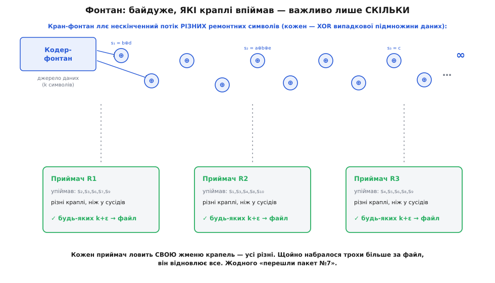
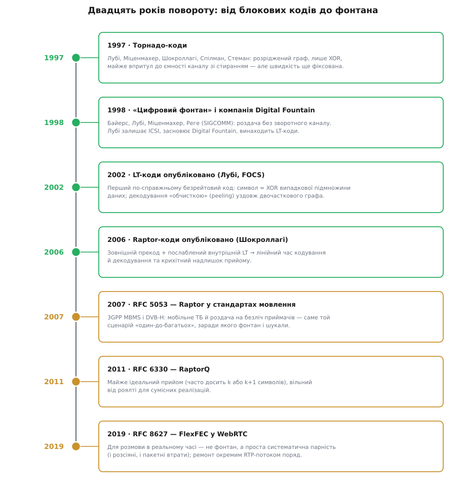

# 🚰 Як народився фонтан: коди, що не просять переслати

Уся класична теорія кодування ставила одне питання: маємо блок із `n` символів, скільки помилок у ньому можна виправити? Число `n` фіксоване, воно відоме наперед, і все, що ми будуємо, — навколо нього. А наприкінці 1990-х невелика група людей спитала інакше: а що, як передавач ніколи не знатиме, скільки загубиться, і його ніколи не проситимуть надіслати ще раз? З цього перевернутого питання й виріс цілий клас кодів, які сьогодні возять відео до мільйонів телефонів. Історія цього повороту повчальна саме тому, що винахід тут — не хитріша формула, а зміна питання.

## Стіна, об яку розбилися блокові коди

Щоб відчути, чого бракувало, треба побачити, у чому саме класичний блоковий код незручний для мовлення. Візьмімо найкращий свого роду — код на кшталт [Ріда–Соломона](topic:communications/reed-solomon), який із `k` пакетів даних робить `n` пакетів і відновлює все, отримавши будь-які `k` із `n`. Звучить ідеально. Але зверніть увагу: щоб його застосувати, треба **наперед обрати** обидва числа. Передавач мусить іще до першого пакета вирішити, скільки ремонту класти — тобто вгадати, скільки канал з'їсть.

Для двоточкового з'єднання це стерпно: виміряв канал, підібрав швидкість. Але уявіть супутник, що роздає оновлення прошивки на сто тисяч приймачів одночасно. В одного антену затінило хмарою — він губить 20 %; інший під ясним небом — 1 %; третій на межі покриття — 40 %. Одне число `(n, k)` не влаштує всіх. Поставиш ремонту багато — марнуєш ефір тих, у кого й так усе гаразд. Мало — і половина приймачів не збере блок. А ще різні приймачі гублять **різні** пакети, тож навіть за однакового відсотка втрат діри в них не збігаються.

До цього додається технічна межа самого Ріда–Соломона: він живе над скінченним полем, і за звичного поля GF(256) кодове слово не буває довшим за 255 символів. Не можна просто зробити `n` величезним, щоб вистачило всім, — алфавіт не пускає.

І остання, найгостріша перешкода — **зворотний зв'язок**. Просте «не дійшло — перешли» (тобто [ARQ](topic:communications/arq)) для мовлення самогубне: якщо сто тисяч приймачів разом крикнуть «повтори пакет 5019», передавач захлинеться лавиною запитів. Цю халепу так і звуть — імплозія зворотного зв'язку. Виходить глухий кут: класичний код вимагає знати втрати наперед, а спитати кожного приймача окремо неможливо.

## Мрія про кран, з якого ллється

Вихід підказала зухвала думка: а якщо код зробити **без швидкості** взагалі? Не «`n` символів на `k` даних», а кран, з якого ллється нескінченний потік різних ремонтних символів. Приймач просто підставляє відро й ловить краплі — байдуже, котрі саме. Щойно назбирав трохи більше, ніж розмір файлу, — відновлює все й закриває кран. Хто в поганому каналі, ловить довше; хто в доброму — коротше; і жоден нікого ні про що не питає.



*Байдуже, які саме краплі впіймав приймач, — важливо лише, що їх набралося трохи більше за файл. Три приймачі зловили три різні набори, і всі троє зібрали дані.*

Саме цю картину — і саму назву — запропонували 1998 року Джон Байерс (*John W. Byers*), Майкл Лубі (*Michael Luby*), Майкл Міценмахер (*Michael Mitzenmacher*) й Ашутош Реге (*Ashutosh Rege*) у статті «A Digital Fountain Approach to Reliable Distribution of Bulk Data» на конференції ACM SIGCOMM (Ванкувер, 1998). Метафора буквальна: цифровий фонтан ллється, а ти підставляєш склянку — і не має значення, які краплі в неї впадуть, аби набралося досить. Того ж року Лубі — американський інформатик, доти відомий у теорії ймовірнісних алгоритмів, — пішов із дослідного інституту ICSI у Берклі й заснував компанію Digital Fountain, щоб цю мрію втілити. Статус: задокументований факт, дата й авторство статті звірені за матеріалами SIGCOMM.

Перший двигун для фонтана в них уже був під рукою — **торнадо-коди**. За рік до того, 1997-го, ті самі Лубі й Міценмахер разом з Аміном Шокроллагі (*Amin Shokrollahi*), Деніелом Спілманом (*Daniel Spielman*) і Фолькером Стеманом (*Volker Stemann*) показали (праця «Practical Loss-Resilient Codes», 29-й симпозіум ACM STOC, 1997), як будувати код зі стирання з дуже розрідженого двочасткового графа, де кодування й декодування — лише операції XOR, а працює він майже впритул до теоретичної межі каналу. Це були близькі родичі [кодів розрідженої перевірки парності (LDPC)](topic:communications/ldpc), тільки заточені під стирання, а не під помилки.

Торнадо-коди були прекрасні, але з однією вадою, що й підважувала всю мрію: вони **все ще мали фіксовану швидкість**. Граф будувався наперед під заданий розмір розширення — тобто наперед вирішувалося, скільки вихідних символів буде. Кран іще не лився нескінченно; він видавав рівно стільки, скільки закладено в конструкцію. До справжнього фонтана бракувало останнього кроку.

## LT-коди: перший справжній фонтан

Цей крок зробив Лубі — і зробив його напрочуд просто. Ідея LT-кодів (Luby Transform) така: щоб виготовити черговий вихідний символ, кинь монету й вибери випадкову підмножину вхідних символів, поксори їх у купу — і надішли результат разом із **рецептом**, тобто зі списком (чи насінням генератора), який каже, які саме входи змішано. Хочеш іще символ — кидай монету знову. Потік ніколи не кінчається, і кожна крапля — новий XOR нової випадкової жмені даних.

Декодується це не перебором, а **обчисткою** (peeling) уздовж графа, і це справжня краса методу. Шукаємо серед упійманих символ, у рецепті якого лише один вхід, — він дорівнює цьому входу прямо. Знаємо його — і викидаємо (виксорюємо) з усіх інших символів, де він бере участь; у декого від цього рецепт скорочується до одного входу, і вже їх можна «зняти». Лавина котиться далі, аж поки не відновимо все.

**Обчистка на пальцях (k = 4 символи даних):**

```
дані:   a  b  c  d
кран видає символи-XOR, до кожного додає рецепт (які дані змішано):
   s₁ = b                 ← ступінь 1
   s₂ = a ⊕ b
   s₃ = a ⊕ c ⊕ d
   s₄ = c                 ← ступінь 1
   s₅ = a ⊕ d
   …                       (потік не кінчається)

обчистка — беремо ступінь-1 і викидаємо його з решти:
   s₁ = b                        → b відомо
   s₂ = a ⊕ b,   виксорюємо b    → a відомо
   s₄ = c                        → c відомо
   s₃ = a ⊕ c ⊕ d,  −a −c        → d відомо
   усі чотири відновлено; знадобилися s₁..s₄, s₅ навіть не читали
```

Тут ховається делікатна серцевина всього методу — **розподіл ступенів**, тобто наскільки великі жмені XOR-ити. Він мусить бути точнісінько таким, щоб лавина не глухла. Замало символів ступеня 1 — і обчистку нíчим почати чи нíчим продовжити: вона застрягає, хоч даних набрано вдосталь. Забагато символів малого ступеня — і вони раз по раз повторюють те, що вже відомо, а глибші входи так і лишаються не покриті. Лубі вивів для цього спеціальний розподіл — «солітон»:

```
ідеальний солітон ρ(d):
   ρ(1) = 1/k
   ρ(d) = 1 / ( d·(d−1) ),   d = 2, 3, …, k
сумарно 1; середній ступінь ≈ ln k (гармонічний ряд).
```

Назва не випадкова: як хвиля-солітон сама себе підтримує, так цей розподіл теоретично тримає рівно одну ступінь-1-краплю напоготові на кожному кроці обчистки. Але «рівно одна» — надто крихко: одне невдале коливання, і лавина обривається. Тому Лубі підмішав «робастний» горб коло `d ≈ k/R` — трохи зайвих ступінь-1-крапель у запас, щоб хвиля напевно докотилася до кінця й покрила всі входи. Ця робота вийшла статтею «LT Codes» на симпозіумі IEEE FOCS (Ванкувер, листопад 2002). Цікава деталь: винайшов Лубі LT-коди ще коло 1998-го, разом із заснуванням компанії, а опублікував лише за чотири роки — роки, коли Digital Fountain доводила технологію до продукту. Статус: рік публікації FOCS звірено; ранішу дату винаходу подають самі описи компанії й код, тож це радше засвідчена самою фірмою хронологія, ніж незалежно датований документ.

За крихкість солітона доводилося платити невеликим надлишком і трохи більшою, ніж хотілося б, роботою:

```
щоб відновити k символів, приймачеві треба впіймати трохи більше — k + ε:
   LT-коди:   ε ~ √k · ln²(k/δ)      (δ — припустима ймовірність невдачі)
              робота декодера ~ k · ln k операцій XOR
```

Отой множник `ln k` і був наступною ціллю. Він означав, що робота росте не строго лінійно, а трохи швидше за розмір даних, — а для файлів на мільйони символів кожен зайвий логарифм відчутний.

## Raptor: приборкати останню краплю

Звідки взагалі береться `ln k`? Із простого й підступного факту: щоб обчистка покрила **геть усі** входи, серед символів мусять траплятися й великі жмені — інакше кілька «невдах»-входів так і не потраплять у жоден рецепт. Це та сама морока, що й у збирача купонів: останні кілька купонів чекаєш непристойно довго. Саме гонитва за останніми входами й коштує логарифма.

Амін Шокроллагі побачив вихід, гідний доброї головоломки: а не треба, щоб LT-стадія ловила все. Хай вона покриє лише **велику частку** символів — швидко, дешево, сталим малим ступенем, — а решту доб'є хтось інший. Тому перед LT-кодом він поставив **зовнішній прекод**: недорогий блоковий код зі стиранням (близький до LDPC), який заздалегідь домішує до даних трохи структурованого надлишку. Тоді послаблений внутрішній LT відновлює, скажімо, 99 % цієї вже надлишкової суміші, а прекод за своїм надлишком легко долічує ту сотку, що LT проґавив.

Двоступенева схема прибрала логарифм зовсім:

```
дані ─► [ прекод: +трохи надлишку ]─► [ послаблений LT: сталий ступінь ]─► кран
Raptor:   ε — крихітний сталий           робота декодера ~ k   (лінійна)
```

Так народилися **raptor-коди** — перший клас фонтанних кодів із лінійним часом і кодування, і декодування. Навіть назва грає на родоводі: за поширеним поясненням Raptor — це «RAP**id TOR**nado», тобто «швидкий торнадо» (джерела кодування, як-от Error Correction Zoo, прямо так розшифровують акронім). Тут варто зупинитися на самому Шокроллагі й дати точну атрибуцію: це німецько-іранський математик, народжений в Ірані 1964 року, який 1980-го переїхав до Німеччини, здобув докторат у Бонні (1991), згодом став професором EPFL і головним науковцем Digital Fountain. Тобто той самий, що був співавтором торнадо-кодів 1997-го, за кілька років перевершив власний винахід. Raptor він винайшов близько 2000–2001 років; повна стаття «Raptor Codes» вийшла в *IEEE Transactions on Information Theory* (т. 52, № 6, червень 2006, с. 2551–2567). Статус: дати й авторство звірені за журналом і біографічними джерелами.

Останній штрих поставив **RaptorQ** — досконаліший варіант, стандартизований у RFC 6330 (2011). Він підтягнув надлишок прийому майже до нуля: приймачеві зазвичай досить будь-яких `k` або `k+1` символів, щоб зібрати блок, — практично ідеальний фонтан, який до того ж тримає джерельні блоки аж до 56 403 символів даних.

## Куди фонтан потік — і де він не потрібен

Тепер найголовніше: історія має сенс тому, що ця математика пішла не в шухляду, а точно в той сценарій, заради якого й задумувалася, — **мовлення один-до-багатьох**.



*Двадцять років від першого розрідженого коду зі стиранням до безрейтових кодів у стільникових і мовних стандартах. Зелені віхи — дослідження, бурштинові — ухвалення в стандарти.*

Систематичний Raptor описали в RFC 5053 (2007), і його майже одразу взяли туди, де зворотний зв'язок неможливий фізично: у стільникове мовлення 3GPP MBMS (роздача файлів і потоків на безліч телефонів) і в мобільне телебачення DVB-H. Одна вежа, тисячі приймачів, жодних запитів на повтор — кожен телефон просто ловить символи, поки не набере досить, і закриває кран. Це рівно та картина зі склянкою під фонтаном, тільки в кремнії.

Комерційний бік вартий згадки, бо показує, як академічна ідея стала промисловою. Серед інвесторів Digital Fountain були Adobe, Cisco й Sony (та ще з десяток інших). А в лютому 2009-го компанію купила Qualcomm — суму угоди публічно не оголошували. Так математика фонтана переїхала з наукових статей у патенти й мікросхеми мобільних телефонів. Через це, до речі, довкола Raptor довго тримався патентний серпанок, і RFC 6330 окремо обумовлює, що для сумісних реалізацій RaptorQ доступний без роялті.

І тут — повчальний контрапункт, який рятує від спокуси проголосити фонтан універсальними ліками. У найінтерактивнішому відео — відеодзвінках, WebRTC — фонтани якраз **не** прижилися. Там бюджет затримки крихітний, блок — це жменька пакетів, і громіздкий фонтан зі своїм прекодом та рецептами не окупається. Для розмови в реальному часі взяли простішу зброю — **FlexFEC** (RFC 8627, 2019): систематичний код парності на XOR, що вміє і простий режим проти розсіяних втрат, і перемішаний проти пачок, а ремонтні пакети шле окремим RTP-потоком поряд із даними. Виходить чіткий поділ праці: фонтани правлять там, де багато приймачів і немає зворотного каналу (мовлення, масова роздача); проста парність — там, де двоє співрозмовників і кожна мілісекунда на рахунку.

## Ширший слід: канал стирання як чиста лабораторія

Наостанок — думка, ширша за самі фонтани. Уся ця лінія, від торнадо до RaptorQ, зробила ще одну важливу річ: вона реабілітувала розріджені графові коди й **ітеративне декодування** — ту саму ідею, що лежала в основі забутих на тридцять років [кодів LDPC Роберта Галлагера (*Robert Gallager*)](topic:communications/ldpc). І сталося це не випадково саме на каналі зі стиранням.

Причина в тому, що стирання — це найчистіша лабораторія для розрідженого коду. Коли втрата на **відомій** позиції (пакет із номером просто не дійшов), обчистка стає точною, детермінованою процедурою, яку можна проаналізувати до кінця олівцем: вивести, за якого розподілу ступенів лавина докотиться, а за якого захлинеться. Саме на стиранні відпрацювали математичний апарат — «and-or»-дерева, еволюцію густин, — який потім переклали на куди складніший випадок зашумленого каналу з невідомими позиціями помилок. Фонтан був не лише інженерним продуктом; він був полігоном, де ідея графового коду навчилася ходити, перш ніж побігти.

Тож повернімося до питання, з якого почали. Класична теорія питала «скільки помилок виправить мій блок довжини `n`?» — і в цьому питанні вже сиділа стеля: `n` фіксоване, канал треба вгадати наперед, приймача треба перепитати. Байерс, Лубі, Шокроллагі та їхні колеги спитали інакше: «а що, як передавач ніколи не знатиме наперед, скільки загубиться, і його ніколи не проситимуть двічі?» Відповіддю став кран, з якого ллється, — і саме тому живе відео тепер долітає до мільйонів екранів через ефір, який губить пакети, і жодному з тих мільйонів не треба слати назад ані байта.
