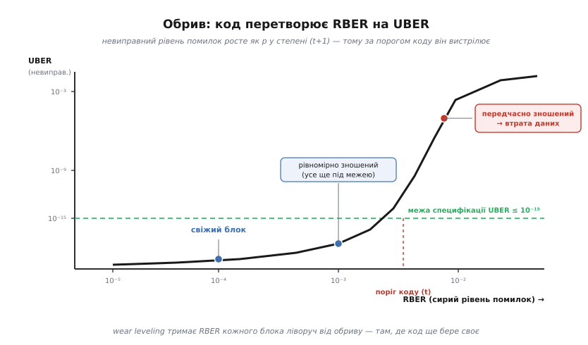
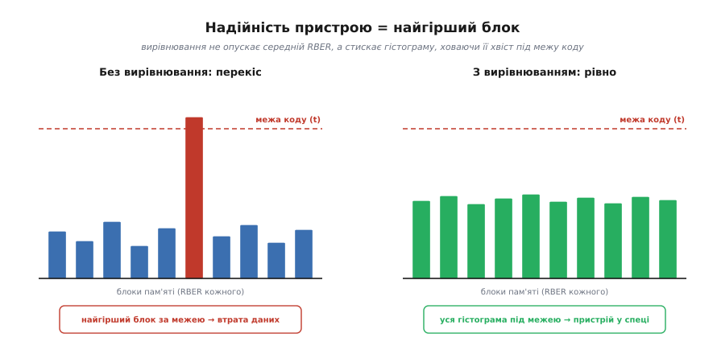
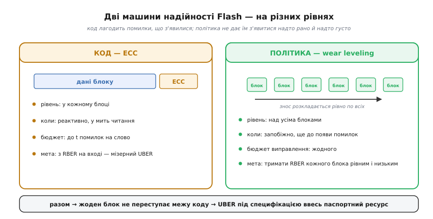

# Wear leveling у Flash-пам'яті

<preknowlist>
- [ECC у пам'яті](topic:communications/ecc-ram-flash) — код виправлення додає до кожного блоку контрольні біти й тихо лагодить перевернуті біти; коли помилок більше за його межу, блок віддає невиправну помилку й «умирає».
- [Flash зсередини](topic:programming/flash-internals) — біт тут це замкнений заряд; стирати можна лише цілими блоками, і кожне стирання трохи зношує комірку.
- [Рівні комірки NAND (SLC/MLC/TLC/QLC)](topic:electronics/nand-cell-levels) — що більше бітів утиснуто в одну комірку, то менший її ресурс і то вищий фоновий рівень помилок.
</preknowlist>

Flash-пам'ять зберігає дані не завдяки досконалості комірок, а завдяки **коду**. [ECC](topic:communications/ecc-ram-flash) додає до кожного блоку контрольні біти й при кожному читанні мовчки виправляє перевернуті біти — стільки, скільки дозволяє його межа, скажімо, сорок бітів на кілобайт. Поки помилок менше за цю межу, дані цілі; щойно більше — блок віддає **невиправну** помилку. Звідси несподіване визначення: Flash «умирає» не тоді, коли комірки розсипаються в пил, а тоді, коли кількість помилок переростає спроможність коду.

З цього визначення випливає питання, якого немає ні в оперативній пам'яті, ні на жорсткому диску. Кількість помилок у Flash **не стала — вона росте від використання**. І саме тут на сцену виходить wear leveling.

**Wear leveling** (англ. *wear* — знос, *level* — рівень; «вирівнювання зносу») — це не код, і сам він жодного біта не виправляє. Це системна **політика**, що вирішує, у яке фізичне місце класти кожен запис, аби жоден блок не зношувався швидше за інших. Навіщо це коду? Бо код розрахований на певний **фоновий рівень помилок**. Якщо один блок вибіжить наперед і зноситься вдесятеро сильніше за сусідів, його рівень помилок підскочить вище за той, під який код проєктували, — і код не впорається не тому, що він слабкий, а тому, що йому підсунули **гірший канал**, ніж він мав бачити. Wear leveling тримає всі блоки в одному, посильному для коду темпі старіння. Отже, надійність Flash — це дві речі на двох рівнях: **код** (ECC), що виправляє помилки в кожному блоці, і **політика** (wear leveling), що не дає рівню помилок жодного блоку вибитися за межу коду. Ця стаття — про другий рівень і його зчеплення з першим.

### Сховище як канал, що старіє

Коди виправлення народилися для каналу зв'язку: повідомлення йде крізь шумне середовище, шум перекидає окремі біти, а код на приймачі їх відновлює. Дані, збережені у Flash, — той самий випадок, лише «канал» тут не радіоефір, а сама комірка, а «час у каналі» — це місяці й роки зберігання. І цей канал має дивну властивість: **його шум росте від того, що ним користуються**.

Шум каналу описують двома величинами мовою кодування. **RBER** (англ. *raw bit error rate* — сира частота бітових помилок) — частка бітів, що приходять перевернутими **до** коду, тобто скільки помилок код бачить на вході. **UBER** (*uncorrectable bit error rate* — невиправна частота) — частка бітів, що лишаються хибними вже **після** коду, тобто скільки помилок проскочило. Уся робота коду — з відчутного RBER зробити мізерний UBER; специфікація накопичувача вимагає UBER не гіршого за, скажімо, 10⁻¹⁵ (один невиправний біт на квадрильйон прочитаних).

У звичайному каналі RBER заданий фізикою середовища й тримається сталим. У Flash — ні. Свіжий блок має RBER десь 10⁻⁵…10⁻⁴; блок, продавлений через десятки тисяч циклів «стерти-записати», — уже 10⁻³…10⁻² і гірше, бо кожне стирання жене заряд крізь тонкий ізолятор і залишає в ньому дефекти (детально про фізику — [чому комірка зношується від запису](topic:electronics/flash-wear-leveling)). Додають шуму й час (заряд поволі витікає — *retention*, утримання), і навіть читання сусідніх комірок (*read disturb* — збурення читанням). Але головний важіль — саме число стирань: що більше зносу, то вищий RBER. **Кожен блок — це канал, чий рівень шуму піднімається тим вище, чим більше ти в нього писав.**

### Обрив: чому важить не середнє, а найгірше

Тепер — головне, бо саме тут захована причина, чому wear leveling узагалі мусить існувати. Подивімося уважно, як код перетворює RBER на UBER. Код виправляє до **t** помилок у кодовому слові з **n** бітів. Слово стає невиправним лише тоді, коли в ньому набереться **більше ніж t** перевернутих бітів. Якщо биті трапляються незалежно з імовірністю **p** (це і є RBER), то ймовірність невиправного слова — це «хвіст» біноміального розподілу: сума ймовірностей мати t+1, t+2, … аж до n помилок. Поки середнє число помилок у слові тримається нижче за t (а саме так код і добирають), увесь хвіст задає його **перший доданок**:

```
P(невиправно) ≈ C(n, t+1) · p^(t+1)
```

Ключове тут — **степінь**. UBER росте не як p, а як p у степені **t+1**. Для коду, що виправляє сорок бітів, це p⁴¹. Така функція поводиться як **обрив**: поки p ліворуч від певного порога, p^(t+1) — число з десятками нулів після коми, і UBER лежить глибоко під будь-якою розумною межею; та щойно p підповзає до порога, степінь вистрілює, і UBER за крихітну зміну RBER злітає на багато порядків.


*Код перетворює плавний RBER на **обрив**. Поки сирий рівень помилок ліворуч від межі коду, невиправний UBER лежить глибоко під специфікацією (10⁻¹⁵) — свіжий і рівномірно зношений блоки тут у безпеці. Та щойно блок переступає межу, UBER за крихітну зміну RBER злітає на порядки: передчасно зношений блок віддає невиправні помилки, хоч його сусіди ще далеко від краю. Робота wear leveling — тримати **кожен** блок ліворуч від обриву.*

Ця надчутливість — суть усієї теми. Прикиньмо, наскільки вона різка.

**Приклад (у скільки разів частіше збоїть зношеніший блок).** Візьмімо код, що виправляє t = 8 бітів на сектор, і порівняймо два блоки під ним: свіжий із сирим рівнем помилок p та зношеніший, чий RBER у r разів вищий. Провідний доданок ймовірності збою — C(n, t+1)·p^(t+1), тож відношення частот збою двох блоків не залежить ні від n, ні від самого p, а лише від r:

```
відношення = (r·p)^(t+1) / p^(t+1) = r^(t+1)

r = 4     (зношеніший блок має лише вчетверо вищий RBER)
t = 8
r^(t+1) = 4⁹ = 262 144
```

Учетверо гірший канал — і блок віддає невиправну помилку в **чверть мільйона разів** частіше. А тепер згадаймо: втрата даних на всьому диску — це коли збоїть **хоч один** блок. Отже, надійність пристрою визначає не середній блок, а **найгірший**: один передчасно зношений блок затьмарює своїм UBER мільйони здорових сусідів. Ось де народжується потреба у wear leveling — не в тому, щоб подовжити життя *середнього* блоку, а в тому, щоб **не дати жодному блокові перелізти за край обриву**, поки решта ще далеко від нього. Повне виведення хвоста, вибір t під задану межу UBER і чому спрацьовує саме провідний доданок — у вставці [скільки помилок проскакує повз код](topic:communications/flash-ecc-budget/math-uber-rber.md).

> 🔧 **Навіщо це.** Правило «пристрій надійний рівно настільки, наскільки надійний його найгірший блок» прямо визначає, як проєктувати збереження у вбудованій системі. Якщо ваша прошивка щосекунди довбає той самий логічний запис, під ним завжди опиняється жменя фізичних блоків, чий RBER біжить угору в сотні разів швидше за решту, — і саме вони, а не «середня» пам'ять, вирішать, коли пристрій почне тихо втрачати дані. Тому питання «а чи рівно тут розкладається знос?» — не про довговічність узагалі, а про те, чи не стирчить якийсь один блок уже над обривом, поки паспорт носія обіцяє роки служби.

### Що з цим робить wear leveling

Ліки прямо випливають з діагнозу: якщо небезпечний саме **розкид** RBER, треба тримати RBER усіх блоків у вузькій смузі — а оскільки RBER жене знос, це означає **рівномірно розкладати знос**. Wear leveling веде на кожен блок лічильник стирань і кожен новий запис саджає в блок, який стирали найменше, тож гарячі, часто мінювані дані не залипають у кількох блоках, а мандрують по всій пам'яті. Так рівень помилок усієї пам'яті збирається в тісний гурт **добре під** межею коду, замість того щоб один блок стирчав над нею.


*Той самий пристрій під тим самим навантаженням. Ліворуч без вирівнювання: гарячі дані били в кілька блоків, їхній RBER вирвався за **межу коду** — і хоч решта блоків майже свіжі, пристрій уже втрачає дані, бо його доля — це доля найгіршого блоку. Праворуч із вирівнюванням: знос розмазано, RBER усіх блоків зібрано у вузьку смугу далеко під межею — жоден не переступає край, і накопичувач тримає специфікацію. Мета вирівнювання — не опустити середній RBER, а **стиснути гістограму** так, щоб її правий хвіст не дістав до обриву.*

Механіку вибору блоку та дві її версії — просте **динамічне** вирівнювання, що крутить лише блоки, які й так переписують, і **статичне**, що додатково переселяє «холодні», давно застиглі дані, — докладно розписано в [сусідній темі про сам механізм](topic:electronics/flash-wear-leveling). Нам тут важливий її коднотеоретичний зміст: статичне вирівнювання силоміць втягує в гру блоки, чий RBER інакше лишився б аномально низьким (бо їх не чіпали), — воно зрівнює не заради самих лічильників, а заради того, щоб **гістограма RBER була вузькою з обох боків**. Платить за це зайвими записами ([підсилення запису](topic:algorithms/write-amplification)): переселення холодних даних — це стирання, яких хост не просив, тобто трохи додаткового зносу заради рівності. Мистецтво контролера — вирівнювати рівно настільки, щоб жоден блок не наблизився до обриву, і **ні на крок більше**.

### Дві ролі, два рівні

Варто чітко розділити ці дві машини, бо їх легко сплутати.


*Дві машини на різних рівнях. **ECC — це код**: живе в кожному блоці, працює реактивно (лагодить помилки в мить читання) і має жорсткий бюджет — до t помилок на слово. **Wear leveling — це політика**: живе над блоками, працює запобіжно (розкладає знос ще до появи помилок) і бюджету виправлення не має взагалі — вона лише тримає вхід коду в межах, на які код розрахований. Поодинці не рятує жодна: найсильніший код захлинеться, якщо дати одному блокові зноситися до RBER 10⁻¹, а найрівніше вирівнювання не поверне жодного біта, якщо код не встигне за фоном помилок.*

Поряд стоять іще дві служби того самого прошарку. [Фоновий ремонт пам'яті (scrubbing)](topic:communications/memory-scrubbing) неквапом перечитує рідко вживані блоки, дає коду виправити накопичені за час зберігання поодинокі помилки й записує чисте значення назад, **поки помилок мало** — не даючи їм зібратися у невиправний пакет. [Запас зайвих блоків (over-provisioning)](topic:algorithms/over-provisioning) тримає резерв, куди відселяти дані з блоків, що вже підповзли до межі. І сам ECC подає **ранній сигнал**: контролер рахує, скільки помилок він виправляє в кожному блоці, — зростання цього лічильника означає, що RBER блоку повзе вгору, тобто блок наближається до обриву. За цим лічильником wear leveling і бачить, кого час розвантажити, а над яким блоком уже треба поставити хрест.

### Код і запас зносу проєктують разом

Останнє, що складає картину докупи: силу коду й дозволений знос підбирають **під одну спільну обіцянку**. Виробник знає, який RBER матиме блок наприкінці обіцяного ресурсу (скажімо, після 3000 циклів для TLC), і добирає t так, щоб навіть за того, найгіршого RBER код тримав UBER під межею специфікації (10⁻¹⁵…10⁻¹⁶). Wear leveling зі свого боку гарантує, що **жоден блок не досягне того кінцевого RBER раніше**, ніж пристрій виробить свій паспортний ресурс цілком. Тобто рядок «носій витримає N циклів при UBER 10⁻¹⁵» — це не властивість самих комірок, а спільна обіцянка трьох механізмів: сили коду, рівності зносу й запасу блоків.

Числа з практики показують це зчеплення наочно. Код **BCH** зі швидкістю близько 0.935 (тобто ≈6.5% місця під контрольні біти) тримає під межею UBER канал з RBER до 10⁻³. Коли комірки здрібніли й фоновий RBER підріс, того самого запасу місця вже бракувало — і накопичувачі перейшли на [LDPC](topic:communications/ldpc) з м'яким декодуванням, що за майже тієї ж надлишковості тримає RBER аж до 5·10⁻³. Код міцнішав рівно тому, що канал ставав шумнішим; а wear leveling увесь цей час робив свою половину роботи — не давав жодному блокові стати ще шумнішим за розрахунковий. Побачити, як розкид зносу по блоках перетворюється на UBER усього пристрою і як вирівнювання стискає цей розкид, можна на маленькій моделі — [оцінка UBER пристрою за гістограмою зносу](topic:communications/flash-ecc-budget/proj-device-uber.md).

---

Зведімо ниткою. Flash зберігає дані не назавжди-надійно, а рівно доти, доки код встигає виправляти більше помилок, ніж їх народжується. Помилок з часом більшає, і найшвидше — у блоках, які найбільше стирали. Оскільки код перетворює рівень помилок на UBER через крутий **обрив** (UBER ∝ p^(t+1)), навіть скромний перекіс зносу викидає найгірший блок за межу — а він один вирішує долю всього пристрою. **Wear leveling прибирає цей перекіс**: розкладає знос рівно, тримаючи RBER усіх блоків тісним гуртом під тим, на що розрахований код. Разом із фоновим ремонтом і запасом блоків це перетворює фізично тлінне середовище на накопичувач, що чесно тримає жорстку межу помилок увесь свій паспортний ресурс. ECC відповідає на питання «як виправити помилки, що вже з'явилися»; wear leveling — на тонше питання «як не дати їм з'явитися надто рано й надто густо саме там, де код їх уже не подужає».
