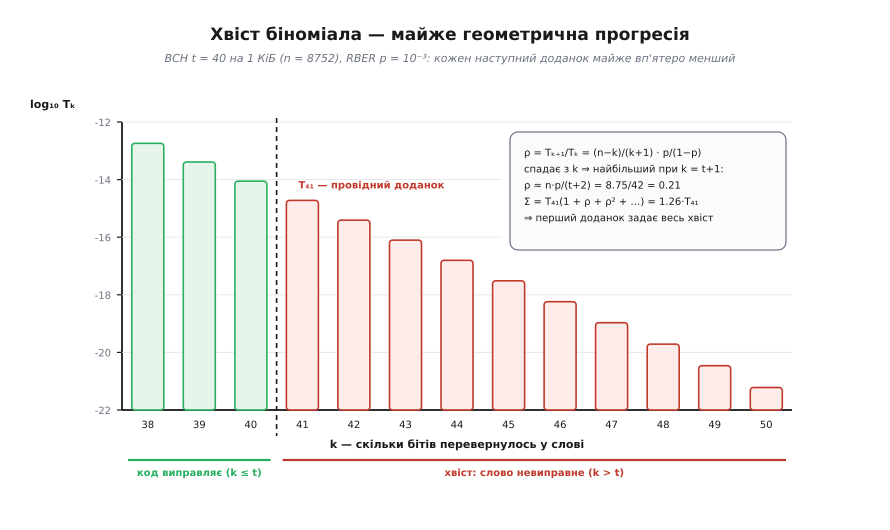
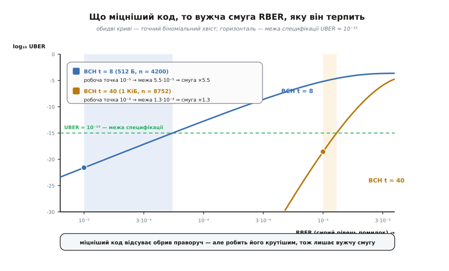
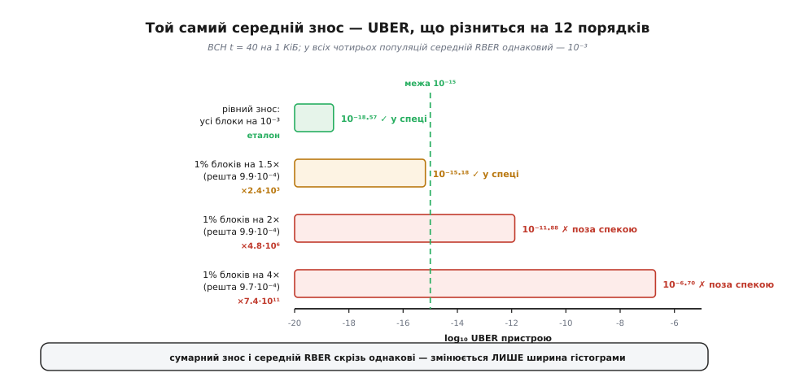

# 🧮 Скільки помилок проскакує повз код

<preknowlist>
- [Біноміальний розподіл](topic:math/binomial-distribution) — n незалежних випробувань, у кожному «успіх» з імовірністю p; число успіхів розподілене як C(n,k)·pᵏ·(1−p)ⁿ⁻ᵏ, а його середнє дорівнює n·p.
- [ECC у пам'яті](topic:communications/ecc-ram-flash) — код додає до даних контрольні біти й виправляє до t перевернутих бітів у слові; щойно їх більше за t, слово невиправне.
- [Коди BCH](topic:communications/bch-codes) — сімейство, де силу t задають проєктом: за корекцію t бітів у слові над полем GF(2ᵐ) платять рівно m·t контрольними бітами.
- [Опуклі функції](topic:math/convex-functions) — хорда лежить над графіком; для опуклої функції середнє від значень не менше за значення від середнього.
</preknowlist>

Питання виглядає як вправа з підручника: код виправляє до t помилок у слові — скільки ж їх проскакує? Але відповідь на нього — не число, а **функція**, і поводиться вона так дико, що на її формі тримається вся інженерія накопичувачів: скільки місця віддати під контрольні біти, скільки циклів записати в паспорт і навіщо взагалі рівномірно розкладати знос по блоках. Виведімо цю функцію від першопринципів і подивімося, що саме в ній таке круте.

## Два «рівні помилок» — і чому їх не можна порівнювати навпростець

Спершу треба чесно розібратися, що ми міряємо, бо тут ховається пастка. **RBER** (англ. *raw bit error rate*) — імовірність p того, що окремий біт прийде з пам'яті перевернутим **до** декодера. Це властивість середовища: скільки комірок збрехало. **UBER** (*uncorrectable bit error rate*) — скільки хибних бітів лишається **після** декодера. Обидві величини — «частка хибних бітів», обидві безрозмірні, і саме тому їх кортить порівняти напряму. Не можна: між ними стоїть **кодове слово**, і воно все змінює.

Декодер не працює з бітами поодинці. Він бере слово з n бітів і виносить вирок **слову цілком**: або виправив, або ні. Проміжного немає. Тож природна величина посередині — не бітова, а **словна**: імовірність того, що слово виявиться невиправним. Позначмо її FER (*frame error rate* — частота збою слова). Уся математика нижче — про FER; UBER із неї виводять діленням.

Ось де пастка. [JEDEC](https://www.jedec.org/standards-documents/dictionary/terms/uncorrectable-bit-error-rate-uber) означує UBER як «число хибних даних на прочитаний біт» — але коли слово завалилося, скільки саме хибних бітів ми отримали? Один? t+1? Усі n? Відповідь залежить від того, що робить контролер із зіпсутим сектором, і в літературі усталилася найпростіша домовленість:

```
UBER = FER / n
```

тобто збите слово рахують як **один** хибний біт на n прочитаних. Домовленість, а не теорема. Інша розумна домовленість — рахувати справжнє число хибних бітів (а їх у збитому слові типово t+1 — з причини, яку зараз і виведемо) — дала б UBER у t+1 разів більший.

І тут перше свідчення того, з якою функцією ми маємо справу. Різниця між домовленостями — множник 41 (для t = 40). Здавалося б, сорок один раз — це багато. Але якщо спитати не «на скільки різняться UBER», а «на скільки різниться **гранично допустимий RBER**», відповідь буде: на 12.9% (1.30·10⁻³ проти 1.15·10⁻³). Сорокаразова розбіжність у визначенні зсуває робочу точку на десяту частину. Це вже натяк: функція UBER(p) така крута, що цілі порядки величини по вертикалі коштують копійки по горизонталі. Звідки береться ця крутість — з'ясуємо нижче; саме вона й виявиться головною дійовою особою.

## Звідки береться біном

Найпростіша модель каналу: кожен біт псується **незалежно** від інших, з тією самою ймовірністю p. Це канал **без пам'яті** — минуле нічого не каже про майбутнє. (Наскільки це чесно щодо справжньої Flash — розберемо наприкінці; поки що приймімо.)

Спитаймо: яка ймовірність, що в слові перевернулося рівно k бітів? Візьмімо спершу один **конкретний** візерунок — скажімо, збилися біти №3, №17 і №2048, а решта цілі. Незалежність означає, що ймовірності множаться:

```
P(саме цей візерунок) = p·p·p · (1−p)·(1−p)·…·(1−p)
                      = p³ · (1−p)ⁿ⁻³
```

Зверніть увагу на дрібницю, з якої все виростає: результат **не залежить від того, які саме позиції збилися** — лише від того, скільки їх. Усі візерунки з трьома помилками рівноймовірні. Отже, лишилося їх порахувати: вибрати k позицій із n можна C(n,k) способами. Різні візерунки — події несумісні (не бувають водночас), тож імовірності додаються:

```
P(рівно k помилок) = C(n,k) · pᵏ · (1−p)ⁿ⁻ᵏ ≡ Tₖ
```

Це біном (лат. *bi-* — двічі, *nomen* — доданок) у чистому вигляді, виведений із двох речень: незалежність дає добуток, комбінаторика дає лічильник.

Тепер — переказ, який відразу все прояснює. У біноміального розподілу середнє дорівнює **λ = n·p**: стільки помилок у слові очікується. А код має **бюджет** t. І питання проєкту насправді звучить не «чи малий p», а:

> 🔧 **Навіщо це.** Чи стоїть бюджет t **із запасом вище** за середнє λ? Ось справжня змінна задачі. Для коду BCH t = 40 на кілобайт даних (слово n = 8752 біти) при RBER 10⁻³ маємо λ = 8.75 помилок у середньому проти бюджету 40 — запас у 4.6 раза. Не «p дуже мале» (10⁻³ — це аж ніяк не мале), а «бюджет майже вп'ятеро перекриває типову витрату». Уся надійність Flash живе в цьому відношенні, і саме його руйнує перекошений знос: блок, що зносився вчетверо сильніше, приходить із λ = 35 проти того самого бюджету 40 — запас зник.

## Хвіст і чому його задає один доданок

Слово невиправне, коли помилок більше за бюджет. Це «хвіст» розподілу — сума всіх доданків праворуч від t:

```
FER = P(X > t) = Σ  C(n,k)·pᵏ·(1−p)ⁿ⁻ᵏ,   k = t+1 … n
```

Сума з тисяч доданків, кожен — астрономічно мале число. Рахувати її в лоб не хочеться, та й розуміння вона не дає. На щастя, рахувати й не треба: майже все дає **перший** доданок. Але це треба довести, а не сподіватися.

Подивімося, як сусідні доданки ставляться один до одного. Поділімо T на попередній — біноміальні коефіцієнти згорнуться:

```
Tₖ₊₁ / Tₖ = [C(n,k+1) / C(n,k)] · [p / (1−p)] = [(n−k) / (k+1)] · [p / (1−p)]
```

Тепер ключове спостереження, на якому тримається все: множник (n−k)/(k+1) **спадає** з ростом k — чисельник меншає, знаменник більшає. Отже, відношення сусідніх доданків не просто менше за одиницю — воно **дедалі менше**. Найбільше воно на самому початку хвоста, при k = t+1; далі тільки падає.

Це дає строгу оцінку. Позначмо ρ — відношення на початку хвоста. Оскільки всі подальші відношення не перевищують ρ, увесь хвіст обмежений згори геометричною прогресією:

```
T₍ₜ₊₁₎ ≤ FER ≤ T₍ₜ₊₁₎ · (1 + ρ + ρ² + …) = T₍ₜ₊₁₎ / (1 − ρ)
```

Знизу — бо перший доданок і так входить у суму; згори — бо решта спадає не повільніше за прогресію. Сендвіч. А сама ρ при t ≪ n і p ≪ 1 зводиться до чарівно простого виразу:

```
ρ = (n−t−1)/(t+2) · p/(1−p) ≈ n·p/(t+2) = λ/(t+2)
```

**Перевірмо на робочих числах.** BCH t = 40, n = 8752, p = 10⁻³:

```
λ = 8752 · 10⁻³ = 8.752
ρ ≈ λ/(t+2) = 8.752/42 = 0.208      (точне значення 0.2076 — збіг до третьої цифри)
1/(1−ρ) = 1.262

⇒ T₄₁ ≤ FER ≤ 1.262 · T₄₁
точний хвіст:  FER = 1.260 · T₄₁
```

Увесь нескінченний хвіст — це перший доданок плюс 26%. Не «приблизно», не «зазвичай»: **доведено** зверху й знизу.


*Хвіст біноміала в логарифмічній шкалі. Ліворуч від пунктиру — випадки, які код виправляє (k ≤ t); праворуч — хвіст, тобто збій. Кожен наступний доданок майже вп'ятеро нижчий за попередній, і що далі, то швидше вони обвалюються — бо множник (n−k)/(k+1) сам спадає з k. Тому сума всього хвоста лише на 26% більша за свій перший доданок T₄₁: рахувати решту тисячу доданків просто немає потреби.*

І тут випливає річ, що зшиває всю картину. Прогресія збігається лише за ρ < 1, тобто за **λ < t+2**. Але ж це і є умова «бюджет вище за середнє» — та сама, з якої ми почали. Тобто **робочий режим коду й режим, де працює наближення провідним доданком, — це буквально те саме**. Не збіг: щойно код перестає мати запас, ламається і його надійність, і формула, якою ту надійність рахують.

## Від одного доданка до степеневого закону

Отже, вся справа в T₍ₜ₊₁₎. Розпишімо його:

```
T₍ₜ₊₁₎ = C(n, t+1) · p^(t+1) · (1−p)^(n−t−1)
```

Перший множник — стала: скількома способами вибрати t+1 позицій із n. А от від p залежать два інші, і тягнуть вони в різні боки. Перший — p^(t+1) — це «треба, щоб t+1 конкретних бітів збилися». Другий — (1−p)^(n−t−1) ≈ e^(−λ) — це «а решта n−t−1 бітів мусять лишитися чистими», і з ростом p це стає дедалі важче. Часто другий множник просто викидають (він же ≤ 1), і дістають ту саму формулу, яку всі цитують:

```
FER ≲ C(n, t+1) · p^(t+1)        ⇒   UBER ∝ p^(t+1)
```

Викидання законне — це чесна оцінка **згори**, тобто вона на боці обережного проєктувальника. Але задарма нічого не буває: при λ = 8.75 множник e^(−λ) важить e^8.75 ≈ 6·10³, тож відкинута форма завищує FER у **6096 разів**. Для паспорта це запас, для розуміння — спотворення. Бо викинули ми якраз те, що визначає справжню крутість.

Порахуймо нахил чесно — у логарифмічних координатах, де степеневий закон стає прямою:

```
s ≡ d ln T₍ₜ₊₁₎ / d ln p = (t+1) − p·(n−t−1)/(1−p) ≈ (t+1) − λ
```

Ось воно — **справжній показник степеня**. Не t+1, а **s = (t+1) − λ**. Степенева частина штовхає нахил угору на t+1, а вимога «решта бітів чиста» з'їдає з нього λ. Числом:

```
BCH t = 8,  n = 4200,  p = 10⁻⁵ :  λ = 0.04 → s ≈ 9 − 0.04  = 8.96   (числово 8.96 ✓)
BCH t = 40, n = 8752,  p = 10⁻³ :  λ = 8.75 → s ≈ 41 − 8.75 = 32.25  (числово 32.5 ✓)
```

Слабкий код працює в режимі λ ≈ 0, і для нього «UBER ∝ p^(t+1)» — точна правда. Сильний код працює при λ = 8.75, і його справжній нахил — 32, а не 41. Різниця не косметична: вона в дев'ять порядків на кожну декаду p.

Заразом стає видно, чому все це можна переказати ще коротше. При t ≪ n біном переходить у Пуассона, і провідний доданок набуває вигляду, де n і p входять **лише** через λ:

```
T₍ₜ₊₁₎ ≈ λ^(t+1) · e^(−λ) / (t+1)!
```

Числово це та сама величина (розбіжність 0.8% при t = 8 і 5.9% при t = 40), але тепер видно голу суть: **надійність коду залежить не від n і не від p окремо, а від одного числа λ = n·p проти одного числа t.** Довжина слова й сирий рівень помилок — лише способи скрутити λ.

### Де правило rᵗ⁺¹ працює, а де бреше

Звідси випливає популярне правило: якщо один блок має RBER утричі-вчетверо вищий за інший, він збоїть у r^(t+1) разів частіше. Перевірмо його чесно, поділивши провідні доданки:

```
T₍ₜ₊₁₎(r·p) / T₍ₜ₊₁₎(p) = r^(t+1) · [(1 − r·p) / (1 − p)]^(n−t−1)
                        ≈ r^(t+1) · e^(−λ·(r−1))
```

Голе r^(t+1) — це знову той самий викид множника e^(−λ). Дивімося, чого він вартий:

```
слабкий код (t = 8, λ = 0.04), r = 4:
    голе 4⁹              = 262 144
    з поправкою e^(−0.13) = 231 100
    точний хвіст          = 234 100        ⇒ правило працює, похибка 12%

сильний код (t = 40, λ = 8.75), r = 4:
    голе 4⁴¹             = 4.8·10²⁴
    з поправкою e^(−26.3) = 1.9·10¹³
    точний хвіст          = 7.4·10¹³        ⇒ правило завищує в 65 мільярдів разів
```

Правило r^(t+1) — не універсальний закон, а наближення для режиму **λ ≪ t**, де живуть слабкі коди. Сильний код при λ = 8.75 порушує його на одинадцять порядків. Причому ламаються **обидві** поправки: при p = 4·10⁻³ маємо λ = 35 проти бюджету 40, тобто ρ = 0.83 — прогресія ледь збігається, і хвіст уже в 4.6 раза більший за свій провідний доданок. Зношений блок вийшов із режиму, де його взагалі можна описувати одним доданком.

Чи рятує це висновок «найгірший блок вирішує все»? Ні — навпаки, підпирає його. Хай справжнє відношення 7.4·10¹³, а не 4.8·10²⁴: блок, що збоїть у **сімдесят трильйонів** разів частіше за сусіда, однаково затьмарює собою решту пам'яті. Просто чесне число тут менше за легенду — і краще знати, яке саме.

## Як виробник добирає t

Тепер переверньмо задачу. Досі ми питали «дано код — який UBER?». Виробник питає навпаки: **дано канал і обіцянка — який потрібен код?** Він знає RBER наприкінці ресурсу (скажімо, 10⁻³ після паспортних циклів для TLC) і знає межу [JESD218](https://www.jedec.org/standards-documents/dictionary/terms/uncorrectable-bit-error-rate-uber): UBER < 10⁻¹⁵ для клієнтських накопичувачів, < 10⁻¹⁶ для серверних. Треба знайти найменше t, що виконує обіцянку **в найгіршій точці ресурсу**.

Тут стане в пригоді загальний вигляд, що ховається за нашим провідним доданком. Для пуассонівського числа помилок хвіст обмежений експонентою від великих відхилень:

```
FER ≤ exp( −λ · D(u) ),    де  u = (t+1)/λ  — у скільки разів бюджет перекриває середнє
                                D(u) = u·ln u − u + 1
```

Це нерівність **Чернова** — названа за Германом Черновим, який опублікував метод 1952 року, хоч сам Чернов приписував доведення Герману Рубіну; близькі оцінки раніше дістали Бернштейн і Крамер (1938). Перевіримо, чи не втратили ми чогось, перейшовши від точного доданка до оцінки: для наших двох кодів межа Чернова лежить вище за точний хвіст рівно на стирлінгів множник √(2π(t+1)) — тобто це той самий провідний доданок, лише вбраний у форму, з якої видно структуру. А структура ось яка:

```
λ · D(u) ≥ ln(1/FER_ціль)
```

Ліворуч — що дає код, праворуч — чого вимагає обіцянка. І тепер видно найважливішу асиметрію всієї задачі: **ціль входить під логарифмом, а канал — множником.** Зробити обіцянку вдесятеро суворішою — це додати ln 10 = 2.3 до правої частини, дрібниця. Зробити канал удвічі шумнішим — це подвоїти λ, тобто вимагати вдвічі більшого бюджету.

Порахуймо це точно, без наближень. Слово — кілобайт даних (8192 біти) плюс контрольні біти BCH над GF(2¹⁴), тобто рівно 14 бітів за кожен виправлений:

```
p наприкінці   t для 10⁻¹⁵   n       швидкість    t для 10⁻¹⁶   швидкість
──────────────────────────────────────────────────────────────────────────
   10⁻⁴             12       8360     0.980            13        0.978
 3·10⁻⁴             19       8458     0.969            20        0.967
   10⁻³             35       8682     0.944            36        0.942
 2·10⁻³             53       8934     0.917            55        0.914
 3·10⁻³             69       9158     0.895            72        0.890
 5·10⁻³            101       9606     0.853           104        0.849
   10⁻²            183      10754     0.762           188        0.757
```

Прочитаймо таблицю. Суворіша вдесятеро обіцянка (10⁻¹⁵ → 10⁻¹⁶) коштує **один зайвий біт корекції** з 35. А вгіршення каналу втричі (10⁻³ → 3·10⁻³) коштує **подвоєння коду**: 35 → 69, і швидкість падає з 0.944 до 0.895. Ось чому специфікації надійності виглядають так зухвало: обіцяти квадрильйон бітів без помилки майже задарма, якщо канал під контролем. Уся ціна — в каналі.

Заразом видно, звідки взялися реальні числа галузі. Промислова конфігурація BCH t = 40 на кілобайт дає швидкість 8192/8752 = 0.936 (6.4% місця під контрольні біти) — це трохи більше за розрахункові 35 з таблиці, бо проєктувальник лишає запас: при p = 10⁻³ такий код дає UBER = 10⁻¹⁸·⁵⁷, тобто в 3677 разів під межею. А тепер гляньмо на рядок 5·10⁻³: BCH потребував би t = 101 і швидкості 0.853 — понад **удвічі** більше надлишковості. Саме тут BCH і скінчився: коли комірки здрібніли й фоновий RBER підріс до одиниць на тисячу, платити 15% місця стало задорого, і накопичувачі перейшли на [LDPC](topic:communications/ldpc) з м'яким декодуванням, який тримає такий канал за майже ту саму плату.


*Обидві криві — точний біноміальний хвіст, не наближення. Міцніший код (t = 40) відсуває обрив далеко праворуч: він терпить RBER 10⁻³ там, де слабкий (t = 8) здається вже на 5·10⁻⁵. Але придивіться до нахилу — міцніший код падає **крутіше**. Тому його смуга допуску, від робочої точки до межі специфікації, виявляється **вужчою**: ×1.3 проти ×5.5 у слабкого. Купуючи міцність, ви купуєте разом із нею нетерпимість до розкиду.*

Ця остання обставина — не курйоз, а закон, і виводиться він у два рядки. Ширина смуги — це запас у порядках, поділений на нахил:

```
смуга = 10^(запас / s)

t = 8 :  запас = 21.59 − 15 = 6.59 порядку,  s = 8.96  → 10^0.735 = ×5.4   (точно ×5.5)
t = 40:  запас = 18.57 − 15 = 3.57 порядку,  s = 32.25 → 10^0.111 = ×1.3   (точно ×1.3)
```

Обидва множники грають проти сильного коду: запасу в нього менше (він працює ближче до своєї межі), а нахил крутіший. Звідси висновок, що перевертає інтуїцію: **що міцніший код у накопичувачі, то менше він прощає розкид зносу.** Не «сильний ECC урятує від нерівномірного зносу» — навпаки: сильний ECC вимагає рівнішого зносу, ніж слабкий.

## Чому вузька гістограма — умова, а не косметика

Тепер зберімо все на рівні пристрою. Накопичувач — це мільйони слів у блоках із **різним** зносом, тож у кожного свій p. Утрата даних — це збій **хоч одного** слова, а що ймовірності мізерні, сума працює замість складного об'єднання:

```
UBER пристрою ≈ ⟨UBER(p)⟩ — середнє по всій популяції блоків
```

І ось де математика виносить вирок політиці. UBER(p) — локально степенева з показником s ≈ 32, тобто **опукла**. За нерівністю Єнсена (Йоган Єнсен, данський математик; «Sur les fonctions convexes…», Acta Mathematica, 1906 — там-таки він увів і сам сучасний термін «опукла функція»; для двічі диференційовних це раніше довів Отто Гельдер, 1889):

```
⟨UBER(p)⟩ ≥ UBER(⟨p⟩)
```

Читається так: **пристрій завжди гірший за свій середній блок.** Не «буває гірший» — завжди, з рівністю лише за нульового розкиду. Отже, у формулі надійності є доданок, який залежить **виключно від ширини гістограми** і зникає, лише коли ширина нульова. Це і є той доданок, яким керує вирівнювання зносу.

Наскільки він великий? Візьмімо розкид логнормальним із параметром σ (розкид логарифма RBER) і зафіксуймо середнє:

```
роздування = ⟨(p/p̄)^s⟩ = exp( s·(s−1)·σ²/2 ) ≈ exp( s²σ²/2 )
```

Показник **квадратичний і за крутістю коду, і за шириною гістограми**. Числа:

```
σ (розкид RBER)     слабкий код (s = 9)     сильний код (s = 32)
─────────────────────────────────────────────────────────────────
    2%                    ×1.01                    ×1.2
    5%                    ×1.09                    ×3.5
   10%                    ×1.4                     ×154
   20%                    ×4.2                     ×5.7·10⁸
   30%                    ×25                      ×5·10¹⁹
```

Звідси — проєктне правило. Щоб розкид коштував не більше за порядок величини, треба s·σ ≤ √(2·ln 10) = 2.15, тобто:

```
σ ≤ 2.15 / s
```

Для сильного коду (s = 32) це **σ ≤ 6.8%**. Ось кількісний зміст слів «вузька гістограма»: рівень помилок усіх блоків має триматися в межах кількох відсотків один від одного. Не «приблизно однаково» — а **в межах семи відсотків**. (Логнормаль тут — модель із нескінченним хвостом, а локальний степеневий закон чинний лише локально, тож ці числа читаємо як міру того, **наскільки люто** карається розкид, а не як точний прогноз.)

Точний рахунок на біномі підтверджує вирок і без будь-яких моделей розподілу:


*Чотири популяції з **однаковим середнім RBER 10⁻³** — той самий сумарний знос, ті самі записи хоста. Змінюється лише ширина гістограми, і UBER пристрою розповзається на дванадцять порядків. Досить одного відсотка блоків із вдвічі вищим RBER, щоб накопичувач вилетів зі специфікації на три порядки, — хоч решта 99% блоків при цьому навіть трохи чистіші за середнє.*

Прочитаймо ці числа уважно, бо вони й є відповіддю на питання «навіщо вирівнювати»:

```
рівний знос, усі блоки на 10⁻³         UBER = 10⁻¹⁸·⁵⁷   запас 3677× під межею
1% блоків на 1.5×, решта 9.95·10⁻⁴     UBER = 10⁻¹⁵·¹⁸   ✓ у спеці — але запасу вже нема
1% блоків на 2×,   решта 9.90·10⁻⁴     UBER = 10⁻¹¹·⁸⁸   ✗ поза спекою на 3 порядки
1% блоків на 4×,   решта 9.70·10⁻⁴     UBER = 10⁻⁶·⁷⁰    ✗ катастрофа
```

Один відсоток блоків, зношених **лише вдвічі** сильніше за середнє, з'їдає весь чотирикратний запас порядків і викидає пристрій за межу. І перевірмо, хто саме винен: роздування в рядку «1% на 2×» — це ×4.8·10⁶, тобто рівно 1% × 4.8·10⁸ — відношення збою одного зношеного блока до здорового. Решта 99% блоків у сумі не додають **нічого** помітного. Арифметика буквально показує пальцем: усе, що ми називаємо надійністю пристрою, — це поведінка його правого хвоста.

І звідси стає видно останній, найтонший поворот. Вирівнювання зносу **не може** зменшити середнє ⟨p⟩: скільки хост наказав записати, стільки стирань і буде, а переселення холодних даних додає ще й своїх зайвих ([підсилення запису](topic:algorithms/write-amplification)). Тобто єдиний важіль, який у нього є, — **σ**. Здавалося б, слабка позиція: воно псує середнє заради ширини. Порахуймо цю оборудку:

```
ціна:    зайві стирання підняли ⟨p⟩ на 10%  →  1.1^32.25 = ×21.6 гірше
виграш:  σ стиснуто з 20% до 5%             →  ×1.6·10⁸ краще
─────────────────────────────────────────────────────────────────────
підсумок:                                       ×7.4·10⁶ краще
```

Ось чому оборудка, що виглядає програшною, насправді виграє в мільйони разів: середнє входить у надійність через степінь s, а ширина — через **експоненту від s²**. Проти експоненти степінь не грає. Вирівнювання зносу свідомо погіршує дешеву величину, щоб полагодити дорогу.

## Де модель ламається

Чесність вимагає назвати межі всього виведеного, бо кожен крок ми за щось заплатили.

**Незалежність — найсміливіше припущення.** Справжні помилки Flash **збиваються в купи**: спільна сторінка, спільний рядок слів, збурення від сусіда при записі, купчасті витоки заряду за час зберігання. Купчастість завжди робить хвіст **важчим** за біноміальний: якщо помилки ходять групами по кілька, ймовірність зібрати t+1 штук в одному слові вища за незалежну оцінку. Тому біном тут — не консервативна оцінка, а **оптимістична**, і саме з нею борються перемежуванням (розкидати біти одного слова по різних фізичних місцях, щоб купа розпалася на поодинокі помилки в різних словах) і вимірюванням справжнього FER замість довіри до формули.

**Декодер із межею t — модель твердого рішення.** У LDPC із м'яким декодуванням жорсткої межі t взагалі немає: декодер працює з мірами довіри, обрив у нього теж є (його звуть водоспадом), але описується він не C(n,t+1)·p^(t+1). Уся арифметика вище — про BCH та інші коди з обмеженою відстанню.

**Хибне виправлення.** Декодер BCH, отримавши більш ніж t помилок, іноді не здається, а «виправляє» слово до **чужого** кодового слова, дописуючи помилок від себе. При t ≪ n це рідкість, але саме через неї збите слово інколи мовчить, замість чесно доповісти про збій.

**RBER — не константа блока.** Він залежить не лише від циклів, а й від часу з останнього запису, температури й числа читань сусідів. Саме це показали Мілке зі співавторами (IRPS 2008, «Bit error rate in NAND Flash memories»): UBER — сильна функція і циклів, і часу зберігання, тому обіцянку про UBER **не можна** давати без одночасного обмеження на максимум циклів і на строк зберігання. Рядок «UBER < 10⁻¹⁵» без цих двох чисел не означає нічого.

---

Зведімо ниткою. Незалежність бітів дає біном, біном дає хвіст, і хвіст — усупереч своєму вигляду з тисячі доданків — цілком описується першим із них, бо відношення сусідніх доданків спадає й обмежує все геометричною прогресією; збігається вона рівно тоді, коли бюджет коду стоїть вище за середнє число помилок, тобто рівно в робочому режимі. Провідний доданок і є степеневим законом — але з чесним показником s = (t+1) − λ, а не t+1: вимога «решта бітів чиста» з'їдає з крутості цілу λ. Цей показник — головна константа теми. Він робить обіцянку 10⁻¹⁶ майже безкоштовною порівняно з 10⁻¹⁵ і водночас робить утричі шумніший канал удвічі дорожчим. Він же звужує смугу допуску міцного коду до ×1.3 — і тим перетворює силу ECC на вимогу до рівності зносу. І він же, стоячи в експоненті exp(s²σ²/2), робить ширину гістограми RBER величиною, за яку пристрій платить порядками, тоді як за середнє платить лише разами. Тому вирівнювання зносу — не гігієна й не подовження життя середнього блока: це єдиний спосіб тримати під контролем ту саму величину, до якої код найчутливіший, і заради неї варто свідомо витратити трохи зайвого ресурсу.
