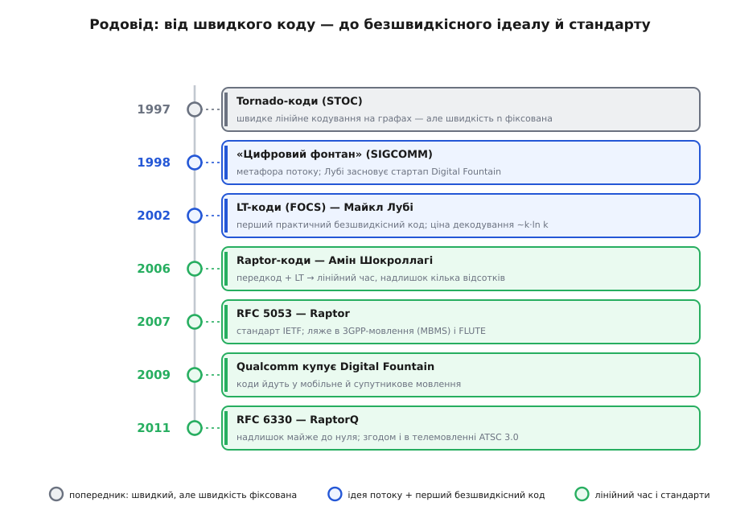

# Фонтанні коди

<preknowlist>
- [Канал зі стиранням](topic:communications/erasure-channel) — модель передачі, де пакет або доходить цілим, або зникає повністю, а пропуски визначаються за послідовними номерами.
- [Біт парності](topic:communications/parity-bit) — операція XOR (`a ⊕ b`) та її алгебраїчна властивість `a ⊕ a = 0`, що дає змогу скасовувати однакові доданки.
- [Лінійні блокові коди](topic:communications/linear-block-codes) — кодування й відновлення даних за допомогою систем лінійних рівнянь над скінченними полями.
- [Коди LDPC](topic:communications/ldpc) — коди з низькою щільністю перевірок парності, що декодуються за допомогою розповсюдження довіри на двочасткових графах.
</preknowlist>

Коли один сервер роздає оновлення прошивки обсягом у сотні мегабайтів на мільйон пристроїв через супутник або мобільну мережу, кожен приймач втрачає власний унікальний набір пакетів. В одного автомобіль проїхав під мостом і згубив пакети з 10-го по 15-й, у другого через завади випали 100-й і 402-й, а третій узагалі увімкнув приймач на середині сеансу. Спроба розв'язати цю задачу звичним повторним запитом [ARQ](topic:communications/arq) призводить до зворотного шторму: мільйон пристроїв одночасно благає переслати свої відсутні фрагменти, і зворотний канал негайно глушить сам себе. Класичне завадостійке кодування [Ріда — Соломона](topic:communications/reed-solomon) теж заходить у кут: воно вимагає заздалегідь зафіксувати надлишок — обрати параметр `n` для `k` блоків файлу. Якщо обрати замало надлишкових пакетів, пристрої з найгіршим зв'язком не зможуть зібрати файл; якщо взяти з величезним запасом — усі інші марно спалюватимуть коштовну смугу пропускання в очікуванні найповільнішого приймача.

Парадокс класичних методів полягає в прив'язці до конкретних номерів пакетів та фіксованого коефіціента надлишковості. Фонтанний код (*fountain code*, від латинського *fons* — джерело) знімає це обмеження за допомогою принципово іншого підходу: він перетворює передачу даних на нескінченний потік закодованих комбінацій. Відправник не стежить за тим, хто й що втратив, і не узгоджує параметр надлишковості під найгірший канал. Він просто «умикає цифровий фонтан», породжуючи потенційно нескінченну послідовність закодованих пакетів-крапель. Приймачу не важливо, які саме краплі потрапили до його судини, — для відновлення вихідних даних із `k` блоків достатньо впіймати будь-які `k (1 + ε)` крапель, де `ε` є крихітним надлишком. Як тільки кухоль наповнюється, приймач спиняє прийом.


*Відправник ллє нескінченний потік закодованих крапель. Кожен приймач ловить власну випадкову підбірку обсягом близько k і розплутує з неї весь файл.*

Властивість коду породжувати довільну кількість закодованих символів без заздалегідь визначеної швидкості називають безшвидкісністю (*rateless*, від англійського *rate* — швидкість, норма). Фонтанний код не має фіксованого відношення `k/n` — швидкість кодування адаптується до умов каналу на льоту без жодного зворотного зв'язку.

---

## Графова структура та XOR-злиття

Початковий файл обсягом `M` байтів розбивають на `k` однакових фрагментів-блоків `B[1], B[2], ..., B[k]`. Розмір блоку обирають так, щоб закодована крапля разом із заголовком вміщалася в один мережевий пакет (наприклад, 1400 байтів для Ethernet). Кожна вихідна крапля `P` створюється за простим алгоритмом з трьох кроків:

1. Згідно зі спеціальним імовірнісним розподілом обирають ціле число `d` в інтервалі від 1 до `k`. Це число називають степенем (*degree*) краплі.
2. З-поміж усіх `k` вхідних блоків абсолютно випадково та рівномірно вибирають `d` **різних** індексів `i[1], i[2], ..., i[d]`.
3. Обчислюють побайтовий XOR усіх обраних блоків: `P = B[i[1]] ⊕ B[i[2]] ⊕ ... ⊕ B[i[d]]`.

Утворений вантаж краплі супроводжують заголовком. Щоб декодер міг розплутати суму, він повинен знати, які саме вхідні блоки увійшли до даного XOR. Передавати повний перелік індексів у кожному пакеті невигідно, адже при великих `d` заголовок з'їдатиме корисний обсяг. Замість цього використовують генератор псевдовипадкових чисел: кодер і декодер мають одинаковий алгоритм ГПВЧ. У заголовок краплі вміщують лише 32- або 64-бітне зерно (*seed*), з якого декодер на своєму боці миттєво відтворює той самий степінь `d` та ті самі індекси `i[1]...i[d]`.


*Двочастковий граф коду. Кожна крапля з'єднана ребрами з тими вхідними блоками, які увійшли до її XOR-суми.*

Детермінована відтворюваність ГПВЧ є критичною: використання стандартних 64-бітних алгоритмів на кшталт Mersenne Twister або LFSR гарантує однаковий порядок вибірки індексів на будь-якій апаратній платформі незалежно від архітектури процесора чи операційної системи.

З математичного погляду ця структура утворює двочастковий граф (*bipartite graph*, від латинського *bis* — двічі + *pars* — частина), де з одного боку лежать `k` вузлів вхідних блоків, а з іншого — отримані краплі. У теорії кодування цей граф називають також графом Таннера (*Tanner graph*) або графом факторів. Ребра показують, які блоки злито в кожній краплі. Степінь вузла-краплі вказує на кількість її ребер. Якщо крапля має степінь `d = 1`, вона містить у собі чистий, незашифрований вхідний блок. Саме такі краплі степеня 1 слугують ключем до всього процесу декодування.

Вся генерація краплі є лінійною комбінацією над двійковим скінченним полем `GF(2)`. За суттю, відправник будує матрицю генератора `G` розміром `m × k`, де кожен рядок відповідає одній отриманій краплі й має `d` одиниць у позиціях вибраних блоків. Однак матрицю `G` ніхто не зберігає в пам'яті явно — ребра розгортаються алгоритмічно із зерна прямо під час проходження пакетів. Сформована система рівнянь `G · X = Y` має повний ранг `k` над полем `GF(2)` тоді й лише тоді, коли векторний простір прийнятих крапель покриває всі `k` ступенів свободи вихідних даних.

У порівнянні з випадковим мережевим кодуванням (RNC, *Random Network Coding*), яке обчислює лінійні комбінації над розширеними полями Галуа (наприклад, `GF(2⁸)`) і вимагає повного матричного декодування методом Гаусса з важкими множеннями байтів, фонтанні коди працюють виключно над двоелементним полем `GF(2)`. Завдяки цьому складне множення замінюється простим XOR, а замість матричного обернення застосовують швидке обчищення графа.

У практичних протоколах часто застосовують систематичну форму фонтанного кодування (*systematic fountain codes*). У цьому випадку перші `k` крапель відправляють без жодного злиття — як пряму копію вихідних блоків `B[1]...B[k]` (краплі степеня 1). Це дає змогу приймачу за умов ідеального зв'язку читати потік із нульовими накладними витратами на декодування. І лише починаючи з `(k + 1)`-ї краплі вмикається генерація випадкових XOR-комбінацій для латання можливих втрат.

---

## Алгоритм декодування обчищенням

Відновлення вихідних даних є процесом розв'язання системи лінійних рівнянь `G · X = Y` над полем `GF(2)`, де `X` — вектор вхідних блоків, а `Y` — вектор отриманих крапель. Якщо уявити собі довільне випадкове кодування над `GF(2)`, метод Гаусса вимагав би `O(k³)` операцій (або `O(k²)` при використанні спеціальних методів для розріджених матриць). Для великих файлів із тисяч або мільйонів блоків така складність означала б довгі хвилини важких матричних обчислень на процесорі приймача.

Однак спеціально побудована структура графа дає змогу виконувати декодування за допомогою значно простішого ітеративного алгоритму — обчищення (*peeling decoding*, від англійського *peel* — знімати шкірку). В контексті графових кодів цей процес еквівалентний алгоритму розповсюдження довіри (*belief propagation*) для дискретного каналу зі стиранням. Алгоритм замінює важку алгебру Гаусса швидким послідовним розплутуванням ребер графа й працює за такими кроками:

1. **Пошук ключа:** Декодер шукає в графі принаймні одну краплю степеня `d = 1`.
2. **Розкриття блоку:** Оскільки крапля степеня 1 з'єднана лише з одним вхідним блоком `B[j]`, значення цього блоку вважається повністю відновленим (`B[j] = P`).
3. **Вирізання (XOR-віднімання):** Знайдений блок `B[j]` XOR-ять з усіма іншими краплями, у списках зв'язків яких він присутній. Завдяки тотожності `x ⊕ x = 0`, доданок `B[j]` зникає з цих крапель, а їхні степені зменшуються на 1.
4. **Видалення та повтор:** Відновлений блок `B[j]` та використану краплю видаляють із графа. Усі краплі, чий степінь після вирізання впав до 1, потрапляють у чергу відновлення — так звану брижу декодування (*decoding ripple*).
5. Кроки 1–4 повторюють доти, доки не будуть відновлені всі `k` вхідних блоків.


*Алгоритм обчищення в дії. Відомий блок степеня 1 вирізають із сусідніх крапель; їхній степінь зменшується, породжуючи нові краплі степеня 1.*

**Покроковий приклад декодування:**

Нехай вихідний файл складається з `k = 3` блоків: `a`, `b`, `c`. Приймач упіймав `m = 3` краплі:
- `P1 = b` (степінь 1)
- `P2 = a ⊕ b` (степінь 2)
- `P3 = a ⊕ b ⊕ c` (степінь 3)

Обчислення виконують за такими кроками:

```
початковий стан:
  P1 = b                  [степінь 1, з'єднана з b]
  P2 = a ⊕ b              [степінь 2, з'єднана з a, b]
  P3 = a ⊕ b ⊕ c          [степінь 3, з'єднана з a, b, c]

крок 1:
  крапля P1 має степінь 1  ⇒  відновлено b = P1
  вирізаємо b з P2 та P3:
    P2' = P2 ⊕ b = (a ⊕ b) ⊕ b = a        [степінь зменшився з 2 до 1]
    P3' = P3 ⊕ b = (a ⊕ b ⊕ c) ⊕ b = a ⊕ c [степінь зменшився з 3 до 2]

крок 2:
  крапля P2' має степінь 1 ⇒  відновлено a = P2'
  вирізаємо a з P3':
    P3'' = P3' ⊕ a = (a ⊕ c) ⊕ a = c      [степінь зменшився з 2 до 1]

крок 3:
  крапля P3'' має степінь 1 ⇒  відновлено c = P3''

результат:
  усі 3 блоки a, b, c успішно відновлені.
```

Важливо відзначити обчислювальну вигоду структури обчищення: на кожному кроці видалення ребра проводиться лише одна побайтова операція XOR над блоком пам'яті. Якщо сумарна кількість ребер у графі прийнятих крапель становить `E`, декодер витрачає загалом `O(E)` операцій на повне відновлення файлу. Для розріджених графів це дає колосальний виграш у швидкодії проти звичайних методів точного лінійного розв'язку.

При обробці великих масивів блоків висока швидкість XOR-операцій є вирішальною. Сучасні декодери оптимізують кроки вирізання за допомогою векторних інструкцій процесора (AVX2 або AVX-512), виконуючи XOR над 256- або 512-бітними регістрами пам'яті паралельно. Пам'ять для блоків вирівнюють по межах 32 або 64 байтів, що забезпечує максимальну пропускну здатність шини даних під час обчищення.

З графової точки зору декодер підтримує два класи списків суміжності: масив зв'язків від крапель до вхідних блоків та масив зворотних ребер від вхідних блоків до крапель. Вирізання блоку займає час, пропорційний його поточному степеню в зворотному графі.

Якщо на певному кроці в брижі не залишається жодної краплі степеня 1, а частина вхідних блоків досі не відновлена, обчищення **зупиняється** (застрягає). Застрягання означає, що поточна система рівнянь у графі не містить підсистеми з трикутною формою. У такому разі приймач змушений чекати на нові краплі з каналу або застосовувати матричне виключення Гаусса для залишку невизначених блоків.

---

## Серце фонтана: солітонні розподіли

Успіх або провал алгоритму обчищення повністю залежить від імовірнісного розподілу степенів `μ(d)`. 

Якщо кодувати краплі з занадто великим середнім степенем, у графі майже не буде крапель степеня 1 — процес декодування навіть не розпочнеться. Якщо ж навпаки, генерувати забагато крапель степеня 1, вони не охоплять усі блоки складними зв'язками, і для збору останніх блоків знадобиться величезна кількість дублікатів.

Ідеальний розподіл має підтримувати розмір брижі декодування рівним точно 1 на кожному кроці видалення блоків. Це означає, що в середньому відновлення одного блоку має породжувати рівно одну нову краплю степеня 1.

### Ідеальний солітонний розподіл

Майкл Лубі математично вивів розподіл імовірностей степенів `ρ(d)`, який забезпечує цю властивість у математичному сподіванні. Його назвали ідеальним солітонним розподілом (*Ideal Soliton Distribution*, від англійського *solitary* — поодинокий, відокремлений):

```
ρ(1) = 1 / k
ρ(d) = 1 / (d · (d - 1))   для d = 2, 3, ..., k
```

Сума всіх імовірностей дорівнює 1:

```
∑_{d=1}^k ρ(d) = 1/k + ∑_{d=2}^k (1/(d-1) - 1/d) = 1/k + (1 - 1/k) = 1
```

Графік `ρ(d)` показує, що більшість крапель мають малі степені (`d = 2` отримує ймовірність 1/2, `d = 3` — 1/6), а високі степені зустрічаються вкрай рідко.


*Порівняння розподілів степенів. Ідеальний солітон містить лише плавну гіперболу; робастний додає вагу степеню 1 та створює пік на степені k/R.*

Однак ідеальний солітон є практично непридатним для реальних систем. Він працює лише в математичному сподіванні. Дисперсія розміру брижі при ідеальному солітоні є значною — аналіз марковських ланцюгів показує, що ймовірність передчасного висихання брижі (падіння її розміру до 0 на якомусь із `k` кроків) наближається до 1 зі зростанням `k`. Крім того, існує математична проблема «збирача купонів» (*coupon collector's problem*): якщо вибирати елементи рівномірно, щоб покрити всі `k` купонів принаймні один раз, у середньому потрібно `k · ln k + O(k)` випробувань. Це означає, що ідеальний солітон без модифікацій вимагатиме суттєвого надлишку крапель лише для того, щоб торкнутися останніх невідомих блоків.

### Робастний солітонний розподіл

Щоб подолати крихкість ідеального солітона та усунути проблему збирача купонів, Майкл Лубі ввів модифікований **робастний солітонний розподіл** (*Robust Soliton Distribution*). До ідеального розподілу `ρ(d)` додають додаткову корекційну функцію `τ(d)`, яка має дві параметричні ручки:
- `δ` — припустима ймовірність невдачі декодування після отримання розрахункової кількості крапель (наприклад, `δ = 0.05`);
- `c` — позитивна константа порядку `0.1`.

Визначивши величину `R = c · ln(k / δ) · √k`, функція корекції має вигляд:

```
τ(d) = R / (d · k)          для d = 1, 2, ..., ⌊k/R⌋ - 1
τ(⌊k/R⌋) = R · ln(R / δ) / k
τ(d) = 0                    для d > ⌊k/R⌋
```

Корекцію додають до ідеального солітона: `β(d) = ρ(d) + τ(d)`, після чого результат нормують діленням на суму `S = ∑ β(d)`:

```
μ(d) = β(d) / S
```

Робастний розподіл вирішує дві ключові проблеми:
1. **Підвищена вага `μ(1)`** забезпечує потужний початковий імпульс: на початку декодування створюється великий запас крапель степеня 1 (близько `S · k` штучно створених крапель).
2. **Характерний пік на степені `d = ⌊k/R⌋`** гарантує, що кожен вхідний блок буде покритий принаймні один раз, усуваючи ефект «збирача купонів».


*Динаміка брижі декодування. Ідеальний солітон швидко згасає до нуля через флуктуації; робастний тримає безпечний запас крапель до самого фінішу.*

Завдяки цим виправленням кількість крапель, необхідна для повного декодування з ймовірністю `1 - δ`, становить:

```
N = k · S = k + O(√k · ln²(k / δ))
```

Відносний надлишок `ε = (N - k) / k` зменшується зі зростанням `k` як `O(ln²(k) / √k)`. Детальний математичний вивід та аналіз властивостей цих розподілів наведено в [математичній вкладці про солітонний розподіл](topic:communications/fountain-codes/math-soliton-distribution.md).

---

## Еволюція: LT-коди проти раптор-кодів

Історично фонтанні коди пройшли два етапи розвитку, які відрізняються обчислювальною складністю та величиною надлишку.


*Еволюція безшвидкісного кодування: від Tornado-кодів з фіксованою швидкістю до LT-кодів і надшвидких RaptorQ.*

### LT-коди (Luby Transform, 2002)

LT-коди є першою практичною реалізацією безшвидкісного коду, яку винайшов Майкл Лубі у 2002 році. Вони працюють безпосередньо на чистому робастному солітонному розподілі XOR-сумуванням вхідних блоків.

**Переваги LT-кодів:**
- Повна безшвидкісність та простота кодувальника.
- Кодування та декодування базуються виключно на легкій операції XOR.

**Вади LT-кодів:**
- Середній степінь краплі становить `O(ln k)`. Математичне сподівання степеня додає фактор `ln k` до виконання операцій XOR над блоками, тому загальна обчислювальна складність кодування та декодування дорівнює `O(k · ln k)` операцій.
- Для гарантованого покриття 100% блоків необхідно чекати додаткові краплі; надлишок `ε` становить близько 5–15% при малих і середніх `k`.

Історію створення перших фонтанних кодів та боротьби за безшвидкісність описано в [історичному нарисі](topic:communications/fountain-codes/hist-digital-fountain.md).

### Раптор-коди (Raptor Codes, 2006)

Щоб зробити складність кодування та декодування строго лінійною `O(k)`, Амін Шокроллагі у 2004–2006 роках запропонував ідею каскадного кодування, втілену в кодах Raptor (від англійського *Rapid Tornado*).

Головне відчуття проблеми LT-кодів полягало в тому, що намагання самотужки відновити **абсолютно всі** 100% блоків за допомогою обчищення коштує занадто дорого: саме на відновлення останніх 1–2% зниклих блоків іде левова частка надлишкових крапель та високих степеней. Якби алгоритму дозволили розкрити лише 95–98% блоків, середній степінь краплі можна було б знизити до сталої величини `d = O(1)`, незалежно від `k`.

Шокроллагі розділив процес на два шари:

1. **Зовнішній код (прекод):** Вхідні `k` блоків спочатку кодують високошвидкісним систематичним лінійним кодом з низькою щільністю перевірок ([LDPC](topic:communications/ldpc) або комбінацією LDPC та коду Хеммінга). Це розширює `k` блоків до `k' = k / R_pre` intermediate-блоків (де `R_pre ≈ 0.95..0.98`).
2. **Внутрішній код (LT-код):** До утворених `k'` блоків застосовують LT-кодування, але з **дуже низьким середнім степенем** (наприклад, середній степінь краплі `d ≈ 3`, незалежно від `k`).

```
Вхідні блоки (k) ──[ Прекод LDPC ]──► Проміжні блоки (k') ──[ Спрощений LT-код ]──► Краплі (N)
```

Декодування Raptor-коду відбувається у зворотному порядку:
- Внутрішній спрощений LT-код швидко розкриває близько 95–98% проміжних блоків за допомогою обчищення за лінійний час `O(k)`.
- Якщо обчищення зупиняється, не розкривши останні 2–5% проміжних блоків, у гру вступає зовнішній LDPC-прекод. Він легко відновлює решту відсутніх символів через свої лінійні перевірки парності.

Завдяки прекодуванню складність декодування Raptor-кодів знизилася до строго лінійної **`O(k)`**, а необхідний надлишок упав до кількох відсотків.

### RaptorQ та інактиваційне декодування

Сучасний стандарт **RaptorQ** (специфікація IETF RFC 6330) представляє найвищий рівень еволюції фонтанних кодів. У ньому поєднано обчищення з принципом інактивації (*inactivation decoding*):

1. Декодер запускає обчищення. Коли брижа порожніє, алгоритм не зупиняється і не чекає на нові пакети.
2. Замість цього алгоритм вибирає один із недорозкритих вхідних блоків і тимчасово оголошує його «інактивованим» (позначає як умовну константу).
3. Це дає змогу продовжити обчищення для решти графа, зменшуючи степені інших крапель.
4. Наприкінці виникає невелика щільна система рівнянь розміром `L × L` відносно лише інактивованих змінних (`L ≪ k`), яку розв'язують методом Гаусса.
5. Знайдені значення інактивованих змінних підставляють назад у граф, розблоковуючи швидке обчищення для всіх залишків.

Крім того, RaptorQ використовує два шари прекодування: LDPC-код та щільний код перевірки парності високої щільності (HDPC, *High Density Parity Check*). Це гарантує алгебраїчну незалежність рівнянь у системі та робить код надзвичайно стійким до застрягання. Завдяки цьому RaptorQ забезпечує ймовірність успішного декодування понад 99% вже при отриманні точно `N = k` крапель (нульовий надлишок!).

---

## Практика, межі застосування та ціна

> 🔧 **Навіщо це.** Фонтанний код є ідеальним рішенням для односпрямованих каналів без зворотного зв'язку (наприклад, супутникова розсилка або масове радіомовлення MBMS у мережах 3GPP/5G, описане стандартом TS 26.346). Один сервер здатний одночасно обслуговувати мільйони пристроїв з абсолютно різними профілями втрат пакетів. Фонтанні коди також лежать в основі протоколу IETF FLUTE (RFC 6726), стандартів цифрового телебачення ATSC 3.0 та систем розподіленого збереження даних (наприклад, для ремонту втрачених фрагментів у кластерах Ceph або MinIO без зчитування всього обсягу файлу).

Важливо підкреслити стійкість фонтанних кодів до характеру втрат пакетів у реальних радіоканалах. Мобільний зв'язок часто демонструє пакетні втрати (*burst losses*), що моделюються каналом Гілберта — Елліотта, коли пристрій на кілька секунд потрапляє в затінену зону й втрачає десятки послідовних крапель поспіль. Для геостаціонарних супутникових каналів (GSO) з затримкою кругового обходу RTT понад 500 мс передача через ARQ вимагає гігабайтних буферів і призводить до катастрофічних простоїв. Фонтанні коди повністю усувають залежність від RTT і не потребують відправки зворотних підтверджень NACK від мільйона слухачів. Традиційні блокові коди вимагають складного перемежування (*interleaving*) для боротьби з пакетами втрат. Фонтанним кодам перемежування абсолютно не потрібне: будь-які втрачені пакети просто ігноруються, а декодер накопичує потрібну кількість крапель із будь-яких доступних інтервалів часу.

Розрахунок чистої мережевої ефективності `η` у реальних протоколах враховує розмір вантажу краплі `L` та розмір заголовків `H` (зерно ГПВЧ, номер блоку, CRC):

```
η = (k · L) / ((k + Δ) · (L + H))
```

При великому розмірі вантажу (наприклад, `L = 1400` байтів, `H = 8` байтів) та малому надлишку `Δ` ефективність `η` наближається до 99%, що робить фонтанні коди економічно вигідними для масового мовлення.

Попри визначні властивості, безшвидкісні коди мають чіткі межі придатності, про які слід пам'ятати архітектору систем:

1. **Вимога до каналу зі стиранням:** Фонтанний код розрахований на [канал зі стиранням](topic:communications/erasure-channel), де пакет або доходить повністю й безпомилково, або зникає взагалі. Якщо в середину краплі закрадеться бодай один спотворений біт, XOR-сума отруїть усі вхідні блоки, пов'язані з цією краплею при декодуванні. Тому кожну краплю на нижньому мережевому рівні обов'язково захищають контрольною сумою (CRC або UDP checksum). Краплі з помилками перевірки відкидають ще до фонтанного декодера.
2. **Накладні витрати заголовка:** Разом із вантажем необхідно передавати ідентифікатор краплі або зерно ГПВЧ. Для великих розмірів пакетів (наприклад, 1400 байтів у Ethernet) декілька байтів зерна є непомітними, але для надкоротких повідомлений відносний заголовок стає завеликим.
3. **Штраф малих блоків:** При малих значеннях `k` (`k < 100`) відносний надлишок `ε` для гарантованого декодування стає суттєвим (до 20-30%). Фонтанні коди розкривають свою ефективність при `k ≥ 1000`.
4. **Необхідність накопичення:** Декодер не може віддати перші байти вихідного файлу прийому першої ж краплі. Для початку обчищення та відновлення всього обсягу необхідно накопичити близько `k` крапель у пам'яті.

Повний робочий кодек LT-коду мовами Python та C++ з демонстрацією обчищення та солітонного розподілу наведено у [практичній реалізації кодека](topic:communications/fountain-codes/proj-lt-codec.md).
