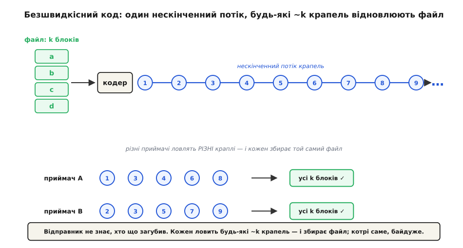
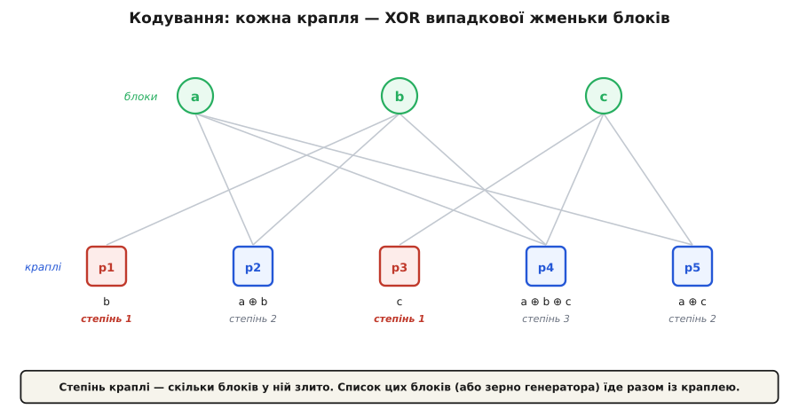
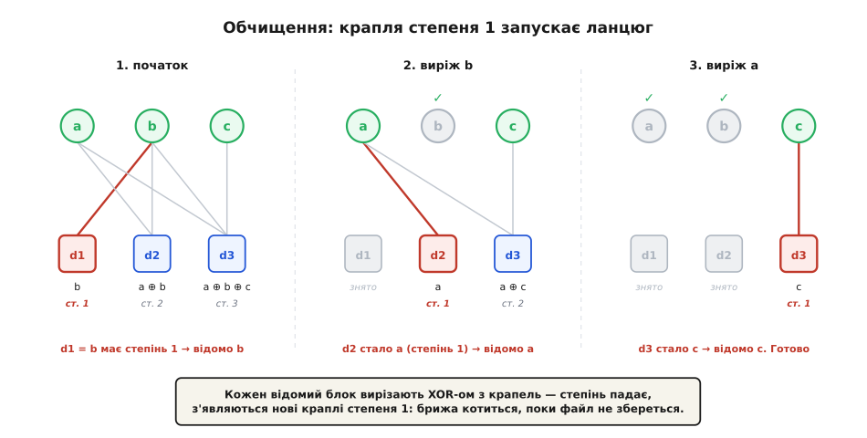

# Фонтанні коди

<preknowlist>
- [Канал зі стиранням](topic:communications/erasure-channel) — модель, де пакет або доходить неушкодженим, або зникає цілком, а що загубилось — видно за пропущеними номерами.
- [Біт парності](topic:communications/parity-bit) — операція XOR (⊕) над групою бітів і її головна для нас властивість: a ⊕ a = 0, тобто повторний XOR прибирає доданок.
</preknowlist>

Уявіть, що той самий великий файл — оновлення прошивки, відеопотік на цілий стадіон — треба роздати водночас тисячам одержувачів через ненадійні канали. Кожен губить свій випадковий набір пакетів: у когось зникли п'ятий і сотий, у сусіда — десятий і двохсотий. Два звичні способи впоратися саме тут ламаються.

Перший спосіб — [перепитати](topic:communications/arq): одержувач помічає пропажу й просить надіслати пакет ще раз. Для одного каналу це чудово працює, для тисяч — ні. Відправник тоне в потоці різних запитів (кожному бракує свого), а один повільний одержувач тримає решту. Другий спосіб — наперед підмішати надлишок, як у [Ріда — Соломона](topic:communications/reed-solomon): з k пакетів роблять n > k так, щоб будь-які k із n відновили все. Але n доводиться зафіксувати заздалегідь, під найгіршу очікувану втрату. Візьмеш замало — хтось усе одно не збереться; забагато — усі платять зайвою смугою. А справжня частка втрат часто невідома й гуляє в часі.

Хочеться коду, якому байдуже, хто що загубив: відправник просто ллє потік закодованих пакетів, а кожен одержувач ловить те, що долетіло, поки не набере «досить», і тоді спиняється. Це і є фонтан (англ. fountain): підставте кухоль — і не важливо, котрі саме краплі впіймали, важливо лише набрати повний. Такий код звуть ще безшвидкісним (rateless): у нього немає наперед заданої швидкості k/n — потік потенційно нескінченний, і відправник обриває його тоді, коли забажає.

Обіцянка точна: з k вихідних пакетів код породжує необмежену низку закодованих, і будь-яка їх підбірка розміром трохи більше за k відновлює всі k початкових. Котрі саме пакети дійшли — не має значення.


*Відправник не знає, хто що загубив. Кожен приймач ловить будь-які ~k крапель і збирає файл; які саме краплі впіймано — байдуже.*

## Як може годитися будь-яка підбірка

Секрет — у тому, як кодують. Кожна вихідна крапля — це XOR (⊕) випадково вибраної жменьки початкових блоків: інколи одного, інколи двох, інколи п'яти. Скільки блоків злито в краплю, звуть її степенем (degree). Разом із краплею їде й позначка, котрі номери в ній перемішані, — насправді досить одного зерна для генератора випадкових чисел, і приймач відтворить рівно той самий вибір.


*Степінь краплі — це скільки блоків у ній злито. Сам список цих блоків (або зерно генератора) подорожує разом із краплею, тож приймач завжди знає, що саме він упіймав.*

Відновлення — це розплутування XOR-ів, крок за кроком. Ключ дає крапля степеня 1: вона дорівнює рівно одному вихідному блокові, тобто цей блок уже відомий. Тепер візьмімо відомий блок і виріжмо його з кожної іншої краплі, що його містила: оскільки a ⊕ a = 0, повторний XOR прибирає доданок, і степінь тієї краплі падає на одиницю. Деякі краплі від цього самі стають степеня 1 — і відкривають нові блоки. Ланцюг котиться далі, поки не зберуться всі k. Цей спосіб декодування звуть обчищенням (peeling): відомі блоки знімаємо один за одним, як шкірку.

**Приклад: три краплі відновлюють три блоки.** Хай файл — це блоки a, b, c, а приймач упіймав такі три краплі:

```
d1 = b            (степінь 1)
d2 = a ⊕ b        (степінь 2)
d3 = a ⊕ b ⊕ c    (степінь 3)

крок 1:  d1 = b  — степінь 1  →  відомо b
крок 2:  виріж b:
           d2 = (a⊕b) ⊕ b = a          (степінь 1)  →  відомо a
           d3 = (a⊕b⊕c) ⊕ b = a⊕c      (степінь 2)
крок 3:  виріж a:
           d3 = (a⊕c) ⊕ a = c          (степінь 1)  →  відомо c

зібрано: a, b, c
```

Одна крапля степеня 1 запустила ланцюг, що по черзі оголив усі три блоки.


*Кожен відомий блок вирізають XOR-ом з інших крапель — їхній степінь падає, і з'являються нові краплі степеня 1. Так «брижа» готових крапель котиться, поки файл не збереться.*

У цьому щасливому прикладі вистачило рівно k = 3 крапель. Загалом же потрібно трохи більше: випадкові краплі часом повторюють ту саму інформацію (дають те саме рівняння), і такі дублікати даремні. Скільки саме крапель понад k знадобиться — залежить від того, наскільки вдало вибирають степені.

## Серце фонтана — розподіл степенів

Уся витівка стоїть або падає на тому, як вибирати степені. Нехай крапель високого степеня забагато — і на якомусь кроці не лишиться жодної степеня 1, обчищення застрягне. Нехай степеня 1 забагато — і до котрогось блоку жодна крапля не дотягнеться, а решта лише повторюватимуть уже відоме. Потрібен розподіл, який тримає рівно приблизно одну краплю степеня 1 напоготові на кожному кроці: тонку брижу, що не пересихає й не переливається.

Такий розподіл знайшов [Майкл Лубі](topic:communications/fountain-codes/hist-digital-fountain.md) — його називають солітонним (від англ. solitary — відокремлена, самотня хвиля), бо брижа готових крапель тримає майже сталу висоту протягом усього декодування, як солітонна хвиля тримає форму. Ідеальний солітонний розподіл красивий на папері, але надто крихкий; його підправлена, «робастна» версія дає зібрати файл із k(1+ε) крапель, де надлишок ε тане зі зростанням k. Точні формули цих розподілів і чому саме така форма — [у математичній вкладці](topic:communications/fountain-codes/math-soliton-distribution.md).

> 🔧 **Навіщо це.** Фонтанний код — це надійна масова роздача без зворотного зв'язку. Один відправник обслуговує будь-яку кількість одержувачів із будь-якими візерунками втрат: мобільне мовлення файлів (3GPP MBMS), багатоадресна й супутникова розсилка (IETF FLUTE), доставка оновлень. Ніхто нічого не перепитує, ніхто не підганяє надлишок під канал — відправник просто ллє, доки останній одержувач не набере свій кухоль. І та сама схема лагодить «дірявий» потік: втрачені пакети не переслати, зате з надлишкових крапель одержувач добудовує все, що недоотримав.

## Дві родини й ціна

На чистому солітонному XOR стоять LT-коди (Luby Transform, [Майкл Лубі](topic:communications/fountain-codes/hist-digital-fountain.md), 2002) — перші практичні фонтанні коди. Їхня вада — ціна декодування росте як k·ln k, а надлишок спадає повільно. Наступний крок — раптор-коди (Raptor, Амін Шокроллагі): перед LT-шаром додають легкий зовнішній код, споріднений із [LDPC](topic:communications/ldpc), і завдяки йому обчищення стає лінійним за часом, а надлишок падає до кількох відсотків (у стандартизованому різновиді RaptorQ, специфікація IETF RFC 6330, — практично до нуля). Повний робочий кодек — енкодер і декодер-обчищення — у [короткій реалізації](topic:communications/fountain-codes/proj-lt-codec.md).

Задарма й тут не буває, і межі варто знати наперед. Надлишок ε нікуди не дівається: щоб декодування майже напевно вдалося, треба зловити трохи більше за k крапель. Приймач мусить знати, котрі блоки злиті в кожну краплю, — звідси зерно чи список індексів у заголовку. Фонтан живе на [каналі зі стиранням](topic:communications/erasure-channel), де пакет або цілий, або відсутній; проти спотворення бітів усередині пакета він безсилий, тому кожну краплю супроводжують контрольною сумою, а побиту краплю просто вважають загубленою. І зібрати файл можна, лише набравши ~k крапель, — для крихітних керівних повідомлень фонтан недоречний, там виграють короткі коди.

Фонтанний код перетворює надійність із перемовин «що саме переслати» на просте «лий далі»: клопіт відправника зникає, а єдина робота одержувача — впіймати досить крапель.
