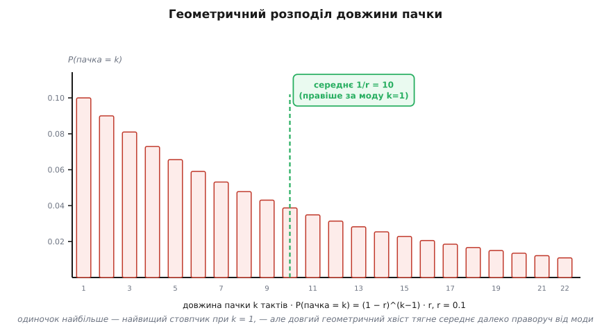

# 🧮 Статистика липкого каналу: звідки беруться формули — і як виміряти їх назад

<preknowlist>
- [Ланцюги Маркова](book:math/markov-chain) — стани, матриця переходів, властивість «без пам'яті» й що таке стаціонарний розподіл: усе, що тут рахуємо, — це статистика саме такого ланцюга.
- [Середнє й дисперсія](book:math/mean-variance) — сподіване значення, дисперсія й коваріація: ними міряємо і довжину пачки, і те, наскільки помилки тримаються купи.
</preknowlist>

Тіло теми виклало чотири формули майже як факти з неба: частка поганого часу π_B = p/(p+r), середня пачка ≈ 1/r, чиста ділянка ≈ 1/p, середній рівень помилок ⟨BER⟩ = π_G·e_G + π_B·e_B. Кожна з них — правда, але правда недоведена. Звідки береться саме p/(p+r), а не, скажімо, p/r чи √(p·r)? Чому пачка виходить рівно 1/r, а не 1/(p+r)? І — найцікавіше — коли ми стоїмо з іншого боку, з логом виміряних помилок у руках, як витягти ці чотири числа назад?

Вставка робить обидва ходи. Спершу **прямий**: із самого означення двостанового ланцюга виводимо кожну величину так, щоб було видно, чому вона неминуча. Потім те, чого в тілі теми не було зовсім, — **кореляцію** помилок у часі, бо саме вона, а не середній рівень, є математичним підписом пачки. І нарешті **зворотний** хід: із виміряного потоку помилок оцінюємо самі p, r, e_G, e_B.

## Рівновага: звідки p/(p+r)

Стаціонарний розподіл — це частки часу π_G, π_B, які канал у сталому режимі проводить у кожному стані. «Сталий» означає одне: розподіл більше не змінюється від такту до такту. Запишімо цю умову буквально. За один такт частка поганого стану π_B поповнюється тими, хто щойно впав з доброго (їх π_G, і кожен зривається з шансом p), і худне на тих, хто вилікувався (їх π_B, кожен виходить із шансом r):

```
π_B(наступний такт) = π_B − π_B·r + π_G·p
```

Стаціонарність — це коли ліва частина знову дорівнює π_B, тобто приплив точно врівноважує відплив:

```
π_G·p = π_B·r        ← рівняння балансу
```

Читається як закон збереження: потік G→B (скільки за такт перетікає з доброго стану в поганий) дорівнює зустрічному потоку B→G. Інакше один зі станів невпинно набирав би вагу, і розподіл не був би сталим. Додаймо єдине, що ще лишилось, — частки мусять давати в сумі одиницю:

```
π_G + π_B = 1
```

Дві прості рівності, дві невідомі. З балансу π_G = π_B·(r/p); підставляємо в суму: π_B·(r/p) + π_B = 1, тобто π_B·(p+r)/p = 1. Звідси:

```
π_B = p/(p+r)        π_G = r/(p+r)
```

Ось і множник, що спантеличував. У чисельнику π_B стоїть p — бо саме p заганяє канал у поганий стан; у знаменнику p+r — повний «оборот» ланцюга. Симетрично π_G несе r. Зверніть увагу на позірну дивовижу: частка поганого часу росте з p (легше зіпсуватись — частіше поганий) і **падає** з r (легше вилікуватись — рідше поганий), хоча r — параметр «поганого» стану. Обернена залежність від власного темпу виходу не випадкова, і зараз стане видно чому.

**Той самий результат — із циклу.** Є другий шлях до π_B, який заразом пояснює й формулу пачки. Уявімо довгий пробіг каналу як чергу циклів: добра смуга, поганий згусток, знову добра смуга, знову згусток. Скільки в середньому триває добра смуга? Сидячи в G, канал щотакту з шансом p зривається; отже, зриву доводиться чекати в середньому 1/p тактів (зараз доведемо це строго). Так само поганий згусток триває в середньому 1/r тактів. Один повний цикл — це (1/p + 1/r) тактів, з яких погана частина займає 1/r. Частка поганого часу — просто відношення:

```
π_B = (1/r) / (1/p + 1/r) = p/(p+r)
```

— те саме число, але тепер видно його нутро: частка часу в стані є відношення **середньої тривалості** цього стану до тривалості повного циклу. Ось чому π_B обернено залежить від r: більший r коротшає кожен згусток, і поганого часу набігає менше.

## Чому тривалість стану геометрична

Тепер борг: доведімо, що середня пачка — рівно 1/r, і заразом розберімо, яка вона на вигляд, бо «в середньому 10» приховує чимало.

Ключ — у словах «без пам'яті». Опинившись у поганому стані, канал щотакту кидає ту саму монету: вийти (з шансом r) чи лишитися (з шансом 1−r), **байдуже, скільки він тут уже сидить**. Стан не веде лічби, не «втомлюється» — прожите не важить. Тоді ймовірність, що згусток триватиме рівно k тактів, — це k−1 разів поспіль «лишитися» й один раз «вийти»:

```
P(пачка = k) = (1−r)ᵏ⁻¹ · r,     k = 1, 2, 3, …
```

Це **геометричний розподіл** — точний дискретний родич експоненційного згасання. Його форма красномовна: найімовірніша тривалість — k = 1 (найвищий стовпчик — короткі згустки в один біт), а далі ймовірність спадає в (1−r) разів на кожен наступний такт. Тобто одиночок найбільше, але є довгий хвіст рідких довгих згустків, і саме він тягне середнє вгору.


*Геометрична тривалість пачки: одиночок найбільше, але довгий хвіст тягне середнє (1/r = 10) далеко праворуч від моди (k = 1). Чиста ділянка має ту саму форму, лише розтягнуту до середнього 1/p.*

Порахуймо середнє — і зробімо це так, щоб побачити, звідки береться 1/r, а не просто взяти готове. Хитрість — та сама відсутність пам'яті. Позначмо шукане середнє L. Перший же такт у стані або одразу випускає канал (шанс r — тоді пачка завдовжки 1), або лишає (шанс 1−r — і тоді, за браком пам'яті, попереду **знову в середньому L** тактів, доданих до вже прожитого одного):

```
L = r·1 + (1−r)·(1 + L)
```

Розкриваємо: L = r + (1−r) + (1−r)·L = 1 + (1−r)·L. Переносимо: L − (1−r)·L = 1, тобто L·r = 1. Отже:

```
L = 1/r        (а для доброго стану, тим самим міркуванням, 1/p)
```

Красиво, що середнє випало з одного рядка, — і випало саме тому, що канал безпам'ятний: якби він пам'ятав вік згустку, рекурсія «попереду знову L» не спрацювала б, і тривалість не була б геометричною. Ця безпам'ятність — не дрібна технічна деталь, а те єдине припущення, з якого росте вся проста арифметика моделі. Складніші, напівмарковські моделі саме його й відпускають, дозволяючи тривалості будь-який розподіл, — але платять втратою цих формул у рядок.

Насамкінець — про розкид. Дисперсія геометричного розподілу дорівнює (1−r)/r². При малому r це ≈ 1/r², тобто **стандартне відхилення ≈ 1/r** — того самого порядку, що й саме середнє. Звідси практичний висновок: пачки дуже нерівні. Канал із «середньою пачкою 10» раз у раз видає і одиночки, і згустки по 30–40 бітів — не тому, що модель погана, а тому, що геометричний хвіст саме такий. Проєктуючи захист, орієнтуватися лише на середнє небезпечно: закладатися треба на хвіст.

## Середній рівень — і чому він сліпий

Це найлегша з чотирьох формул, але варто побачити, звідки вона й **що саме викидає**. Питаємо: яка ймовірність, що навмання взятий біт зіпсуто? Біт міг постраждати двома шляхами — або канал був добрий і все-таки схибив (шанс π_G, потім e_G), або був поганий і схибив (π_B, потім e_B). Шляхи взаємно виключні, тож просто складаємо (формула повної ймовірності):

```
⟨BER⟩ = π_G·e_G + π_B·e_B
```

Зважене середнє двох рівнів помилки, де ваги — частки часу. Для каналу за Гілбертом (e_G = 0, e_B = 0.4, p = 0.001, r = 0.1) це π_B·e_B = 0.0099·0.4 ≈ 4·10⁻³.

А тепер головне: ⟨BER⟩ — **гранична** (одноточкова) ймовірність, статистика **одного** біта, вирваного з ряду. Вона нічого не знає про сусідів. Той самий ⟨BER⟩ = 4·10⁻³ дасть і рівномірний канал, де кожен біт незалежно псується з шансом 0.004, і наш пачковий. Одноточкова статистика фізично не здатна їх розрізнити — щоб побачити злипання, треба дивитися на біти **парами**, на спільну статистику. Саме туди й веде наступний крок.

## Кореляція: справжній підпис пачки

Позначмо потік помилок індикаторами: E_n = 1, якщо n-й біт зіпсуто, і 0, якщо цілий. Це двійковий часовий ряд, і питання «чи злипаються помилки» — буквально питання, чи **корелюють** E_n на різних n.

Для каналу без пам'яті — [двійкового симетричного](book:communications/binary-symmetric-channel) — відповідь нульова за означенням: біти псуються незалежно, тож E_n і E_{n+k} за будь-якого k ≥ 1 нескорельовані, коваріація рівно нуль. Пласка порожнеча. Уся інформація там сидить в одному числі ⟨BER⟩, і статистика пар не додає нічого. Побачимо, як інакше поводиться пачковий канал.

Нам потрібна коваріація Cov(E_n, E_{n+k}) = E[E_n·E_{n+k}] − ⟨BER⟩². Тут стає в пригоді точний трюк. Помилка E_n народжується у два кроки: спершу природа обирає стан S_n (G чи B), потім кидає монету помилки з відповідним рівнем e. **Монети помилок незалежні** між тактами; уся пам'ять сидить не в них, а в станах S_n, що тягнуться ланцюгом. Тому за k ≥ 1 коваріація помилок дорівнює коваріації самих **рівнів** помилки за станами:

```
Cov(E_n, E_{n+k}) = Cov(e_{S_n}, e_{S_{n+k}}),     k ≥ 1
```

Монетний шум додає розкид лише в тому самому такті, тобто тільки при k = 0; на різних тактах він незалежний і в коваріацію не входить. Отже вся кореляція помилок — це успадкована кореляція **станів**. Лишилось порахувати, як корелюють стани через k тактів.

Тут працює [спектр матриці переходів](book:math/eigenvalues). Матриця двостанового ланцюга

```
P = | 1−p    p  |
    |  r    1−r |
```

має два власні значення. Одне завжди дорівнює 1 (йому відповідає стаціонарний розподіл — те, що лишається незмінним під дією P). Друге дістаємо зі сліду (сума власних значень дорівнює сумі діагоналі): 1 + λ = (1−p) + (1−r), звідки

```
λ = 1 − p − r
```

Це число керує **пам'яттю** ланцюга. Будь-яке відхилення від рівноваги згасає множенням на λ за кожен такт: через k тактів початкова визначеність стану стерта в λᵏ разів. Саме тому коваріація станів (а з нею й помилок) спадає геометрично:

```
Cov(e_{S_n}, e_{S_{n+k}}) = π_G·π_B·(e_B − e_G)²·λᵏ
```

Розберімо цей вираз по частинах, бо кожна має ясний сенс. Множник π_G·π_B·(e_B − e_G)² — це просто **дисперсія** рівня помилки в сталому режимі: величина e_{S} стрибає між e_G і e_B, і її розкид тим більший, чим далі рознесені два рівні (e_B − e_G) і чим рівніше поділено час (π_G·π_B найбільше при π_G = π_B). Якби e_G = e_B, розкиду не було б — і жодної кореляції, бо стан перестав би впливати на помилку. А множник λᵏ — це згасання пам'яті: свіжа кореляція (k = 1) сильна, далі тане.

Знормуймо на дисперсію самого індикатора (Var(E_n) = ⟨BER⟩·(1 − ⟨BER⟩), як у будь-якої монети Бернуллі), щоб дістати безрозмірний коефіцієнт автокореляції:

```
ρ(k) = [ π_G·π_B·(e_B − e_G)²·λᵏ ] / [ ⟨BER⟩·(1 − ⟨BER⟩) ],     k ≥ 1
```

Це і є **підпис пачки**. Одне число — ⟨BER⟩ — обидва канали дають однакове; але функція ρ(k) розрізняє їх умить: у каналу без пам'яті вона тотожний нуль, у пачкового — додатна крива, що згасає геометрично з темпом λ.


*Той самий ⟨BER⟩ — та сама одиниця при k = 0. Але за парами видно все: пачковий канал тримає додатну кореляцію, що згасає за темпом λ, а незалежний обвалюється в нуль одразу. Ось де ховається злипання.*

Числом, для нашого каналу за Гілбертом (λ = 1 − 0.101 = 0.899): чисельник при k = 1 дорівнює 0.990·0.0099·0.4²·0.899 ≈ 1.41·10⁻³, знаменник ⟨BER⟩·(1 − ⟨BER⟩) ≈ 0.00396·0.996 ≈ 3.94·10⁻³, тож ρ(1) ≈ 0.36. Знання, що біт зіпсуто, помітно піднімає шанси, що й сусідній зіпсутий, — рівно те, чого немає в незалежному каналі. При k = 0 коефіцієнт стрибком дорівнює 1 (біт ідеально корелює сам із собою); падіння від 1 до ρ(1) — це якраз частка розкиду, що припадає на монетний шум усередині стану, а не на перемикання станів. Далі кореляція тане в 0.899 разів на біт; вона падає в e разів приблизно за 1/(1−λ) = 1/(p+r) ≈ 10 бітів. Ця величина — **час кореляції** каналу, довжина його пам'яті — не випадково збігається з довжиною пачки: у каналі, де добрий стан майже завжди (p ≪ r), пам'ять живе рівно стільки, скільки триває згусток.

## Зворотний хід: виміряти чотири числа

Досі ми йшли від параметрів до статистик. Інженер зазвичай стоїть з іншого боку: є довгий записаний потік помилок з реального каналу — послідовність нулів і одиниць E_n, — а чотири числа p, r, e_G, e_B невідомі. Як їх дістати?

Стан **не спостерігається**. Ми бачимо лише помилки, а не ярлик «добрий/поганий» — той захований усередині каналу. Це і є вся складність: якби над кожним бітом світилася лампочка G чи B, параметри читалися б прямо (порахуй частки станів і частки помилок у кожному). Прихованість змушує викручуватися.

**Спосіб перший — узгодження моментів.** Логіка проста, як важіль. Ми щойно вивели формули, що виражають вимірні статистики через параметри. Перевернімо їх: виміряймо ці статистики на записі, прирівняймо до формул і розв'яжімо відносно параметрів. Скільки невідомих — стільки незалежних статистик і треба.

Що легко виміряти з потоку E_n:

```
μ̂    = (число помилок) / N                       → оцінка ⟨BER⟩
ĉ(k) = усереднене (E_n − μ̂)·(E_{n+k} − μ̂)         → оцінка коваріації на лагу k
```

Перше дає рівень, друге — ту саму автокореляцію, що ми вивели. З двох лагів одразу випадає λ, бо коваріація геометрична: відношення сусідніх лагів чистить усе зайве й лишає темп згасання:

```
λ̂ = ĉ(2) / ĉ(1)          ⟹   p + r = 1 − λ̂
```

Надійніше — узяти нахил прямої, підігнавши ln ĉ(k) по кількох перших лагах; точки мають лягти в пряму — і якщо не лягають, це вже сигнал, що двох станів мало.

Тепер розберімо найчистіший випадок — модель Гілберта, де добрий стан бездоганний (e_G = 0). Невідомих троє: p, r, e_B. Маємо три вимірні числа — μ̂, ĉ(1), λ̂ — і три формули. При e_G = 0 вони спрощуються (усі помилки — тільки з поганого стану):

```
⟨BER⟩ = π_B·e_B
c(1)  = π_G·π_B·e_B²·λ
```

Поділивши c(1) на квадрат μ, магічно скорочуємо обидва невідомі e_B, і лишається чисте відношення часток:

```
c(1) / (⟨BER⟩²·λ) = π_G/π_B = r/p
```

Отут і ховалась потрібна третя звістка: **відношення доброго часу до поганого**, r/p, читається прямо з автокореляції. Позначмо його ϱ = ĉ(1)/(μ̂²·λ̂). Разом із сумою s = p + r = 1 − λ̂ воно замикає систему:

```
π_B = 1/(1+ϱ)         π_G = ϱ/(1+ϱ)
p   = s·π_B            r   = s·π_G
e_B = μ̂ / π_B = μ̂·(1+ϱ)
```

**Перевірмо на нашому каналі.** Візьмімо «виміряні» точні значення μ = 3.96·10⁻³, c(1) = 1.41·10⁻³, λ = 0.899 і прокрутімо назад:

```
ϱ = c(1) / (μ²·λ)
  = 1.41·10⁻³ / ( (3.96·10⁻³)² · 0.899 )
  = 1.41·10⁻³ / ( 1.57·10⁻⁵ · 0.899 )
  = 1.41·10⁻³ / 1.41·10⁻⁵
  = 100

s   = 1 − λ = 0.101
π_B = 1/101   = 0.0099          π_G = 100/101 = 0.9901
p   = 0.101/101 = 0.001         r   = 0.101 − 0.001 = 0.100
e_B = μ·(1+ϱ) = 3.96·10⁻³·101 ≈ 0.400
```

Точно ті p = 0.001, r = 0.1, e_B = 0.4, з яких ми стартували, — коло замкнулося. Три статистики потоку помилок віддали три параметри каналу, ні на йоту не заглянувши всередину, у прихований стан.

**Ґеп-статистика — те саме іншими очима.** Едгар Гілберт (1960), працюючи з реальними телефонними лініями, міряв не автокореляцію, а розподіл **проміжків** — скільки цілих бітів лягає між двома сусідніми помилками. При e_G = 0 цей розподіл має чітку структуру: він змішує геометрію доброго стану (довгі проміжки) з коротшими всередині пачок, і його перші моменти — частка нульового проміжку (дві помилки поспіль), середній проміжок — несуть рівно ту саму інформацію, що й μ та c(1). Прирівняв виміряні моменти до модельних — дістав ті самі p, r, e_B. Вибір, яку статистику брати (автокореляцію чи ґепи), — питання зручності й того, яка стабільніша на наявному об'ємі даних.

**Де моменти пасують.** Повернімо e_G > 0 — і чиста трійка формул розсипається. Невідомих знову чотири, а μ та автокореляція дають лише μ, λ (тобто p + r) і амплітуду π_G·π_B·(e_B − e_G)² — три звістки на чотири невідомі. Розділити окремо p і r, окремо e_G і e_B моменти першого й другого порядку вже не можуть; треба лізти в **моменти вищого порядку** (потрійні добутки E_n·E_{n+1}·E_{n+2} тощо), а вони на скінченному записі оцінюються кепсько — мала похибка вимірювання роздуває оцінку параметрів. Через це узгодження моментів для повної чотирипараметричної моделі буває хистким.

**Спосіб другий — максимум правдоподібності через приховану модель.** Принциповіша відповідь — не вихоплювати кілька моментів, а спитати: за яких p, r, e_G, e_B **весь** записаний потік помилок найімовірніший? Це метод максимальної правдоподібності, і для прихованого ланцюга його реалізує алгоритм **Баума–Велча** (Леонард Баум і Ллойд Велч, кінець 1960-х; згодом усвідомлений як окремий випадок ширшого EM-методу, expectation–maximization). Ідея кругова, але збіжна: спершу з поточної здогадки параметрів рахуємо для кожного біта **апостеріорну** ймовірність, що канал тоді був поганим (це роблять «прямим–зворотним» проходом по всьому запису); потім переоцінюємо p, r, e_G, e_B так, наче ці м'які ярлики станів — справжні дані; повторюємо, аж поки правдоподібність не перестане рости.

Баум–Велч використовує **всю** інформацію послідовності, а не жменю моментів, тож дає оцінки з меншим розкидом і на коротших записах — і, головне, тягне повну чотирипараметричну модель, де моменти пасують. Плата — обчислення й ітерації. На практиці два способи дружать: узгодження моментів дає швидку оцінку в замкненій формі, з якої Баум–Велч стартує й доводить до максимуму правдоподібності.

> 🔧 **Навіщо це.** Уся ця арифметика — міст між виміряним і спроєктованим. З одного боку моста лежить сирий лог помилок з прототипу радіо чи носія — довга стрічка нулів і одиниць. Три-чотири рядки статистики (рівень помилок і як швидко згасає їхня автокореляція) перетворюють цю стрічку на чотири числа генератора каналу. А з тих чисел уже прямо рахується середня пачка 1/r, під яку добирають глибину перемішування й силу коду. Автокореляція заразом і **судить**, чи взагалі годиться двостанова модель: якщо ln ĉ(k) лягає в одну пряму — маємо єдиний темп згасання λ, і Гілберт–Елліот пасує; якщо ламається на кілька нахилів — у каналі більше однієї «поганої вдачі», і час брати модель із більшим числом станів. Тобто ці формули не лише описують канал — вони й перевіряють, чи ми взяли для нього правильну модель.
