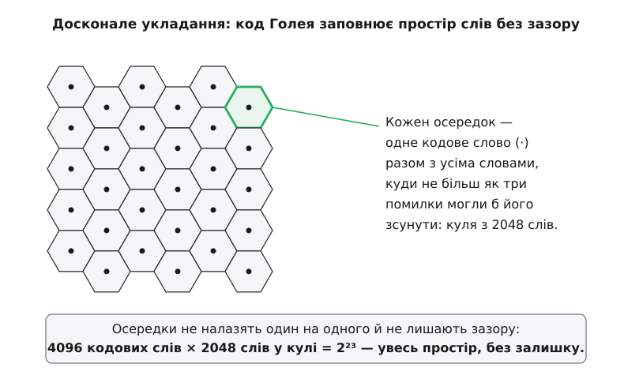

# Коди Голея

<preknowlist>
- [Відстань Геммінга](book:communications/hamming-distance) — скільки позицій різнять два слова; мінімальна відстань коду вирішує, скільки помилок він виправляє.
- [Лінійні блокові коди](book:communications/linear-block-codes) — k бітів даних доповнюють надлишком до n-бітового слова; звідки береться запис [n, k, d].
- [Досконалі коди](book:communications/perfect-codes) — код, що ділить увесь простір слів на однакові кулі без зазору й без перекриття; межа пакування куль.
- [Біт парності](book:communications/parity-bit) — одна перевірка, що робить число одиниць у слові парним.
</preknowlist>

Виправлення помилок завжди коштує надлишку: щоб приймач сам полагодив зіпсоване, у слово домішують більше бітів, ніж несе саме повідомлення. Тоді напрошується скупе питання — а наскільки мало цього надлишку можна обійтися? Скажімо, ми хочемо виправляти будь-які три перевернуті біти на блок. Який найкоротший блок це дозволить?

Відповідь диктує проста лічба. Навколо кожного кодового слова треба подумки відгородити всі слова, у які канал міг би його перетворити трьома чи меншою кількістю помилок, — усі, що лежать від нього на [відстані Геммінга](book:communications/hamming-distance) не далі за три. Це «куля» радіуса три. Кулі різних кодових слів не мають перекриватися: якби якесь прийняте слово потрапило одразу у дві, приймач не знав би, котре з двох повідомлень лагодити. Отже, всі кулі мусять уміститися в простір усіх слів, не налазячи одна на одну, — а це відразу обмежує, скільки різних повідомлень узагалі можна закодувати.

Найкращий мислимий код не лишив би між кулями ані шпарини: кожне прийняте слово належало б рівно одній кулі, тобто вказувало б на єдине найближче кодове слово. Такий код-без-зазору звуть [досконалим](book:communications/perfect-codes), і в природі їх майже немає — параметри мусять збігтися до останньої одиниці, а таке трапляється винятково рідко.

Двійковий код Голея — саме така рідкість. Він бере 12 бітів даних, доповнює їх 11 перевірними до 23-бітового слова й виправляє будь-які три помилки — коротше вже не можна, бо він заповнює простір слів без жодного зазору. У стислому записі [лінійних кодів](book:communications/linear-block-codes) це **[23, 12, 7]**: довжина 23, дванадцять бітів даних, а мінімальна відстань між словами — сім. Саме сімка й дає три виправлені помилки: між двома правильними словами стоїть стіна завтовшки сім кроків, тож навіть зсунувшись на три, ти лишаєшся ближче до свого, ніж до чужого.

Що ця рідкість означає насправді, видно, коли перелічити кулю не абстрактно, а до одиниці.

**Скільки слів «накриває» одне кодове слово Голея.**

```
довжина слова      n = 23   →   усього 2²³ = 8 388 608 двійкових слів

куля радіуса 3 навколо кодового слова:
  саме кодове слово (0 помилок)        C(23,0) =    1
  одна помилка                         C(23,1) =   23
  дві помилки                          C(23,2) =  253
  три помилки                          C(23,3) = 1771
                                        разом      2048 = 2¹¹

кодових слів                                       2¹² = 4096

2¹² куль × 2¹¹ слів у кулі  =  2²³  =  усі слова, без залишку
```

Числа сходяться до останнього слова: 4096 куль, у кожній по 2048 слів, укладають рівно 8 388 608 — увесь простір. Жодне прийняте слово не «нічийне»: кожне лежить у кулі одного-єдиного кодового слова, і приймач завжди знає, куди його округлити. Ось що таке досконалість на дотик — не гарне слово, а арифметика без решти.


*Досконале укладання, схематично (справжній простір слів — 23-вимірний). Кожен осередок — одне кодове слово (крапка в центрі) разом з усіма 2047 словами, у які його могли б перетворити не більш як три помилки. Осередки не перекриваються — інакше приймач не знав би, що лагодити, — і не лишають зазору: 4096 осередків по 2048 слів дають рівно 2²³, весь простір.*

## Розширений код: один біт на рівновагу

На практиці частіше беруть не сам [23, 12, 7], а його трохи підрослого брата. Додаймо до 23-бітового слова ще один [біт парності](book:communications/parity-bit) — один-єдиний, що робить загальне число одиниць парним. Довжина стає 24, а мінімальна відстань підскакує з семи до восьми: **[24, 12, 8]**. Ця добавка коштує один біт, а дає дві зручності. По-перше, слово тепер ділиться рівно навпіл — дванадцять бітів даних, дванадцять перевірних; половина корисного, половина захисту, простіше не буває. По-друге, парна відстань вісім означає, що код і далі виправляє будь-які три помилки, а на додачу **виявляє** чотири: коли помилок саме чотири, він не полагодить їх хибно, а чесно підніме руку — «блок зіпсовано».

Саме цей рівний [24, 12, 8] полетів у далекий космос. Апарати «Вояджер-1» і «Вояджер-2», проминаючи Юпітер і Сатурн у 1979–1981 роках, кодували ним свої знімки — і перші кольорові портрети цих планет дійшли до Землі під захистом коду Голея. Пізніше, вже дорогою до Урана й Нептуна, апарати перепрограмували на потужніший каскад із [кодом Рід–Соломона](book:communications/reed-solomon), але великі планети людство вперше побачило зблизька крізь Голеїв код. Той самий [24, 12, 8] і досі прописаний у військових стандартах короткохвильового радіо для встановлення звʼязку.

> 🔧 **Навіщо це.** Досконалість — не естетика, а економія. Коли кожен переданий біт коштує дорого — енергії передавача за мільярди кілометрів, місця в крихітному керувальному пакеті, ефіру в завантаженому каналі, — хочеться вичавити максимум виправлення з мінімуму надлишку. Досконалий код робить саме це: він не марнує жодного прийнятого слова, тобто дає найбільший можливий захист на вкладені перевірні біти. Там, де надлишок дешевий, беруть коди простіші й гнучкіші; там, де за кожен біт платять, тісний код на кшталт Голеєвого вартий своєї складності.

## Не один з багатьох, а єдиний

Коди Голея вирізняються навіть серед досконалих. Двійковий [23, 12, 7] — не «один із багатьох» кодів зі своїми параметрами, а [єдиний такий об'єкт](book:communications/perfect-codes) з точністю до перенумерування позицій: іншого коду з цими числами просто немає. Через таку жорсткість він виявляється вузлом, де сходяться напрочуд далекі речі — виняткові симетрії й найщільніші відомі укладки куль у багатовимірному просторі, — та це вже окрема велика математика, дотична до звʼязку лише краєм.

Є в Голея й трійковий родич — код **[11, 6, 5]** над трьома символами, що виправляє дві помилки й теж досконалий. У друці він навіть старший: [ту саму систему](book:communications/perfect-codes/hist-golay-codes.md) за півтора року до Голея надрукував фінський гравець у футбольному тоталізаторі, де кожен матч має три наслідки (виграш, нічия, програш) — і склав досконалий код, сам того не знаючи. А обидва двійкові коди Марсель Голей умістив 1949 року на неповній сторінці, яку відтоді звуть найкращою окремою сторінкою за всю історію теорії кодування.

![Три коди Голея: двійковий [23,12,7], розширений [24,12,8] і трійковий [11,6,5] — параметри, що кожен виправляє і які з них досконалі](/book/communications/coding-theory/golay-code/img/golay-family.svg)
*Родина Голея. Двійковий [23, 12, 7] і трійковий [11, 6, 5] — досконалі: їхні кулі укладають простір без залишку (2¹²·2¹¹ = 2²³ і 3⁶·3⁵ = 3¹¹). Розширений [24, 12, 8] сам уже не досконалий, зате рівно збалансований — половина даних, половина захисту — і саме він захищав знімки «Вояджерів».*

Як зіткати таку матрицю з дванадцяти твірних рядків, щоб усі 4096 слів відстояли одне від одного рівно на сім, — [окрема побудова](book:communications/golay-code/math-golay-construction.md): її вивели і через квадратичні лишки за модулем 23, і через геометрію ікосаедра, і кількома іншими шляхами, що дивовижним чином дають той самий код. А [як кодувати й декодувати](book:communications/golay-code/proj-golay-codec.md) розширений [24, 12, 8] у робочому коді — швидко, через синдром і таблицю — то вже інженерна робота, де важать окремі біти й такти.

Коди Голея — це те місце, де скупа інженерна вимога «полагодь три помилки якнайкоротшим словом» і чиста математика впираються в один і той самий рідкісний об'єкт. Тому їх і знайшли двічі з різних боків, і тому вони злітали до Юпітера: досконалий код не можна поліпшити — його можна тільки знайти, а в природі їх лічені одиниці.
