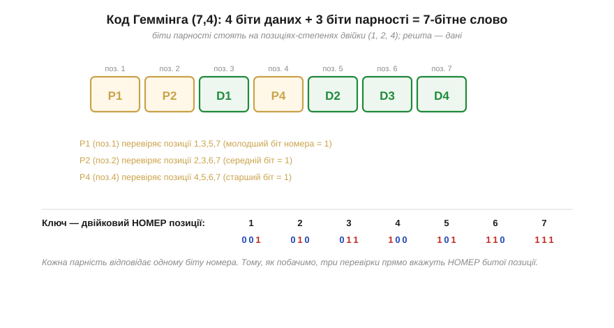
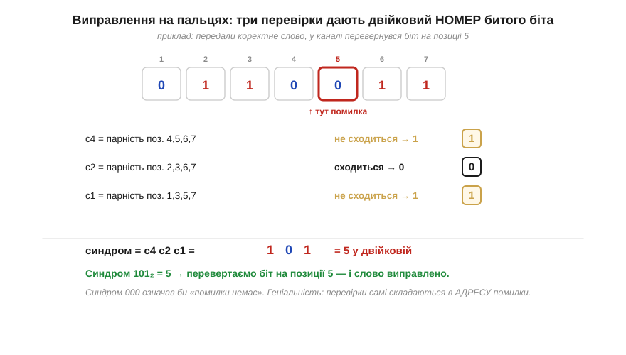

# Код Геммінга (7,4): виправляємо один біт на пальцях

[Геометрія кодової відстані](book:communications/hamming-distance) обіцяє, що виправлення можливе, якщо розсадити кодові слова на достатній відстані. Найпростіший реальний приклад такого розсаджування — **код Геммінга (7,4)**. Числа в дужках кажуть усе: **7** бітів у слові, з них **4** — корисні дані, а решта **3** — біти парності. Цей код має мінімальну відстань d = 3, а отже **виправляє один** перевернутий біт. І найкраще — він робить це так прозоро, що декодування можна провести **на пальцях**, без жодної таблиці: три перевірки парності самі складуться в **номер** зіпсованого біта.

### Розкладка: парності на степенях двійки

Геніальність схеми Геммінга — у **розташуванні** бітів парності. Їх ставлять не в кінець, а на позиції, що є **степенями двійки**: 1, 2, 4. Дані заповнюють решту позицій — 3, 5, 6, 7. На перший погляд дивно ховати контрольні біти всередину даних — але саме це розташування й дає всю красу декодування.


*Рис. Семибітне слово (7,4): біти парності P1, P2, P4 стоять на позиціях-степенях двійки (1, 2, 4), а дані D1…D4 — на решті (3, 5, 6, 7). Кожна парність перевіряє свій набір позицій: P1 — позиції 1,3,5,7; P2 — 2,3,6,7; P4 — 4,5,6,7. Ключ унизу: набори визначені **двійковим номером** позиції — P1 накриває всі позиції, де молодший біт номера = 1, P2 — де середній, P4 — де старший. Тому три перевірки прямо вкажуть номер битого біта.*

Чому саме так розбиті набори? Подивіться на **двійковий запис номера** кожної позиції. Позиція 5 — це `101`, позиція 6 — `110`, позиція 3 — `011`. Парність P1 (позиція 1 = `001`) накриває всі позиції, у двійковому номері яких **молодший** біт дорівнює 1: це 1, 3, 5, 7. P2 (позиція 2 = `010`) накриває ті, де **середній** біт = 1: 2, 3, 6, 7. P4 (позиція 4 = `100`) — де **старший** біт = 1: 4, 5, 6, 7. Кожна парність відповідає одному розряду двійкового номера позиції. Запам'ятаймо це — звідси й береться вся магія декодування.

Кодування при такому розкладі прямолінійне: біти даних кладуть на свої місця, а кожен біт парності обчислюють як XOR тих позицій, які він накриває, щоб у кожному наборі одиниць було парне число. Три незалежні умови парності — три рівняння, які однозначно задають P1, P2, P4 за чотирма бітами даних.

### Чому саме три біти парності

Чому для семи позицій вистачає рівно **трьох** парностей — не двох і не чотирьох? Тут працює красивий рахунок, що прямо випливає з ідеї «синдром = адреса помилки». Синдром із k бітів парності може набути 2ᵏ різних значень. Одне з них (`000`) ми резервуємо під «помилки немає». Решта 2ᵏ−1 значень мають вказувати на конкретну зіпсовану позицію — отже, код може охопити щонайбільше 2ᵏ−1 позицій. Для трьох парностей це 2³−1 = **7** позицій — рівно стільки, скільки бітів у нашому слові. Усе сходиться без жодного зайвого біта: три парності дають сім ненульових синдромів, по одному на кожну з семи позицій.

Цей рахунок одразу підказує й інші розміри сімейства Геммінга. Чотири парності накрили б 2⁴−1 = 15 позицій — це код (15,11): 11 бітів даних під захистом 4 парностей. П'ять — код (31,26), і так далі. Що довше слово, то **вигіднішим** стає Геммінг: на (7,4) ми платимо 3 біти контролю на 4 дані (надлишок аж 75%), а на (15,11) — лише 4 на 11 (близько 36%), на (31,26) — і поготів. Звідси видно й межу ідеї: одна на слово виправна помилка коштує дедалі менше відносно даних, але виправляє код **усе одно лише один** биток на все слово, хай яке воно довге. Тому довгі слова Геммінга дешеві, та вразливіші до того, що в них трапиться **дві** помилки замість однієї, — і саме цей компроміс визначає практичний вибір ширини слова в [ECC-пам'яті](book:communications/ecc-ram-flash).

### Синдром, що називає номер помилки

Тепер — кульмінація, заради якої все будувалося. Приймач отримує сім бітів і **перераховує** всі три парності. Для кожної він питає: набір, який вона накриває, усе ще має парне число одиниць? Результат кожної перевірки — один біт: **0**, якщо парність сходиться, **1**, якщо ні. Три ці біти, виписані разом, утворюють **синдром** (*syndrome*) — і ось чудо: синдром, прочитаний як двійкове число, є **номером** зіпсованої позиції.


*Рис. Виправлення на пальцях. Нехай у каналі перевернувся біт на позиції 5. Приймач рахує три парності: перевірка набору 4,5,6,7 не сходиться (→1), набору 2,3,6,7 — сходиться (→0), набору 1,3,5,7 — не сходиться (→1). Синдром = c4 c2 c1 = 101₂ = 5 — точно номер битої позиції! Перевертаємо біт на позиції 5 — слово виправлено. Синдром 000 означав би «помилки немає». Геніальність: перевірки самі складаються в **адресу** помилки.*

Чому синдром дає саме номер, тепер цілком зрозуміло з розкладки. Перевернутий біт на позиції 5 (`101`) псує парність кожного набору, що цю позицію накриває, — тобто наборів P1 (молодший біт номера 1) і P4 (старший біт 1), але не P2 (середній біт 0). Тож «не сходиться» спрацює саме в P1 і P4, даючи синдром `101` = 5. Інакше кажучи, кожна парність повідомляє один **двійковий розряд** номера зіпсованої позиції, а разом вони складають **повний номер**. Якщо ж помилки не було, усі три парності сходяться, синдром `000` — і це чесно означає «все ціле». Виправлення зводиться до тривіальної дії: прочитати синдром як число й перевернути біт на відповідній позиції.

**Приклад (повний цикл (7,4)).** Закодуймо чотири біти даних, внесімо одну помилку й виправмо її.

```
дані D1 D2 D3 D4 = 1 0 1 1   (на позиції 3,5,6,7)
обчислюємо парності (even):
  P1 = XOR позицій 3,5,6,7 = D1⊕D2⊕D4 = 1⊕0⊕1 = 0
  P2 = XOR позицій 3,6,7   = D1⊕D3⊕D4 = 1⊕1⊕1 = 1
  P4 = XOR позицій 5,6,7   = D2⊕D3⊕D4 = 0⊕1⊕1 = 0
кодове слово (поз.1..7):  P1 P2 D1 P4 D2 D3 D4 = 0 1 1 0 0 1 1

канал перевертає біт на позиції 5:  0 1 1 0 [1] 1 1

приймач рахує синдром:
  c1 = парність поз.1,3,5,7 = 0⊕1⊕1⊕1 = 1
  c2 = парність поз.2,3,6,7 = 1⊕1⊕1⊕1 = 0
  c4 = парність поз.4,5,6,7 = 0⊕1⊕1⊕1 = 1
синдром c4 c2 c1 = 101 = 5  →  перевертаємо біт на позиції 5
відновлене слово: 0 1 1 0 0 1 1  ✓  дані D1..D4 = 1 0 1 1 знову цілі
```
Три перевірки парності склали двійковий номер 5 — рівно ту позицію, де сталася помилка; перевернувши її, ми відновили дані без жодного перепиту.

### Один зайвий біт — і код навчається бачити подвійну помилку

У «голого» Геммінга є небезпечна тонкість, яку конче треба розуміти перед переходом до реального заліза. Він гарантовано виправляє **один** биток — а що, як їх трапиться **два**? Тоді синдром усе одно вийде ненульовим і вкаже на якусь позицію — але **не ту**. Код «виправить» зовсім не той біт, тобто внесе **третю** помилку, щиро вважаючи, що полагодив дані. Це найгірший сценарій із усіх — тиха хибна корекція, після якої зіпсовані дані виглядають цілими.

Рятунок напрочуд дешевий: додати **один** загальний біт парності на все слово. Він рахує парність **усіх** бітів разом і дозволяє відрізнити одиничну помилку від подвійної. Логіка така: одна помилка міняє і синдром Геммінга, і загальну парність; дві помилки міняють синдром, але загальну парність лишають **незмінною** (бо два перевороти її не зачіпають). Тож якщо синдром ненульовий, а загальна парність порушена — це одна помилка, її виправляємо; якщо синдром ненульовий, а загальна парність ціла — це дві помилки, виправити їх не можна, але ми **точно бачимо**, що дані биті, і чесно б'ємо тривогу. Такий розширений код звуть **SECDED** — *Single Error Correct, Double Error Detect* (виправити одну, виявити дві). Один доданий біт підняв мінімальну відстань із d = 3 до d = 4 — і саме SECDED, а не «голий» Геммінг, працює в пам'яті комп'ютерів, бо тиха подвійна помилка там неприпустима.

> 🔧 **Навіщо це.** Код Геммінга — це не лише історична віха, а й жива основа сучасного ECC. По-перше, на ньому зрозуміла **сама ідея виправлення**: надлишок, обчислений так, що його розбіжності складаються в **адресу** помилки. По-друге, його розширення **SECDED** — це фактично той код, що захищає [пам'ять серверів](book:communications/ecc-ram-flash). По-третє, він задає правильні очікування: одиничний Геммінг виправляє **один** биток на слово — чудово проти рідких поодиноких збоїв, але безсилий проти пакета; саме тому для пам'яті слово роблять коротким, а для пакетних каналів беруть інші коди. Зрозумівши (7,4) до кінця, ви розумієте кістяк усього виправлення помилок.

> ⚙️ **Поряд — алгоритмічна вставка:** *Кодер і декодер Геммінга (7,4) у 30 рядків C* — компактна реалізація кодування й синдромного декодування, яку можна вставити в прошивку, щоб захистити критичні дані в пам'яті чи на лінії.

Код Геммінга показує, що один перевернутий біт можна виправити **на льоту**, без перепиту, — і робить це так дешево й прозоро, що цей самий прийом сьогодні працює всередині комп'ютерної пам'яті. Саме SECDED-варіант Геммінга боронить [оперативну пам'ять серверів](book:communications/ecc-ram-flash), а проти пакетних спотворень — там, де псується одразу багато сусідніх бітів — беруть сильніші коди на кшталт [Ріда — Соломона](book:communications/reed-solomon).

---

Підсумок: **код Геммінга (7,4)** — перший і найпрозоріший виправний код: 4 біти даних + 3 біти парності, мінімальна відстань d = 3, тож **виправляє один** перевернутий біт. Уся хитрість — у розкладці: парності стоять на позиціях-**степенях двійки** (1, 2, 4), а кожна накриває ті позиції, у двійковому **номері** яких стоїть її розряд. Тому приймач, перерахувавши три парності, дістає **синдром** — двійкове число, що **прямо вказує номер** зіпсованого біта (а 000 означає «все ціле»); лишається перевернути цей біт. Цей самий механізм, часто розширений до SECDED, лежить в основі ECC-пам'яті.

---
