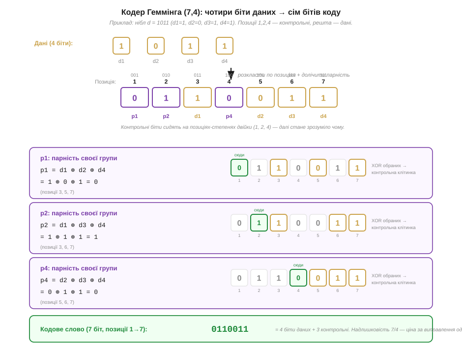
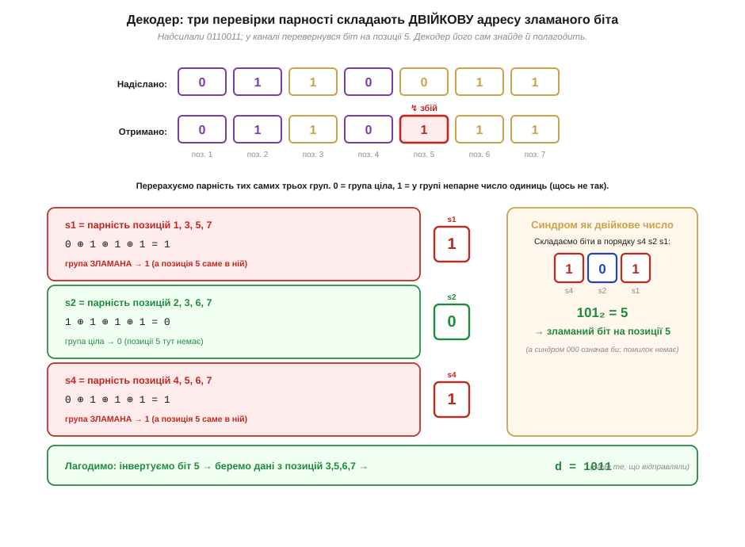
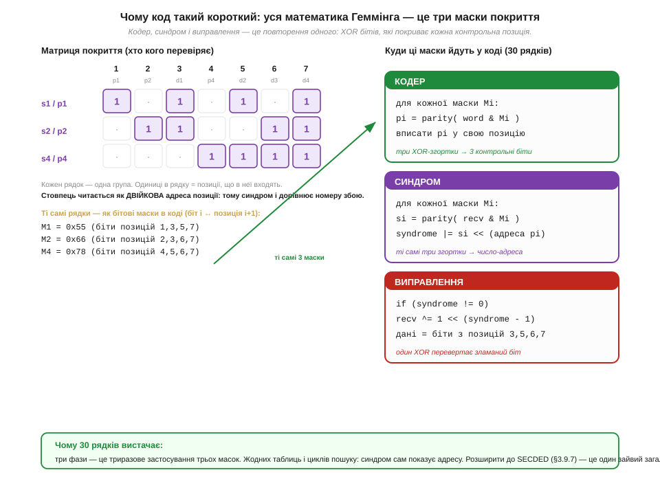

# ⚙️ Кодер і декодер Геммінга (7,4) у 30 рядків C

> Алгоритмічна вставка до [коду Геммінга (7,4)](book:communications/hamming-code). Сам код розкладається на пальцях так: три контрольні біти, кожен стереже свою групу позицій, а три перевірки парності складають **двійкову адресу** зламаного біта. Тут той самий код стає робочим: вся ця математика вкладається у три бітові маски, а кодер, декодер і саме виправлення — це лише триразове застосування однієї дії. Тридцяти рядків C справді вистачає, і кожен рядок прямо відповідає одному кроку коду.

### Задача

Уявімо канал, де зрідка перевертається біт: лінія між мікроконтролером і давачем, комірка зовнішньої пам'яті, кадр у радіоефірі. Простий [біт парності](book:communications/parity-bit) такий збій **помітить**, але не скаже, *де* він стався, — а отже, не полагодить. [CRC](book:communications/crc) ловить навіть сплески, проте теж лише сигналізує «зіпсовано, перешли ще раз». Інколи перепитати ніяк: відповідь уже летить крізь півсистеми, повтор коштує тактів або енергії, яких немає. Тоді потрібен код, що **сам виправляє** одиничну помилку на місці. Найдешевший такий код — Геммінга (7,4): на кожні 4 біти даних додаємо 3 контрольні й дістаємо 7-бітне слово, з якого приймач відновить дані, навіть якщо один із семи бітів перекинувся. Завдання вставки — звести цю обіцянку до короткого, передбачуваного C, придатного для найскромнішого МК.

### Ідея

Уся хитрість — у тому, **куди** покласти контрольні біти. Якщо посадити їх на позиції-степені двійки (1, 2, 4), а дані розкласти по решті (3, 5, 6, 7), то кожна контрольна позиція природно «накриває» свій набір інших позицій: перша — всі з непарним номером, друга — позиції 2, 3, 6, 7, третя — позиції 4, 5, 6, 7. Це й є три **групи покриття**. Контрольний біт — це просто парність своєї групи: XOR усіх бітів, що в неї входять.


*Рис. Кодування ніблу з контрольним прикладом d1 d2 d3 d4 = 1 0 1 1. Дані сідають на позиції 3, 5, 6, 7; контрольні p1, p2, p4 — на 1, 2, 4. Кожен контрольний біт — це XOR своєї групи: p1 = d1 ⊕ d2 ⊕ d4 = 0, p2 = d1 ⊕ d3 ⊕ d4 = 1, p4 = d2 ⊕ d3 ⊕ d4 = 0. Кодове слово (позиції 1→7) — 0110011.*

У коді ці три групи — це три **бітові маски**: число з одиницями на тих позиціях, що входять у групу. Узявши слово AND з маскою, лишаємо саму групу; парність результату й дає контрольний біт. Та сама маска послужить і на прийомі, тож закодувати маски один раз — і кодер з декодером звести до однакового циклу по трьох масках.

Декодер користається з того, що приймач **не знає**, де помилка, але вміє перерахувати ті самі три парності. Якщо біт перекинувся, він зіпсує парність кожної групи, що його накриває, — і рівно тих груп. А оскільки контрольні позиції сидять на степенях двійки, три результати перевірок, складені в число, дають **двійковий номер** зіпсованої позиції. Це і є **синдром** (*syndrome*): нуль означає «помилок немає», а будь-яке інше число — точну адресу біта, який треба перевернути.


*Рис. Те саме слово 0110011, але в каналі перевернувся біт на позиції 5. Перевірки дають s1 = 1, s2 = 0, s4 = 1; складені в порядку s4 s2 s1 — це 101₂ = 5, точна адреса збою. Інвертуємо біт 5, читаємо дані з позицій 3, 5, 6, 7 — і дістаємо назад 1011. Синдром 000 означав би, що чіпати нічого не треба.*

### Псевдокод

Обидві половини — кодер і декодер — це той самий прохід по трьох масках. Контрольний приклад вище проходить цей код точно: кодер повертає 0110011, а декодер з перевернутим бітом 5 відновлює вихідні дані.

```c
#include <stdint.h>

/* Угода про біти: біт i числа (значення 1u<<i) ↔ позиція i+1 кодового слова.
   Контрольні позиції 1,2,4 → біти 0,1,3; дані (3,5,6,7) → біти 2,4,5,6. */
static const uint8_t MASK[3] = { 0x55, 0x66, 0x78 };  /* групи p1, p2, p4 */
static const uint8_t PPOS[3] = { 0, 1, 3 };           /* куди лягає кожен parity */

static int parity8(uint8_t x) {              /* XOR усіх бітів байта */
    x ^= x >> 4;  x ^= x >> 2;  x ^= x >> 1;
    return x & 1;
}

uint8_t ham74_encode(uint8_t data) {         /* 4 біти даних → 7-бітне слово */
    uint8_t w = 0;
    w |= (data & 1) << 2;                     /* d1 → позиція 3 */
    w |= ((data >> 1) & 1) << 4;              /* d2 → позиція 5 */
    w |= ((data >> 2) & 1) << 5;              /* d3 → позиція 6 */
    w |= ((data >> 3) & 1) << 6;              /* d4 → позиція 7 */
    for (int k = 0; k < 3; k++)               /* parity = парність своєї групи */
        w |= parity8(w & MASK[k]) << PPOS[k];
    return w;
}

uint8_t ham74_decode(uint8_t w, int *fixed) {  /* 7 біт → 4 біти даних */
    int s = 0;
    for (int k = 0; k < 3; k++)               /* три перевірки складають синдром */
        s |= parity8(w & MASK[k]) << k;
    if (s) w ^= 1u << (s - 1);                /* синдром = адреса; перевертаємо біт */
    if (fixed) *fixed = (s != 0);             /* чи довелося лагодити */
    return  ((w >> 2) & 1)        | (((w >> 4) & 1) << 1)   /* збираємо дані */
          | (((w >> 5) & 1) << 2) | (((w >> 6) & 1) << 3);  /* з позицій 3,5,6,7 */
}
```

Чому цього стає на все — добре видно, якщо покласти поруч матрицю покриття й самі рядки коду: рядок матриці, бітова маска й одна ітерація циклу — це той самий об'єкт у трьох поданнях.


*Рис. Ліворуч — матриця покриття: рядок = група, одиниці = позиції в ній; стовпець читається як двійкова адреса позиції, тому синдром і дорівнює номеру збою. Ті самі три рядки стають масками 0x55, 0x66, 0x78. Праворуч — куди вони йдуть у коді: кодер кладе три парності, декодер складає з них синдром, а виправлення — це один XOR. Жодних таблиць і циклів пошуку.*

### Складність і пастки на МК

- **Складність — стала.** І кодер, і декодер — це три проходи `parity8` над байтом; кожен `parity8` — три «зсув + XOR». Разом — кілька десятків інструкцій на нібл, без жодного циклу пошуку, без таблиць у Flash і без ділення. На ядрі без апаратної підтримки це найдешевший спосіб **виправляти** (а не лише виявляти) одиничну помилку.
- **Один біт — і не більше.** Геммінг (7,4) має [мінімальну відстань 3](book:communications/hamming-distance), тож гарантовано лагодить **рівно один** перекинутий біт. Якщо їх перевернулося **два**, синдром усе одно покаже якусь ненульову адресу — і декодер «виправить» зовсім не той біт, **зіпсувавши дані мовчки**. Це не вада коду, а межа його сили: для двох помилок потрібен сильніший варіант — [SECDED](book:communications/ecc-ram-flash).
- **Розрізняйте «полагоджено» і «було чисто».** Прапорець `fixed` каже лише, чи спрацював синдром. Він не відрізняє «один збій, виправлено» від «два збої, зроблено гірше». Тому на лічильнику виправлень можна **спостерігати** якість каналу (раптовий сплеск `fixed` — привід насторожитися), але не можна на нього покладатися як на доказ цілісності.
- **Узгодьте угоду про біти на обох кінцях.** Усе тримається на тому, що біт `i` означає позицію `i+1`, а контрольні біти сидять на 1, 2, 4. Передавач і приймач мусять пакувати слово однаково; інакше синдром вкаже не на ту позицію. Маски `0x55/0x66/0x78` дійсні саме для цієї розкладки — змінивши її, переобчисліть і їх.
- **Парність — над беззнаковим типом.** `parity8` працює з `uint8_t`, а зсуви робляться над беззнаковим словом — так само, як в інших бітових ідіомах: це уникає сюрпризів зі знаковим розширенням. Сім значущих бітів лежать у молодшому байті, восьмий лишається нулем і нічому не заважає.
