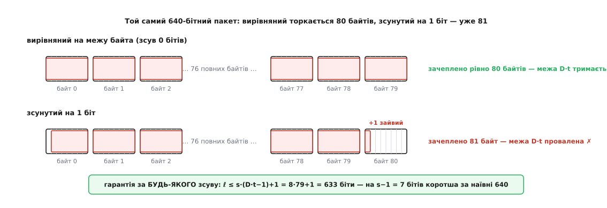
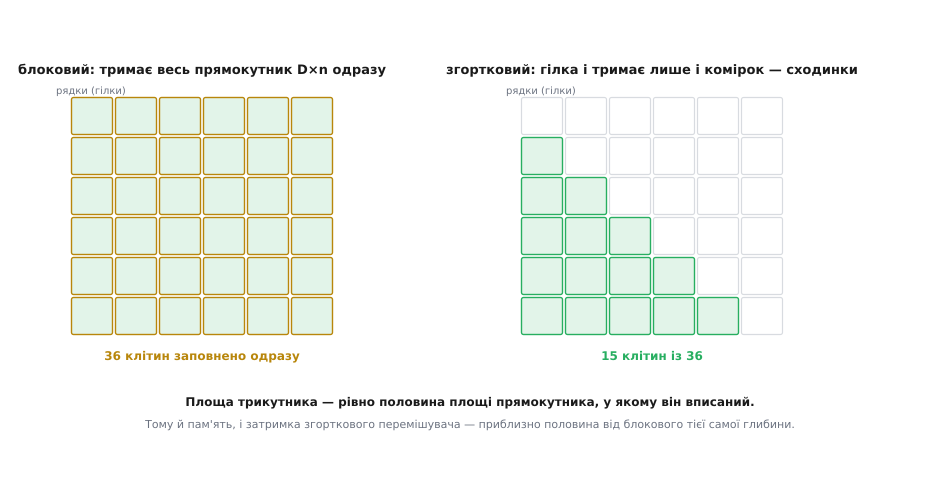

# 🧮 Точна межа перемішування: скільки саме пакета переживе глибина D

Коли кажуть «перемішувач глибини D розтягує пакет по багатьох словах», це майже завжди супроводжують легкою рукою: мовляв, у найгірше слово падає «десь `b/D`» символів. «Десь» — не інженерна величина. Радіоканал, диск чи супутниковий лінк проєктують під **гарантію**: найдовша суцільна смуга завади, яку схема витягне *завжди*, хоч би де й з яким зсувом вона лягла. Ця вставка виводить ту гарантію до останнього біта — і показує, де інтуїтивне «`b/D`» бреше на цілий символ, звідки береться дивна на вигляд межа `s·(D·t−1)+1` у бітах, чому за глибину платять затримкою рівно `2·D·n`, і чому [згортковий](book:communications/convolutional-codes) перемішувач робить те саме вдвічі дешевше — не хитрістю, а простою геометрією трикутника проти прямокутника.

Домовимося про позначення на всю розмову. Код — блоковий, слово завдовжки **n** символів, з них **k** інформаційних; він виправляє **t** зіпсованих символів на слово (для [Рід–Соломона](book:communications/reed-solomon) `t = (n − k)/2`). Символ складається з **s** бітів (для RS над байтами `s = 8`). Перемішувач блоковий, глибини **D** — матриця D рядків на n стовпців, яку пишуть рядками, а віддають у канал стовпцями. Пакет вимірюємо двічі: **b** — у символах каналу, **ℓ** — у бітах. Уся математика нижче — про те, як ці величини пов'язані точно, а не приблизно.

## Інваріант стовпця: чому будь-які D підряд — з різних слів

Уся сила блокового перемішувача тримається на одному твердженні, і його варто довести, а не проголосити. Занумеруймо клітини матриці: клітина в рядку r (слово r, `r = 0…D−1`) і стовпці c (`c = 0…n−1`). Читаємо стовпцями — стовпець за стовпцем, згори вниз, — тож ця клітина виходить у канал на позиції

```
pos(r, c) = c·D + r
```

Перший стовпець дає позиції 0…D−1, другий — D…2D−1, і так далі. Тепер візьмімо **два символи одного слова** — той самий рядок r, різні стовпці c та c′. Їхні позиції в каналі різняться на

```
pos(r, c) − pos(r, c′) = (c − c′)·D  →  кратне D
```

Ось воно, ядро всього: **два символи одного кодового слова стоять у каналі щонайменше за D позицій один від одного** — їхня відстань завжди кратна D, а отже не менша за D. Переверніть це — і дістанете форму, з якої рахують гарантію: у будь-якому **вікні з D сусідніх позицій каналу** не може опинитися двох символів того самого слова. Кожне слово лишає у вікні завширшки D щонайбільше один свій символ. А оскільки таких символів у вікні рівно D (повне вікно — це повний стовпець зі зсувом), то вони належать D **різним** словам — усім, по одному від кожного.

> 🔧 **Навіщо це.** Тут перемішувач перестає бути «гарною ідеєю» й стає верстатом із паспортною точністю. Інваріант «≥ D нарізно» — не спостереження над картинкою, а те, що можна підставити в межу й підписатися під нею перед замовником: не «зазвичай розкидає», а «гарантовано не більш як стільки-то на слово, за будь-якого зсуву пакета». Різниця між «зазвичай» і «завжди» — це різниця між демо й сертифікованим лінком.

## Найдовший посильний пакет — рівно D·t символів, і ні на символ більше

Тепер гарантія виводиться на пальцях. Нехай пакет накрив **b** сусідніх позицій каналу. Розріжмо цю смугу на вікна завширшки D: вийде `⌈b/D⌉` вікон (останнє, може, неповне). У кожне вікно кожне слово віддає щонайбільше один символ — за інваріантом. Отже за всі вікна одне слово збирає щонайбільше стільки помилок, скільки є вікон:

```
помилок на будь-яке слово ≤ ⌈b / D⌉
```

Слово виживає, поки цей тягар не перевищив запас коду t:

```
⌈b / D⌉ ≤ t   ⟺   b ≤ D·t
```

Еквівалентність тут точна, бо всі величини цілі: `⌈b/D⌉ ≤ t` рівносильне `b/D ≤ t`, тобто `b ≤ D·t`. Звідси **найдовший гарантовано посильний пакет — рівно D·t символів**.

І ця межа **гостра** — не «приблизно D·t», а точно, з обома боками. Візьмімо `b = D·t` символів поспіль: смуга ділиться рівно на t повних вікон, кожне слово дістає рівно по t — усі на межі, усі вижили. Додаймо один символ, `b = D·t + 1`: тепер `⌈(D·t+1)/D⌉ = t + 1`. Це не абстрактне «в середньому більше» — конкретне слово (те, чий символ стоїть у неповному t+1-му вікні) дістає t+1 помилок і провалюється, бо код тягне лише t. Отже `D·t` — це справжня стеля: на ній ще стоїмо, на символ вище — падаємо. Глибина множить стійкість до пакетів **строго лінійно**, з коефіцієнтом t.

## Від символів до бітів: чому 640 насправді 633

Досі пакет був у символах. Але канал не знає про символи — він псує **біти**, і смуга завади в ньому має довжину ℓ **бітів**, що починається де завгодно, хоч посеред байта. І тут криється пастка, повз яку проходить наївний підрахунок «`D·t` символів це просто `D·t·s` бітів». Пастка — у **невирівняності**.

Спитаймо точно: смуга завдовжки ℓ бітів — скількох символів вона може торкнутися в найгіршому разі? Символи лежать блоками по s бітів: `[0,s)`, `[s,2s)`, і так далі. Смуга `[a, a+ℓ)` зачіпає символи від `⌊a/s⌋` до `⌊(a+ℓ−1)/s⌋`. Максимізуючи за зсувом a (лічимо межі символів, що трапляються всередині смуги), дістаємо

```
найбільше символів, яких торкається ℓ-бітна смуга = ⌈(ℓ − 1)/s⌉ + 1
```

Той «+1» — і є пастка. Смуга завширшки рівно в один символ (`ℓ = s`) при вирівняному старті псує один символ, але зсунута на біт — уже **два**: хвіст одного й голову наступного. `⌈(s−1)/s⌉ + 1 = 1 + 1 = 2`. Один зайвий символ смуга завжди може «вкрасти», просто ставши невдало щодо меж.

Тепер вимога гарантії: щоб схема витягла смугу *напевно*, число зачеплених символів має не перевищити D·t за будь-якого зсуву:

```
⌈(ℓ − 1)/s⌉ + 1 ≤ D·t
⌈(ℓ − 1)/s⌉      ≤ D·t − 1
   (ℓ − 1)/s     ≤ D·t − 1          (права частина ціла)
    ℓ            ≤ s·(D·t − 1) + 1
```

Ось звідки та межа з дивним хвостиком: **найдовший гарантовано посильний пакет у бітах — це `s·(D·t − 1) + 1`, а не `s·D·t`.** Різниця — рівно `s − 1` бітів: стільки «з'їдає» найгірше вирівнювання, коли смуга обома краями залазить у зайві символи. Наївне «D·t символів» мовчки припускає, що пакет починається й закінчується акурат на межах байтів. Реальний пакет такого ввічливого зобов'язання не давав.

**Умова.** [Рід–Соломон](book:communications/reed-solomon) RS(255, 223) над байтами: `s = 8`, `t = (255 − 223)/2 = 16`. Перемішувач глибини `D = 5`. Скільки бітів каналу схема витягне гарантовано?

```
у символах:  b ≤ D·t = 5 · 16 = 80 байтів
наївно в бітах:  80 · 8 = 640 бітів

точна межа з урахуванням вирівняності:
  ℓ ≤ s·(D·t − 1) + 1 = 8·(80 − 1) + 1 = 8·79 + 1 = 633 біти

перевірка гостроти:
  633 біти → ⌈632/8⌉ + 1 = 79 + 1 = 80 символів  ≤ 80  ✓ витягли
  634 біти → ⌈633/8⌉ + 1 = 80 + 1 = 81 символ    > 80  ✗ провал
  640 бітів, зсунутих на 1 біт → ⌈639/8⌉ + 1 = 80 + 1 = 81  ✗ теж провал
```

**Висновок.** Округла цифра «640 бітів» справджується лише для акуратного, байт-вирівняного пакета — а такого канал не обіцяв. Мстивий пакет, зсунутий на один-єдиний біт, залазить у 81-й байт і валить слово. Гарантія, під якою можна підписатися за будь-якого зсуву, на `s − 1 = 7` бітів скромніша: `633`. Для сховища ця дрібниця несуттєва, але в стандарті лінка, де межу пишуть як абсолютну обіцянку, різниця між «зазвичай 640» і «завжди 633» — це різниця між правдою й майже-правдою.


*Чому біт-межа коротша за наївну. Байти каналу — по s = 8 бітів. Пакет, вирівняний на межу байта (угорі), у 80 байтів кладе рівно 80 помилок — межа D·t тримається. Зсуньте той самий пакет на один біт (унизу) — обидва краї залазять у сусідні байти, зачеплено вже 81, і одне слово дістає t+1. Щоб гарантія трималася за будь-якого зсуву, пакет мусить бути на s−1 бітів коротший: звідси ℓ ≤ s·(D·t−1)+1.*

## Ціна глибини: чому затримка й пам'ять ідуть як 2·D·n

Гарантія росте як D·t — лінійно з глибиною. Але ніщо не безплатне, і платня тут — **час і пам'ять**, теж лінійні з D. Порахуймо їх так само точно, як і виграш.

Передавач не може віддати перший символ стовпця, поки не заповнить **усі** D рядків матриці: стовпець читається згори вниз, тож потрібен кожен рядок. Отже, перш ніж піти в канал, ціла матриця `D·n` символів мусить бути записана — це **пам'ять передавача**. Приймач дзеркальний: він мусить зібрати цілий блок зі стовпців, перш ніж поверне бодай одне слово рядками, — ще `D·n` символів. Разом, туди й назад, буфер тримає близько `2·D·n` символів.

Затримку видно з того самого `pos(r, c) = c·D + r`. Символ входить у матрицю в порядку запису рядками, на позиції `r·n + c`, а виходить на позиції читання `c·D + r`. Найдовше в передавачі чекає той, кого записали рано, а прочитають пізно, — символ рядка 0 останнього стовпця (`r=0, c=n−1`): його вписали майже першим, а прочитають майже останнім. Його затримка в передавачі — близько `(n−1)(D−1)` символьних тактів понад час заповнення блоку. Додайте таку саму дзеркальну затримку в приймачі — і наскрізний шлях від входу перемішувача до виходу зворотного виходить порядку

```
наскрізна затримка ≈ 2·D·n символьних тактів
пам'ять (обидва кінці)  ≈ 2·D·n символів
```

Обмін чесний і жорсткий: **стійкість до пакетів купують затримкою один до одного.** Хочете витримати вдвічі довшу смугу — беріть удвічі глибший перемішувач і платіть удвічі довшим чеканням у буфері. Ось чому [канал Гілберта–Елліота](book:communications/gilbert-elliott-model) із рідкими, але довгими «поганими» проміжками штовхає до великих D у сховищі й стрімах, де кілька зайвих мілісекунд ніхто не помітить, — і чому живий голос чи керування апаратом тримають глибину скромною, бо там затримка ворог не менший за помилку.

## Згортковий перемішувач: трикутник замість прямокутника

Блокова матриця марнує половину пам'яті — і це видно просто. Щоб потік не переривався, поки заповнюється нова матриця, стару вже треба віддавати; наївна реалізація тримає **дві** матриці на кінці, і в кожну мить половина клітин або ще порожня, або вже віддана. Згортковий перемішувач (його оптимальну форму довели [Джон Ремзі 1970 року та Дейвід Форні 1971-го](book:communications/concatenated-codes)) прибирає це марнотратство — і робить це так гарно, що варто побачити чому саме **вдвічі**.

Замість цілої матриці символи пропускають крізь **D паралельних ліній затримки** (гілок). Вхідний комутатор роздає символи по гілках по колу: символ 0 → гілка 0, символ 1 → гілка 1, …, символ D−1 → гілка D−1, символ D → знову гілка 0. Гілка i — це проста черга (FIFO) завдовжки **i·g** комірок, де крок `g = n/D`: гілка 0 не затримує зовсім, гілка 1 тримає g символів, гілка 2 — 2g, остання — `(D−1)·g`. Вихідний комутатор синхронно збирає символи назад по колу. Зворотний перемішувач дзеркальний: там гілка i має затримку `(D−1−i)·g`, тож сума затримок кожного символу через пару гілок — стала `(D−1)·g`, і на виході потік знову рівний та впорядкований.

Перш ніж рахувати ціну, переконаймося, що сходинка розкидає пакет незгірше за матрицю тієї самої глибини — і теж не «десь», а з інваріантом, який можна довести. Занумеруймо вхідні символи поспіль: символ №u заходить у гілку `i = u mod D` і сидить у ній `i·g` комірок; а що комутатор вертається до цієї гілки кожні D кроків, ці `i·g` комірок обертаються на затримку `i·g·D` кроків у потоці. А що `g·D = n`, місце символу в каналі виходить коротким:

```
pos(u) = u + (u mod D)·n
```

Візьмімо два символи одного слова — вони серед `n = D·g` вхідних позицій поспіль. Якщо обидва попали в **ту саму гілку** (`u ≡ u′ mod D`), то стоять у каналі за `pos(u′) − pos(u) = u′ − u` один від одного, а ця різниця кратна D: однакова гілка — однакова затримка, тож відстань у каналі дорівнює вхідній, а вона кратна D. Найтісніший випадок — наскрізна гілка 0: вона не затримує зовсім, тож два її символи одного слова виходять у канал рівно так, як зайшли, — за D позицій. Символи з **різних** гілок навпаки розлітаються на цілі слова: до різниці входів додається `(різниця гілок)·n`, тобто майже ціле n і більше. Отже мінімум по всіх парах — рівно **D**.

Це той самий інваріант, що й у матриці, буква в букву: **два символи одного слова ніколи не стоять ближче за D позицій каналу.** А з нього — та сама межа: суцільний пакет завдовжки b накриває будь-якого слова щонайбільше `⌈b/D⌉` символів, і поки `b ≤ D·t`, кожне слово виживає. Найгірше слово — те, чиї g символів осіли в наскрізній гілці: вони лежать у каналі тісною низкою через D, і саме по ній пакет збирає врожай. **Глибину — тобто розмах розсіювання — дає число гілок D, точно як число рядків у матриці; приріст g у гарантію не входить зовсім** і визначить лиш, скільки пам'яті це коштуватиме.

Тепер порахуймо пам'ять — і побачимо трикутник. Уся пам'ять перемішувача — це сума довжин гілок:

```
пам'ять = g·(0 + 1 + 2 + … + (D−1)) = g · D·(D−1)/2
```

Підставмо `g = n/D`:

```
пам'ять = (n/D) · D·(D−1)/2 = n·(D−1)/2 ≈ ½ · D·n
```

Ось воно. Блоковий перемішувач тримає **повний прямокутник** `D · n` клітин — усі рядки завдовжки n, заповнені одразу. Згортковий тримає **сходинки**: рядки завдовжки 0, g, 2g, …, `(D−1)g` — це трикутник, вписаний у той самий прямокутник. А площа прямокутного трикутника — рівно **половина** площі його прямокутника. Увесь виграш удвічі — це не хитрий трюк, а `0+1+…+(D−1) = D(D−1)/2`, тобто «половина від D·D». Блоковий платить за пікову затримку **кожним** символом, бо кожен чекає повну рамку; згортковий бере з кожного символу лише **середню** затримку сходинок, а середнє від `0…(D−1)g` — це половина піка. Половина пам'яті, половина затримки, з тієї самої причини: трикутник — це пів прямокутника.


*Звідки береться «вдвічі». Ліворуч — блоковий перемішувач: тримає всю матрицю D×n одразу, повний прямокутник із D·n клітин. Праворуч — згортковий: гілка i тримає лише i·g комірок, тож заповнена частина — трикутні сходинки, вписані в той самий прямокутник. Площа трикутника — половина прямокутника, тому й пам'ять, і затримка вдвічі менші. Порожня верхня половина — це рівно те, чого блоковий не економить.*

Форні довів більше, ніж «вдвічі»: його періодичний перемішувач досягає **теоретичного мінімуму** пам'яті й наскрізної затримки для заданої розкидувальної сили — дешевше вже не можна. Тому згорткові перемішувачі стоять там, де кожен байт буфера й кожна мілісекунда на рахунку.

**Умова.** Цифрове телебачення DVB-T: зовнішній код [каскаду](book:communications/concatenated-codes) — вкорочений RS(204, 188), `t = 8`; перемішувач згортковий, `D = 12` гілок, крок `g = 17 = 204/12`. Порівняймо з блоковим тієї самої глибини.

```
розкидувальна сила (однакова):  D·t = 12 · 8 = 96 байтів гарантованого пакета

блоковий D×n:  пам'ять на кінець = 12 · 204 = 2448 байтів
               наскрізна затримка ≈ 2·D·n = 4896 байт-тактів

згортковий (сходинки 0, 17, 34, …, 11·17):
  пам'ять = 17·(0+1+…+11) = 17 · 66 = 1122 байти на кінець
  затримка = D·(D−1)·g = 12·11·17 = 2244 байт-такти

відношення:  1122 / 2448 ≈ 0.46      2244 / 4896 ≈ 0.46   →  ≈ ½
наскрізна затримка передавач+приймач ≈ 2 мс (за паспортом DVB-T)
```

**Висновок.** Та сама розкидувальна сила, що й у блокового тієї самої глибини `D = 12`: гарантоване виправлення будь-якого **поодинокого** пакета до `D·t = 12·8 = 96` байтів — зате пам'яті й затримки рівно вдвічі менше, бо трикутник замість прямокутника. Приріст `g = 17` у гарантію не входить: він платить лише за буфер і чекання, а стійкість до смуги дає число гілок D. (Довідники по DVB часто подають цю межу як `136 = t·M = 8·17`, рахуючи від кроку `M = 17`, а не від глибини `D = 12`; у чистих символах каналу строга гарантія — `D·t = 96`, бо суцільні 136 символів поклали б у найгірше слово `⌈136/12⌉ = 12` похибок, за межу `t = 8`.) А слово «поодинокого» тут не випадкове — воно веде просто до головного обмеження.

## Що перемішування НЕ рятує

Гарантія D·t тримається на тихому припущенні, яке легко проґавити: у розрахунковому пролеті стався **рівно один** пакет. Розсіювання розкладає одну смугу тонким шаром по D словах — але шар кладеться в ту саму пам'ять, куди лягли б і сусідні пакети. Якщо в один пролет перемішувача вдарять **два** пакети, їхні розсіяні залишки складаються: слово, що дістало по одному символу від кожного, тепер має по два, і бюджет t вичерпується вдвічі швидше. Перемішувач ділить *один* згусток — він не має звідки взяти запас на другий у тому ж вікні. Саме тому паспортні межі й кажуть «поодинокий пакет»: DVB-T виправляє 96 байтів смуги, якщо вона одна на пролет; дві близькі смуги можуть звалити те, що кожна поодинці не звалила б. Глибший перемішувач розтягує пролет — і робить збіг двох пакетів у ньому рідшим, — але принципу не скасовує.

Є й тонший бік, який називають **виграшем від перемішування** (interleaving gain). Досі ми міряли пакет у символах, ніби завада — це чіткий відрізок «зіпсовано/чисто». У радіо з [багатопроменевим завмиранням](book:communications/multipath-fading) канал не такий: він то глибоко провалюється, то стоїть, і сусідні в часі біти переживають **той самий** провал — їхні долі корельовані. Код проти такого безсилий не тому, що помилок багато, а тому, що вони йдуть згустками в одному завмиранні. Перемішування, розсунувши сусідів у часі далі, ніж триває один провал (далі за час когерентності каналу), робить їхні завмирання **незалежними** — і декодер бачить уже не корельований згусток, а розкидані поодинокі похибки, з якими код дає раду. Це і є виграш: перемішування не додає ні джоуля енергії й ні біта надлишку — воно **перетворює корельований канал на майже незалежний**, а незалежність код уміє експлуатувати як діверсіті. Ціна знову — затримка: щоб рознести біти за час когерентності, глибина мусить його перекрити, а це знов буфер і чекання.

Звідси й межа виграшу. Проти чисто випадкового шуму (як у [АБГШ-каналі](book:communications/awgn-channel)) перемішування не дає **нічого**: там сусіди й так незалежні, розсовувати нема чого, а зайва затримка — чистий збиток. Виграш живе рівно там, де в каналі є **пам'ять** — кореляція, згустки, завмирання; він вимірює, скільки структури лиха схема встигла зруйнувати. Немає структури — немає що руйнувати. У цьому вся точна суть перемішування: воно не б'ється з помилками, а **відбирає в них форму** — і рівно настільки, наскільки в тій формі був порядок, який код сам розібрати не міг.
