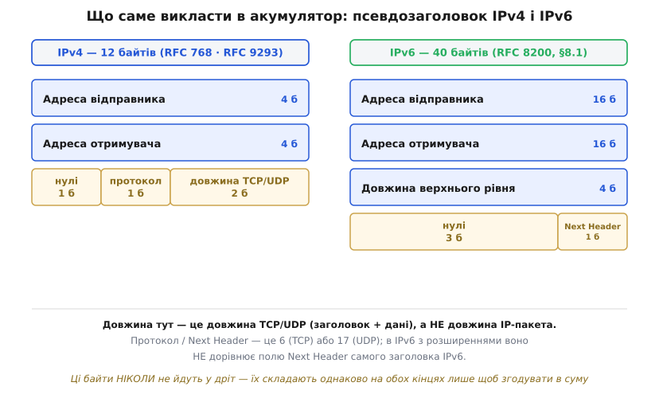
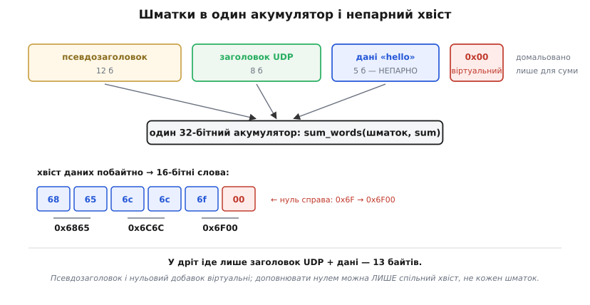

# ⚙️ Повна сума IP, TCP і UDP у коді

Цикл, що складає 16-бітні слова й завертає перенос, — чесний і повний опис арифметики. Але він приймає на вхід готовий масив 16-бітних слів, а реальність подає інше: голий буфер байтів із сирого сокета, власного стека чи генератора трафіку. Між «я знаю формулу» і «мій пакет приймають на тому кінці» лежить день роботи, і майже вся вона — не про арифметику. Вона про те, **які саме байти** й **у якому порядку** згодувати тому циклу. Розберімо цю роботу до кінця й доведімо до коду, що працює.

## Задача

Маємо буфер: заголовок IP, за ним заголовок TCP чи UDP, за ним дані. Треба заповнити поля контрольних сум так, щоб чужий стек на тому кінці не викинув наш пакет мовчки. Здавалося б, поклич цикл — і по всьому. Але той акуратний цикл мовчки припускає три речі, і **жодну** з них реальний пакет не дає задарма.

Він припускає, що дані — це масив 16-бітних слів. Насправді це масив **байтів**, і їх може бути **непарна** кількість: у слово останній байт сам не складеться.

Він припускає, що все, що треба скласти, лежить одним суцільним шматком. Для суми IP так і є. Для TCP та UDP — ні: у їхню суму мусять увійти поля з **рівня IP**, які в самому сегменті не лежать і в дріт ніколи не поїдуть.

І він припускає, що поле суми йому не заважає. А воно **всередині** тієї ділянки, яку ми сумуємо: заповнивши його, ми змінимо власний вхід.

Отже, справжня задача формулюється так: як із реального буфера байтів дістати правильне число й покласти його на правильне місце. Розв'яжімо всі три ускладнення по черзі — виявиться, що перше з них дає ключ до решти.

## Ідея: акумулятор замість буфера

Почнімо з того ускладнення, що виглядає найгірше, — з полів чужого рівня, які треба домішати в суму. Найпряміший спосіб: завести тимчасовий буфер, скопіювати туди спершу ці поля, тоді сегмент, порахувати суму над усім разом і буфер викинути. Спосіб робочий, але в ньому зайве копіювання цілого пакета — на кожен пакет.

І тут стає в пригоді властивість, заради якої обернений код і брали: додавання із загорнутим переносом **асоціативне**. Сума не залежить від того, як згрупувати доданки. А отже, **суцільний буфер узагалі не потрібен**: слова можна лити в акумулятор шматками, з різних місць пам'яті, і результат буде той самий, ніби вони лежали поруч. Копіювати нема чого — треба лише правильно **порахувати**.

Звідси й уся форма коду. Замість функції «дай буфер — отримай суму» пишемо функцію, що бере **біжучу суму** і повертає **нову**:

```
sum = sum_words(шматок₁, sum)
sum = sum_words(шматок₂, sum)
...
контрольна сума = ~fold(sum)
```

Акумулятор мандрує крізь шматки, і в цьому вся конструкція. Але за цю зручність доведеться заплатити однією тонкістю, і краще побачити її одразу, ніж потім ловити. Сітка 16-бітних слів лягає на **склеєний** потік, а не на кожен шматок окремо. Тобто шматки — це фікція розкладу пам'яті, а не межі в арифметиці; сума не знає, що ми викликали функцію тричі. Наслідок жорсткий: доповнювати непарний хвіст можна **лише в останньому** шматку. До цього ми ще повернемося, коли розберемо сам хвіст, — але тримайте це в голові вже зараз.

## Псевдозаголовок: рівно ті байти

Ті поля чужого рівня, що йдуть у суму TCP та UDP, називають **псевдозаголовком** — набір, який складають однаково на обох кінцях лише для того, щоб згодувати в суму, і ніколи не передають. Кодувати його треба **побайтно точно**: помилка в один байт — і сума не зійдеться, а пакет тихо зникне.


*Ліворуч псевдозаголовок IPv4 — 12 байтів: адреси по 4, нульовий байт, номер протоколу, довжина сегмента. Праворуч IPv6 — 40 байтів: адреси по 16, довжина вже 32-бітна, три нулі й Next Header. Це різні структури, а не одна з іншими розмірами, тож код під них теж різний.*

Для **IPv4** це 12 байтів: адреса відправника (4), адреса отримувача (4), нульовий байт (1), номер протоколу (1) — 6 для TCP, 17 для UDP — і довжина сегмента (2). Розклад закріплено в RFC 768 для UDP і в RFC 9293 для TCP (це усталений факт, зафіксований у самих RFC).

Для **IPv6** структура інша — 40 байтів: адреса відправника (16), адреса отримувача (16), довжина верхнього рівня вже **32-бітна** (4), три нульові байти (3) і Next Header (1). Так її задає RFC 8200 у розділі 8.1.

Три речі в цьому розкладі підступні, і кожна коштувала комусь вечора.

**Довжина — не та, про яку ви подумали.** У псевдозаголовок іде довжина **TCP чи UDP**: заголовок сегмента плюс дані. Не довжина IP-пакета. RFC 9293 про поле TCP Length каже прямо, що це величина, яку не передають явно, а обчислюють, і що 12 байтів псевдозаголовка вона **не** рахує. Спокуса взяти готове число з поля Total Length заголовка IP велика — і вона хибна: там довжина разом із самим заголовком IP, ще й змінної довжини, якщо є опції.

**Нульовий байт і протокол — це одне слово.** Байт нулів і байт протоколу стоять поруч і в 16-бітній сітці утворюють одне слово: `0x0011` для UDP, `0x0006` для TCP. Тож окремо викладати нуль у пам'ять не треба — досить додати до акумулятора саме число протоколу. В IPv6 так само: три нулі й Next Header дають слова `0x0000` і `0x0011`, і перше нічого не змінює.

**Next Header в IPv6 — не те поле, що в заголовку.** Якщо між заголовком IPv6 і сегментом стоять розширення, поле Next Header самого заголовка IPv6 вкаже на **перше розширення**, а не на TCP чи UDP. У псевдозаголовок же йде номер протоколу **верхнього рівня** — 6 або 17. RFC 8200 обумовлює це окремо, як і суміжний випадок: якщо є Routing header, у псевдозаголовок береться адреса **кінцевого** призначення, а не та, що стоїть у полі зараз.

> 🔧 **Навіщо це.** Псевдозаголовок — місце, де найчастіше ламається саморобний мережевий код, і ламається найгірше з можливих способів: **мовчки**. Сума не зійдеться, чужий стек викине сегмент без жодного повідомлення, а ви дивитиметеся на код розбору відповіді й не розумітимете, чому її нема. Тому, зібравши пакет вручну, першим ділом порівняйте свою суму з тим, що каже аналізатор: якщо він пише «checksum incorrect», а всі байти на око правильні, — шукайте помилку саме в цих дванадцяти (чи сорока) байтах, а не в арифметиці.

## Непарний хвіст: нуль справа

Тепер до байтів, що не склалися в слово. Правило просте: якщо байтів непарна кількість, останній доповнюють **нульовим байтом справа** до повного слова. RFC 9293 про це каже так само прямо: доповнення виконують для потреб контрольної суми, і сам добавок **не передають** як частину сегмента.

Слово «справа» тут — уся суть, і його легко проґавити. Слова беруть у мережевому порядку, старшим байтом уперед. Отже, останній байт стає **старшим** байтом слова, а нуль — молодшим. Байт `0x6F` дає слово `0x6F00`, а не `0x006F`. Переплутайте — і отримаєте іншу суму, причому на більшості пакетів вона все одно збігатиметься: на парній довжині хвоста просто нема, тож і доповнювати нічого. Зламається рівно тоді, коли довжина даних виявиться непарною, — а такий баг живе в коді роками.


*Псевдозаголовок, заголовок UDP і дані ллються в один акумулятор — суцільний буфер збирати не треба. Дані «hello» мають непарну довжину, тож останній байт `6f` доповнює нуль справа й дає слово `0x6F00`. Ані псевдозаголовок, ані цей нуль у дріт не йдуть: у пакеті лишається 13 байтів.*

Тепер видно й ту тонкість, яку ми відклали. Доповнення зсуває сітку слів для **всього, що йде після** нього. Якщо шматок непарної довжини стоїть посередині й ми доповнимо його нулем «на місці», то всі наступні байти зсунуться на один — і сітка поїде. Сума вийде інша, ніж мала б.

На щастя, для IP, TCP і UDP розклад складається сам: псевдозаголовок парний (12 чи 40), заголовки теж (8 у UDP, кратний чотирьом у TCP), тож непарними можуть бути **лише дані** — а вони й так останні. Тому функція, що доповнює хвіст сама, тут безпечна. Але щойно ви поділите дані на шматки — скажімо, збиратимете суму по фрагментах чи по кількох буферах, — правило доведеться поважати вручну. Ось що виходить на дрібному прикладі: байти `01 02 03` і `04 05`, кожен шматок доповнено окремо, дають слова `0102`, `0300`, `0405` і суму `0x0807`; правильно ж — доповнити лише спільний хвіст, дістати `0102`, `0304`, `0500` і суму `0x0906`. Числа різні, і мовчки.

## Код

Тепер усе на місці, і можна писати. Основа — на C: це домен байтових буферів і мережевих стеків, де ширина акумулятора й розклад пам'яті — не деталі, а суть. Поряд — Python: те саме, ідіоматично, для скриптів, тестів і генераторів пакетів, де ясність важить більше за такти.

Спершу два наріжні камені — доливання шматка й згортання переносу:

:::tabs
```c
#include <stdint.h>
#include <stddef.h>

#define IPPROTO_TCP  6
#define IPPROTO_UDP 17

/* Долити шматок у біжучу суму; повертає НЕзгорнутий акумулятор,
   щоб шматки можна було ланцюжити. Нулем доповнює хвіст — тож
   непарним може бути ЛИШЕ останній шматок. */
static uint32_t sum_words(const uint8_t *p, size_t len, uint32_t sum)
{
    while (len > 1) {
        sum += (uint32_t)((p[0] << 8) | p[1]);   /* слово в мережевому порядку */
        p   += 2;
        len -= 2;
    }
    if (len)                                     /* непарний хвіст:            */
        sum += (uint32_t)(p[0] << 8);            /* нуль СПРАВА, байт — старший */
    return sum;
}

/* Загорнути перенос. Двох згортань досить для будь-якого uint32_t. */
static uint16_t fold(uint32_t sum)
{
    sum = (sum & 0xFFFF) + (sum >> 16);
    sum = (sum & 0xFFFF) + (sum >> 16);
    return (uint16_t)sum;
}
```
```python
import struct

IPPROTO_TCP, IPPROTO_UDP = 6, 17


def sum_words(data: bytes, start: int = 0) -> int:
    """Долити шматок у біжучу (незгорнуту) суму."""
    if len(data) % 2:
        data += b"\x00"          # нуль СПРАВА — лише для останнього шматка
    return start + sum(struct.unpack("!%dH" % (len(data) // 2), data))


def fold(s: int) -> int:
    """Загорнути перенос: двох згортань досить для будь-якого 32-бітного s."""
    s = (s & 0xFFFF) + (s >> 16)
    s = (s & 0xFFFF) + (s >> 16)
    return s & 0xFFFF
```
:::

Зверніть увагу на `p[0] << 8 | p[1]`: байти читають **поіменно**, а не приведенням `uint8_t *` до `uint16_t *`. Це не педантизм — про це в пастках нижче.

Тепер псевдозаголовки. Адреси беремо як байтові масиви просто з заголовка — тоді жодних `htonl` не треба взагалі, бо `sum_words` уже читає в мережевому порядку:

:::tabs
```c
/* IPv4: адреси по 4 байти, нульовий байт + протокол = одне слово, довжина. */
static uint32_t pseudo_v4(const uint8_t src[4], const uint8_t dst[4],
                          uint8_t proto, uint16_t seg_len, uint32_t sum)
{
    sum  = sum_words(src, 4, sum);
    sum  = sum_words(dst, 4, sum);
    sum += (uint32_t)proto;        /* слово «нулі|протокол»: 0x0011 для UDP */
    sum += (uint32_t)seg_len;      /* довжина TCP/UDP: заголовок + дані     */
    return sum;
}

/* IPv6: адреси по 16 байтів, 32-бітна довжина, три нулі + Next Header. */
static uint32_t pseudo_v6(const uint8_t src[16], const uint8_t dst[16],
                          uint8_t next_hdr, uint32_t ulp_len, uint32_t sum)
{
    sum  = sum_words(src, 16, sum);
    sum  = sum_words(dst, 16, sum);
    sum += (ulp_len >> 16) & 0xFFFF;   /* довжина тут 32-бітна — двома словами */
    sum += ulp_len & 0xFFFF;
    sum += (uint32_t)next_hdr;         /* три нульові байти + Next Header      */
    return sum;
}
```
```python
def pseudo_v4(src: bytes, dst: bytes, proto: int, seg_len: int) -> int:
    """12 байтів: адреси, нульовий байт, протокол, довжина TCP/UDP."""
    return sum_words(src + dst + struct.pack("!BBH", 0, proto, seg_len))


def pseudo_v6(src: bytes, dst: bytes, next_hdr: int, ulp_len: int) -> int:
    """40 байтів: адреси по 16, 32-бітна довжина, три нулі, Next Header."""
    return sum_words(src + dst + struct.pack("!I3xB", ulp_len, next_hdr))
```
:::

І, нарешті, самі суми. Заголовок IP — найпростіший випадок, бо ніякого псевдозаголовка тут нема, лише занулення поля:

:::tabs
```c
/* Сума заголовка IPv4: поле суми — на зсуві 10. */
uint16_t ip_checksum(uint8_t *hdr, size_t hdr_len)
{
    hdr[10] = 0;                                  /* занулити поле суми! */
    hdr[11] = 0;
    uint16_t c = (uint16_t)~fold(sum_words(hdr, hdr_len, 0));
    hdr[10] = (uint8_t)(c >> 8);
    hdr[11] = (uint8_t)(c & 0xFF);
    return c;
}

/* Сума UDP поверх IPv4: поле — на зсуві 6. */
uint16_t udp_checksum_v4(const uint8_t src[4], const uint8_t dst[4],
                         uint8_t *udp, size_t udp_len)
{
    udp[6] = 0;                                   /* занулити поле суми! */
    udp[7] = 0;
    uint32_t sum = pseudo_v4(src, dst, IPPROTO_UDP, (uint16_t)udp_len, 0);
    sum = sum_words(udp, udp_len, sum);           /* заголовок UDP + дані */
    uint16_t c = (uint16_t)~fold(sum);
    if (c == 0x0000)
        c = 0xFFFF;                               /* трюк UDP: нуль шлемо як −0 */
    udp[6] = (uint8_t)(c >> 8);
    udp[7] = (uint8_t)(c & 0xFF);
    return c;
}

/* Сума TCP поверх IPv4: те саме, але поле — на зсуві 16 і БЕЗ трюку з нулем. */
uint16_t tcp_checksum_v4(const uint8_t src[4], const uint8_t dst[4],
                         uint8_t *tcp, size_t tcp_len)
{
    tcp[16] = 0;
    tcp[17] = 0;
    uint32_t sum = pseudo_v4(src, dst, IPPROTO_TCP, (uint16_t)tcp_len, 0);
    sum = sum_words(tcp, tcp_len, sum);
    uint16_t c = (uint16_t)~fold(sum);            /* 0x0000 у TCP — законне значення */
    tcp[16] = (uint8_t)(c >> 8);
    tcp[17] = (uint8_t)(c & 0xFF);
    return c;
}

/* Перевірка на приймачі: сумуємо ВСЕ разом із полем — мусить вийти 0xFFFF. */
int udp_verify_v4(const uint8_t src[4], const uint8_t dst[4],
                  const uint8_t *udp, size_t udp_len)
{
    if (udp[6] == 0 && udp[7] == 0)
        return 1;                                 /* в IPv4 нуль = «суми нема» */
    uint32_t sum = pseudo_v4(src, dst, IPPROTO_UDP, (uint16_t)udp_len, 0);
    sum = sum_words(udp, udp_len, sum);
    return fold(sum) == 0xFFFF;
}
```
```python
def ip_checksum(hdr: bytes) -> int:
    hdr = hdr[:10] + b"\x00\x00" + hdr[12:]          # занулити поле суми
    return ~fold(sum_words(hdr)) & 0xFFFF


def udp_checksum_v4(src: bytes, dst: bytes, udp: bytes) -> int:
    udp = udp[:6] + b"\x00\x00" + udp[8:]            # занулити поле суми
    s = pseudo_v4(src, dst, IPPROTO_UDP, len(udp))
    return (~fold(sum_words(udp, s)) & 0xFFFF) or 0xFFFF     # трюк UDP


def tcp_checksum_v4(src: bytes, dst: bytes, tcp: bytes) -> int:
    tcp = tcp[:16] + b"\x00\x00" + tcp[18:]          # поле TCP — на зсуві 16
    s = pseudo_v4(src, dst, IPPROTO_TCP, len(tcp))
    return ~fold(sum_words(tcp, s)) & 0xFFFF         # 0x0000 у TCP — законне


def udp_verify_v4(src: bytes, dst: bytes, udp: bytes) -> bool:
    if udp[6:8] == b"\x00\x00":
        return True                                  # в IPv4 нуль = «суми нема»
    s = pseudo_v4(src, dst, IPPROTO_UDP, len(udp))
    return fold(sum_words(udp, s)) == 0xFFFF
```
:::

Три деталі варті окремого погляду. У Python `or 0xFFFF` робить трюк UDP одним словом: нуль хибний, тож замість нього підставиться `0xFFFF`. У C поле суми **не** позначено `const` і функція править буфер на місці — саме тому, що занулити його треба **до** обчислення, а результат записати назад. І `udp_verify_v4` рахує **той самий** псевдозаголовок і **той самий** цикл, що й `udp_checksum_v4`, — різниця лише в тому, що поле суми цього разу не занулене, а несе передане число.

## Приклад: справжній пакет

Складімо реальну датаграму й простежмо кожне число. Відправник 172.16.10.99, порт 49153; отримувач 172.16.10.12, порт 53; дані — `hello`, п'ять байтів, **непарно**. Довжина UDP = 8 (заголовок) + 5 (дані) = 13 = `0x000D`.

**Умова: UDP 172.16.10.99:49153 → 172.16.10.12:53, дані `hello` (5 байтів).**

```
псевдозаголовок (12 байтів, у дріт НЕ йде):
  ac10 0a63     ← адреса відправника 172.16.10.99
  ac10 0a0c     ← адреса отримувача  172.16.10.12
  0011          ← нульовий байт + протокол 17 (UDP)
  000d          ← довжина UDP: 8 + 5 = 13

заголовок UDP + дані (13 байтів, поле суми занулене):
  c001          ← порт відправника 49153
  0035          ← порт отримувача 53
  000d          ← довжина UDP (те саме число ВДРУГЕ)
  0000          ← поле суми: занулене на час обчислення
  6865 6c6c     ← 'h' 'e' 'l' 'l'
  6f00          ← 'o' + домальований нуль СПРАВА

сума всіх слів     = 0x370C1
загорнути перенос: 0x70C1 + 0x3 = 0x70C4
інвертувати:       ~0x70C4      = 0x8F3B      ← контрольна сума

на приймачі додаємо все РАЗОМ із 0x8F3B:
  0x370C1 + 0x8F3B = 0x3FFFC
  загорнути: 0xFFFC + 0x3 = 0xFFFF            ← самі одиниці → пакет цілий
```

У дріт із цих 25 байтів іде рівно **13**: псевдозаголовок і нульовий добавок лишаються фікцією, що існувала тільки в акумуляторі.

Помітили `000d` двічі? Довжина UDP справді входить у суму **двічі** — один раз із псевдозаголовка, другий раз із самого заголовка UDP, бо там є власне поле довжини. Це не помилка й не марнотратство: псевдозаголовок і сегмент — незалежні джерела, і сума просто чесно бере обидва.

А тепер найцікавіше — перевірмо, що псевдозаголовок і справді ловить хибну доставку. Змінімо в ньому **одну** річ, лишивши всі 13 переданих байтів недоторканими:

```
адреса отримувача 172.16.10.12  →  сума 0x8F3B
адреса отримувача 172.16.10.13  →  сума 0x8F3A      (інша!)
той самий буфер, але протокол 6 (TCP) →  сума 0x8F46 (інша!)
```

Байти в дроті ті самі — а сума інша. Ось так сегмент, що приповз не на ту адресу чи не тим протоколом, не пройде перевірки, хоч його власний вміст і цілий. Цілість вантажу виявляється прив'язаною до цілості доставки саме через ці невидимі байти.

## Коли сума виходить рівно нуль

Тепер про той рядок, що виглядає як забобон: `if (c == 0x0000) c = 0xFFFF;`. Легко визнати його теоретичним і викинути — мовляв, коли та сума вийде рівно нулем. Вона виходить. Ось справжня датаграма, де це стається: ті самі адреси й порти, дані — чотири байти `d3 0f 00 00`, довжина UDP = 12.

**Умова: та сама пара вузлів, дані `d3 0f 00 00` (4 байти).**

```
  ac10 + 0a63 + ac10 + 0a0c    ← адреси
+ 0011 + 000c                  ← протокол 17, довжина 12
+ c001 + 0035 + 000c + 0000    ← заголовок UDP (поле суми занулене)
+ d30f + 0000                  ← дані

сума               = 0x2FFFD
загорнути:  0xFFFD + 0x2       = 0xFFFF
інвертувати:       ~0xFFFF     = 0x0000      ← сира сума ВИЙШЛА нулем
```

Записати `0x0000` у поле не можна: в IPv4 це зарезервоване значення «я суми не рахував, не перевіряй» (RFC 768 каже про це прямо — усе-нулі означає, що відправник суми не породжував). Пакет із цілком коректною сумою вдав би, що суми не має, і його пропустили б без перевірки. Тому в поле кладуть `0xFFFF` — другий, рівнозначний запис нуля в [оберненому коді](topic:math/ones-complement).

І це працює, а не просто «здається безпечним»: приймач складе все разом із `0xFFFF` і дістане `0xFFFF` — рівно те, чого чекає. Обидва записи нуля перевіряються однаково правильно; різниця тільки в тому, що один зайнятий під службове значення, а другий вільний.

В IPv6 цього клопоту нема з іншої причини: там сума UDP **обов'язкова**, нульове поле заборонене. RFC 8200 вимагає, щоб приймач IPv6 **відкидав** датаграми UDP із нульовою сумою й записував помилку в журнал; а якщо обчислення дало нуль — його так само міняють на `0xFFFF`. Тож рядок із трюком потрібен в обох версіях, а от гілка «нуль = суми нема» в перевірці — лише в IPv4.

У TCP цього рядка бути **не повинно** взагалі: там сума обов'язкова завжди, значення `0x0000` нічого особливого не означає й є цілком законним результатом. Підмінивши його на `0xFFFF`, ви зіпсуєте правильний сегмент.

## Складність і пастки

За вартістю тут говорити майже нема про що: **O(n)** від довжини пакета й **O(1)** пам'яті — один 32-бітний регістр, жодних таблиць. Один прохід, додавання й зсуви. Власне, задля цього все й будувалося. Уся справжня складність — у дрібницях, кожна з яких тихо компілюється, а тоді дає пакет, який мовчки викидають.

**Забули занулити поле суми.** Найпоширеніша й найпідступніша. Підступність у тому, що на щойно виділеному буфері код **працює**: поле й так нульове. Ламається воно пізніше — коли буфер перевикористали, коли сегмент ретранслюють, коли суму рахують удруге над уже заповненим пакетом. Симптом характерний: перший пакет проходить, наступні — ні. Занулюйте поле **всередині** функції обчислення, як у коді вище, а не покладайтеся на виклик у правильному місці.

**Ширина акумулятора.** Спокуса накопичувати в `uint16_t` і завертати перенос щокроку — зайва робота й зайвий шанс помилитися. 32-бітний акумулятор дозволяє відкласти згортання до кінця, і ось точна межа, чому це безпечно: найбільше слово — `0xFFFF`, а `0xFFFF · 65537 = 0xFFFFFFFF` **рівно** (бо (2¹⁶−1)(2¹⁶+1) = 2³²−1). Тобто 32-бітний акумулятор переповниться щонайраніше на 65538-му слові, тобто після 131074 байтів. Максимальний пакет IPv4 — 65535 байтів, удвічі менше. Переповнення **неможливе** на жодному реальному пакеті, тож згортайте один раз наприкінці.

**Скільки разів згортати.** Один раз мало: після `(s & 0xFFFF) + (s >> 16)` результат може сягати `0xFFFF + 0xFFFF = 0x1FFFE`, тобто перенос виник знову. А другого разу вже досить **завжди**: `0xFFFE + 1 = 0xFFFF`, і більший результат неможливий. Тому в коді вище стоять рівно два згортання без циклу — цикл `while (sum >> 16)` дасть те саме, просто з зайвою перевіркою.

**Довжина в псевдозаголовку.** Це довжина TCP/UDP, а не IP; беруть її обчисленням, а не з поля Total Length. Для UDP її можна взяти з власного поля довжини UDP, для TCP власного поля довжини нема взагалі — тільки рахувати: Total Length мінус довжина заголовка IP (яка ще й змінна, якщо є опції).

**IPv4 і IPv6 — різні структури, а не варіанти однієї.** 12 байтів проти 40; 16-бітна довжина проти 32-бітної; один нульовий байт проти трьох. Спільна функція «з прапорцем версії» майже завжди виходить гіршою за дві окремі. І пам'ятайте про Next Header: за наявності розширень він **не** дорівнює полю Next Header заголовка IPv6, а за наявності Routing header адреса призначення в псевдозаголовку — **кінцева**, а не поточна.

**Непарний шматок посередині.** Функція, що сама доповнює хвіст, безпечна лише тоді, коли непарним буває **останній** шматок. Ділите дані на частини — доповнюйте тільки спільний хвіст, інакше сітка слів зсунеться (`0x0807` замість `0x0906` на прикладі вище). Якщо потрібен по-справжньому потоковий інтерфейс, доведеться тримати в стані акумулятора **парність зміщення** й переносити «завислий» байт у наступний виклик — саме так це роблять справжні стеки.

**Приведення `uint8_t *` до `uint16_t *`.** Спокуса очевидна: замість `(p[0] << 8) | p[1]` написати `*(const uint16_t *)p` і читати слова одразу. Це дає одразу дві біди. По-перше, буфер пакета не зобов'язаний бути [вирівняним](topic:programming/memory-alignment) під 16 біт — на ARM чи RISC-V це пастка або й виняток. По-друге, це порушує [строгий аліасинг](topic:programming/strict-aliasing): компілятор має право припустити, що `uint8_t *` і `uint16_t *` не дивляться на ту саму пам'ять, і оптимізатор на `-O2` спокійно переставить читання. Виходить [невизначена поведінка](topic:programming/undefined-behavior) — код, що працює в налагоджувальній збірці й ламається в бойовій. Читання поіменних байтів компілятори чудово впізнають і збирають в одну інструкцію самі, тож ви нічого не втрачаєте.

**Апаратний checksum offload — і чому Wireshark бреше.** Найбільше здивування чекає того, хто вперше подивиться на власні **вихідні** пакети в аналізаторі й побачить майже на всіх «checksum incorrect». Пакети при цьому чудово ходять. Розгадка в тому, що сучасні мережеві карти рахують суму самі, вже на виході, а стек лишає поле незаповненим. Аналізатор же перехоплює пакет **раніше**, ніж той дійде до карти, — і бачить те, чого в дроті ніколи не буде.

Причому в Linux там лежить не сміття, а цілком осмислене число, і механізм повчальний. У режимі `CHECKSUM_PARTIAL` ядро рахує **саме суму псевдозаголовка** й кладе її в поле, а карті лишає дорахувати решту від `csum_start` до кінця пакета й записати результат за зсувом `csum_offset`. Документація ядра пояснює це прямо: оскільки `csum_offset` не може бути від'ємним, попереднє значення поля неминуче входить у підрахунок, — а отже, ним зручно передати потрібну поправку, як-от суму псевдозаголовка для TCP чи UDP. Тобто поділ праці рівно за нашим розкладом: складна, розкидана по рівнях частина — на ядрі, довгий однорідний прохід по даних — на залізі.

Практичних наслідків три. Для налагодження — вимкніть offload (`ethtool -K eth0 tx off rx off`) або перевірку сум у самому аналізаторі, інакше шукатимете неіснуючий баг. Для вимірювань — пам'ятайте, що на прийомі карта теж може перевірити суму сама й позначити пакет як уже перевірений, тож ваш програмний код перевірки просто не викличеться. І найголовніше — для власного коду: якщо ви рахуєте суму самі, а offload увімкнено, карта **перепише** ваше поле, узявши ваше число за поправку, і вийде сума, зіпсована двічі. Або рахуєте ви, або залізо — не обидва.

**Сирі сокети мають власну думку.** Дрібниця, що коштує вечора: з `IP_HDRINCL` ядро Linux однаково заповнить суму заголовка IP за вас, хоч би що ви туди поклали. А от суму UDP чи TCP — ні, її на вас. Тож `ip_checksum` у такому коді може виявитися мертвим: не дивуйтеся, що навмисне зіпсоване поле дивом «полагодилося».

---

Підсумок. Різниця між формулою і робочим кодом тут уся зосереджена в трьох місцях. **Псевдозаголовок** — 12 байтів для IPv4, 40 для IPv6, з довжиною **сегмента** (не пакета) і номером протоколу верхнього рівня; він не передається, тож існує лише в акумуляторі — і саме тому суцільний буфер збирати не треба, досить лити шматки в одну біжучу суму. **Непарний хвіст** доповнює нуль **справа**, добавок у дріт не йде, а доповнювати можна лише останній шматок. **Поле суми** занулюють до обчислення — усередині функції, а не сподіваючись на дисципліну викликів. Далі — арифметика: 32-бітний акумулятор (переповнення неможливе, доведено межею 65537 слів), рівно два згортання, інверсія; для UDP — `0x0000 → 0xFFFF`, для TCP такої підміни бути не повинно. Перевірка на приймачі — той самий код, тільки поле не занулене, і відповідь одна: `0xFFFF`. А коли все зійшлося, а Wireshark усе одно лається на вихідні пакети — винен не ваш код, а **checksum offload**: сума ще не порахована, бо її порахує карта.
