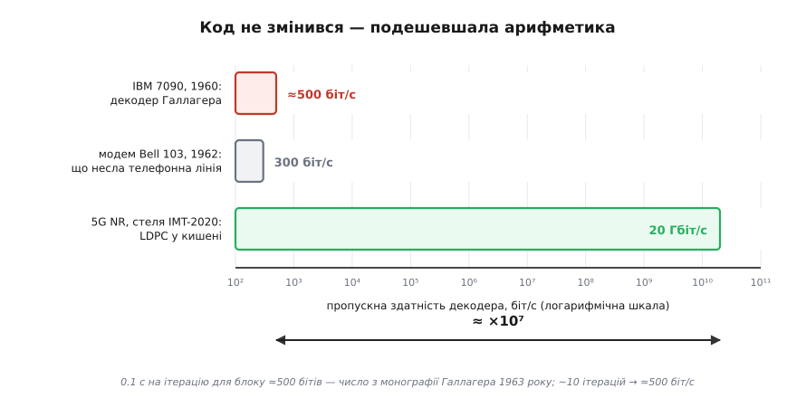

# 📜 Тридцять років у шухляді: хто винайшов LDPC і чому його не почули

Про LDPC заведено казати, що він «випередив свій час». Це не пояснення, а переказ загадки іншими словами. Код придумали 1960 року; наступні тридцять років його майже ніхто не читав, а в масовий кремній він пішов аж після 2003-го. За весь цей час код не змінився ні на біт. Змінилося щось інше. Що саме?

Відповідь тут напрочуд конкретна, і вона не про геніальність винахідника й не про сліпоту сучасників. Вона про ціну множення. Ідея, якій потрібно забагато арифметики, не «випереджає час» — вона просто лежить, доки арифметика не подешевшає. А поки лежить, її встигають забути навіть ті, хто її придумав.

## Обіцянка, яку ніхто не міг виконати

Почалося все з боргу, який Клод Шеннон (*Claude Shannon*) залишив по собі 1948 року. [Теорема кодування каналу](book:communications/channel-coding-theorem) стверджує: для будь-якого зашумленого каналу є число C — пропускна здатність, — і нижче нього можна передавати як завгодно надійно. Що треба знати про її доведення: Шеннон не будував код. Він узяв **випадковий** код (кинув монету на кожен біт кожного кодового слова), усереднив імовірність помилки по всіх таких кодах і показав, що середнє прямує до нуля. Якщо середнє мале, то хоч один код малий — насправді майже всі. Це доведення існування через усереднення: воно гарантує, що добрий код у купі є, і мовчить про те, котрий саме.

Але справжня халепа була не в тому, що код безіменний. Халепа в тому, що з випадковим кодом робити нíчого. Щоб декодувати, приймач мусить порівняти прийняте слово з **усіма** кодовими словами й вибрати найближче. Для скромних 500 бітів даних це 2⁵⁰⁰ порівнянь:

```
2⁵⁰⁰ ≈ 3.3 · 10¹⁵⁰

для порівняння:
  атомів у видимому Всесвіті   ≈ 10⁸⁰
  секунд від Великого вибуху   ≈ 4 · 10¹⁷
```

Тобто випадковість — це одночасно і причина, чому код добрий, і причина, чому він непридатний. У доведенні Шеннона ці дві речі зварені в одне: та сама монета, що робить код близьким до межі, робить його нерозв'язним. Розчепити їх ніхто не вмів.

Поле знайшло обхід: **структура**. Якщо код не випадковий, а зроблений з алгебри, то декодування перестає бути перебором і стає розв'язанням рівнянь. Річард Геммінг (*Richard Hamming*) показав це 1950-го, а на межі десятиліть надійшла важка артилерія — [коди BCH](book:communications/bch-codes) (циклічні коди над скінченними полями, де синдром помилки розкладають у систему рівнянь і розв'язують її алгеброю) і коди Ріда — Соломона. Тут варто зупинитися на іменах, бо акронім «BCH» бреше: код незалежно знайшли французький математик Алексіс Окенгем (*Alexis Hocquenghem*, 1959) та Радж Чандра Бос (*Raj Chandra Bose*) з Двіджендрою Кумаром Рей-Чаудгурі (*D. K. Ray-Chaudhuri*) 1960 року — і в абревіатурі прізвище Рей-Чаудгурі помилково зрізали до «Chaudhuri». Статус: усталений факт, згаданий навіть у довідкових джерелах як відома неточність.

Обхід працював, але за нього платили. Структура — це протилежність випадковості, а близькість до межі Шеннона трималася саме на випадковості. Алгебраїчні коди декодувалися швидко й лишалися за кілька децибелів від стелі. Прірва не закривалася.

## Аспірант, якому дісталася ця задача

1960 року в Массачусетському технологічному інституті цю задачу отримав аспірант Роберт Галлагер (*Robert G. Gallager*, нар. 29 травня 1931). Шлях у нього був не кабінетний: бакалаврат Пенсильванського університету 1953-го, рік у Bell Telephone Laboratories, два роки у військах зв'язку США, і аж потім MIT — магістратура 1957-го, докторат (Sc.D.) 1960-го.

Керівником був Пітер Еліас (*Peter Elias*) — і це важлива деталь, бо Еліас належав до «ймовірнісного» крила теорії кодування, а не до алгебраїчного. Саме він 1955 року в статті «Coding for noisy channels» увів [згорткові коди](book:communications/convolutional-codes) (кодер не ріже потік на блоки, а ковзає по ньому, і кожен вихідний біт залежить від кількох останніх вхідних). Рецензентами дисертації були Роберт Фано (*Robert Fano*) і Джон Возенкрафт (*John Wozencraft*) — той самий, хто 1957-го винайшов послідовне декодування. Тобто Галлагер сидів у єдиному місці на планеті, де на випадковість дивилися як на інструмент, а не як на перешкоду.

І він зробив хід, якого доти не робив ніхто. Замість вибирати між «випадковий і нерозв'язний» та «структурний і посередній», він спитав: а чи можна обмежити випадковість так, щоб вона **лишилася** випадковістю, але стала розв'язною? Відповідь: зробити матрицю перевірок розрідженою. Випадкова розріджена матриця — усе ще випадкова; ансамбль таких кодів усе ще добрий. Але кожна перевірка тепер торкається жменьки бітів, а отже, декодувати можна локально: не порівнювати слово з усіма 2⁵⁰⁰ кандидатами, а дати перевіркам і бітам обмінюватися здогадами, доки ті не зійдуться.

Разом із кодом Галлагер придумав і алгоритм цього обміну — той, що згодом дістав назву поширення довіри (belief propagation). Тут ховається чи не найкращий доказ того, наскільки рано він це зробив: у 1982 році Джудея Перл (*Judea Pearl*) на конференції AAAI представив по суті той самий алгоритм для баєсових мереж, не знаючи про дисертацію, написану за двадцять два роки до того. Дві спільноти — теорія кодування і штучний інтелект — незалежно винайшли одну річ. Статус: усталено, зв'язок між ними поле визнало вже в 1990-х.

Робота вийшла двічі: скорочено — у *IRE Transactions on Information Theory* (січень 1962, т. 8, № 1, с. 21–28), повністю — монографією MIT Press 1963 року.

## Число, яке поховало код

А тепер найцікавіше. Причину цієї паузи не треба реконструювати з чуток — вона надрукована в самій монографії 1963 року, чорним по білому, рукою автора. Галлагер чесно вказав, скільки коштує його декодер: для блоків завдовжки близько 500 бітів комп'ютер IBM 7090 витрачає приблизно **0.1 секунди на одну ітерацію**.

Порахуймо, що це означає.

**Приклад: скільки коштувало декодувати 500 бітів 1960 року.**

```
дано (число — з монографії Галлагера, 1963):
  довжина блоку          n ≈ 500 бітів
  час однієї ітерації    t ≈ 0.1 с        ← на IBM 7090
  ітерацій на блок       k ≈ 10           ← типово для ймовірнісного декодування

час на один блок:
  T = k · t = 10 · 0.1 с = 1.0 с

пропускна здатність:
  R = n / T = 500 біт / 1.0 с = 500 біт/с

чим за це платили:
  IBM 7090 (перша поставка — грудень 1959)
  ціна            ≈ $2 900 000        (≈ $23 млн у цінах 2025 року)
  оренда          ≈ $63 500 / місяць
  швидкодія       ≈ 100 000 операцій з рухомою комою за секунду
  і машина при цьому НЕ РОБИТЬ БІЛЬШ НІЧОГО

з чим це порівняти:
  модем Bell 103 (AT&T, 1962) — 300 біт/с звичайною телефонною лінією
```

Висновок звучить майже як анекдот: комп'ютер за три мільйони доларів, зайнятий виключно декодуванням і більш нічим, ледве встигав за однією телефонною лінією. Навіть якби ітерація була одна-єдина (5000 біт/с), картина не рятується — обслуговувати десяток модемів найдорожчою машиною країни ніхто не збирався.


*Мільйонний комп'ютер, зайнятий тільки декодуванням, ледве встигав за однією телефонною лінією. За наступні шістдесят років код не змінився — подешевшала арифметика.*

Але є деталь ще промовистіша. У тій самій монографії Галлагер пояснює, чому його симуляції охоплюють лише сильно зашумлені канали: машинного часу вистачало тільки на випадки, де ймовірність помилки декодування більша за 10⁻⁴. Тобто він фізично не міг подивитися туди, де його код показує себе найкраще. Реальним системам потрібні 10⁻⁶ і нижче; саме там LDPC робить те, заради чого його варто брати, — і саме той діапазон був за обрієм обчислювальних можливостей. Автор винаходу не мав змоги побачити власний винахід у роботі.

> 🔧 **Навіщо це.** Тут видно механізм, який працює далеко за межами теорії кодування: доля ідеї залежить не лише від того, чи вона правильна, а й від того, скільки арифметики вона просить і скільки та арифметика коштує сьогодні. Галлагер не помилився в жодній формулі. Він просто виставив рахунок, який епоха не могла оплатити, — і рахунок пролежав неоплаченим, доки транзистор не подешевшав на сім порядків. Якщо ваша ідея потребує на три порядки більше обчислень, ніж дає ринок, ви не «випередили час»: ви написали вексель із невідомою датою погашення.

## Мовчання самого винахідника

Далі історія робить поворот, який руйнує романтичну версію «геній усе бачив, а світ ні». 1968 року Галлагер видав підручник «Information Theory and Reliable Communication» — книжку, що поставила теорію інформації на строгу математичну основу й десятиліттями лишалася взірцевою. У ній дев'ять розділів, серед них — «Techniques for Coding and Decoding». LDPC там немає.

Автор не згадав власний винахід у власному підручнику через п'ять років після монографії. Статус доказовості розділімо надвоє. Сам факт відсутності — те, на що звертають увагу фахівці з поширення довіри (зокрема Джонатан Єдідія, *Jonathan Yedidia*), і він узгоджується зі змістом книжки. А от **причина** — суто здогад: чи то Галлагер вважав тему закритою монографією 1963 року, чи то й сам не бачив у ній практики. Жодних його слів на це не знайдено, і чесніше сказати «не знаємо», ніж вигадати мотив.

Так чи так, наслідок однозначний: код лишився без адвоката. Найкраща книжка галузі, з якої вчилося ціле покоління, про LDPC мовчала.


*Тридцять років між монографією і турбокодами — це не пауза в роботі, а пауза в увазі. Всередині смуги працювали одиниці, і їх не почули.*

## Хто все-таки не забув

Забуття було не абсолютним, і чесна історія мусить це сказати — без перебільшень в жоден бік.

1975 року в московському Інституті проблем передачі інформації (ІППІ) Віктор Зяблов і Марк Пінскер (*Mark Pinsker*, 24 квітня 1925 — 23 грудня 2003; учень Колмогорова, згодом лауреат премії Шеннона 1978 року й медалі Геммінга 1996-го) опублікували в «Проблемах передачі інформації» оцінку складності виправлення помилок для низькощільних кодів Галлагера. Робота була справжня: вони показали, що число ітерацій, потрібних для виправлення, росте як логарифм довжини коду. Її й досі цитують як джерело найкращих на той час нижніх оцінок.

1982 року там-таки, в ІППІ, Григорій Марґуліс (*Grigory Margulis*) надрукував у *Combinatorica* явні конструкції графів без коротких циклів — і прямо застосував їх до низькощільних кодів. Це та сама праця, з якої виросла теорія графів-експандерів. Про Марґуліса варто сказати точно: народився 1946 року в Москві, у сім'ї литовсько-єврейського походження; Філдсівську медаль отримав 1978-го, але поїхати по неї до Гельсінкі йому не дозволили — за формулюванням джерел, через антисемітизм щодо єврейських математиків у СРСР. Те, що математик такого рівня працював у дослідному інституті, а не на університетській кафедрі, — не деталь біографії, а симптом системи. До Єльського університету він перебрався 1991 року.

Що з цього випливає — і чого не випливає. Не випливає, що «в СРСР усе відкрили першими»: код винайшов Галлагер, і Зяблов із Пінскером у своїй назві це прямо визнають — «коди Галлагера». Випливає інше й цікавіше: об'єкт не був невидимим. Кілька дуже сильних людей його бачили, розуміли й розвивали. Але одна школа за залізною завісою, що друкується в журналі з багаторічним лагом перекладу, не робить моди. Ідея померла не від того, що її ніхто не читав, — а від того, що читали не ті й не там.

## Мова, якої бракувало

1981 року Майкл Таннер (*R. Michael Tanner*) надрукував у *IEEE Transactions on Information Theory* (т. IT-27, № 5, с. 533–547) статтю «A Recursive Approach to Low Complexity Codes». Він не воскрешав Галлагера — він розв'язував ширшу задачу: як зібрати довгий код із коротких підкодів і двочасткового графа. Побічним продуктом вийшла картинка, якої бракувало всім: код як граф, декодування як обмін вздовж ребер.

Це дало **мову**. Доки розріджений код був матрицею, він був окремим фокусом. Щойно він став графом, стало видно, що на графі можна робити те саме з чим завгодно. Статтю Таннера теж не почули одразу — вона чекала свого моменту разом із кодом, який описувала.

## 1993: двоє «чужих» ламають бар'єр

Момент настав із зовсім несподіваного боку. У травні 1993-го на конференції IEEE ICC у Женеві (23–26 травня, с. 1064–1070) троє з Вищої національної школи телекомунікацій Бретані (ENST Bretagne, Брест) — Клод Берру (*Claude Berrou*), Ален Ґлав'є (*Alain Glavieux*, 4 липня 1949, Париж — 25 вересня 2004) і Пуня Тітімаджшіма (*Punya Thitimajshima*, 9 листопада 1955 — 2006), тайський аспірант, що того ж року захистив у Бресті докторат, — доповіли турбокоди. Їхня схема підходила до межі Шеннона на частки децибела.

Реакція зали ввійшла в історію галузі. Мало хто з визнаних фахівців повірив: рахували, що французи десь схибили в обчисленнях; за свідченням IEEE Spectrum, багато хто вважав твердження настільки безглуздими, що навіть не став читати статтю. Берру пізніше пояснював це так: цифровий зв'язок стояв на важкій математиці, і виправлення помилок вважали справою математиків — а він був схемотехніком. Скепсис розтанув просто: інші лабораторії відтворили результат, і він підтвердився.

Тут доречна ще одна точність в атрибуції. Тітімаджшіма — співавтор тієї самої статті ICC'93 і разом із Берру та Ґлав'є лауреат Golden Jubilee Award за технологічну інновацію від IEEE Information Theory Society (ISIT, Кембридж, серпень 1998). Але базову патентну заявку (подану 23 квітня 1991 року, права відійшли France Télécom) виписано на Берру одноосібно; медаль Геммінга 2003 року дісталася Берру й Ґлав'є без нього; а популярні перекази — зокрема згаданий нарис IEEE Spectrum — розповідають історію про «двох невідомих інженерів» і третього не згадують зовсім. Він помер 2006 року, встигнувши стати доцентом Технологічного інституту короля Монгкута в Ладкрабанзі. Факти тут задокументовані; висновки кожен зробить сам.

Для LDPC значення турбокодів було не в самому коді, а в доказі принципу: **ітеративне декодування працює**. Бар'єр, який тридцять років вважали практичною межею, виявився не межею. І тоді у поля виникло природне питання: а чи є ще щось таке?

## Перевідкриття

Було. І знайшли його люди, які прийшли не з теорії кодування.

Девід Маккей (*David J. C. MacKay*, 1967–2016) був фізиком у Кембриджі й займався баєсовим висновком та нейронними мережами. Редфорд Ніл (*Radford M. Neal*) із Торонто — теж баєсівець, автор гамільтонового методу Монте-Карло. Обидва звикли думати про задачі як про висновок на розріджених імовірнісних структурах — і саме тому впізнали те, повз що коригувальники ходили тридцять років. Спершу вийшла стаття «Good codes based on very sparse matrices» (конференція IMA з криптографії та кодування, Сайренсестер, 17–19 грудня 1995, с. 100–111), а тоді — та, що дала назву всій хвилі: «Near Shannon limit performance of low density parity check codes», *Electronics Letters*, т. 32, № 18 (1996), с. 1645–1646 (передрук із виправленнями — т. 33, с. 457–458).

Заголовок красномовний. Вони шукали власний добрий код на розріджених матрицях, а знайшли — Галлагера, який усе це зробив за тридцять три роки до них.

Того ж 1996 року картина склалася остаточно з двох боків. Ніклас Віберґ (*Niclas Wiberg*) у дисертації в Лінчепінзі («Codes and Decoding on General Graphs», № 440) показав, що безліч ітеративних декодерів — окремі випадки двох алгоритмів на графах, «мінімум-сума» і «сума-добуток»; отже, турбокоди і LDPC — не суперники, а родичі, дві точки одного простору. А Майкл Сіпсер (*Michael Sipser*) і Деніел Спілман (*Daniel Spielman*) статтею «Expander codes» (*IEEE Trans. Inform. Theory*, т. 42, 1996, с. 1710–1722) підвели під розріджені коди експандерні графи — і дали явну, не випадкову, конструкцію з доведеною лінійною складністю декодування. Нитка, що починалася в Марґуліса 1982-го, замкнулася.

## Чому це було більше, ніж знахідка в шухляді

Тут спокусливо поставити крапку на «знайшли забуте». Але це буде неправда, і неправда, що применшує 1990-ті.

Коди Галлагера були **регулярними**: кожен біт входив в однакову кількість перевірок, кожна перевірка накривала однакову кількість бітів. Красиво, аналізовно — і не оптимально. Ключ, якого в оригіналі не було, знайшли Майкл Лубі (*Michael Luby*), Майкл Міценмахер (*Michael Mitzenmacher*), Амін Шокроллагі (*Amin Shokrollahi*) і Деніел Спілман: якщо граф зробити **нерегулярним** — навмисно дати одним бітам багато ребер, а іншим мало, — код із поширенням довіри виправляє помітно більше (технічний звіт ICSI TR-97-045, листопад 1997; журнальна версія — *IEEE Trans. Inform. Theory*, т. 47, 2001, с. 585–598). Інтуїція за цим така: біти з високим степенем швидко набирають упевненості й стають опорою, від якої довіра розтікається до бідних на ребра сусідів. Однорідність, що здавалася чеснотою, насправді була втраченою можливістю.

Далі Томас Річардсон (*Thomas Richardson*), Шокроллагі та Рюдіґер Урбанке (*Rüdiger Urbanke*) дали інструмент, щоб ці степені підбирати не навпомацки, — еволюцію густин (*IEEE Trans. Inform. Theory*, т. 47, 2001, с. 619–637). А рекорд, яким усе це увінчалося, варто назвати цифрою: Сей-Йон Чун (*Sae-Young Chung*), Дейв Форні (*G. David Forney*), Річардсон і Урбанке сконструювали код швидкості 1/2, поріг якого лежить за **0.0045 дБ** від межі Шеннона на [каналі з білим гаусовим шумом](book:communications/awgn-channel) (*IEEE Communications Letters*, т. 5, № 2, лютий 2001, с. 58–60).

Отже, чесне формулювання таке: 1990-ті не просто дістали Галлагера з полиці. Вони взяли його об'єкт і додали те, чого в ньому не було, — нерегулярність і спосіб її розрахувати. Борг Шеннона закрили спільно: ідея 1960 року плюс два кроки, зроблені через тридцять сім років.

## Патент, що штовхнув у спину

Останній поворот — не науковий, а грошовий, і без нього історія неповна.

Турбокоди були під патентом: заявка від 23 квітня 1991 року, права в France Télécom, ліцензування до кінця строку — американський патент US 5 446 747 згас 29 серпня 2013-го. LDPC не був під нічим: усе, що Галлагер зробив у 1960-х, давно й безнадійно вийшло з-під будь-якої охорони. Коли промисловість стала вибирати код для стандартів, вона побачила дві схеми зіставної якості, з яких одна безплатна. Це був не єдиний і не головний чинник, але чинник справжній.

Далі — вже суцільна хронологія перемог: DVB-S2 (2003), 10GBASE-T і Wi-Fi 802.11n (2009), обов'язковий LDPC у Wi-Fi 6 (802.11ax), і, нарешті, засідання 3GPP RAN1 #87 у Ріно (штат Невада) в листопаді 2016-го, де LDPC віддали канал даних 5G NR. Показово, що після 2013 року, коли турбопатенти згасли й фінансовий аргумент зник, LDPC нікуди не подівся — його лишили за технічні переваги, зокрема нижчу «підлогу помилок» і кращу поведінку на високих швидкостях коду.

2003 року Річардсон і Урбанке підбили підсумок статтею в *IEEE Communications Magazine* (т. 41, с. 126–131) з назвою, що не потребує коментарів: «Ренесанс низькощільних кодів перевірки парності Галлагера».

## Що з цього виходить

2020 року Роберт Галлагер отримав Японську премію в галузі «Електроніка, інформація, комунікації» — за код, який запропонував у докторській дисертації шістдесят років тому. На той момент його винахід уже сидів у кожному 5G-модемі, супутниковому приймачі й контролері SSD на планеті. Формулювання самої премії визнає паузу прямо: ідеї Галлагера не брали до вжитку наступні тридцять років, зокрема через труднощі практичного втілення. На пресконференції він сказав молодим дослідникам приблизно те, що й мав сказати саме він: не варто засмучуватися, коли зроблене здається некорисним — воно може стати корисним пізніше. Йому дев'яносто п'ятий рік, і він це побачив.

Але мораль тут — не «терпіння винагороджується». Мораль точніша й менш затишна.

По-перше, ідею вбиває не помилка, а рахунок. У Галлагера все було правильно з першого разу; його поховало число 0.1 секунди на ітерацію, помножене на ціну машини, яка це рахувала. Тридцять років код чекав не на розум, а на здешевлення множення — і дочекався: те, що коштувало три мільйони доларів і давало 500 біт/с, тепер лежить у кишені й дає гігабіти.

По-друге, забуття — це не подія, а відсутність події. Ніхто не ухвалював рішення забути LDPC. Просто мода пішла в бік алгебри, підручник автора його не згадав, найсильніші з тих, хто пам'ятав, друкувалися не тією мовою й не в тому журналі, а мова графів прийшла на десять років раніше, ніж стала потрібна. Кожен окремий крок був нормальний. Разом вони дали тридцять років тиші.

І по-третє, найкорисніше: воскресіння прийшло не від коригувальників. Ітеративне декодування реабілітували схемотехніки з Бреста, яких вважали не тими людьми, а сам код упізнали баєсівці з Кембриджа й Торонто, що взагалі шукали інше. Галузь тридцять років дивилася просто на об'єкт і не бачила його — бо дивилася звичним поглядом. Побачили ті, хто прийшов збоку й не знав, що на це «не так» дивляться.
