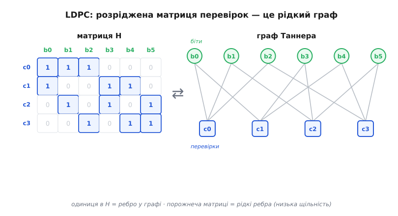
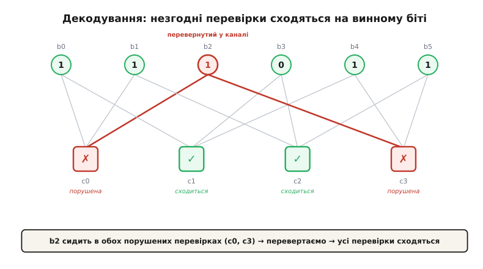
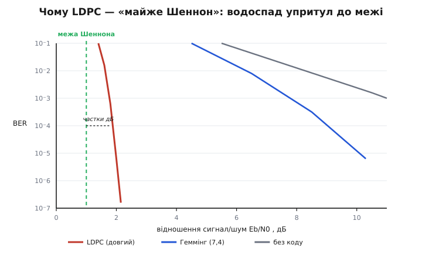

# LDPC: код розрідженої перевірки паритету

<preknowlist>
- [Біт парності](book:communications/parity-bit) — найпростіша перевірка парності: XOR групи бітів має дорівнювати нулю.
- [Лінійні блокові коди](book:communications/linear-block-codes) — кодове слово, матриця перевірок H і умова H·cᵀ = 0.
- [Смуга і межа Шеннона](book:communications/bandwidth-capacity) — теоретична стеля надійної передачі, до якої код лише наближається.
</preknowlist>

1948 року [Клод Шеннон довів](book:communications/channel-coding-theorem) дивовижну річ: у будь-якому зашумленому каналі є швидкість, нижче якої дані можна передавати з як завгодно малою кількістю помилок, — і що коди, здатні цієї стелі сягнути, **існують**. Доказ був жорстокий у своїй недомовленості: він гарантував, що добрий код є, але не казав ані який, ані як його декодувати. Десятиліттями найкращі практичні коди — [Геммінга](book:communications/hamming-code), BCH, [Ріда — Соломона](book:communications/reed-solomon) — лишали вперту прірву в кілька децибелів між собою і [межею Шеннона](book:communications/bandwidth-capacity). А потім виявилося, що код, який цю прірву майже закриває, тихо пролежав забутим від 1960 року — [його придумав і поховав власний час](book:communications/ldpc/hist-gallager.md).

Це LDPC — **low-density parity-check code**, код із розрідженою матрицею перевірок парності. Уся його сила тримається на трьох речах разом: звичайні перевірки парності, навмисна розрідженість матриці й декодування не алгеброю, а локальними «плітками» вздовж графа. Розберімо кожну.

## Що означає «розріджена матриця перевірок»

Будь-який лінійний блоковий код задають [матрицею перевірок H](book:communications/linear-block-codes) (parity-check matrix). Читати її просто: кожен **рядок** — це одна перевірка парності, тобто вимога, щоб XOR певної групи бітів дорівнював нулю; кожен **стовпець** — це один біт кодового слова. Слово вважають правильним, коли справджуються **всі** перевірки одразу; коротко це записують як H·cᵀ = 0, де додавання — за модулем 2 (той самий XOR, що рахує [біт парності](book:communications/parity-bit)).

Слово «low-density» (низька щільність, розрідженість) стосується саме цієї матриці: у ній майже самі нулі. Кожен рядок містить лише жменю одиниць — скажімо, шість на кілька тисяч стовпців; кожен стовпець бере участь лише в кількох перевірках. Матриця Геммінга маленька й відносно щільна; матриця LDPC — величезна (довжина слова n сягає тисяч і десятків тисяч) і майже порожня.


*Одиниця в матриці H — це ребро у графі; порожнеча матриці означає рідкі ребра. Кожен біт торкається лише двох перевірок, кожна перевірка — лише трьох бітів.*

Навіщо навмисно тримати матрицю порожньою? Відповідь розкриється у два ходи. По-перше, розріджені перевірки дають працювати швидкому локальному декодеру: кожна перевірка «спілкується» лише з кількома бітами, а не з усім словом. По-друге, довгі, майже випадкові розріджені коди доказово лягають упритул до межі Шеннона. Розрідженість — не жертва заради простоти, а те, що робить довгий добрий код узагалі придатним до вжитку.

## Граф Таннера

Ту саму матрицю H зручно намалювати як **двочастковий граф** (граф Таннера, за іменем Майкла Таннера, *Michael Tanner*, який запропонував це подання 1981 року). З одного боку — **вузли-змінні** (variable nodes), по одному на кожен біт слова; з іншого — **вузли-перевірки** (check nodes), по одному на кожен рядок H. Ребро з'єднує біт із перевіркою тоді й лише тоді, коли на їхньому перетині в матриці стоїть одиниця. Розрідженість тут видно очима: з кожного вузла виходить лише кілька ребер.

Це не просто гарна картинка. Граф перетворює декодування з алгебри на **обмін повідомленнями**: кожна перевірка стежить за своєю жменею бітів, кожен біт звітує своїй жмені перевірок — і виправлення народжується з цього локального перешіптування.

## Декодування: локальні плітки замість алгебри

Ось де LDPC заробляє свій хліб. [Код Геммінга](book:communications/hamming-code) декодують алгеброю: синдром там — це готова двійкова адреса зіпсованого біта. Для LDPC такий трюк не працює: матриця має тисячі стовпців, ніякої короткої таблиці адрес немає. Замість цього декодер діє **ітеративно й локально**.

Найпростіший варіант — жорстке «перевертання бітів» (bit-flipping), яким Галлагер і починав. Логіка майже дитяча:

1. Кожна перевірка рахує парність своїх бітів: сходиться (0) чи порушена (1).
2. Кожен біт дивиться, у скількох **порушених** перевірках він сидить. Біт, що потрапив одразу в кілька незгодних перевірок, — головний підозрюваний.
3. Перевертаємо біт (чи біти) з найбільшим числом порушених перевірок. Перераховуємо все. Повторюємо, доки всі перевірки не зійдуться (або доки не вичерпаємо ліміт спроб).

Спрацьовує це саме завдяки розрідженості. Один перевернутий біт запалює рівно ті нечисленні перевірки, у яких він бере участь, — а що перевірки рідкі й розкидані, то цей биток зазвичай єдиний, кого всі вони спільно звинувачують. Голоси перевірок сходяться на винному.


*Дві незгодні перевірки перетинаються рівно на одному біті — він і винний. Перевертання b2 гасить обидві порушені перевірки за один крок.*

**Приклад: одне перевертання лагодить слово.** Візьмімо крихітний код на 6 бітів із чотирма перевірками (кожен біт — у двох перевірках, кожна перевірка — на трьох бітах) і правильне слово 1 1 0 0 1 1. Канал перевертає третій біт.

```
перевірки коду:
  c0: b0 ⊕ b1 ⊕ b2 = 0
  c1: b0 ⊕ b3 ⊕ b4 = 0
  c2: b1 ⊕ b3 ⊕ b5 = 0
  c3: b2 ⊕ b4 ⊕ b5 = 0

надіслане слово:  b0..b5 = 1 1 0 0 1 1   (усі перевірки сходяться)
канал псує b2:            1 1 [1] 0 1 1

приймач рахує перевірки:
  c0 = 1⊕1⊕1 = 1   порушена
  c1 = 1⊕0⊕1 = 0   ок
  c2 = 1⊕0⊕1 = 0   ок
  c3 = 1⊕1⊕1 = 1   порушена

скільки порушених перевірок «дивиться» на кожен біт:
  b0:1   b1:1   b2:2   b3:0   b4:1   b5:1
                  ↑ b2 сидить в обох порушених → перевертаємо

виправлене слово: 1 1 0 0 1 1  ✓  усі перевірки знову сходяться
```

Дві незгодні перевірки перетнулися рівно на b2 — і одне перевертання відновило слово. Повний робочий декодер (жорсткий, із заміткою про м'який) — у [короткій реалізації](book:communications/ldpc/proj-bit-flipping-decoder.md).

Жорстке перевертання просте, але грубе: воно оперує голими бітами «0/1» і викидає найцінніше — **наскільки** приймач упевнений у кожному біті. Справжня сила LDPC розкривається в **м'якому** декодуванні: замість бітів вузли передають одне одному **ймовірності** (точніше — логарифми відношення правдоподібностей, log-likelihood ratio). Кожен біт починає з довіри, яку дав канал («радше 1, і доволі впевнено»), а далі перевірки й біти по черзі уточнюють ці довіри, аж поки вони не стуляться в одне узгоджене слово. Цей обмін звуть поширенням довіри (belief propagation) або алгоритмом «сума-добуток»; його [математику винесено окремо](book:communications/ldpc/math-belief-propagation.md). Саме м'яка версія підводить LDPC упритул до межі Шеннона.

## Чому «майже межа Шеннона»

Тепер видно, звідки береться рекорд. Шеннон обіцяв, що довгі майже випадкові коди — добрі; та сама випадковість, що робить їх добрими, зазвичай робить їх і нерозв'язними для декодера. Розрідженість LDPC розриває цей вузол: код лишається довгим і майже випадковим (а отже, близьким до межі), але його граф — рідкий, тож локальний обмін довірами збігається за кілька проходів. Довгий блок дає близькість до стелі, розріджений граф дає спосіб її досягти.


*Схематично. «Водоспад» LDPC стоїть за частки децибела від межі Шеннона — там, куди класичні коди дотягуються лише коштом набагато сильнішого сигналу.*

На практиці добре сконструйований LDPC на кілька тисяч бітів із м'яким декодуванням підходить до [межі Шеннона](book:communications/bandwidth-capacity) на частки децибела — краще за [Рід — Соломона](book:communications/reed-solomon) на «білому» шумі й нарівні з турбокодами. Саме [турбокоди](book:communications/turbo-codes) 1993 року першими пробили цей бар'єр і сколихнули інтерес до ітеративного декодування — а вслід за ними згадали й воскресили LDPC. Обидва сімейства сьогодні ділять ринок: у 5G, наприклад, LDPC несе канал даних, а споріднені [полярні коди](book:communications/polar-codes) — канал керування.

> 🔧 **Навіщо це.** LDPC — причина, з якої ваш Wi-Fi, 5G-модем, супутникова тарілка й SSD витискають ту швидкість і надійність, що мають. Формула вибору проста: коли блок даних досить довгий, шум у каналі радше випадковий, ніж пакетний, а залізо здатне ганяти багато перевірок паралельно — LDPC підходить до теоретичної межі ближче за будь-який класичний код і платить за це найменшим надлишком. Його ітеративність, що колись здавалася вадою, у сучасному чіпі стає перевагою: тисячі перевірок рахуються **водночас**.

## Ціна

Задарма таке не дається. Довгий блок означає **затримку й пам'ять**: щоб зібрати й обробити тисячі бітів, треба їх дочекатися — тож для крихітних керівних повідомлень LDPC недоречний (там виграють короткі коди). Ітеративність дає **змінну затримку** — просте слово декодується за один прохід, важке вимагає десятка. І є підступний **поріг помилок** (error floor): на дуже низьких рівнях помилок деякі коди впираються в «підлогу» через короткі цикли у графі, і крива надійності перестає падати. Тому матрицю H конструюють обережно — уникають коротких циклів і надають їй регулярної структури (quasi-cyclic), щоб і кодування було дешевим, і підлога — низькою.

## Де воно живе

LDPC давно вийшов із теорії в кремній: Wi-Fi (802.11n і новіші), канал даних 5G NR, супутникове мовлення DVB-S2/S2X і DVB-T2, ефірне ATSC 3.0, дротовий 10GBASE-T, WiMAX, контролери SSD-накопичувачів. Скрізь, де треба вичавити з каналу максимум надійних бітів на кожен герц смуги, розріджені перевірки парності виявляються найближчим до Шеннона практичним вибором.

---

Підсумок: **LDPC** — це [лінійний блоковий код](book:communications/linear-block-codes), заданий **розрідженою** матрицею перевірок парності: кожна перевірка накриває лише кілька бітів, кожен біт — лише в кількох перевірках. Ту матрицю малюють графом Таннера, а декодують не алгеброю, а **ітеративним локальним обміном** — від грубого перевертання бітів до м'якого поширення довір. Саме поєднання довгого майже випадкового коду (близькість до [межі Шеннона](book:communications/bandwidth-capacity)) із розрідженим графом (розв'язність і паралельність) дає LDPC його рекордну надійність — і місце всередині Wi-Fi, 5G, супутникового ТБ і SSD.
