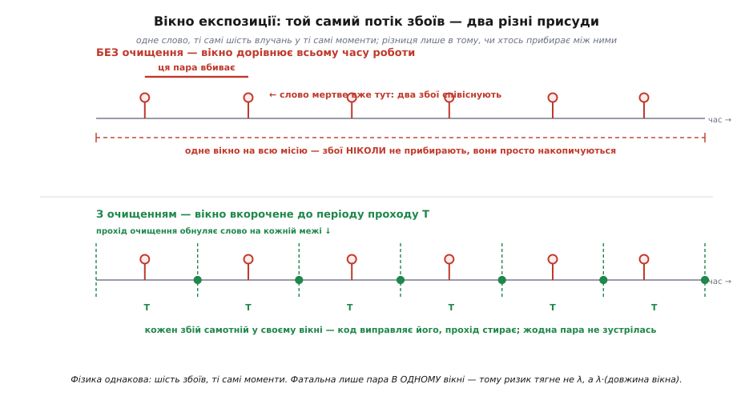
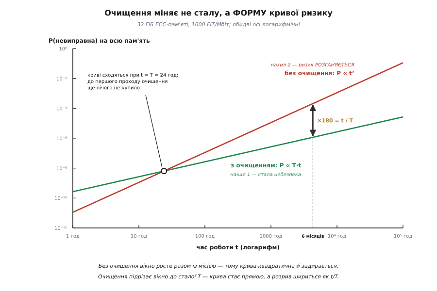
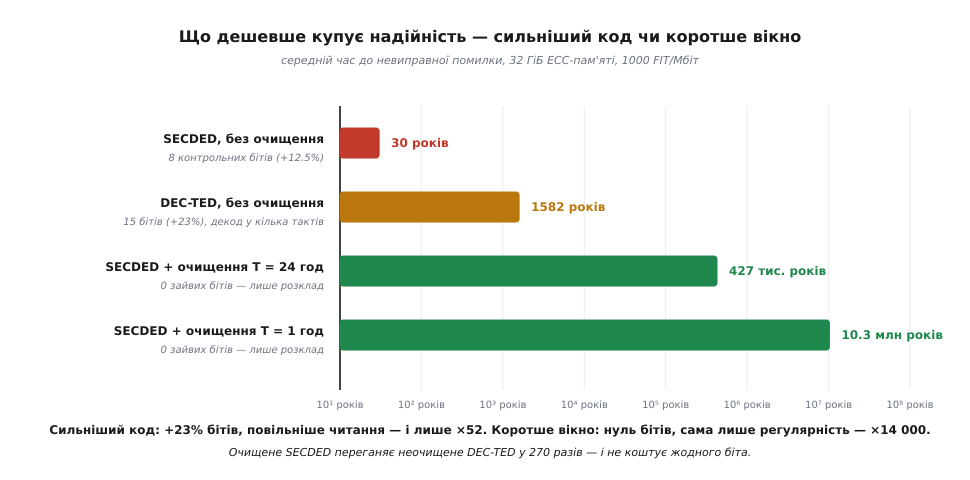

# 🧮 Математика перегонів: чому ризик тягне λ²·T

Прикидка «вкоротили вікно вдвічі — вдвічі менше ризику» звучить переконливо й дає правильну відповідь. Але вона тримається на слові, а не на виведенні, і одразу впирається в питання, на які на пальцях не відповісти. Чому ризик падає **лінійно** з періодом проходу, хоча для біди треба **два** збої — здавалося б, має бути квадрат? Що робити, коли слів не одне, а мільярди, і збої летять не за розкладом, а випадковим потоком? І головне — якщо очищення таке дешеве, то чи не простіше замість нього просто взяти сильніший код?

Зберімо цю арифметику з першопричин. Виявиться, що вся вона тримається на одному-єдиному добутку двох імовірностей, а відповідь на останнє питання — найцікавіша з трьох.

## Що саме ми рахуємо

Домовмося про подію, ймовірність якої шукаємо, бо в надійнісних викладках саме тут ховається половина помилок.

Пам'ять — це **N** слів. Кожне слово захищене кодом, що виправляє один перевернутий біт і виявляє два, — [SECDED](book:communications/secded). Ключова властивість цього коду для нас одна: у кожного слова є **бюджет міцності рівно в один биток**. Один збій — код полагодить; два збої, що **співіснують** в одному слові, — уже ні.

Звідси й означення події, яку ми рахуємо:

```
НЕВИПРАВНА ПОМИЛКА  ⟺  два (чи більше) перевернуті біти
                        СПІВІСНУЮТЬ в одному слові
```

Слово «співіснують» тут несе всю вагу. Два збої в одному слові, розділені в часі проходом очищення, — це **не** подія: перший прибрали, перш ніж прилетів другий, і код мав справу з двома окремими одинаками. Два збої в одному слові **між** проходами — подія. Два збої в **різних** словах — теж не подія, хоч би скільки їх було: у кожного слова свій окремий бюджет.

Отже, невиправна помилка — це **збіг** двох незалежних подій у двох вимірах одночасно: та сама **адреса** й те саме **вікно часу**. Уся подальша математика — це лічба таких збігів.

> 🔧 **Навіщо це.** Розрізнення «співіснують» проти «просто трапилися» — не педантизм, а те, що робить очищення осмисленим. Якби для біди досить було двох збоїв за час роботи в одному слові, очищення не допомагало б **узагалі**: воно ж не зменшує кількість влучань, частинки летять із тим самим темпом. Очищення виграє рівно тому, що подія вимагає **співіснування**, — а співіснування можна розірвати в часі, не зачепивши фізику. Саме тому нижче період проходу T стоїть у формулі поруч із фізичним темпом збоїв λ як рівноправний множник: одне множиться на друге.

## Модель: збої як пуассонів потік

Тепер треба описати, як прилітають збої. Візьмімо найпростішу модель, яка не бреше, — [пуассонівський потік](book:math/poisson-process): події трапляються незалежно одна від одної, зі сталим середнім темпом, і жодна не «пам'ятає» попередніх.

Чому саме він тут доречний — варто продумати, а не приймати на віру. Пуассонів потік випливає з трьох припущень, і в нашому випадку кожне має фізичну підставу:

**Незалежність.** Частинка, що перекинула біт годину тому, ніяк не впливає на те, чи прилетить наступна. Космічні частинки й продукти розпаду в корпусі мікросхеми не змовляються між собою.

**Сталий темп.** Середня густина потоку не міняється з часом: скільки збоїв на годину було вчора, стільки й завтра. (Це припущення найкрихкіше — про це нижче, у розділі про межі моделі.)

**Відсутність пам'яті.** Комірка, у яку щойно влучили, не стає більш чи менш вразливою до наступного влучання. Поодинокий збій (англ. *soft error*) не псує кремній — він лише перекидає збережене значення; наступний запис робить комірку такою ж, як усі.

Позначмо темп збоїв **в одному слові** через **λ** (лямбда) — це середня кількість перевернутих бітів на слово за годину. Він складається просто, бо кожен біт слова — окрема мішень, і влучання в будь-який із них однаково витрачає бюджет:

```
λ  =  λ_біт · (w + c)

  λ_біт — темп збоїв на ОДИН біт
  w     — біти даних у слові        (64)
  c     — контрольні біти коду      (8)
```

Ця дрібниця варта окремої уваги. У сумі стоїть **w + c**, а не сама лише w: контрольні біти живуть у тому самому кремнії й ловлять частинки нарівні з даними. Перекинутий контрольний біт — такий самий поодинокий збій і так само з'їдає бюджет міцності слова, хоч у ньому й немає жодного біта користувацьких даних. Тож для звичного 64-бітного слова з 8 контрольними бітами мішень має **72** біти, а не 64.

Полічити «по даних» означало б занизити λ на 12.5% — і помилка на цьому не спиниться. Нижче побачимо, що ризик іде як **λ²**, тож ті 12.5% у темпі обертаються на 1.125² ≈ **27%** у самому ризику. Дрібниця, яку легко проґавити, коштує чверті відповіді.

## Одне слово, одне вікно

Зведімо задачу до найменшої: одне слово, один проміжок часу завдовжки **v** (вікно), протягом якого ніхто нічого не прибирає. Яка ймовірність, що слово помре — тобто набере в цьому вікні **два або більше** збої?

Пуассонів потік дає точну відповідь без наближень. Імовірність рівно **k** подій за час v при темпі λ:

```
P(k) = e^(−λv) · (λv)^k / k!
```

Померти — значить не отримати ні нуля, ні одного збою, а щось більше. Тому зручніше рахувати через доповнення — через ті два випадки, коли слово вижило:

```
P(0) = e^(−λv)                     нічого не прилетіло
P(1) = e^(−λv) · (λv)               один збій — код його виправить

P(≥2) = 1 − P(0) − P(1) = 1 − e^(−λv) · (1 + λv)
```

Це вже повна відповідь, але з неї не видно **форми**. Розкриймо її для реального режиму. У живій пам'яті λv — величина мікроскопічна: слово ловить збій раз на десятки мільйонів годин, а вікно — доба чи місяці. Тобто λv ≪ 1, і експоненту можна розкласти в ряд:

```
e^(−λv) = 1 − λv + (λv)²/2 − (λv)³/6 + …

e^(−λv)·(1 + λv) = (1 − λv + (λv)²/2 − …)·(1 + λv)
                 = 1 − (λv)²/2 + (λv)³/3 − …

P(≥2) = 1 − [1 − (λv)²/2 + …]  ≈  (λv)² / 2
```

Ось воно — **серце всієї теми**:

```
P(невиправна у вікні v)  ≈  (λ·v)² / 2
```

Наближення тут не «на око»: для чисел із прикладу нижче воно відхиляється від точної формули на **0.16%**. Забувши про нього, ми не втратимо нічого.

Тепер прочитаймо результат по-людськи, бо він каже більше, ніж здається. Величина λv — це просто **очікувана кількість збоїв у вікні**. Отже, ймовірність біди — це квадрат очікуваної кількості, поділений навпіл. І це рівно те, чого варто було чекати від здорового глузду: щоб сталася подія, треба **два** влучання, а ймовірність двох незалежних подій — добуток їхніх імовірностей, тобто λv · λv. Двійка в знаменнику — це поправка на те, що пара «збій A, потім збій B» і пара «збій B, потім збій A» — та сама пара, порахована двічі.

**Квадрат** — це і є ціна коду. Саме тому SECDED узагалі має сенс: без коду вистачило б **одного** збою, і ризик був би λv — величина першого порядку. Код підняв показник степеня з одиниці до двійки й тим самим із мікроскопічного λv зробив нікчемне (λv)²/2.

## Темп невиправних із очищенням: два різні підрахунки

Тепер увімкнімо очищення. Прохід іде з періодом **T**: кожне слово гарантовано перечитують, лагодять і переписують назад раз на T. Питання: який тепер **темп** невиправних помилок на одне слово — скільки їх на годину?

Порахуймо це двома незалежними способами. Якщо математика правильна, відповіді збіжаться — а сходження двох різних міркувань в одну формулу переконує сильніше, ніж будь-яке одне з них окремо.

**Спосіб перший — по інтервалах.** Очищення нарізає час на скибки завдовжки T, і кожен прохід починає слово з чистого аркуша. Тож усередині однієї скибки маємо рівно ту саму задачу, яку щойно розв'язали, з вікном v = T. Слово гине в конкретній скибці з імовірністю (λT)²/2. Скибок за годину — 1/T. Темп смертей:

```
темп = P(смерть у скибці) · (скибок за годину)
     = [(λT)²/2] · (1/T)
     = λ²·T / 2
```

**Спосіб другий — через залишкове вікно.** Подивімось не на скибки, а на кожен окремий збій. Перші збої прилітають із темпом λ. Кожен із них лягає у **випадковий** момент своєї скибки й лишається вразливим не всі T, а лише до **найближчого** проходу — тобто в середньому **T/2** (момент влучання рівномірний на скибці, тож залишок теж рівномірний від 0 до T, із середнім T/2). Поки триває цей залишок, слово чекає на **другий** збій, який приходить із темпом λ. Ймовірність, що він таки прилетить у цей залишок, ≈ λ·T/2. Отже:

```
темп = (темп перших збоїв) · P(другий встигне у залишок вікна)
     = λ · (λ · T/2)
     = λ²·T / 2
```

Ті самі λ²·T/2 — з іншого боку, з іншими проміжними величинами. Формула стійка:

```
λ_невипр  =  λ² · T / 2      (на ОДНЕ слово, за годину)
```

Другий спосіб, до речі, чесніше показує **чому** T ділиться навпіл і чому в підсумку саме така структура: **темп біди = темп першого збою × шанс, що другий устигне поки перший не прибрано**. Перший множник — чиста фізика, на неї ми не впливаємо. Другий множник — **єдине місце, куди інженер має доступ**, і сидить у ньому не λ, а T.


*Чому в формулі стоїть довжина вікна, а не сама лише кількість збоїв. Обидва рядки — **та сама фізика**: шість збоїв у ті самі шість моментів, той самий темп λ. Угорі вікно одне на всю місію, збої накопичуються — і другий же збій уже вбиває слово, бо йому нікуди подітися. Унизу проходи очищення ріжуть час на скибки завдовжки T і обнуляють слово на кожній межі; кожен із тих самих шести збоїв виявляється **самотнім у своїй скибці** й зникає безслідно. Фатальна не кількість влучань, а **пара в одному вікні** — тому ризик тягне добуток λ·(довжина вікна), а не λ саме по собі.*

## Уся пам'ять: множимо на N

Одне слово — не пам'ять. Слів **N**, кожне зі своїм бюджетом, і система вважається зламаною, коли зламалося **бодай одне** з них.

Тут стається приємне: у режимі рідкісних подій темпи просто **додаються**. Строго це — властивість накладання пуассонівських потоків: сума N незалежних пуассонівських потоків із темпом λ_невипр кожен є пуассонівським потоком із темпом N·λ_невипр. (Інтуїтивно: імовірності, що двоє слів зламаються **одночасно**, — величина другого порядку від і без того мікроскопічних чисел, тож подвійним зарахуванням можна знехтувати.)

```
Λ_система = N · λ² · T / 2        темп невиправних на всю пам'ять
```

Так само й для ймовірності за місію завдовжки t, поки вона лишається малою:

```
З очищенням:   P(t) ≈ Λ_система · t = N · λ² · T · t / 2
Без очищення:  P(t) ≈ N · (λ·t)² / 2
```

Друга формула — та сама (λv)²/2, у якій вікно v підставлене **часом усієї місії t**. І це не хиба запису, а точний зміст фрази «без очищення»: якщо ніхто не прочісує пам'ять і програма не перезаписує ці слова своїми даними (а «холодні» ділянки саме такі — вони лежать роками), то ніщо й ніколи не прибирає перший збій. **Вікно розтягується на весь час роботи машини.**

## Виграш = час_роботи / T

Тепер відповідь на перше питання лежить сама. Поділімо одне на друге:

```
        P_без_очищення(t)     N · (λ·t)² / 2         t²         t
виграш = ───────────────── = ────────────────── = ────── =  ─────
         P_з_очищенням(t)     N · λ²·T·t / 2         T·t        T
```

Скорочується **все**: і N, і двійка, і — найголовніше — **λ². Виграш не залежить ані від того, скільки в машині пам'яті, ані від того, наскільки густо летять частинки.**

```
виграш = час_роботи / T
```

Це й пояснює той самий лінійний закон, який на пальцях виглядав загадково. Обидві сторони квадратичні по λ — тому λ² при діленні зникає без сліду. Лишається чисте відношення **двох вікон**: того, яке було б без очищення (уся місія), до того, яке лишилося з ним (період проходу). Скоротили вікно з 6 місяців до доби — 4320 год / 24 год = **180 разів**. Жодної зміни в коді, жодного зайвого біта: сама лише регулярність.

Але з цієї формули випливає дещо цікавіше за саме число.

## Очищення міняє не сталу, а форму кривої

Придивімося до двох виразів іще раз — не до їхнього відношення, а до того, як кожен поводиться з часом:

```
Без очищення:   P(t) ∝ t²        квадратично — крива задирається
З очищенням:    P(t) ∝ T · t     лінійно — пряма зі сталим нахилом
```

Це **різні за природою** криві, а не одна крива з іншим коефіцієнтом. І різниця між ними — це різниця між машиною, що **старіє**, і машиною, що **не старіє**.

Без очищення небезпека наростає сама на себе. Що довше машина працює, то більше латентних збоїв у ній накопичено, то більша ймовірність, що наступна частинка влучить у слово, яке вже надтріснуте. Мовою надійності — у системи **зростаючий темп відмов**: другий рік роботи небезпечніший за перший, десятий — небезпечніший за дев'ятий. Пам'ять справді старіє, хоч жоден атом кремнію не зносився.

З очищенням картина інша. Вікно **підрізане до сталої T** і більше не росте — скільки б машина не пропрацювала. Темп відмов сталий: сьогодні рівно такий, як був у перший день і як буде на десятий рік. Система стала **безпам'ятною** — вона більше не тягне за собою свою історію.

Тому виграш t/T і **росте з часом місії**. Це не константа, яку можна записати в паспорт, — це ножиці, що розходяться. За добу роботи очищення не дає нічого (t/T = 1). За місяць — тридцятикратно. За 6 місяців — 180×. За все життя машини — на порядки більше. **Що довше ви плануєте не вимикати машину, то більше очищення важить** — і саме тому воно стало обов'язковим у серверах, які роками не бачать перезавантаження, і його майже не згадують там, де пристрій вмикають на годину.


*Чому очищення міняє саму форму ризику. Обидві осі логарифмічні, тож степенева залежність стає прямою, а показник степеня — нахилом. Без очищення (червона) вікно росте разом із місією, тому P ∝ t² — **нахил 2**, ризик розганяється сам на себе, машина старіє. З очищенням (зелена) вікно підрізане до сталої T, тому P ∝ T·t — **нахил 1**, стала небезпека, машина не старіє. Криві сходяться рівно в точці **t = T**: до першого проходу очищення ще нічого не купило, бо прибирати не встигло. Далі вони розходяться, і вертикальний розрив між ними — це і є виграш t/T: на 6 місяцях рівно ×180, а далі більше.*

## Числовий приклад: 32 ГіБ серверної пам'яті

Абстракція перевіряється числом. Візьмімо конкретну машину й порахуймо все від початку до кінця.

**Умова.** Сервер із 32 ГіБ ECC-пам'яті: слова по 64 біти даних + 8 контрольних бітів SECDED. Темп поодиноких збоїв — 1000 FIT на Мбіт. Патрульне очищення проходить усю пам'ять за T = 24 години (типове заводське значення). Місія — 6 місяців безперервної роботи, тобто t = 180 діб = 4320 годин.

Спершу розберімося з одиницею, у якій постачальники подають надійність. **FIT** (англ. *Failures In Time*) — це кількість відмов на **10⁹ годин** роботи. Для пам'яті її подають на Мбіт, і саме тому вона така зручна:

```
1000 FIT/Мбіт = 1000 відмов на 10⁹ год на 10⁶ бітів
              = 1000 / (10⁹ · 10⁶)  відмов на біт на годину
λ_біт         = 10⁻¹² збоїв на біт за годину
```

Гарне число: тисяча FIT на Мбіт — це рівно один збій на біт за трильйон годин. (Величина 1000 FIT/Мбіт — усередині класичного діапазону 200–5000 FIT/Мбіт, що його дають заміри поодиноких збоїв DRAM. Польові дані з великих парків машин, як-от відома робота Google 2009 року, дають помітно гірші цифри — десятки тисяч FIT/Мбіт, — але для нашої задачі це змістило б лише масштаб, не форму.)

Далі — темп на слово й розмір пам'яті у словах:

```
λ = λ_біт · (64 + 8) = 72 · 10⁻¹² = 7.2·10⁻¹¹  збоїв на слово за годину

N = 32 ГіБ / 8 байтів на слово
  = 34 359 738 368 / 8
  = 4 294 967 296 слів  =  2³²  ≈  4.295·10⁹
```

Перевірмо себе на величині, яку можна відчути, — як часто взагалі щось перекидається в цій планці:

```
N · λ = 4.295·10⁹ · 7.2·10⁻¹¹ = 0.309 збоїв за годину
      ≈ один поодинокий збій десь у пам'яті кожні 3.2 години
      ≈ 7.4 збоїв за добу
```

Число правдоподібне й збігається з тим, що дають польові заміри для планок такого обсягу. Зверніть увагу, що воно **велике** — сім збоїв за добу! — і кожен із них SECDED тихо виправляє. Ніякої катастрофи тут немає: катастрофа буде тільки там, де двоє з них зійдуться в одному слові.

**Тепер ризик за 6 місяців, без очищення:**

```
λ·t   = 7.2·10⁻¹¹ · 4320 = 3.110·10⁻⁷      збоїв на слово за місію
P_сл  = (λt)²/2 = (3.110·10⁻⁷)²/2 = 4.837·10⁻¹⁴     на одне слово
P     = N · P_сл = 4.295·10⁹ · 4.837·10⁻¹⁴
      = 2.08·10⁻⁴          ≈ 0.021% на машину за півроку
```

**І з очищенням, T = 24 год:**

```
λ_невипр = λ²·T/2 = (7.2·10⁻¹¹)² · 24 / 2 = 6.22·10⁻²⁰   на слово за годину
Λ_сист   = N · λ_невипр = 4.295·10⁹ · 6.22·10⁻²⁰ = 2.67·10⁻¹⁰  за годину
P        = Λ_сист · t = 2.67·10⁻¹⁰ · 4320
         = 1.15·10⁻⁶      ≈ 0.00012% на машину за півроку

Перевірка:  2.08·10⁻⁴ / 1.15·10⁻⁶ = 180.0  =  t/T = 4320/24  ✓
```

Відношення зійшлося з формулою до третьої значущої цифри — виведення тримається.

Та 0.021% на машину виглядає дрібницею, і тут число легко неправильно прочитати. Переведімо його в масштаб, у якому такі рішення й ухвалюють, — **на парк машин**:

```
10 000 серверів, півроку роботи:

без очищення:  10 000 · 2.08·10⁻⁴ = 2.1 машини впіймають невиправну
з очищенням:   10 000 · 1.15·10⁻⁶ = 0.012 машини
                                    ≈ одна така подія на 43 роки
```

Ось у чому річ. Для однієї машини обидва числа — і 0.021%, і 0.00012% — на позір однакові: «майже напевно обійдеться». Для дата-центру це різниця між **двома інцидентами щопівроку** — з падінням, розслідуванням і поясненнями — і **жодного за все життя парку**. Надійність узагалі стає відчутною лише там, де її множать на кількість.

(Спокуса перевести 0.021% за півроку в «отже, раз на 2400 років» тут була б помилкою — саме такою, від якої застерігає форма кривої. Так можна робити лише зі **сталим** темпом, а в неочищеної машини він росте. Насправді вона доживе до невиправної помилки куди швидше — нижче порахуємо, наскільки.)

## Середній час до невиправної помилки

Імовірність за фіксовану місію — не єдиний спосіб дивитися на надійність. Часто питають інакше: **скільки машина протримається в середньому**? Це MTTF (англ. *Mean Time To Failure*), і рахується він для двох наших випадків по-різному — якраз через різницю у формі кривих.

**З очищенням** усе просто, бо темп сталий. Сталий темп означає експоненційний розподіл часу до відмови, а в нього середнє — просто обернений темп:

```
MTTF_очищ = 1 / Λ_сист = 1 / (N · λ² · T / 2) = 2 / (N · λ² · T)

          = 2 / (4.295·10⁹ · (7.2·10⁻¹¹)² · 24)
          = 3.74·10⁹ годин  ≈  427 000 років
```

**Без очищення** так не можна — темп зростає, і обертати нема чого. Треба чесно проінтегрувати функцію надійності. Ймовірність, що **все** слова вижили до моменту t:

```
R(t) = [e^(−λt)·(1 + λt)]^N  ≈  exp(−N·(λt)²/2)

MTTF_без = ∫₀^∞ R(t) dt = ∫₀^∞ exp(−N·λ²·t²/2) dt
```

Цей інтеграл — класичний гаусів, і бере він себе в закритому вигляді. (Крива R(t) тут — не експонента, а **релеївська**: саме такий вигляд має надійність системи зі зростаючим темпом відмов.)

```
∫₀^∞ e^(−a·t²) dt = ½·√(π/a)         при  a = N·λ²/2

MTTF_без = √(π/2) / (λ·√N)
         = 1.2533 / (7.2·10⁻¹¹ · 65 536)        [√N = √2³² = 2¹⁶ = 65 536]
         = 2.66·10⁵ годин  ≈  30.3 роки
```

Порівняймо:

```
без очищення:   MTTF ≈ 30 років
з очищенням:    MTTF ≈ 427 000 років        ×14 000
```

І тут насторожує невідповідність, повз яку не можна пройти. Виграш за 6 місяців був **180**, а за MTTF — **14 000**. Формула ж обіцяла t/T. Де підступ?

Підступу немає — просто це та сама формула, прочитана в іншій точці. Виграш t/T **не константа, він росте з t**. Півроку — це t/T = 180. Але MTTF питає не про півроку: він усереднює по **всьому** часу до відмови, а неочищена машина живе до відмови ≈ 30 років. Підставмо цю саму місію у формулу виграшу:

```
t/T при t = MTTF_без = 2.66·10⁵ год / 24 год ≈ 11 000
```

Одинадцять тисяч проти чотирнадцяти — той самий порядок (решта різниці — форма кривої: релеївська проти експоненційної, звідки й береться множник √(π/2)). Отже, обидві цифри правдиві й кажуть одне: **виграш дорівнює t/T, порахованому на тому часі, який вас насправді цікавить.** Питаєте про півроку — отримаєте 180. Питаєте про весь строк служби — отримаєте десятки тисяч.

## Той самий підрахунок — це задача про дні народження

Числа зійшлися, але лишається питання, чи є за ними картинка, яку можна тримати в голові без формул. Є, і вона точна не як аналогія, а як тотожність.

Візьмімо неочищену машину й порахуймо, скільки збоїв у ній назбирається за час t: **k = N·λ·t** штук, розкиданих випадково по **N** словах. Питання «чи є невиправна помилка?» перетворюється на «чи впали **два** з цих k збоїв в **одне й те саме** слово?» — а це буквально **задача про дні народження**: k людей, N днів у році, чи є збіг.

Класична відповідь на неї — очікувана кількість збігів ≈ k²/(2N). Підставмо наше k:

```
k²/(2N) = (N·λ·t)² / (2N) = N·(λ·t)²/2
```

Це **точно** та сама N·(λt)²/2, яку ми вивели з ряду Тейлора для пуассонового потоку. Не схожа — тотожна, символ у символ. Дві задачі виявилися однією.

Перевірмо на числах, чи справді картинка працює. Візьмімо момент t = 30 років, той самий MTTF:

```
k = N·λ·t = 0.309 · 265 610 год ≈ 82 100 збоїв
N = 4.295·10⁹ слів

k²/(2N) = (82 100)² / (2 · 4.295·10⁹) = 0.79 очікуваних збігів
P(≥1 збіг) = 1 − e^(−0.79) ≈ 0.54
```

Тобто десь коло тридцяти років шанс, що бодай двоє з 82 тисяч збоїв зійшлися в одному з чотирьох мільярдів слів, переходить половину — рівно там, куди гаусів інтеграл поставив MTTF. Дві незалежні дороги, одна відповідь.

І тепер очищення можна пояснити **одним реченням, без жодної формули**:

> Задача про дні народження, у якій **кімната порожніє кожні T годин**.

Уся біда неочищеної пам'яті в тому, що людей у кімнаті **дедалі більше** — вони заходять і не виходять, тому збіг рано чи пізно неминучий, хай N хоч мільярд. Очищення не заважає людям заходити (темп той самий λ) і не додає днів у році (N те саме). Воно **виганяє всіх із кімнати** щоразу, як проходить. У кімнаті ніколи не збирається більше ніж k_T = N·λ·T людей — у нашому прикладі це 0.309 · 24 ≈ **7.4 особи** на чотири мільярди «днів». Збіг серед сімох — подія, якої можна чекати вічність. А от серед вісімдесяти тисяч, як показав підрахунок, — справа тридцяти років.

Ось чому в формулі стоїть **λ²·T**, а не λ² чи λ³. Квадрат — бо для збігу треба **двоє**. Множник T — бо стільки часу кімната встигає наповнитися між прибираннями.

## Чому виграє коротше вікно, а не сильніший код

Тепер найцікавіше питання. Якщо біда в тому, що бюджету «один биток» не вистачає, — чому б не купити бюджет побільше? Візьмімо **DEC-TED** (виправляє два біти, виявляє три), і хай тоді для невиправної помилки треба **три** збої. Це ж підніме показник степеня з 2 до 3 — начебто виграш більший, ніж будь-яке скорочення вікна.

Порахуймо чесно, а не на риториці. Для трьох збоїв у вікні перший ненульовий член ряду — вже кубічний:

```
P₃(≥3 у вікні v) ≈ (λ·v)³ / 6

Без очищення, за 6 місяців:
P = N·(λt)³/6 = 4.295·10⁹ · (3.110·10⁻⁷)³ / 6 = 2.2·10⁻¹¹
```

І тут — несподіванка, яку треба визнати вголос, бо вона проти нашої тези. 2.2·10⁻¹¹ проти 1.15·10⁻⁶ в очищеного SECDED: **на цій дистанції неочищений DEC-TED виграє з розгромом**, у 50 тисяч разів. Здавалося б, справу закрито на користь сильного коду.

Але подивімося на ту саму пару в MTTF — тобто спитаймо не «як за півроку», а «як воно взагалі, у довгому житті»:

```
R(t) = exp(−N·(λt)³/6)   →   MTTF = Γ(4/3) / (N·λ³/6)^⅓

DEC-TED, БЕЗ очищення:      MTTF ≈ 1.39·10⁷ год  ≈  1 580 років
SECDED + очищення 24 год:   MTTF ≈ 3.74·10⁹ год  ≈  427 000 років
```

Картина перевернулася: **очищене SECDED переганяє неочищене DEC-TED у 270 разів**. Тим часом сильний код коштував **+15 контрольних бітів замість 8** (+23% пам'яті замість +12.5%) і декодера, що працює кілька тактів замість одного — на **кожному** читанні, довічно, у критичному шляху. Очищення не коштувало **жодного біта**.

Чому ж відповідь так різко залежить від того, на якій дистанції питати? Бо це знову **різні форми кривих**, а не різні сталі:

```
Без очищення, хай код який завгодно:  вікно = t, і воно РОСТЕ з місією
    SECDED:   P ∝ t²
    DEC-TED:  P ∝ t³        сильніше, але однаково росте

З очищенням:  вікно = T, і воно СТАЛЕ
    SECDED:   P ∝ T·t       лінійно, назавжди
```

Ось у чому суть, і її варто сказати прямо. **Сильніший код піднімає поріг. Очищення прибирає накопичення.** Неочищена пам'ять із будь-яким кодом однаково старіє — просто DEC-TED старіє повільніше й починає з нижчої точки. Місія кінець кінцем усе одно приходить у ту точку, де вікно завдовжки в роки набирає скільки треба збоїв: спершу два, потім три, потім скільки завгодно. Показник степеня лише **відкладає** зустріч, тоді як очищення **скасовує** саму умову, за якої вона можлива.

Це видно й на самих формулах. У неочищеного варіанта t стоїть **у степені** — і сама місія працює проти вас. В очищеного t стоїть **лінійно й окремо** від T, а T — величина, яку ви призначаєте. Час перестав бути ворогом і став просто множником.

І остання, найпрактичніша частина відповіді — **ціна за одиницю виграшу**:

```
Сильніший код (SECDED → DEC-TED):
    ціна:   +15 бітів замість 8 (+23% кремнію), декод у кілька тактів
            на кожному читанні, ширша шина, більше енергії — назавжди
    виграш: ×52  (30 років → 1 580)

Коротше вікно (T = 24 год):
    ціна:   нуль бітів, нуль тактів. Фонова задача або галочка в BIOS
    виграш: ×14 000  (30 років → 427 000)

Іще коротше вікно (T = 1 год, «розширений режим»):
    ціна:   та сама — нуль. Інше значення в тому самому полі
    виграш: ×340 000  (30 років → 10.3 млн)
```

Останній рядок і є вирок. Перехід із доби на годину — це **зміна числа в налаштуванні**, і він дає ×24 понад те, що вже було. Щоб купити ті самі ×24 через код, довелося б перепроєктувати масив, шину й декодер. Ось чому T виграє: не тому, що математично сильніший — по показнику степеня він якраз слабший, — а тому, що це **єдиний множник у формулі, який змінюється безкоштовно й має гігантський діапазон**. λ дала природа. N задав замовник. Код упаяний у кремній і платиться на кожному читанні. А T — це просто **розклад**, і його можна крутити на чотири порядки, не торкнувшись жодного транзистора.


*Що дешевше купує надійність. Шкала логарифмічна — кожна поділка вдесятеро. Сильніший код (DEC-TED) коштує +23% кремнію й кількатактовий декод на **кожному** читанні, а дає ×52. Очищення не коштує **жодного біта** — сама лише регулярність — і дає ×14 000; перехід із доби на годину додає ще ×24 тією ж ціною, тобто ніякою. Очищене SECDED переганяє неочищене DEC-TED у 270 разів. Показник степеня в коду вищий, але T — єдиний множник, що змінюється безкоштовно й на чотири порядки.*

Звідси й практичне правило: **T купують першим**, бо він безкоштовний, а код підсилюють уже потім — коли T дотиснули до межі, яку дозволяє шина, і потрібного все ще бракує. Вони не конкуренти, вони множаться; просто один із множників роздають задарма.

## Де ця модель бреше

Модель варта рівно стільки, скільки чесності в переліку її меж. Наша спирається на припущення, і кожне з них десь ламається.

**Збої не завжди поодинокі.** Одна частинка під кутом здатна перекинути **два сусідні біти одразу** (англ. *multi-bit upset*). Для нашої математики це катастрофа не тому, що страшно, а тому, що подія **не проходить через модель**: два біти з'явилися **одночасно**, накопичення не було, вікно ні до чого. Хоч чистіть щосекунди — не допоможе. Це і є справжня межа очищення: воно перемагає **накопичення незалежних** збоїв і **безсиле** проти одномоментних. Саме тут — і тільки тут — сильніший код (або рознесення сусідніх бітів по різних словах) стає не розкішшю, а єдиним виходом. Обидва механізми потрібні, бо кожен закриває те, чого не може другий.

**Другий збій у той самий біт — не збій.** У наших викладках темп другої події — λ, тобто λ_біт·(w+c). Насправді трохи менше: якщо частинка влучить рівно в той біт, що вже перекинутий, вона поверне його **назад** і слово самé вилікується. Чесний темп — λ_біт·(w+c−1), тобто 71/72 від нашого. Це 1.4% — менше за похибку, з якою взагалі відомий сам FIT, тож у формулі ним нехтують. Але знати, що там не рівно квадрат, корисно.

**Не всі відмови м'які.** Ми моделювали лише поодинокі збої — перевернуті біти в справному кремнії. Планка вміє й **ламатися**: комірка залипає, лінія обривається, чип відмовляє. Такий дефект незмінно псує біт у **кожному** слові ряду й **не лікується** переписуванням. Для очищення це найгірший сценарій: воно ходитиме, писатиме, а біт вертатиметься — і слово назавжди лишиться з витраченим бюджетом, чекаючи, коли поряд ляже м'який збій. Тоді темп невиправних стає **λ·(частка уражених слів)** — **першого** порядку по λ, а не другого. Це вже зовсім інший, значно гірший закон, і саме тому польові дані з великих парків (де твердих дефектів вистачає) виглядають похмуріше за нашу чисту пуассонову оцінку. Так само, до речі, і лічильник виправних помилок, що росте з **однієї** адреси, — це майже напевно не частинки, а планка, яка сиплеться.

**Темп λ не сталий.** Потік космічних частинок залежить від висоти (на висоті польоту літака він на порядки густіший, ніж на рівні моря), від широти, від сонячної активності. Стала λ — це усереднення. Для сервера в дата-центрі воно чудове; для авіоніки чи супутника — ні, і там рахують по найгіршому.

**Саме очищення не безкоштовне.** Ми весь час казали «T нічого не коштує», і в бітах це правда. Але прохід їсть **пропускну здатність**: читання й записи очищення конкурують за шину з програмою. Це й є та межа, об яку впирається спокуса поставити T = 1 секунда. Утім, порахуймо, наскільки та межа далеко: 4.3·10⁹ слів за добу — це 50 тисяч слів за секунду, тобто **0.4 МБ/с** проти десятків ГБ/с шини. Частка в мільйонні. Навіть «розширений режим» із T = 1 год — це 10 МБ/с, теж дрібниця. Ось звідки береться фраза «T роздають задарма»: у серверній RAM обмеження на нього насправді не пропускна здатність, а обережність.

**N — не завжди слова.** Ми лічили слова, бо бюджет у SECDED — на слово. Для інших схем «одиниця з бюджетом» інша: у кода на кадр конфігурації — кадр, у чипкіла — символ. Формула не міняється, міняється, що підставляти в N і λ.

Але жодна з цих поправок не чіпає головного. Скільки б їх не накласти, у виразі для темпу невиправних помилок незмінно лишаються поруч два множники: **λ, яку дала фізика, і T, яку призначили ви**. Уся суть очищення в тому, що другий множник є в цій формулі взагалі — і що коштує він лише регулярності.
