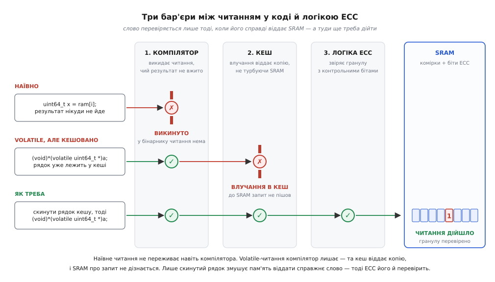
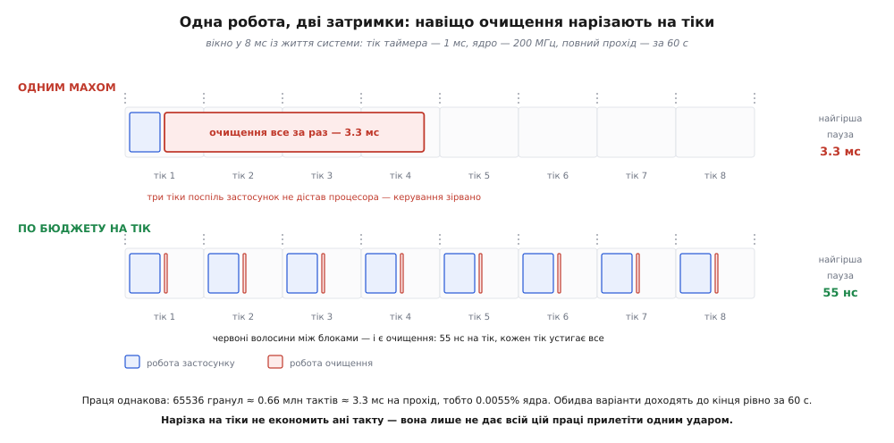

# ⚙️ Цикл очищення в коді: сорок рядків, які легко написати неправильно

Уявімо звичайну ситуацію. У вас мікроконтролер із SRAM під захистом [SECDED](book:communications/secded) — код чесно виправляє поодинокий перевернутий біт у кожній гранулі й виявляє (та вже не лагодить) два. Ви заглядаєте в довідник, шукаєте, як увімкнути патрульний обхід, і не знаходите: контролер пам'яті вміє перевіряти й виправляти, але сам по пам'яті не ходить. Прибиральника нема. Отже, прибиральником доведеться стати вам.

Задача на вигляд — вправа з першого курсу: пробігти пам'ять і кожне слово прочитати. Три рядки. І майже кожна деталь у цих трьох рядках виявиться не такою, як здається: читання, яке ви напишете, може не дійти навіть до бінарника; те, що дійшло до бінарника, може не дійти до пам'яті; а те, що дійшло до пам'яті й знайшло збій, може його не полагодити — або полагодити так, що зіпсує сусідні дані. Розберімо цикл по одному рішенню за раз.

### Що ми будуємо і за якими правилами

Перш ніж писати, домовмося про вимоги — далі кожен рядок коду відповідатиме котрійсь із них.

**Повнота.** Кожну гранулу ділянки треба відвідати хоча б раз за період `T`. Не «загалом часто», а з гарантією: якщо ми обіцяли прохід за хвилину, то за хвилину курсор мусить дійти до кінця.

**Досяжність.** Відвідини мають означати справжнє звертання до масиву комірок. Читання, яке з'їв компілятор чи кеш, не перевірило нічого — воно лише створило ілюзію, що пам'ять під наглядом.

**Ремонт.** Знайдений поодинокий збій мусить зникнути з комірки, а не лише з даних, які поїхали в процесор. Інакше ми зробили діагностику, а не очищення.

**Непомітність.** Застосунок не має відчути прибиральника — ані в середньому завантаженні, ані, що набагато важливіше, в найгіршій затримці.

І ще одне обмеження, про яке легко забути: наш код працює на тому ж кристалі, що й керування. Помилка тут не «падає красиво» — вона тихо псує чужі дані.

### Найкоротший цикл — і чому від нього нічого не лишається

Ось як цикл очищення пише кожен, хто пише його вперше:

```c
/* НЕ ПРАЦЮЄ — див. нижче */
static void scrub_naive(const uint64_t *ram, size_t n)
{
    for (size_t i = 0; i < n; i++) {
        uint64_t x = ram[i];   /* «читаємо, щоб ECC перевірив» */
        (void)x;
    }
}
```

Скомпілюйте це з `-O2` і подивіться в дизасемблер. Там буде одна інструкція: `bx lr`. Повернення. Цикл зник цілком.

Це не вада компілятора — це його право, і навіть його обов'язок. Компілятор працює за правилом «ніби» (англ. *as-if rule*): він може перетворювати програму як завгодно, аби ззовні вона поводилася так, **ніби** виконано написане. А що робить наш цикл ззовні? Він читає звичайну пам'ять і викидає прочитане. Значення `x` нікуди не йде. Жодного спостережного ефекту. Отже, за абстрактною машиною мови Сі цикл не робить **нічого** — і викинути «нічого» цілком законно.

Корінь непорозуміння ось у чому: ми знаємо, що сам **акт** читання має фізичний наслідок — він будить логіку ECC, і та звіряє гранулу з контрольними бітами. Компілятор цього не знає й знати не може. У його моделі світу читання звичайної комірки — це просто спосіб дізнатися значення. Не потрібне значення — не потрібне й читання.

Отже, треба перейти на мову, якою компіляторові можна сказати «цей доступ сам по собі важливий». Така мова в Сі є одна, і це [`volatile`](book:programming/volatile-qualifier) — кваліфікатор, що оголошує: звертання до цього об'єкта є спостережним побічним ефектом; виконуй його рівно там і рівно стільки разів, скільки написано, не зливай кілька в одне й не переставляй через точки послідовності. Саме на цьому кваліфікаторі тримається вся робота з регістрами периферії — і наше читання нічим від неї не відрізняється.

```c
static inline void scrub_touch(const void *addr)
{
    uint32_t v = *(const volatile uint32_t *)addr;
    __asm__ volatile ("" :: "r" (v));   /* значення «вжито» — читання не викинути */
}
```

Тут кілька рішень, і кожне варте пояснення.

**Чому кастуємо, а не оголошуємо пам'ять `volatile`.** Спокуса є: оголосити весь масив `volatile` — і по всьому. Але тоді кваліфікатор отруїть кожен доступ **застосунку** до цієї пам'яті: жодного кешування в регістрах, жодної векторизації, кожне звертання — окремий доступ у пам'ять. Ми б заплатили постійною втратою швидкодії за одне читання раз на хвилину. Тому кваліфікатор накладаємо **в точці доступу**, кастом — рівно там, де він потрібен. Читати не-`volatile` об'єкт крізь `volatile`-lvalue цілком законно (зворотне — доступ до `volatile`-об'єкта крізь звичайний lvalue — уже невизначена поведінка). Це той самий прийом, що й у ядрі Linux у макросі `READ_ONCE`.

**Чому ще й асемблерна вставка.** Здавалося б, `volatile` уже все вирішив, і `(void)*(const volatile uint32_t *)addr;` мало б вистачити. Здебільшого вистачає. Але стандарт мови лишає тут відому щілину: §6.7.3 прямо каже, що **те, який доступ вважати доступом** до `volatile`-об'єкта, визначає реалізація. Тобто компілятор зобов'язаний виконувати доступи — а от чи є `(void)`-дереференс доступом, вирішує сам компілятор і має це задокументувати (на практиці документує рідко). Порожня асемблерна вставка з операндом `"r"(v)` закриває щілину з іншого боку: значення `v` віддане невідомій компіляторові інструкції, отже воно **вжите**, і читання мусить відбутися за будь-якого тлумачення. Ціна — нуль інструкцій: вставка порожня.

**І все одно перевірте дизасемблер.** Це не педантизм, а єдиний спосіб дізнатися правду:

```
arm-none-eabi-objdump -d scrub.o | grep -A6 "<scrub_one>"
```

Шукаєте інструкцію завантаження — `ldr` за адресою курсора. Нема її — нема й очищення, хай як переконливо виглядає початковий текст. Один погляд у бінарник тут вартий години міркувань про те, що компілятор «мав би» зробити.


*Три бар'єри, які мусить пройти читання, щоб слово справді перевірилося. **Компілятор** викидає читання, чий результат нікуди не йде, — наївний цикл гине тут і не лишає в бінарнику й сліду. **Кеш** відповідає з власної копії, і SRAM про запит навіть не дізнається — тут гине правильне з погляду мови, але кешоване читання. І лише коли рядок кешу скинуто, запит доходить до масиву комірок — тільки тоді логіка ECC звіряє гранулу з контрольними бітами. Кожен бар'єр треба знімати окремо: `volatile` не рятує від кешу, а скидання кешу не рятує від компілятора.*

### Крок циклу — не байт і не слово, а гранула

Скільки читань треба, щоб перевірити 512 КіБ? Найприродніша відповідь — «стільки, скільки там слів» — завищена рівно у вісім разів, і варто зрозуміти чому.

Ключ у тому, що код виправлення живе не на байті й не на змінній, а на **гранулі** — сталому шматку, на який рахуються контрольні біти. Скільки їх треба на 64-бітну гранулу, легко вивести з першопричин:

```
r контрольних бітів мають розрізнити стани:
  «помилки нема»  +  «перекинуто один із 64 + r бітів»
  разом:  1 + 64 + r станів

2^r ≥ 65 + r    →    r = 7   (2⁷ = 128 ≥ 72)   — це вміє виправити один біт

Плюс 1 біт загального контролю, щоб відрізнити подвійну помилку
від поодинокої (інакше код «виправить» її навмання):  r = 8

Разом: 64 біти даних + 8 контрольних = 72 біти на гранулу, +12.5% площі.
```

> 🔧 **Навіщо це.** Гранула — не абстракція, а число, яке треба виписати з довідника до того, як напишете перший рядок. Контролер фізично не вміє перевірити пів гранули: щоб порахувати синдром, йому потрібні **всі** 72 біти. Тому будь-яке звертання — хоч за одним байтом — змушує його прочитати й звірити гранулу цілком. Наслідок прямий: щоб перевірити 512 КіБ, треба не 524288 читань байтів і не 131072 читань слів, а рівно **65536** читань — по одному на гранулу, будь-якої ширини. Проґавите це — і ваш цикл робитиме у вісім разів більше роботи за той самий результат. Другий наслідок протилежного знаку: гранула буває різна навіть у межах одного кристала. Приміром, у STM32H7 ECC рахується на 64 бітах для AXI SRAM та ITCM і на 32 бітах для решти блоків SRAM — той самий бінарник мусить брати різний крок для різних ділянок, інакше половину гранул однієї з них ніхто не відвідає.

Тому в коді крок — це `GRANULE`, а не `sizeof`, і читаємо ми найпростішим `uint32_t` навіть із 64-бітної гранули: ширина читання не має значення, значення має лише те, що контролер його побачив.

### Ремонт — лише там, де є що ремонтувати

Тепер найцікавіше рішення, і воно неочевидне.

Залізо буває двох порід. Рідша й щасливіша: контролер, знайшовши на читанні поодинокий збій, сам переписує виправлену гранулу назад у масив. Тоді наш цикл — це чисте читання, і більше нічого писати не треба. Поширеніша й неприємніша: контролер лагодить **лише дані в польоті**, а комірка лишається перекинутою. Так поводиться, зокрема, SRAM у STM32H7 — ST у своєму описі керування ECC (AN5342) прямо це визнає й рекомендує переписувати збійне місце самотужки, щоб поодинокий збій не діждався пари.

Для другої породи напрошується просте рішення: читай кожну гранулу і зразу пиши прочитане назад. Читання-зміна-запис на кожному кроці, ремонт гарантовано. Це рішення — пастка, і то з двох боків.

Перший бік дрібний: ми подвоюємо навантаження на шину заради події, якої в 99.9999% гранул нема. Другий бік — серйозний. Між нашим читанням і нашим записом минає кілька тактів. За ці такти інший майстер шини — [DMA](book:electronics/dma) чи переривання, що нас витіснило, — може записати в ту саму гранулу **нове** значення. Наш зворотний запис лягає зверху й повертає старе. Нове значення зникає безслідно, з правильними контрольними бітами й без жодної помилки ECC: пам'ять цілком справна, дані — брехня. Це **втрачений запис**, і механізм, поставлений рятувати дані від псування, сам стає його джерелом.

Порахуймо, наскільки це серйозно, бо саме числа підказують правильну конструкцію. Візьмімо буфер на 4 КіБ (512 гранул), який DMA переписує з частотою 1 кГц:

```
Безумовне читання-зміна-запис на кожній гранулі:
  вікно гонитви (читання → запис у тісному циклі)   ≈ 20 нс
  прохід очищення відвідує кожну гранулу            раз на 60 с
  темп записів DMA у ту саму гранулу                1000 за секунду

P(запис DMA влучить у вікно за одні відвідини) = 20·10⁻⁹ с · 1000 с⁻¹ = 2·10⁻⁵
Відвідин на добу:  86400 с / 60 с = 1440
На одну гранулу за добу:  1440 · 2·10⁻⁵ = 0.029
На весь буфер (512 гранул):  512 · 0.029 ≈ 15 втрачених записів ЩОДОБИ.

Умовний запис (лише коли ECC доповів про виправлення):
  зворотний запис трапляється не 65536 разів на прохід,
  а рівно стільки разів, скільки було поодиноких збоїв — скажімо, раз на місяць.
  Ті самі 2·10⁻⁵ на подію → один втрачений запис приблизно раз на 4000 років.
```

Різниця не в рази — вона в мільярди. Безумовний ремонт псує дані п'ятнадцять разів на добу; умовний — раз на геологічну епоху. І це при тому, що **ремонтують вони однаково добре**: поодинокий збій прибирають обидва. Уся різниця в тому, скільки разів ми відкриваємо вікно гонитви задарма — щоразу чи лише тоді, коли є заради чого.

Звідси конструкція: **цикл лише читає, а пише той, кого розбудив ECC**. Монітор ECC доповідає перериванням про виправлений збій і в регістрах віддає адресу збою та вже виправлені дані. Ремонт стає одноразовою рідкісною подією замість фонового шуму.

Тут є тонкість, на якій легко попектися: прапорець монітора **глобальний**, а не прив'язаний до вашого доступу. Якщо ви читаєте гранулу, а потім опитуєте прапорець, між цими двома діями вас може витіснити переривання, чиє власне читання спричинить виправлення **деінде**. Прапорець буде піднятий — але не про вашу адресу. Саме тому в моніторі є регістр адреси збою, і саме тому опитування прапорця в циклі — гірша конструкція, ніж переривання: у обробнику переривання адреса й дані описують рівно той доступ, який його викликав, і плутати нема з чим. Опитування лишається хіба для кристалів, де переривання ECC просто нема.

### Темп: скільки гранул на тік

Лишилася непомітність. І тут варто одразу з'ясувати, що саме ми обмежуємо, бо інтуїція підказує неправильну відповідь.

```
Пам'ять        512 КіБ = 524288 Б
Гранула        8 Б            →  65536 гранул
Читання гранули ≈ 10 тактів   →  655360 тактів на повний прохід
Ядро           200 МГц        →  3.3 мс на прохід
Прохід раз на  60 с           →  0.0055% процесора
```

Половина відсотка від відсотка. Отже, обмежувати темп заради **завантаження** нема потреби — очищення на кристалі дешеве до непристойності. Обмежують його заради зовсім іншого.

Уявімо, що ми виконали прохід одним махом. 3.3 мс процесор зайнятий тільки прибиранням. Якщо у вас контур керування на 1 кГц — ви щойно проґавили три його спрацювання поспіль. Двигун за ці три мілісекунди не дізнався нічого нового. Ось справжня ціна: не такти, а **найгірша затримка**.


*Нарізка на тіки не економить жодного такту — вона рятує від затримки. Угорі очищення виконано одним махом: 3.3 мс безперервної роботи, і три тіки поспіль застосунок не дістає процесора — контур керування зірвано. Унизу та сама праця, порізана на порції по одній-дві гранули: 55 нс на тік, у цьому масштабі — червона волосина між блоками. Обидва варіанти доходять до кінця пам'яті рівно за ті самі 60 с і з'їдають рівно ту саму частку ядра. Різниця лише в тому, чи прилітає ця праця одним ударом, чи розмазана так, що її ніхто не помічає.*

Скільки ж гранул брати на тік? Ділимо:

```
Гранул                 65536
Тік таймера            1 кГц
Період повного проходу T = 60 с  →  60000 тіків

Гранул на тік = 65536 / 60000 = 1.0923...
```

І ось де цикл стає цікавим. Одиниця дає прохід за 65.5 с — обіцянку `T` порушено. Двійка дає прохід за 32.8 с — удвічі більше роботи, ніж треба, назавжди. Правильна відповідь — дробова, а дробових читань не буває.

Рятує акумулятор у дусі Брезенгема — той самий прийом, яким растеризують пряму, не торкаючись дробових чисел:

```c
static uint32_t g_acc;

/* з переривання таймера 1 кГц */
static uint32_t scrub_credit(void)
{
    uint32_t n = 0;
    g_acc += GRANULES;                  /* 65536 */
    while (g_acc >= TICKS_PER_PASS) {   /* 60000 */
        g_acc -= TICKS_PER_PASS;
        n++;
    }
    return n;                           /* 1 або 2 — і в середньому рівно 1.0923 */
}
```

Акумулятор щотіка набирає `GRANULES` і віддає по гранулі за кожні набрані `TICKS_PER_PASS`. За `TICKS_PER_PASS` тіків він поверне рівно `GRANULES` одиниць — не приблизно, а точно, бо жодна дробова частка не губиться: те, що не дотягло до порогу, лишається в акумуляторі до наступного тіку. Ні дробових чисел, ні накопичення похибки, ні дрейфу періоду. І — головне для нашої вимоги про затримку — за один тік цикл ніколи не поверне більше за `⌈GRANULES / TICKS_PER_PASS⌉ = 2`. Найгірший випадок обмежений згори арифметикою, а не сподіванням.

Переповнення теж під контролем: `g_acc` ніколи не перевищує `TICKS_PER_PASS + GRANULES = 125536`, що вільно вміщається в `uint32_t`.

### Хто крутить цикл: тік кредитує, працює тло

Останнє рішення архітектурне, і воно рятує від пастки, яку видно не одразу.

Читання під час очищення може **впасти**. Якщо гранула вже накопичила подвійну помилку, наше читання її знайде — і контролер доповість про невиправну помилку відмовою шини або немаскованим перериванням. Якщо цикл крутиться просто в обробнику таймера, ця відмова прилетить у переривання високого пріоритету, звідки виходу вже майже нема. Прибиральник, який роняє систему, знайшовши бруд, — сумнівний прибиральник.

Тому розділяємо ролі: переривання таймера лише **кредитує** борг — швидко, кількома інструкціями, без жодного доступу до пам'яті, що перевіряється. Реальні читання робить фонова задача (або idle-хук) на найнижчому пріоритеті, де відмова шини — це подія, яку ще можна обробити чесно.

Борг живе між перериванням і задачею, тож його зміна має бути неподільною. На ARMv7-M для цього є пара `LDREX`/`STREX`, і вона тут працює з тонкої, але надійної причини: локальний монітор винятковості архітектурно скидається в «відкритий доступ» **на вході у виняток і на виході з нього**. Тобто якщо задачу витіснили між `LDREX` і `STREX`, її `STREX` гарантовано не пройде — і вона просто повторить спробу з новим значенням.

```c
static volatile uint32_t g_due;   /* борг: скільки гранул винні */

static void due_add(uint32_t n)
{
    uint32_t v;
    do { v = __LDREXW(&g_due); } while (__STREXW(v + n, &g_due) != 0u);
}

static uint32_t due_take(uint32_t max)
{
    uint32_t v, got;
    do {
        v = __LDREXW(&g_due);
        got = (v < max) ? v : max;
        if (got == 0u) { __CLREX(); return 0u; }
    } while (__STREXW(v - got, &g_due) != 0u);
    return got;
}
```

(Строго кажучи, винятковість тут потрібна лише споживачеві: переривання задача витіснити не може, тож його читання-зміна-запис і так неподільне щодо неї. Але симетрія не коштує нічого й переживе появу другої задачі чи другого джерела кредиту — а от несиметрична версія тихо зламається.)

### Повний модуль

Складімо все докупи. Це робочий код; платформозалежне зведено у вузький шар `ecc_*`, який ви напишете за довідником свого кристала — на STM32H7, приміром, це регістри монітора RAMECC: `MxSR` (прапорці), `MxFAR` (адреса збою), `MxFDRL`/`MxFDRH` (уже виправлені дані).

```c
/* scrub.c — програмне очищення ECC-SRAM на МК без апаратного патруля.
 *
 * Модель заліза (звірте з довідником!):
 *   • SRAM накрита SECDED, гранула — GRANULE байтів;
 *   • на читанні контролер виправляє поодинокий збій У ДАНИХ, що йдуть
 *     майстрові, але КОМІРКУ не переписує — це наш клопіт;
 *   • монітор ECC дає переривання на виправлений і на невиправний збій
 *     та регістри адреси й виправлених даних.
 */
#include <stdint.h>
#include <stddef.h>
#include "cmsis_compiler.h"     /* __LDREXW / __STREXW / __CLREX */
#include "ecc_hal.h"            /* ecc_failing_addr / _data_lo / _data_hi / _clear_sec */
#include "fail_safe.h"          /* system_fail_safe */

/* ── ділянка: межі беремо з лінкер-скрипта, а не з голови ─────────────── */
extern uint8_t __scrub_start__[];      /* вирівняно на гранулу */
extern uint8_t __scrub_end__[];

#define GRANULE          8u            /* ширина слова ECC, байтів */
#define TICK_HZ          1000u
#define PASS_SECONDS     60u
#define TICKS_PER_PASS   (TICK_HZ * PASS_SECONDS)
#define BURST_MAX        64u           /* стеля читань за один захід задачі */
#define DUE_ALARM        1000u         /* борг, за яким T уже не гарантовано */

static uint32_t g_granules;            /* гранул у ділянці */
static uint32_t g_cursor;              /* наступна гранула (лише задача) */
static uint32_t g_acc;                 /* акумулятор темпу (лише ISR) */
static volatile uint32_t g_due;        /* борг (ISR ↔ задача) */

static uint32_t g_passes, g_corrected, g_uncorrectable;

/* ── неподільний борг ─────────────────────────────────────────────────── */
static void due_add(uint32_t n)
{
    uint32_t v;
    do { v = __LDREXW(&g_due); } while (__STREXW(v + n, &g_due) != 0u);
}

static uint32_t due_take(uint32_t max)
{
    uint32_t v, got;
    do {
        v = __LDREXW(&g_due);
        got = (v < max) ? v : max;
        if (got == 0u) { __CLREX(); return 0u; }
    } while (__STREXW(v - got, &g_due) != 0u);
    return got;
}

/* ── один дотик: змусити пам'ять справді віддати гранулу ──────────────── */
static inline void scrub_touch(const void *addr)
{
    /* ширина читання не важить: контролер не вміє звірити пів гранули,
       тож будь-яке звертання підіймає всі 72 біти й перевіряє їх. */
    uint32_t v = *(const volatile uint32_t *)addr;
    __asm__ volatile ("" :: "r" (v));   /* значення «вжито» — читання не викинути */
}

static void scrub_one(void)
{
    scrub_touch(__scrub_start__ + (size_t)g_cursor * GRANULE);
    if (++g_cursor >= g_granules) {
        g_cursor = 0;
        g_passes++;
    }
}

/* ── темп: рівно g_granules кроків за TICKS_PER_PASS тіків ────────────── */
void scrub_init(void)
{
    g_granules = (uint32_t)((__scrub_end__ - __scrub_start__) / GRANULE);
    g_cursor = 0; g_acc = 0; g_due = 0;
}

void scrub_tick_isr(void)              /* таймер TICK_HZ; жодного доступу до SRAM */
{
    uint32_t n = 0;
    g_acc += g_granules;
    while (g_acc >= TICKS_PER_PASS) {
        g_acc -= TICKS_PER_PASS;
        n++;
    }
    if (n != 0u)
        due_add(n);
}

void scrub_poll(void)                  /* фонова задача / idle-хук */
{
    uint32_t n = due_take(BURST_MAX);
    while (n-- != 0u)
        scrub_one();
}

int scrub_falling_behind(void)         /* борг росте → T порушено, є що доповісти */
{
    return g_due > DUE_ALARM;
}

/* ── ремонт: нас розбудив ECC, отже є заради чого писати ──────────────── */
void ecc_sec_irq_handler(void)         /* поодинокий збій — виправний */
{
    uintptr_t addr = ecc_failing_addr();
    uint32_t  lo   = ecc_failing_data_lo();   /* УЖЕ виправлені дані */
    uint32_t  hi   = ecc_failing_data_hi();

    ecc_clear_sec(); /* спершу прапорець: інакше регістр адреси застрягне на першій події */
    g_corrected++;

    if (addr >= (uintptr_t)__scrub_start__ && addr < (uintptr_t)__scrub_end__) {
        /* Пишемо ГРАНУЛУ ЦІЛКОМ і одним доступом: часткового запису вистачить,
           щоб контролер сам поліз читати гранулу задля перерахунку контрольних
           бітів — зайве читання, зайва подія, зайва гонитва.
           Звірте в дизасемблері, що це справді один STRD на вирівняну адресу. */
        *(volatile uint64_t *)addr = ((uint64_t)hi << 32) | lo;
    }
}

void ecc_ded_irq_handler(void)         /* подвійний збій — лагодити нема чим */
{
    uintptr_t addr = ecc_failing_addr();
    g_uncorrectable++;
    /* дані вже втрачено; чесно спинитися краще, ніж рахувати сміття */
    system_fail_safe(addr);
}
```

Сорок рядків суті — і кожен з них відповідає котрійсь із чотирьох вимог: `scrub_touch` — досяжності, `scrub_one` з курсором — повноті, акумулятор із розділенням ISR/задача — непомітності, обробник `ecc_sec_irq_handler` — ремонту.

Лічильники `g_corrected` і `g_passes` варто вивести назовні — хоч у [SWO-трасування](book:programming/trace-itm-swo), хоч у телеметрію. Абсолютне число виправлень майже нічого не каже; каже **похідна**. Рівний фон у кілька подій на місяць — це космос і фізика, все гаразд. Раптовий ріст, а надто з однієї й тієї ж адреси, — це вже не частинки, це комірка, що сиплеться: очищення сумлінно маскує її раз по раз, поки одного дня не прилетить подвійна. Лічильник — єдиний спосіб побачити це **до** аварії.

### Пастки, які чекають після того, як код запрацював

**Кеш проковтнув доступ.** Найпідступніша з усіх, бо код цілком правильний з погляду мови. Якщо ділянка кешована, ваше `volatile`-читання дійде до кешу — і на цьому спиниться: рядок уже там, копію віддано, SRAM про запит не дізнався. Логіка ECC не працювала. Гірше: якщо навіть читання спричинило заповнення рядка й ECC щось виправив, виправлення осіло **в кеші**, а не в комірці; чистий рядок при витісненні нікуди не пишеться, і перевернутий біт лишається в SRAM. Тут є й приємний бік: заповнення рядка тягне з пам'яті всю його довжину (у Cortex-M7 — 256 бітів), і кожна гранула в дорозі проходить перевірку — тобто одного читання вистачає на цілий рядок, і крок можна брати не по гранулі, а по рядку кешу. ST у AN5342 саме так і радить будувати перевірку читанням. Але покластися на це можна, лише коли рядка в кеші ще нема. Практичних виходів три: перевіряти [некешовану пам'ять](book:electronics/cache-coherency-mcu) (TCM повз кеш узагалі не ходить); відвести ділянці некешований псевдонім через [MPU](book:electronics/mpu-cortex-m); або перед читанням примусово скинути рядок. Тільки скидати треба саме `clean+invalidate`: гола інвалідація викине брудний рядок разом із даними, яких у SRAM ще нема.

**Читання з неініціалізованої пам'яті.** Комірка після подачі живлення містить сміття — і біти даних, і контрольні біти. Синдром на такій гранулі виходить випадковий, і контролер із чистим сумлінням доповість про **подвійну** помилку, якої ніхто не робив. Ваш прибиральник почне сипати аварійними перериваннями на цілком справній пам'яті. (Іронічно, але саме цим прийомом і користуються, коли треба навмисне спричинити помилку ECC для випробування обробників.) Висновок: у діапазон очищення має входити **лише записана** пам'ять. Або пройдіться записом по всій SRAM у стартовому коді до `main`, або звузьте діапазон до ділянок, які напевно ініціалізовані.

**У діапазон затесалася периферія.** Прибиральник читає адреси підряд і не питає, що за ними. Якщо межі захардкоджені й хтось перекроїв карту пам'яті, читання може влучити в регістр, у якого читання має **побічний ефект**: витягти слово з FIFO, скинути прапорець, підтвердити подію. Знайти таке потім майже неможливо: приймач раз на хвилину губить байт, і ніщо в світі не пов'язує це з очищенням. Тому межі — з лінкер-скрипта (`__scrub_start__`, `__scrub_end__`), і ніяк інакше: тоді карта пам'яті й діапазон очищення не можуть розійтися мовчки.

**Часткові записи в гранулу.** Запис вужчий за гранулу контролер виконати «просто так» не може: щоб перерахувати контрольні біти, йому потрібні всі 64 біти даних, отже він **сам** лізе читати гранулу, зливає з нею ваші байти й переписує. Для звичайного коду це лише невидима втрата тактів. Для нашого обробника — гірше: те приховане читання пройде крізь ECC, підійме нову подію й відкриє ще одне вікно гонитви. Тому ремонт пише гранулу цілком і одним доступом.

**Гонитва з DMA лишається — просто мізерна.** Умовний зворотний запис звузив вікно до однієї події на місяць замість 65536 на прохід, але не закрив його. Якщо у вашій системі є ділянка, де втрачений запис неприпустимий за жодної ймовірності, — вилучіть її з діапазону очищення зовсім. Втрата менша, ніж здається: буфери DMA — це найгарячіші дані в системі, їх раз у раз перезаписують свіжими значеннями зі свіжими контрольними бітами, тож латентні збої там і так не залежуються. Очищення потрібне холодним ділянкам, а не гарячим. Тонкощі того, як [доступ DMA і кеш псують одне одному життя](book:programming/dma-cache-races), варті окремої розмови.

### Коли цього коду писати не треба

Найкорисніше, що можна знати про програмний цикл очищення, — це коли він зайвий.

**Якщо контролер уміє патрулювати сам** — не пишіть нічого. Апаратний патруль обходить пам'ять власним автоматом, не витрачаючи ані такту процесора, не борючись із компілятором, не спотикаючись об кеш і не влаштовуючи гонитв: він сидить **під** кешем, з того боку, де ілюзій уже нема. Уся ця стаття — про те, як відтворити програмою те, що в серверному контролері вмикається одним полем у регістрі. Програмне очищення — не альтернатива апаратному, а протез для кристалів, де апаратного нема.

**Якщо це конфігураційна пам'ять FPGA** — цикл на Сі не допоможе принципово. Там «словом» є кадр конфігурації, і перекинутий біт міняє не число, а [саму схему](book:electronics/inside-fpga) — можливо, ту, що виконує ваш код. Читає й лагодить там спеціалізований блок повз процесор: у Xilinx це IP-ядро SEM, що крутить кадри крізь примітиви ICAP і FRAME_ECC, звіряє їх з еталонним образом і переписує зіпсований кадр. Ідея та сама — регулярно прибирати поодинокі збої, доки вони поодинокі, — але писати її вам не доведеться.

**Якщо це Flash** — цикл треба інший. У Flash не можна переписати слово на місці: комірки стирають сторінками, і зворотний запис однієї гранули просто неможливий. Тому [очищення у Flash](book:communications/ecc-flash) розпадається надвоє: читання-перевірка (як тут) — і ремонт **перенесенням цілої сторінки**, коли лічильник виправлень на ній переступив поріг. Читальна половина циклу переїжджає майже без змін; ремонтна не переїжджає взагалі.

А в решті випадків — сорок рядків вище. Написати їх недовго; уся робота в тому, щоб кожне читання справді доїхало до комірок, кожен ремонт лягав лише туди, де є що ремонтувати, і жоден із них не прилітав тоді, коли процесор потрібен комусь іншому.
