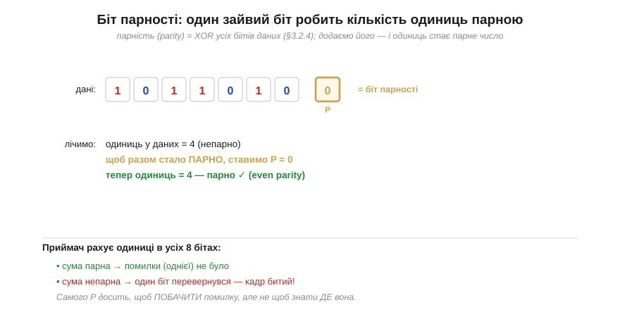
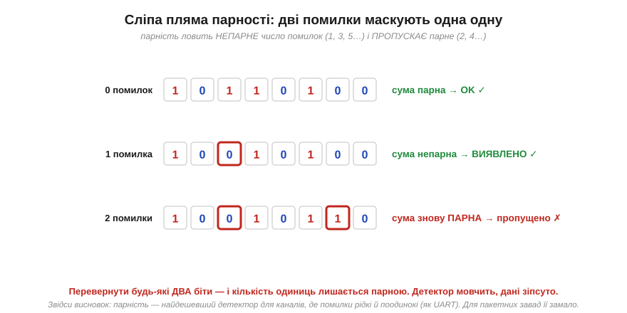

# Біт парності

У будь-якому каналі [помилки неминучі](book:algorithms/bit-flips), і першим кроком захисту є бодай **помітити** їх. Який найдешевший детектор узагалі можна уявити? Виявляється, вистачить **одного** зайвого біта на цілий блок даних — і він уже зловить найтиповішу поодиноку помилку. Цей біт називають **бітом парності** (*parity bit*), і він — найпростіший код виявлення в усій теорії. З нього ми почнемо не лише тому, що він простий, а тому, що на ньому видно **головну ідею** всіх кодів: додати надлишок, обчислений за даними так, щоб помилка його зрадила.

### Один біт, що рахує одиниці

Біт парності будується елементарно. Беремо всі біти даних і питаємо: скільки серед них одиниць — парне число чи непарне? Якщо непарне, додаємо один біт, що дорівнює 1, аби разом одиниць стало парне число; якщо вже парне — додаємо 0. Так влаштована **парна парність** (*even parity*): після додавання біта загальна кількість одиниць у блоці **завжди парна**.


*Рис. Біт парності для семи бітів даних. Лічимо одиниці в даних: їх непарна кількість, тож ставимо P = 1, і разом одиниць стає парне число (even parity). Приймач робить те саме — рахує одиниці в усіх восьми бітах: парна сума означає, що однієї помилки не було, непарна — що один біт перевернувся. Самого P досить, щоб **побачити** помилку, але не щоб знати, **де** вона.*

Тут варто впізнати давнього знайомого. «Парне чи непарне число одиниць» — це рівно те, що рахує операція [**XOR** (*виключне АБО*)](book:electronics/xor-comparison): XOR двох бітів дає 1, коли одиниць непарно (рівно одна), і 0, коли парно (нуль або дві). Поширивши XOR на весь рядок, дістаємо: **біт парності = XOR усіх бітів даних**. Логіка порівняння виявляється готовим обчислювачем парності — і в залізі він коштує один вентиль на біт, а в коді — один оператор `^`. Дешевше не буває.

Перевірка на боці приймача так само тривіальна й симетрична. Приймач не зберігає нічого зайвого — він просто перераховує XOR усіх отриманих бітів разом із бітом парності. Якщо результат 0 (одиниць парно), блок вважається цілим; якщо 1 (одиниць непарно) — десь усередині один біт перевернувся, і кадр оголошують битим. Жодних таблиць, жодної пам'яті — лише підрахунок одиниць.

Перш ніж рушити далі, варто прояснити дрібну, але практичну деталь, на яку натикаються всі, хто колись налаштовував послідовний порт: парність буває **двох видів**. Ми домовлялися добивати кількість одиниць до **парної** — це парна парність (*even parity*). Можна домовитися навпаки — добивати до **непарної** (*odd parity*): тоді біт парності ставлять так, щоб одиниць у блоці завжди було непарне число. Логічно ці два варіанти рівносильні: обидва ловлять рівно ту саму поодиноку помилку. Та між ними є тонка інженерна різниця. Уявімо, що дріт «застряг» на нулі (обрив, коротке на землю) і всі біти приходять нульовими. За **непарної** парності блок із самих нулів — заборонений (нуль одиниць — парно), тож такий обрив одразу видно; за **парної** ж парності суцільні нулі виглядають цілком «законно». Дрібниця — а часом саме вона ловить не випадковий шум, а грубу поломку лінії. Тому в реальних протоколах вибір even/odd роблять свідомо, і обидва кінці мусять домовитися про однаковий — інакше кожен «цілий» кадр виглядатиме битим.

> 🔧 **Навіщо це.** Парність — це не музейний експонат, вона жива й сьогодні саме там, де дорогий код був би недоречним. Класичний приклад — [**UART**](book:communications/uart-frame) (послідовний порт): у його кадрі поряд зі стартовим і стоповим бітами є опційний **біт парності**, який приймач звіряє автоматично й піднімає прапорець помилки кадру; саме тому в налаштуваннях порту поряд зі швидкістю стоїть загадкове «8N1» чи «7E1» — число бітів даних, тип парності (None/Even/Odd) і число стопових бітів. Інший приклад — апаратні регістри й шини, де один біт парності на слово ловить поодинокий збій майже задарма. Правило просте: коли помилки в каналі **рідкі й поодинокі**, а ціна кожного зайвого біта висока, парність — оптимальний вибір. Її сила — у відношенні «користь на біт»: жоден інший код не дає виявлення за таку малу плату.

### Сліпа пляма: парне число помилок

Та за дешевизну треба платити, і платня тут конкретна. Біт парності реагує лише на **зміну парності** загальної кількості одиниць. Один перевернутий біт парність змінює — і його видно. А що, як перевернулися **два**?


*Рис. Сліпа пляма. Без помилок одиниць парно — детектор каже «OK». Одна помилка робить кількість одиниць непарною — детектор спрацьовує, помилку **виявлено**. Але дві помилки змінюють парність двічі, тобто повертають її назад: одиниць знову парно, і детектор **мовчить**, хоча дані зіпсовано. Загальне правило: парність ловить **непарне** число помилок (1, 3, 5…) і **пропускає** парне (2, 4…).*

Логіка проста, якщо думати про зміни. Кожен перевернутий біт міняє загальну парність на протилежну. Один переворот — парність змінилася, видно. Два — змінилася й вернулася, не видно. Три — знов змінилася, видно. Отже, парність **сліпа до парного числа помилок**: вона чесно ловить будь-яку непарну кількість і повністю пропускає будь-яку парну. Для каналу, де помилки приходять **поодинці** (а тепловий шум часто саме такий — рідкі незалежні збої), це чудово. Для каналу, де завада б'є **пакетом**, перекидаючи кілька сусідніх бітів за раз, парність стає ненадійною: пакет із двох помилок вона прогавить.

**Приклад (парність ловить і пропускає).** Візьмімо байт даних `1011010`, додамо парну парність і перевіримо три сценарії.

```
дані          = 1011010   (одиниць 4 — парно)
біт парності P = 0         (щоб лишилось парно)  →  слово = 1011010 0

сценарій A: помилок немає
  приймач: одиниць = 4 (парно)        →  OK ✓

сценарій B: перевернувся 1 біт (3-й): 1010010 0
  приймач: одиниць = 3 (непарно)      →  ПОМИЛКА виявлена ✓

сценарій C: перевернулись 2 біти (3-й і 7-й): 1010011 0
  приймач: одиниць = 4 (парно)        →  OK ✗  (а дані ж зіпсовано!)
```
Один биток парність ловить, два — пропускає: подвійна помилка повертає парність до парної, і детектор її не бачить.

### Парність у двох вимірах

Перш ніж попрощатися з парністю, варто побачити один прийом, що несподівано виводить її далеко за межі простого «помітити». Що, як рахувати парність **не один раз на весь блок, а багато**? Розкладімо біти даних у прямокутну таблицю й додаймо біт парності **на кожен рядок** і **на кожен стовпець**. Тепер один перевернутий біт зіпсує парність рівно одного рядка **і** рівно одного стовпця — а їхній **перетин** однозначно вкаже зіпсовану клітинку. Іншими словами, кілька простих перевірок парності, поставлених хитро, разом утворюють **координати** помилки — і ми вже не просто бачимо збій, а можемо його **виправити**, перевернувши вказаний біт назад.

Цей фокус (його звуть **двовимірною парністю**, *2D parity*) ще далеко не ідеальний — він плутається, коли помилок кілька, — але він уперше показує думку, заради якої й затівалася ціла теорія: **надлишок можна влаштувати так, щоб він не лише сигналив про помилку, а й називав її місце**. Саме ця ідея, доведена до досконалості, дає справжній виправний [код Геммінга](book:communications/hamming-code), де три біти парності складаються в точний номер зіпсованого біта. Тут це лише натяк — сам біт парності залишається у світі простого «помітити».

Звичайна одновимірна парність лишається корисною, попри свою сліпу пляму: вона незамінна там, де помилки рідкі й одиничні, і платить за це лише одним бітом. Та щойно треба надійно ловити **кілька** помилок або **пакети**, одного біта замало — доводиться додавати багатший надлишок. Найприродніший хід — не питати «парне чи непарне число одиниць», а порахувати за даними ціле число, чутливе до самих їхніх значень. Саме так влаштовані [контрольні суми](book:communications/checksums).
