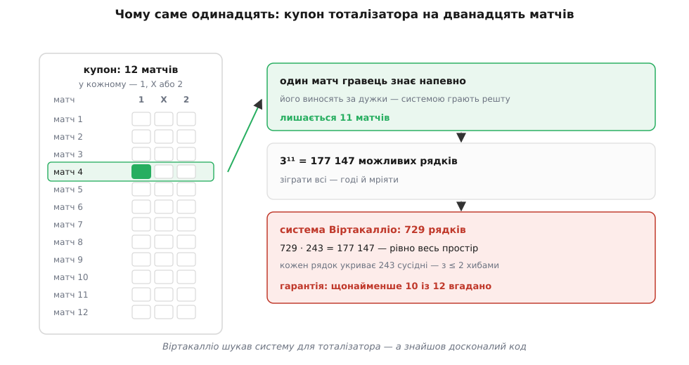
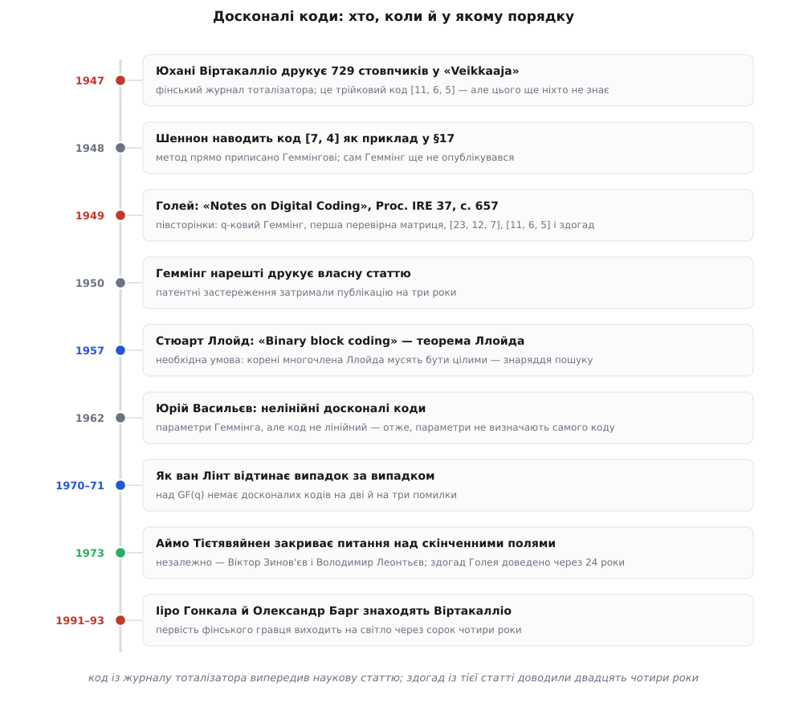

# 📜 Півсторінки, які закрили тему назавжди

Історія досконалих кодів починається не там, де мала б. Відповідь надрукували раніше за питання — у фінському журналі футбольного тоталізатора, поміж таблиць із результатами матчів. А чоловік, який приблизно через півтора року знайшов те саме в науковому часописі, умістив усе на неповній сторінці й наприкінці спокійно дописав, що інших таких кодів, на його думку, більше немає. Він мав рацію. Довести це вдалося аж за двадцять чотири роки.

Порядок подій тут узагалі перекручений майже скрізь, де тільки можна: код, який знають під іменем Голея, першим надрукував гравець-аматор; код, який знають під іменем Геммінга, першим надрукував Шеннон; а первість аматора виплила на світло, коли всі троє вже давно ввійшли в підручники.

## Купон на дванадцять матчів

Фінський тоталізатор запустили 1940 року, і купон його влаштований так, що трійковий алфавіт виникає сам собою, без жодної теорії. На бланку — дванадцять футбольних матчів, і в кожному рівно три можливі наслідки: `1` — виграють господарі, `X` — нічия, `2` — виграють гості. Гравець позначає по одній клітині в кожному рядку й здає стовпчик із дванадцяти позначок. Це слово завдовжки 12 над алфавітом із трьох символів — просто ніхто його так не називав.

Виграшних стовпчиків не один. Тоталізатор платив не лише за бездоганно вгаданий купон, а й за такий, де схибили одну-дві позначки. Тобто «досить добре» тут має **радіус**: правила виплат самі оголошують, наскільки близько треба підійти до правильного стовпчика. А це вже точнісінько та сама постановка, що й у передачі даних каналом із шумом, — тільки роль шуму грає футбол.

Зіграти всі стовпчики неможливо: 3¹² = 531 441 бланк ніхто не купить. Але фінський гравець на ім'я **Юхані Віртакалліо** (Juhani Virtakallio) зауважив дві речі. По-перше, з дванадцяти матчів бодай в одному впевнений навіть новачок — тож цей матч можна винести за дужки й позначити його наосліп однаково в усіх стовпчиках. Лишається одинадцять. По-друге, на ці одинадцять він склав систему з **729 стовпчиків**, яка гарантувала: хоч як ляжуть результати, серед його стовпчиків знайдеться такий, де схиблено не більш як дві позначки.


*Трійковий алфавіт на купоні виникає сам: `1`, `X`, `2`. Один матч гравець знає напевно й виносить за дужки — саме тому в системі одинадцять позицій, а не дванадцять. Далі арифметика сходиться без залишку: 729 стовпчиків, кожен «накриває» 243 сусідні (ті, що відрізняються не більш як двома позначками), і 729 · 243 дає рівно 3¹¹ — усі можливі наслідки. Віртакалліо шукав систему для тоталізатора, а склав досконалий код.*

Порахуймо його систему очима гравця, а не математика. Один стовпчик «накриває» себе самого, усі стовпчики з однією хибною позначкою й усі з двома:

```
одинадцять матчів   →  3¹¹ = 177 147 можливих наслідків

скільки наслідків «накриває» один зданий стовпчик:
  точно вгадав                    1
  схибив одну позначку           11 місць × 2 хибні варіанти  =  22
  схибив дві позначки            55 пар місць × 2 × 2         = 220
                                                          разом  243

729 стовпчиків × 243 накритих  =  177 147  =  3¹¹     ← весь простір, без залишку
```

Числа сходяться до останньої одиниці — і саме це робить систему не просто ощадливою, а недосяжною для покращення. Гравець купує один стовпчик із кожних 243 можливих і все одно нічого не втрачає з гарантії. Позначки Віртакалліо давали щонайменше дев'ять правильних із одинадцяти, а разом із «певним» матчем — щонайменше десять із дванадцяти.

Свою систему він надрукував 1947 року в журналі **«Veikkaaja»** — назва означає приблизно «той, хто ставить» — у номерах 27, 28 і 33. У супровідній замітці Віртакалліо тримається геть не як першовідкривач: пояснює, що система склалася в нього під час занепаду призів тоталізатора; що тоді виплати були надто скупі, аби виправдати витрати на гру такою системою тиждень за тижнем, — тож вона й лежала забута серед інших його систем. Коли ж узимку призи підскочили, він завів мову з редакцією про публікацію — та в журнал не влазили 729 стовпчиків. І лише коли він винайшов спосіб заощадити місце, система нарешті потрапила на шпальти.

Ця остання деталь варта того, щоб на ній спинитися. Проблема, яка стояла між Віртакалліо й друком, — це буквально проблема **компактного опису коду**: 729 слів не влазять на сторінку, отже, їх треба задати чимось коротшим за перелік. Саме цим у теорії кодування служить [лінійна структура](topic:communications/linear-block-codes) — жменька твірних рядків, із яких усі 729 слів розгортаються комбінуванням, замість того щоб виписувати кожне. Що саме вигадав Віртакалліо, з наведеної замітки не видно, і приписувати йому твірну матрицю було б домислом. Але задача, яку він розв'язав заради місця в журналі, — та сама, яку теорія розв'язує заради математики.

Чого Віртакалліо не знав — то це що його система досконала; що вона єдина з такими параметрами з точністю до перенумерування; і що подібних до неї в природі майже немає. Він знав інше: вона працює й на неї вистачає грошей.

## Що побачив Голей у статті Шеннона

Тим часом за океаном грали в іншу гру. 1948 року Клод Шеннон надрукував «A Mathematical Theory of Communication» — працю, що [довела можливість надійної передачі каналом із шумом](topic:communications/channel-coding-theorem) і вказала межу швидкості, до якої її можна тиснути. Доказ був неконструктивний: добрі коди **існують**, бо в середньому по всіх кодах усе гаразд, — а як їх будувати, теорема не казала.

Але в §17, під заголовком про приклад ефективного кодування, Шеннон навів конкретну схему: блок із семи символів, чотири з них — дані, три обчислюються як парності, а три перевірки складаються у двійкове число, що прямо називає номер зіпсованої позиції. Це [код Геммінга (7,4)](topic:communications/hamming-code), і Шеннон чесно приписав метод Геммінгові просто в дужках, усередині прикладу. Курйоз у тому, що сам Геммінг на той час опублікуватися ще не встиг: його стаття вийшла лише 1950 року, бо публікацію притримували патентні застереження — [ця історія варта окремої розповіді](topic:communications/hamming-distance/hist-hamming-1950.md). Тож світ уперше прочитав код Геммінга у Шеннона.

Одним із тих, хто це прочитав, був **Марсель Голей** (Marcel J. E. Golay). І поставив питання, які в тому прикладі напрошуються, щойно перестати сприймати його як фокус: чому саме сім? чому саме двійкові символи? чому саме одна помилка? Приклад Шеннона мав присмак чогось загальнішого — надто вже точно в ньому все сходилося: три біти парності дають вісім значень синдрому, і рівно вісім подій треба назвати (сім позицій плюс «усе ціле»). Жодне значення не змарноване. Питання Голея було по суті одне: **де ще** трапляється така точна відповідність — і чи багато таких місць узагалі.

## Неповна сторінка

Відповідь Голей надрукував 1949 року в *Proceedings of the IRE* (том 37, с. 657) під назвою «Notes on Digital Coding». Заголовок обіцяє нотатки — і формально це вони: текст не займає й повної сторінки. Одні джерела називають її півсторінкою, інші просто сторінкою; сперечатися нема про що — це найкоротша значуща стаття, яку знає ця галузь.

На цій площі вміщено чотири речі, кожної з яких вистачило б на власну статтю. Голей узагальнив коди Геммінга на **недвійкові** алфавіти — тобто побудував ціле сімейство там, де Шеннон показав один приклад. Він **уперше в друці навів перевірну матрицю** — той спосіб задавати код, яким відтоді користуються всі. Він виписав **двійковий код [23, 12, 7]**, що виправляє три помилки, і **трійковий код [11, 6, 5]**, що виправляє дві, — той самий, який за півтора року до того вже надрукували у «Veikkaaja» як систему ставок. І нарешті він висловив переконання, що на цьому досконалі коди **вичерпано**: інших немає.

Елвін Берлекемп, укладаючи 1974 року антологію ключових праць теорії кодування, назвав цю сторінку «best single published page» — найкращою окремою опублікованою сторінкою за всю історію галузі. Це не компліментарна гіпербола, а оцінка щільності: більше змісту на одиницю паперу в цій науці не траплялося ні до, ні після. Що саме влаштовано всередині обох кодів — окрема багата тема; тут важить те, що обидва з'явилися на світ разом, на одному аркуші, як побічний результат одного простого питання «а де ще?».

## Хто такий Голей

Голея часто записують в американські вчені — і це неточно. Він народився 3 травня 1902 року в **Невшателі, Швейцарія**, вивчав електротехніку у Вищій технічній школі Цюриха (ETH), 1924 року поїхав до Bell Labs у Нью-Йорку й пропрацював там чотири роки, а 1931-го здобув докторський ступінь із фізики в Чиказькому університеті. Далі — Корпус зв'язку армії США: Форт-Монмут у Нью-Джерсі, двадцять п'ять років, радари, і зрештою посада головного науковця. Саме там, серед радарної роботи, він і написав ті півсторінки. З 1955 року Голей консультував Philco й Perkin-Elmer, а з 1963-го перейшов у Perkin-Elmer старшим науковцем — і лишався там до смерті 27 квітня 1989 року.

Найкраще про нього говорить розкид місць, де його ім'я збереглося. **Комірка Голея** — інфрачервоний детектор, що ловить літаки за їхнім тепловим випромінюванням. **Фільтр Савицького — Голея** — згладжування, без якого не обходиться жодна лабораторія, що обробляє спектри. **Комплементарні послідовності Голея** — пари двійкових послідовностей, які сьогодні працюють у Wi-Fi та стільниковому зв'язку. **Капілярна колонка Голея** — у газовій хроматографії. Це чотири різні науки, і теорія кодування серед них — радше епізод: людина, що написала найкращу сторінку галузі, взагалі не була фахівцем із цієї галузі. Вона просто уважно прочитала Шеннона й довела думку до кінця.

## Здогад, що чекав на доказ двадцять чотири роки

Останнє речення Голеєвої сторінки — переконання, а не теорема. Він **вірив**, що знайшов усе; підстав для цієї віри в нього було не більше, ніж «шукав — і більше не знайшлося». Перевіряти його довелося іншим, і зайняло це майже чверть століття.


*Порядок, у якому все насправді ставалося. Верхні три рядки — курйоз первості: обидва найвідоміші коди вийшли друком не там і не в тих, у кого мали б. Нижні — довга робота з доведення одного речення, дописаного наприкінці півсторінки 1949 року.*

Знаряддя дав **Стюарт Ллойд** (Stuart P. Lloyd) із Bell Labs — той самий, чиїм ім'ям названо алгоритм k-середніх. 1957 року в статті «Binary block coding» він довів необхідну умову: якщо досконалий код існує, то певний многочлен (його так і звуть — многочлен Ллойда) мусить мати всі корені цілими й у вузькому проміжку. Це перетворило пошук кодів на пошук цілих коренів — задачу теорії чисел. Досконалість, яка починалася як геометрія куль, стала питанням подільності.

Далі — довга облога. **Як ван Лінт** (Jacobus Hendricus van Lint, 1932–2004), нідерландський математик з Ейндговена, узявся відтинати випадки: 1970 року він показав, що над GF(q) немає досконалих кодів, які виправляють дві чи три помилки, а 1971-го доклав іще низку теорем про неіснування. Простір можливостей стискався, але не замикався.

Замкнув його 1973 року фін **Аймо Тієтявяйнен** (Aimo Tietäväinen) з Університету Турку: у статті «On the nonexistence of perfect codes over finite fields» він, спираючись на напрацювання ван Лінта, довів, що над **будь-яким** скінченним полем інших досконалих кодів немає. Того самого року й незалежно того самого результату дійшли радянські математики **Віктор Зинов'єв** і **Володимир Леонтьєв** з московського Інституту проблем передачі інформації, надрукувавши «The nonexistence of perfect codes over Galois fields».

Тут варто бути точним із заслугами, бо в переказах їх часто злипають у «ван Лінт і Тієтявяйнен довели 1973 року». Насправді ролі різні: Ллойд дав знаряддя, ван Лінт розчистив більшу частину поля й звів задачу до розв'язного залишку, Тієтявяйнен довів теорему до кінця, а Зинов'єв із Леонтьєвим прийшли до неї своїм шляхом. Це нормальний вигляд математичного результату — ланцюжок, а не осяяння; питання «хто довів» майже ніколи не має відповіді з одного прізвища.

## Що саме закрито, а що ні

«Інших досконалих кодів немає» — твердження сильне, і його легко зрозуміти ширше, ніж воно є. Закрито **параметри**: над скінченними полями не існує жодного набору (довжина, кількість слів, радіус) із рівністю, окрім тривіального повторення непарної довжини, сімейства Геммінга й двох кодів Голея. Шукати новий досконалий код — марно.

Але параметри не визначають самого коду. Ще 1962 року радянський математик **Юрій Васильєв** надрукував у «Проблемах кібернетики» статтю про негрупові щільно упаковані коди — і побудував досконалі коди з параметрами Геммінга, які **не лінійні** й не зводяться до коду Геммінга жодним перенумеруванням. Таких кодів виявилося не просто багато, а страшенно багато: коли 2009 року Патрік Естергорд і Оллі Поттонен повним перебором класифікували всі досконалі двійкові коди довжини 15, що виправляють одну помилку, їх набралося **5983** нееквівалентних. Один набір параметрів — майже шість тисяч різних кодів.

На цьому тлі коди Голея вирізняються ще раз: вони **єдині** зі своїми параметрами з точністю до перенумерування координат. Не «одні з багатьох», як у Геммінга, а рівно один об'єкт. Те, що Віртакалліо й Голей, шукаючи з протилежних боків, наштовхнулися на буквально той самий код, — не збіг, а наслідок цієї єдиності: іншого там просто не було.

І ще одна щілина лишилася відчиненою. Класифікація доведена для алфавітів, розмір яких — степінь простого числа, бо саме тоді алфавіт утворює скінченне поле й працює вся техніка Ллойда. Для алфавітів на кшталт шести чи десяти символів загальне питання досі не закрите остаточно. Практичного значення це майже не має, але сказати «досконалі коди класифіковано повністю» — означає сказати трохи більше, ніж доведено.

> 🔧 **Навіщо це.** Теорема про неіснування корисна не тим, що щось забороняє, а тим, що **звільняє від пошуку**. До 1973 року інженер, якому бракувало досконалого коду потрібного розміру, мав право сподіватися, що код просто ще не знайшли, і витрачати зусилля на пошук. Після 1973-го це питання зняте назавжди: потрібного розміру немає в природі, отже, вибір звужується до чесного компромісу — узяти недосконалий код і змиритися з зазором. Різниця між «ще не знайшли» і «не існує» — це різниця між відкритою задачею й закритою, і платять за неї роками чужої роботи, щоб не платити своїми.

## Як знайшли Віртакалліо

Лишається останній виток, і він найдотепніший. Про фінського гравця світова наука не знала сорок чотири роки. Розкопав його **Ііро Гонкала** (Iiro Honkala) — фінський математик з Університету Турку, чиїм науковим керівником був **той самий Аймо Тієтявяйнен**. Гонкала написав про ранню історію трійкового коду Голея додаток до статті про футбольний тоталізатор і покривні коди, що вийшла 1991 року, — і саме звідти взято переклад Віртакалліової замітки. Широкому загалу цю історію 1993 року розповів **Олександр Барг** (Alexander Barg) у нарисі «At the Dawn of the Theory of Codes» у *The Mathematical Intelligencer*; працював він тоді в тому самому московському Інституті проблем передачі інформації, що й Зинов'єв із Леонтьєвим.

Виходить майже надто гарно, щоб бути правдою: фін закрив питання досконалих кодів, а його учень з'ясував, що першим той код надрукував фін-аматор у фінському журналі про ставки. Проте це справді так — і саме тому історію Віртакалліо варто розповідати з посиланням на Гонкалу й Барга, а не як анекдот.

Одна деталь у переказах різниться. Барг, чия розвідка тут первинна, каже про **півтора року** між публікацією у «Veikkaaja» й статтею Голея; довідники частіше пишуть «два роки». Розбіжність легко пояснити: номери «Veikkaaja» вийшли наприкінці літа 1947-го, стаття Голея — 1949 року, тож проміжок десь між роком і дев'ятьма місяцями та двома роками, залежно від того, які саме дати брати. На суть це не впливає, але «за два роки до Голея» — округлення, а не документ.

## Що з цього випливає

Спокуса підсумувати цю історію як «аматор обійшов професіоналів» велика — і вона хибна. Віртакалліо не обходив нікого: він не знав, що бере участь у перегонах, не мав поняття про досконалість і не претендував на первість. Голей нічого в нього не запозичив: він читав Шеннона, а не «Veikkaaja». Двоє людей, розділені океаном, мовою й мотивом — виграш у тоталізаторі проти узагальнення чужого прикладу, — прийшли до тих самих 729 слів.

Оце і є справжня мораль. Досконалих кодів так мізерно мало, а влаштовані вони так жорстко, що будь-хто, кому вони по-справжньому знадобилися, приречений знайти той самий об'єкт. Не тому, що читав ті самі книжки, а тому, що іншого там немає. Півсторінки Голея й 729 стовпчиків у журналі про ставки — це два незалежні свідчення про одну й ту саму рідкісну річ, яка лежала в просторі слів задовго до того, як хтось із них узявся її шукати.
