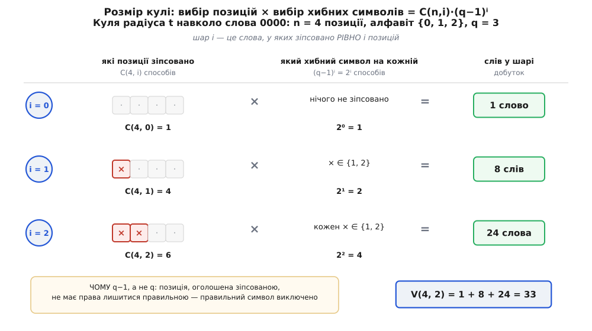
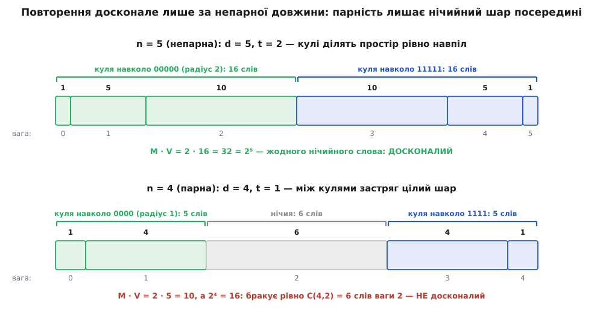
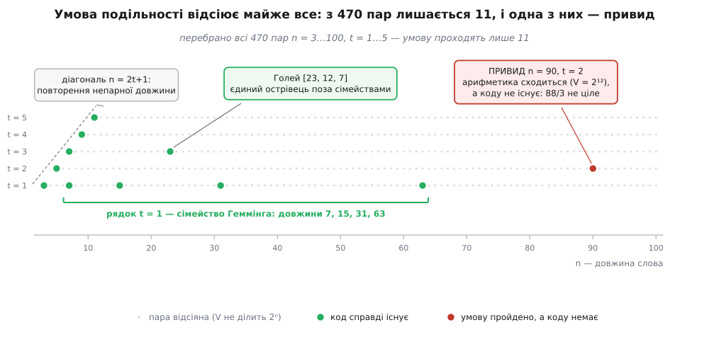

# 🧮 Межа упаковки куль: строге виведення

<preknowlist>
- [Відстань Геммінга](book:communications/hamming-distance) — відстань між двома словами дорівнює кількості позицій, у яких вони різняться. Куля радіуса t навколо слова — це всі слова на відстані не більш як t від нього. Код із мінімальною відстанню d між кодовими словами впевнено виправляє t = ⌊(d−1)/2⌋ помилок: саме за такого радіуса кулі ще не налізають одна на одну.
- Біноміальний коефіцієнт C(n, i) — рахує, скількома способами можна вибрати i позицій із n; біном Ньютона розкладає степінь суми: (a + b)ⁿ = Σᵢ C(n, i)·aⁱ·bⁿ⁻ⁱ. Обидва факти беруться тут як готові, решта виводиться на місці.
</preknowlist>

Питання «чи заповнюють кулі виправлення весь простір без залишку» звучить геометрично, але геометрії в ньому нема ані краплі — є лічба. Кулі заповнюють простір тоді й лише тоді, коли сума їхніх обсягів дорівнює обсягу простору. Обсяг простору відомий одразу: слів довжини n над алфавітом із q символів рівно qⁿ. Кількість куль відома теж: скільки кодових слів M, стільки й куль. Лишається одне-єдине невідоме — **обсяг кулі**, тобто скільки слів вона в собі тримає. Знайдіть це число — і решта буде бухгалтерією.

І саме тут причаїлася пастка. У двійковому коді обсяг кулі має вигляд простої суми біноміальних коефіцієнтів, і ця простота оманлива: вона ховає множник, який у двійці дорівнює одиниці й тому геть невидимий. Щойно символів стає більше за два — множник оживає й починає правити всім. Без нього трійковий код Голея не сходиться навіть приблизно, а сімейство Геммінга над недвійковим алфавітом узагалі не має пояснення. Тож почнімо з обсягу кулі — чесно, від першопричини.

## Чотири числа, і всі про лічбу

Умовмося про позначення раз і назавжди, бо далі все крутитиметься навколо них.

```
q — скільки різних символів в алфавіті (q = 2 — біти, q = 3 — трійка, q = 256 — байти)
n — довжина слова в символах
M — скільки кодових слів має код
t — радіус кулі: скільки помилок код виправляє впевнено
```

Простір — це всі можливі слова довжини n: на кожну з n позицій незалежно кладемо будь-який із q символів, отже слів рівно **qⁿ**. Код — це якісь M із них, оголошені «правильними». Куля радіуса t навколо слова c — усі слова, що відрізняються від c не більш як у t позиціях; її обсяг позначимо **V**.

Досконалість — це рівність M·V = qⁿ. Щоб її перевірити, треба знати V. Беремося.

## Обсяг кулі: два незалежні вибори

Куля розпадається на **шари**. Шар i — це слова, що відрізняються від центра **рівно** в i позиціях, тобто лежать на відстані рівно i. Куля радіуса t — це шари від 0 до t, складені докупи; шари не перетинаються (слово не може бути на двох різних відстанях від одного центра), тож обсяг кулі — просто сума їхніх розмірів.

Лишилося порахувати один шар. Візьмімо центр c і спитаймо: скільки є слів на відстані рівно i від нього? Щоб зіпсувати слово рівно в i позиціях, треба зробити **два незалежні вибори**.

**Вибір перший: які саме позиції зіпсовано.** Це вибір i позицій із n, і робиться він C(n, i) способами. Тут нічого нового.

**Вибір другий — той, що зазвичай проґавлюють: що покласти на кожну зіпсовану позицію.** Здавалося б, q варіантів на кожну — увесь алфавіт. Ні. Позиція, оголошена зіпсованою, **не має права лишитися правильною**: якби на неї впав той самий символ, що стояв у центрі, вона б не була зіпсована, і відстань вийшла б меншою за i. Тож із q символів один — той, що в центрі, — заборонено, а лишається **q−1**. Виборів на кожну з i позицій рівно q−1, вибори незалежні, отже разом **(q−1)ⁱ**.

Множимо і дістаємо розмір шару:

```
слів на відстані рівно i  =  C(n, i) · (q−1)ⁱ
```


*Куля будується двома незалежними кроками, і кожен дає свій множник. Спершу вибираємо, які саме i позицій зіпсовано, — C(n, i) способів. Потім на кожну з них кладемо хибний символ: правильний виключено, тож варіантів q−1, а на всі i позиції разом — (q−1)ⁱ. Добуток і є розміром шару. Для n = 4 над трійковим алфавітом шари дають 1, 8 і 24 слова, а куля радіуса 2 — 33 слова.*

Складімо шари від нуля до t — і ось обсяг кулі:

```
V(n, t) = Σ C(n, i)·(q−1)ⁱ ,  i = 0 … t

        = C(n,0)·(q−1)⁰ + C(n,1)·(q−1)¹ + … + C(n,t)·(q−1)ᵗ
        =      1        +    n·(q−1)    + … + C(n,t)·(q−1)ᵗ
```

Тепер видно, чому двійка все ховає. За q = 2 множник (q−1)ⁱ = 1ⁱ = 1 — і зникає безслідно. Воно й логічно: якщо біт не нуль, то він неодмінно одиниця, вибирати нема з чого, «хибний символ» лише один. Тому в двійковому світі формула виглядає як гола сума біноміальних коефіцієнтів, і легко повірити, ніби так вона й улаштована. Не так: сума біноміальних коефіцієнтів — це **окремий випадок**, у якому другий множник випадково дорівнює одиниці.

> 🔧 **Навіщо це.** Множник (q−1)ⁱ — це те, чому символьні коди поводяться геть інакше за бітові. Візьміть байтовий алфавіт, q = 256: кожна зіпсована позиція має аж 255 хибних значень, і шар i роздувається проти двійкового у 255ⁱ разів. За типової для [Ріда — Соломона](book:communications/reed-solomon) довжини n = 255 куля радіуса 3 над байтами містить 45 288 079 510 276 слів проти 2 763 776 у двійковій кулі того самого радіуса й довжини — у 16.4 мільйона разів більше, тобто майже рівно 255³, бо верхній шар забиває собою всі нижні. Ось чому Рід — Соломон вимірює свою силу не бітами, а символами: одна зіпсована позиція для нього — це одна помилка, хай там усі вісім бітів у ній перевернулися. Множник (q−1)ⁱ — арифметичне обличчя цієї домовленості.

## Куля — це обрізаний біном

А тепер погляньмо на формулу V збоку, і вона раптом покаже своє походження. Що станеться, якщо не обрізати суму на t, а довести її до самого кінця, до i = n? Тоді ми складемо **всі** шари — тобто перелічимо всі слова простору. Але та сама сума — це в точності біном Ньютона для ((q−1) + 1)ⁿ:

```
Σ C(n, i)·(q−1)ⁱ·1ⁿ⁻ⁱ  =  ((q−1) + 1)ⁿ  =  qⁿ      (i = 0 … n)
```

Перевірмо на трійці, n = 4, де всі числа ще видно оком:

**Усі шари слова довжини 4 над алфавітом {0, 1, 2}:**

```
i = 0 :  C(4,0)·2⁰ =  1 ·  1 =  1
i = 1 :  C(4,1)·2¹ =  4 ·  2 =  8
i = 2 :  C(4,2)·2² =  6 ·  4 = 24
i = 3 :  C(4,3)·2³ =  4 ·  8 = 32
i = 4 :  C(4,4)·2⁴ =  1 · 16 = 16
                      разом  = 81 = 3⁴  ✓ увесь простір, слово в слово
```

Ось воно. **Обсяг кулі — це обрізаний біном: перші t+1 доданків того самого розкладу, який повністю дає qⁿ.** Куля радіуса t — не сторонній об'єкт, а початковий шматок простору, розібраного на шари за відстанню від центра.

Тримайте цю думку — вона ще вистрелить. Досконалість вимагатиме, щоб **обрізаний початок розкладу націло ділив повну суму**. Сформулюйте це як задачу про числа — і одразу відчується, наскільки дивна це вимога.

## Чому кулі не налізають одна на одну

Перш ніж складати обсяги, треба переконатися, що кулі справді не перетинаються, — інакше сума їхніх обсягів рахувала б декотрі слова двічі й нічого не означала.

Нехай мінімальна відстань коду d, а радіус кулі t = ⌊(d−1)/2⌋, тобто 2t + 1 ≤ d. Припустімо супротивне: якесь слово x потрапило одразу в дві кулі, навколо різних кодових слів c₁ і c₂. Тоді d(c₁, x) ≤ t і d(x, c₂) ≤ t. Відстань Геммінга задовольняє нерівність трикутника — манівцями через x не коротше, ніж навпростець:

```
d(c₁, c₂) ≤ d(c₁, x) + d(x, c₂) ≤ t + t = 2t ≤ d − 1  <  d
```

Дістали, що два різні кодові слова стоять ближче ніж на d одне від одного, — а це суперечить самому означенню мінімальної відстані. Отже, слова x, спільного двом кулям, не існує: **кулі радіуса t = ⌊(d−1)/2⌋ попарно не перетинаються**. І радіус тут не просто якийсь безпечний, а найбільший можливий: узявши t на одиницю більший, ми дістали б 2t ≥ d, і кулі навколо двох найближчих кодових слів уже мали б спільні слова.

## Подвійний рахунок: M·V ≤ qⁿ

Тепер нерівність виводиться в один рух. Розгляньмо об'єднання всіх M куль. Оскільки кулі попарно не перетинаються, обсяг об'єднання — це проста сума обсягів, без жодних поправок на перетини:

```
| об'єднання куль |  =  M · V
```

З іншого боку, кулі складаються зі слів того самого простору, тож їхнє об'єднання — його підмножина, а підмножина не буває більшою за ціле:

```
| об'єднання куль |  ≤  qⁿ
```

Складаємо два рядки — і маємо **межу упаковки куль** (її ж називають межею Геммінга):

```
M · V ≤ qⁿ        тобто        M · Σ C(n,i)(q−1)ⁱ ≤ qⁿ ,  i = 0 … t
```

Уся сила висновку — у слові «підмножина». Ми не припускали про код нічого, крім мінімальної відстані: ні лінійності, ні структури, ні алгебри. Код може бути будь-яким набором слів, хоч навмання накиданим, — нерівність тримає. Тому й межа така міцна: обійти її нема чим, вона випливає з того, що частина не більша за ціле.

## Рівність — це і є досконалість

Нерівність стає рівністю рівно тоді, коли об'єднання куль — не просто підмножина простору, а **весь простір**. Розберімо обидва напрямки, бо саме в них означення досконалості й арифметична рівність зшиваються в одне.

Якщо код **досконалий**, тобто кожне слово простору лежить у якійсь кулі, то об'єднання куль збігається з простором, його обсяг дорівнює qⁿ, а він же дорівнює M·V. Отже M·V = qⁿ.

Навпаки, нехай M·V = qⁿ. Об'єднання куль — підмножина простору того самого обсягу, що й весь простір. Але скінченна підмножина, обсяг якої дорівнює обсягу цілого, — це саме ціле, іншого варіанту нема. Отже кожне слово простору лежить бодай в одній кулі; а що кулі не перетинаються, то рівно в одній. Код досконалий.

```
M · V = qⁿ   ⟺   кожне слово простору лежить рівно в одній кулі   ⟺   код досконалий
```

Ось чому перевірка досконалості така смішно проста: жодної структури коду знати не треба, досить чотирьох чисел — q, n, M, t — і одного множення. Далі саме це й робитимемо.

## Перевірка сімейств

### Геммінг: чому (q−1) скорочується

Сімейство Геммінга виправляє одну помилку, отже t = 1, а куля має лише два шари:

```
V = C(n,0)·(q−1)⁰ + C(n,1)·(q−1)¹ = 1 + n·(q−1)
```

Довжина коду Геммінга над алфавітом із q символів (q — степінь простого числа) і m перевірними символами — не будь-яка, а строго визначена:

```
n = (qᵐ − 1) / (q − 1)        кодових слів M = qⁿ⁻ᵐ
```

Підставмо цю довжину в обсяг кулі й простежмо, що станеться:

```
V = 1 + n·(q−1) = 1 + [(qᵐ − 1)/(q−1)]·(q−1) = 1 + (qᵐ − 1) = qᵐ
```

Ось де захований весь фокус. Множник (q−1), що прийшов із формули кулі — з вибору хибного символу, — **скорочується з тим самим (q−1) у знаменнику довжини**. Куля виходить рівно qᵐ завбільшки, тобто точним степенем q. А далі все складається саме собою:

```
M · V = qⁿ⁻ᵐ · qᵐ = qⁿ   ✓ досконалий, за будь-яких q і m
```

І це вже не збіг, який лишається констатувати, а пояснення. Довжину Геммінга не вгадали — її **обрано так**, щоб скорочення відбулося. Коли q = 2, знаменник (q−1) дорівнює одиниці, і формула вироджується у знайоме n = 2ᵐ − 1: сім, п'ятнадцять, тридцять один, шістдесят три. Але сімейство живе й над трійкою — n = (3ᵐ−1)/2 дає довжини 4, 13, 40 — і над будь-яким скінченним полем. Двійка тут не має жодного привілею; вона просто робить скорочення непомітним. Числами:

**Трійковий код Геммінга, m = 3:**

```
n = (3³ − 1)/(3 − 1) = 26/2 = 13
V = 1 + 13·(3−1) = 1 + 26 = 27 = 3³
M = 3¹³⁻³ = 3¹⁰ = 59049
M · V = 3¹⁰ · 3³ = 3¹³ = 1594323   ✓ рівність — код досконалий
```

### Двійковий Голей [23, 12, 7]

Тут t = 3, і куля має чотири шари. Множник (q−1)ⁱ = 1, тож лишається чиста сума:

```
V = C(23,0) + C(23,1) + C(23,2) + C(23,3)
  =    1    +    23   +   253   +  1771  = 2048 = 2¹¹
M = 2¹² = 4096
M · V = 2¹² · 2¹¹ = 2²³   ✓ досконалий
```

Дивитися тут треба не на добуток, а на **проміжний рядок**. Складаються чотири **непарні** числа — 1, 23, 253, 1771; двійкою з них не пахне жодним (23 просте, 253 = 11·23, 1771 = 7·11·23 — самі одинадцятки й двадцять трійки). А сума їхня — рівно 2048 = 2¹¹, у якому від тих одинадцяток і двадцять трійок не лишилося сліду. Числа не «майже» сходяться і не округлюються — вони падають точно в степінь двійки. Ніщо в самій сумі цього не обіцяло; це і є та рідкісна арифметична подія, заради якої існують досконалі коди.

### Трійковий Голей [11, 6, 5]: множник у повний зріст

А ось випадок, де (q−1)ⁱ працює на повну — і де без нього не було б і близько нічого. Одинадцять трійкових символів, t = 2:

```
q = 3,  n = 11,  t = 2,  M = 3⁶ = 729

V = C(11,0)·2⁰ + C(11,1)·2¹ + C(11,2)·2²
  =    1 · 1   +   11 · 2   +   55 · 4
  =    1       +   22       +   220      = 243 = 3⁵

M · V = 729 · 243 = 3⁶ · 3⁵ = 3¹¹ = 177147   ✓ досконалий
```

Затримаймося на цьому. Якби ми полінувалися й переписали двійкову формулу без множника, вийшло б 1 + 11 + 55 = 67 — число, що не ділить 3¹¹ і взагалі ні про що не говорить. Уся досконалість трійкового Голея тримається на тому, що середній доданок подвоєно, а останній учетверено. Саме множник (q−1)ⁱ витягує суму з випадкового 67 у рівно 3⁵ — і 729 куль по 243 слова заповнюють 177147 слів простору без жодного проміжку.

## Повторення: досконале тоді й лише тоді, коли довжина непарна

Двійкове повторення довжини n має всього два кодові слова — суцільні нулі й суцільні одиниці, — а відстань між ними d = n, бо різняться вони в усіх позиціях. Отже M = 2 і t = ⌊(n−1)/2⌋. Твердження таке: **такий код досконалий тоді й лише тоді, коли n непарна**. Доведімо обидва боки — і обидва зведуться до однієї симетрії.

Симетрія ця — тотожність C(n, i) = C(n, n−i): вибрати i позицій — те саме, що вибрати n−i позицій-решток. Разом усі шари дають Σᵢ₌₀ⁿ C(n, i) = 2ⁿ, увесь простір.

**Непарна довжина.** Нехай n = 2t+1. Тоді шари 0 … n розпадаються на дві групи по t+1 штук: нижню 0 … t і верхню t+1 … n. Тотожність C(n,i) = C(n,n−i) переводить нижню групу у верхню один в один — кожному шару i з нижньої відповідає рівний йому шар n−i з верхньої, і жоден шар не лишається без пари, бо середнього шару за непарної n просто немає. Отже дві групи мають однакові суми, а разом — 2ⁿ. Значить, кожна дорівнює 2ⁿ⁻¹. Нижня група — це якраз куля навколо нулів, верхня — куля навколо одиниць:

```
V = Σ C(n,i) = 2ⁿ⁻¹ ,  i = 0 … t

M · V = 2 · 2ⁿ⁻¹ = 2ⁿ   ✓ досконалий
```

**Парна довжина.** Нехай n парна, тоді t = ⌊(n−1)/2⌋ = n/2 − 1, і куля обривається на шарі n/2 − 1, **не діставши до середини**. Тепер шари 0 … n розпадаються не на дві групи, а на три: нижню 0 … n/2−1, верхню n/2+1 … n і **середній шар n/2, що не має пари й лишається сам по собі**. Нижня й верхня, як і раніше, рівні між собою; віднявши середину, поділімо решту навпіл:

```
V = Σ C(n,i) = (2ⁿ − C(n, n/2)) / 2 ,  i = 0 … n/2−1

M · V = 2 · V = 2ⁿ − C(n, n/2)   <  2ⁿ
```

Рівність недосяжна, і **брак — це рівно C(n, n/2)**, розмір середнього шару. Не «приблизно стільки» й не «десь такий порядок» — точно він.


*Простір розкладено на шари за вагою слова, і ширина шару відповідає кількості слів у ньому. За n = 5 шарів шість, середнього немає, і розріз між кулями проходить рівно посередині: 16 і 16, разом 32 = 2⁵ — досконало. За n = 4 середній шар ваги 2 існує, у ньому C(4,2) = 6 слів, і він не дістається нікому: кулі забирають по 5 слів, а шість лишаються сірими. Саме через цей шар парне повторення й не буває досконалим.*

Геометрію цього браку видно з одного погляду. Слово ваги n/2 має рівно половину одиниць — а отже стоїть на відстані n/2 і від суцільних нулів, і від суцільних одиниць. Ідеальна нічия: обидва центри однаково далеко, голосування більшістю зависає, приймачеві нема на що спертися. Ось чому чотириразове повторення гірше за триразове не «трохи», а якісно: зайвий біт не наблизив жодну кулю до заповнення простору, він лише створив цілий шар слів, за які заплачено, а користі з них нема. Непарність — не забобон і не звичай, а єдиний спосіб не залишити шару без господаря.

Для повноти: над більшими алфавітами повторення не рятує й непарність. Уже за q = 3, n = 3 маємо V = 1 + 3·2 = 7 і M·V = 3·7 = 21, тоді як простір — 27 слів. Шість слів лишаються нічийними: коли кожна позиція має два різні хибні значення, «більшість» перестає бути однозначною підказкою.

## Чому такі збіги майже не трапляються

Тепер повернімося до обрізаного бінома — і подивімося, чого досконалість насправді вимагає від чисел.

Рівність M·V = qⁿ означає передусім, що **V мусить націло ділити qⁿ**. Це називають **умовою упаковки куль**, і вона нещадна. Адже qⁿ не має інших простих дільників, окрім тих, що має q. Тож за q = 2 усе зводиться до однієї вимоги, від якої нікуди дітися:

```
V(n, t) = C(n,0) + C(n,1) + … + C(n,t)   мусить бути СТЕПЕНЕМ ДВІЙКИ
```

Ось де відчувається, наскільки це дике прохання. Ліворуч — сума кількох біноміальних коефіцієнтів, чисел цілком свавільних: 1, 23, 253, 1771. Кожне живе своїм життям, їхні прості дільники розкидані як заманеться. І ми вимагаємо, щоб їхня сума не мала жодного простого дільника, крім двійки. Це те саме, що обірвати біномний розклад числа 2ⁿ на довільному місці й сподіватися, що обрізаний початок якимось дивом поділить ціле. Жодної причини для цього немає — тому й трапляється воно майже ніколи.

«Майже ніколи» можна побачити на очах. Переберімо всі пари (n, t) за n від 3 до 100 і t від 1 до 5 — це 470 варіантів — і лишімо тільки ті, де V виявився степенем двійки. Виживає **одинадцять**.


*Кожна сіра цятка — перевірена пара (n, t), що умову не пройшла; зелена — пара, за якою код справді існує. Уціліле має жорстку структуру: діагональ n = 2t+1 — це повторення непарної довжини, рядок t = 1 — сімейство Геммінга (7, 15, 31, 63), а окремою зеленою цяткою стоїть Голей [23, 12, 7] — єдиний острівець поза обома сімействами. Червона цятка при n = 90 — випадок, де арифметика сходиться бездоганно, а коду не існує.*

Картина промовиста: одинадцять уцілілих — не безладний розсип, а **діагональ, рядок і дві окремі точки**. Діагональ n = 2t+1 — щойно доведене повторення непарної довжини. Рядок t = 1 — сімейство Геммінга. (На перетині, при n = 3 і t = 1, обидва збігаються буквально: код Геммінга з m = 2 — це і є [3, 1], потрійне повторення.) Далі, поза всякими сімействами, самотою стоїть Голей при n = 23, t = 3. Одинадцята точка — червона, і про неї окрема розмова.

Скептик слушно зауважить, що вікно n ≤ 100, t ≤ 5 замале, щоб робити висновки. Його перебирали й далеко ширше. У [своєму огляді 1975 року](https://projecteuclid.org/journals/rocky-mountain-journal-of-mathematics/volume-5/issue-2/A-survey-of-perfect-codes/10.1216/RMJ-1975-5-2-199.pdf) Джек ван Лінт наводить три незалежні комп'ютерні пошуки розв'язків умови упаковки — і межі в них уже нітрохи не іграшкові:

```
М. Г. Мак-Ендрю (1965)  q = 2,        t ≤ 20,   n ≤ 270
Е. Л. Коен (1964)       q непарне ≤ 125,  t = 2,   вимірність k ≤ 40000
Дж. ван Лінт            q ≤ 100,      k ≤ 1000, n ≤ 1000
```

Результат на всіх цих просторах параметрів однаковий: **окрім тривіальних кодів, умову проходять лише параметри кодів Голея — і ще один-єдиний набір, q = 2, t = 2, n = 90**. Мільйони перевірених варіантів — і жодного нового кандидата. Це документований факт із першоджерела, а не оцінка на око.

## Привид при n = 90

Той останній набір заслуговує окремого місця, бо він розвінчує найспокусливішу помилку в усій темі. Порахуймо:

**Гіпотетичний досконалий двійковий код довжини 90, що виправляє 2 помилки:**

```
n = 90,  t = 2,  q = 2
V = C(90,0) + C(90,1) + C(90,2) = 1 + 90 + 4005 = 4096 = 2¹²
M = 2⁹⁰ / 2¹² = 2⁷⁸
M · V = 2⁷⁸ · 2¹² = 2⁹⁰   ✓ рівність виконується бездоганно
```

Арифметика сходиться до останньої одиниці — не гірше, ніж у Голея. Код (90, 2⁷⁸, 5) мав би 2⁷⁸ ≈ 3·10²³ кодових слів, його кулі мали б заповнити простір без жодного проміжку. **Такого коду не існує.**

І довести це можна тією самою лічбою, з якої ми починали, — жодної вищої алгебри. Нехай код існує; для зручності візьмімо, що нульове слово в ньому є (інакше просто зсунемо весь код, це нічого не змінює). Мінімальна відстань d = 5, тож усі інші кодові слова мають вагу щонайменше 5.

Візьмімо тепер довільне слово x ваги 3. Воно мусить лежати в якійсь кулі — код же нібито досконалий. У чиїй? Від нуля воно на відстані 3, а це більше за t = 2 — отже не в кулі нуля. Значить, є кодове слово c з d(x, c) ≤ 2. Оцінімо його вагу згори: c відрізняється від x щонайбільше у двох позиціях, тож w(c) ≤ w(x) + 2 = 5. А знизу ми вже знаємо: w(c) ≥ 5. Затиснуто з двох боків — **w(c) = 5 рівно**, і d(x, c) = 2 рівно. Але якщо вага зросла з 3 до 5 за рахунок двох змінених позицій, то жодна одиниця x не могла зникнути — усі три вцілили. Отже **кожне слово ваги 3 міститься рівно в одному кодовому слові ваги 5** (як підмножина позицій-одиниць).

А тепер зафіксуймо будь-яку пару позицій {i, j} і порахуймо одне й те саме двома способами — трійки, що містять цю пару.

```
трійок вигляду {i, j, m}: m пробігає решту позицій         →  90 − 2 = 88
кодових слів ваги 5, що містять i та j:                    →  назвімо їх λ штук
кожне таке слово має 5 − 2 = 3 вільні позиції,
тож накриває рівно 3 трійки з нашого списку                →  разом накрито 3·λ

кожна трійка накрита рівно один раз  ⟹  3·λ = 88  ⟹  λ = 88/3
```

Кількість кодових слів — і раптом дріб. Число λ мусить бути цілим, бо це лічба предметів, а 88 на 3 не ділиться. Суперечність. **Коду (90, 2⁷⁸, 5) не існує** — і ховає його не якась глибока структурна перешкода, а звичайнісіньке 88/3.

> 🔧 **Навіщо це.** Ось урок, ширший за коди: умова упаковки — **необхідна, але не достатня**. Вона відсіює 459 варіантів із 470, лишає одинадцять — і серед цих одинадцяти один усе одно виявляється привидом. Пройдений тест не доводить існування; він лише не спростував. Тому проєктувальник, який побачив, що параметри «сходяться», не має права оголошувати код знайденим: сходження арифметики — це запрошення шукати, а не свідоцтво про народження. Голей і n = 90 проходять той самий іспит однаково добре; існує тільки один із них.

## Глибший фільтр — і чиє ім'я на ньому

Умова упаковки — лише перше сито, і рахунок з парою {i, j} — латка для конкретного випадку. Загальний інструмент, що врешті закрив пошук, знайшов **Стюарт Ллойд** із Bell Labs у праці «Binary Block Coding» (Bell System Technical Journal, том 36, 1957, с. 517–535). Назва не випадкова: сам Ллойд довів свою теорему для двійкового випадку, аналітичними методами; на алфавіти-степені простого її поширили пізніше, а на **будь-яке** q — уже в 1970-х, незалежно Філіп Дельсарт і Гендрік Ленстра. Умова, яку вона дає, зовсім іншої природи, ніж лічба куль: якщо досконалий код довжини n, що виправляє t помилок, над алфавітом із q символів існує, то певний многочлен степеня t — його так і звуть многочленом Ллойда — мусить мати **t різних цілих коренів серед чисел 1, 2, …, n**. Многочлен обчислюється з самих лише n, t і q; коду для цього не треба. І ось у цій вимозі знову та сама рима, що й в умові упаковки: об'єкт, неперервний за своєю природою, — корені многочлена — зобов'язаний упасти точно в цілі точки. Майже ніколи він цього не робить.

Варто знати, з чого той многочлен зроблено. Як показав Філіп Дельсарт, многочлен Ллойда будується з системи ортогональних многочленів, яку 1929 року ввів **Михайло Пилипович Кравчук** — український математик, дійсний член Всеукраїнської академії наук. Народився 1892 року в Човницях на Волині; його праця «Sur une généralisation des polynomes d'Hermite» вийшла французькою в паризьких «Comptes Rendus» (том 189, с. 620–622) — і саме через ту французьку транслітерацію світова література досі знає його прізвище як «Krawtchouk», хоча йдеться про Кравчука. 1938 року його заарештували — серед звинувачень був «український буржуазний націоналізм» і закордонні наукові зв'язки; 1942 року він загинув на Колимі, у сорок дев'ять. Реабілітований посмертно 1956 року, поновлений у складі академії 1992-го. Хронологія тут промовиста сама собою: многочлени введено 1929-го, за двадцять вісім років на них спирається теорема Ллойда, ще за шістнадцять — саме поєднання теореми Ллойда з умовою упаковки, а не кожна з них окремо, доводить, що над [скінченними полями](book:math/finite-fields) нових досконалих кодів немає й бути не може. Автор многочлена не дожив до жодного з тих застосувань.

## Що лишається в руках

Уся конструкція, від початку до кінця, тримається на одному прийомі — **порахувати одну множину двома способами** — і застосований він тричі поспіль. Спершу до кулі: скільки слів дають два незалежні вибори, позицій і хибних символів, — звідси C(n,i)(q−1)ⁱ. Потім до простору: об'єднання куль зсередини дорівнює M·V, а ззовні не перевищує qⁿ, — звідси межа. І наостанок до трійок при n = 90: 88 з одного боку, 3λ з другого, — звідси неіснування.

Що з цього забрати:

```
V(n,t) = Σ C(n,i)(q−1)ⁱ    обсяг кулі — обрізаний біном розкладу qⁿ
M · V ≤ qⁿ                 межа: тримає для БУДЬ-ЯКОГО коду, без припущень
M · V = qⁿ  ⟺  досконалий  перевірка коштує одного множення
V | qⁿ                     умова упаковки: необхідна, і майже завжди її досить,
                           щоб відкинути кандидата, — але НЕ щоб його підтвердити
```

Множник (q−1)ⁱ — не косметична деталь для недвійкового випадку, а те, що взагалі робить формулу правильною; двійка лише ховає його за одиницею. Він скорочується в довжині Геммінга — і породжує ціле сімейство. Він подвоює й учетверює доданки в трійковому Голеї — і витягує суму рівно в 3⁵. І він же, разом із цілочисельністю, лишає від мільйонів перебраних варіантів дві скупі родини, два коди Голея — та одного привида при n = 90, який пройшов усі арифметичні іспити й однаково не існує.
