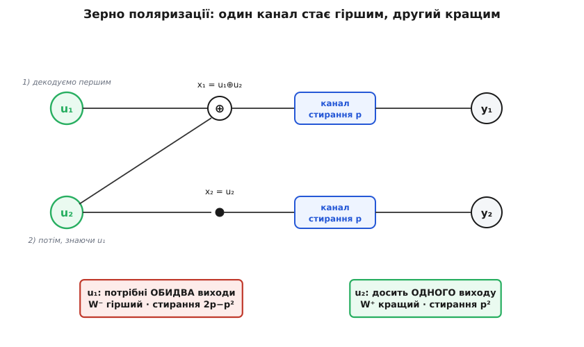

# Полярні коди

<preknowlist>
- [Смуга і межа Шеннона](book:communications/bandwidth-capacity) — пропускна здатність C каналу: стеля надійної передачі, до якої код лише наближається.
- [Теорема Шеннона про кодування каналу](book:communications/channel-coding-theorem) — обіцянка, що нижче C добрі коди існують, хоч теорема й не каже які.
- [Біт парності](book:communications/parity-bit) — XOR групи бітів; полярне перетворення побудоване рівно на цій операції.
- [Лінійні блокові коди](book:communications/linear-block-codes) — кодове слово як лінійна комбінація бітів даних; полярний код теж лінійний.
</preknowlist>

1948 року [Клод Шеннон довів](book:communications/channel-coding-theorem), що в кожному зашумленому каналі є число — пропускна здатність (capacity) C: нижче нього дані можна гнати з як завгодно малою кількістю помилок, вище — не можна ніяк. Доказ був жорстокий у своїй недомовленості. Він гарантував, що добрий код [десь на межі C](book:communications/bandwidth-capacity) існує, але не казав ані який, ані як його будувати, ані як декодувати. Шістдесят років найкращі коди — [Геммінга](book:communications/hamming-code), BCH, [Рід — Соломон](book:communications/reed-solomon), а згодом [турбокоди](book:communications/turbo-codes) і [LDPC](book:communications/ldpc) — гналися за цією стелею й підходили на частки децибела. Але завжди **наближалися**: жоден не мав доказу, що саме ця конструкція межі **сягає**.

2009 року з'явився код, що обіцяв інше. Не «підійдемо близько», а математично доведене «дійдемо до самого C» — плюс явний рецепт побудови й швидкі кодування та декодування. Це полярні коди, і придумав їх [Ердал Арікан](book:communications/polar-codes/hist-arikan.md), турецький професор університету Бількента в Анкарі — за іронією, учень [Роберта Галлагера](book:communications/ldpc/hist-gallager.md), того самого, хто винайшов LDPC. Полярні коди — перше сімейство, про яке доведено: воно **досягає** пропускної здатності каналу з ефективною побудовою й декодуванням.

## Дивний хід: змусити канали обрати бік

Звичайний код бореться із шумом каналу напряму — розкладає надлишок так, щоб на кожному переданому біті мати запас на випадок помилки. Арікан зробив геть інше. Він узяв N однакових посередніх каналів і оборотним перетворенням перетворив їх на N **нових**, синтетичних каналів, які вже **не посередні**: кожен став або майже досконалим, або майже непридатним. Мало який лишився посередині. Це розшарування й звуть **поляризацією каналу** (полярний — лат. *polaris* ← гр. *pólos*, вісь, полюс: канали розтягуються до двох полюсів).

А коли розшарування сталося, код пишеться сам собою. Дані кладемо на майже досконалі канали — там надлишок майже не потрібен. На майже непридатних не воюємо із шумом узагалі: ставимо туди наперед відоме значення й не витрачаємо на них жодного біта даних. Уся хитрість у тому, що **частка каналів, які поляризуються до майже досконалих, дорівнює саме пропускній здатності C** вихідного каналу. Тож ставлячи дані лише на добрі позиції, ми за самою побудовою підходимо до C.

Звідки береться це розшарування? З одного крихітного перетворення на **двох** каналах.

## Зерно: перетворення двох каналів

Візьмімо два біти, u₁ і u₂, і два однакові канали. Замість того щоб слати біти нарізно, змішаймо їх на вході:

```
x₁ = u₁ ⊕ u₂      (XOR двох бітів — той самий, що рахує біт парності)
x₂ = u₂
```

x₁ іде першим каналом, x₂ — другим; приймач бачить два зашумлені виходи y₁ і y₂. Тепер найголовніше — **порядок** декодування. Спершу відновлюємо u₁, потім u₂.

Щоб дістати u₁, приймач ще не знає u₂. А u₁ = x₁ ⊕ x₂, тобто щоб його обчислити, потрібні **обидва** переданих символи водночас. Якщо хоч один вихід зіпсовано — u₁ втрачено. Отже, синтетичний канал для u₁ **гірший** за будь-який із двох вихідних: він падає, коли падає бодай один.

А u₂ декодуємо, **уже знаючи** u₁. Тоді u₂ можна дістати двома шляхами: напряму з x₂ (це другий вихід), або з x₁ ⊕ u₁ (це перший вихід, бо u₁ вже відоме). Досить, щоб уцілів **хоч один** із двох виходів. Синтетичний канал для u₂ **кращий** за вихідний: він падає, лише коли падають обидва.

Один канал став гіршим, другий — кращим. А сумарна надійність (пропускна здатність двох каналів разом) не змінилася: перетворення її не створює й не нищить, а лише **перерозподіляє** — забирає в одного, віддає іншому.


*Те саме перетворення на двох однакових каналах віддає один гірший і один кращий канал. Пропускна здатність не зникає — вона перетікає від одного до другого.*

Порахуймо це на числах — там усе видно точно.

**Приклад: перетворення на каналі зі стиранням.** Візьмімо [двійковий канал зі стиранням](book:communications/binary-erasure-channel) (binary erasure channel): кожен біт або доходить цілим, або з імовірністю p безслідно стирається (приймач знає, що на цьому місці «дірка», але не знає, що там було). Нехай p = 0.5 — половина символів гине. Пропускна здатність такого каналу — це частка бітів, що доходять: 1 − p = 0.5.

```
вихідний канал:   стирання p = 0.5   →   пропускна 1 − p = 0.5   (кожен із двох)

канал для u₁ (W⁻, гірший): гине, якщо стерто ХОЧ ОДИН вихід
   стирання = 1 − (1−p)² = 1 − 0.25 = 0.75
   пропускна = 1 − 0.75 = 0.25          ← стало гірше

канал для u₂ (W⁺, кращий): гине, лише якщо стерто ОБИДВА виходи
   стирання = p² = 0.25
   пропускна = 1 − 0.25 = 0.75          ← стало краще

перевірка балансу:
   було:  0.5 + 0.5 = 1.0
   стало: 0.25 + 0.75 = 1.0             ← сума незмінна, лише розтягнута
```

Два канали по 0.5 перетворилися на один із 0.25 і один із 0.75. Пара роз'їхалася від середини до країв, а сума лишилася 1.0. Ось і вся поляризація в мініатюрі — тепер її треба лише повторити.

## Рекурсія: розтягнути до полюсів

Одне перетворення трохи розсунуло два канали. А що, коли застосувати його ще раз — тепер до **пар** уже отриманих синтетичних каналів? Кращий канал, з'єднавшись із кращим, дасть один іще кращий і один посередній; гірший із гіршим — один іще гірший і один посередній. Далі — до пар цих. Робимо так n разів, і в нас N = 2ⁿ синтетичних каналів. З кожним рівнем добрі повзуть до досконалості, погані — до нуля, а середина порожніє.


*Пропускна здатність зберігається (сума висот у кожному стовпці однакова), але перетікає до країв. Що довший блок — то чіткіший розкол на «майже досконалі» й «майже непридатні».*

Саме це Арікан і довів строго: коли N прямує до нескінченності, частка каналів із пропускною, що прямує до 1, прямує до C, а решта — до 0; посередині не лишається майже нічого. [Математику цієї збіжності — рекурсію параметрів і чому вони неминуче розходяться до полюсів — винесено окремо](book:communications/polar-codes/math-channel-polarization.md). Для нас важливий наслідок: за великого N канали чітко діляться на дві купи, і в доброї купи розмір — рівно C·N.

## Код: заморожені біти

Тепер код будується сам. Відсортуймо N синтетичних каналів за надійністю. На K найнадійніших покладемо біти даних. На решту N − K — найгірші канали — покладемо наперед узгоджене значення (зазвичай нуль), однакове й відоме і кодеру, і декодеру. Ці позиції звуть **замороженими бітами** (frozen bits): вони нічого не несуть, вони просто константи, які декодер уже знає, тож на поганих каналах йому нема чого відновлювати.


*Вибір позицій під дані — і є весь «дизайн» полярного коду: беремо рівно ті канали, що поляризувалися до надійних. Їхня частка дорівнює C, тож швидкість K/N підходить до пропускної здатності.*

Швидкість коду R = K/N, і за великого N її можна тримати впритул до C, майже не втрачаючи на помилках. Який саме набір позицій надійний — залежить від зашумленості каналу: що більше шуму, то менше каналів поляризуються до добрих, то менше K. Цей вибір рахують наперед, один раз для заданого рівня шуму, — і це чи не єдина «конструкторська» робота в усьому коді.

Саме кодування — це те саме перетворення, застосоване рекурсивно до всього блоку з N бітів (де на заморожених позиціях стоять нулі). Виходить лінійне перетворення над бітами — суцільні XOR-и, згруповані в log₂N проходів по масиву:

:::tabs
```py
def polar_encode(u):
    """u — вектор із N = 2**n бітів (дані на вільних позиціях, 0 на заморожених).
    Повертає кодове слово x. Перетворення — рекурсивне змішування половин."""
    n = len(u)
    if n == 1:
        return u[:]
    half = n // 2
    a = polar_encode(u[:half])          # верхня половина
    b = polar_encode(u[half:])          # нижня половина
    return [a[i] ^ b[i] for i in range(half)] + b   # x = (a⊕b, b)
```
```c
// Кодування на місці: log2(N) проходів XOR-«метеликами». N — степінь двійки.
// На вході u[] містить дані на вільних позиціях і 0 на заморожених;
// на виході в u[] лежить кодове слово.
void polar_encode(uint8_t *u, int N) {
    for (int step = 1; step < N; step <<= 1)       // ширина метелика
        for (int base = 0; base < N; base += 2 * step)
            for (int i = base; i < base + step; i++)
                u[i] ^= u[i + step];               // верх ^= низ
}
```
:::

> 🔧 **Навіщо це.** Полярний код — це доведена відповідь на питання «а чи можна взагалі дійти до Шеннона, а не лише підповзти?». Але живе він там, де інші капітулюють: на **коротких** повідомленнях. Керівні пакети стільникового зв'язку (кому яку смугу дати, коли передавати) — це десятки-сотні бітів, і на такій довжині довгі LDPC-блоки безсилі. Полярний код зі списковим декодером тримає надійність саме тут — тому 5G довірив йому канал керування, від якого залежить, чи встановиться зв'язок узагалі.

## Декодування: послідовне скасування

Код збудований так, що й декодувати його треба у **строгому порядку** — саме тому перетворення й ставило u₁ перед u₂. Алгоритм зветься **послідовне скасування** (successive cancellation, SC): біти відновлюють один за одним, від першого до останнього. Для кожного біта декодер бере зашумлені виходи каналу і **всі вже відновлені попередні біти** — і на цій основі вирішує поточний. На заморожених позиціях вирішувати нема чого: там наперед відомий нуль, і декодер просто підставляє його, ще й підпираючи ним оцінку сусідів.

Рекурсія тут дзеркалить кодування: щоб оцінити верхню половину, декодер спершу комбінує довіри з двох підканалів, а щоб оцінити нижню — використовує вже здогадану верхню. Уся робота коштує O(N·log N) операцій — так само дешево, як швидке перетворення. [Робочий SC-декодер із поясненням крок за кроком](book:communications/polar-codes/proj-successive-cancellation.md) показує, як довіри перетікають графом і де підставляються заморожені нулі.

У послідовності й криється єдина вада простого SC: помилка в ранньому біті отруює всі наступні, бо вони спираються на нього. На нескінченному блоці це неважливо (Арікан довів надійність саме там), а на короткому — боляче.

## Пастка й порятунок: список і CRC

На реальних, скінченних довжинах простий SC програє добре налаштованим LDPC й турбокодам — саме через цю ланцюгову залежність. Порятунок виявився елегантним: **спискове** декодування (successive cancellation list, SCL). Замість того щоб на кожному біті намертво обирати 0 чи 1, декодер веде L конкурентних гіпотез-шляхів одразу, а наприкінці лишає найправдоподібніший. А щоб безпомилково вибрати з-поміж L фіналістів, до даних наперед додають [контрольну суму CRC](book:communications/crc): правильний шлях — той, чия CRC сходиться. Ця зв'язка зветься CA-SCL (CRC-aided SCL) і саме вона зробила полярні коди конкурентними.

І тут вони обійшли суперників там, де ті слабкі — на **коротких** блоках. Тому в листопаді 2016-го консорціум 3GPP обрав полярні коди для **каналу керування** 5G NR (де повідомлення короткі й надійність критична), лишивши [LDPC](book:communications/ldpc) на канал даних (де блоки довгі й потрібна пропускна здатність). Два капіталодосяжні коди поділили роботу за довжиною повідомлення: полярний тримає коротке керування, LDPC — довгі дані.

---

Підсумок: **полярний код** — перше сімейство, про яке **доведено**, що воно досягає пропускної здатності каналу з ефективною побудовою. Його зерно — крихітне перетворення `x₁ = u₁⊕u₂, x₂ = u₂`, яке з двох однакових каналів робить один гірший і один кращий, не міняючи їхньої сумарної надійності. Повторене рекурсивно на N = 2ⁿ каналах, воно **поляризує** їх: одні стають майже досконалими, інші майже непридатними, а частка добрих дорівнює C. Дані кладуть на добрі канали, погані **заморожують** у нуль; декодують **послідовним скасуванням** біт за бітом. Простий SC слабкий на коротких блоках, але списковий декодер із [CRC](book:communications/crc) це лагодить — і саме тому полярні коди несуть канал керування 5G, тоді як [LDPC](book:communications/ldpc) везе канал даних.
