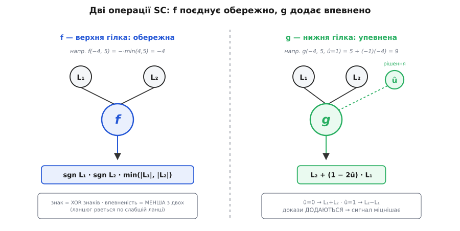

# ⚙️ Робочий SC-декодер: як довіра тече деревом

Кодер полярного коду перемішав біти суцільними XOR-ами й відправив результат у канал. На тому кінці — не чисті нулі й одиниці, а зашумлені відліки: кожен трохи схиляється до 0 або до 1, але жоден не певен. Задача декодера — з цих хитких схиляннь відновити рівно ті K бітів даних, що їх поклали на надійні позиції, а на решті підставити наперед відомі нулі. Причому відновити треба **в строгому порядку**, від позиції 0 до N−1, бо кожне наступне рішення спирається на попередні. Цей алгоритм — **послідовне скасування** (successive cancellation, SC), і зараз ми зберемо його з нуля: два крихітні оператори, одна рекурсія, і покроковий прогін короткого блоку, де видно кожну цифру.

## Валюта декодера — не біт, а довіра

Якби канал віддавав тверді біти, декодувати не було б чого: бери що прийшло. Уся сила SC в тому, що він працює з **м'якою** відповіддю каналу — числом, яке каже не лише «схоже на 0», а й **наскільки** схоже. Це число — логарифм відношення правдоподібностей:

```
L = ln( P(прийняте | послано 0) / P(прийняте | послано 1) )
```

Знак L каже, який біт імовірніший: L > 0 — радше 0, L < 0 — радше 1. Модуль |L| — це впевненість: |L| велике — канал майже певен; |L| ≈ 0 — монетка, повна невизначеність. Для найпоширенішого випадку — двійкова фазова модуляція (біт 0 → +1, біт 1 → −1) у [гаусовому шумі](book:communications/awgn-channel) — LLR виходить просто пропорційним відліку: `L = 2y/σ²`, де y — прийняте значення, σ² — потужність шуму. [Ширший розбір LLR як єдиної валюти м'якого декодування](book:communications/log-likelihood-ratio) — окремо; тут досить знати: **знак — здогад, модуль — впевненість**, і весь декодер лише перекладає впевненість з місця на місце.

## Ідея: два оператори, f і g

Полярний кодер будується на одному кроці — зшити пару `(a, b)` у `(a⊕b, b)`. Значить, і декодер розбирає той самий вузол: маючи довіру до двох виходів, відновити довіру до двох входів. Виходить рівно **дві** операції.

**Оператор f — верхня гілка (обережний).** Верхній вхід відновлюється як `a = (a⊕b) ⊕ b`, а другий доданок `b` декодер ще не знає. Тобто ми маємо два зашумлені погляди на XOR і мусимо оцінити його, не знаючи одного зі складників. Точна формула (MAP) — так званий boxplus:

```
f(L₁, L₂) = 2·atanh( tanh(L₁/2) · tanh(L₂/2) )        точна
f(L₁, L₂) ≈ sgn(L₁) · sgn(L₂) · min(|L₁|, |L₂|)        min-sum (апаратна)
```

Знак результату — XOR знаків (парність двох здогадів), а впевненість — **менша** з двох. Чому менша? Бо XOR певен рівно настільки, наскільки певна слабша ланка: досить одному погляду попливти, і сума двох стає непевною. Ланцюг рветься по найтоншій ланці. Точний boxplus дає майже те саме, але апаратура майже завжди бере min-sum — вона коштує одне порівняння замість двох гіперболічних тангенсів, а програє лише 0.1–0.2 дБ. Ми теж рахуватимемо min-sum, щоб числа лишалися цілими й перевірними.

**Оператор g — нижня гілка (упевнений).** Нижній вхід `b` декодуємо **вже знаючи** верхній біт û (його щойно відновила гілка f і рекурсія під нею). Тоді `b` видно двічі: прямо з другого виходу, і через перший вихід, з якого віднято відомий û. Два **незалежні** свідки про той самий біт — а логарифми правдоподібностей незалежних свідчень просто **додаються**:

```
g(L₁, L₂, û) = L₂ + (1 − 2û) · L₁
             = L₁ + L₂        якщо û = 0
             = L₂ − L₁        якщо û = 1
```

Множник `(1 − 2û)` — це ±1: він розвертає L₁, коли відомий біт дорівнює 1, щоб обидва свідчення дивилися в один бік перед складанням. Тому нижній канал **кращий** за вихідний: докази не конкурують, а підсумовуються, і впевненість зростає.


*Уся арифметика декодера — це ці дві клітини. f боїться слабшої ланки й бере мінімум; g вірить двом свідкам і додає. Приклади внизу — реальні числа з прогону нижче.*

> 🔧 **Навіщо це.** f і g — не якась хитрість саме полярних кодів. Та сама пара живе всюди, де декодують м'яко: boxplus (f) — це буквально оновлення перевірного вузла в декодері [LDPC](book:communications/ldpc), а додавання свідчень (g) — оновлення змінного вузла. Хто зрозумів ці дві клітини тут, той упізнає їх у половині сучасних кодів.

## Рекурсія: те саме дерево, що й кодер

Кодер збирав блок, зшиваючи половини; декодер розбирає його, розчіплюючи половини — тим самим деревом, лише знизу вгору за довірою і згори вниз за бітами. Правило одне на будь-який розмір N:

1. Розбий N довір на першу половину `L[:h]` і другу `L[h:]` (h = N/2).
2. **f-прохід:** склей їх обережно — `Lₐ[i] = f(L[i], L[i+h])` — і рекурсивно декодуй **верхню** половину. Вона повертає свої біти й, попутно, своє кодове слово x̂ (частинкові суми).
3. **g-прохід:** знаючи x̂ верхньої половини, обчисли `L_b[i] = g(L[i], L[i+h], x̂[i])` і рекурсивно декодуй **нижню** половину.
4. Зший результати назад тим самим XOR, що й кодер: `x = (x̂_верх ⊕ x̂_низ, x̂_низ)`.

Дно рекурсії — один-єдиний біт. Тут і вирішується доля позиції: якщо вона **заморожена**, декодер не гадає взагалі — ставить нуль, який і кодер, і він знають наперед, хоч би що казав LLR. Якщо позиція **несе дані** — тверде рішення за знаком: L ≥ 0 → 0, інакше 1.


*Кожен вузол спершу спускає ліву гілку (f), і лише отримавши звідти біти — праву (g), бо g потребує вже вирішене ліве. Це й є «послідовність»: обхід дерева зліва направо жорстко впорядковує вісім рішень.*

Заморожені листки на малюнку — не декорація. Вони працюють **якорями**: у місцях, де канал безнадійний, декодер не бере від нього нічого, а підставляє відоме значення й ще й підпирає ним сусідні оцінки через g. Прогін нижче показує на числах, як один такий якір гасить помилку каналу.

## Робочий код

Ось увесь декодер. Python — щоб алгоритм читався як псевдокод, але справжній і запускний; C — бо в реальності SC живе у DSP та ASIC базових станцій, де рахують цілочисловим min-sum. Обидва — точний переклад тих самих чотирьох кроків.

:::tabs
```py
def f_node(a, b):                      # обережно: min-sum boxplus
    return (1 if a >= 0 else -1) * (1 if b >= 0 else -1) * min(abs(a), abs(b))

def g_node(a, b, u):                   # u — уже вирішений верхній біт
    return b + (1 - 2 * u) * a

def sc_decode(llr, frozen):
    """llr — N довір на виходах цього вузла; frozen — маска (True = заморожено).
    Повертає (û, x): вирішені біти й відповідне кодове слово (частинкові суми)."""
    n = len(llr)
    if n == 1:
        bit = 0 if frozen[0] else (0 if llr[0] >= 0 else 1)
        return [bit], [bit]
    h = n // 2
    La = [f_node(llr[i], llr[i + h]) for i in range(h)]      # f-прохід
    u_up, x_up = sc_decode(La, frozen[:h])                   # верхня половина
    Lb = [g_node(llr[i], llr[i + h], x_up[i]) for i in range(h)]   # g-прохід
    u_lo, x_lo = sc_decode(Lb, frozen[h:])                   # нижня половина
    u = u_up + u_lo
    x = [x_up[i] ^ x_lo[i] for i in range(h)] + x_lo         # ті самі XOR, що й кодер
    return u, x

# --- запуск: N=8, заморожені позиції {0,1,2,4}, решта — дані ---
frozen = [True, True, True, False, True, False, False, False]
llr    = [-4, 2, 3, 1, 5, -2, 3, -6]        # м'які виходи каналу (LLR)
u_hat, x_hat = sc_decode(llr, frozen)
print(u_hat)      # -> [0, 0, 0, 1, 0, 0, 1, 1]
```
```c
#include <math.h>
#include <stdint.h>

static int   sgn(float x)            { return x >= 0 ? 1 : -1; }
static float f_node(float a, float b) {                 // обережно: min-sum boxplus
    float m = fabsf(a) < fabsf(b) ? fabsf(a) : fabsf(b);
    return (float)(sgn(a) * sgn(b)) * m;
}
static float g_node(float a, float b, int u) {          // u — уже вирішений верхній біт
    return b + (float)(1 - 2 * u) * a;
}

/* llr[0..N) — довіри на виходах вузла; frozen[0..N) — маска (1 = заморожено).
   Пише вирішені біти в u[0..N), а кодове слово (частинкові суми) — у x[0..N). */
void sc_decode(const float *llr, const uint8_t *frozen,
               int N, uint8_t *u, uint8_t *x) {
    if (N == 1) {
        u[0] = frozen[0] ? 0 : (llr[0] >= 0 ? 0 : 1);
        x[0] = u[0];
        return;
    }
    int h = N / 2;
    float La[h], Lb[h];                 // для наочності — VLA; у продакшні статичні буфери
    uint8_t xa[h], xb[h];
    for (int i = 0; i < h; i++) La[i] = f_node(llr[i], llr[i + h]);   // f-прохід
    sc_decode(La, frozen, h, u, xa);                                 // верхня половина
    for (int i = 0; i < h; i++) Lb[i] = g_node(llr[i], llr[i + h], xa[i]); // g-прохід
    sc_decode(Lb, frozen + h, h, u + h, xb);                         // нижня половина
    for (int i = 0; i < h; i++) x[i]     = xa[i] ^ xb[i];            // зшити половини
    for (int i = 0; i < h; i++) x[i + h] = xb[i];
}
```
:::

Обидва повертають `û = [0,0,0,1,0,0,1,1]`. Заморожені позиції 0,1,2,4 стоять у нулях за побудовою; дані — це біти на 3,5,6,7, тобто `[1,0,1,1]`. Тепер розберімо, звідки взялися саме ці числа.

## Покроковий прогін N=8

Візьмімо канал нашого прикладу — стирання ½ (пропускна C = 0.5). Ранжування синтетичних каналів за надійністю ставить чотири найслабші на позиції **0, 1, 2, 4** — їх морозимо; дані їдуть на **3, 5, 6, 7**. Кодер відправив кодове слово `x = [1,0,1,0,0,1,0,1]`, а канал повернув м'які довіри:

```
позиція виходу:   0    1    2    3    4    5    6    7
LLR каналу:      −4   +2   +3   +1   +5   −2   +3   −6
```

Одна цифра тут — брехня. Вихід 2 прийшов як **+3** (канал каже «це 0»), хоч посланий символ x₂ був 1. Наївне порозрядне читання за знаком дало б `[1,0,0,0,0,1,0,1]` — кодове слово з помилкою на позиції 2. Подивімось, як SC її виправить, не помітивши шраму.

**Верхній рівень, f-прохід.** Ділимо LLR навпіл: L₁ = [−4,+2,+3,+1], L₂ = [+5,−2,+3,−6]. Обережне склеювання:

```
Lₐ[0] = f(−4, +5) = −·min(4,5) = −4
Lₐ[1] = f(+2, −2) = −·min(2,2) = −2
Lₐ[2] = f(+3, +3) = +·min(3,3) = +3      ← сюди затекла брехня виходу 2
Lₐ[3] = f(+1, −6) = −·min(1,6) = −1
```

З цими чотирма довірами рекурсія декодує **верхню** половину (позиції 0–3). Спускаючись іще двічі, вона доходить до листків; ось довіра, з якою кожен зустрічає рішення, і сам вердикт:

```
u₀:  LLR = −1   → ЗАМОРОЖЕНО → 0   (−1 знехтувано)
u₁:  LLR = −2   → ЗАМОРОЖЕНО → 0   (−2 знехтувано)
u₂:  LLR = +1   → ЗАМОРОЖЕНО → 0   (+1 знехтувано)   ← отут би сховалася помилка, та позиція заморожена
u₃:  LLR = −4   → дані       → 1
```

Верхня половина відновлена: û₀…₃ = [0,0,0,1], а її кодове слово (частинкові суми) — x̂ = [1,1,1,1]. Зверніть увагу: брехня виходу 2 дотекла до листка u₂, але той **заморожений** — декодер його не слухає, ставить 0 за домовленістю. Помилку вже наполовину знешкоджено самою побудовою.

**Верхній рівень, g-прохід.** Тепер, знаючи x̂ = [1,1,1,1], рахуємо довіру для нижньої половини. Оскільки всі x̂ = 1, кожне g стає `L₂ − L₁`:

```
L_b[0] = g(−4, +5, 1) = +5 − (−4) =  +9
L_b[1] = g(+2, −2, 1) = −2 −  2   =  −4
L_b[2] = g(+3, +3, 1) = +3 −  3   =   0      ← брехня виходу 2 нарешті випливає як ПОВНА невизначеність
L_b[3] = g(+1, −6, 1) = −6 −  1   =  −7
```

Ось де вилазить зіпсований символ: L_b[2] = 0 — рівно нуль, монетка, «не знаю». Але дивіться, **куди** він падає. Рекурсія по нижній половині (позиції 4–7) робить свій f-прохід, `f(+9, 0) = 0` і `f(−4,−7) = +4`, і цей нуль дістається листку **u₄** — а u₄ заморожений. Невизначеність гаситься об якір: гадати не треба, там наперед 0. Решта нижніх листків отримує чисті, підсилені g-складанням довіри:

```
u₄:  LLR =  0   → ЗАМОРОЖЕНО → 0   ← сюди впала невизначеність, і тут вона нешкідлива
u₅:  LLR = +4   → дані       → 0
u₆:  LLR = −9   → дані       → 1
u₇:  LLR = −20  → дані       → 1
```

Погляньте на u₇: |LLR| = 20 при вхідних довірах не більш як 6. Це g тричі поспіль **додавало** узгоджені свідчення — саме тому остання позиція в полярному блоці майже завжди найнадійніша.

**Підсумок прогону.** û = [0,0,0,1,0,0,1,1], дані `[1,0,1,1]` — рівно те, що послали. Один символ каналу прийшов із неправильним знаком; наївний порозрядний декодер видав би зіпсоване слово, а SC відновив і біти, і саме кодове слово (його x̂ має на позиції 2 одиницю, а не канальний 0). Виправлення сталося не магією, а структурою: невизначеність від поганого символу дерево спрямувало на заморожені позиції, де декодер довіряє коду, а не каналу.

## Складність і пастки

Кожен рівень рекурсії робить N/2 обчислень f і стільки ж g, а рівнів log₂N. Разом — **O(N·log N)** операцій, стільки ж, скільки коштує саме перетворення: декодер не дорожчий за кодер. На цьому хороші новини вичерпуються, і починаються пастки.

**Помилка отруює хвіст.** Уся конструкція тримається на тому, що g кожної позиції спирається на **правильно** вирішені попередні. Помиліться на ранньому інформаційному біті — і кожне наступне g рахуватиме з отруєним x̂, розвертаючи `(1−2û)` не в той бік. На нескінченному блоці це неважливо (Арікан довів надійність саме в границі), а на коротких, реальних довжинах простий SC через це програє добре налаштованим LDPC й турбокодам. Це не дрібниця реалізації, а вроджена вада жадібного «вирішив — і забув».

**Заморожена маска має збігатися бітом у біт.** Кодер і декодер мусять поділяти той самий список заморожених позицій, порахований для того самого рівня шуму. Розійшлися на одну позицію — і декодер шукає дані там, де стоїть константа, а константу — там, де дані; блок розсипається. Маска — частина коду, а не налаштування декодера.

**Min-sum і масштаб.** Точний boxplus вимагає tanh/atanh; апаратура бере min-sum і доплачує 0.1–0.2 дБ, часто підправляючись множником-корекцією (scaled/offset min-sum). У цілочисловій реалізації окремий біль — **насичення**: g додає LLR, і після кількох рівнів вони ростуть (згадайте −20 з ±6); розрядності треба з запасом або з насиченням, інакше переповнення поверне знак і зробить із певності протилежну певність.

**Послідовність убиває паралелізм.** g не можна порахувати, доки не готове ліве піддерево, тож біти народжуються строго один за одним. Це довга критична стежка: затримка декодера росте лінійно з N, і саме тому апаратні SC-декодери — це вправа в тому, як розкласти той самий обхід дерева, не зламавши його залежностей.

## Порятунок: список і CRC (CA-SCL)

Корінь слабкості — жадібність: на кожному біті SC намертво обирає 0 чи 1 і більше не переглядає. Ліки прості на думку — **не обирати остаточно**. Списковий декодер (successive cancellation list, SCL) на кожному інформаційному біті **розгалужується**: веде обидві гіпотези, 0 і 1, як окремі шляхи. Щоб не було вибуху 2^K, він тримає щонайбільше L найкращих шляхів, а решту відтинає. «Найкращі» міряють метрикою шляху — накопиченим штрафом за рішення **проти** підказки LLR:

```
PM ← PM + |L|   якщо біт узято проти знаку L (проти підказки)
PM ← PM         якщо біт узято за знаком L
```

Менше PM — правдоподібніший шлях; на кожному кроці лишаємо L шляхів із найменшим PM. Наприкінці серед L фіналістів правильний зазвичай є — але як його **вибрати**? За самою метрикою не завжди: справжній шлях інколи трохи програє двійникові. Тут і входить [контрольна сума CRC](book:communications/crc): її дописують до даних **перед** кодуванням, і в кінці лишають той шлях, чия CRC сходиться. Ця зв'язка — **CA-SCL** (CRC-aided SCL): CRC грає роль судді, що безпомилково розрізняє фіналістів. Уже з L = 8 і короткою CRC полярний код на коротких блоках обійшов суперників — і саме тому 3GPP довірив йому канал керування 5G. Ціна — L паралельних SC замість одного (пам'ять і робота ×L) плюс сортування метрик на кожному кроці; вада SC не зникає, її просто беруть числом.
