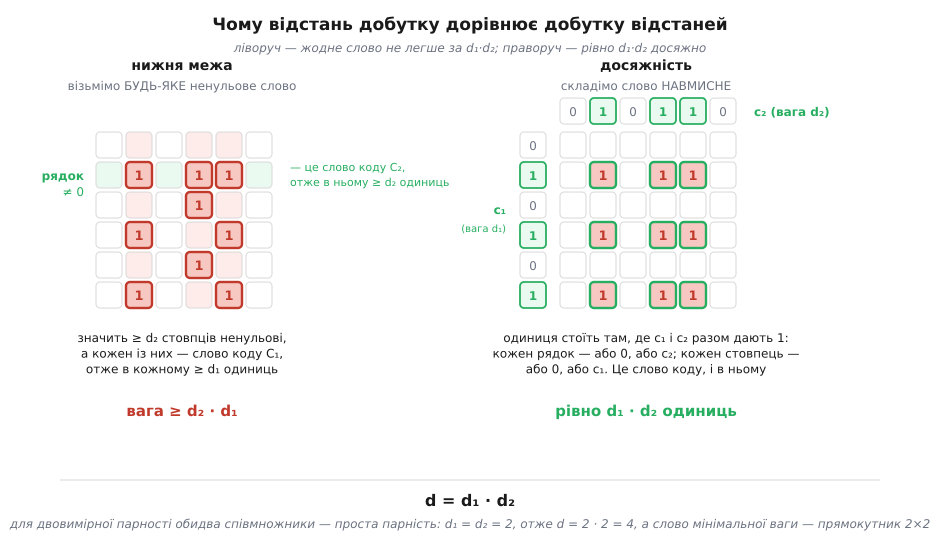
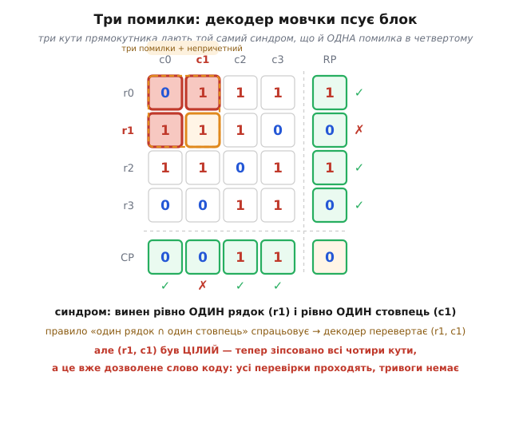

# Добуткові коди

<preknowlist>
- [Біт парності](book:communications/parity-bit) — один зайвий біт, що дорівнює XOR усіх бітів даних; найпростіший код, який помічає одну помилку.
- [Відстань Геммінга](book:communications/hamming-distance) — найменше число позицій, у яких різняться два дозволені слова коду; саме вона вирішує, скільки помилок код виявить і скільки виправить.
- [Лінійні блокові коди](book:communications/linear-block-codes) — сума двох дозволених слів знову дозволена; звідси мінімальна відстань коду дорівнює найменшій вазі його ненульового слова.
- [Двовимірна парність](book:communications/2d-parity) — біти даних у сітці з парністю окремо вздовж рядків і стовпців; найпростіший добутковий код, з якого тут усе починається.
</preknowlist>

Про [двовимірну парність](book:communications/2d-parity) зазвичай кажуть: її мінімальна відстань дорівнює чотирьом. Число подають як вимірювану властивість — мовляв, перебрали всі варіанти, найлегша непомітна помилка виявилася вагою чотири, отже d = 4. Але перебирати нічого не треба. Четвірка не виміряна — вона **обчислена**, і обчислена множенням: 2 · 2. Кожна двійка — це мінімальна відстань звичайнісінького коду з одним бітом парності, узятого тут двічі: раз уздовж рядків, раз уздовж стовпців.

Це не збіг і не мнемоніка. За решіткою з парностей стоїть точна алгебраїчна операція — **добуток кодів** (англ. *product code*), — і слово «добуток» у її назві буквальне. Коли перемножуються два коди, разом із ними перемножуються **три їхні числа одразу**: розмірність, швидкість і мінімальна відстань. Решітка — найпростіший випадок цієї операції, узятий двічі від найпростішого можливого співмножника. Розберімо машинку від першопричини: що з чим множиться, **чому** множиться, і яку ціну за це править код.

## Співмножник: парність — це вже повноцінний код

Щоб перемножити два коди, треба спершу визнати, що [біт парності](book:communications/parity-bit) — це код. Не «перевірка», не «трюк», а код у повному розумінні: множина дозволених слів із власними параметрами.

Візьмімо n бітів даних і допишімо один біт, що дорівнює їхньому XOR-у. Дістали слово завдовжки n+1. Такий код позначають **SPC(n+1, n)** (англ. *single parity check* — одинарна перевірка парності) або в загальному записі параметрів **[n+1, n, 2]**: довжина n+1, розмірність n, мінімальна відстань 2.

Найважливіше в ньому — не конструкція, а те, **чим виявилася множина його слів**. Слово має вигляд (дані, парність), де парність — це XOR даних. Отже XOR **усього** слова, разом із доданим бітом, завжди нуль. А XOR усіх бітів дорівнює нулю рівно тоді, коли одиниць у слові парне число. Виходить:

```
SPC(n+1, n) = { усі слова довжини n+1, у яких парне число одиниць }
```

Це вже не опис процедури, а опис множини — і саме такий опис дозволяє з кодом рахувати. Перевірмо, що нічого не загубилося: слів парної ваги довжини n+1 рівно 2ⁿ (перші n бітів вільні, останній визначений), а розмірність коду — n, тобто слів теж 2ⁿ. Збігається: код парності — це **точно** множина слів парної ваги, ні більше ні менше.

Тепер відстань. Ідеться про [мінімальну відстань](book:communications/hamming-distance) коду — найменше число позицій, у яких різняться два його дозволені слова; саме вона й вирішує, скільки помилок код помітить і скільки виправить. Рахувати її дозволяє властивість, на якій тримається вся подальша арифметика: **у лінійного коду мінімальна відстань дорівнює мінімальній вазі ненульового слова**. Причина проста. Над F₂ відстань між двома словами — це вага їхньої суми:

```
d(x, y) = wt(x + y)
```

бо одиниці в сумі стоять точно там, де x і y різняться. Але код [лінійний](book:communications/linear-block-codes) — сума двох його слів знову його слово. Коли x і y пробігають усі пари різних слів, x + y пробігає всі **ненульові** слова коду. Отже шукати найменшу відстань між парами й шукати найлегше ненульове слово — це те саме заняття. Замість 2ᵏ(2ᵏ−1)/2 пар досить переглянути 2ᵏ−1 слів; далі ми зведемо навіть цю роботу нанівець.

Для SPC відповідь тепер очевидна: найлегше ненульове слово парної ваги має вагу 2 (наприклад, дві одиниці й решта нулі). Ваги 1 бути не може — вона непарна. Тому

```
d(SPC) = 2
```

Двійка — це стеля дешевизни. Один зайвий біт купує рівно стільки: помітити одну помилку (бо вона робить вагу непарною) і жодної не виправити. Обидві двійки, що дадуть нам четвірку, — саме ці.

## Операція: як перемножують два коди

Тепер сама операція. Візьмімо два лінійні коди — C₁ з параметрами [n₁, k₁, d₁] і C₂ з параметрами [n₂, k₂, d₂]. Їхній **добуток** C₁ ⊗ C₂ будується так: дані розкладаємо прямокутником k₁ × k₂, кожен **рядок** кодуємо кодом C₂ (він розтягується з k₂ до n₂), кожен **стовпець** — кодом C₁ (з k₁ до n₁). Виходить масив n₁ × n₂.

Для решітки з парностей обидва співмножники — прості парності. Хай дані лежать сіткою n × m: n рядків, m стовпців, разом n·m бітів. Тоді кожен рядок — це m бітів даних плюс біт парності, тобто слово коду C₂ = SPC(m+1, m); кожен стовпець — n бітів даних плюс біт парності, тобто слово коду C₁ = SPC(n+1, n). Двовимірна парність — це рівно

```
C = SPC(n+1, n) ⊗ SPC(m+1, m)
```

перший співмножник працює вздовж стовпців, другий — уздовж рядків.

Але конструкція описана процедурою («спершу рядки, тоді стовпці»), а процедура одразу підіймає незручне питання. Ми домовилися кодувати рядки, потім стовпці. А якби навпаки — спершу стовпці, тоді рядки? Кутова клітинка дістала б інше означення: у першому порядку її рахують як парність доданої колонки, у другому — як парність доданої стрічки. Чи це те саме число? Якщо ні — конструкція розвалюється, бо «код» залежав би від того, з якого боку до нього підійти.

Відповідь дає запис через матриці. Хай U — масив даних n × m, а G₁ і G₂ — породжувальні матриці співмножників. Для SPC(n+1, n) породжувальна матриця має вигляд G₁ = [Iₙ | 1]: одинична матриця плюс стовпчик одиниць. Транспонована G₁ᵀ, помножена зліва на масив, дописує знизу рядок, що дорівнює сумі всіх рядків, — тобто **стрічку парності стовпців**. Множення справа на G₂ дописує праворуч стовпець-суму — **колонку парності рядків**. Тоді кодування рядків із наступним кодуванням стовпців — це

```
A = G₁ᵀ · (U · G₂)
```

а кодування стовпців із наступним кодуванням рядків — це

```
A = (G₁ᵀ · U) · G₂
```

І ці два вирази однакові — просто тому, що **множення матриць асоціативне**. Дужки можна пересунути; порядок кодування не має значення. Ось і вся розгадка того, чому кутовий біт узгоджений: він не «вдало збігся», його узгодженість — це асоціативність, записана для одного-єдиного елемента масиву. Перевірмо прямо. Останній елемент добутку G₁ᵀ · U · G₂ дорівнює

```
A[n][m] = Σᵢ Σⱼ  G₁ᵀ[n][i] · U[i][j] · G₂[j][m]
        = Σᵢ Σⱼ  1 · U[i][j] · 1          (останній рядок G₁ᵀ і останній стовпець G₂ — самі одиниці)
        = XOR усіх бітів даних
```

Кут — це парність усього масиву даних, і формула не питає, яким шляхом ми до неї йшли.

Із матричного запису випливає й друге, значно зручніше означення добутку — вже не процедурою, а властивістю:

```
A ∈ C₁ ⊗ C₂   ⟺   кожен СТОВПЕЦЬ масиву A — слово коду C₁
                  і кожен РЯДОК масиву A — слово коду C₂
```

Для решітки з парностей це читається геть просто: **масив (n+1) × (m+1), у якому кожен рядок і кожен стовпець має парне число одиниць**. Жодних згадок про «дані» й «перевірки», жодного порядку кодування — сама умова. Саме з цього означення ми зараз витягнемо все інше.

> 🔧 **Навіщо це.** Перехід від «як кодувати» до «що вийшло» — не педантизм, а робочий важіль. Поки код описаний процедурою, кожне питання про нього доводиться перевіряти перебором: щоб знайти мінімальну відстань блоку 4×4, довелося б перебрати 2¹⁶ = 65 536 слів, а для блоку 8×8 — уже 2⁶⁴, що не перебере ніхто. Щойно код описано **умовою на масив**, відповіді здобуваються міркуванням за пів сторінки й одразу для **всіх** n і m. Далі саме так і буде: спершу відстань, тоді повний список найнебезпечніших помилок, тоді їхня кількість — і жодного перебору.

## Три числа, що перемножуються

Порахуймо параметри добутку. Довжина очевидна: масив n₁ × n₂, отже

```
N = n₁ · n₂ = (n+1)(m+1)
```

Розмірність теж: вільними лишаються рівно клітинки даних, решта визначена,

```
k = k₁ · k₂ = n · m
```

Звідси швидкість — і ось перший приємний сюрприз:

```
R = k/N = nm / ((n+1)(m+1)) = [n/(n+1)] · [m/(m+1)] = R₁ · R₂
```

**Швидкість добутку — добуток швидкостей.** Це не властивість парності, а загальне правило: R = k₁k₂/(n₁n₂) = (k₁/n₁)·(k₂/n₂). Кожен співмножник бере свою частку, і частки перемножуються.

**Приклад-умова: блок даних 4×4.**

```
дані:            n · m = 4 · 4 = 16 біт
кодове слово:    (n+1)(m+1) = 5 · 5 = 25 біт
надлишок:        25 − 16 = 9 біт
швидкість:       R = 16/25 = 0.64
перевірка:       R₁ · R₂ = (4/5) · (4/5) = 16/25 = 0.64   ✓
```

Дев'ять бітів надлишку — число варте окремої уваги, бо воно не таке, як здається на перший погляд. Перевірок у решітці (n+1) + (m+1) = 5 + 5 = 10: п'ять рядкових і п'ять стовпцевих. А надлишок — дев'ять. Одна перевірка кудись поділася.

Знайдімо її. Складімо **всі** рядкові перевірки разом: сума парностей усіх рядків — це парність усіх бітів масиву. Складімо всі стовпцеві: це знову парність усіх бітів масиву. Отже

```
(сума всіх рядкових перевірок) = (сума всіх стовпцевих перевірок)
```

Це **лінійна залежність** між перевірками: десять умов, але одна з них — наслідок решти дев'яти. Знаючи дев'ять, десяту дописуєш безкоштовно. Тому ранг системи дорівнює

```
(n+1) + (m+1) − 1 = n + m + 1 = 4 + 4 + 1 = 9
```

рівно стільки, скільки бітів надлишку ми й нарахували арифметикою: (n+1)(m+1) − nm = n + m + 1. Два незалежні підрахунки збіглися — і водночас це друга, вже структурна відповідь на питання про кутовий біт. Кут не є окремою десятою перевіркою; він — та сама єдина залежність, побачена з іншого боку. Ось чому його байдуже рахувати вздовж стрічки чи вздовж колонки, і ось чому решітка не марнує двадцять п'ятий біт даремно.

## Чому відстань перемножується

Тепер головне. Твердження таке:

```
d(C₁ ⊗ C₂) = d₁ · d₂
```

Доведімо його з двох боків: спершу покажімо, що легших слів **не буває**, тоді — що вага d₁·d₂ таки **досяжна**. Обидві половини випливають просто з означення «кожен стовпець у C₁, кожен рядок у C₂».


*Дві половини одного доказу. Ліворуч: у будь-якого ненульового слова знайдеться ненульовий рядок; він — слово коду C₂, отже несе щонайменше d₂ одиниць, а значить щонайменше d₂ стовпців масиву ненульові; кожен такий стовпець — слово коду C₁, отже несе щонайменше d₁ одиниць. Разом — не менше за d₁·d₂. Праворуч: беремо слово c₁ ваги d₁ і слово c₂ ваги d₂ й ставимо одиниці на всіх їхніх перетинах; кожен рядок такого масиву — або нуль, або c₂, кожен стовпець — або нуль, або c₁, отже це слово коду, і в ньому рівно d₁·d₂ одиниць. Обидві оцінки зійшлися — відстань дорівнює добутку відстаней.*

**Знизу.** Візьмімо будь-яке ненульове слово A. Раз воно ненульове, у ньому є ненульовий рядок. Цей рядок — слово коду C₂, до того ж ненульове, отже в ньому щонайменше d₂ одиниць. Кожна така одиниця сидить у своєму стовпці — виходить, **щонайменше d₂ стовпців масиву ненульові**. А кожен ненульовий стовпець — це ненульове слово коду C₁, отже в ньому щонайменше d₁ одиниць. Підсумуймо по цих стовпцях:

```
wt(A) ≥ (число ненульових стовпців) × (найменша вага ненульового стовпця)
      ≥ d₂ × d₁
```

**Зверху.** Треба пред'явити слово ваги рівно d₁·d₂. Візьмімо слово c₁ ∈ C₁ ваги d₁ і слово c₂ ∈ C₂ ваги d₂ й складімо **зовнішній добуток**: масив, у якому

```
A[i][j] = c₁[i] · c₂[j]
```

Це слово коду? Погляньмо на рядок i. Якщо c₁[i] = 0, весь рядок нульовий — нуль належить будь-якому лінійному коду. Якщо c₁[i] = 1, рядок дорівнює точно c₂ — слову коду C₂. Так само кожен стовпець — або нуль, або c₁. Умову виконано, A ∈ C₁ ⊗ C₂. А одиниць у ньому рівно стільки, скільки пар «одиниця в c₁, одиниця в c₂», тобто d₁ · d₂.

Дві оцінки затиснули відстань з обох боків — вона дорівнює добутку. І тепер четвірка з'являється сама:

```
C₁ = SPC(n+1, n),  d₁ = 2
C₂ = SPC(m+1, m),  d₂ = 2
d = d₁ · d₂ = 2 · 2 = 4
```

Причому — це важливо — **незалежно від n і m**. Чи блок 4×4, чи 1000×1000, чи витягнутий 2×500: відстань завжди чотири, бо співмножники завжди ті самі. Розмір блоку впливає на швидкість, але не має жодної влади над відстанню.

Варто помітити й те, що доказ **зверху** каже не лише «чотири досяжно», а й **як саме** воно виглядає. Слово мінімальної ваги — це зовнішній добуток двох найлегших слів співмножників. Для парності найлегше слово — це дві одиниці; зовнішній добуток двох таких — одиниці на всіх чотирьох перетинах двох рядків із двома стовпцями. Тобто **прямокутник**. Не «знайшли прикрий контрприклад», а «конструкція сама його видала».

## Усі найлегші слова — і тільки прямокутники

Доказ дав нам одне слово ваги 4. Але для чесних гарантій треба знати **всі** — бо саме слова мінімальної ваги є непомітними помилками коду, і від їхньої кількості залежить, як часто код мовчки бреше. Покажімо, що прямокутниками вичерпується весь список.

Спершу — чому вага завжди парна. Вага масиву — це сума ваг його рядків, а кожен рядок має парну вагу. Сума парних чисел парна, отже

```
у решітці НЕ ІСНУЄ слів ваги 1, 3, 5, 7, …
```

Одним рядком відпали всі непарні ваги. Лишається розібрати парні знизу.

**Вага 2 неможлива.** Хай у масиві рівно дві одиниці. Якщо вони в одному рядку — то кожна з них єдина у своєму стовпці, і ці стовпці мають непарну вагу 1. Заборонено. Якщо в різних рядках — то кожен із цих рядків має вагу 1, знову непарну. Заборонено. Виходу немає.

Отже d ≥ 4, і четвірка досяжна — це вже незалежне підтвердження теореми, здобуте голими руками, без жодних добутків.

**Вага 4 — тільки прямокутники.** Хай у масиві рівно чотири одиниці. Кожен ненульовий рядок має парну вагу ≥ 2, а всього одиниць чотири. Отже можливі лише два розклади.

*Один рядок із чотирма одиницями.* Тоді кожен із цих чотирьох стовпців містить рівно одну одиницю — вага 1, непарна. Заборонено.

*Два рядки по дві одиниці.* Хай рядок i₁ має одиниці у стовпцях {a, b}, а рядок i₂ — у стовпцях {c, d}. Погляньмо на стовпець a. Одиниця з рядка i₁ там є. Якщо a не входить до {c, d}, то більше одиниць у стовпці a немає — вага 1, непарна, заборонено. Значить a ∈ {c, d}. Те саме міркування для b. Отже {a, b} = {c, d} — обидва рядки б'ють по **тих самих** двох стовпцях. А це і є прямокутник.

Інших варіантів немає. Висновок точний і повний:

```
слова ваги 4  ⟺  вибір 2 рядків із (n+1) і 2 стовпців із (m+1),
                 одиниці — на всіх чотирьох перетинах
```

Тепер їх легко порахувати — задача звелася до вибору двох рядків і двох стовпців:

```
A₄ = C(n+1, 2) · C(m+1, 2)
```

**Приклад-умова: скільки сліпих плям у блоці 4×4 (масив 5×5).**

```
вибрати 2 рядки з 5:     C(5,2) = 5·4/2 = 10
вибрати 2 стовпці з 5:   C(5,2) = 5·4/2 = 10
слів ваги 4:             A₄ = 10 · 10 = 100
```

Сто прямокутників. Не «є така прикра конфігурація» — рівно сто, поіменно, і серед них ті, що зачіпають лише дані, ті, що чіпають біти парності, і ті, що дістають кут: означення не робить між ними різниці, бо для нього всі 25 клітинок рівноправні.

Число можна перевірити наскрізь. Візьмімо найменшу решітку — дані 2×2, масив 3×3, розмірність 4, отже всього 2⁴ = 16 слів. Наша формула обіцяє A₄ = C(3,2)·C(3,2) = 9 прямокутників. Порахуймо решту руками. Ваги 8 бути не може: кожен рядок має вагу 0 або 2 (три клітинки, парна вага), отже максимум 6. Лишається вага 6 — це три рядки по дві одиниці. Кожен такий рядок **пропускає** рівно один стовпець; позначмо через p(i) стовпець, що його пропускає рядок i. Стовпець j тоді містить 3 − (скільки рядків його пропустили) одиниць, і щоб це число було парним, пропустити його мають непарну кількість разів. Пропусків усього три, на три стовпці, кожен непарну кількість разів — можливий лише розклад (1, 1, 1), бо нуль парний. Тобто p — перестановка трьох стовпців, а їх 3! = 6. Підсумуймо:

```
1 (нуль) + 9 (вага 4) + 6 (вага 6) = 16 = 2⁴   ✓
```

Сходиться до останнього слова. Ваговий розподіл решітки 3×3 повністю відомий: 1 + 9z⁴ + 6z⁶.

## Виявити три АБО виправити одну — але не разом

Тепер зберімо врожай. Мінімальна відстань 4 означає, що дозволені слова коду розкидані так, що між будь-якими двома — щонайменше чотири розбіжності. Далі — чиста геометрія.

**Виявлення.** Будь-яка ненульова помилка вагою до 3 не може перетворити одне дозволене слово на інше — для цього треба щонайменше 4 зміни. Отже приймач побачить недозволене слово й здійме тривогу:

```
виявляємо гарантовано:  до d − 1 = 3 помилок
```

**Виправлення.** Обведімо навколо кожного дозволеного слова кулю радіуса t — усі слова, що відрізняються не більш ніж у t позиціях. Поки кулі не перетинаються, кожне прийняте слово всередині кулі належить лише одному центру, і декодер відновлює його однозначно. Кулі радіуса t навколо двох слів на відстані d не перетинаються, доки 2t < d:

```
виправляємо гарантовано:  t = ⌊(d − 1)/2⌋ = ⌊3/2⌋ = 1 помилку
```

Ось і обіцяні «виявити ≤ 3 / виправити 1». Та між цими двома числами захована пастка, і вона куди цікавіша за самі числа.

Правило декодера решітки — «винен рівно один рядок і рівно один стовпець → перевертай їхній перетин». Погляньмо, що воно робить із **трьома** помилками. Візьмімо три клітинки, що є трьома кутами прямокутника.


*Пастка потрійної помилки. Зіпсовано три клітинки з чотирьох кутів прямокутника. Рядок r0 дістав дві зміни — його парність ціла, він мовчить; рядок r1 дістав одну — він винен. Стовпець c0 дістав дві — мовчить; стовпець c1 дістав одну — винен. Синдром показує рівно один поганий рядок і рівно один поганий стовпець, тобто виглядає точнісінько як звичайна одна помилка. Декодер слухняно перевертає їхній перетин (r1, c1) — цілу клітинку, — і тим **добудовує прямокутник до повного**. Результат — дозволене слово коду: усі перевірки проходять, тривоги немає, а блок зіпсовано в чотирьох місцях.*

Це не хиба реалізації, а неминучість геометрії. Три кути прямокутника лежать на відстані **один** від четвертого — тобто всередині кулі радіуса 1 навколо **чужого** дозволеного слова. Декодер, що виправляє однократні помилки, зобов'язаний віддати центр тієї кулі, у яку потрапив, і він робить рівно те, що обіцяв. Просто потрапив не туди.

Загальне правило формулюють так: код із відстанню d може **одночасно** виправляти t помилок і виявляти e помилок (e ≥ t) лише коли

```
t + e ≤ d − 1
```

Причина видна одразу. Хай сталося w помилок, t < w ≤ e, і приймач опинився за w кроків від правдивого слова c. Небезпека — потрапити в кулю радіуса t навколо чужого слова c′. Якби потрапив, то за нерівністю трикутника

```
d(c, c′) ≤ d(c, прийняте) + d(прийняте, c′) ≤ e + t
```

тобто два дозволені слова опинилися б на відстані e + t. Щоб такого не було, потрібно d > e + t. Підставмо нашу четвірку:

```
t = 1, e = 2:   1 + 2 = 3 ≤ 3   ✓  виправляти одну й водночас виявляти дві — можна
t = 0, e = 3:   0 + 3 = 3 ≤ 3   ✓  нічого не виправляти й виявляти три — можна
t = 1, e = 3:   1 + 3 = 4 > 3   ✗  і виправляти одну, і виявляти три — НЕ можна
```

Ось і розгадка. «Виявити три» і «виправити одну» — це **два різні режими одного коду**, а не дві одночасні обіцянки. Увімкнув виправлення — і стеля гарантованого виявлення осіла з трьох до двох. Хочеш чесних трьох — вимикай виправлення й лише сигналь.

Скільки саме потрійних помилок падає в пастку — рахується тією самою комбінаторикою. Мовчки псується рівно та трійка, що є трьома кутами прямокутника; прямокутників A₄, у кожного 4 кути, і викинути можна будь-який один. Двічі нічого не порахується: три кути однозначно задають свої два рядки й два стовпці, отже й той єдиний прямокутник, з якого їх узято.

```
небезпечних трійок:  4 · A₄ = 4 · 100 = 400
усіх трійок у слові: C(25, 3) = 25·24·23/6 = 2300
частка:              400/2300 ≈ 17 %
```

Кожна шоста потрійна помилка не просто лишиться невиправленою — вона буде **мовчки перетворена на неправильні дані** з повним набором зелених галочок. Решта 1900 чесно позначаться як биті. Це і є справжня, не заокруглена ціна режиму виправлення.

> 🔧 **Навіщо це.** Різниця між «код не виправив» і «код виправив неправильно» — це різниця між затримкою й катастрофою. У першому випадку система знає, що дані биті, і має вибір: перепитати, вимкнутися, підняти прапорець. У другому вона віддає зіпсовані байти вгору з виглядом цілковитої впевненості, і жодний наступний рівень уже не має підстав сумніватися. Тому в застосуваннях, де надійність важить більше за латання на місці, режим виправлення в решітці навмисно **вимикають**: краще чесне «биті» на кожній трійці, ніж 17 % шансу тихої брехні. Обидва режими дає той самий код і той самий надлишок — різниця лише в тому, дозволено декодеру перевертати біти чи ні.

## Коли решітка росте: швидкість дешевшає, відстань не рухається

Тепер видно всю економіку решітки — і її стелю. Погляньмо, що дає збільшення блоку. Хай дані квадратні, k × k:

```
швидкість:            R = k²/(k+1)²      →  1        (росте, і це добре)
мінімальна відстань:  d = 4              →  4        (СТОЇТЬ, і це погано)
слів ваги 4:          A₄ = [k(k+1)/2]²   →  ∞        (росте, і це дуже погано)
відносна відстань:    d/N = 4/(k+1)²     →  0
```

Три перші рядки — суть усієї угоди. Надлишок дешевшає, бо два ряди парності обслуговують дедалі більший блок. Відстань не зрушить з місця ніколи, бо співмножники не змінилися. А число сліпих плям росте як k⁴ — квадрат від числа способів вибрати два рядки, помножений на квадрат від числа способів вибрати два стовпці.

Порахуймо, чого це коштує насправді. Для каналу, що перевертає кожен біт незалежно з імовірністю p, імовірність **непоміченої** помилки блоку — це сума ймовірностей усіх ненульових слів коду, і при малому p її веде найлегший доданок:

```
P_нп ≈ A₄ · p⁴
```

**Приклад-умова: два розміри решітки, канал із p = 10⁻³.**

```
дані 4×4  →  масив 5×5
    A₄  = C(5,2)²   = 10²   = 100          R = 16/25 = 0.64
    P_нп ≈ 100 · (10⁻³)⁴                     ≈ 10⁻¹⁰

дані 8×8  →  масив 9×9
    A₄  = C(9,2)²   = 36²   = 1296         R = 64/81 ≈ 0.79
    P_нп ≈ 1296 · (10⁻³)⁴                    ≈ 1.3 · 10⁻⁹

дані 100×100  →  масив 101×101
    A₄  = C(101,2)² = 5050² ≈ 2.55·10⁷     R = 10000/10201 ≈ 0.980
    P_нп ≈ 2.55·10⁷ · (10⁻³)⁴                ≈ 2.6 · 10⁻⁵
```

Від 4×4 до 100×100 швидкість підросла з 0.64 до 0.98 — надлишок майже зник. А ймовірність тихої брехні зросла з 10⁻¹⁰ до 2.6·10⁻⁵, тобто приблизно у чверть мільйона разів. Блоки різного розміру порівнювати за словом не зовсім чесно, тож перерахуймо на біт даних: 10⁻¹⁰ на 16 бітів — це 6.3·10⁻¹² на біт; 2.6·10⁻⁵ на 10 000 бітів — це 2.6·10⁻⁹ на біт. Розрив меншає, але лишається чималим — приблизно чотириста разів. Висновок сухий: **решітку не можна безкарно збільшувати заради швидкості**. Кожен зайвий рядок додає нових прямокутників, а нових сил — жодних.

Коріння цього — у відносній відстані. У доброго коду відстань росте разом із довжиною, і частка помилок, яку він тримає, лишається сталою. У решітки d/N = 4/(k+1)² тане до нуля: код завдовжки десять тисяч бітів захищений рівно так само, як код на двадцять п'ять, — четвіркою. Ось чому двовимірна парність назавжди лишається кодом для **рідких** помилок і не масштабується в надійність.

## Куди веде добуток: якщо перемножувати далі

Теорема d = d₁·d₂ має очевидний наступний крок. Якщо множення двох кодів множить відстані, чому б не перемножити три? Або сто?

Так і роблять. Тривимірна парність — це куб даних, у якому парність рахують уздовж трьох осей; формально це (SPC ⊗ SPC) ⊗ SPC, і теорема застосовується двічі поспіль:

```
d = 2 · 2 · 2 = 8
```

**Приклад-умова: куб даних 4×4×4.**

```
дані:            4³ = 64 біт
кодове слово:    5³ = 125 біт
швидкість:       R = 64/125 = 0.512 = (4/5)³
відстань:        d = 2³ = 8
виправляє:       t = ⌊(8−1)/2⌋ = 3 помилки
```

Один зайвий вимір підняв виправлення з однієї помилки до трьох. Загалом для k-кратного добутку простих парностей

```
d = 2ᵏ        N = ∏(nᵢ + 1)        R = ∏ nᵢ/(nᵢ + 1)
```

Відстань росте як 2ᵏ — експоненційно від числа вимірів. Швидкість же — це добуток дробів, менших за одиницю, і при сталому розмірі вимірів вона тане до нуля. Але вимірам можна давати рости: візьмімо, скажімо, nᵢ = 2ⁱ. Тоді сума ∑1/nᵢ збігається, а разом із нею збігається до **додатної** сталої й добуток швидкостей. Виходить сім'я кодів зі скільки завгодно великою відстанню й швидкістю, що не падає до нуля.

Саме цю думку 1954 року опублікував **Пітер Еліас** (Peter Elias, 1923–2001) — американський математик та інженер, від 1953 року професор Массачусетського технологічного інституту. Його стаття «Error-Free Coding» (*Transactions of the IRE Professional Group on Information Theory*, т. 4, с. 29–37, вересень 1954) увела клас добуткових, або **ітерованих**, кодів і показала: ітеруючи прості блокові коди, можна зробити ймовірність помилки на біт у двійковому симетричному каналі як завгодно малою, зберігаючи строго додатну швидкість. Для 1954-го це важило багато: [теорема Шеннона](book:communications/channel-coding-theorem) вже обіцяла, що надійна передача на додатній швидкості можлива, але обіцяла її неконструктивно — через випадкові коди, з якими нічого не вдієш на практиці. Еліас показав **збудований** шлях до тієї обіцянки: беремо найдешевшу перевірку, яку тільки можна вигадати, і перемножуємо її саму на себе. *(Статус доказовості: усталений факт — стаття доступна, авторство й дата не оспорювані.)*

Тут варто бути точним, бо історію легко переказати сильніше, ніж вона є. Ітеровані коди **не** роблять відносну відстань доброю: як ми щойно порахували, d/N тане до нуля навіть у двох вимірах, а в k вимірах довжина ∏(nᵢ+1) розганяється незрівнянно швидше за 2ᵏ. Суперечності немає — просто на каналі з **випадковими** помилками велика відносна відстань і не потрібна: там важить не найгірший мислимий випадок, а типовий, а типові рідкі помилки ітероване декодування вичищає крок за кроком, вимір за виміром. Проти супротивника, що навмисно ставить помилки в кути прямокутника, та сама сім'я кодів безпорадна.

Ця ж лінія веде далі, ніж куби з парностей. Множити можна не лише парність: узявши співмножниками сильніші коди, дістають добуткові коди з великою відстанню — і саме структура добутку робить їх зручними для **ітеративного** декодування, коли декодер ходить по рядках і стовпцях по черзі, і кожен прохід чистить те, що лишив попередній. Так декодують турбо-добуткові коди; та сама думка — ганяти дешеві перевірки по колу, доки картина не устоїться, — стоїть і за [LDPC](book:communications/ldpc), хоч там перевірки влаштовані інакше, ніж решіткою. Сусідня, але **інша** ідея — [каскадні коди](book:communications/concatenated-codes), де коди не перемножують, а **вкладають** один в одного. А [Рід–Соломон](book:communications/reed-solomon), поставлений у два виміри тим самим добутком, десятиліттями тримав дані на оптичних дисках.

Тож четвірка, з якої ми почали, — не властивість решітки й не її дефект. Це просто те, що виходить, коли найдешевший можливий співмножник узяти двічі: 2 · 2. Хочеш більше — бери довше або бери сильніше. Але множення чесне: воно поверне рівно те, що в нього поклали.
