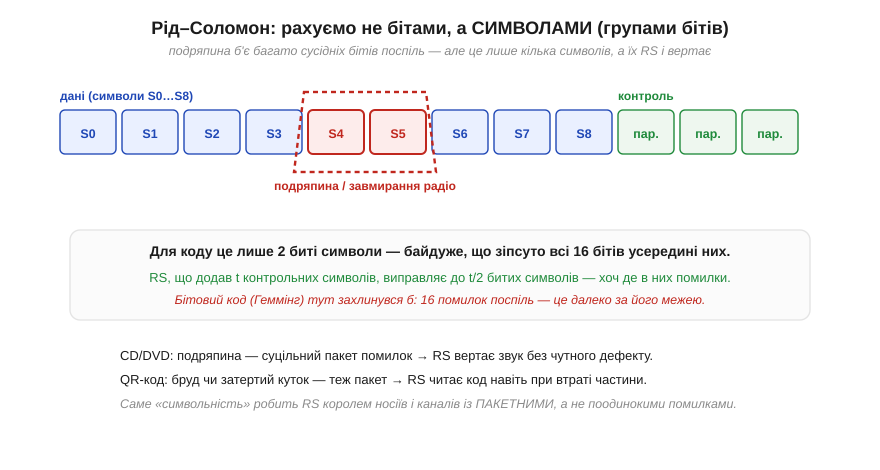

# Рід–Соломон якісно: символи замість бітів

Класичні коректувальні коди рахують **окремими бітами**: парність дивиться на одиниці, [Геммінг](book:communications/hamming-code) виправляє один биток, SECDED — теж один на слово. Це чудово, поки помилки **розкидані поодинці**. Але реальний світ часто завдає удару інакше — **пакетом**: подряпина на компакт-диску стирає тисячі сусідніх бітів поспіль, завмирання радіосигналу гасить цілий шматок кадру, бруд закриває куток QR-коду. Бітовий код тут безсилий: сотня помилок поспіль — це далеко за межею будь-якого [Геммінга](book:communications/hamming-code). Потрібен принципово інший погляд, і його дав **код Рід–Соломона** (*Reed–Solomon*, RS): рахувати не бітами, а цілими **символами** — групами бітів. Ця одна зміна перетворює пакетну помилку з катастрофи на дрібницю, і саме завдяки їй грає подряпаний диск і читається брудний QR.

### Один символ — група бітів

Суть Рід–Соломона можна вхопити без жодної алгебри, якщо правильно змінити одиницю обліку. RS працює не з бітами, а з **символами** — наприклад, з байтами (групами по 8 бітів). Дані ділять на символи, додають кілька **контрольних символів** (обчислених за хитрою, але цілком конкретною математикою над скінченним полем), і код виправляє помилки на рівні **цілих символів**. Найважливіше: для RS байдуже, **скільки бітів** усередині символу зіпсовано — один чи всі вісім; зіпсований символ він рахує **за один** і однаково його виправляє.


*Рис. Рід–Соломон рахує символами (групами бітів). Подряпина чи завмирання б'ють багато сусідніх бітів поспіль — але це лише **кілька символів**, хай навіть усі біти всередині них спотворені. RS, що додав t контрольних символів, виправляє до t/2 битих символів — байдуже, де саме в них помилки. Бітовий код (Геммінг) тут захлинувся б: 16 помилок поспіль — це далеко за його межею. Саме «символьність» робить RS королем носіїв і каналів із **пакетними** помилками.*

Ось чому RS такий могутній проти пакетів. Уявімо пакет із 16 спотворених бітів поспіль. Для **бітового** коду це 16 помилок — нездоланна стіна. А для RS, де символ = 8 бітів, цей самий пакет накриває щонайбільше **3** символи (бо 16 бітів зачіпають не більш як три сусідні байти) — а виправити три символи RS може легко, додавши всього кілька контрольних. Те, що бітовому коду здавалося катастрофою, для символьного — буденна задача. Грубо кажучи, RS міряє лихо в «зіпсованих байтах», і пакетна завада, хоч би яка щільна всередині, псує лише жменьку байтів.

> 📜 **Поряд — історія:** *Вояджери дзвонять додому* — як **каскад** із зовнішнього Рід–Соломона й внутрішнього згорткового коду дозволив апаратам «Вояджер» передавати знімки планет із відстані в мільярди кілометрів, де сигнал слабший за шепіт; і чому без цих кодів далекий космос лишався б німим.

### Чому подряпаний CD грає, а брудний QR читається

Найкраще силу RS видно на двох речах, які ми бачимо щодня. Компакт-диск зберігає музику як біти на доріжці; подряпина чи пилинка стирає суцільний шматок цих бітів — класичний пакет помилок. Саме RS (із додатковим **перемішуванням** даних по поверхні, щоб одна подряпина розкидалася на багато дрібних пошкоджень) дозволяє програвачеві відновити звук **без жодного чутного дефекту**: код вертає биті символи, і ви навіть не чуєте, що диск подряпаний. Та сама ідея — у QR-коді: він несе чималий запас контрольних символів RS, тож читається, навіть коли частина квадрата забруднена, затерта чи закрита логотипом. Бруд знищує цілий куток — а RS відновлює дані з решти.

В обох випадках працює та сама логіка: **пакетна** помилка, страшна для бітового коду, для символьного — лише кілька битих символів, які RS спокійно виправляє. Ось чому Рід–Соломон оселився всюди, де помилки приходять згустками, а не поодинці: оптичні носії (CD, DVD), штрих- і QR-коди, цифрове телебачення, супутниковий і глибококосмічний зв'язок. Скрізь, де канал чи носій схильний до пакетних збоїв, відповіддю майже завжди стає RS.

### Коли відомо ДЕ — виправляється вдвічі більше

Є у Рід–Соломона ще одна сила, яка пояснює, чому інженери так люблять **знати, де** сталося лихо. Розрізняють два випадки. **Помилка** (*error*) — це коли символ зіпсовано, але ми не знаємо, котрий саме: код мусить сам і **знайти** биту позицію, і **виправити** її значення — дві невідомі на кожен збій. **Стирання** (*erasure*) — це коли позиція битого символу **відома** наперед (наприклад, інший шар коду вже позначив цей шматок як підозрілий, або носій фізично «провалився» в цьому місці): тоді лишається одна невідома — саме значення. Через це RS із t контрольними символами виправляє до **t/2 помилок**, але аж до **t стирань** — **удвічі** більше, коли позиція відома.

Звідси випливає неочевидна, але глибока думка всієї надійності: **«відомо зіпсоване» набагато краще за «можливо зіпсоване»**. Якщо канал чи сусідній код уміє хоча б **показати пальцем** на ушкоджене місце, не виправляючи його, він уже вдвічі полегшує роботу RS. Саме так і влаштовані каскади на кшталт того, що на «Вояджерах»: внутрішній код не лише чистить дрібні помилки, а й, спіткнувшись, **позначає** свій блок як ненадійний — і зовнішній Рід–Соломон обробляє ці позначені блоки як стирання, виправляючи їх удвічі щедріше. Перетворити «десь тут помилка» на «ось тут стирання» — один із найдієвіших прийомів інженерії надійних даних.

### Перемішування: як розбити пакет на безпечні крихти

Лишилася ще одна деталь, без якої магія подряпаного диска була б неповною, — **перемішування** (*interleaving*). RS чудово бере кілька битих символів, але один **дуже довгий** пакет може зіпсувати стільки сусідніх символів **одного** кодового слова, що навіть RS не впорається. Рятунок — розкласти символи на носії **не підряд**, а вроздріб: символи одного кодового слова розкидають по поверхні так, щоб фізично сусідні біти належали **різним** словам. Тоді суцільна подряпина, накривши велику смугу, забирає лише **по одному-два** символи з кожного кодового слова — а стільки кожне з них легко відновлює.

Перемішування — це, по суті, перетворення **одного страшного пакета** на **багато дрібних, нестрашних** помилок, розподілених між кодовими словами. Воно нічого не виправляє саме — лише **переставляє** дані так, щоб з ними впорався RS. Цю пару — символьний код плюс перемішування — і застосовують на CD, у штрихкодах, у цифровому мовленні: разом вони роблять пакетну помилку керованою, хоч би якою довгою вона була.

**Приклад (чому символьність б'є пакети).** Порівняймо, як бітовий і символьний коди бачать один і той самий пакет з 12 спотворених бітів поспіль.

```
канал спотворив 12 бітів поспіль (типове завмирання / подряпина)

бітовий код (напр. Геммінг (7,4), виправляє 1 биток на слово):
  12 помилок поспіль = багато битих слів, у кожному >1 помилки
  → код НЕ впорається (його межа — 1 биток на 7)

Рід–Соломон, символ = 8 бітів:
  12 бітів поспіль накривають щонайбільше 2 символи (байти)
  → RS із 4 контрольними символами виправляє до 2 битих символів
  → дані відновлено повністю ✓
```
Та сама пакетна помилка для бітового коду — нездоланна, а для RS — лише два биті символи в межах його спроможності.

> 🔧 **Навіщо це.** Рід–Соломон — це готова відповідь на питання «що робити з **пакетними** помилками», і знати про нього корисно, навіть не реалізуючи його руками. Перше: щойно ваш канал чи носій схильний до **згустків** помилок (радіо із завмираннями, оптика з подряпинами, будь-що з фізичним зносом поверхні), бітові коди на кшталт Геммінга — невдалий вибір, а символьний RS — правильний. Друге: RS пояснює щоденну магію — чому подряпаний диск грає, брудний QR читається, а супутникове ТБ не розсипається на завадах; за всім цим стоїть один прийом «рахувати символами». Третє, практичне для систем: RS часто ставлять **зовнішнім** шаром у **каскаді** з іншим кодом (як на «Вояджерах») — внутрішній код чистить дрібні випадкові помилки, а RS добиває рідкі пакети.

Рід–Соломон закриває велику прогалину — **пакетні** помилки, перед якими пасують бітові коди. Разом із простими детекторами на кшталт парності та виправлячами на кшталт Геммінга він складає повну палітру: від одного біта парності до символьного RS, від простого виявлення до повноцінного виправлення пакетів. Інженерне мистецтво — **вибрати** з цієї палітри під конкретну задачу: коли досить дешевого детектора, а коли потрібне дороге виправлення; цьому [вибору надійного кодування](book:communications/data-reliability) і присвячена окрема розмова.

---

Підсумок §3.9.8: **Рід–Соломон** рахує не бітами, а **символами** (групами бітів, часто байтами), і виправляє помилки на рівні **цілих символів** — байдуже, скільки бітів усередині символу зіпсовано. Через це **пакетна** помилка (подряпина, завмирання), смертельна для бітового коду, для RS — лише кілька битих символів, які він легко вертає, додавши контрольні. Саме тому грає подряпаний CD (RS + перемішування), читається брудний QR (запас контрольних символів), не сиплеться супутникове ТБ і дзвонять додому «Вояджери» (каскад RS + згортковий код). RS — стандарт скрізь, де помилки **пакетні**, а не поодинокі, і часто служить зовнішнім шаром у каскаді кодів.

---
