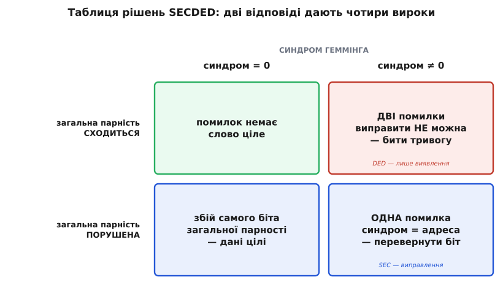

# SECDED: виправити один біт, виявити два

<preknowlist>
- [Код Геммінга](book:communications/hamming-code) — три біти парності на позиціях-степенях двійки; приймач рахує **синдром**, що прямо називає двійковий номер зіпсованого біта (000 = «все ціле»).
- [Відстань Геммінга](book:communications/hamming-distance) — мінімальна відстань d між кодовими словами вирішує все: код виявляє до d−1 помилок і виправляє до ⌊(d−1)/2⌋.
- [Біт парності](book:communications/parity-bit) — один біт, що дорівнює XOR усіх бітів даних; ловить будь-яке **непарне** число помилок і сліпий до парного.
</preknowlist>

Код Геммінга виправляє один перевернутий біт бездоганно — доки цей біт справді один. Варто ж каналу чи комірці пам'яті перекинути **два** біти, і код не просто здається — він **бреше**. Синдром усе одно виходить ненульовим, упевнено вказує на якусь позицію, приймач слухняно перевертає там біт — і повертає дані, у яких тепер **три** помилки замість двох, щиро вважаючи, що все полагодив. Це найгірший різновид відмови з усіх можливих: **тиха хибна корекція**, після якої зіпсоване число виглядає бездоганно здоровим і йде далі в розрахунки.

Там, де дані можна перепитати, це півбіди — приймач кінець кінцем помітить неладне на вищому рівні. Але в оперативній пам'яті перепитувати нема в кого: що записано, те й лежить, і якщо його прочитали неправильно, хиба піде в програму мовчки. Саме тому «голий» Геммінг у пам'ять не ставлять. Ставлять його ледь розширений варіант, який уміє те, чого сам Геммінг не вміє: **відрізнити одну помилку від двох**. Одну він, як і раніше, виправляє; дві — уже не виправляє, зате **чесно про них кричить**. Цей код звуть **SECDED** (англ. *Single Error Correction, Double Error Detection* — «виправлення однієї помилки, виявлення двох»).

Тут напрошується питання, яке варто розв'язати одразу: навіщо взагалі **виявляти** те, чого не можеш виправити? Дані ж усе одно зіпсовані. Відповідь — у прірві між гучною й тихою відмовою. Гучна відмова зупиняє машину: система бачить, що слово побите, і чесно падає, перезапитує або перезавантажується. Тиха — віддає правдоподібне, але **хибне** число, і на ньому далі будують обчислення, переказ грошей, показ приладу. Перше неприємно, друге небезпечно. SECDED купує саме цю чесність: одиничний збій — прибрати непомітно, а подвійний — **не пропустити**.

### Один зайвий біт на все слово

Рятунок коштує рівно **одного біта**. Береться готове кодове слово Геммінга — і до нього дописується ще один [біт парності](book:communications/parity-bit), але не на групу позицій, як три внутрішні парності Геммінга, а на **все слово одразу**. Він дорівнює XOR усіх бітів кодового слова й ставиться так, щоб **загальна** кількість одиниць у розширеному слові була парною. Назвімо його загальною парністю P₀.

Що дає цей один біт, видно з простого міркування про парність. [XOR усіх бітів](book:electronics/xor-comparison) — це і є відповідь на питання «одиниць парне чи непарне число». Один перевернутий біт міняє цю відповідь на протилежну (парне ↔ непарне). Два перевернутих — міняють її **двічі**, тобто повертають назад: після двох переворотів загальна парність така сама, якою була. Ось і весь секрет. **Загальна парність відчуває непарне число помилок і сліпа до парного** — та сама властивість, через яку одинокий біт парності колись здавався слабким, тут стає точним інструментом, що відрізняє «одну помилку» від «двох».

### Дві відповіді, чотири вироки

Тепер приймач має на руках **дві** незалежні відповіді. Перша — синдром Геммінга: нуль, якщо три внутрішні парності сходяться, ненульове число-адреса, якщо ні. Друга — загальна парність: сходиться вона чи ні. Чотири комбінації цих двох відповідей і складають усю логіку SECDED.


*Уся SECDED-логіка на одному погляді. Синдром каже, чи побите слово Геммінга й куди; загальна парність каже, парне чи непарне число помилок. Разом вони розрізняють чотири випадки. Небезпечний кут — унизу праворуч: синдром кричить, а загальна парність спокійна — це незмивний підпис **двох** помилок, які «голий» Геммінг тихо перетворив би на три.*

Проговорімо кожну клітинку, бо саме в них — уся суть.

- **Синдром = 0, загальна парність сходиться.** Обидва детектори мовчать — помилок немає, слово ціле.
- **Синдром ≠ 0, загальна парність порушена.** Порушена загальна парність означає **непарне** число помилок; найпростіший такий випадок — рівно одна. Синдром називає її адресу, приймач перевертає той біт — і слово відновлено. Це звичайне виправлення Геммінга, ніщо не змінилося.
- **Синдром = 0, загальна парність порушена.** Три внутрішні парності сходяться — отже, у самому слові Геммінга все гаразд, — а загальна порушена. Єдине, що могло так статися: перевернувся **сам** біт загальної парності P₀. Дані цілі, чіпати їх не треба (за бажання — перевернути назад лише P₀).
- **Синдром ≠ 0, загальна парність сходиться.** Ось той кут, заради якого все затівалося. Загальна парність ціла — значить, помилок **парне** число; але синдром ненульовий — значить, помилок не нуль. Найменше парне ненульове число — **два**. Це подвійна помилка. Виправити її код не може (синдром указує хибну адресу — не ту, де насправді збій), але й проґавити не сміє: сама комбінація «синдром кричить, а загальна парність спокійна» — це **незмивний підпис двох помилок**. Приймач не чіпає дані й піднімає тривогу: слово побите.

> 🔧 **Навіщо це.** Саме SECDED, а не «голий» Геммінг, стоїть в [оперативній пам'яті серверів](book:communications/ecc-ram-flash) — бо там тиха подвійна помилка неприпустима. Практична вигода — у двох різних лічильниках, які така пам'ять веде: **виправних** помилок (correctable, CE — той нижній лівий кут «одна помилка») і **невиправних** (uncorrectable, UE — кут «дві помилки»). Перший росте тихо й повідомляє: конкретна мікросхема почала сипатися, її варто замінити **до** відмови. Другий означає, що система свідомо зупинилась або перезапустила процес, аби не віддати хибні дані. Читаючи ці лічильники (у Linux — через EDAC чи журнал IPMI), адміністратор бачить деградацію заздалегідь. Це і є цінність DED: не просто «виправляй один біт», а **чесна межа**, за якою машина каже «далі не гарантую» замість того, щоб мовчки збрехати.

### Чому одного біта досить: відстань стрибає з 3 до 4

Чому цей додатковий біт спрацьовує, можна побачити не лише через парність, а й **геометрично** — мовою [відстані Геммінга](book:communications/hamming-distance). У «голого» коду Геммінга мінімальна відстань між кодовими словами d = 3: будь-які два дозволені слова різняться щонайменше трьома бітами. Цього рівно вистачає, щоб виправити один збій (⌊(3−1)/2⌋ = 1) — але не більше.

Додавши загальну парність, ми змінюємо саму множину дозволених слів: тепер **кожне** кодове слово має парну кількість одиниць. А коли всі слова парної ваги, відстань між будь-якими двома з них теж мусить бути парною — і найменша можлива непарна відстань 3 стає недосяжною. Мінімальна відстань підскакує з 3 до **d = 4**. Один доданий біт розсунув усі кодові слова на крок далі одне від одного.

Що саме купує ця четвірка, найкраще видно на «кульках» навколо кодових слів.


*Чому зайвий біт ловить подвійну помилку. Навколо кожного кодового слова — «куля» радіуса 1: усе, що відрізняється не більш як на один біт, виправляється до центру. Угорі (d = 3) кулі A і B стикаються без зазору, тож подвійна помилка від A (два кроки) падає просто в кулю B — і код упевнено «виправляє» дані на **чуже** слово, навіть не здогадуючись. Унизу (d = 4) між кулями з'являється **нічийна земля**: подвійна помилка застрягає рівно посередині, за два кроки від обох центрів — вона не належить нікому, отже це не кодове слово й не виправна ситуація. Код бачить, що слово побите, і чесно про це каже.*

Простежмо всі випадки на нижній прямій (d = 4). **Один** збій зсуває нас на крок від правильного слова — ми лишаємось у його кулі, за крок від центру й за три від найближчого чужого, тож виправлення однозначне. **Два** збої зсувають на два кроки — ми на нічийній землі, за два кроки від обох сусідів: жодна куля нас не приймає, і це безпомилкова ознака помилки, яку не можна виправити, але видно. **Три** збої зсувають на три кроки — і ось тут межа SECDED: ми опиняємось за крок від **чужого** кодового слова, у його кулі, тож код прийме нас за одиничну помилку того слова й тихо «виправить» дані на хибні. Проти трьох і більше збоїв у слові SECDED уже безсилий — але це чесна межа, а не діра: код гарантує рівно те, що обіцяє.

Строгий бік цієї геометрії — чому парна вага дає саме d = 4 і як загальне правило «виправити t, виявити s» вимагає t + s ≤ d − 1 (для SECDED: 1 + 2 = 3 = 4 − 1) — розібрано у вставці [відстань, вага і правило SECDED](book:communications/secded/math-secded-distance.md).

### Той самий код у пам'яті: 72, 64 і трюк Сяо

Найменший конкретний SECDED виростає прямо з коду Геммінга (7,4): чотири біти даних, три внутрішні парності — і восьмий біт загальної парності зверху. Виходить розширений код (8,4) з d = 4. На ньому все видно на пальцях, але в пам'яті слова роблять довшими — бо що довше слово, то дешевший контроль на біт даних.


*Будова SECDED-слова. Перші сім бітів — звичайне слово [Геммінга (7,4)](book:communications/hamming-code): парності на позиціях-степенях двійки, дані на решті. Восьмий біт P₀ — загальна парність, XOR усіх семи, що робить кількість одиниць парною. У пам'яті принцип той самий, лише масштаб інший: серверний SECDED — це код **(72,64)**, тобто 64 біти даних плюс 8 контрольних; для 32 бітів даних беруть **(39,32)**. Довше слово — менша відносна ціна контролю.*

Стандарт для серверної RAM — саме **(72,64)**: до кожних 64 бітів даних SECDED додає 8 контрольних, і шина пам'яті стає завширшки 72 біти замість 64. Звідси й дев'ята мікросхема на ECC-модулі, і 12.5% «зайвої» пам'яті — ціна за те, щоб поодинокий збій не валив машину, а подвійний не проходив тихо. Як цей код живе в залізі RAM і флешу — тема [ECC у пам'яті](book:communications/ecc-ram-flash).

Але тут ховається практична тонкість, через яку реальні контролери **не** роблять SECDED дослівно так, як ми його описали. Якщо просто дописати один загальний біт парності до коду Геммінга, цей біт мусить порахувати XOR **усіх** 71 біта слова — величезне дерево вентилів, найповільніший вузол схеми, який гальмує кожне читання пам'яті. Тому в 1970 році інженер IBM **Му-Ює Сяо** (M. Y. Hsiao) запропонував інший спосіб дістати ту саму d = 4: збудувати весь код так, щоб кожен контрольний біт залежав від **непарного** й приблизно **однакового** числа бітів даних. Такий код (його звуть кодом Сяо) дає SECDED без жодного окремого «важкого» біта — робота XOR рівномірно розподілена між усіма вісьмома контрольними бітами, тож схема виходить швидшою й меншою, а заразом ловить чимало багатобітних помилок понад обіцяні дві. Саме код Сяо, а не підручниковий розширений Геммінг, працює в реальних контролерах пам'яті — його історію й механізм «непарних стовпців» розібрано у вставці [код Сяо: непарні стовпці замість зайвого біта](book:communications/secded/hist-hsiao-code.md).

### Повний цикл на слові (8,4)

Простежмо SECDED наскрізь на найменшому коді — ті самі чотири біти даних, три сценарії помилок, чотири вироки з таблиці.

```
дані D1 D2 D3 D4 = 1 0 1 1
слово Геммінга (поз.1..7)  = 0 1 1 0 0 1 1        (як у коді (7,4))
загальна парність P0 = XOR усіх семи = 0⊕1⊕1⊕0⊕0⊕1⊕1 = 0
розширене слово (8 біт)     = 0 1 1 0 0 1 1 | 0   → одиниць 4, парно ✓

── одна помилка: перевернувся біт поз.5 ──
прийнято: 0 1 1 0 [1] 1 1 | 0
  синдром Геммінга = 101₂ = 5        (ненульовий)
  загальна парність: одиниць 5 — непарно → ПОРУШЕНА
  вирок: синдром≠0 і парність порушена → ОДНА помилка на поз.5 → перевернути ✓

── дві помилки: перевернулись біти поз.5 і поз.6 ──
прийнято: 0 1 1 0 [1] [0] 1 | 0
  синдром Геммінга = 011₂ = 3        (ненульовий — вказує поз.3, а це НЕ ТУДИ!)
  загальна парність: одиниць 4 — парно → СХОДИТЬСЯ
  вирок: синдром≠0 і парність ціла → ДВІ помилки → НЕ виправляти, бити тривогу ✓
  (голий Геммінг тут перевернув би поз.3 — додав би третю помилку мовчки)
```

Третій рядок і є вся різниця між SECDED і «голим» Геммінгом. Наткнувшись на подвійну помилку, Геммінг довірливо кинувся б виправляти позицію 3 — і закопав би дані ще глибше. SECDED бачить неможливу комбінацію «синдром ненульовий, а слово парне» й зупиняється: цю помилку я не полагоджу, але вона є, і я про неї кажу. Готовий кодер і декодер SECDED — із цим чотиривекторним вироком у кількох рядках — у вставці [SECDED у коді](book:communications/secded/proj-secded-codec.md).

### Межа й що за нею

SECDED робить рівно те, що обіцяє назвою, і робить це майже задарма — один біт на слово Геммінга. Він ідеальний проти **поодиноких** збоїв, розкиданих по пам'яті: одну частинку, що перекинула біт, він гасить непомітно, дві — не пропускає. Тому серйозні системи ще й підмітають пам'ять фоновим [очищенням](book:communications/memory-scrubbing), щоб поодинокі збої не встигали накопичитися по два в одному слові й не перетворитися на невиправну пару.

Але сама конструкція має чіткі межі. По-перше, три збої в одному слові вона вже сплутає з одним і тихо «виправить» не туди. По-друге — і це головне — SECDED рахує **бітами** й розрахований на **рідкі незалежні** збої. Проти пакета, коли завмирання радіо чи подряпина на диску нищать десятки сусідніх бітів за раз, він безпорадний: у слові одразу купа помилок, далеко за межею «одна-дві». Для таких каналів рахують не бітами, а цілими символами — так влаштований [Рід — Соломон](book:communications/reed-solomon), завдяки якому грає подряпаний CD і читається брудний QR. SECDED — це чесний, дешевий і точний інструмент для свого класу помилок; знати його межу означає знати, коли по надійність треба йти до сильнішого коду.
