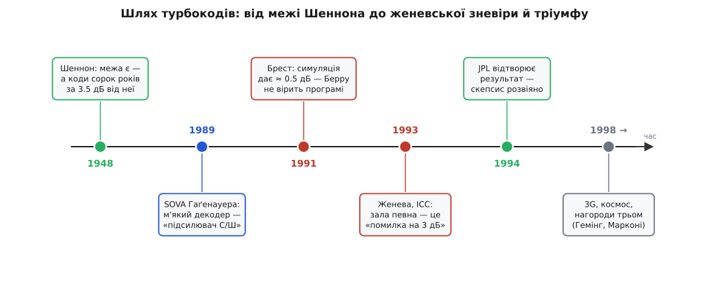

# 📜 Як народилися турбокоди

Сорок років найкращі голови теорії кодування штурмували останні децибели до [межі Шеннона](topic:communications/channel-coding-theorem) — і не могли їх узяти. А потім прірву закрили троє людей, які до тієї теорії, власне, й не належали. Не математики, не корифеї теорії інформації — а інженери-електроніки з невеликої телекомунікаційної школи в Бресті, на самім заході Бретані, та їхній докторант із Таїланду. І це не курйоз, а ключ до всієї історії: саме те, що вони були **чужинцями** в цім полі, і стало їхньою перевагою. Вони поставили питання, якого фахівець не поставив би, — бо для фахівця воно звучало надто наївно, щоб мати відповідь.

*Шість вузлових моментів усієї історії. Теорія (1948) лишила прірву в три з половиною децибели; м'який декодер SOVA (1989) дав інструмент; у Бресті (1991) прірву раптом закрили до пів децибела; Женева (1993) не повірила; JPL (1994) відтворив результат — і почалася турбореволюція.*

## Двоє з кафедри електроніки

Клод Берру (Claude Berrou, нар. 23 вересня 1951 у Пенмарку на бретонському узбережжі) і Ален Ґлав'є (Alain Glavieux, 1949–2004, родом із Парижа) працювали в *École nationale supérieure des télécommunications de Bretagne* — Вищій національній школі телекомунікацій Бретані в Бресті (сьогодні це IMT Atlantique). Ґлав'є прийшов туди 1978 року й фактично з нуля збудував там викладання цифрового зв'язку. Обидва сиділи на **кафедрі електроніки** — не на кафедрі математики й не в осередку теорії інформації. Вони були людьми схем, транзисторів і кремнію, а не теорем.

Ця обставина вирішила все. Бо в електроніці є одне поняття, з яким інженер зживається з першого курсу й носить у пальцях, — **зворотний зв'язок** (feedback). Будь-який пристойний підсилювач бере крихту власного виходу й вертає її на вхід: так він сам себе виправляє, тримає стабільність, чистить сигнал. Для електроніка це така сама очевидність, як важіль для механіка. І Берру з Ґлав'є, дивлячись наприкінці 1980-х на цифрові приймачі, здивувалися простій, майже дитячій речі: **чому тут ніде нема зворотного зв'язку?** Декодер працює в один прохід — прийняв, вирішив, віддав — і жодного разу не озирнеться на власний результат. У підсилювачі так не роблять. То чому так роблять у декодері?

Фахівець із кодування це питання пропустив би повз вуха: коди — це алгебра над скінченними полями, до чого тут підсилювачі. А двоє електроніків саме тому й не пропустили, що дивилися очима свого ремесла.

> 🔧 **Навіщо це.** Найгустіші стіни в науці часто ламає не глибший фахівець, а чужинець із сусіднього ремесла — той, хто приносить робочу звичку зі свого поля туди, де її ще не пробували. Берру не винайшов зворотного зв'язку; він **переніс** його з електроніки підсилювачів у теорію декодування, де його ніхто не шукав. Коли впираєшся в стіну, яку всі навколо вважають природною межею, варто спитати: чия це межа насправді — задачі чи звички тих, хто над нею б'ється?

## Ланцюжок осяяння: від SOVA до петлі

Поштовх був цілком приземлений. Ґлав'є запропонував Берру суто інженерну задачу: узяти **SOVA-декодер** і втілити його в кремнії — зробити мікросхему.

> **SOVA** (Soft-Output Viterbi Algorithm — Вітербі з м'яким виходом) — це [алгоритм Вітербі](topic:communications/viterbi-algorithm), доопрацьований так, щоб на виході давати не голе рішення «нуль чи одиниця», а ще й **міру певності** кожного біта. Його 1989 року на конференції GLOBECOM у Далласі оприлюднили німецькі дослідники Йоахім Гаґенауер і Петер Гьогер (Joachim Hagenauer, Peter Höher). Саме м'який вихід — «біт радше одиниця, і ось наскільки я певен» — і виявиться тим паливом, на якому працюватиме вся конструкція.

Отут і сталося осяяння. Розбираючись, як улаштований SOVA, Берру наткнувся на думку самого Гаґенауера: **м'який декодер — це свого роду підсилювач відношення сигнал/шум**. Тобто на вхід йому йде брудна оцінка з певним С/Ш, а на виході оцінка **чистіша** — декодер, по суті, підняв сигнал над шумом, як підсилювач піднімає слабкий голос.

Для електроніка ця фраза була іскрою в пороховий погреб. Якщо декодер **підсилює** С/Ш — то це ж підсилювач. А що роблять із підсилювачем, коли хочуть більшого підсилення? **Ганяють по колу зі зворотним зв'язком.** Пропусти сигнал через підсилювач раз — стало чистіше; заведи вихід назад на вхід і пропусти ще раз — стане чистіше вдруге. Берру спитав очевидне для свого ремесла й геть неочевидне для чужого: а що, як **зациклити** м'який декодер — хай раз у раз перетравлює власний покращений вихід, щообертом додаючи собі певності? Оте «turbo-type» коло зі зворотним зв'язком і стане серцем винаходу.

Тут варто бути точним у тому, хто що сказав. Слова «м'який декодер — підсилювач С/Ш» — не Беррова знахідка, а **Гаґенауерова** характеристика; Берру її почув. Але наступний крок — «якщо підсилювач, то заведімо його по колу» — не робив ніхто до нього. Осяяння було не в метафорі, а в тому, щоб узяти метафору **буквально** й побудувати за нею машину.

Перші симуляції Берру прогнав 1991 року — і не повірив власним очам. Числа виходили такі гарні, що він запідозрив не відкриття, а помилку в програмі. За його ж пізнішим зізнанням, **щодня** він перечитував код, шукаючи, де ж збрехало. Помилки не було. Пара кволих [згорткових кодів](topic:communications/convolutional-codes), з'єднаних перемішувачем і декодованих по колу, справді підходила до межі Шеннона майже впритул. Ще 1991 року Берру подав основоположну патентну заявку (згодом вона стала патентом US 5 446 747) — цікаво, що **одноосібно**: на патенті стоїть одне його ім'я.

## Третій, кого забувають

І тут починається несправедливість, яку варто виправити прямо. Ту саму структуру, що зробила турбокод турбокодом, — **рекурсивні систематичні згорткові коди** (RSC: із зворотним зв'язком уже в самому кодері) і їхню **паралельну конкатенацію** — детально розробив у своїй докторській дисертації третій учасник, чиє ім'я в переказах цієї історії найчастіше зникає.

Пунья Тітімайшима (тайськ. *ปัญญา ฐิติมัชฌิมา*; Punya Thitimajshima, 1955–2006) приїхав до Бреста з Таїланду. Бакалаврат і магістратуру він закінчив у Королівському технологічному інституті короля Монгкута в Ладкрабанзі (KMITL) у Бангкоку, а докторат здобув 1993 року в Західнобретонському університеті (*Université de Bretagne Occidentale*) — під науковим керівництвом Ґлав'є. Тема його дисертації називалася майже дослівно так: **«Систематичні рекурсивні згорткові коди та їх застосування до паралельної конкатенації»**. Це не дотична робота поруч із винаходом — це **його конструктивне ядро**, викладене мовою теорії. Саме він серед трьох ретельно опрацював ту частину, без якої турбокод не тримається купи.

А тепер погляньмо, як цю історію переказують. Знаменитий нарис журналу *IEEE Spectrum* про турбокоди має промовисту назву — «Як **двоє** невідомих інженерів змінили цифровий зв'язок». Двоє. Тітімайшими там немає взагалі. І це не поодинокий недогляд: у безлічі переказів турбокоди — це «двоє французів із Бреста», а тайський докторант тихо випадає з кадру.

Чесний облік доказів такий. **Патент** справді один і належить Берру — тут суперечки нема. Але **наукова стаття** 1993 року, з якої світ і дізнався про турбокоди, підписана **трьома** іменами: Berrou, Glavieux, Thitimajshima. І коли 1998 року Товариство теорії інформації IEEE вручило за цей винахід «Золоту ювілейну» нагороду, її дали **всім трьом**. Отже, коли історію стискають до «двох», з неї викреслюють не випадкового співавтора, а людину, чия дисертація формалізувала серцевину коду. Тітімайшима повернувся до Таїланду, 1995 року став викладачем рідного KMITL, дослужився до доцента, 2003-го дістав національну відзнаку «Видатний технолог» — і помер 2006 року, п'ятдесятирічним. Віддати йому належне — не жест увічливості, а проста точність.

## Женева, травень 1993: зала не вірить

Свою доповідь троє винесли на люди в травні 1993-го — на щорічну конференцію IEEE зі зв'язку (ICC), що проходила в Женеві 23–26 травня. Стаття мала назву «Near Shannon Limit Error-Correcting Coding and Decoding: Turbo-Codes» — «Кодування й декодування майже на межі Шеннона: турбокоди». У ній стояло число, від якого в залі мали б повставати з місць: їхній код підходив до межі Шеннона на **пів децибела** (при частці помилок одна на сто тисяч, BER 10⁻⁵). Пів децибела — там, де сорок років не могли зійти нижче трьох із половиною.

Зала не повстала. Зала **не повірила**. Реакція ветеранів кодування була не захватом, а глухим скепсисом, і його можна зрозуміти. Уся їхня досвідчена інтуїція казала одне: так не буває. Найпоширеніший вирок звучав приблизно так — «це неможливо, вони просто десь наплутали й помилилися на три децибели». Дехто пішов ще далі: результат був настільки безглуздий на позір, що частина фахівців **навіть не стала читати статтю** — навіщо витрачати час на явну помилку. Додавало недовіри й те, звідки взялися автори: виправлення помилок вважали цариною чистої математики, а тут із «неможливим» результатом вийшли якісь інженери-схемотехніки з провінційної школи. Хто вони такі, щоб перекреслювати сорок років?

Скепсис розвіявся не красномовством, а відтворенням. Уже протягом наступного року інші лабораторії повторили експеримент — і числа підтвердилися. Серед перших це зробила група Лабораторії реактивного руху (JPL) NASA: Даріуш Дівсалар і Фабріціо Поллара наприкінці 1994 року відтворили турбокоди для далекого космічного зв'язку. Коли результат ліг незалежно й не раз, недовіра змінилася гарячкою: почалася та сама «турбореволюція». Стаття, яку половина зали не спромоглася дочитати, за кілька років стала однією з найцитованіших в історії теорії кодування.

## Звідки назва «турбо»

Ім'я винаходові дали не одразу й не в лабораторії. France Télécom, що фінансувала роботу й дістала патент, попросила Берру придумати для новинки **комерційну назву** — щось звучне для ринку, а не «паралельно конкатеновані рекурсивні систематичні згорткові коди з ітеративним декодуванням».

Назва прийшла з телевізора. Берру дивився автоперегони — і впіймав аналогію просто на екрані. Турбонагнітач (турбіна) у гоночному двигуні бере відпрацьовані вихлопні гази, жене їх назад на турбіну й тим піддає двигунові тяги — двигун живиться власним вихлопом. А його декодер робив рівно те саме: заводив власний вихід назад на вхід, щоб піддати собі певності. Вихлоп назад у турбіну. Так народилося слово **«турбо»**.

У цій назві ховається тонкість, яку варто вловити. «Турбо» — це не про **код**, а про **декодування**. Сам кодер — жодної турбіни, звичайне поєднання двох простих кодів. Уся «турбо» — у зворотному зв'язку декодера, у тому колі, яким оцінки ходять туди-сюди. Тому строго кажуть не «турбокод сам собою потужний», а «код, який **декодують по-турбо**». Назва вказує пальцем на справжнє місце винаходу — не на те, що передають, а на те, **як розшифровують**.

## Що вони зрушили

Значення женевської доповіді виходить далеко за самі турбокоди. До 1993-го галузь тихо змирилася, що коди декодують за один прохід і що останні децибели до Шеннона недосяжні. Після 1993-го стало ясно: якщо дати декодерам **говорити один з одним по колу**, уточнюючи спільну певність оберт за обертом, стіна падає. Це вже був не один код — це був **новий принцип**, ітеративне декодування.

І щойно принцип назвали вголос, інженери кинулися перебирати старе під новим світлом — і викопали давно забутий скарб. Ще 1960 року Роберт Ґаллагер у докторській дисертації в MIT описав [коди розрідженої перевірки паритету (LDPC)](topic:communications/ldpc), які декодуються майже так само — обміном м'якими оцінками по графу. На той час їх визнали надто складними для наявної техніки й на тридцять років забули. Турбошок змусив до них повернутися: у середині 1990-х LDPC перевідкрили — і виявилося, що турбокоди й LDPC суть **два обличчя однієї ідеї**, того самого ітеративного поширення довіри. Уся сучасна теорія кодування, що впритул підходить до межі Шеннона, — пряме дитя тієї доповіді, у яку в Женеві не повірили.

Лишається людський підсумок. Троє: Клод Берру, чий був первісний стрибок думки, патент і назва; Ален Ґлав'є, старший колега, що дав поштовх і виховав докторанта, — він не дожив до тріумфу своєї школи, померши 2004 року; і Пунья Тітімайшима, чия дисертація тримає конструкцію й чиє ім'я історія досі раз у раз губить. Справедливо називати всіх трьох.
