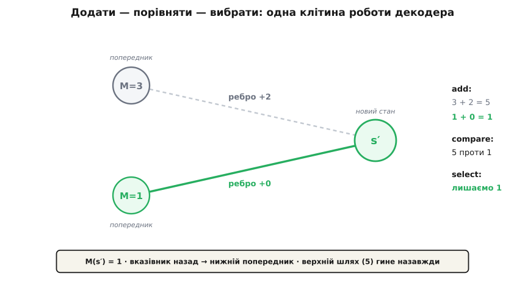

# Алгоритм Вітербі

<preknowlist>
- [Скінченні автомати](book:electronics/finite-state-machines) — автомат зі скінченною кількістю станів і переходами за тактом; розгорнутий у часі автомат утворює ґратку.
- [Ланцюги Маркова](book:math/markov-chain) — марковська властивість: наступний стан залежить лише від теперішнього, а не від попередньої передісторії.
- [Динамічне програмування](book:algorithms/dynamic-programming) — принцип оптимальності Беллмана: оптимум складеного шляху спирається на оптимуми його частин.
- [Відстань Геммінга](book:communications/hamming-distance) — число розбіжностей між двома двійковими послідовностями однакової довжини.
- [Згорткові коди](book:communications/convolutional-codes) — лінійні коди з пам'яттю, вихідні біти яких залежать від поточного входу та попередніх бітів у регістрі.
</preknowlist>

Приймач радіосигналу фіксує потік бітів, пошкоджений шумом каналу зв'язку. Відправник міг передати будь-яке з можливих повідомлень довжиною `L` бітів, тобто простір кандидатів налічує `2ᴸ` варіантів. Уже при `L = 100` кількість комбінацій сягає `1.27 × 10³⁰`, що значно перевищує число атомів у відомому Всесвіті, тому прямий перебір усіх варіантів неможливий. Алгоритм Вітербі (англ. *Viterbi algorithm*, запропонований Ендрю Вітербі 1967 року) знаходить математично точний глобальний оптимум — найімовірніше передане повідомлення за критерієм максимуму правдоподібності — за час, який зростає суто лінійно з довжиною `L`.

## Розгортання автомата в ґратку

Будь-який кодер із пам'яттю діє як [скінченний автомат](book:electronics/finite-state-machines). У кожний дискретний момент часу пристрій перебуває в одному з фіксованих станів. Коли на вхід надходить новий інформаційний біт, автомат видає кодові символи, які залежать від поточного стану та входу, і переходить у наступний визначений стан. Якщо пам'ять автомата становить `K − 1` бітів, загальне число можливих станів дорівнює `S = 2^(K−1)`.

Якщо зобразити всі стани автомата як рядки, а дискретний час відкладати стовпцями зліва направо, виникає часова діаграма станів — **ґратка** (англ. *trellis*, від латинського *trichila* — решітчаста альтанка). Переходи між станами на кожному такті позначаються ребрами, підписаними очікуваними вихідними символами. Будь-яке передане повідомлення довжиною `L` бітів відповідає рівно одному неперервному шляху крізь ґратку від початкового нульового стану.

Шум у каналі спотворює прийняті символи. Задача приймача полягає в тому, щоб серед усіх можливих шляхів на ґратці знайти той єдиний справжній шлях, вихідна послідовність якого найкраще узгоджується з фактично прийнятим сигналом.

## Перетворення ймовірностей на відстані

Оскільки канал зв'язку спотворює кожен переданий символ незалежно від інших (канал без пам'яті), повна ймовірність спостереження прийнятої послідовності за умови вибору конкретного шляху дорівнює добутку по-символьних ймовірностей:

```
P(прийняте | шлях) = ∏ P(rₜ | cₜ)
                     t
```

де `rₜ` — символ, зафіксований приймачем на такті `t`, а `cₜ` — очікуваний вихідний символ на відповідному ребрі ґратки.

Множення тисяч дрібних дробових чисел є чисельно нестабільним і швидко призводить до обнулення результату через втрату розрядності. Взяття від'ємного логарифма перетворює добуток імовірностей на адитивну суму:

```
метрика гілки:   d(rₜ, cₜ) = −log P(rₜ | cₜ)
метрика шляху:   M = Σ d(rₜ, cₜ) = −log P(прийняте | шлях)
                     t
```

Максимізація повної правдоподібності повідомлення стає еквівалентною **мінімізації сумарної метрики**. Пошук найімовірнішого повідомлення перетворюється на задачу знаходження найкоротшого шляху на зваженому графі.

У двійковому симетричному каналі метрика гілки зводиться до підрахунку розбіжностей бітів — [відстані Геммінга](book:communications/hamming-distance). Якщо ж демодулятор передає аналогові відліки напруги з гаусовим шумом, метрикою гілки стає квадрат евклідової відстані між прийнятим рівнем і опорною точкою сигналу. Повне математичне виведення метрик для різних моделей каналу містить [окремий розбір метрики гілки](book:communications/viterbi-algorithm/math-branch-metric.md).

> 🔧 **Навіщо це.** Перехід від добутків до суми логарифмів дозволяє апаратним декодерам відмовитися від операцій із плавальною комою. Усі метрики масштабуються й округлюються до невеликих цілих чисел, а пошук оптимуму зводиться до простих операцій цілочислового додавання та порівняння.

## Марковська властивість і відсікання шляхів

Експоненційного перебору `2ᴸ` варіантів вдається уникнути завдяки марковській властивості структури станів: **майбутнє автомата залежить лише від його поточного стану, а не від передісторії приходу в нього**.

Якщо два або більше різних шляхів стартували з початку й зійшлися в одному й тому самому стані `s` на такті `t`, то будь-яке продовження шляху з цього моменту буде абсолютно однаковим для обох претендентів. Оскільки сумарна метрика шляху формується простим додаванням, шлях із більшою накопиченою метрикою вже ніколи не зможе надолужити відставання від суперника.

Це означає, що гірший із двох шляхів, які зійшлися в одному вузлі, можна безповоротно **викинути одразу**. Для кожного стану на поточному такті достатньо зберігати лише один найкращий шлях — **уцілілий шлях** (англ. *survivor path*), та його накопичену метрику. Замість дерева, що безупинно галузиться, алгоритм веде фіксовану кількість траєкторій, яка дорівнює загальній кількості станів `S`.

## Цикл «додати-порівняти-вибрати» та зворотний хід

На кожному кроці за часом алгоритм послідовно виконує три операції для кожного стану наступного такту:

1. **Додати** (*Add*): для кожного ребра, що входить у новий стан із деякого попереднього стану, обчислити повну метрику кандидата як суму накопиченої метрики попередника та метрики цього перехідного ребра.
2. **Порівняти** (*Compare*): зіставити обчислені значення метрик між усіма шляхами, які входять у цей стан.
3. **Вибрати** (*Select*): зберегти найменшу метрику як нове значення для цього стану, а також записати вказівник назад — номер того попереднього стану, звідки прийшов переможець.

```
Mₜ(s′) =  min   [ Mₜ₋₁(s) + d(rₜ, cₜ(s → s′)) ]
        s → s′
```


*Крок оновлення одного стану: два конкуруючі шляхи змагаються за стан s′, уцілілий шлях зберігається разом із вказівником на попередній вузол, а програшний кандидат відкидається.*

Після досягнення кінця послідовності декодер обирає стан із найменшою підсумковою метрикою й запускає **зворотне простеження** (англ. *traceback*). Рухаючись збереженими вказівниками назад від фінішу до старту, алгоритм відновлює послідовність переходів і формує вихідний декодований потік інформаційних бітів.

На нескінченних потоках даних зберігати всю історію до початку неможливо. Проте через властивість злиття вцілілих траєкторій усі шляхи сходяться в одну спільну гілку, якщо відступити назад на глибину приблизно `5K` тактів. Це дозволяє організувати декодування у ковзному вікні фіксованого розміру зі сталою затримкою.

## Складність та універсальність

Обчислювальна складність алгоритму на кожному часовому такті становить `O(S · b)`, де `S = 2^(K−1)` — кількість станів, а `b` — кількість гілок, що входять у вузол (для двійкового входу `b = 2`). Загальна часова складність для повідомлення довжиною `L` дорівнює:

```
T = O(L · 2^(K−1))
```

Алгоритм вимагає лінійного часу від довжини вхідних даних, що робить його практично реалізованим у сучасних мікросхемах цифрового оброблення сигналів. За цією схемою побудовано більшість апаратних рішень для стандартів супутникового зв'язку, Wi-Fi, стільникових мереж 2G/3G та систем зчитування інформації з магнітних накопичувачів, детально описаних у темі про [декодер Вітербі](book:communications/viterbi-decoder).

Структура алгоритму спирається виключно на граф станів і марковську властивість, тому область його застосування виходить далеко за межі теорії завадостійкого кодування. Алгоритм Вітербі є стандартним методом знаходження найімовірнішої послідовності прихованих станів у [прихованих марковських моделях](book:math/hidden-markov-model):
- **розпізнавання мовлення** — відновлення ланцюжка фонем і слів за послідовністю спектральних акустичних ознак;
- **біоінформатика** — сегментація послідовностей ДНК на кодувальні гени та некодувальні проміжки;
- **обробка природної мови** — автоматична розмітка частин мови для слів у реченні;
- **вирівнювання каналів зв'язку** — компенсація міжсимвольної інтерференції, коли сам фізичний канал розглядається як автомат із пам'яттю.

Практичну програмну реалізацію та розбір роботи алгоритму на прикладі прихованих марковських моделей наведено в [проєкті Вітербі як HMM-декодера](book:communications/viterbi-algorithm/proj-hmm-viterbi.md).

Алгоритм Вітербі поєднує математичну строгість динамічного програмування з обчислювальною простотою. Перетворивши добуток імовірностей на суму логарифмічних метрик і своєчасно відсікаючи неконкурентні гілки на кожному кроці злиття станів, він знаходить глобально оптимальний шлях серед астрономічної кількості варіантів за лінійний час.
