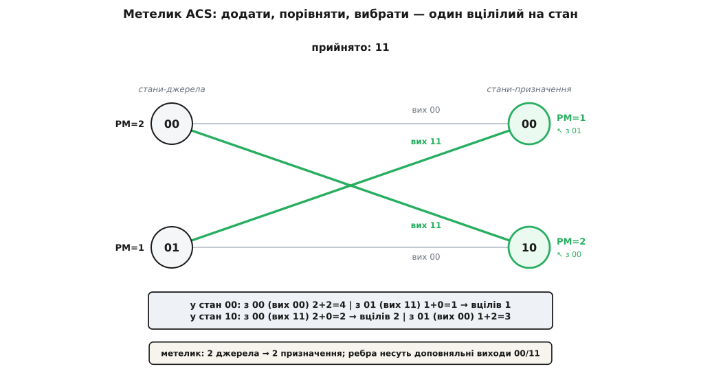
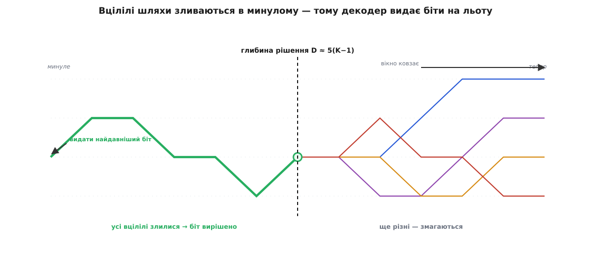

# Декодер Вітербі

<preknowlist>
- [Згорткові коди](topic:communications/convolutional-codes) — як зсувний регістр формує ґратку станів і кодових виходів; це структура, крізь яку декодер шукає шлях.
- [Відстань Геммінга](topic:communications/hamming-distance) — підрахунок неспівпалих бітів; основа жорсткого рішення декодера.
- [Канал AWGN](topic:communications/awgn-channel) — додавання гаусового шуму до рівнів сигналу; основа м'якого рішення й виграшу 2 дБ.
</preknowlist>

Кодер згорткового коду записує вхідні біти в короткий [зсувний регістр](topic:electronics/shift-register) і на кожному кроці видає кілька перевіркових символів, прокладаючи один-єдиний шлях крізь [ґратку станів](topic:communications/convolutional-codes). Лінія зв'язку спотворює переданий сигнал шумом. На приймальному боці демодулятор тримає понівечену послідовність, яка вже не збігається точно з жодною правильною кодовою доріжкою. Завдання приймача — з'ясувати, який саме шлях крізь ґратку кодер пройшов насправді, щоб відновити надіслане повідомлення з найменшою ймовірністю помилки.

Прямий перебір усіх можливих траєкторій безнадійний: для блоку завдовжки `L` бітів існує `2^L` різних шляхів. Навіть для помірного пакета обсяг обчислень вимагає більше операцій, ніж містить уся сучасна обчислювальна техніка, а на неперервному потоці телеметрії чи голосового зв'язку задача взагалі не має кінця. Декодер Вітербі (англ. *Viterbi decoder*, запропонований 1967 року Ендрю Вітербі) розв'язує цю задачу строго **оптимально** — знаходячи глобально найправдоподібніший шлях, — але виконує пошук за **лінійний час**, де робота на один біт залишається сталою. Ця машина тримається на трьох принципах: адитивній метриці гілок, відсіканні програшних шляхів на кожному кроці та злитті вцілілих траєкторій у минулому.

## Метрика ребра: як канал визначає близькість

Щоб порівнювати шляхи, приймач повинен мати числову міру відповідності між прийнятими відліками та мітками на ребрах ґратки. Для каналу без пам'яті (де шум спотворює кожен символ незалежно від інших) спільна ймовірність прийняти послідовність `r` за умови передавання кодового слова `v` дорівнює добутку посимвольних імовірностей:

```
P(r | v) = ∏ᵢ P(rᵢ | vᵢ)
```

Максимізувати добуток незручно, тому перехід до логарифма перетворює його на суму:

```
log P(r | v) = Σᵢ log P(rᵢ | vᵢ)
```

Адитивність логарифма правдоподібності означає, що загальну якість шляху можна накопичувати крок за кроком, додаючи внесок кожного ребра. Число, що оцінює окремий перехід, називають **метрикою гілки** (англ. *branch metric*). Конкретний вигляд метрики залежить від того, як демодулятор передає відліки в декодер:

- **Жорстке рішення** (англ. *hard decision*): демодулятор одразу зрізає кожен аналоговий рівень до жорсткого нуля чи одиниці. На двійковому симетричному каналі з імовірністю бітової помилки `p < 0.5` максимізація правдоподібності строго зводиться до мінімізації кількості розбіжностей. Метрика гілки стає звичайною [відстанню Геммінга](topic:communications/hamming-distance) між парою прийнятих бітів і парою очікуваних виходів кодера на цьому ребрі.
- **М'яке рішення** (англ. *soft decision*): демодулятор зберігає аналогову вибірку або квантує її у кілька бітів певності (зазвичай 3 біти, тобто 8 рівнів). У [каналі AWGN](topic:communications/awgn-channel) зіставляються дійсні рівні напруги `±1` та прийняті відліки. Максимум правдоподібності відповідає мінімуму квадрата евклідової відстані або максимуму кореляції між прийнятими вибірками й очікуваними символами.

М'яке рішення дає колосальну перевагу: декодер не втрачає інформацію про невпевнені відліки (наприклад, вибірка `+0.1` трактується як слабкий нуль, а не нарівні з надійним `+1.0`). Завдяки цьому м'який декодер виграє близько **2 дБ** енергії сигналу проти жорсткого, що еквівалентно зменшенню потрібної потужності передавача майже на 40% за тієї самої якості зв'язку. [Аналітичне виведення обох метрик](topic:communications/viterbi-decoder/math-ml-metric.md) показує, що це не евристика, а прямий наслідок критерію максимальної правдоподібності.

## Відсікання шляхів: блок додати-порівняти-вибрати (ACS)

Ключова економія декодера випливає з марковської природи кодера. Оскільки кодер є [скінченним автоматом](topic:electronics/finite-state-machines) із пам'яттю `ν = K - 1` бітів (де `K` — довжина обмеження), його майбутня поведінка залежить виключно від поточного стану, а не від того, яка послідовність бітів привела його в цей стан раніше.

Якщо в певний стан ґратки на кроці `t` сходяться два чи більше шляхів, їхні майбутні продовження будуть абсолютно однаковими. Тому шлях, який підійшов до цього стану з більшою накопиченою похибкою (гіршою метрикою), ні за яких обставин не зможе надолужити відставання попереду. Декодер може назавжди відкинути гіршого претендента в кожному стані. На кожному кроці для кожного з `2^ν` станів залишається рівно один **вцілілий шлях** (англ. *survivor path*).

Цю операцію виконує **блок додати-порівняти-вибрати** (англ. *Add-Compare-Select*, ACS):
- **Додати** (Add): до накопиченої метрики кожного стану-попередника додати метрику відповідного ребра.
- **Порівняти** (Compare): зіставити сумарні метрики двох конкуруючих шляхів, що входять у стан-призначення.
- **Вибрати** (Select): зберегти меншу метрику як нове значення для цього стану, а в пам'ять записати 1 біт рішення — з якого саме джерела прийшов переможець.


*Базова обчислювальна комірка декодера — «метелик». Для кожного стану-призначення порівнюються два кандидати, менша сума стає новою метрикою стану, а напрямок вибору записується в пам'ять вцілілих.*

Розгляньмо роботу ACS на класичному коді `K = 3` (4 стани: `00`, `01`, `10`, `11`) зі швидкістю 1/2. Нехай поточні метрики станів `00` та `01` дорівнюють відповідно 2 та 1, а канал приніс пару бітів `11`. У стан `00` веде перехід зі стану `00` (вихід `00`, відстань Геммінга 2) і зі стану `01` (вихід `11`, відстань Геммінга 0):
- Кандидат із `00`: `2 + 2 = 4`.
- Кандидат із `01`: `1 + 0 = 1`.

Блок ACS обирає перехід із `01`, призначає стану `00` нову метрику 1 і запам'ятовує покажчик на `01`. Оскільки кількість станів стала (`2^ν`), кількість операцій на один крок не залежить від тривалості передавання — експоненційне дерево згортається в [динамічне програмування](topic:algorithms/dynamic-programming) на ґратці.

## Потокове декодування та глибина рішення

Збереження одного біта вибору на стан дозволяє відновити надіслане повідомлення проходом назад (англ. *traceback*) — від кінцевого стану до початкового за збереженими покажчиками. Проте в реальних системах потік даних нескінченний, і чекати умовного кінця сеансу неможливо.

Потоковий режим спирається на фундаментальну властивість згорткових кодів: **злиття вцілілих шляхів**. Якщо простежити вцілілі траєкторії з усіх `2^ν` поточних станів углиб минулого, вони швидко сходяться в один спільний стовбур. Відступивши на фіксовану відстань назад, ми виявимо, що всі без винятку активні гіпотези проходять через одне й те саме ребро.


*Простеження назад із різних станів показує злиття гілок. На глибині рішення D усі конкуруючі варіанти збігаються, що дозволяє видавати декодований потік із фіксованою апаратною затримкою.*

Цю безпечну дистанцію називають **глибиною декодування** (англ. *decoding depth*, `D`). Практичне правило вимагає витримувати:

```
D ≈ 5 · (K - 1)
```

Для коду з `K = 7` глибина становить близько 30–35 тактів. Декодер зберігає історію рішень лише в ковзному вікні розміром `D`. Щойно вікно заповнюється, декодер на кожному новому такті видає один найдавніший біт зі спільного стовбура і зміщує вікно вперед. Блок керування пам'яттю вцілілих (англ. *Survivor Memory Unit*, SMU) реалізують або класичним простеженням покажчиків назад, або паралельним обміном регістрів; [порівняння обох архітектур SMU](topic:communications/viterbi-decoder/proj-survivor-memory.md) наочно демонструє баланс між площею пам'яті та швидкодією.

## Практичні обмеження та межі застосування

На безперервному потоці накопичені метрики станів постійно зростають. Щоб уникнути переповнення розрядної сітки, використовують перенормування (віднімання мінімального значення на кожному такті) або модульну арифметику зі знаковим порівнянням, спираючись на те, що різниця між метриками станів обмежена зверху.

Головна межа швидкодії декодера Вітербі криється в його структурі: блок обчислення метрик гілок і блок пам'яті вцілілих легко піддаються конвеєризації, але ядро ACS містить рекурсивну петлю зворотного зв'язку (нові метрики станів потрібні вже на наступному такті). Через це гранична тактова частота обмежена затримкою одного циклу додавання-порівняння-вибору.

Іншим фундаментальним обмеженням є експоненційне зростання складності: кожен додатковий біт пам'яті коду (`K`) подвоює кількість станів. Тому декодери Вітербі застосовують для кодів із помірною довжиною пам'яті (`K ≤ 9`):
- GSM (голосовий зв'язок): `K = 5` (16 станів);
- Wi-Fi 802.11a/g та DVB (супутникове мовлення): `K = 7` (64 стани);
- Далекий космічний зв'язок (стандарти CCSDS): `K = 7` або `K = 9` (256 станів).

Коли потрібні довші коди для наближення до теоретичної [пропускної здатності Шеннона](topic:communications/bandwidth-capacity), класичний алгоритм поступається місцем [турбокодам](topic:communications/turbo-codes) та [кодам LDPC](topic:communications/ldpc). Проте для коротких пакетів із низькою затримкою та суворими обмеженнями на енергоспоживання декодер Вітербі залишається незамінним золотим стандартом цифрового зв'язку.

---

Декодер Вітербі розв'язує задачу пошуку найправдоподібнішої послідовності за лінійний час завдяки динамічному програмуванню на ґратці. Він спирається на три складові: адитивні метрики ребер (відстань Геммінга для жорстких рішень або кореляцію для м'яких з виграшем 2 дБ), обчислювальне ядро ACS, що відсікає програшні шляхи в кожному стані, та пам'ять вцілілих зі злиттям гілок на глибині `5·(K−1)`, яка перетворює блоковий алгоритм на потоковий приймач зі сталою затримкою.
