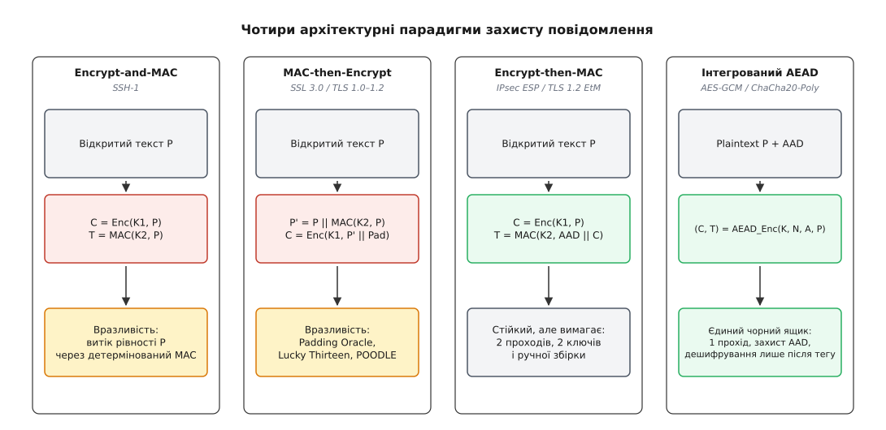
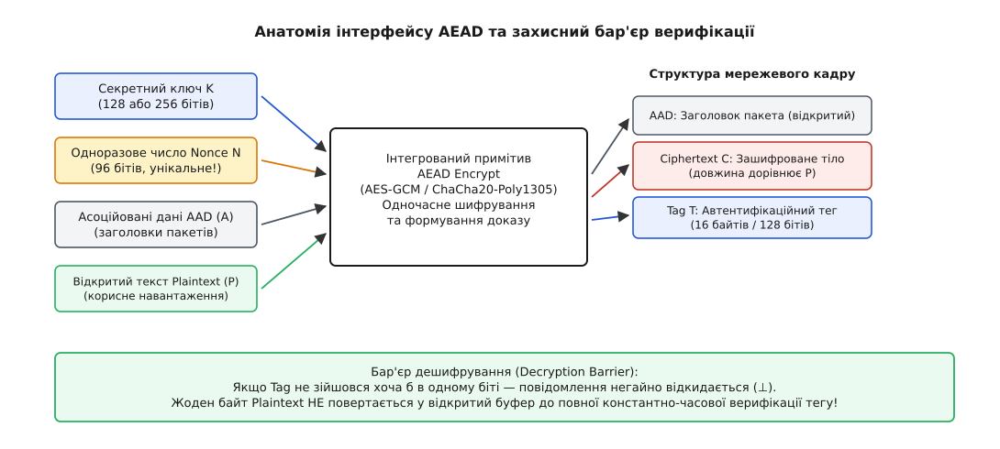
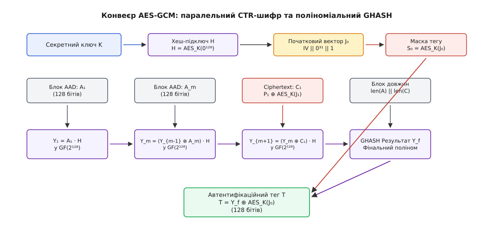
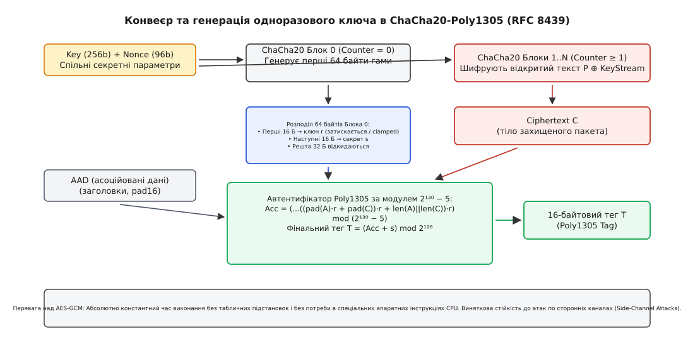
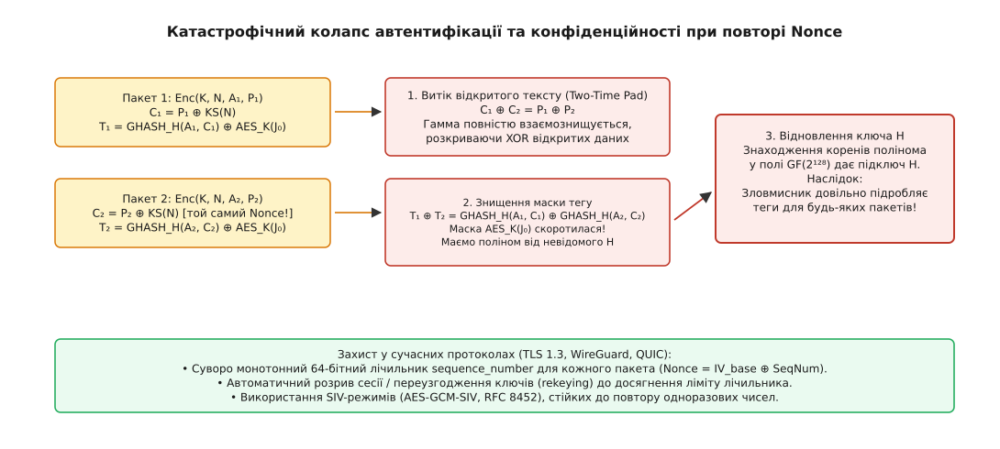

# Автентифіковане шифрування (AEAD): тег, асоційовані дані й одна операція замість двох

<preknowlist>
- [Блоковий шифр](topic:algorithms/block-cipher) — оборотне перетворення блока фіксованої довжини під таємним ключем; основа AES і режимів CTR та CBC.
- [Потоковий шифр](topic:algorithms/stream-cipher) — генерування псевдовипадкової гами під ключем і накладання її на текст через XOR.
- [HMAC](topic:communications/hmac) — криптографічна автентифікація повідомлень на основі симетричного ключа та геш-функцій.
- [Поле Галуа](topic:math/finite-fields) — арифметика скінченних полів та множення многочленів за незвідним модулем.
- [Парадокс днів народження](topic:math/birthday-paradox) — чому колізія у просторі `2ⁿ` значень трапляється вже після `2^(n/2)` виборів.
- [TLS](topic:communications/tls) — протокол захисту транспортного рівня та історія вразливостей записів CBC.
- [Контрольна сума CRC](topic:communications/crc) — лінійний контроль цілісності та чому він не захищає від активного зловмисника.
</preknowlist>

Якщо активний мережевий перехоплювач модифікує зашифрований IP-пакет, у якому корисне навантаження захищене лише симетричним потоковим шифром або блоковим шифром у режимі лічильника (CTR) без автентифікаційного коду, він може цілеспрямовано змінювати відкритий текст без знання секретного ключа. Знаючи, що байти 12–15 відкритого заголовка містять IP-адресу призначення `10.0.0.1`, а 20-й byte визначає прапорець привілеїв `0x00` (гість), зловмисник накладає побітову маску різниці `Δ` безпосередньо на шифротекст у каналі зв'язку. Під час дешифрування зворотне додавання гами шифру відновлює спотворений відкритий текст: адреса призначення перетворюється на `192.168.1.50`, а статус доступу — на `0x01` (адміністратор). Традиційні контрольні суми на зразок CRC32 чи Internet Checksum не рятують ситуацію: через математичну лінійність над полем `GF(2)` зловмисник тривіально перераховує різницю контрольної суми `ΔCRC = CRC(Δ)` і підміняє відповідні байти в зашифрованому хвості пакету.

Цей сценарій демонструє фундаментальну криптографічну аксіому: **конфіденційність без автентичності є ілюзорною**. Класичне шифрування гарантує лише нерозрізненність шифротекстів для пасивного спостерігача (семантичну стійкість, IND-CPA), тоді як реальні мережеві протоколи передають пакети через агресивне середовище, де зловмисник активно спотворює, повторює, перевпорядковує та впроваджує фальшиві повідомлення. Для надійного захисту система зв'язку повинна одночасно гарантувати неможливість модифікації або підробки шифротекстів (цілісність шифротексту, INT-CTXT), забезпечуючи стійкість до адаптивних атак на основі підібраного шифротексту (IND-CCA2).

---

## 1. Ілюзія конфіденційності: чому симетричного шифрування недостатньо

У класичній моделі симетричного шифрування алгоритм перетворює відкритий текст `P` (Plaintext) у шифротекст `C` (Ciphertext) за допомогою секретного ключа `K`. Якщо шифрування реалізовано у потоковому режимі (наприклад, AES у режимі CTR чи шифр ChaCha20), кожен блок шифротексту формується додаванням відкритого тексту до псевдовипадкової гами за модулем 2:

```
C = P ⊕ Keystream(K, Nonce)
```

Зловмисник, який перехопив шифротекст `C` у каналі зв'язку і має припущення щодо змісту певних полів відкритого тексту (Known-Plaintext), формує бітову маску модифікації `Δ`. Він замінює перехоплений шифротекст `C` на `C' = C ⊕ Δ`. Коли легітимний отримувач застосовує зворотну операцію дешифрування:

```
P'
= C' ⊕ Keystream(K, Nonce)                          [дешифрування додаванням гами]
= (C ⊕ Δ) ⊕ Keystream(K, Nonce)                     [підстановка модифікованого шифротексту]
= (P ⊕ Keystream(K, Nonce) ⊕ Δ) ⊕ Keystream(K, Nonce) [розкриття визначення C]
= P ⊕ Δ ⊕ (Keystream ⊕ Keystream)                   [комутативність додавання за модулем 2]
= P ⊕ Δ                                             [властивість взаємознищення: K ⊕ K = 0]
```

Отримувач отримує змінений текст `P'`, у якому рівно ті біти, де `Δ` мало одиниці, інвертовані, тоді як решта тексту залишається неушкодженою. Ця властивість відома в криптографії як **пластичність** (англ. *malleability*). Пластичний шифр дозволяє активному зловмиснику маніпулювати змістом повідомлення без дешифрування — і робить це безшумно: жодна перевірка не спрацьовує, бо дешифратор чесно повертає те, що йому подали. У платіжному дорученні «переказати 1000$» так само тихо перетворюється на «переказати 9000$».

Аналогічна вразливість проявляється і в блокових режимах зчеплення шифроблоків (CBC). При дешифруванні блоку `C_i` відкритий текст обчислюється як:

```
P_i = Dec(K, C_i) ⊕ C_{i-1}
```

Якщо зловмисник інвертує біти в попередньому блоці `C_{i-1}`, ці самі бітові позиції інвертуються в поточному розшифрованому блоці `P_i`. Сам блок `P_{i-1}` при цьому перетворюється на псевдовипадкове бітове сміття, але якщо протокол ігнорує попередній блок (наприклад, якщо там містилися застарілі заголовки чи заповнення) або якщо помилка виникає пізніше, атака досягає своєї мети.

### Непридатність стандартних контрольних сум (CRC32, Adler-32, Checksum)
Широко поширена інженерна помилка полягає у спробі захистити цілісність додаванням звичайної контрольної суми (CRC32 чи Internet Checksum) всередину відкритого тексту перед шифруванням: `P' = P || CRC(P)`.

Контрольні суми проєктувалися виключно для виявлення випадкових шумів у фізичному середовищі передачі даних, а не для протидії активному інтелектуальному зловмиснику. Операція обчислення CRC є лінійним відображенням над полем `GF(2)`:

```
CRC(A ⊕ B) = CRC(A) ⊕ CRC(B)
```

Якщо зловмисник модифікує відкритий текст на вектор `ΔP`, нова контрольна сума стає рівною:

```
CRC(P ⊕ ΔP) = CRC(P) ⊕ CRC(ΔP)
```

Знаючи різницю `ΔP`, атакуючий заздалегідь обчислює `ΔCRC = CRC(ΔP)`. Далі він одночасно накладає `ΔP` на тіло шифротексту та `ΔCRC` на байти зашифрованої контрольної суми. Після дешифрування стек протоколу отримувача перевіряє контрольну суму, виявляє точний математичний збіг і без жодних підозр передає сфальсифіковані дані у бізнес-логіку програми.

### Ієрархія криптографічної стійкості: IND-CPA проти IND-CCA2
У теоретичній криптографії рівні стійкості шифрів строго формалізовані:
1. **IND-CPA (Indistinguishability under Chosen-Plaintext Attack):** Зловмисник може отримувати шифротексти для довільно обраних відкритих текстів, але не здатен відрізнити, який із двох обраних ним текстів було зашифровано у випробувальному шифротексті.
2. **IND-CCA1 (Non-adaptive Chosen-Ciphertext Attack):** Зловмисник має тимчасовий доступ до оракула дешифрування до отримання випробувального шифротексту.
3. **IND-CCA2 (Adaptive Chosen-Ciphertext Attack):** Максимальний рівень стійкості, за якого зловмисник має постійний доступ до оракула дешифрування (окрім точного випробувального шифротексту) і не може витягти жодної інформації про відкритий текст.
4. **INT-PTXT (Integrity of Plaintexts):** Зловмисник не здатен створити шифротекст, розшифрування якого дасть новий валідний відкритий текст, що раніше не надсилався відправником.
5. **INT-CTXT (Integrity of Ciphertexts):** Зловмисник не здатен створити жодного нового валідного шифротексту (навіть якщо він розшифрується у беззмістовне сміття).

Фундаментальна теорема сучасної криптографії (Белларе — Нампремпре) встановлює математичну межу переваги зловмисника `Adv`:

```
Adv_AEAD^{IND-CCA2}(A) ≤ Adv_Enc^{IND-CPA}(B) + Adv_MAC^{INT-CTXT}(C)
```

Тобто схема автентифікованого шифрування є абсолютно стійкою до адаптивних атак за підібраним шифротекстом, якщо шифр є семантично стійким (IND-CPA), а механізм автентифікації гарантує цілісність шифротекстів (INT-CTXT).

---

## 2. Пастка композиції: як поєднання шифру і MAC руйнувало протоколи

До стандартизації інтегрованих схем розробники намагалися досягти цілісності поєднанням двох окремих алгоритмів: симетричного шифру `Enc(K_enc, P)` та коду автентифікації повідомлень `MAC(K_mac, P)`.


*Чотири архітектурні підходи до захисту повідомлення: від вразливих наївних схем до єдиного примітиву AEAD.*

### 1. Encrypt-and-MAC (E&M): Парадигма SSH-1
У першій версії протоколу SSH-1 відправник паралельно обчислював шифротекст та автентифікаційний тег:

```
C = Enc(K1, P)
T = MAC(K2, P)
Надсилається: C || T
```

Ця схема порушує базовий принцип IND-CPA:
* Алгоритм MAC обчислюється від відкритого тексту `P`. Якщо функція MAC є детермінованою (як HMAC чи Poly1305), повторне надсилання того самого повідомлення `P` створює однаковий тег `T`.
* Пасивний спостерігач бачить рівність `T₁ == T₂` і дізнається, що клієнт двічі передав однаковий блок даних, навіть якщо шифротексти `C₁ ≠ C₂` були різними завдяки векторам ініціалізації.
* Ба більше, стандартні визначення стійкості MAC гарантують лише непідроблюваність, але не гарантують приховування інформації: теоретично коректний MAC може містити у своєму виході копію перших 16 бітів відкритого тексту.

### 2. MAC-then-Encrypt (MtE): Катастрофа SSL 3.0 та TLS 1.0–1.2
Консорціум IETF у специфікаціях протоколів SSL 3.0, TLS 1.0, 1.1 та 1.2 обрав послідовну парадигму:

```
T = MAC(K2, P)
P' = P || T || Pad
C = Enc(K1, P')
Надсилається: C
```

У цій схемі відправник обчислює HMAC над відкритим текстом, додає його до тексту, вирівнює довжину байтами заповнення PKCS#7 (`0x01` для одного байта, `0x02, 0x02` для двох тощо) і шифрує блоковим шифром AES у режимі зчеплення блоків (CBC).

Головна архітектурна вада MAC-then-Encrypt полягає в тому, що **отримувач змушений повністю дешифрувати блок і розпарсити байти заповнення PKCS#7 до того, як зможе перевірити автентичність тегу `T`**.

У 2002 році Серж Водене (Serge Vaudenay) опублікував класичну атаку [історичний аналіз вразливостей композиції](topic:communications/authenticated-encryption/hist-composition-flaws.md) оракула заповнення (Padding Oracle Attack):
1. Отримувач під час дешифрування перевіряє структуру байтів заповнення в кінці блоку.
2. Якщо заповнення невірне, сервер повертає помилку `decryption_failed`. Якщо заповнення вірне, але не сходиться HMAC, повертається помилка `bad_record_mac`.
3. Зловмисник перехоплює шифротекст і маніпулює останнім байтом попереднього блоку `C[k-1]`.
4. Згідно з рівнянням дешифрування CBC: `P'[k] = Dec(K, C[k]) ⊕ C'[k-1]`. Перебираючи 256 можливих значень байта в `C'[k-1]`, зловмисник знаходить значення, при якому сервер не генерує помилку заповнення (оскільки молодший байт `P'[k]` став рівним `0x01`).
5. Звідси зловмисник точно обчислює вихідний відкритий байт: `P[k] = 0x01 ⊕ C'[k-1] ⊕ C[k-1]`.
6. Повторивши операцію для всіх байтів, зловмисник повністю розшифровує повідомлення за `16 × 128 = 2048` швидких запитів.

Спроби виправити це поверненням однакового коду помилки призвели до атак **Lucky Thirteen (2013)**:
* Запис TLS містить структуру: `Header (5B) || Payload || HMAC (20B) || Padding (0–255B) || Pad_Len (1B)`.
* Отримувач вилучає заповнення і обчислює HMAC над відкритим текстом. Якщо заповнення валідне і має довжину 200 байтів, HMAC рахується над коротким текстом; якщо заповнення невалідне, сервер вилучає фіктивне заповнення і рахує HMAC над довшим блоком.
* Функція SHA-1 обробляє дані 64-байтовими блоками. Різниця в довжині призводить до того, що для довших даних процесор виконує на одну ітерацію компресії SHA-1 більше.
* Ця різниця у 50–100 наносекунд була зафіксована авторами атаки по локальній мережі, дозволивши побайтово викрадати сесійні cookie браузера.

У 2014 році IETF опублікував розширення TLS Encrypt-then-MAC (RFC 7366), проте воно було опціональним і вимагало узгодження обома сторонами. Зловмисники могли ініціювати атаку відкату версії (POODLE / Downgrade Attack), змушуючи клієнтів повертатися до небезпечного MAC-then-Encrypt.

### 3. Encrypt-then-MAC (EtM): Канонічний підхід
У парадигмі Encrypt-then-MAC операції розташовані у єдино правильному порядку:

```
C = Enc(K1, P)
T = MAC(K2, AAD || C)
Надсилається: C || T
```

Отримувач **спочатку перевіряє автентичність `T`**. Якщо тег невірний, пакет негайно відкидається. Дешифратор взагалі не викликається, і байти заповнення не парсяться, що повністю блокує будь-які атаки оракулів заповнення та таймінгові витоки.

Однак EtM створює високий оверхед: вимагає двох окремих ключів (`K1`, `K2`), подвійного проходу по пам'яті процесора та складної координації між шифром і геш-функцією.

---

## 3. Парадигма AEAD: одна уніфікована операція та асоційовані дані

Для усунення інженерних недоліків композицій Філіп Роґавей у 2002 році запропонував концепцію **AEAD (RFC 5116)** — об'єднання шифрування та автентифікації в єдиний криптографічний примітив.


*Формальний кортеж параметрів AEAD: взаємодія ключа, Nonce, AAD та відкритого тексту через бар'єр дешифрування.*

Інтерфейс AEAD визначає дві взаємообернені функції:

```
AEAD_Encrypt(K, N, A, P) -> (C, T)
AEAD_Decrypt(K, N, A, C, T) -> P | ⊥
```

### Формальні компоненти кортежу AEAD:
* **`K` (Secret Key, лат. *clavis* — ключ):** Симетричний ключ фіксованої довжини (128 або 256 бітів).
* **`N` (Nonce, англ. *number used once* — одноразове число):** Одноразовий вектор ініціалізації (зазвичай 96 бітів / 12 байтів). Головна вимога: пара `(K, N)` ніколи не повинна повторюватися для шифрування двох різних повідомлень.
* **`A` (Associated Authenticated Data, AAD):** Відкриті метадані (заголовки пакетів IP, TCP, UDP, TLS-записів, порядкові номери, ідентифікатори з'єднань). Вони передаються мережею у незашифрованому вигляді, але беруть участь у формуванні автентифікаційного тегу. Якщо проміжний вузол змінить хоча б один біт у `A`, тег `T` не зійдеться.
* **`P` (Plaintext):** Відкрите повідомлення, що підлягає шифруванню.
* **`C` (Ciphertext):** Шифротекст. У схемах AEAD довжина шифротексту точно дорівнює довжині відкритого тексту: `|C| = |P|`.
* **`T` (Authentication Tag):** Криптографічний тег (128 бітів / 16 байтів), що підтверджує, що шифротекст `C` та метадані `A` були згенеровані власником ключа `K` з використанням Nonce `N`.

### Канонікалізація та захист від колізій довжин
Схеми AEAD обов'язково забезпечують властивість префіксної нерозрізненності для асоційованих даних та шифротексту. Якщо просто об'єднати `A` та `C` у єдиний потік `A || C`, виникає колізія: розділення `(A="admin", C="data")` дасть такий самий потік, як і `(A="ad", C="mindata")`.

Щоб запобігти атакам розширення повідомлень, стандарт RFC 5116 та алгоритми GCM/Poly1305 дописують у фінальний блок гешування явні довжини обох полів: `len(A) || len(C)`. Це математично гарантує унікальне однозначне розбиття потоку.

### Захисний бар'єр дешифрування (Decryption Barrier)
Функція `AEAD_Decrypt` діє як суворий атомарний шлюз:
1. За отриманими `(K, N, A, C)` обчислюється еталонний тег `T'`.
2. Виконується константно-часова перевірка `T' == T`.
3. Лише при повному збігу всіх 128 бітів тегу дешифрується і повертається відкритий текст `P`.
4. Якщо виявлено неспівпадіння хоча б в одному біті, функція повертає виключно код помилки `⊥` (bottom), а будь-які проміжні результати дешифрування безповоротно знищуються в пам'яті.

---

## 4. Провідні конструкції AEAD: AES-GCM, ChaCha20-Poly1305 та AES-CCM

### 1. AES-GCM (Galois/Counter Mode, NIST SP 800-38D)
AES-GCM — найпоширеніший стандарт автентифікованого шифрування в сучасних високошвидкісних мережах.


*Конвеєр AES-GCM: паралельне генерування гами в режимі CTR та ланцюг схеми Горнера GHASH у полі GF(2¹²⁸).*

#### Алгоритм роботи AES-GCM:
1. **Генерація хеш-підключа `H`:** Шифрується блок із 128 нульових бітів: `H = AES_K(0¹²⁸)`. Підключ `H` залишається незмінним для всіх пакетів під ключем `K`.
2. **Формування початкового лічильника `J₀`:** З 96-бітного Nonce формується 128-бітний блок: `J₀ = Nonce || 0³¹ || 1`.
3. **Шифрування (CTR):** Блоки відкритого тексту складаються за модулем 2 з виходом AES: `C_i = P_i ⊕ AES_K(inc₃₂(J_{i-1}))`.
4. **Автентифікація GHASH:** Блоки AAD `A₁...A_u`, блоки шифротексту `C₁...C_v` та фінальний блок довжин `len(A) || len(C)` послідовно згортаються у двійковому полі [математичний апарат множення в скінченних полях та арифметика GHASH](topic:communications/authenticated-encryption/math-ghash-poly1305.md) Галуа `GF(2¹²⁸)` за незвідним модулем `f(x) = x¹²⁸ + x⁷ + x² + x + 1` — за схемою Горнера:
   ```
   Y_i = (Y_{i-1} ⊕ X_i) · H   у полі GF(2¹²⁸)
   ```
5. **Маскування тегу:** Фінальне значення полінома `Y_final` маскується шифруванням нульового лічильника:
   ```
   T = Y_final ⊕ AES_K(J₀)
   ```

#### Чому Nonce у GCM мусить бути рівно 96-бітним:
Стандарт формально дозволяє Nonce будь-якої довжини, і саме тут ховається пастка. Рівність `J₀ = Nonce || 0³¹ || 1` працює **тільки** для 96 бітів: конкатенація дає рівно 128 бітів, і початковий лічильник виходить із Nonce однією операцією склеювання. Для Nonce іншої довжини такої рівності немає, і специфікація змушена виводити лічильник гешуванням — `J₀ = GHASH_H(N || 0ˢ⁺⁶⁴ || [len(N)]₆₄)`.

Наслідків два, і обидва погані. По-перше, на кожен пакет лягає зайвий ланцюг множень у полі Галуа ще до того, як зашифровано перший байт. По-друге — і це важливіше — склеювання **гарантує, що різні Nonce дають різні `J₀`**, а GHASH такої гарантії не дає: два різні Nonce (зокрема різної довжини) здатні згорнутися в один і той самий `J₀`, тобто дати ту саму гаму й ту саму маску тегу за формально різних одноразових чисел. Це рівно та колізія, від якої Nonce і мав захищати. Тому TLS 1.3, QUIC, IPsec ESP та SSH не лишають вибору й фіксують довжину Nonce на 96 бітах.

#### Ризики усікання тегу (Short Tag Truncation):
Специфікація NIST SP 800-38D формально допускає вкорочення автентифікаційного тегу до 96, 64 або 32 бітів для застосувань із жорстким обмеженням пропускної здатності (наприклад, передача голосу у VoIP / SRTP).

Однак укорочення тегу нелінійно знижує криптографічну стійкість:
* При довжині тегу `t = 32` біти зловмисник, що надсилає випадково сфабриковані пакети, досягає успішної підробки в середньому за `2³² ≈ 4.29 × 10⁹` запитів.
* При довжині тегу `t = 64` біти успішна підробка можлива за `2⁶⁴` спроб.
* Через це стандарт RFC 5116 та транспортні протоколи загального призначення (TLS 1.3, WireGuard, QUIC) категорично забороняють використання тегів менше 128 бітів (16 байтів).

#### Ліміт лічильника CTR у GCM:
У режимі CTR лічильник `J_i` інкрементує лише молодші 32 біти. Через це максимальний розмір одного повідомлення в GCM обмежений величиною `(2³² - 2) × 16` байтів ≈ 68.7 ГБ. Перевищення цього ліміту призведе до переповнення лічильника і повторення гами для того самого пакета.

#### Апаратне прискорення в процесорах:
Завдяки апаратним інструкціям `AES-NI` (обчислення раундів шифру) та `PCLMULQDQ` (безпереносне множення 64-бітних поліномів) сучасні процесори x86-64 та ARMv8 (інструкції `PMULL`) обчислюють AES-GCM зі швидкістю менше 0.4–0.8 такту на байт. Новітні векторні розширення `VAES` та `VPCLMULQDQ` у складі AVX-512 дозволяють обробляти чотири 128-бітних блоки одночасно в 512-бітних регістрах `ZMM`, забезпечуючи пропускну здатність шифрування понад 40 Гбіт/с на одне процесорне ядро. На рівні SmartNIC та мережевих процесорів (IPU) блоки апаратного розвантаження обробляють AES-GCM на швидкостях 100–400 Гбіт/с без залучення центрального процесора.

### 2. ChaCha20-Poly1305 (RFC 8439)
Уся швидкодія AES-GCM тримається на двох апаратних інструкціях. Приберіть їх — і конструкція осідає: множення в `GF(2¹²⁸)` доводиться робити програмно, а швидка програмна реалізація спирається на заздалегідь обчислені таблиці в пам'яті. Звертання до таблиці за адресою, що залежить від таємного підключа, лишає слід у лініях кеша, і час доступу видає зловмисникові, які саме комірки читалися. На мікроконтролері інтернету речей, дешевому смартфоні чи домашньому роутері без `AES-NI` та `PCLMULQDQ` AES-GCM стає водночас повільним і вразливим до атак за стороннім каналом.

Даніель Бернштейн (англ. *Daniel J. Bernstein*) підійшов до задачі з протилежного боку: побудувати шифр і автентифікатор так, щоб у них узагалі не було ані таблиці, ані розгалуження за таємними даними.


*Нульовий блок ChaCha20 віддає пару (r, s) автентифікатору, шифрування починається з першого блока, а Poly1305 згортає AAD і шифротекст у полі лишків за модулем 2¹³⁰ − 5.*

Стан ChaCha20 — матриця 4×4 з 32-бітних слів, разом 512 бітів: слова `0..3` тримають константи `"expand 32-byte k"`, слова `4..11` — 256-бітний ключ, слово `12` — номер блоку, слова `13..15` — 96-бітний Nonce. Перемішує цей стан єдина функція, **чвертьраунд** (Quarter Round): вона бере чотири слова й обходиться додаванням за модулем `2³²`, виключним АБО та циклічним зсувом уліво — звідси й назва класу таких шифрів, ARX (англ. *add-rotate-xor*):

```
a += b;  d ^= a;  d <<<= 16;
c += d;  b ^= c;  b <<<= 12;
a += b;  d ^= a;  d <<<= 8;
c += d;  b ^= c;  b <<<= 7;
```

Двадцять раундів — це десять проходів по стовпчиках матриці й десять по діагоналях навперемінно: стовпчиковий крок перемішує слова всередині колонок, діагональний розносить результат між колонками. Наприкінці початковий стан додається до кінцевого — саме це додавання робить перетворення необоротним, — і виходить 64 байти гами.

Одноразовий ключ автентифікатора береться з того самого рушія. Перед шифруванням генерується блок номер нуль (`Counter = 0`), і його 64 байти діляться так: перші 16 стають коефіцієнтом `r` і проходять обов'язкове клемпування (примусове занулення кількох бітів, щоб проміжні добутки гарантовано вміщалися в регістри), наступні 16 стають адитивною маскою `s`, а решта 32 байти безповоротно знищуються. Знищення хвоста — не марнотратність: ці байти породжено тим самим ключем і тим самим Nonce, і якби вони пішли в гаму, автентифікатор і шифр ділили б спільний матеріал. Тому шифрування тексту починається аж із блока номер один.

Автентифікатор Poly1305 бере не сирий шифротекст, а строго форматований потік: `AAD`, доповнений нулями до кратності 16 байтам, за ним шифротекст, теж доповнений до 16, за ним 8 байтів `len(AAD)` і 8 байтів `len(C)`. Хвостові довжини — та сама канонікалізація, що й фінальний блок GHASH: без них два різні розбиття на `A` і `C` дали б однаковий потік. Потік читається як послідовність чисел (кожен 16-байтовий блок перед множенням дістає ще один одиничний байт, інакше нульовий хвіст блока був би невидимий) і згортається за схемою Горнера в полі лишків за простим `2¹³⁰ − 5`:

```
Acc = ( ... (pad(A)·r + pad(C))·r + (len(A) || len(C)) )·r   mod (2¹³⁰ − 5)
T   = (Acc + s)                                             mod 2¹²⁸
```

Модуль обрано так, щоб редукція обходилася без ділення: з тотожності `2¹³⁰ ≡ 5 (mod p)` старша частина добутку просто множиться на 5 і додається до молодшої. У підсумку весь конвеєр — це додавання, зсуви й XOR: ані таблиць, ані умовних переходів, однаковий час виконання на будь-яких даних. Саме тому ChaCha20-Poly1305 став обов'язковим шифром мобільних клієнтів Google, єдиним криптографічним рушієм WireGuard і рівноправним шифронабором TLS 1.3.

### 3. AES-CCM (Counter with CBC-MAC, NIST SP 800-38C, RFC 3610)
І GCM, і Poly1305 приносять із собою власну арифметику: одному потрібне множення в полі Галуа, другому — 130-бітні числа за простим модулем. Радіомодуль розумного будинку не має ні того, ні того — у нього є крихітний апаратний блок AES-128 і більше нічого. Саме під таке залізо зроблено CCM: обидві половини роботи виконує **той самий** блоковий шифр.

```
B₀ || AAD || P  →  CBC-MAC на AES         →  MAC   [прохід 1: автентифікація]
P               →  AES-CTR, лічильник ≥ 1  →  C     [прохід 2: шифрування]
                   AES-CTR, лічильник 0    →  S₀    [маска тегу з того самого CTR]
                                              T = MAC ⊕ S₀
```

Плата за економію кремнію — подвійна робота. Кожен байт повідомлення проходить крізь AES **двічі**: спершу в ланцюзі CBC-MAC, потім у гамі CTR. Початковий блок `B₀` містить довжину відкритого тексту, тож довжину треба знати наперед — потокове шифрування «поки дані йдуть» тут неможливе. І головне: ланцюг CBC-MAC строго послідовний, бо шифрування кожного блоку потребує результату попереднього, тому розпаралелити вдається лише шифрувальний прохід.

Для гігабітної магістралі це вирок, для радіоканалу на 250 кбіт/с — дрібниця. Тому CCM залишився стандартом де-факто там, де кожен транзистор на рахунку: Wi-Fi WPA2/WPA3 (протокол CCMP), Bluetooth Low Energy та Zigbee (IEEE 802.15.4).

### 4. Режим OCB (Offset Codebook Mode, RFC 7253)
Розроблений Філіпом Роґавеєм, режим OCB є однопрохідним автентифікованим шифром на базі блокового шифру. На відміну від GCM, який вимагає двох операцій на блок (один виклик AES плюс одне множення в полі Галуа), OCB виконує рівно один виклик AES на блок відкритого тексту, використовуючи послідовність масок зміщення на основі кодів Грея. Довгий час OCB не набував масового поширення в інтернет-стандартах через патентні обмеження, однак після надання автором безкоштовної ліцензії в 2021 році OCB розглядається як найшвидший однопрохідний блоковий AEAD для бездротових сенсорних мереж.

---

## 5. Порівняльний аналіз архітектур AEAD

| Характеристика | AES-GCM (NIST SP 800-38D) | ChaCha20-Poly1305 (RFC 8439) | AES-CCM (NIST SP 800-38C) | OCB3 (RFC 7253) | AES-GCM-SIV (RFC 8452) |
| :--- | :--- | :--- | :--- | :--- | :--- |
| **Базовий шифр** | Блоковий AES-128/256 | Потоковий ChaCha20 (256 біт) | Блоковий AES-128/256 | Блоковий AES-128/256 | Блоковий AES-128/256 |
| **Автентифікація** | GHASH у `GF(2¹²⁸)` | Poly1305 у `GF(2¹³⁰ - 5)` | CBC-MAC на базі AES | Внутрішнє зміщення OCB | PolyVAL у `GF(2¹²⁸)` |
| **Ключ** | 128 / 256 біт | 256 біт | 128 / 256 біт | 128 / 256 біт | 128 / 256 біт |
| **Nonce / тег** | 96 / 128 біт | 96 / 128 біт | 56–104 / 32–128 біт | 96 / 64–128 біт | 96 / 128 біт |
| **Кількість проходів** | 2 (CTR + GHASH) | 2 (ChaCha + Poly1305) | 2 (CTR + CBC-MAC) | 1 (Інтегрований) | 2 (синтез IV + CTR) |
| **Паралелізація** | Повна (CTR та GHASH) | Повна (векторизація SIMD) | Лише CTR (MAC послідовний) | Повна (усі блоки AES) | Повна в межах кожного проходу |
| **Апаратне прискорення** | AES-NI, PCLMULQDQ, VAES | Векторні інструкції (AVX2, NEON) | Стандартний блок AES | Стандартний AES-NI | AES-NI, PCLMULQDQ |
| **Програмна швидкість** | Повільно без AES-NI (~15 т/Б) | Максимальна всюди (~1.2 т/Б) | Середня (~4–5 т/Б) | Максимальна (~0.8 т/Б) | Приблизно вдвічі повільніше за GCM |
| **Повтор Nonce** | Катастрофа: віддає підключ `H`, підробки назавжди | Витік тексту; віддає пару `(r, s)` цього пакета | Витік тексту (повтор гами), сталого ключа не віддає | Витік тексту й можливість підробки | Стійкий: витікає лише факт повтору того самого тексту |
| **Сфери застосування** | TLS 1.3, IPsec, QUIC, MACsec | WireGuard, TLS 1.3, QUIC, SSH | Bluetooth LE, Zigbee, WPA2 | Високошвидкісні VPN | Резервні копії, хмарні сховища, WebCrypto |

---

## 6. Катастрофа повтору Nonce: криптографічний колапс

Використання однакового Nonce для двох різних повідомлень під одним ключем призводить до миттєвого й безповоротного зламу системи.


*Двоетапний колапс безпеки при колізії Nonce: витік відкритого тексту та повне відновлення хеш-підключа H.*

### 1. Витік відкритого тексту (Two-Time Pad)
Оскільки в режимах CTR та ChaCha20 шифротекст утворюється операцією XOR із гамою `KS(K, N)`, однаковий Nonce породжує ідентичну гаму для обох пакетів:

```
C₁ ⊕ C₂
= (P₁ ⊕ KS) ⊕ (P₂ ⊕ KS)     [підстановка шифротекстів з однаковою гамою]
= P₁ ⊕ P₂ ⊕ (KS ⊕ KS)       [асоціативність та комутативність XOR]
= P₁ ⊕ P₂ ⊕ 0               [самоанулювання однакової гами: KS ⊕ KS = 0]
= P₁ ⊕ P₂                   [чиста різниця відкритих текстів]
```

Отримавши чистий XOR відкритих текстів, зловмисник за допомогою частотного аналізу чи відомих заголовків протоколу відновлює зміст обох повідомлень `P₁` та `P₂`.

### 2. Відновлення ключа автентифікації H (AES-GCM)
У режимі AES-GCM наслідки повтору Nonce ще більш катастрофічні: зловмисник повністю відновлює підключ `H = AES_K(0¹²⁸)`.

Маска тегу `S₀ = AES_K(J₀)` є однаковою для обох пакетів:

```
T₁ ⊕ T₂ = GHASH_H(A₁, C₁) ⊕ GHASH_H(A₂, C₂)
```

Розгортання функції GHASH дає поліноміальне рівняння від невідомого `H` над полем `GF(2¹²⁸)`:

```
P(H) = Δ₁·H^m ⊕ Δ₂·H^{m-1} ⊕ ... ⊕ Δ_m·H ⊕ (T₁ ⊕ T₂) = 0
```

Знаходження коренів цього полінома за допомогою алгоритму Кантора — Цассенгауза дозволяє за кілька мілісекунд знайти секретний ключ `H`. Маючи `H`, зловмисник вираховує маску `S₀ = T₁ ⊕ GHASH_H(A₁, C₁)` і отримує можливість **необмежено генерувати валідні автентифікаційні теги для будь-яких сфабрикованих пакетів** (Universal Forgery).

### 3. Компрометація ключа Poly1305 при повторі пари (r, s)
У схемі ChaCha20-Poly1305 повтор Nonce призводить до повторного використання маски `s` та коефіцієнта `r`. Віднімання двох перехоплених тегів за модулем `2¹²⁸`:

```
Tag₁ - Tag₂ ≡ (Acc₁ - Acc₂) · r   (mod 2¹²⁸)
```

дозволяє зловмиснику шляхом ділення у полі `GF(2¹³⁰ - 5)` безпосередньо вирахувати секретний ключ `r`, повністю руйнуючи стійкість автентифікації.

### 4. KRACK: як повтор Nonce стався насправді
Усе описане вище легко прийняти за лабораторну вправу — доти, доки не побачиш, у що така колізія обійшлася світовому Wi-Fi.

У 2017 році бельгійський дослідник Маті Ванхуф (нід. *Mathy Vanhoef*) із Левенського університету опублікував атаку **KRACK** (Key Reinstallation Attack). Вона не ламала ні AES, ні CCM — вона ламала **стан**. У чотириетапному рукостисканні WPA2 третє повідомлення підтверджує клієнтові сесійний ключ; стандарт дозволяв надіслати його повторно, якщо відповідь загубилася в ефірі. Клієнт, отримавши повтор, заново «встановлював» той самий ключ — і разом із ключем скидав до нуля лічильник пакетів, з якого будується Nonce для AES-CCMP.

Далі працює вже проста арифметика: ключ той самий, лічильник почався з початку, отже кожен наступний кадр повторює Nonce із попередньої серії. Гама повторюється, шифротексти складаються один з одним, і зловмисник дістає змогу читати трафік, а на слабших шифронаборах (TKIP, GCMP) — ще й підробляти та вставляти в канал власні кадри. Усе, що для цього потрібно було вміти, — перехопити та повторно надіслати один службовий кадр, а в радіоефірі це вміє кожен.

Урок KRACK ширший за Wi-Fi. Nonce — це не число, а **стан**, і зіпсувати його можна не лише кепським генератором випадкових чисел: досить, щоб протокол десь дозволив цьому станові відкотитися назад.

### 5. Випадкові проти детермінованих Nonce та парадокс днів народження
Стандарт NIST SP 800-38D розглядає два способи вибору 96-бітного Nonce:
* **Випадкова генерація (CSPRNG):** Згідно з парадоксом днів народження, при випадковому виборі 96-бітного вектора колізія з імовірністю `P ≥ 0.5` трапляється вже після `2⁴⁸` повідомлень. Щоб утримувати ймовірність колізії нижче `2⁻³²`, NIST обмежує обсяг шифрування на одному ключі не більше ніж `2³²` повідомленнями. У великих датацентрах із мільйонами сесій це створює неприпустимий ризик колізій між потоками.
* **Детермінований лічильник (TLS 1.3 / WireGuard):** Лічильник `Sequence_Number` суворо виключає колізії аж до досягнення `2⁶⁴` повідомлень, що робить його єдиним безпечним вибором для високошвидкісних мереж.

---

## 7. Захисні механізми та сучасні протоколи зв'язку

Щоб унеможливити колізії Nonce, сучасні протоколи використовують комбінацію архітектурних заходів:

```
Nonce = IV_base ⊕ ( 0³² || [ Sequence_Number ]₆₄ )
```

1. **Монотонні лічильники та ковзні вікна:** Порядковий номер `Sequence_Number` суворо зростає з кожним відправленим кадром. Отримувач підтримує бітову маску вікна повторів (Anti-Replay Window, RFC 6479), що захищає від дублювання та перевпорядкування пакетів у мережах UDP.
2. **Динамічне оновлення ключів (Rekeying):** Протоколи автоматично узгоджують нові сесійні ключі задовго до досягнення теоретичного ліміту кількості повідомлень (наприклад, кожні `2³⁰` пакетів або кожні кілька хвилин у WireGuard).
3. **Стійкі до повторів конструкції (AES-GCM-SIV, RFC 8452):** У середовищах, де стан лічильника здатен відкотитися назад — відновлення знімка віртуальної машини, повторно встановлений ключ у стилі KRACK, розподілена база без спільного лічильника, — вектор `IV_synth` генерується детерміновано як згортка самого відкритого тексту `P` та AAD функцією **PolyVAL** (те саме множення в `GF(2¹²⁸)`, що й у GHASH, лише в іншому порядку байтів). Різні повідомлення дають різний синтетичний вектор навіть під однаковим Nonce; однакові повідомлення дають однаковий шифротекст, і це все, що витікає — відновити ключ `H` чи сфальсифікувати нові теги зловмисник не може.

---

## 8. Архітектура безпечного приймача та бар'єр дешифрування

Практична інтеграція AEAD вимагає дотримання суворих інженерних правил при розробці мережевих демонів і драйверів:

> 🔧 **Навіщо це в реальній розробці.**
> Головна небезпека при роботі з AEAD полягає в передчасній передачі неперевіреного відкритого тексту в обробники вищих рівнів програми. Якщо мережевий сервіс дешифрує пакет безпосередньо в користувацький буфер до повної верифікації тегу `EVP_DecryptFinal_ex`, парсери JSON, XML чи ASN.1 можуть розпочати обробку фальшивих або шкідливих інструкцій зловмисника, що призведе до виконання довільного коду ще до того, як криптографічний рівень повідомить про помилку автентичності.

Комплексний аналіз коду захищеного транспортного кадру, керування станом ковзного вікна, оновлення ключів та запобігання оптимізаціям мертвого коду наведено у [практична реалізація захищеного кадру та бар'єра дешифрування](topic:communications/authenticated-encryption/proj-aead-packet.md).

### Константно-часова верифікація тегу
Порівняння автентифікаційного тегу з еталонним значенням ніколи не повинно здійснюватися функціями раннього виходу (як стандартний `memcmp`). Якщо функція перериває цикл на першому неспівпадінні байтів, апаратний блок передбачення переходів CPU та лінії кеш-пам'яті викривають індекс помилки через час відповіді. Усі 16 байтів тегу повинні оброблятися побітовим накопичувачем XOR без умовних переходів:

```
diff = 0
Для i від 0 до 15:
    diff |= tag_expected[i] ^ tag_received[i]
Перевірка: diff == 0
```

Писати цей цикл власноруч не треба — його вже написано й вивірено: `CRYPTO_memcmp` в OpenSSL та `sodium_memcmp` у libsodium роблять рівно це й не мають раннього виходу. Усі проміжні вектори та розшифровані буфери у разі невдалої автентифікації негайно затираються через `OPENSSL_cleanse`, `sodium_memzero` або `explicit_bzero`: звичайний `memset` компілятор має право викинути як запис у пам'ять, яку ніхто далі не читає.

### Прив'язка контексту через AAD
Тег доводить, що кадр створив власник ключа й що жоден біт у ньому не змінився. Чого тег сам собою не доводить — що цей кадр призначався **саме цьому** з'єднанню, саме цьому напрямку й саме зараз. Валідний кадр, знятий з каналу вчора, лишається валідним сьогодні; кадр із потоку телеметрії лишається валідним, якщо підсунути його в потік команд керування.

Лікує це не шифр, а те, що покладено в `A`. Ідентифікатор сесії, напрямок передавання, тип повідомлення, номер логічного потоку й порядковий номер — усе, що визначає місце кадру в розмові, — мусить іти в асоційовані дані. Щойно ці поля входять у розрахунок тегу, кадр перестає бути самодостатнім: перенесений в інший потік чи іншу сесію, він не пройде перевірку, бо в приймача інший `A`, а отже інший еталонний тег. Порядковий номер у AAD змикається з вікном повторів (RFC 6479) у пару: вікно ловить дублікат кадру, AAD ловить підміну самого номера.

### Фрагментація потоків даних (AEAD Stream Chunking)
При передачі великих файлів або безперервних медіапотоків неможливо очікувати завершення всього потоку для перевірки єдиного тегу. Протоколи реалізують поблокову фрагментацію: потік розбивається на кадри фіксованого розміру (наприклад, 16 КБ або 64 КБ). Кожен кадр нумерується власним індексом у полі AAD і постачається індивідуальним 16-байтовим тегом. Останній кадр позначається спеціальним типом повідомлення (`Final Chunk`), що унеможливлює непомітне обрізання кінця файлу зловмисником.

### Інтеграція в індустріальні протоколи зв'язку:
* **TLS 1.3 (RFC 8446):** Повністю ліквідував усі шифри CBC та статичний RSA, зробивши AEAD єдиним дозволеним механізмом захисту сесійних записів. Відкритий заголовок запису (`0x17 0x03 0x03 len`) передається як AAD, а справжній тип контенту приховується всередині шифротексту.
* **WireGuard (RFC 8554):** Побудований виключно на конструкції ChaCha20-Poly1305. Усі пакети даних містять 16-байтовий заголовок з індексом сесії та лічильником як AAD, демонструючи мінімалістичний код і максимальну пропускну здатність ядра Linux.
* **QUIC (RFC 9001, HTTP/3):** Забезпечує незалежне автентифіковане шифрування кожного окремого UDP-дейтаграми за допомогою AEAD, захищаючи корисне навантаження та службові заголовки від будь-яких активних маніпуляцій у глобальній мережі Інтернет.
* **IPsec ESP (RFC 4106 / RFC 7634):** Використовує апаратно-прискорений AES-GCM та ChaCha20-Poly1305 для побудови гігабітних магістральних VPN-тунелів без оверхеду на подвійний прохід HMAC.
* **SSHv2 (RFC 5647 / OpenSSH):** Впровадив схеми `aes128-gcm@openssh.com` та `chacha20-poly1305@openssh.com`, замінивши застарілі парадигми Encrypt-and-MAC надійним єдиним проходом із захистом довжини пакета.
