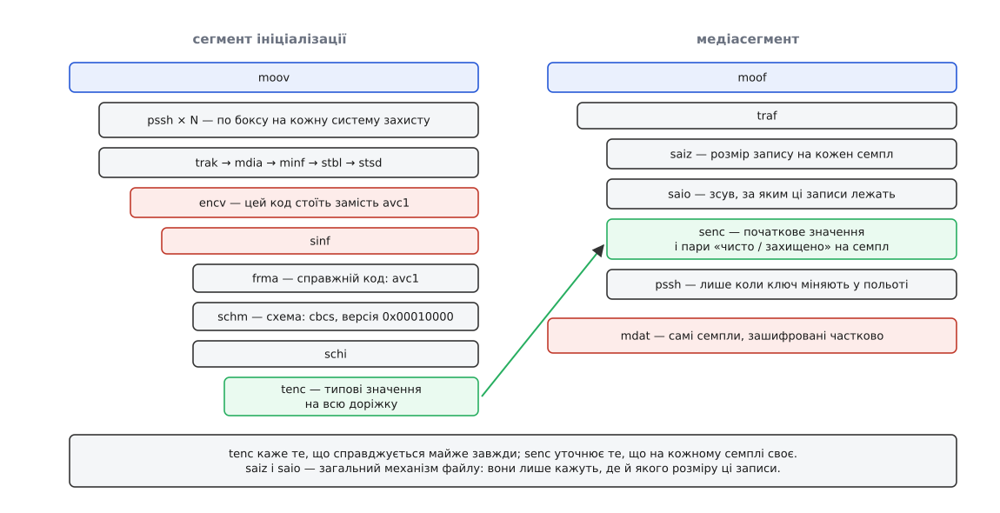

# 📋 Бокси спільного шифрування в ISO BMFF: поле за полем

Це довідник структур, якими фрагментований MP4 повідомляє, що́ саме в ньому зашифровано і за якими правилами: ланцюжок `sinf → frma → schm → schi → tenc` у сегменті ініціалізації, `senc` разом із `saiz`/`saio` у кожному медіафрагменті, `pssh` із непрозорим тілом для окремої системи захисту — і дзеркало того самого в маніфесті DASH та в плейлисті HLS. Усе показано так, як воно лежить у файлі: [бокс за боксом](book:communications/media-container), числа — старшим байтом уперед ([порядок байтів](book:programming/endianness)), чотирилітерні коди — звичайні ASCII-байти.


*Ліворуч — оголошене раз на доріжку, праворуч — те, що повторюється в кожному фрагменті.*

### Оголошення: `sinf` замість звичайного опису семплів

Окремого прапорця «зашифровано» у файлі немає. Замість нього в описі семплів (`stsd`) підмінюють сам чотирилітерний код: `avc1` і `hvc1` стають `encv`, `mp4a` — `enca`, і так само для решти видів доріжок — код зображає не формат, а факт захисту. Програма, яка не знає спільного шифрування, не впізнає коду й навіть не спробує згодувати шифротекст декодерові. Справжній код при цьому не втрачено — він лежить поруч, у `frma`, і повертається на місце одразу після дешифрування.

```
aligned(8) class ProtectionSchemeInfoBox(fmt) extends Box('sinf') {
   OriginalFormatBox(fmt)  original_format;   // 'frma' — обов'язковий
   SchemeTypeBox           scheme_type_box;   // 'schm' — для CENC обов'язковий
   SchemeInformationBox    info;              // 'schi' — контейнер для 'tenc'
}

aligned(8) class OriginalFormatBox(codingname) extends Box('frma') {
   unsigned int(32) data_format;              // 'avc1', 'hvc1', 'mp4a', …
}

aligned(8) class SchemeTypeBox extends FullBox('schm', 0, flags) {
   unsigned int(32) scheme_type;              // 'cenc' | 'cens' | 'cbc1' | 'cbcs'
   unsigned int(32) scheme_version;           // 0x00010000
   if (flags & 0x000001) unsigned int(8) scheme_uri[];
}
```

`scheme_version` у спільному шифруванні завжди `0x00010000`: старша половина слова — головна версія, молодша — побічна.

| `scheme_type` | режим шифру | покриття захищеного діапазону |
|---|---|---|
| `cenc` | AES-CTR | кожен 16-байтовий блок |
| `cens` | AES-CTR | візерунком |
| `cbc1` | AES-CBC | кожен 16-байтовий блок |
| `cbcs` | AES-CBC | візерунком |

За всіма чотирма стоїть той самий [блоковий шифр](book:algorithms/block-cipher) AES зі 128-бітним ключем — різниця лише в тому, як його вмикають.

### `tenc` — типові значення на всю доріжку

```
aligned(8) class TrackEncryptionBox extends FullBox('tenc', version, flags=0) {
   unsigned int(8)  reserved = 0;
   if (version == 0)
      unsigned int(8)  reserved = 0;
   else {                                          // version 1
      unsigned int(4)  default_crypt_byte_block;
      unsigned int(4)  default_skip_byte_block;
   }
   unsigned int(8)  default_isProtected;
   unsigned int(8)  default_Per_Sample_IV_Size;    // 0, 8 або 16
   unsigned int(8)  default_KID[16];
   if (default_isProtected == 1 && default_Per_Sample_IV_Size == 0) {
      unsigned int(8) default_constant_IV_size;    // 8 або 16
      unsigned int(8) default_constant_IV[default_constant_IV_size];
   }
}
```

| поле | ширина | що означає і коли має сенс |
|---|---|---|
| `default_isProtected` | 1 Б | `1` — семпли доріжки зашифровані; `0` — доріжка описана як захищена, але семпли лежать чистими (так позначають відкриті вставки в захищеному потоці) |
| `default_Per_Sample_IV_Size` | 1 Б | скільки байтів початкового значення записано в `senc` на кожен семпл: `8` чи `16`. Нуль означає, що на семпл не пишуть нічого — діє `default_constant_IV` |
| `default_KID` | 16 Б | номер ключа; єдине поле, що має сенс за будь-якої схеми |
| `default_crypt_byte_block` / `default_skip_byte_block` | 4 + 4 біти | довжина візерунка в 16-байтових блоках. Полів фізично немає у version 0; сенс мають лише для `cens` і `cbcs` |
| `default_constant_IV_size` + `default_constant_IV` | 1 Б + 8/16 Б | присутні рівно тоді, коли `default_isProtected == 1` і `default_Per_Sample_IV_Size == 0` |

Останній рядок пояснює, чому `cbcs` не носить початкове значення на кожен семпл. У режимі зчеплення ланцюг однаково перезапускається на початку кожного захищеного діапазону — а діапазонів у семплі багато, і вони короткі. Тримати на кожен із них окреме значення не було б за що: одне сталé на всю доріжку робить рівно ту саму роботу й нічого не додає до кожного фрагмента.

```
                             cenc    cens    cbc1    cbcs (відео)  cbcs (звук)
version                        0       1       0          1             1
default_Per_Sample_IV_Size     8       8      16          0             0
default_constant_IV            —       —       —        16 Б          16 Б
crypt_byte_block : skip        —      1:9      —         1:9           1:0
```

Візерунок `1:0` читається як «шифруємо один блок, пропускаємо жодного» — тобто захищений діапазон покрито суцільно. Для звуку так і роблять: семпл там короткий, економити нема на чому, а поділ на заголовок і тіло, який дає візерунку сенс у відео, у звуковому кадрі відсутній.

**Реальний `tenc` для `cbcs`-відео, байт за байтом:**

```
00 00 00 31  74 65 6e 63    ← розмір 49 Б, тип 'tenc'
01 00 00 00                 ← version = 1, flags = 0
00                          ← reserved
19                          ← 0x1 | 0x9 → crypt_byte_block=1, skip_byte_block=9
01                          ← default_isProtected = 1
00                          ← default_Per_Sample_IV_Size = 0
c4 e2 b9 a1 6f 30 4d 5b
9c 11 0a 7f 2d 63 e8 45     ← default_KID
10                          ← default_constant_IV_size = 16
…16 байтів…                 ← default_constant_IV
```

### `senc` — початкові значення й межі на кожен семпл

```
aligned(8) class SampleEncryptionBox extends FullBox('senc', version=0, flags) {
   unsigned int(32) sample_count;
   {
      unsigned int(Per_Sample_IV_Size*8) InitializationVector;
      if (flags & 0x000002) {                       // записи з підсемплами
         unsigned int(16) subsample_count;
         {
            unsigned int(16) BytesOfClearData;
            unsigned int(32) BytesOfProtectedData;
         }[subsample_count]
      }
   }[sample_count]
}
```

Тут ховається головна пастка розбору: ширина поля `InitializationVector` у самому боксі не записана. Прочитати `senc` окремо, не маючи перед очима `tenc` тієї самої доріжки, неможливо — розбір просто не має з чого дізнатися крок запису. Так само й `subsample_count` присутній лише тоді, коли в `flags` виставлено біт `0x000002`.

Пари несиметричні за шириною навмисно: чистого на початку одиниці — десятки байтів, тож двох байтів вистачає з великим запасом, а захищений діапазон може бути в мегабайти, тож під нього беруть чотири.

**Один семпл 1080p — 32 чистих байти й 48 088 захищених, схема `cenc`:**

```
00 00 00 20  73 65 6e 63    ← розмір 32 Б, тип 'senc'
00 00 00 02                 ← version = 0, flags = 0x000002
00 00 00 01                 ← sample_count = 1
00 00 00 00 00 00 27 10     ← InitializationVector, 8 Б
00 01                       ← subsample_count = 1
00 20                       ← BytesOfClearData      = 32
00 00 bb d8                 ← BytesOfProtectedData  = 48 088
```

### `saiz` і `saio` — загальний механізм, під який `senc` підставлено

Вміст `senc` не є винаходом спільного шифрування: ISO BMFF має власний спосіб чіпляти до семплів довільну допоміжну інформацію. Розміри записів оголошує `saiz`, місце — `saio`, а тип інформації названо чотирилітерним кодом.

```
aligned(8) class SampleAuxiliaryInformationSizesBox
                 extends FullBox('saiz', version=0, flags) {
   if (flags & 1) {
      unsigned int(32) aux_info_type;            // = scheme_type, напр. 'cbcs'
      unsigned int(32) aux_info_type_parameter;  // 0
   }
   unsigned int(8)  default_sample_info_size;    // 0 → розміри різні, далі масив
   unsigned int(32) sample_count;
   if (default_sample_info_size == 0)
      unsigned int(8) sample_info_size[sample_count];
}

aligned(8) class SampleAuxiliaryInformationOffsetsBox
                 extends FullBox('saio', version, flags) {
   if (flags & 1) {
      unsigned int(32) aux_info_type;
      unsigned int(32) aux_info_type_parameter;
   }
   unsigned int(32) entry_count;                 // зазвичай 1 на фрагмент
   if (version == 0) unsigned int(32) offset[entry_count];
   else              unsigned int(64) offset[entry_count];
}
```

Наслідок для того, хто пише розбір: ті самі дані доступні двома шляхами. Одні реалізації читають `senc` і не дивляться більше нікуди; інші беруть із `saio` зсув, із `saiz` розміри й розбирають байти за ними. Пакувальник тому пише всі три бокси й стежить, щоб вони збігалися.

`offset` у фрагменті рахують від тієї самої бази, що й дані доріжки, — тієї, яку встановлює `tfhd` через `base_data_offset` або прапорець `default-base-is-moof`. Це найчастіше джерело розбіжностей між пакувальниками: при відносній адресації прапорець `default-base-is-moof` мусить бути виставлений, інакше зсув указує не туди.

### `seig` — коли ключ міняється посеред доріжки

Значення з `tenc` перекриваються групою семплів. У фрагменті з'являється пара `sbgp` + `sgpd` із `grouping_type = 'seig'`, а запис групи (`CencSampleEncryptionInformationGroupEntry`) має ті самі поля, що й `tenc`, тільки без префікса `default_`: `crypt_byte_block`, `skip_byte_block`, `isProtected`, `Per_Sample_IV_Size`, `KID` і за потреби `constant_IV`. Семпли, приписані до групи, беруть її значення; усі решта лишаються на типових із `tenc`.

### `pssh` — по боксу на кожну систему захисту

```
aligned(8) class ProtectionSystemSpecificHeaderBox
                 extends FullBox('pssh', version, flags=0) {
   unsigned int(8)  SystemID[16];
   if (version > 0) {
      unsigned int(32) KID_count;
      { unsigned int(8) KID[16]; }[KID_count]
   }
   unsigned int(32) DataSize;
   unsigned int(8)  Data[DataSize];              // непрозоре для всіх, крім своєї системи
}
```

`version = 0` — перелік ключів не наведено; так пишуть, коли ключі змінюються в польоті й наперед невідомі. `version = 1` — перелік `KID` є, і програвач ще до першого сегмента бачить, чи потрібна йому нова ліцензія. Місце боксу — `moov` (для всього потоку) або `moof` (коли ключ підмінюють посеред відтворення).

| система | `SystemID` |
|---|---|
| Widevine | `edef8ba9-79d6-4ace-a3c8-27dcd51d21ed` |
| PlayReady | `9a04f079-9840-4286-ab92-e65be0885f95` |
| FairPlay Streaming | `94ce86fb-07ff-4f43-adb8-93d2fa968ca2` |
| спільний бокс W3C | `1077efec-c0b2-4d02-ace3-3c1e52e2fb4b` |
| Clear Key (DASH-IF) | `e2719d58-a985-b3c9-781a-b030af78d30e` |
| Marlin | `5e629af5-38da-4063-8977-97ffbd9902d4` |

Останній рядок таблиці варто відокремити від решти. `1077efec-…` — не система захисту, а домовленість W3C: бокс із цим ідентифікатором несе лише перелік `KID` і зобов'язаний мати `DataSize = 0`; тіла в нього немає взагалі. Реалізація, що приймає початкові дані у форматі `cenc`, мусить його розуміти — тобто це найменший спільний знаменник, який заміняє три вендорські бокси там, де ключ і так буде замовлено через власний канал програвача. FairPlay же в реальних файлах через `pssh` майже не оголошують: Apple підписує ключ у плейлисті HLS, а не в боксі.

**Спільний бокс W3C з одним номером ключа:**

```
00 00 00 34  70 73 73 68    ← розмір 52 Б, тип 'pssh'
01 00 00 00                 ← version = 1, flags = 0
10 77 ef ec c0 b2 4d 02
ac e3 3c 1e 52 e2 fb 4b     ← SystemID: спільний бокс W3C
00 00 00 01                 ← KID_count = 1
c4 e2 b9 a1 6f 30 4d 5b
9c 11 0a 7f 2d 63 e8 45     ← KID
00 00 00 00                 ← DataSize = 0
```

### Дзеркало в маніфесті DASH

Усе згадане лежить у сегменті ініціалізації — а програвач хоче знати про шифрування раніше, ніж завантажить бодай один файл. Тому ключові поля дублюють у маніфесті, і на цьому дублюванні тримається паралелізм: ліцензію замовляють одночасно з першими сегментами, а не після них.

```xml
<AdaptationSet mimeType="video/mp4" xmlns:cenc="urn:mpeg:cenc:2013">

  <ContentProtection
      schemeIdUri="urn:mpeg:dash:mp4protection:2011"
      value="cbcs"
      cenc:default_KID="c4e2b9a1-6f30-4d5b-9c11-0a7f2d63e845"/>

  <ContentProtection schemeIdUri="urn:uuid:edef8ba9-79d6-4ace-a3c8-27dcd51d21ed">
    <cenc:pssh>AAAANHBzc2gBAAAA…</cenc:pssh>
  </ContentProtection>

  <ContentProtection schemeIdUri="urn:uuid:9a04f079-9840-4286-ab92-e65be0885f95">
    <cenc:pssh>AAACJnBzc2gAAAAA…</cenc:pssh>
  </ContentProtection>

</AdaptationSet>
```

| у файлі | у маніфесті |
|---|---|
| `schm.scheme_type` | `@value` елемента зі `schemeIdUri="urn:mpeg:dash:mp4protection:2011"` |
| `tenc.default_KID` | `@cenc:default_KID` — ті самі 16 байтів, записані з дефісами |
| бокс `pssh` цілком | `<cenc:pssh>` у base64, усередині елемента `urn:uuid:<SystemID>` |

Перший елемент каже, що вміст зашифровано і яким ключем; наступні — по одному на систему, і програвач бере той, чий `SystemID` збігається з його власним. Решту він мовчки минає.

### Дзеркало в плейлисті HLS

```
#EXT-X-KEY:METHOD=SAMPLE-AES,KEYFORMAT="com.apple.streamingkeydelivery",KEYFORMATVERSIONS="1",URI="skd://c4e2b9a1-6f30-4d5b-9c11-0a7f2d63e845"
#EXT-X-KEY:METHOD=SAMPLE-AES,KEYFORMAT="urn:uuid:edef8ba9-79d6-4ace-a3c8-27dcd51d21ed",KEYFORMATVERSIONS="1",URI="data:text/plain;base64,AAAANHBzc2gB…"
```

Розкладка тут інша, ніж у DASH, хоч байти сегментів ті самі. Схему шифрування називає не окреме поле, а сам `METHOD`: для фрагментованого MP4 `SAMPLE-AES` означає `cbcs`, а `SAMPLE-AES-CTR` — `cenc`. Номер ключа окремим атрибутом не виносять — він або сидить усередині `URI` після `skd://`, або захований у тому самому боксі `pssh`, тільки перекодованому в base64 і вкладеному прямо в рядок. Роль `SystemID` грає `KEYFORMAT`, і кілька тегів із різними `KEYFORMAT` законно діють на той самий сегмент.

Тег `#EXT-X-SESSION-KEY` у мультиваріантному плейлисті дає те саме, що дає `ContentProtection` у маніфесті DASH: програвач може замовити ліцензію ще до того, як вибере якість. Повний перелік атрибутів обох описів — [теги плейлиста HLS і елементи MPD](book:communications/hls-dash/api-manifest-tags.md).
