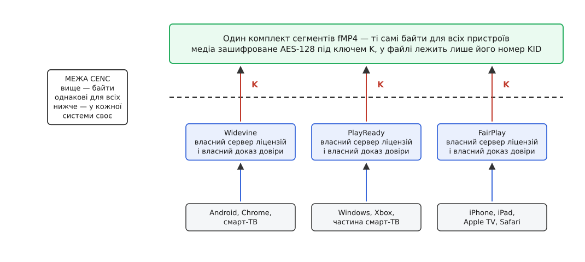
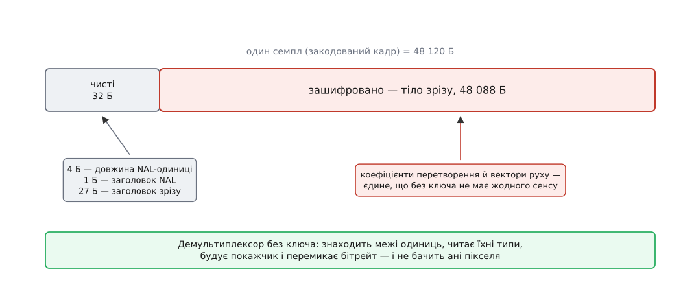
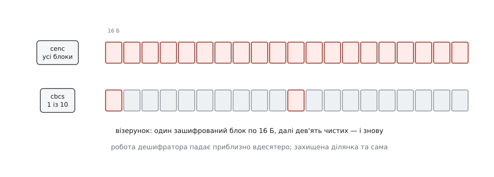

# Спільне шифрування медіа (CENC): одні сегменти, різні системи ключів

<preknowlist>
- [HLS і DASH](topic:communications/hls-dash) — потокове відео роздають як набір незмінних сегментів плюс текстовий список; кожен сегмент — окремий ресурс, який має право закешувати будь-який вузол на шляху.
- [Медіаконтейнер](topic:communications/media-container) — як стиснені кадри складають у файл: службові структури з мітками часу, розмірами й описом доріжок лежать окремо від самих закодованих кадрів.
- [H.264: NAL-одиниці](topic:algorithms/h264-nal-structure) — закодований кадр складається з одиниць із коротким заголовком; частина одиниць несе параметри декодування, частина — саме зображення.
- [Блоковий шифр](topic:algorithms/block-cipher) — оборотне перетворення блока фіксованої довжини під ключем; AES працює блоками по 16 байтів.
- [Потоковий шифр](topic:algorithms/stream-cipher) — генерування псевдовипадкового потоку байтів під ключем і накладання його на дані; довжина повідомлення при цьому не змінюється.
</preknowlist>

Один і той самий фільм треба показати на телефоні з Android, на приставці з Windows і на iPhone. Фільм платний, тож без дозволу правовласника він не має відтворитися ніде. Кожна з трьох платформ уже має механізм такого дозволу — вбудований у чип, підписаний виробником, закритий і незамінний. І жоден із трьох не розуміє двох інших.

Найпростіша відповідь напрошується сама: закодувати фільм тричі, кожного разу під свою систему. Порахуймо, у що це стає.

Місце у сховищі потроюється — прикро, але терпимо, диски дешеві. Значно гірше з роздачею. Сегменти віддають мережі кешів, а кеш тримає в себе те, що реально просять, і викидає те, чого не просять давно. Три комплекти — це три різні адреси на той самий вміст: одна популярна серія займає в кожному вузлі три окремі місця й тричі бореться за право там залишитися. Влучність кешу падає, і падає саме на популярному вмісті, з якого потокове відео й живе. А оскільки кожен фільм існує ще й у восьми якостях для [адаптивного бітрейту](topic:communications/adaptive-bitrate), множник накладається на множник: замість восьми доріжок пакувальник виготовляє двадцять чотири й потім усі двадцять чотири перевіряє.

Отже, питання не в тому, як здешевити три комплекти. Питання в тому, що́ в них насправді різне.

### Де саме три системи відрізняються

Розберімо, з чого складається захист вмісту, і пройдімо по частинах.

Спершу пристрій має довести, що він той, за кого себе видає, і що його не зламали. Доказ спирається на ключ, зашитий у кремній на заводі, і на ланцюг підписів виробника. Тут три системи розходяться цілком: у кожної свій корінь довіри, свої заводи, свої правила відкликання зламаних моделей.

Далі пристрій звертається до [сервера ліцензій](topic:communications/drm-key-delivery) і отримує дозвіл — разом із ключем, загорнутим так, щоб розгорнути його зміг лише цей конкретний чип, і з правилами, скільки й де цим дозволом можна користуватися. Формат запиту, формат відповіді, спосіб загортання ключа — знову власні в кожної системи, і власні не випадково: саме тут вони конкурують і саме тут відповідають за наслідки зламу.

Нарешті — з ключем на руках пристрій перетворює зашифровані байти назад на кадри.

Ця третя частина єдина торкається самого медіа. І вона, на відміну від двох попередніх, у всіх трьох системах робить буквально одне й те саме: проганяє байти через AES зі 128-бітним ключем. Відмінності тут нікому не потрібні — вони не дають ані безпеки, ані переваги на ринку, а коштують потроєної роздачі.

Звідси й розріз. Зафіксувати стандартом рівно третю частину — до останнього байта, так, щоб результат був однаковий незалежно від системи. Перші дві лишити кожному свої. Це і є спільне шифрування, CENC (англ. *common encryption* — «спільне шифрування»), описане стандартом ISO/IEC 23001-7.

Варто одразу назвати, чого CENC не робить, бо на цьому найчастіше плутаються. Він не стандартизує захист вмісту й не примирює три системи ліцензій. Він стандартизує шифротекст — і тільки його.


*Вище межі — байти, які мусять бути однаковими, бо інакше комплектів буде три. Нижче — доказ довіри, протокол ліцензії й спосіб загортання ключа: у кожної системи свої, і зводити їх до спільного знаменника ніхто не збирався.*

Історія цього розрізу — окрема й повчальна: [як домовлялися про CENC](topic:communications/common-encryption/hist-cenc-standard.md) показує, що перша редакція стандарту (2012) зафіксувала лише один режим, і рівно тому Apple опинилася поза нею на чотири роки. Компроміс, який усе зрушив, з'явився в третій редакції — 2016 року.

### Що означає «зафіксувати до байта»

Щоб два незалежні виробники, маючи той самий ключ і той самий файл, отримали ту саму картинку, стандарт мусить визначити п'ять речей: який шифр і в якому режимі; які саме байти файла зашифровані, а які ні; звідки береться початкове значення для кожного семпла; як називається ключ, щоб пристрій знав, який просити; і де в файлі все це записано.

Найнесподіваніший із п'яти пунктів — другий. Здавалося б, шифрувати треба все.

### Чому шифрують не весь файл

Уявімо, що сегмент зашифровано цілком. Тоді програвач, який ще не має ключа, бачить купу байтів без структури. Він не знає, скільки в файлі доріжок, які в них мітки часу, де починається кожен кадр. Він не може вирішити, чи взагалі варто просити ліцензію на цей сегмент, не може перемкнути якість на межі кадру, не може перемотати. Кешам теж нема за що зачепитися. Тобто перше, що ламає суцільне шифрування, — це не перегляд, а всю логістику навколо нього.

Отже, службові структури контейнера лишаються відкритими. Шифрують лише корисне навантаження — самі закодовані кадри.

Але й цього замало. Закодований кадр теж має внутрішній устрій: він поділений на одиниці, у кожної короткий заголовок із типом і довжиною, а всередині одиниці зображення — ще й заголовок зрізу, який каже, яка це частина кадру і як її декодувати. На цю структуру спираються всі, хто торкається потоку до дешифрування: пакувальник, що ріже на сегменти, аналізатор, що шукає ключові кадри, і — головне — апаратний декодер, конвеєр якого часто влаштований так, що заголовок зрізу читає ще до того, як дані дійдуть до блока дешифрування.

Тому шифрування опускається ще на рівень нижче: усередині семпла воно накриває лише тіло зрізу, а заголовки лишаються чистими. Семпл описують як послідовність пар «стільки-то чистих байтів, стільки-то захищених» — це й називають підсемпловим шифруванням.


*Тридцяти двох відкритих байтів на початку вистачає, щоб пройти файл наскрізь, побудувати покажчик і перемкнути бітрейт. Усе, що несе зображення, лишається недоступним.*

**Кадр 1080p у H.264, одна одиниця зображення:**

```
розмір семпла                  = 48 120 Б
префікс довжини NAL-одиниці    =      4 Б   ← чисто
заголовок NAL-одиниці          =      1 Б   ← чисто
заголовок зрізу                =     27 Б   ← чисто
чистих на початку              =     32 Б
захищений діапазон             = 48 120 − 32 = 48 088 Б
повних 16-байтових блоків      = 48 088 ÷ 16 = 3005, лишок 8 Б
```

Ці два числа — 32 і 48 088 — записують у файл для кожної одиниці кожного семпла. Пристрій не шукає межі сам: він читає пари й точно знає, де вмикати шифр.

Звідси випливає ще одна жорстка вимога, про яку легко забути. Шифрування **не має права змінювати довжину**. Розміри семплів записані в контейнері наперед, покажчик побудований на них, і якщо шифротекст став довшим за відкритий текст, весь файл треба перебудовувати. Це відсікає класичне доповнення до цілого блока — а разом із ним і найпростіше застосування CBC.

### Лічильник: чому першим був саме він

Режим лічильника обходить обидві проблеми одразу. Блоковий шифр у ньому не шифрує дані — він виробляє з ключа потік байтів. Береться 16-байтовий лічильний блок, проганяється через AES, результат накладається на дані порозрядним додаванням за модулем 2:

```
потік_i    = AES_K(лічильний_блок_i)
шифротекст = відкритий_текст ⊕ потік
```

Наслідки випливають самі. Довжина зберігається точно, бо накладання побайтове й останній неповний блок просто бере скільки треба. Будь-який блок розшифровується самостійно: щоб дістати блок номер 500, не потрібні попередні 499 — достатньо порахувати лічильний блок для нього. А отже, дешифрування розпаралелюється, і почати можна з середини.

Лічильний блок збирають так: перші вісім байтів — це початкове значення, своє для кожного семпла і записане в файл; молодші вісім байтів — номер блока, що починається з нуля і зростає на одиницю на кожні зашифровані 16 байтів. Стандарт дозволяє і повні 16-байтові початкові значення; тоді лічильник додається до всього числа. Тонкість, яку часто розуміють неправильно: лічильник рахує **лише зашифровані байти** й наскрізно проходить через увесь семпл. Чисті ділянки він не рахує — потік ніби зшивається через них, і сусідні захищені діапазони продовжують один одного.

> 🔧 **Навіщо це.** Кадр 4K важить близько мегабайта, і розшифрувати його треба за той самий час, за який його треба показати. Апаратний блок AES у чипі бере кілька блоків одночасно — саме тому, що в режимі лічильника вони не залежать один від одного. З CBC такий блок довелося б годувати послідовно. Це не теоретична деталь, а причина, чому дешеві приставки взагалі тягнуть захищене 4K.

Цей режим і назвали `cenc`. Логічно було б на цьому й зупинитися — але не зупинилися.

### Чому по-друге з'явився CBC

Apple прийшла до захищеного відео власним шляхом. HLS від початку вмів шифрувати сегменти цілком у режимі зчеплення блоків: кожен блок перед шифруванням додається до вже зашифрованого попереднього, тож розшифрувати блок можна лише після сусіда зліва. Пізніше з'явився варіант з підсемпловим шифруванням, але режим лишився той самий — і конвеєри в чипах Apple були побудовані під нього.

Через це файл, зашифрований за `cenc`, пристрій Apple не читав. Не через ліцензійну політику, а буквально: не той режим шифру.

Розв'язок знайшли не в тому, щоб хтось поступився режимом, а в другому винаході, який виявився корисним усім.

### Візерунок: удесятеро менше роботи

Повне шифрування кожного байта відео — це постійний податок на весь потік, і для слабкого чипа він відчутний. Тому в стандарт увели **візерункове шифрування**: у межах захищеного діапазону шифрують не всі 16-байтові блоки, а перші кілька з кожної групи, решту лишають чистими. Для відео взяли співвідношення один до дев'яти — один зашифрований блок, дев'ять чистих, і знову.


*Обидва рядки описують один і той самий діапазон байтів. Різниця лише в тому, скільки блоків насправді проходить через шифр.*

**Той самий кадр 1080p:**

```
захищений діапазон             = 48 088 Б
повних 16-байтових блоків      = 3005
cenc  — шифрує блоків          = 3005      → 48 080 Б
cbcs  — шифрує кожен десятий   ≈  300      →  4 800 Б, тобто ≈ 10 % семпла
```

Тут потрібна чесність, бо місце слизьке. Дев'ять десятих тіла зрізу лежать у файлі відкритим текстом — це не «майже зашифровано». Захист тримається не на криптографії цих байтів, а на тому, що вони самі по собі непридатні: тіло зрізу — це суцільний ентропійний код, потік змінної довжини, де кожен наступний символ читається лише від правильно прочитаного попереднього. Зіпсований блок збиває розбір, і все, що йде за ним до кінця зрізу, перетворюється на сміття. Тобто пропущені шматки роблять решту нечитною структурно, а не криптографічно. Проти пасивного зловмисника, який роздобув файл, цього достатньо; це свідомий обмін стійкості на швидкість, а не безплатний виграш.

Візерунок дав Apple ще й формальну підставу зійтися з рештою: її схема виявилася окремим випадком того, що тепер було в стандарті.

### Чотири схеми і чому вижили дві

Два незалежні вибори — режим шифру (лічильник або зчеплення) і покриття (суцільне або візерункове) — дають чотири комбінації, і всі чотири в стандарті названі:

```
             суцільне        візерункове
лічильник      cenc              cens
зчеплення      cbc1              cbcs
```

Перша редакція (2012) описала `cenc` і `cbc1`. Візерункові `cens` і `cbcs` додала третя редакція, лютий 2016 року.

З чотирьох у житті трапляються дві. `cenc` — те, на чому виріс увесь DASH до кінця 2010-х. `cbcs` — те, куди все зійшлося: Apple підтримує його з 2017 року, Widevine додала підтримку 2018-го, PlayReady — у версіях четвертої гілки. `cbc1` і `cens` лишилися записаними, але майже ніде не розгорнутими: перший втратив сенс, щойно з'явився `cbcs`, другий не мав за собою жодної платформи.

Важливо не переплутати наслідок. Спільний формат не означає, що пристрій зрозуміє будь-який файл: чип, який уміє лише `cenc`, з `cbcs` не зробить нічого. Тому перехід тривав роками, і сервіси в цей час усе одно тримали два комплекти — тепер уже не три, і не за системами захисту, а за схемами шифрування. Сьогодні звичайна конфігурація — один комплект, спакований у [фрагментований MP4 за CMAF](topic:communications/cmaf) і зашифрований за `cbcs`.

### Ключ у файлі не лежить

Лишився п'ятий пункт: як пристрій дізнається, чого просити.

У файлі немає ключа — там є його шістнадцятибайтовий номер, KID. Програвач читає номер, звертається до своєї системи захисту, та по-своєму добуває сам ключ і віддає його всередину захищеного середовища. Файл при цьому не знає нічого ані про сервери ліцензій, ані про те, хто саме його розшифрує.

Поруч із номером у файл кладуть блоки з даними для конкретних систем захисту — окремий блок на кожну. Кожен позначений ідентифікатором своєї системи, і кожен непрозорий для всіх інших: усередині може бути адреса сервера, обгортка ключа, будь-що. Саме тому один файл спокійно обслуговує три системи одразу — вони не заважають одна одній, бо не читають чужого.

Повний перелік структур, які це описують — [опис блоків шифрування в ISO BMFF](topic:communications/common-encryption/api-cenc-boxes.md): де лежать типові значення для доріжки, де початкові значення й пари «чисто/захищено» для кожного семпла, звідки береться номер схеми і як усе це дублюється в маніфесті DASH.

Оскільки ключ називається номером, а не місцем, з цього безплатно випливають дві потрібні речі. Різні доріжки можуть мати різні ключі — і сервіс віддає ключ до 4K лише пристроям, що пройшли суворішу перевірку, а до звичайної якості — усім. І ключ можна змінювати з часом: нова група семплів просто називає інший номер, а програвач бере нову ліцензію, не перериваючи відтворення.

Як це виглядає з боку того, хто розбирає файл, показано на робочому коді: [розбираємо й розшифровуємо зашифрований сегмент](topic:communications/common-encryption/proj-cenc-decrypt.md) — від читання пар «чисто/захищено» до накладання шифру за візерунком.

### Що лишилося неспільним

Один комплект сегментів — але й досі два описи: список HLS для пристроїв Apple і маніфест DASH для всіх інших. Формати описів так і не злилися, бо в них немає спільної частини такого розміру, як байти медіа. Три протоколи ліцензій теж на місці й нікуди не подінуться.

CENC прибрав рівно одне дублювання — байтів — і не торкнувся жодного іншого. У цьому й полягає причина, чому він спрацював, тоді як спроби домовитися про єдиний захист вмісту не спрацювали жодного разу. Стандарт не намагався примирити три системи довіри: він знайшов єдине місце, де вони роблять однакову роботу й не мають із відмінності ані вигоди, ані аргументу, — і зафіксував саме його, залишивши недоторканим усе, за що учасники трималися. Домовитися вдається там, де предмет домовленості нікому не належить.
