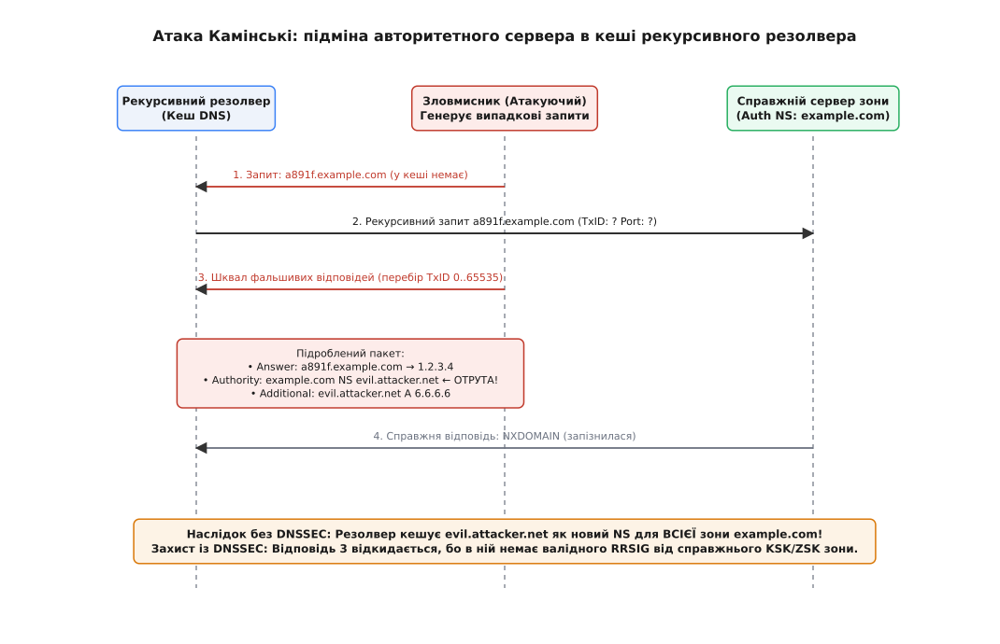
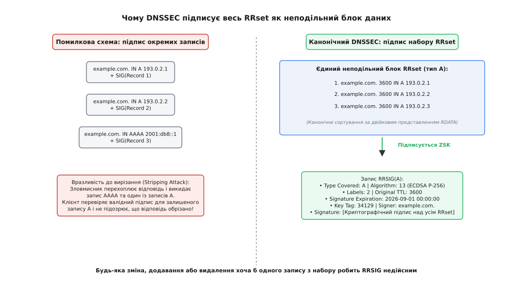
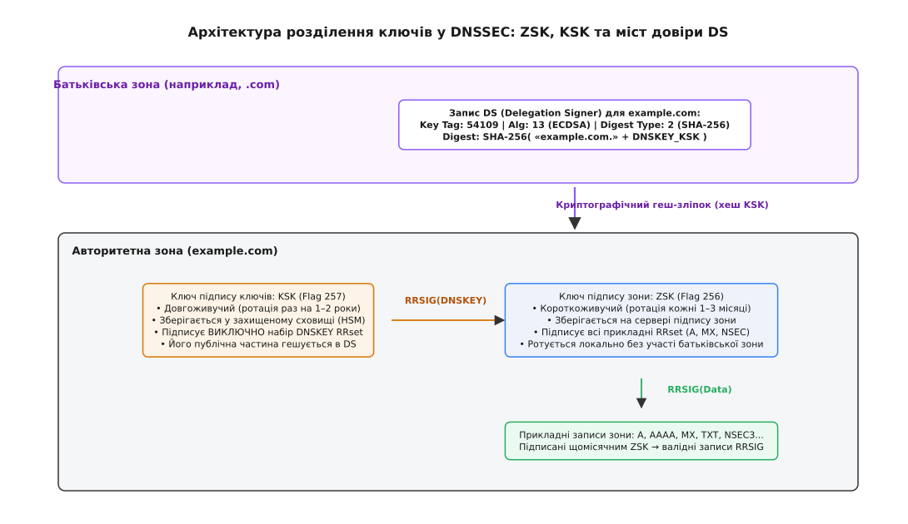
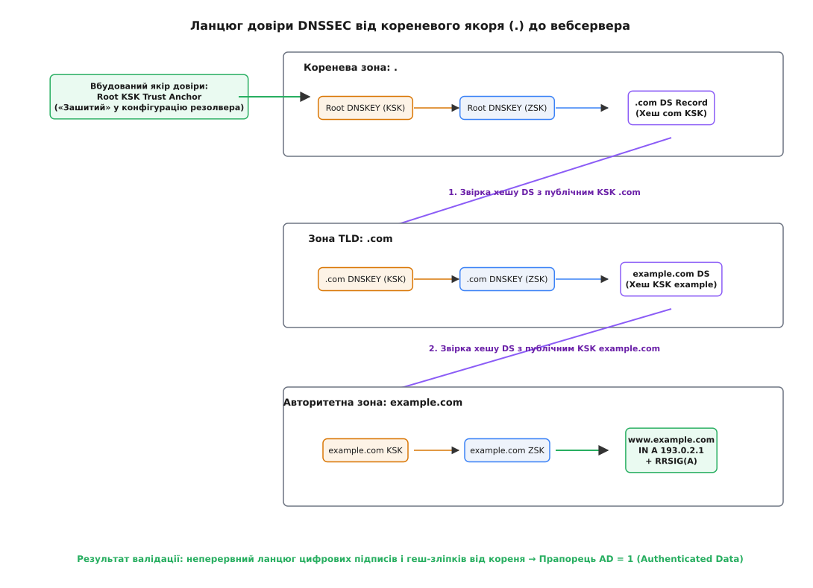
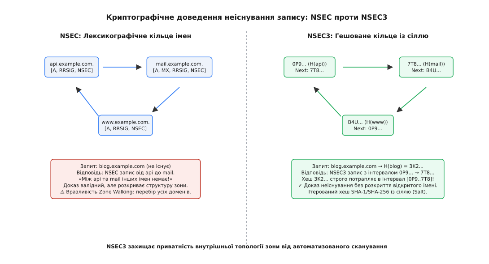
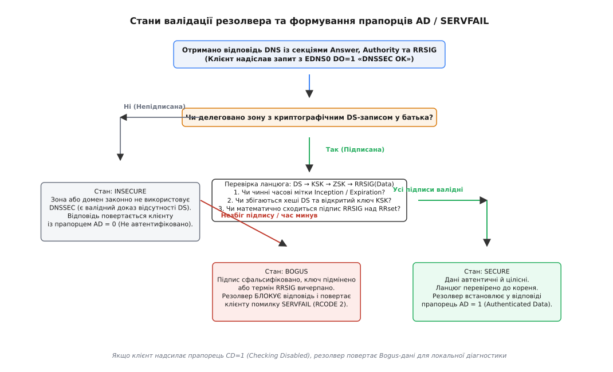

<preknowlist>
* [DHCP і DNS](topic:communications/dhcp-dns) — розподілене дерево доменних імен, ресурсні записи A/AAAA, резолвери й кешування відповідей із часом життя TTL.
* [Криптографія з відкритим ключем](topic:communications/public-key-crypto) — розділення ключів на закритий (для накладання підпису) і відкритий (для перевірки), математична невідмовність.
* [Криптографічні геш-функції](topic:programming/cryptographic-hash) — властивості одностороннього стиснення даних, лавинний ефект та стійкість до пошуку колізій.
* [Контрольні суми](topic:communications/checksums) — контроль цілісності даних у двійкових мережевих протоколах передачі.
</preknowlist>

Коли користувацька програма відкриває захищене з'єднання з банком або корпоративним сервером, першим кроком операційна система надсилає UDP-запит на 53-й порт рекурсивного резолвера для отримання IP-адреси домену `bank.example.com`. У класичній системі DNS цей запит і відповідь передаються у відкритому вигляді без жодного криптографічного захисту. Зловмисник у локальній мережі або на магістральному каналі може згенерувати підроблений UDP-пакет із фальшивою IP-адресою, підібравши 16-бітний номер транзакції `Transaction ID`. Якщо фальшива відповідь надійде до резолвера раніше за справжню, резолвер помістить отруєні дані у свій кеш на весь час життя запису `TTL` (наприклад, на 24 години). Усі користувачі цього провайдера автоматично потраплятимуть на фішинговий сервер-двійник, навіть якщо у браузері налаштовано коректні сертифікати TLS.

Мережеві заходи протидії — такі як рандомізація портів джерела (Source Port Randomization) — лише розширюють простір перебору до 32 бітів, але не усувають кореневу причину. Трансляція адрес (NAT) та агресивні фаєрволи нерідко знищують ентропію портів, а високошвидкісні гігабітні канали дозволяють атакувати резолвер мільйонами підроблених пакетів за секунди. Для фундаментального вирішення проблеми було створено розширення безпеки системи доменних імен **DNSSEC** (*Domain Name System Security Extensions*, англ. *extension* — лат. *extensio*, «розширення»). Замість марних спроб захистити ненадійний транспортний канал UDP, DNSSEC додає асиметричні цифрові підписи безпосередньо до самих даних DNS, утворюючи неперервний ієрархічний ланцюг довіри від кореневої зони Інтернету до кінцевого запису.

---

## 1. Анатомія отруєння кешу та межі рандомізації UDP

Класичний рекурсивний резолвер розрізняє відповіді від авторитетних серверів виключно за п'ятьма параметрами: `IP-адреса джерела`, `UDP-порт джерела`, `IP-адреса призначення`, `UDP-порт призначення` та 16-бітне числове поле `Transaction ID` у заголовку DNS. Оскільки транспортний протокол UDP не встановлює сесійного з'єднання і дозволяє відправнику записувати в IP-заголовок довільну зворотну адресу (IP Spoofing), зловмисник може надсилати шквал підроблених пакетів від імені авторитетного сервера.

До 2008 року вважалося, що атаку отруєння кешу (англ. *cache poisoning*) стримує часовий бар'єр кешування `TTL`. Якщо резолвер надсилав запит на розв'язання `example.com` і справжній авторитетний сервер встигав відповісти раніше за зловмисника, резолвер записував результат у пам'ять із таймером життя `TTL` (наприклад, 86400 секунд). Протягом наступних 24 годин резолвер відповідав клієнтам із кешу і взагалі не надсилав вихідних UDP-запитів до мережі. Атакуючий мав чекати завершення доби для здійснення нової спроби перебору 16-бітного ідентифікатора.

Проте у липні 2008 року дослідник Ден Камінські оприлюднив спосіб атаки, що повністю нівелював захисний механізм TTL. Замість того, щоб чекати закінчення таймера цільового імені `example.com`, зловмисник генерував лавину запитів на випадкові неіснуючі субдомени:

```text
a891f.example.com
b429e.example.com
c771a.example.com
```

Оскільки цих імен гарантовано не було в локальному кеші резолвера, кожен такий запит змушував його негайно ініціювати новий рекурсивний запит до авторитетного сервера зони `example.com`.

Одночасно з кожним запитом атакуючий надсилав сотні сфальсифікованих UDP-відповідей, перебираючи діапазон `Transaction ID` від 0 до 65535. Але головна особливість полягала у вмісті підробленої відповіді. Замість простої підміни IP-адреси субдомену зловмисник додавав у секцію авторитетності `Authority Section` запис про делегування всієї доменної зони:

```text
;; Answer Section:
a891f.example.com.    300  IN  A   198.51.100.1

;; Authority Section (Отрута):
example.com.          86400 IN NS  ns.evil.attacker.net.

;; Additional Section (Клей):
ns.evil.attacker.net. 86400 IN A   203.0.113.66
```

Як тільки один із підроблених пакетів збігався за `Transaction ID` до повернення справжньої відповіді `NXDOMAIN`, резолвер приймав інформацію про новий авторитетний сервер `ns.evil.attacker.net` і кешував його для **всього домену `example.com`**. Усі наступні запити користувачів для `bank.example.com` чи `mail.example.com` резолвер надсилав безпосередньо на сервер зловмисника `203.0.113.66`.

Детальний хронікальний розбір цієї кризи та екстреної координації провідних світових вендорів наведено у вставці [історію відкриття атаки Камінські та кризи довіри до непідписаного DNS](topic:communications/dnssec/hist-kaminsky-attack.md).


*Принцип атаки Камінські: впровадження фальшивого авторитетного сервера зони в кеш резолвера через перебір ідентифікаторів транзакцій та неіснуючі субдомени.*

Терміновим рішенням вендорів у 2008 році стала рандомізація портів джерела (Source Port Randomization, RFC 5452), яка змусила резолвер обирати випадковий UDP-порт у діапазоні 1024..65535 для кожного запиту. Це збільшило ентропію перебору з 16 до 32 бітів (`2³² ≈ 4.29 × 10⁹` комбінацій). Проте на практиці маршрутизатори з трансляцією адрес (NAT) часто стискають пул портів назад до кількох сотень послідовних значень, а сучасні ботнети здатні генерувати мільйони запитів щосекунди. Транспортний рівень UDP вичерпав можливості самозахисту.

---

## 2. Концепція DNSSEC: автентифікація даних замість автентифікації каналу

Головна архітектурна ідея DNSSEC полягає у зміні парадигми безпеки: **захищаються самі дані, а не канал їхньої доставки**.

| Властивість | Транспортний захист (DoT / DoH) | Криптографічний захист даних (DNSSEC) |
|---|---|---|
| **Об'єкт захисту** | Канал між клієнтом і найближчим резолвером (TLS/HTTPS). | Самі ресурсні записи на всьому шляху від первинного сервера до клієнта. |
| **Захист від скомпрометованого резолвера** | Відсутній: резолвер бачить відкриті дані й може їх підмінити. | Повний: резолвер не може змінити підписані дані, не порушивши підпис. |
| **Конфіденційність запитів** | Забезпечується (шифрування трафіку від прослуховування). | **Відсутня**: DNSSEC не шифрує імена та IP-адреси, а лише підписує їх. |
| **Невідмовність та автентичність** | Тільки на ділянці клієнт-сервер. | Наскрізна від власника доменної зони до кінцевого валідатора. |

DNSSEC не шифрує DNS-трафік і не приховує, які сайти відвідує користувач. Його завдання — надати суворий математичний доказ двох фактів:
1. **Автентичність джерела (Data Origin Authentication):** Відповідь сформована саме тим сервером, який законно володіє цією доменною зоною.
2. **Цілісність даних (Data Integrity):** Жоден біт у наборі отриманих записів не був змінений, доданий чи видалений під час передачі мережею.

---

## 3. Підпис набору записів (RRset) та анатомія RRSIG

У класичному DNS домен може мати кілька записів однакового типу, наприклад, три записи типу `A` для балансування навантаження між різними дата-центрами. Якби кожен запис підписувався окремо, зловмисник міг би перехопити пакет і непомітно викинути два записи з трьох (атака вирізання, англ. *stripping attack*). Одержувач перевірив би валідний підпис для єдиного залишеного запису й не помітив би спотворення.

Щоб унеможливити подібні маніпуляції, DNSSEC запроваджує поняття **набору записів ресурсу (Resource Record Set, RRset)**. Набір `RRset` об'єднує всі ресурсні записи зони, які мають однакове доменне ім'я, клас (`IN`) та тип (наприклад, усі записи `A` для `example.com`). Цифровий підпис створюється **над усім набором RRset як єдиним неподільним блоком даних**.

Для збереження підпису введено новий тип ресурсного запису — **RRSIG** (*Resource Record Signature*, лат. *signare* — «позначати, запечатувати»).


*Принцип підпису RRset: усі записи одного типу канонічно сортуються і покриваються єдиним неподільним цифровим підписом RRSIG.*

Повний двійковий макет полів, зміщень та числових кодів алгоритмів стандартизовано в документі [довідник двійкових форматів і бітових масок записів DNSSEC](topic:communications/dnssec/api-dnssec-records.md).

Запис `RRSIG` містить метадані, необхідні для однозначної перевірки:
* **`Type Covered` (2 байти):** Тип записів, які захищає цей підпис (наприклад, тип `1` для `A`, `28` для `AAAA`).
* **`Algorithm` (1 байт):** Криптографічний алгоритм (наприклад, алгоритм `13` — ECDSA на кривій NIST P-256 зі SHA-256 або алгоритм `15` — Ed25519).
* **`Labels` (1 байт):** Кількість міток в імені домену (використовується для виявлення та перевірки підстановочних знаків Wildcard `*.example.com`).
* **`Original TTL` (4 байти):** Початковий час життя запису в зоні на момент накладання підпису. Якщо проміжний кеш зменшить поточний TTL пакета, валідатор підставить при перевірці значення `Original TTL`, щоб геш зійшовся.
* **`Signature Expiration` та `Signature Inception` (по 4 байти):** Часове вікно чинності підпису за шкалою UNIX timestamp. Підпис дійсний лише між цими двома моментами часу.
* **`Key Tag` (2 байти):** 16-бітний контрольний номер відкритого ключа `DNSKEY`, яким створено підпис.
* **`Signer's Name`:** Повне ім'я доменної зони, яка наклала підпис.
* **`Signature`:** Сирі байти асиметричного цифрового підпису.

---

## 4. Розділення ключів зони: ZSK проти KSK

Для перевірки підписів `RRSIG` зона повинна опублікувати свої відкриті ключі у вигляді записів **DNSKEY**.

На практиці адміністратори стикаються з експлуатаційною дилемою:
1. З міркувань безпеки криптографічні ключі треба регулярно змінювати (ротувати). Чим частіше ротується ключ, тим менша ймовірність його компрометації.
2. Проте для зміни ключа зони необхідно внести новий геш-зліпок у **батьківську зону** (наприклад, у реєстр `.com` чи `.ua`), що вимагає взаємодії через реєстратора та триває від кількох годин до кількох діб.

Щоб розв'язати цю суперечність, DNSSEC розділяє функції керування ключами між двома типами ключів:

```text
               +-------------------------------------------+
               |        Батьківська зона (.com)            |
               |         Запис DS (Хеш від KSK)            |
               +---------------------+---------------------+
                                     |
                          (Звірка гешу KSK)
                                     v
               +-------------------------------------------+
               |        Дочірня зона (example.com)         |
               |                                           |
               |  [ KSK (Flag 257) ] ──(підписує)──> [ DNSKEY RRset ]
               |                                            |
               |  [ ZSK (Flag 256) ] ──(підписує)──> [ Дані зони: A, MX, TXT ]
               +-------------------------------------------+
```

1. **Ключ підпису зони (Zone Signing Key, ZSK):**
   - Має значення прапорця `Flags = 256` (0x0100).
   - Використовується для регулярного щоденного підпису всіх прикладних наборів записів (`A`, `AAAA`, `MX`, `TXT`, `NSEC/NSEC3`).
   - Зберігається безпосередньо на сервері підпису і ротується часто (кожні 1–3 місяці) в автоматичному режимі **без звернення до батьківської зони**.

2. **Ключ підпису ключів (Key Signing Key, KSK):**
   - Має встановлений біт `SEP` (Secure Entry Point) і значення прапорця `Flags = 257` (0x0101).
   - Використовується **виключно для підпису набору `DNSKEY RRset`** усередині своєї зони.
   - Зберігається у захищеному апаратному сховищі (HSM), ротується рідко (раз на 1–2 роки), а його геш-зліпок передається до батьківської зони.


*Дворівнева ієрархія ключів: KSK підписує виключно набір DNSKEY, а короткоживучий ZSK підписує всі прикладні дані зони.*

---

## 5. Міст довіри: запис DS та вертикальний ланцюг довіри (Chain of Trust)

Як рекурсивний резолвер дізнається, що відкритий ключ KSK у зоні `example.com` справді належить законному власнику домену, а не підкинутий зловмисником?

Зв'язок між рівнями ієрархії забезпечує спеціальний ресурсний запис **DS** (*Delegation Signer*, лат. *delegare* — «доручати, передавати повноваження»), який розміщується в **батьківській зоні**.

Запис `DS` містить криптографічний геш відкритого ключа KSK дочірньої зони:

```text
DS_Digest = SHA256( Canonical_Owner_Name || DNSKEY_RDATA )
```

Оскільки батьківська зона (наприклад, `.com`) підписана власним ключем ZSK, її запис `DS` захищений підписом `RRSIG(DS)` від зони `.com`. Резолвер отримує можливість побудувати неперервний вертикальний **ланцюг довіри (Chain of Trust)**:


*Повний ланцюг довіри DNSSEC: від зашитого кореневого якоря через домен верхнього рівня (.com) до кінцевого авторитетного сервера.*

### Процедура розгортання ланцюга довіри

1. **Якір довіри (Trust Anchor):** У резолвер заздалегідь «зашитий» відкритий ключ KSK кореневої зони (`.`), стандартизований ICANN.
2. **Кореневий рівень (`.`):** Резолвер перевіряє підпис `RRSIG(DNSKEY)` кореня за допомогою кореневого KSK. Отримавши довірений Root ZSK, резолвер перевіряє запис `DS` для домену верхнього рівня `.com`.
3. **Рівень TLD (`.com`):** Резолвер запитує відкриті ключі `.com DNSKEY`. Геш від KSK `.com` мусить побайтово збігтися із записом `DS`, отриманим від кореня. Довірений KSK `.com` підтверджує ZSK `.com`, а той своєю чергою підписує запис `DS` для `example.com`.
4. **Рівень зони (`example.com`):** Резолвер перевіряє відповідність KSK `example.com` запису `DS` у зоні `.com`. Довірений KSK підтверджує ZSK домену `example.com`, а ZSK перевіряє підпис `RRSIG(A)` над кінцевою IP-адресою вебсервера.

Якщо хоча б одна ланка в цьому ланцюзі не сходиться математично, вся відповідь визнається недійсною.

### Валідація псевдонімів CNAME та правил DNAME

Якщо доменне ім'я є канонічним псевдонімом (`www.example.com CNAME web-lb.cdn.net`), резолвер виконує послідовну покрокову валідацію:
1. Валідується запис `CNAME` у зоні `example.com` разом із відповідним `RRSIG(CNAME)`.
2. Валідатор переходить до цільового домену `web-lb.cdn.net`, будуючи новий незалежний ланцюг довіри від кореня через зону `.net` до `cdn.net`.
3. Валідується кінцевий запис `A` для `web-lb.cdn.net` із його підписом `RRSIG(A)`.
Лише якщо **обидві** ланки ланцюга псевдонімів підтверджені підписами, відповідь отримує статус довіреної.

Програмну реалізацію канонічного розбору пакетів, обчислення Key Tag та перевірки підписів подано у практичній вставці [практичну реалізацію валідатора підписів DNSSEC та канонізатора RRset](topic:communications/dnssec/proj-dnssec-val.md).

---

## 6. Криптографічне доведення неіснування: NSEC проти NSEC3

Коли клієнт запитує ім'я або тип запису, якого не існує (наприклад, `secret.example.com`), авторитетний сервер повертає статус `NXDOMAIN` (немає такого імені) або `NODATA` (ім'я є, але запитуваного типу немає).

В онлайн-криптографії сервер міг би підписати фразу «секретного домену не існує» закритим ключем. Але авторитетні сервери DNSSEC з міркувань швидкості та безпеки працюють у режимі **офлайн-підпису зон**: уся зона підписується заздалегідь, а закриті ключі ніколи не зберігаються в оперативній пам'яті публічних серверів. Сервер не може створити новий цифровий підпис на льоту.

Як надати клієнту статичний, заздалегідь підписаний доказ того, що домену не існує?

### NSEC: Лексикографічне кільце імен

Першим стандартом став запис **NSEC** (*Next Secure*, RFC 4034). Усі наявні імена в зоні сортуються за канонічним алфавітним порядком і зв'язуються в замкнене кільце:

```text
api.example.com.   ──>  mail.example.com.
mail.example.com.  ──>  www.example.com.
www.example.com.   ──>  api.example.com. (замикання)
```

Для кожної пари створюється підписаний запис NSEC:
`api.example.com. IN NSEC mail.example.com. A RRSIG NSEC`

Якщо користувач запитує `blog.example.com`, сервер повертає запис `NSEC(api -> mail)`. Резолвер бачить, що в алфавітному порядку слово `blog` лежить строго між `api` та `mail`. Оскільки підпис підтверджує, що наступним після `api` йде саме `mail`, резолвер математично доводить, що `blog` у зоні відсутній.

**Дефект NSEC — сканування зони (Zone Walking):**
Зловмисник може надіслати запит на неіснуюче ім'я `0.example.com`, отримати перший NSEC-запис, дізнатися перше справжнє ім'я, потім надіслати запит на наступне ім'я — і за лічені секунди повністю завантажити повну внутрішню топологію всієї закритої зони.

### NSEC3: Гешоване кільце із сіллю

Для ліквідації витоку імен стандарт RFC 5155 запровадив **NSEC3**. Замість відкритих імен у кільце об'єднуються їхні криптографічні геші SHA-1 із додаванням випадкової солі (Salt) та ітерацій:

```text
H(api)  = 0P9J5M7...  ──>  H(mail) = 7T8K9L2...
H(mail) = 7T8K9L2...  ──>  H(www)  = B4U8X1P...
H(www)  = B4U8X1P...  ──>  H(api)  = 0P9J5M7...
```


*Принцип доведення неіснування: відкриті лексикографічні інтервали NSEC проти гешованих інтервалів NSEC3.*

Для запиту `blog.example.com` резолвер обчислює `H(blog) = 3K2...` і перевіряє, що отримане значення потрапляє в гешований інтервал `[0P9..7T8]`. Це забезпечує доказ відсутності без розкриття вихідних імен доменів.

### Компактне доведення неіснування (Compact Denial / White Lies)

Сучасні хмарні провайдери DNS (такі як Cloudflare) застосовують онлайн-генерацію мінімальних NSEC-записів (RFC 4470 / RFC 7129): для неіснуючого імені `blog.example.com` сервер генерує синтетичний NSEC-запис `blog\000.example.com -> blog\001.example.com`, підписуючи його за допомогою розміщеного в захищеній пам'яті ZSK. Це дозволяє повернути крихітний за розміром доказ неіснування, який блокує сканування зони без важких обчислень NSEC3.

Формальний математичний апарат кільцевих інтервалів та оцінку стійкості NSEC3 до словникових атак наведено у вставці [математичне обґрунтування канонічного порядку NSEC та стійкості NSEC3](topic:communications/dnssec/math-nsec3-hash.md).

---

## 7. Робота валідатора на стороні резолвера та стани безпеки

Взаємодія між клієнтом, рекурсивним резолвером та авторитетними серверами опирається на прапорці розширення EDNS0:

1. **`DO` (DNSSEC OK):** Клієнт встановлює прапорець `DO = 1` у розширенні EDNS0 запиту, вимагаючи долучити підписи RRSIG до відповіді.
2. **`AD` (Authenticated Data):** Резолвер встановлює прапорець `AD = 1` у заголовку відповіді, якщо вся інформація успішно пройшла криптографічну перевірку до довіреного якоря.
3. **`CD` (Checking Disabled):** Клієнт (наприклад, діагностична утиліта) встановлює `CD = 1`, щоб отримати відповідь навіть у разі помилки валідації.

Під час валідації відповіді резолвер переводить стан домену в одну з чотирьох категорій:


*Діаграма станів валідації резолвера: формування статусів Secure, Insecure та блокування атак помилкою SERVFAIL (Bogus).*

| Стан валідації | Умова переходу | Реакція резолвера | Прапорець |
|---|---|---|---|
| **Secure** | Повний ланцюг довіри перевірено від кореневого якоря до підпису `RRSIG`. | Дані визнано цілісними й повернено клієнту. | `AD = 1`, RCODE 0 (NOERROR) |
| **Insecure** | Зона законно не підписана (батьківська зона надала валідний доказ відсутності DS). | Дані повертаються клієнту як звичайний непідписаний DNS. | `AD = 0`, RCODE 0 (NOERROR) |
| **Bogus** | Підпис пошкоджено, прострочено, підмінено ключ або виявлено підробку. | **Блокування даних!** Клієнт отримує статус відмови сервера. | `SERVFAIL` (RCODE 2) |
| **Indeterminate** | Неможливо встановити статус через мережевий таймаут чи недоступність зони. | Повторні запити або fallback. | `SERVFAIL` |

---

## 8. Мережеві виклики: фрагментація IP, розмір буфера EDNS0 та ампліфікація

Впровадження криптографії значно збільшило обсяг корисного навантаження в пакетах DNS:

### Проблема фрагментації IP та обмеження буфера EDNS0 (1232 байти)

Оригінальний стандарт DNS (RFC 1035) обмежував розмір UDP-пакета 512 байтами. Розширення EDNS0 (RFC 6891) дозволило сторонам узгоджувати буфери до 4096 байтів. Проте пакети розміром понад 1500 байтів змушують мережевий рівень IP виконувати фрагментацію пакетів.

У сучасних мережах понад 10% фрагментованих UDP-пакетів губляться: фаєрволи блокують наступні фрагменти, оскільки вони не містять UDP-заголовка з номерами портів. Особливо гостро проблема проявляється в протоколі IPv6, де мінімальний гарантований розмір MTU становить 1280 байтів.

Для вирішення цієї проблеми міжнародна ініціатива **DNS Flag Day 2020** стандартизувала максимальний рекомендований розмір буфера EDNS0 — **1232 байти** (`1280 байтів IPv6 MTU − 40 байтів IPv6 Header − 8 байтів UDP Header`). Якщо відповідь DNSSEC не вміщується у 1232 байти, сервер встановлює біт обрізання `TC = 1` (Truncated), змушуючи клієнта негайно повторити запит через надійне TCP-з'єднання.

### Захист від атак ампліфікації (DNS Amplification DDoS)

Оскільки відповіді DNSSEC містять довгі публічні ключі та підписи, запит розміром 60 байтів може викликати відповідь розміром до 2500 байтів (коефіцієнт підсилення понад 40×). Зловмисники використовують непідписані відкриті резолвери для атак відмови в обслуговуванні з підробленою IP-адресою жертви. Для захисту авторитетні сервери впроваджують механізм **RRL (Response Rate Limiting)**, який обмежує кількість однакових відповідей на одну й ту саму адресу підмережі клієнта до кількох десятків на секунду.

---

## 9. Еволюція криптографічних алгоритмів: від RSA до ECDSA та Ed25519

Історія розвитку DNSSEC нерозривно пов'язана зі зміною криптографічних алгоритмів підпису:

1. **Епоха RSA (алгоритми 5, 7, 8, 10):**
   - Спочатку стандарт спирався на RSA-1024 та RSA-2048 зі SHA-1 та SHA-256.
   - Головний недолік RSA — громіздкі розміри відкритих ключів (256 байтів для RSA-2048) та підписів (256 байтів на кожен RRSIG). Відповідь із набором `DNSKEY` для RSA-2048 часто перевищує 1500 байтів, викликаючи фрагментацію та збої валідації на мобільних пристроях.

2. **Стандарт сьогодення: ECDSA P-256 (алгоритм 13):**
   - Використовує еліптичну криву NIST P-256 та геш SHA-256.
   - Відкритий ключ займає лише 64 байти, а цифровий підпис — рівно 64 байти.
   - При тому ж рівні криптостійкості (128 бітів симетричного еквівалента) розмір відповіді зменшується у 4 рази, повністю ліквідуючи проблему фрагментації IP у 99.8% випадків.

3. **Сучасна альтернатива: Ed25519 (алгоритм 15):**
   - Побудований на кривій Едвардса Curve25519 за стандартом RFC 8080.
   - Забезпечує детерміновану генерацію підпису без ризику витоку секретного ключа через неякісний генератор випадкових чисел (RNG). Ключ і підпис займають лише по 32 і 64 байти відповідно.

---

## 10. Багатопровайдерний DNSSEC (Multi-Signer DNSSEC, RFC 8901)

Великі корпоративні інфраструктури часто використовують одночасно двох незалежних DNS-провайдерів (наприклад, Cloudflare та AWS Route 53) для забезпечення високої доступності через механізм Anycast. Класичний DNSSEC не дозволяв подібну конфігурацію, оскільки кожен провайдер підписував зону власними закритими ключами, викликаючи статус `Bogus`, якщо резолвер отримував відповідь від сервера А з ключами сервера Б.

Стандарт RFC 8901 регламентує дві моделі багатопровайдерного підпису:
1. **Модель із розділеними ключами (Multi-Signer Model 1):** Кожен провайдер генерує власну пару KSK/ZSK. Провайдери обмінюються відкритими ключами, і кожен із них додає відкриті ключі партнера до свого набору `DNSKEY RRset`, підписуючи повний об'єднаний набір своїм KSK. Батьківська зона публікує два записи `DS` — по одному для кожного провайдера.
2. **Модель зі спільними ключами (Multi-Signer Model 2):** Провайдери використовують одну узгоджену пару ключів KSK/ZSK, підписуючи зону ідентичними криптографічними параметрами.

Це дозволяє клієнтам безперешкодно отримувати відповіді від будь-якого з провайдерів за маршрутизацією Anycast без порушення валідації ланцюга довіри.

---

## 11. Реальна експлуатація: ротація ключів, DANE та прикладний захист

> 🔧 **Навіщо це.**
> Класичний DNS дозволяє будь-якому оператору зв'язку або скомпрометованому роутеру підміняти IP-адреси сайтів для показу реклами чи перехоплення сесій. DNSSEC унеможливлює непомітну підміну записів. Крім того, на базі DNSSEC розгорнуто технологію **DANE** (DNS-based Authentication of Named Entities, RFC 6698): доменні записи `TLSA` публікують відбитки сертифікатів TLS безпосередньо в DNS. Це ліквідує залежність від комерційних центрів сертифікації (CA) і захищає поштові сервери (SMTP TLS) від атак перехоплення трафіку. Центри сертифікації (наприклад, Let's Encrypt) використовують DNSSEC для безпечної валідації володіння доменом за протоколом ACME DNS-01, блокуючи спроби несанкціонованого випуску сертифікатів через підміну BGP-маршрутів.

Крім вебсертифікатів, DNSSEC виступає фундаментом для публікації автентичних ключів хостів SSH через записи **SSHFP** (RFC 4255) та публічних ключів OpenPGP через записи **OPENPGPKEY** (RFC 7929). Клієнт SSH може автоматично перевірити відбиток віддаленого сервера під час першого підключення без потреби ручного підтвердження відбитка (`Trust On First Use`).

### Процедура планової зміни ключів (Key Rollover)

Зміна ключів у робочій зоні без зупинки обслуговування здійснюється за стандартами RFC 7583:

1. **Ротація ZSK (Pre-Publish Method):**
   - *Крок 1:* Новий ключ ZSK публікується в наборі `DNSKEY` зони заздалегідь, але підписи все ще генеруються старим ZSK.
   - *Крок 2:* Після оновлення всіх кешів у світі зона починає підписуватися новим ZSK.
   - *Крок 3:* Старий ZSK видаляється з набору `DNSKEY`.

2. **Ротація KSK (Double-DS Method):**
   - *Крок 1:* У батьківську зону додається другий запис `DS`, що відповідає новому KSK.
   - *Крок 2:* Очікується завершення TTL записів DS у батьківській зоні.
   - *Крок 3:* Дочірня зона перемикає підпис `DNSKEY RRset` на новий KSK.
   - *Крок 4:* Старий запис `DS` вилучається з батьківської зони.

3. **Автоматична синхронізація через CDS та CDNSKEY (RFC 7344, RFC 8078):**
   Дочірня зона публікує нові ключі у записах `CDS` або `CDNSKEY`. Батьківський реєстр TLD автоматично вичитує ці записи, перевіряє поточний підпис DNSSEC і оновлює батьківський запис `DS` без необхідності ручного введення даних адміністратором в панелі реєстратора.

4. **Автоматичне оновлення якорів довіри (RFC 5011):**
   Резолвери автоматично відстежують оновлення кореневого ключа KSK Інтернету за таймером очікування (Hold-down timer 30 діб), що дозволило без збоїв оновити світовий якір довіри KSK-2017 у жовтні 2018 року.

---

## 12. Практичне налаштування валідації у BIND 9 та Knot DNS

Для ввімкнення валідації DNSSEC у конфігураційному файлі BIND 9 (`named.conf`) достатньо вказати директиву автоматичного керування кореневими якорями довіри:

```text
options {
    directory "/var/cache/bind";
    dnssec-validation auto;
    edns-udp-size 1232;
    max-udp-size 1232;
};
```

Директива `dnssec-validation auto;` наказує серверу BIND автоматично завантажити кореневий якір довіри ICANN та підтримувати його актуальність за протоколом RFC 5011.

---

## 13. Підсумок: баланс криптографічної строгості та мережевої надійності

Розширення DNSSEC трансформувало систему доменних імен із ненадійного двійкового довідника на глобальну розподілену базу відкритих ключів із криптографічною невідмовністю.

Головні уроки архітектури DNSSEC:
* **Підпис даних, а не каналу:** Наскрізний підпис на рівні прикладних записів унеможливлює атаки посередника незалежно від топології транспорту.
* **Неподільність набору RRset:** Спільний підпис над відсортованою групою записів блокує атаки з вибірковим вирізанням елементів.
* **Дворівневе розділення ZSK/KSK:** Відокремлення частих локальних підписів від рідкісних міждоменних делегувань забезпечує масштабованість світової інфраструктури.
* **Кільцева топологія відсутності:** Механізми NSEC та NSEC3 доводять неіснування записів у статично підписаних зонах без ризику тримати приватні ключі на фронтенд-серверах.
