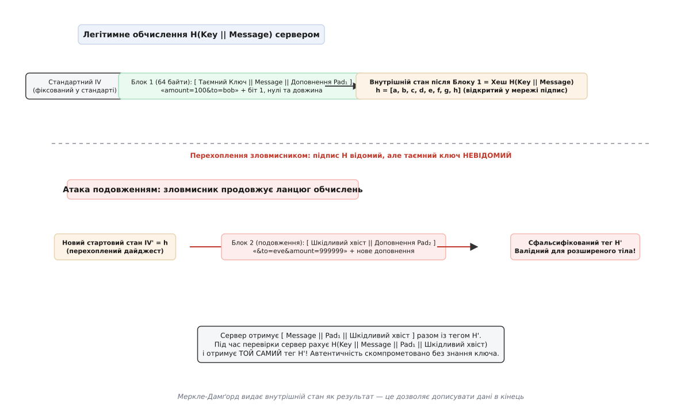
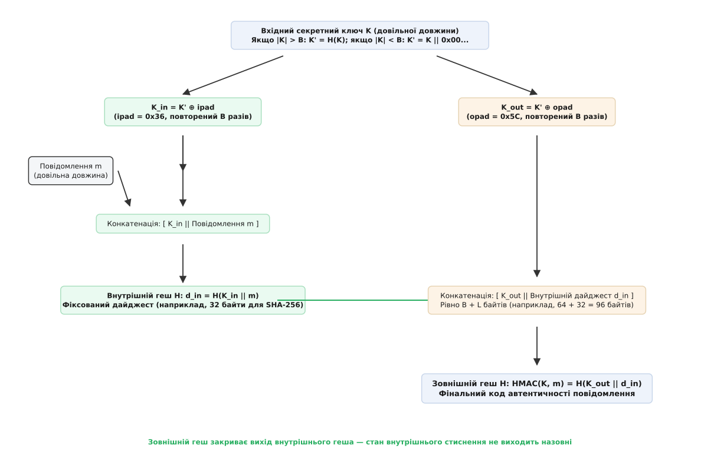
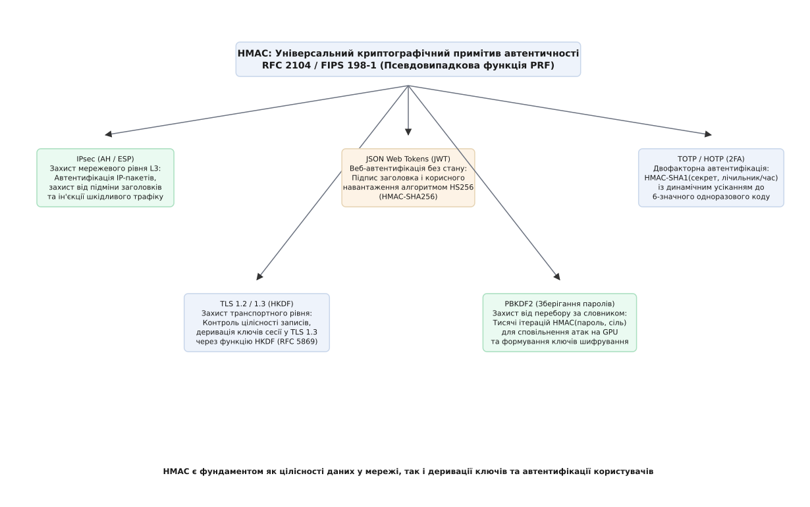
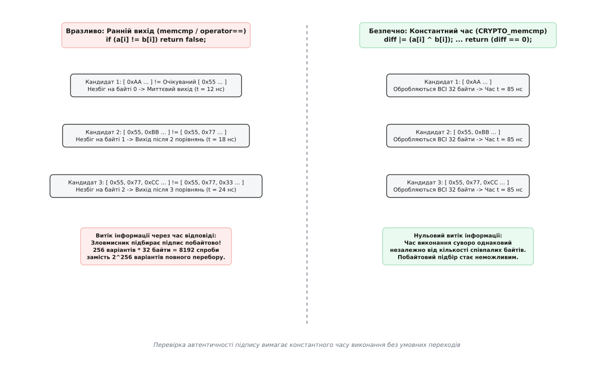

# HMAC і коди автентичності повідомлень

<preknowlist>
* [Криптографічні геш-функції](topic:math/cryptographic-hash-functions)
* [Дайджест-автентифікація](topic:communications/digest-authentication)
* [Криптографічний генератор випадкових чисел](topic:algorithms/csprng)
</preknowlist>

Коли мережевий маршрутизатор або платіжний шлюз отримує пакет із даними, йому недостатньо перевірити математичну цілісність через звичайну криптографічну геш-функцію на зразок SHA-256. Зловмисник у відкритому каналі зв'язку може перехопити передачу, модифікувати суму транзакції з 100 до 10 000 доларів, перерахувати відкритий дайджест нового тексту й передати змінений пакет отримувачу, не залишивши жодного сліду втручання. Для гарантування не лише незмінності бітів, а й автентичності джерела повідомлення сторони зобов'язані залучити спільний таємний ключ.

Код автентичності повідомлень на базі геш-функцій (HMAC, англ. *Hash-based Message Authentication Code*, RFC 2104 / FIPS 198-1) розв'язує цю задачу шляхом двопрохідного симетричного перетворення, яке перетворює будь-яку криптографічну геш-функцію на захищений псевдовипадковий генератор автентифікаційних тегів.

## Пастка наївного підходу: атака подовження довжини (Length Extension Attack)

Першою інтуїтивною ідеєю розробників мережевих протоколів на початку 1990-х років було просте об'єднання таємного ключа `K` та відкритого повідомлення `m` у єдиний потік перед гешуванням: `MAC = H(K || m)`. Такий підхід, відомий як префіксний MAC (Prefix-MAC), здавався компактним і швидким, проте він містить фатальну архітектурну вразливість, зумовлену внутрішньою будовою ітеративних геш-функцій.

Більшість класичних геш-функцій (MD5, SHA-1, SHA-256, SHA-512) побудовані на основі ітеративної конструкції Меркле–Дамґорда. Вхідне повідомлення доповнюється бітом `1`, серією нулів та 64-бітним полем довжини, розбивається на фіксовані блоки по 64 байти, після чого послідовно обробляється односпрямованою функцією стиснення `f`:

```
h_0 = IV
h_i = f( h_{i-1}, Block_i )
Digest = h_n
```

Внутрішній стан геш-функції після обробки останнього блоку `h_n` є нічим іншим, як фінальним значенням вихідного дайджесту, що повертається користувачеві.


*Механізм атаки подовження довжини: знаючи геш H(K || m) та довжину повідомлення, зловмисник ініціалізує внутрішній стан вектора IV отриманим значенням та продовжує обчислення для додатка m_extra без знання ключа K*

### Покроковий механізм підробки підпису без знання ключа

Якщо зловмисник перехоплює відкрите повідомлення `m` та його наївний підпис `Tag = H(K || m)`, він отримує точний стан внутрішніх регістрів `h_n` після обробки першого набору блоків. Оскільки довжина ключа `|K|` або відома зі специфікації протоколу (наприклад, 32 байти), або легко підбирається перебором кількох стандартних значень (16, 24, 32, 64 байти), атакуючий може точно розрахувати первинне вирівнювання:

```
Padding 1 = 0x80 || 0x00...0x00 || Length( |K| + |m| )
```

Після цього зловмисник ініціалізує внутрішні регістри SHA-256 не стандартним константним вектором `IV` алгоритму, а перехопленим значенням `Tag`. Далі він подає на вхід функції стиснення власні шкідливі дані `m_extra`:

```
Tag_forged = f( Tag, m_extra || Padding 2 )
```

У результаті зловмисник отримує валідний підпис `Tag_forged` для розширеного повідомлення `m || Padding 1 || m_extra`, взагалі не знаючи таємного ключа `K`. 

Якщо веб-сервіс використовував префіксний підпис для авторизації API-запиту:
`m = "user=alice&action=read_balance"`
зловмисник може згенерувати цілком легітимний із погляду сервера запит:
`m_forged = "user=alice&action=read_balance\x80...\x00\x01\x80&action=transfer_all&to=attacker"`

Оскільки більшість парсерів параметрів обробляють змінні послідовно і перезаписують попередні значення наступними, сервер застосує останню дію `action=transfer_all`, вважаючи підпис автентичним.

### Інші наївні альтернативи та їхні вразливості

Спроби виправити префіксний MAC іншими простими схемами виявилися не менш вразливими:

1. **Суфіксний MAC (`H(m || K)`):** розміщення ключа наприкінці повідомлення захищає від атаки подовження довжини, але відкриває вразливість до колізій повідомлень. Якщо атакуючий знайде два різних відкритих повідомлення `m1` та `m2`, для яких `H(m1) = H(m2)`, то підписи `H(m1 || K)` та `H(m2 || K)` будуть абсолютно ідентичними для будь-якого секретного ключа `K`. Зловмисник може змусити жертву підписати безпечний документ `m1`, після чого підставити шкідливий контракт `m2` із тим самим підписом.
2. **Конвертний метод (`H(K || m || K)`):** використовувався у ранніх чернетках RFC 1828 для IPsec. Хоча він ускладнює пряме подовження, він не має суворого математичного доведення стійкості і зазнає витоку ентропії при компрометації внутрішніх станів.

Історичний шлях створення та стандартизації симетричних кодів автентичності, включаючи вразливості ранніх версій протоколів SSL та криптоаналітичні відкриття 1990-х років, розібрано у вставці [Історичний розвиток кодів автентичності повідомлень](topic:communications/hmac/hist-mac-evolution.md).

## Вкладена архітектура HMAC (RFC 2104 / FIPS 198-1)

Щоб надійно нейтралізувати як атаку подовження довжини, так і залежність від колізій базового алгоритму, криптографи Міхір Белларе, Ран Канетті та Хуго Кравчик у 1996 році запропонували вкладену двопрохідну конструкцію HMAC:

```
HMAC(K, m) = H( (K' ⊕ opad) || H( (K' ⊕ ipad) || m ) )
```

де:
- `H` — криптографічна геш-функція (наприклад, SHA-256 із розміром блоку `B = 64` байти та виходом `L = 32` байти).
- `K'` — нормалізований ключ довжиною рівно `B` байтів.
- `ipad` (Inner Pad) — константний байт `0x36`, розмножений на всю довжину блоку `B` (64 рази для SHA-256).
- `opad` (Outer Pad) — константний байт `0x5C`, розмножений на всю довжину блоку `B` (64 рази для SHA-256).
- `⊕` — операція побітового виключного АБО (XOR).
- `||` — конкатенація байтових масивів.


*Двопрохідна вкладена архітектура HMAC: нормалізація ключа K', накладання масок ipad/opad та подвійне гешування, що ізолює вихідний підпис від внутрішнього стану повідомлення*

### Алгоритм підготовки ключа K'

Стандарт FIPS 198-1 дозволяє використовувати таємний ключ довільної довжини. Процедура нормалізації зводить його до фіксованого розміру блоку стиснення `B`:

1. **Якщо довжина ключа `|K| > B`:** ключ спочатку стискається геш-функцією, а отриманий дайджест доповнюється нульовими байтами праворуч до довжини `B`:
   `K' = H(K) || 0x00...0x00` (довжина `B` байтів).
2. **Якщо довжина ключа `|K| < B`:** ключ безпосередньо доповнюється нулями праворуч до довжини `B`:
   `K' = K || 0x00...0x00` (довжина `B` байтів).
3. **Якщо довжина ключа `|K| = B`:** ключ використовується без змін:
   `K' = K`.

### Чому вкладена структура блокує атаку подовження довжини

Стійкість HMAC проти подовження довжини базується на фіксованому розмірі проміжних даних:

1. Внутрішній прохід обчислює дайджест `d_in = H( (K' ⊕ ipad) || m )`. Його розмір строго фіксований і дорівнює `L` байтів (наприклад, 32 байти для SHA-256), незалежно від початкової довжини повідомлення `m`.
2. Зовнішній прохід обчислює `HMAC = H( (K' ⊕ opad) || d_in )`. Загальна довжина вхідного потоку зовнішнього каскаду становить рівно `B + L = 64 + 32 = 96` байтів.
3. Оскільки зовнішній геш оперує коротким 32-байтним значенням `d_in`, а не самим повідомленням `m`, зловмисник не може додати жодного байта до відкритого повідомлення `m`, маніпулюючи зовнішнім виходом.
4. Навіть якби атакуючий спробував виконати атаку подовження над зовнішнім гешем `HMAC`, він міг би лише дописати байти після `d_in`, що не дає змоги модифікувати внутрішнє повідомлення `m`. Внутрішній дайджест `d_in` надійно прихований від спостерігача під зовнішнім шаром шифрування ключем `K' ⊕ opad`.

### Алгебраїчні властивості констант 0x36 та 0x5C

Значення внутрішньої маски `ipad = 0x36` (`00110110` у двійковому форматі) та зовнішньої маски `opad = 0x5C` (`01011100` у двійковому форматі) обрані авторами стандарту не випадково:

- **Максимальна дистанція Геммінга:** побітова різниця `ipad ⊕ opad = 0x36 ⊕ 0x5C = 0x6A` (`01101010` у двійковому коді) має 4 інвертовані біти з 8 у кожному окремому байті. На повному блоці в 64 байти субключі `K_in = K' ⊕ ipad` та `K_out = K' ⊕ opad` відрізняються рівно в 256 бітових позиціях із 512.
- **Розрив симетрії раундових констант:** чергування бітів `0` та `1` запобігає тривіальним зсувам і взаємним компенсаціям раундових констант у функціях MD5 та SHA-1.
- **Псевдонезалежність субключів:** операція гешування з двома сильно рознесеними за Геммінгом ключами діє подібно до використання двох абсолютно незалежних криптографічних секретів `K1` та `K2`.

## Покроковий розрахунок на еталонному векторі

**Розрахунок покрокової нормалізації ключа та обчислення HMAC-SHA256 для тестового вектора RFC 4231**

Розглянемо офіційний контрольний набір Test Case 2 з RFC 4231 із коротким ключем:
- Вхідний ключ: `K = "Jefe"` (4 байти: `0x4A, 0x65, 0x66, 0x65`).
- Повідомлення: `m = "what do ya want for nothing?"` (28 байтів).
- Параметри алгоритму: `B = 64` байти, `L = 32` байти.

### 1. Нормалізація ключа K'
Оскільки довжина ключа 4 байти менша за `B = 64`, додаємо 60 нульових байтів:
```
K' = 4A 65 66 65 00 00 00 00 00 00 00 00 00 00 00 00 ... 00 (64 байти)
```

### 2. Формування маскованих субключів
Накладаємо маски `ipad` (`0x36`) та `opad` (`0x5C`):
- Байт 0 `K_in`: `0x4A ⊕ 0x36 = 0x7C`
- Байт 1 `K_in`: `0x65 ⊕ 0x36 = 0x53`
- Байт 2 `K_in`: `0x66 ⊕ 0x36 = 0x50`
- Байт 3 `K_in`: `0x65 ⊕ 0x36 = 0x53`
- Байти 4–63 `K_in`: `0x00 ⊕ 0x36 = 0x36`

- Байт 0 `K_out`: `0x4A ⊕ 0x5C = 0x16`
- Байт 1 `K_out`: `0x65 ⊕ 0x5C = 0x39`
- Байт 2 `K_out`: `0x66 ⊕ 0x5C = 0x3A`
- Байт 3 `K_out`: `0x65 ⊕ 0x5C = 0x39`
- Байти 4–63 `K_out`: `0x00 ⊕ 0x5C = 0x5C`

### 3. Внутрішній прохід гешування
Формуємо потік довжиною `64 + 28 = 92` байти:
```
InnerInput = K_in || "what do ya want for nothing?"
d_in = SHA256( InnerInput )
     = 86b791e047b4c3c6e1f0e6e5723deb8ec49ab1da36b0d8728ba45aadb5faffa6 (32 байти)
```

### 4. Зовнішній прохід гешування
Формуємо вихідний блок довжиною рівно `64 + 32 = 96` байтів:
```
OuterInput = K_out || d_in
HMAC = SHA256( OuterInput )
     = 5bdcc146bf60754e6a042426089575c75a003f089d2739839dec58b964ec3843 (32 байти)
```

Отриманий результат побітово збігається з еталонним значенням стандарту RFC 4231.

## Теоретико-числова стійкість: редукція Белларе-Канетті-Кравчика

Головна теоретична перевага HMAC над іншими схемами автентифікації полягає в тому, що його криптографічна стійкість не вимагає стійкості базової геш-функції до колізій (Collision Resistance).

Автори конструкції довели теорему безпеки через проміжну абстрактну схему NMAC (Nested MAC), де внутрішній і зовнішній проходи використовують два повністю незалежних секретних вектори ініціалізації:

```
NMAC(K1, K2, m) = f( K1, f( K2, m ) )
```

У класичній геш-функції вектор ініціалізації `IV` є фіксованою публічною константою. У конструкції HMAC одноразове застосування функції стиснення `f(IV, K_in)` та `f(IV, K_out)` породжує два псевдовипадкових закритих вектори ініціалізації `IV_in` та `IV_out`.

```
Теорема редукції (Bellare-Canetti-Krawczyk, CRYPTO '96):
Adv_HMAC(t, q) ≤ Adv_PRF(t, q) + Adv_WCR(t, q) + Adv_MAC(t, q)
```

де:
- `Adv_PRF` — перевага зловмисника у відрізненні функції стиснення з таємним ключем від ідеально випадкового оракула.
- `Adv_WCR` — перевага у пошуку слабких колізій (Weak Collision Resistance) для випадкового таємного `IV`.
- `q` — кількість запитів автентифікації, які зловмисник може подати до системи.

### Чому HMAC витримав колізійні атаки на MD5 та SHA-1

Коли у 2004–2005 роках професор Сяоюнь Ван представила практичні диференціальні атаки, що дозволяли знаходити колізії в MD5 за лічені хвилини, індустрія очікувала негайного краху HMAC-MD5. Проте HMAC-MD5 та HMAC-SHA1 залишилися стійкими до атак підробки підписів.

Причина полягає у принциповій відмінності між відкритою колізією та колізією під таємним ключем:
- Атаки Ван вимагають знання початкового стану векторів `IV` і базуються на ретельно підібраних диференціальних різницях у перших раундах повідомлення.
- У HMAC першим блоком, який обробляє функція стиснення, є таємний субключ `K_in = K' ⊕ ipad`. Оскільки зловмисник не знає проміжного стану `IV_in = f(IV, K_in)`, він не може підібрати диференціальний шлях крізь раунди гешування.
- Для успішної підробки підпису атакуючому потрібна не просто колізія, а колізія з невідомим префіксом (англ. *Secret-Prefix Collision*), що за складністю еквівалентно повному зламу псевдовипадкової функції (PRF).

У 2006 році Міхір Белларе опублікував оновлене доведення стійкості, яке взагалі виключило вимогу стійкості до слабких колізій, довівши, що HMAC залишається стійким PRF за єдиного припущення, що функція стиснення `f` є псевдовипадковою при таємному `IV`.

Формальне доведення теореми редукції через техніку стрибків між іграми (Game-Hopping), межі стійкості у моделі псевдовипадкових функцій та аналіз стійкості зрізаного HMAC викладено у вставці [Теорема редукції Белларе-Канетті-Кравчика та формальне доведення PRF](topic:communications/hmac/math-bck-security.md).

## Екосистема застосування в мережевих протоколах

HMAC є фундаментальним будівельним блоком сучасних комунікаційних протоколів усіх рівнів моделі OSI:


*Роль HMAC у сучасній комунікаційній інфраструктурі: захист тунелів IPsec, сесій TLS, веб-токенів JWT, деривація ключів PBKDF2/HKDF та двофакторна автентифікація TOTP*

### 1. Мережевий рівень: IPsec (AH / ESP)

У наборі протоколів IPsec (RFC 4302 / RFC 4303) HMAC забезпечує автентифікацію заголовків пакетів (Authentication Header, AH) та корисного навантаження (Encapsulating Security Payload, ESP):

- **Режим транспорту (Transport Mode):** захищає корисне навантаження протоколу вищого рівня (TCP/UDP), залишаючи вихідні IP-заголовки відкритими.
- **Режим тунелю (Tunnel Mode):** весь оригінальний IP-пакет інкапсулюється у новий зовнішній IP-пакет, а підпис HMAC гарантує автентичність тунельного з'єднання між корпоративними шлюзами.
- **Усічення тегу (Truncation):** згідно з RFC 4868, у протоколі IPsec часто застосовується 128-бітне усічення `HMAC-SHA256-128` (перші 16 байтів дайджесту). Це зменшує накладні витрати на передачу службових байтів у магістральних мережах без відчутного зниження криптографічної стійкості.

### 2. Транспортний рівень: протокол TLS (RFC 5246)

До впровадження стандарту TLS 1.3 зв'язок між клієнтом і сервером у TLS 1.0–1.2 спирався на комбінацію симетричного блочного шифру (наприклад, AES-CBC) та HMAC:

- **Проблема схеми MAC-then-Encrypt:** у класичному TLS спочатку обчислювався підпис `Tag = HMAC(K_mac, SequenceNumber || Header || Plaintext)`, потім відкритий текст склеювався з тегом і доповнювався вирівнюванням PKCS#7, після чого шифрувався `Ciphertext = AES-CBC(K_enc, Plaintext || Tag || Padding)`.
- **Атаки Padding Oracle та Lucky Thirteen:** оскільки сервер спершу дешифрував блок, перевіряв вирівнювання і лише потім звіряв HMAC, будь-яка різниця в часі обробки помилок вирівнювання та помилок підпису створювала бічний канал витоку, що дозволяв зловмиснику розшифровувати сесії TLS.
- **Виправлення через Encrypt-then-MAC (RFC 7366):** сучасна парадигма вимагає спочатку шифрувати дані, а потім обчислювати HMAC над отриманим шифротекстом `Tag = HMAC(K_mac, Header || Ciphertext)`. Приймач спершу верифікує HMAC і за будь-якої розбіжності відкидає пакет без виклику дешифрування, усуваючи будь-які оракули вирівнювання.

### 3. Деривація та розширення ключів: HKDF (RFC 5869) та PBKDF2 (RFC 8018)

У криптографічних протоколах спільний секрет, отриманий після протоколу Діффі–Геллмана, часто має нерівномірний розподіл ентропії. Пряме використання такого секрету як ключа AES неприпустиме.

Стандарт HKDF (HMAC-based Extract-and-Expand Key Derivation Function) застосовує HMAC у дві стадії:
1. **Екстракція (`HKDF-Extract`):** перетворює нерівномірний вхідний матеріал `IKM` (Input Keying Material) та необов'язкову сіль `Salt` на криптографічно рівномірний псевдовипадковий майстер-ключ:
   `PRK = HMAC-Hash( Salt, IKM )`
2. **Розширення (`HKDF-Expand`):** генерує потрібну кількість псевдовипадкових байтів для ключів шифрування, автентифікації та векторів ініціалізації:
   `OKM = HMAC-Hash( PRK, info || 0x01 ) || HMAC-Hash( PRK, T1 || info || 0x02 ) || ...`

У протоколі захисту паролів PBKDF2 багаторазове ітерування `HMAC-SHA256` (від 100 000 до 600 000 раундів) уповільнює перебір паролів на графічних процесорах (GPU) та ASIC-майнерах.

### 4. Веб-авторизація та безсесійні токени: JWT (RFC 7519)

У токенах JSON Web Token заголовок (Header) та корисне навантаження (Payload) підписуються спільним секретом за алгоритмом `HS256` (`HMAC-SHA256`):

```
Token = Base64URL( Header ) + "." + Base64URL( Payload )
Signature = Base64URL( HMAC-SHA256( Secret, Token ) )
Full_JWT = Token + "." + Signature
```

Сервер перевіряє токен без звернення до бази даних сесій, що забезпечує горизонтальне масштабування мікросервісної архітектури.

### 5. Двофакторна автентифікація: HOTP (RFC 4226) та TOTP (RFC 6238)

Генератори одноразових 6-значних кодів у смартфонах та апаратних токенах базуються на алгоритмах HMAC:
- **HOTP (HMAC-based One-Time Password):** обчислює `HMAC-SHA1(Secret, Counter)`, де лічильник `Counter` збільшується на одиницю при кожному вході.
- **TOTP (Time-based One-Time Password):** обчислює HMAC над 30-секундним квантом поточного системного часу `T = floor(Epoch_Seconds / 30)`:
  ```
  Hash = HMAC-SHA1( Secret, T )
  Offset = Hash[19] & 0x0F
  BinaryCode = (Hash[Offset] & 0x7F) << 24 | (Hash[Offset+1] & 0xFF) << 16 | (Hash[Offset+2] & 0xFF) << 8 | (Hash[Offset+3] & 0xFF)
  OTP = BinaryCode mod 1000000
  ```

## Безпека програмної реалізації: захист від атак за часом (Timing Attacks)

Навіть ідеально спроектований математичний алгоритм HMAC стає повністю вразливим, якщо верифікація підпису на сервері виконується стандартною функцією `memcmp()` або оператором порівняння рядків `==`.

Стандартні бібліотечні функції оптимізовані компілятором під максимальну швидкодію: вони побайтово або через інструкції SIMD (AVX-512) порівнюють два масиви й переривають виконання (Early Exit) на першому ж байті, що не збігся.


*Порівняння поведінки функції верифікації: звичайний memcmp викриває кількість правильних байтів через час відгуку, тоді як константний акумулятор гарантує однаковий час виконання незалежно від вхідних даних*

### Механіка атаки віддаленого підбору за часом (Remote Timing Attack)

Якщо сервер приймає запит з підробленим підписом, час відповіді мережевого сокета залежить від кількості байтів підпису, які збіглися з еталонним значенням:

1. Зловмисник відправляє серію з 256 запитів, перебираючи значення першого байта підпису від `0x00` до `0xFF` (решта 31 байт заповнюються нулями).
2. Запит із правильним першим байтом обробляється процесором довше, оскільки цикл порівняння переходить до аналізу другого байта.
3. Незважаючи на мережевий джитер (Network Jitter), зловмисник надсилає тисячі повторних запитів для кожного байта й використовує статистичну фільтрацію шуму (Box-Cox трансформацію або медіанне усереднення).
4. Визначивши перший байт, атакуючий фіксує його і переходить до перебору другого байта (`0x00 ... 0xFF`), послідовно відновлюючи повний 32-байтний підпис за `256 × 32 = 8192` запити замість `2²⁵⁶` варіантів повного перебору.

### Константне порівняння (Constant-Time Verification)

Для повного усунення витоку інформації функція перевірки повинна завжди переглядати всі байти масиву без умовних переходів, акумулюючи побітову різницю через операцію `OR` над покажчиками з кваліфікатором `volatile`:

:::tabs
```c
#include <stdint.h>
#include <stddef.h>

/* Безпечне константне порівняння масивів однакової довжини */
int constant_time_memcmp(const void *a, const void *b, size_t len) {
    const volatile uint8_t *p1 = (const volatile uint8_t *)a;
    const volatile uint8_t *p2 = (const volatile uint8_t *)b;
    uint8_t diff = 0;

    for (size_t i = 0; i < len; ++i) {
        diff |= (p1[i] ^ p2[i]);
    }

    /* Повертає 1 при повній ідентичності, 0 при будь-якій розбіжності */
    return (diff == 0);
}
```
```cpp
#include <cstddef>
#include <cstdint>
#include <span>

namespace crypto {

/**
 * Константне порівняння двох бінарних масивів для захисту від Side-Channel атак.
 */
[[nodiscard]] bool constant_time_equals(std::span<const uint8_t> a, std::span<const uint8_t> b) noexcept {
    if (a.size() != b.size()) {
        return false;
    }

    const volatile uint8_t* p1 = a.data();
    const volatile uint8_t* p2 = b.data();
    uint8_t diff = 0;

    for (size_t i = 0; i < a.size(); ++i) {
        diff |= static_cast<uint8_t>(p1[i] ^ p2[i]);
    }

    return diff == 0;
}

} // namespace crypto
```
:::

Повні вихідні тексти самодостатньої реалізації HMAC-SHA256 мовами C та C++20, демонстраційний експлойт атаки подовження довжини та RAII-обгортки для безпечного затирання секретної пам'яті наведено у вставці [Практична реалізація HMAC-SHA256 та захист від атак за часом](topic:communications/hmac/proj-hmac-impl.md).

Детальний довідник функцій бібліотеки OpenSSL 3.0 (`EVP_MAC`), інтерфейси ядра Linux `crypto_shash` та повний набір тестових векторів RFC 4231 доступні у вставці [Програмні інтерфейси HMAC: OpenSSL, криптопідсистема ядра Linux та вектори FIPS](topic:communications/hmac/api-hmac-interfaces.md).

## Криптоаналіз та межі безпеки: парадокс днів народження та квантова стійкість

Незважаючи на високу теоретичну стійкість, будь-яка симетрична схема має обчислювальні та інформаційні межі, визначені розміром внутрішнього стану.

### Атаки на колізію внутрішнього стану (Birthday Attack on Inner State)

Оскільки розмір виходу внутрішньої геш-функції становить `L` бітів (наприклад, 256 бітів для SHA-256), згідно з парадоксом днів народження (Birthday Paradox), після генерації `q ≈ 2^{L/2}` підписів для повідомлень однакової довжини існує висока ймовірність виникнення колізії внутрішнього стану:

```
d_in(m1) = d_in(m2)
```

Якщо зловмисник зміг виявити таку пару повідомлень `(m1, m2)`, для яких `HMAC(K, m1) = HMAC(K, m2)`, він може підробити підпис для будь-якого суфікса `x`:

```
HMAC(K, m1 || x) = HMAC(K, m2 || x)
```

Для застарілого алгоритму HMAC-MD5 (`L = 128` бітів) межа днів народження становить `2⁶⁴` повідомлень. Хоча це значно більше, ніж відкрита колізія MD5 (`2¹⁶` операцій), на гігабітних мережевих лініях обробка `2⁶⁴` пакетів була б теоретично досяжною. Перехід на HMAC-SHA256 (`L = 256` бітів) відсуває межу до `2¹²⁸` запитів, що фізично неможливо реалізувати в реальному світі через обмеження пропускної здатності каналів та енергетичних ресурсів.

### Постквантова стійкість: вплив алгоритму Гровера

У квантову еру асиметричні алгоритми (RSA, ECDSA) втрачають стійкість через квантовий алгоритм Шора. Симетричні примітиви, зокрема HMAC, демонструють високу стійкість проти квантових атак:

1. **Квантовий алгоритм Гровера:** забезпечує лише квадратичне прискорення пошуку ключа у неструктурованій базі. Для знаходження таємного ключа довжиною `k` бітів квантовому комп'ютеру знадобиться `O(2^{k/2})` операцій.
2. **Запас стійкості:** Використання 256-бітного таємного ключа у зв'язці з HMAC-SHA256 або HMAC-SHA512 гарантує залишковий рівень квантової безпеки у **128 бітів**, що робить HMAC придатним для тривалого використання у постквантових протоколах зв'язку (Post-Quantum TLS та гібридний IPsec).

## Інженерні пастки та типові помилки інтеграції

У практичній інженерії безпеки більшість інцидентів виникає не через злам математичної моделі HMAC, а внаслідок помилок його використання на рівні протоколу:

### 1. Атаки повторного відтворення (Replay Attacks)
HMAC є детермінованою функцією: для одного й того самого повідомлення `m` та ключа `K` вихідний підпис `HMAC(K, m)` завжди однаковий. Якщо мережевий протокол не містить монотонного лічильника пакетів (Sequence Number) або суворого вікна міток часу (Timestamp Window), зловмисник може перехопити валідний пакет банківського переказу і відправити його повторно 100 разів поспіль.

### 2. Плутанина алгоритмів та ключів у JWT (Key Confusion Attack)
У протоколах JSON Web Signature (JWS / JWT) заголовок токена містить поле `"alg"`, яке вказує серверу, який алгоритм слід застосувати для перевірки:
- **Уразливість `"alg": "none"`:** якщо бібліотека сліпо довіряє полю `"alg"` з незахищеного заголовка, зловмисник передає `"alg": "none"`, видаляє підпис і отримує права адміністратора.
- **Підміна асиметричного ключа на HMAC (RSA/HMAC Confusion):** сервер налаштовано на перевірку підпису RSA відкритим ключем `RSAPublicKey`. Зловмисник змінює заголовок токена на `"alg": "HS256"` (HMAC-SHA256) і підписує токен за допомогою відкритого ключа сервера `RSAPublicKey` як симетричного секрету. Якщо сервер не перевіряє відповідність типу ключа, підпис визнається валідним.

### 3. Витік інформації через довжину корисного навантаження (Traffic Analysis)
HMAC повністю захищає цілісність і автентичність даних, але ніяк не приховує довжину відкритого повідомлення. У голосовому трафіку (VoIP) та стиснених тунелях розмір підписаних пакетів дозволяє пасивному спостерігачеві ідентифікувати мову спілкування або структуру веб-сторінок. Для усунення цього ефекту протоколи використовують випадкове вирівнювання (Random Padding) перед накладанням підпису.

## Порівняльна характеристика сімейств MAC

Окрім HMAC, у криптографії застосовуються інші родини кодів автентичності, кожна з яких має свою інженерну нішу:

| Характеристика | HMAC (RFC 2104) | CMAC / OMAC1 (NIST SP 800-38B) | GMAC (NIST SP 800-38D) | Poly1305 (RFC 8439) |
| :--- | :--- | :--- | :--- | :--- |
| **Базовий примітив** | Криптографічний геш (SHA-256) | Блочний шифр (AES-128/256) | Множення у полі Ґалуа `GF(2¹²⁸)` | Одноразовий поліном у полі `GF(2¹³⁰ - 5)` |
| **Швидкість на CPU** | Середня (`~400–2200 МБ/с`) | Середня (`~600–1800 МБ/с`) | Дуже висока (`> 5000 МБ/с` з CLMUL) | Екстремально висока (`> 4000 МБ/с`) |
| **Розмір стану** | `108` байтів (для SHA-256) | `16` байтів (блок AES) | `16` байтів | `32` байти |
| **Апаратні витрати (ASIC)** | Середні (логіка гешування) | Низькі (якщо блок AES уже є) | Низькі (множник Ґалуа) | Мінімальні (арифметика 130 біт) |
| **Вимоги до одноразових чисел** | Без Nonce (чистий MAC) | Без Nonce | **Суворо обов'язковий унікальний Nonce** | **Суворо обов'язковий унікальний Nonce** |
| **Основна сфера застосування** | IPsec, TLS, JWT, PBKDF2, TOTP | Смарт-карти, автомобільні шини CAN | Високошвидкісні тунелі, TLS 1.3, QUIC | Мобільні протоколи, WireGuard, SSH |

Як видно з порівняння, головною перевагою HMAC перед GMAC та Poly1305 є його **абсолютна стійкість до повторного використання стану**: HMAC не потребує унікальних одноразових векторів ініціалізації (Nonce). Помилка генератора випадкових чисел або повторне використання Nonce у GMAC/Poly1305 призводить до миттєвого повного розкриття ключа автентифікації, тоді як HMAC залишається повністю неушкодженим.

## Еволюція та сучасні альтернативи: перехід до AEAD і KMAC

Незважаючи на бездоганну математичну надійність, класична комбінація роздільного симетричного шифрування та окремого HMAC поступово витісняється в сучасних високошвидкісних протоколах (TLS 1.3, QUIC, WireGuard) режимами автентифікованого шифрування AEAD (Authenticated Encryption with Associated Data).

### Чому індустрія переходить на AEAD:

1. **Зменшення кількості звернень до пам'яті (Memory Bandwidth):** Схема `Encrypt-then-MAC` вимагає подвійного читання даних: спочатку блочним шифром AES для створення шифротексту, потім геш-функцією SHA-256 для генерації підпису. Режими AES-GCM (Galois/Counter Mode) та ChaCha20-Poly1305 обчислюють шифротекст і тег автентичності за один комбінований прохід крізь процесорний конвеєр, забезпечуючи пропускну здатність `> 5 ГБ/с` на сучасних CPU з апаратними інструкціями `AES-NI` та `CLMUL`.
2. **Неможливість помилки композиції:** Використання окремого коду автентичності створювало ризик неправильного комбінування примітивів (фатальні помилки `MAC-then-Encrypt` або повторне використання ключів), тоді як AEAD інкапсулює правильний порядок на рівні самого криптографічного примітиву.

### KMAC: новітній стандарт автентифікації на базі Keccak (SHA-3)

Для нових систем Національний інститут стандартів і технологій США (NIST SP 800-185) стандартизував алгоритм KMAC (Keccak Message Authentication Code) на базі губчастої функції Keccak (SHA-3).

Оскільки губчаста архітектура Keccak оперує великим внутрішнім станом ємності (Capacity) і не використовує схему Меркле–Дамґорда, вона за своєю природою несприйнятлива до атак подовження довжини. Це дозволяє вводити таємний ключ як прямий префікс до повідомлення без необхідності створення другого зовнішнього каскаду гешування, що значно прискорює обчислення та спрощує реалізацію в апаратному забезпеченні.

### Оптимізація під 64-бітні архітектури: HMAC-SHA512/256

На сучасних 64-бітних серверних процесорах обчислення SHA-512 виконується швидше за SHA-256 завдяки роботі з 64-бітними машинними словами замість 32-бітних. Проте повний 64-байтний підпис створює додаткове навантаження на мережеві пакети.

Для вирішення цієї проблеми стандарт FIPS 180-4 ввів зрізаний варіант SHA-512/256:
- Використовує швидкі 64-бітні раундові трансформації та окремий унікальний вектор `IV`.
- Видає компактний 32-байтний дайджест (256 бітів).
- Алгоритм `HMAC-SHA512/256` поєднує максимальну обчислювальну швидкість на 64-бітних CPU з компактним розміром тегу автентичності, забезпечуючи оптимальний баланс для високошвидкісних комунікаційних протоколів.

### Роль HMAC у гібридних постквантових протоколах (HPKE та ML-KEM)

Незважаючи на активний розвиток нових стандартів, HMAC залишається фундаментальним якорем автентифікації в новітньому стандарті гібридного шифрування HPKE (Hybrid Public Key Encryption, RFC 9180):

- **Постквантова інкапсуляція ключів (ML-KEM / Kyber):** алгоритми на основі решіток генерують спільний секрет між клієнтом і сервером, який передається у функцію `HKDF-Extract` на базі HMAC-SHA256 або HMAC-SHA512.
- **Гібридне комбінування секретів:** у перехідний період безпечні канали об'єднують класичний спільний ключ ECDH (наприклад, X25519) та квантово-стійкий секрет ML-KEM шляхом конкатенації перед екстракцією через HMAC:
  `PRK = HMAC-Extract( Salt, Secret_ECDH || Secret_MLKEM )`
- Навіть якщо в майбутньому в одному з асиметричних математичних примітивів буде виявлено теоретичну вразливість, симетрична конструкція HMAC гарантує повну неможливість розкриття сесійного ключа за умови збереження стійкості хоча б одного з джерел ентропії. Це закріплює статус HMAC як надійного моста безпеки між класичною та постквантовою епохами криптографії.
