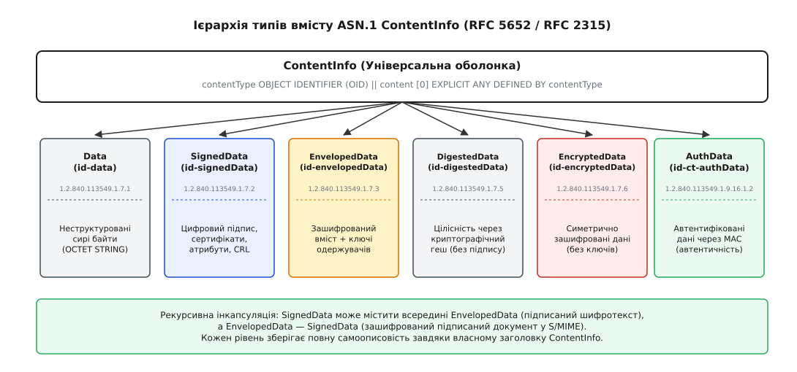
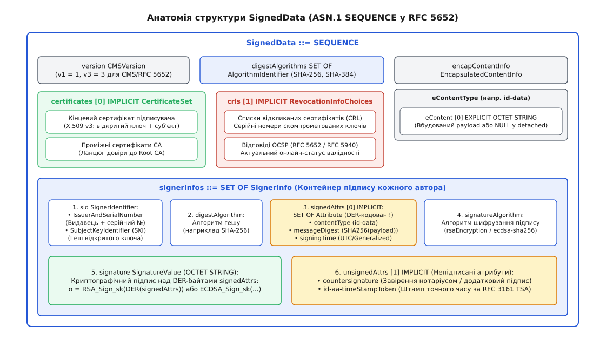
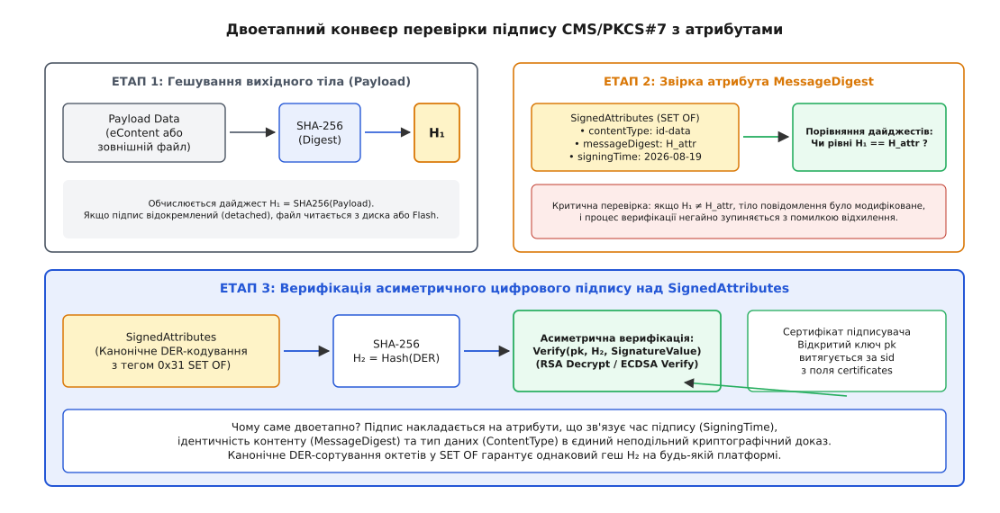
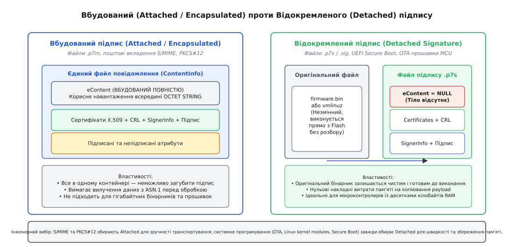
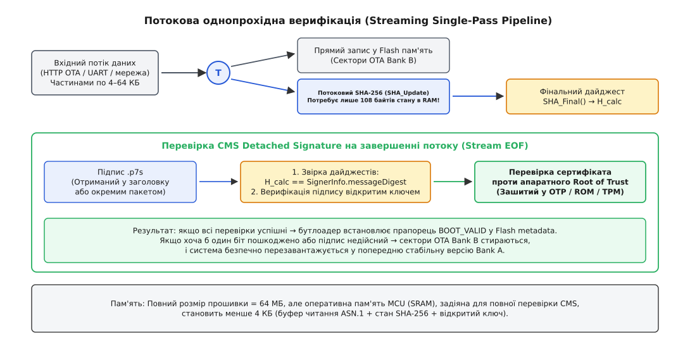

# PKCS#7/CMS: підписане повідомлення як самоописовий контейнер

<preknowlist>
- [Криптографія з відкритим ключем](book:communications/public-key-crypto) — асиметричні пари ключів, цифрові підписи RSA та ECDSA, сертифікати X.509 і довірені центри сертифікації.
- [Кодування ASN.1](book:communications/asn1-per) — абстрактний синтаксис опису даних та канонічні правила двійкового кодування Distinguished Encoding Rules (тег-довжина-значення).
- [HMAC і коди автентичності повідомлень](book:communications/hmac) — симетричні механізми перевірки цілісності та автентифікації повідомлень.
- [TLS](book:communications/tls) — безпечне транспортування даних через захищені сесії з асиметричною аутентифікацією.
</preknowlist>

Бездротовий маршрутизатор або промисловий контролер отримує мережею бінарний файл оновлення прошивки розміром 64 мегабайти. Разом із файлом надходить 64-байтовий масив сирих даних — криптографічний підпис на еліптичній кривій ECDSA. Завантажувач мікроконтролера повинен перевірити справжність цього оновлення перед тим, як записати його в енергонезалежну Flash-пам'ять і передати йому керування процесором.

Якщо протокол передає лише «сире тіло + 64 байти підпису», система стикається з повною криптографічною невизначеністю:

1. **Який алгоритм гешування застосовано?** SHA-256, SHA-384 чи застарілий SHA-1? Якщо алгоритм жорстко зашити в завантажувач, перехід на новий стандарт вимагатиме заміни заліза або перепрошивки фабричного ROM.
2. **Чий це відкритий ключ?** Хто саме підписав реліз: головний розробник, автоматизований сервер збирання чи скомпрометований тестовий стенд?
3. **Де взяти ланцюг сертифікатів?** Контролер знає лише фабричний кореневий сертифікат виробника (Root CA), але не знає проміжного сертифіката реліз-інженера, який створив цей конкретний бінарник.
4. **Коли було створено підпис?** Чи був сертифікат розробника дійсним на момент підписання прошивки, якщо на момент оновлення через три роки його термін дії вже минув?
5. **Чи не підмінено тип даних?** Як довести приймачу, що цей підписаний блок є саме виконуваною прошивкою для цієї апаратної ревізії, а не конфігураційним текстовим файлом чи сертифікатом доступу?

Спроба передавати кожен із цих параметрів в окремих полях саморобного бінарного заголовка змушує кожного розробника винаходити власний протокол пакування. Найменша помилка у вирівнюванні байтів, порядку полів чи інтерпретації довжин відкриває діри для атак підробки та зниження стійкості.

Розв'язанням цієї фундаментальної проблеми став стандарт **PKCS#7** (Public-Key Cryptography Standards #7, RFC 2315) та його сучасне загальноприйняте розширення **CMS (Cryptographic Message Syntax, RFC 5652)**. Це двійковий формат самоописового криптографічного контейнера, який об'єднує корисне навантаження, множину цифрових підписів, повний ланцюг сертифікатів X.509, списки відкликання (CRL) та довірені метадані в єдину стандартизовану структуру.

---

### Концепція самоописового контейнера: ієрархія ASN.1 ContentInfo

В основі архітектури CMS лежить принцип повної незалежності від транспортного середовища: криптографічне повідомлення повинно успішно перевірятися незалежно від того, як його передали — електронною поштою через протокол S/MIME, завантажили через протокол HTTP, записали на USB-накопичувач чи вбудували в кінець виконуваного файлу Windows Portable Executable (PE Authenticode).

Щоб досягти такої універсальності, CMS використовує мову опису даних **ASN.1** (Abstract Syntax Notation One) та двійкові канонічні правила кодування **DER** (Distinguished Encoding Rules). Кожен фрагмент повідомлення пакується за схемою **TLV (Type — Length — Value)**, де перший байт задає тип структури, наступні байти — точну довжину даних, а далі йде саме значення.

Вершиною ієрархії є універсальна оболонка **`ContentInfo`**, яка огортає будь-яке повідомлення:

```asn1
ContentInfo ::= SEQUENCE {
    contentType    ContentType,
    content        [0] EXPLICIT ANY DEFINED BY contentType
}

ContentType ::= OBJECT IDENTIFIER
```

Поле `contentType` містить числовий **ідентифікатор об'єкта (OID, Object Identifier)** — глобально унікальну послідовність чисел, зареєстровану в міжнародному реєстрі ITU-T/ISO. Отримавши контейнер, десеріалізатор одразу зчитує OID і розуміє, який саме криптографічний механізм знаходиться всередині.


*Ієрархія типів ASN.1 ContentInfo: універсальний контейнер та шість спеціалізованих криптографічних структур.*

Стандарт RFC 5652 визначає шість базових типів криптографічного контенту:

1. **`Data` (OID `1.2.840.113549.1.7.1` / `id-data`):** Неструктурований масив сирих байтів (`OCTET STRING`). Використовується для пакування чистого відкритого тексту, виконуваного коду або бінарних образів.
2. **`SignedData` (OID `1.2.840.113549.1.7.2` / `id-signedData`):** Головна робоча структура стандарту: містить корисне навантаження, цифрові підписи одного або кількох авторів, сертифікати X.509 та списки відкликання.
3. **`EnvelopedData` (OID `1.2.840.113549.1.7.3` / `id-envelopedData`):** Зашифроване повідомлення. Вміст шифрується симетричним сесійним ключем (наприклад, AES-256-GCM), а сам сесійний ключ шифрується відкритими ключами кожного з одержувачів повідомлення окремо.
4. **`DigestedData` (OID `1.2.840.113549.1.7.5` / `id-digestedData`):** Повідомлення, захищене лише криптографічним дайджестом (гешем) без цифрового підпису. Дозволяє перевірити цілісність даних від випадкових спотворень у каналі зв'язку.
5. **`EncryptedData` (OID `1.2.840.113549.1.7.6` / `id-encryptedData`):** Дані, зашифровані спільним симетричним ключем без збереження інформації про одержувачів (ключ передбачається заздалегідь відомим сторонам).
6. **`AuthenticatedData` (OID `1.2.840.113549.1.9.16.1.2` / `id-ct-authData`):** Повідомлення, цілісність та автентичність якого захищено кодом автентичності (MAC), де ключ автентифікації передається асиметрично для групи одержувачів.

Головна перевага цієї моделі — **рекурсивна вкладеність**. Одне повідомлення `ContentInfo` може містити всередині інше. Наприклад, у захищеній електронній пошті S/MIME автор спочатку формує контейнер `SignedData` для підтвердження свого авторства, а потім загортає його в контейнер `EnvelopedData` для шифрування на адреси одержувачів. Одержувач спочатку знімає зовнішню оболонку дешифрування, а потім перевіряє внутрішній підпис автора.

Повний синтаксис граматики ASN.1, реєстр усіх числових OID та побайтові правила двійкового кодування наведено в окремому довіднику: [специфікація ASN.1 та DER-структур PKCS#7 і CMS](book:communications/pkcs7-signed-message/api-cms-asn1.md).

---

### Анатомія структури SignedData: з чого складається підписаний пакет

Коли зовнішній заголовок `ContentInfo` вказує на тип `id-signedData`, поле `content` розгортається в головну послідовність стандарту — `SignedData`:

```asn1
SignedData ::= SEQUENCE {
    version          CMSVersion,
    digestAlgorithms DigestAlgorithmIdentifiers,
    encapContentInfo EncapsulatedContentInfo,
    certificates     [0] IMPLICIT CertificateSet OPTIONAL,
    crls             [1] IMPLICIT RevocationInfoChoices OPTIONAL,
    signerInfos      SignerInfos
}
```


*Внутрішня будова SignedData: зв'язок між версією, алгоритмами дайджесту, корисним навантаженням, сертифікатами X.509, списками CRL та блоками SignerInfo.*

Розгляньмо роль і механізм роботи кожного з шести елементів цієї структури:

#### 1. Синтаксична версія (`version`)
Поле типу `INTEGER`, яке повідомляє парсеру версію стандарту:
- `v1` (значення 1) — відповідає базовому стандарту PKCS#7 v1.5 (RFC 2315). Використовується, коли підписувач ідентифікується парою «видавець + серійний номер сертифіката».
- `v3` (значення 3) — відповідає сучасному стандарту CMS (RFC 5652). Вмикається автоматично, якщо підписувач ідентифікується за гешем відкритого ключа або використовуються розширені типи контенту.

#### 2. Набір алгоритмів дайджесту (`digestAlgorithms`)
Множина `SET OF AlgorithmIdentifier`, у якій перелічено всі алгоритми гешування (наприклад, SHA-256, SHA-384, SHA-512), застосовані авторами підписів у цьому повідомленні.

> 🔧 **Навіщо це.** Наявність цього поля на самому початку структури дозволяє верифікаторам у режимі потокового читання за один прохід ініціалізувати необхідні обчислювальні конвеєри гешів до того, як із потоку надійдуть перші байти корисного навантаження.

#### 3. Інкапсульований контент (`encapContentInfo`)
Послідовність `EncapsulatedContentInfo`, що описує підписані дані:

```asn1
EncapsulatedContentInfo ::= SEQUENCE {
    eContentType ContentType,
    eContent     [0] EXPLICIT OCTET STRING OPTIONAL
}
```

Поле `eContentType` вказує OID формату даних (найчастіше `id-data`). Поле `eContent` містить сирі байти самого корисного навантаження. Це поле є **опціональним**: якщо байти присутні, підпис є **вбудованим (attached)**; якщо поле пропущене (`NULL`), підпис є **відокремленим (detached)**.

#### 4. Множина сертифікатів (`certificates`)
Опціональний набір сертифікатів [X.509 v3](book:communications/public-key-crypto), упакований як `SET OF Certificate`. Контейнер містить не лише персональний сертифікат автора підпису, але й усі проміжні сертифікати видавців (Intermediate CA), необхідні для побудови неперервного ланцюга довіри до кореневого сертифіката (Root CA), що зберігається в довіреній пам'яті операційної системи або контролера.

Завдяки цьому одержувачу не потрібно окремо завантажувати сертифікати з зовнішніх мережевих каталогів чи серверів LDAP: повідомлення несе весь ланцюг довіри із собою.

#### 5. Інформація про відкликання (`crls`)
Опціональний набір списків відкликаних сертифікатів (Certificate Revocation List, CRL) або підписаних відповідей протоколу онлайн-статусу OCSP. Якщо пристрій працює в автономному контурі без доступу до інтернету (наприклад, бортовий комп'ютер літака чи контролер підстанції), він може перевірити за списком `crls`, чи не був скомпрометований ключ підписувача на дату формування релізу.

#### 6. Блоки підписів (`signerInfos`)
Множина `SET OF SignerInfo`. Стандарт CMS підтримує множинний підпис (Parallel Signatures): один документ можуть одночасно підписати кілька незалежних суб'єктів. Кожен блок `SignerInfo` містить власний автономний набір криптографічних доказів.

---

### Внутрішня будова SignerInfo та двоетапний підпис

Блок `SignerInfo` є ядром криптографічного доказу авторства. Його ASN.1 структура виглядає так:

```asn1
SignerInfo ::= SEQUENCE {
    version            CMSVersion,
    sid                SignerIdentifier,
    digestAlgorithm    DigestAlgorithmIdentifier,
    signedAttrs        [0] IMPLICIT SignedAttributes OPTIONAL,
    signatureAlgorithm SignatureAlgorithmIdentifier,
    signature          SignatureValue,
    unsignedAttrs      [1] IMPLICIT UnsignedAttributes OPTIONAL
}
```

#### Ідентифікація підписувача (`sid`)
Щоб перевірити підпис, верифікатор повинен знайти правильний відкритий ключ серед десятків сертифікатів, доданих у поле `certificates`. Для цього поле `sid` (SignerIdentifier) пропонує два взаємовиключні варіанти:

1. **`IssuerAndSerialNumber` (Класичний PKCS#7):**
   ```asn1
   IssuerAndSerialNumber ::= SEQUENCE {
       issuer       Name,
       serialNumber CertificateSerialNumber
   }
   ```
   Вказує унікальну комбінацію: ім'я центру сертифікації, який видав сертифікат, та його порядковий номер. Це найнадійніший спосіб для класичних систем, але він ламається, якщо сертифікат користувача планово перевипускається з тією самою парою ключів.
2. **`SubjectKeyIdentifier` (CMS / RFC 5652):**
   ```asn1
   SubjectKeyIdentifier ::= OCTET STRING
   ```
   Містить 160-бітний геш (SHA-1) або 256-бітний геш (SHA-256) відкритого ключа підписувача. Це дозволяє однозначно знайти відповідний відкритий ключ незалежно від того, який саме сертифікат було використано для його завірення.

---

### Чому підпис обчислюється не від даних, а від підписаних атрибутів

Найважливіша інженерна особливість синтаксису CMS полягає в механізмі роботи з полем **`signedAttrs` (Signed Attributes)**.

У примітивних криптографічних схемах підпис обчислюється напряму: `σ = Sign(sk, SHA256(Payload))`. Проте в такій наївній схемі неможливо захистити службові метадані. Якщо автор хоче заявити: «цей підпис створено 19 серпня 2026 року о 14:00, і це виконуваний файл прошивки», додавання цих відомостей у незахищені поля дозволило б зловмиснику посередині каналу підмінити дату або змінити прапорці конфігурації без пошкодження підпису самого бінарника.

Щоб унеможливити подібні маніпуляції, CMS впроваджує **двоетапний конвеєр перевірки з криптографічним зв'язуванням**:


*Двоетапний конвеєр: гешування даних зв'язується з підписаними атрибутами, після чого перевіряється асиметричний цифровий підпис.*

#### Етап 1: Криптографічне гешування даних
Верифікатор зчитує корисне навантаження `eContent` (або зовнішній файл) і обчислює його контрольний дайджест:

```
H₁ = SHA256(Payload)
```

#### Етап 2: Звірка обов'язкових підписаних атрибутів
Підписувач формує множину `signedAttrs` (SET OF Attribute), до якої обов'язково включає щонайменше два стандартні атрибути:

1. **`id-contentType` (`1.2.840.113549.1.9.3`):** фіксує тип вкладених даних (наприклад, `id-data`). Запобігає атакам міжпротокольної підміни (Cross-Protocol Attacks).
2. **`id-messageDigest` (`1.2.840.113549.1.9.4`):** містить точне значення дайджесту `H₁`, обчисленого на Етапі 1.
3. **`id-signingTime` (`1.2.840.113549.1.9.5`):** фіксує точний час створення підпису за шкалою UTC.
4. **`id-aa-cmsAlgorithmProtection` (`1.2.840.113549.1.9.52`, RFC 6211):** фіксує точні ідентифікатори алгоритмів гешування та підпису, захищаючи систему від підміни стійкого SHA-256 на вразливий SHA-1.

Верифікатор перевіряє, що значення атрибута `id-messageDigest` байт-у-байт дорівнює обчисленому значенню `H₁`. Якщо хоча б один біт у вихідних даних змінено, геші не зійдуться, і верифікатор негайно відхилить повідомлення.

#### Етап 3: Асиметрична перевірка підпису над атрибутами
Сам цифровий підпис `signature` обчислюється **виключно над бінарним масивом атрибутів `signedAttrs`**:

```
1. Серіалізувати множину signedAttrs у форматі DER (з обов'язковою заміною контекстного тегу 0xA0 на тег 0x31 SET OF).
2. Обчислити геш від серіалізованих атрибутів: H₂ = SHA256(DER(signedAttrs)).
3. Перевірити асиметричний підпис відкритим ключем автора: Verify(pk, H₂, signature).
```

Ця триланкова конструкція гарантує абсолютну криптографічну стійкість:
- Якщо зловмисник змінить бінарні дані `Payload`, зміниться `H₁`, що порушить рівність з атрибутом `id-messageDigest`.
- Якщо зловмисник спробує оновити значення `id-messageDigest` або змінити дату `signingTime` у списку атрибутів, зміниться `H₂`, що зруйнує фінальний цифровий підпис `signature`.

#### Критична роль канонічного DER-сортування
Оскільки множина атрибутів оголошена в ASN.1 як `SET OF Attribute`, елементи множини математично не мають фіксованого порядку. Проте для обчислення криптографічного гешу `H₂` вхідний потік байтів зобов'язаний бути строго детермінованим.

Канонічні правила DER (X.690) вимагають, щоб усі елементи `SET OF` були **відсортовані за зростанням їхніх закодованих октетів** (лексикографічне побайтове порівняння). Якщо програма під час генерації підпису впорядкує атрибути в іншому порядку, ніж верифікатор, геш `H₂` виявиться іншим, і валідний підпис буде помилково відхилено.

---

### Схеми доповнення RSA: від PKCS#1 v1.5 до RSASSA-PSS

Коли цифровий підпис CMS формується алгоритмом RSA, значення гешу `H₂` не може бути піднесене до степеня без попереднього форматування. Довжина гешу SHA-256 становить 32 байти, тоді як модуль ключа RSA-3072 має довжину 384 байти.

Історично у PKCS#7 застосовувалася схема **PKCS#1 v1.5 (RFC 2313)**:

```
EM = 0x00 || 0x01 || 0xFF || 0xFF ... 0xFF || 0x00 || DigestInfo(SHA256, H₂)
```

У 2006 році Даніель Блейхенбахер довів, що неякісні реалізації перевірки PKCS#1 v1.5 містять критичну вразливість: якщо парсер не перевіряє точну кількість байтів `0xFF` до кінця блоку, зловмисник може згенерувати підроблений підпис для відкритої експоненти `e=3` без знання приватного ключа.

Щоб усунути цю вразливість, сучасний стандарт CMS (RFC 4056) вимагає переходу на ймовірнісну схему підпису **RSASSA-PSS (Probabilistic Signature Scheme, RFC 8017)**. PSS додає до кожного підпису випадкову псевдовипадкову сіль (Salt) фіксованої довжини та маскує блок через функцію генерації маски MGF1 на основі SHA-256. Це перетворює RSA-підпис на строго доведений математичний примітив, стійкий до будь-яких маніпуляцій з доповненням.

---

### Непідписані атрибути: контрпідписи та штампи часу

Структура `SignerInfo` містить ще одне опціональне поле — `unsignedAttrs` (Unsigned Attributes). На відміну від підписаних атрибутів, ці поля додаються **після** створення підпису і не захищені полем `signature`. Вони служать для розміщення вторинних сервісних доказів:

```
[SignerInfo]
    ├── signedAttrs (захищено первинним підписом σ₁)
    │       └── messageDigest = SHA256(Payload)
    ├── signature = σ₁
    └── unsignedAttrs (не захищено σ₁)
            ├── id-countersignature: SignerInfo₂ (підпис σ₂ над дайджестом σ₁)
            └── id-aa-timeStampToken: CMS SignedData від TSA (штамп часу над σ₁)
```

1. **Контрпідпис (`id-countersignature`, OID `1.2.840.113549.1.9.6`):**
   Механізм візування («підпис під підписом»). Значенням атрибута є ще один повноцінний блок `SignerInfo`, який обчислює підпис від байтів первинного підпису `signature`. Це дозволяє нотаріусу, аудитору чи шлюзу контролю завірити чужий підпис, не змінюючи оригінального документа.
2. **Криптографічний штамп часу TSA (`id-aa-timeStampToken`, RFC 3161):**
   Розв'язує проблему «життя після закінчення сертифіката». Будь-який сертифікат X.509 має обмежений термін дії (наприклад, 1–3 роки). Якщо програма була підписана у 2024 році, а користувач запускає її у 2027 році, сертифікат автора вже протермінований.

   Щоб вирішити цю проблему, клієнт під час підписання надсилає геш підпису `SHA256(signature)` на незалежний сервер штампів часу (Time Stamping Authority, TSA). Сервер TSA додає свої високоточні атомні годинники та повертає квитанцію у вигляді структури CMS `SignedData`. Верифікатор перевіряє штамп TSA і переконується: на момент накладання підпису сертифікат автора був цілком дійсним, а отже, програмі можна довіряти навіть після завершення терміну дії сертифіката.

---

### Вбудований (Attached) проти відокремленого (Detached) підпису

Стандарт CMS підтримує два кардинально різні способи транспортування даних та підпису:


*Порівняння підходів: вбудоване корисне навантаження в S/MIME проти відокремленого підпису в OTA-прошивках і Secure Boot.*

#### 1. Вбудований підпис (Attached / Encapsulated)
Корисне навантаження розміщується безпосередньо всередині структури `SignedData` в полі `encapContentInfo.eContent`.

- **Формат файлів:** розширення `.p7m` або MIME-тип `application/pkcs7-mime`.
- **Переваги:** Повна автономність. Повідомлення зберігається в одному неподільному файлі, який неможливо випадково розірвати чи втратити частину даних.
- **Недоліки:** Дані запаковані всередину двійкової оболонки ASN.1 DER. Щоб прочитати або виконати бінарний код, програма зобов'язана спочатку повністю розібрати структуру ASN.1 та вилучити корисне навантаження в окремий буфер пам'яті. Для файлу розміром 2 ГБ це вимагає подвійного обсягу диска або оперативної пам'яті.
- **Типове застосування:** Захищена електронна пошта S/MIME, зашифровані сховища сертифікатів PKCS#12 (`.p12` / `.pfx`), квитанції фіскальних чеків та податкових накладних.

#### 2. Відокремлений підпис (Detached Signature)
Корисне навантаження передається або зберігається як самостійний звичайний файл, а поле `encapContentInfo.eContent` залишається порожнім (`NULL`). Контейнер CMS містить лише сертифікати, метадані та блоки `SignerInfo`.

- **Формат файлів:** розширення `.p7s`, `.sig` або MIME-тип `application/pkcs7-signature`.
- **Переваги:** Вихідний бінарний файл залишається абсолютно чистим і незмінним. Завантажувач системи може виконувати код методом відображення пам'яті (memory-mapping через `mmap`) безпосередньо з Flash-пам'яті чи накопичувача без проміжного копіювання чи розбору ASN.1.
- **Недоліки:** Необхідність супроводу двох зв'язаних файлів (`firmware.bin` та `firmware.bin.p7s`) або чіткого узгодження місця розміщення заголовка підпису.
- **Типове застосування:** Оновлення прошивок мікроконтролерів (OTA Updates), захищене завантаження UEFI Secure Boot, підпис модулів ядра Linux (`CONFIG_MODULE_SIG`), підпис інсталяційних пакунків APT/RPM та підпис бінарних файлів Microsoft Authenticode.

У поштових протоколах відокремлений підпис реалізується через багаточастинний MIME-тип `multipart/signed` (RFC 1847):
```http
Content-Type: multipart/signed; protocol="application/pkcs7-signature"; micalg=sha-256; boundary="----boundary"

------boundary
Content-Type: text/plain; charset=utf-8

Тіло електронного листа...
------boundary
Content-Type: application/pkcs7-signature; name="smime.p7s"
Content-Transfer-Encoding: base64

MIAGCSqGSIb3DQEHAqCAMIACAQExDzANBglghkgBZQMEAgEFADCABgkqhkiG9w0BBwEAAKCC...
------boundary--
```
Якщо поштовий клієнт одержувача не підтримує S/MIME, він все одно може прочитати відкритий текст першої частини, ігноруючи бінарний файл `smime.p7s`.

---

### Порівняльний аналіз вбудованого та відокремленого підходів

| Критерій оцінки | Вбудований підпис (Attached) | Відокремлений підпис (Detached) |
| :--- | :--- | :--- |
| **Структура `eContent`** | Містить повний масив байтів payload | Відсутній (`NULL` в ASN.1) |
| **Цілісність контейнера** | Єдиний неподільний файл `.p7m` | Два окремі файли (`.bin` + `.p7s`) |
| **Витрати оперативної пам'яті** | Високі (потребує буферизації payload) | Мінімальні (потоковий розрахунок гешу) |
| **Пряме виконання коду (`XIP`)** | Неможливе без попереднього вилучення | Можливе безпосередньо з Flash/ROM |
| **Модифікація вихідного файлу** | Файл перетворюється на структуру ASN.1 | Вихідний файл залишається байт-у-байт чистим |
| **Головні протоколи** | S/MIME, PKCS#12, AS2 EDI, DocuSign | UEFI Secure Boot, OTA MCU, Linux modsign |

---

### Потокова верифікація та вилучення даних: конвеєри без буферизації

Класичні бібліотеки парсингу ASN.1 часто працюють за моделлю «завантажити весь DER-файл у пам'ять, побудувати повне дерево об'єктів у RAM, перевірити підпис». Якщо операційна система оновлює образ диска розміром 4 ГБ на сервері з обмеженою пам'яттю або мікроконтролер STM32/ESP32 із 128 КБ оперативної пам'яті приймає по Wi-Fi нову прошивку, такий підхід призводить до аварійного вичерпання пам'яті (Out of Memory Panic).

Для вирішення цієї проблеми розроблено архітектуру **однопрохідної потокової верифікації (Single-Pass Streaming Verification)**.


*Однопрохідний конвеєр обробки потоку: одночасний запис у Flash-пам'ять та розрахунок SHA-256 з перевіркою CMS на завершенні.*

#### Механізм роботи потокового конвеєра

1. **Ініціалізація заголовка:** Приймач зчитує перші кілька кілобайтів повідомлення (структуру `SignedData` до поля даних), отримує список алгоритмів `digestAlgorithms` та ініціалізує контекст потокового гешування (наприклад, стан `SHA256_CTX`, що займає в пам'яті мікроконтролера лише 108 байтів).
2. **Прокачування блоків крізь фільтр:** Дані надходять із мережевого сокета невеликими порціями (наприклад, чанками по 4–64 КБ). Кожен блок одночасно подається на дві паралельні лінії:
   - Лінія запису: блок записується у цільовий банк флеш-пам'яті (OTA Bank B).
   - Лінія криптографії: функція `SHA256_Update(&ctx, chunk, len)` накопичує контрольний стан гешу.
3. **Фіналізація на межі потоку:** Коли всі байти файлу передано, викликається `SHA256_Final(digest, &ctx)`. Отриманий дайджест порівнюється з полем `id-messageDigest` структури `SignerInfo`.
4. **Асиметрична перевірка та фіксація статусу:** Верифікатор перевіряє цифровий підпис `SignatureValue` відкритим ключем із ланцюга сертифікатів. Якщо підпис зійшовся, завантажувач виставляє в метаданих Flash прапорець `IMAGE_VALID=1` і готується до перезавантаження. Якщо підпис недійсний, сектори нового банку пам'яті негайно затираються нулями, запобігаючи виконанню пошкодженого чи шкідливого коду.

Детальний практичний код на мовах C та C++ з використанням потокових бінарних фільтрів OpenSSL `BIO` представлено у супровідному проєкті: [практична реалізація підпису та потокової верифікації CMS на C та C++](book:communications/pkcs7-signed-message/proj-pkcs7-sign-verify.md).

---

### CMS у ядрі Linux та специфікації UEFI Secure Boot

Стандарт CMS/PKCS#7 став де-факто фундаментом захисту системного рівня в сучасних операційних системах та апаратних платформах:

#### 1. Механізм підпису модулів ядра Linux (`kernel/module/signing.c`)
Ядро Linux надає механізм суворої перевірки автентичності динамічних драйверів `.ko` (`CONFIG_MODULE_SIG_FORCE=y`). Під час складання модуля в його кінець дописується сирий бінарний контейнер PKCS#7 `SignedData`, за яким слідує 40-байтова службова структура `struct module_signature`:

```
┌───────────────────────────────────────────────────────────┬──────────────────────┬─────────────────────────┐
│                 Тіло ELF-модуля (.ko)                     │ PKCS#7 SignedData    │ struct module_signature │
│                 (Виконуваний код драйвера)                │ (Сертифікати+Підпис) │ (40 байтів, magic-хвіст)│
└───────────────────────────────────────────────────────────┴──────────────────────┴─────────────────────────┘
```

Коли адміністратор викликає системний виклик `init_module()` або `finit_module()`, ядро виконує такі кроки:
1. Перевіряє останні 28 байтів файлу на наявність магічного маркерного рядка `~Module signature~\n`.
2. Зчитує з 40-байтового трейлера довжину підпису `sig_len` та зміщує вказівник у пам'яті на початок структури PKCS#7.
3. Викликає внутрішній парсер ASN.1 ядра (`crypto/asymmetric_keys/pkcs7_parser.c`), який розбирає `SignedData` без залучення зовнішніх бібліотек простору користувача.
4. Обчислює SHA-256 дайджест ELF-тіла драйвера та звіряє його з атрибутом `id-messageDigest`.
5. Перевіряє цифровий підпис RSA/ECDSA проти вбудованого системного брелока ключів ядра (`.builtin_trusted_keys` або вторинного `.secondary_trusted_keys`). Якщо підпис недійсний, ядро блокує завантаження драйвера з кодом помилки `-EKEYREJECTED`.

#### 2. Захищене завантаження UEFI Secure Boot
Специфікація UEFI (Unified Extensible Firmware Interface) версії 2.10 використовує CMS для верифікації всіх виконуваних файлів завантажувачів (`bootx64.efi`, `grubx64.efi`) та драйверів Option ROM.

Прошивка материнської плати містить чотири бази криптографічних ключів, збережених у захищеній енергонезалежній пам'яті NVRAM:
- **`PK` (Platform Key):** відкритий ключ виробника комп'ютера або материнської плати.
- **`KEK` (Key Exchange Key):** ключі авторизованих постачальників операційних систем (наприклад, Microsoft KEK CA).
- **`db` (Authorized Signature Database):** база відкритих сертифікатів X.509 та SHA-256 відбитків довіреного програмного забезпечення.
- **`dbx` (Forbidden Signature Database):** чорний список скомпрометованих сертифікатів та відбитків вразливих завантажувачів.

Перед передачею керування образу завантажувача прошивка UEFI зчитує структуру `SignedData` із секції безпеки виконуваного файлу PE (`IMAGE_DIRECTORY_ENTRY_SECURITY`), обчислює контрольний хеш за правилами Authenticode та перевіряє ланцюг сертифікатів проти бази `db`. Якщо сертифікат або геш знайдено в базі `dbx`, завантаження комп'ютера негайно блокується, унеможливлюючи запуск буткітів (Bootkits) на рівні прошивки.

---

### Порівняння CMS з альтернативними форматами підпису

| Характеристика | CMS / PKCS#7 (RFC 5652) | JSON Web Signature (JWS, RFC 7515) | COSE (CBOR Signing, RFC 9052) |
| :--- | :--- | :--- | :--- |
| **Формат серіалізації** | Двійковий ASN.1 DER | Текстовий JSON + Base64URL | Двійковий CBOR (RFC 8949) |
| **Транспортування сертифікатів** | Повний ланцюг X.509 + CRL у тілі | Масив `x5c` у JSON заголовку | Масив сертифікатів у CBOR мапі |
| **Відокремлений підпис** | Нативна підтримка (`eContent=NULL`) | B64-детач (порожній payload) | Нативна підтримка (detached payload) |
| **Штампи часу TSA** | Вбудовані непідписані атрибути | Відсутній стандартний механізм | Непідписані CBOR атрибути |
| **Цільова сфера** | Прошивки, ОС, S/MIME, драйвери | Веб-сервіси, REST API, токени JWT | Обмежені пристрої IoT, CoAP |

---

### Апаратний корінь довіри та захист від атак на вбудованих пристроях

Під час реалізації перевірки підписів PKCS#7/CMS в автоматизованих мережах та критичній інфраструктурі необхідно враховувати специфічні загрози:

```
                            Ланцюг апаратної довіри
                                       │
     ┌─────────────────────────────────┴─────────────────────────────────┐
     ▼                                                                   ▼
1. Апаратний захист (Root of Trust)               2. Захист парсера ASN.1
   • Відкритий ключ Root CA у OTP eFuses             • Ліміт глибини вкладеності (max depth ≤ 16)
   • Відсікання ненадійних ключів                    • Захист від цілочисельних переповнень у TLV
   • Ізоляція ключів у Secure Enclave/TPM            • Суворе відхилення Indefinite Length у DER
```

1. **Апаратний якір довіри (Root of Trust):** Сертифікати, передані всередині самого контейнера CMS, не мають жодної цінності самі по собі, доки вони не будуть перевірені за математичним ланцюгом підписів до кореневого сертифіката. У мікроконтролерах відкритий ключ кореневого центру виробника або його SHA-256 відбиток обов'язково записується в одноразово програмовані апаратні перемички **OTP eFuses** або захищену пам'ять модуля TPM/Secure Element. Зловмисник не може підробити підпис, навіть якщо згенерує власний кореневий сертифікат, оскільки його відкритий ключ не зійдеться з апаратним відбитком у кремнії мікросхеми.
2. **Атаки відмови в обслуговуванні через рекурсивний ASN.1 (ASN.1 Recursion Bombs):** Оскільки структури ASN.1 підтримують довільну вкладеність, зловмисник може надіслати повідомлення з 10 000 вкладених послідовностей `SEQUENCE`, що призведе до переповнення стека (Stack Overflow) парсера. Захищені вбудовані бібліотеки завжди обмежують максимальну глибину вкладеності (наприклад, не більше 16 рівнів).
3. **Атаки підміни довжини (Integer Overflows у TLV):** Неякісні реалізації парсерів можуть містити вразливості переповнення під час розрахунку зміщення полів `Length` у двійковому потоці. Канонічний DER-парсер зобов'язаний суворо перевіряти межі буфера на кожному зчитаному тезі.

Хронологію створення формату, суперечки навколо перших стандартів безпеки пошти та шлях від приватних специфікацій лабораторії RSA Security до сучасного інтернет-стандарту описано у матеріалі [історичний шлях еволюції стандартів від PEM і PKCS#7 до сучасного CMS](book:communications/pkcs7-signed-message/hist-cms-evolution.md).

---

### Інженерний висновок

Формат PKCS#7 / CMS витримав випробування понад трьома десятиліттями експлуатації і сьогодні залишається світовим промисловим стандартом упаковки цифрових підписів.

Його сила полягає у самоописовості: об'єднуючи корисне навантаження, множинні підписи, підписані атрибути, повні ланцюги сертифікатів X.509 та штампи часу в єдине двійкове дерево ASN.1 DER, CMS перетворює будь-яке повідомлення на автономний криптографічний документ. Підтримка відокремленого підпису та однопрохідної потокової обробки робить його ідеальним інструментом як для гігабайтних мережевих образів у хмарній інфраструктурі, так і для компактних мікроконтролерів інтернету речей.
