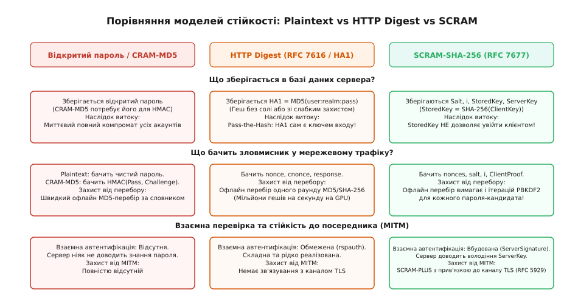
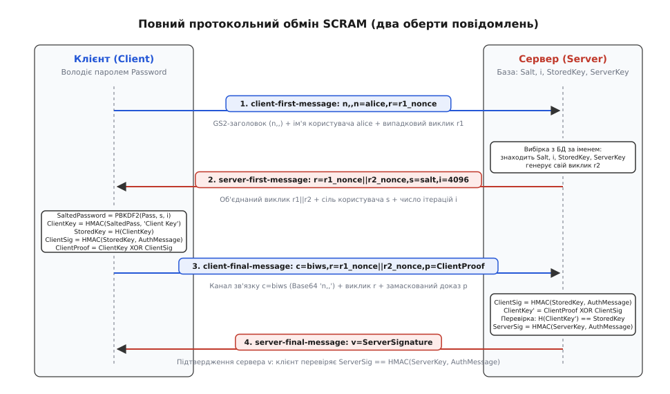
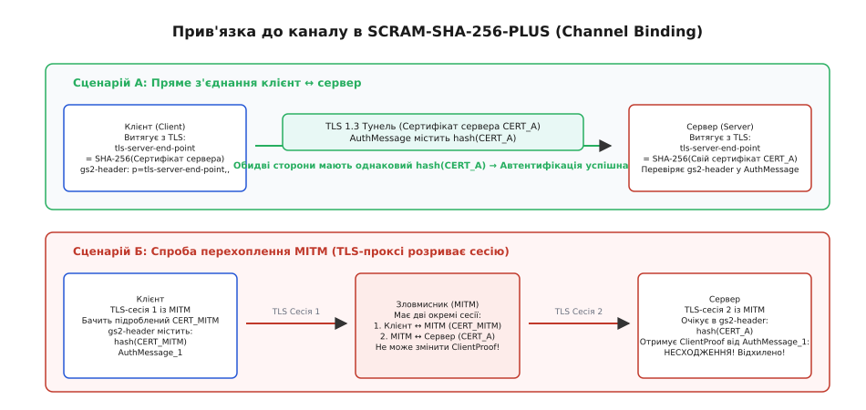

# SCRAM: солений виклик-відповідь замість дайджесту

<preknowlist>
- [Автентифікація «виклик-відповідь»](topic:communications/challenge-response) — принцип доведення володіння секретом через криптографічний виклик без передавання відкритого значення.
- [Дайджест-автентифікація](topic:communications/digest-authentication) — схема виклику-відповіді над одноразовим числом nonce та гешем HA1.
- [Код автентифікації повідомлень HMAC](topic:communications/hmac) — симетричний механізм підтвердження цілісності та авторства повідомлень на основі геш-функції.
- [Протокол захисту транспортного рівня TLS](topic:communications/tls) — створення захищеного тунелю та прив'язка сесії до сертифіката вузла.
- [Гешування паролів для збереження](topic:programming/password-hashing) — функції повільного виведення ключів PBKDF2 для захисту від масового перебору.
</preknowlist>

Коли сервер зберігає паролі користувачів у відкритому вигляді або у формі простих гешів, будь-який витік бази даних призводить до миттєвої компрометації всіх облікових записів. Проте класичні протоколи виклику-відповіді — такі як CRAM-MD5 чи HTTP Digest Authentication — страждають від дзеркальної проблеми: щоб перевірити математичну відповідь клієнта на випадковий виклик, сервер змушений або тримати відкритий пароль у своїй базі, або зберігати його незворотний геш, знання якого в цих протоколах еквівалентне володінню самим паролем (атака Pass-the-Hash).

Механізм автентифікації SCRAM (Salted Challenge Response Authentication Mechanism, стандартизований у RFC 5802 та RFC 7677) докорінно розв'язує цю дилему. Він розділяє функцію підтвердження пароля та функцію його збереження: сервер перевіряє доказ клієнта, не володіючи ані відкритим паролем, ані ключами, достатніми для імітації користувача перед іншими вузлами. При цьому протокол забезпечує двосторонню автентифікацію, захист від атак віддзеркалення та можливість апаратної прив'язки до захищеного TLS-тунелю.

Детальний аналіз еволюційного шляху від застарілих протоколів виклику-відповіді до появи сучасного стандарту SASL наведено в історичній довідці [Еволюція протоколів виклику-відповіді: від CRAM-MD5 до SCRAM](topic:communications/scram-authentication/hist-scram-standard.md).

## 1. Пастка схем «виклик-відповідь» першого покоління

Класична схема виклику-відповіді покликана захистити пароль від перехоплення під час передавання мережею: замість пароля клієнт надсилає геш від конкатенації одноразового виклику (nonce) та пароля. Проте в цій схемі виникає фундаментальна суперечність між мережевою безпекою та безпекою збереження даних.

Розглянемо, як функціонували попередники SCRAM:

1. **CRAM-MD5 (RFC 2195):** Сервер надсилає клієнту рядок виклику `Challenge`. Клієнт обчислює відповідь `Response = HMAC-MD5(Password, Challenge)`. Сервер, щоб перевірити цей підпис, мусить виконати ту саму операцію `HMAC-MD5(Password, Challenge)`. Отже, сервер зобов'язаний зберігати `Password` у відкритому вигляді. Витік таблиці користувачів відкриває паролі зловмиснику без жодних додаткових зусиль.
2. **HTTP Digest (RFC 2617 / RFC 7616):** Спроба покращити CRAM-MD5 шляхом збереження проміжного дайджесту `HA1 = MD5(Username : Realm : Password)`. Під час входу клієнт формує відповідь від виклику сервера `nonce` на основі `HA1`. Проте значення `HA1` стало новим «еквівалентом пароля»: викравши базу даних, зловмисник отримує готові хеші `HA1`, які дозволяють проходити автентифікацію на будь-якому сумісному сервері без підбору відкритого пароля.


*Аналіз моделей загроз: на відміну від відкритого тексту та HTTP Digest, SCRAM захищає автентифікацію як під час перехоплення в мережі, так і в разі повного витоку серверної бази даних.*

У сучасних веб-додатках для безпечного зберігання паролів застосовують повільні односторонні геш-функції (Argon2id, bcrypt, scrypt). Проте при передачі пароля відкритим текстом усередині TLS-тунелю сервер все одно отримує відкритий пароль користувача в оперативній пам'яті під час кожного входу. Якщо скомпрометовано сам серверний процес (наприклад, через вразливість читання пам'яті чи впровадження шкідливого модуля), зловмисник перехоплює паролі користувачів у момент їх введення.

SCRAM розриває це коло за допомогою криптографічної схеми з одностороннім перетворенням клієнтського ключа перед збереженням у базі даних сервера, переносячи операцію розтягування пароля на сторону клієнта.

## 2. Математична архітектура та розділення ключів

Конструкція SCRAM спирається на три базові примітиви: криптографічну геш-функцію `H` (у SCRAM-SHA-256 це SHA-256), алгоритм коду автентифікації повідомлень `HMAC` на базі цієї геш-функції та функцію уповільненого формування ключа на основі пароля `PBKDF2`.


*Криптографічне розгалуження ключів у SCRAM: односторонній бар'єр між збереженим у базі StoredKey та клієнтським ClientKey унеможливлює видавання себе за користувача.*

### Крок 1. Розтягування пароля та соління (PBKDF2)
Клієнт бере введений користувачем пароль `Password`, індивідуальну сіль `Salt` (отриману від сервера) та призначену кількість ітерацій `i` (наприклад, 4096 або 10000) і обчислює солений пароль `SaltedPassword`:

```
SaltedPassword = PBKDF2(HMAC-SHA-256, Password, Salt, i, 32)
```

Функція `PBKDF2` (RFC 2898) виконує послідовне багаторазове обчислення HMAC для генерації псевдовипадкового ключа. Вона ініціалізує перший раунд:

```
U_1 = HMAC-SHA-256(Password, Salt ‖ INT_32_BE(1))
```

Після цього виконуються наступні `i - 1` раундів, де кожен наступний вихід залежить від результату попереднього:

```
U_2 = HMAC-SHA-256(Password, U_1)
U_3 = HMAC-SHA-256(Password, U_2)
...
U_i = HMAC-SHA-256(Password, U_{i-1})
```

Кінцеве 32-байтове значення формується через побітове додавання за модулем 2 усіх отриманих проміжних блоків:

```
SaltedPassword = U_1 ⊕ U_2 ⊕ U_3 ⊕ ... ⊕ U_i
```

Застосування `PBKDF2` захищає систему від масового офлайнового перебору за словниками та атак за допомогою попередньо обчислених таблиць райдуги (Rainbow Tables). Оскільки кожна ітерація суворо залежить від завершення попередньої, обчислення не піддаються ефективному розпаралелюванню на спеціалізованих обчислювачах GPU чи ASIC.

### Крок 2. Розщеплення на ключ клієнта та ключ сервера
Отримане 32-байтове значення `SaltedPassword` слугує криптографічним коренем для виведення двох незалежних симетричних ключів за допомогою HMAC над константними текстовими рядками:

```
ClientKey = HMAC(SaltedPassword, "Client Key")
ServerKey = HMAC(SaltedPassword, "Server Key")
```

Рядки `"Client Key"` та `"Server Key"` діють як контекстні розділювачі: завдяки властивості стійкості HMAC до відновлення ключа (псевдовипадкова функція, PRF) знання `ClientKey` не дає математичної змоги обчислити `ServerKey`, і навпаки.

### Крок 3. Односторонній бар'єр для бази даних (StoredKey)
Для збереження на сервері клієнтський ключ `ClientKey` піддається односторонньому гешуванню:

```
StoredKey = H(ClientKey) = SHA-256(ClientKey)
```

Сервер записує у свою постійну базу даних лише чотири поля:
1. `Salt` — індивідуальну сіль користувача (12–16 випадкових байтів у кодуванні Base64);
2. `IterationCount` — кількість ітерацій розтягування `i` (ціле число, за замовчуванням 4096);
3. `StoredKey` — 32-байтовий геш від `ClientKey` (у Base64);
4. `ServerKey` — 32-байтовий підпис для автентифікації сервера (у Base64).

Сервер **не зберігає** ані відкритий пароль `Password`, ані проміжний `SaltedPassword`, ані клієнтський ключ `ClientKey`. Оскільки геш-функція SHA-256 є стійкою до знаходження першого та другого прообразів (*Pre-image Resistance* та *Second Pre-image Resistance*), нападник, який заволодів базою даних сервера, не може відновити `ClientKey` зі збереженого `StoredKey`.

## 3. Протокольний обмін: два оберти та доведення володіння секретом

Повний цикл автентифікації SCRAM складається з двох послідовних обертів повідомлень (чотирьох кроків між клієнтом і сервером).


*Послідовність обміну повідомленнями SCRAM: взаємний обмін випадковими викликами, накопичення AuthMessage та двостороння верифікація доказів.*

### Повідомлення 1: Запит клієнта (client-first-message)
Клієнт генерує власний псевдовипадковий виклик `client_nonce` (наприклад, 18–24 друковані символи ASCII) та надсилає серверу своє ім'я користувача разом із заголовком GS2:

```
client-first-message: n,,n=user,r=fyko+d2lbbFgONRv9qkxdawL
```

Заголовок `n,,` вказує, що клієнт працює в режимі без прив'язки до каналу TLS і не запитує спеціальних прав авторизації (`authzid`). Перед відправкою ім'я користувача та пароль проходять нормалізацію за алгоритмом SASLprep (RFC 4013).

### Повідомлення 2: Виклик сервера (server-first-message)
Сервер знаходить користувача в базі даних, витягує його `Salt` та `IterationCount`, генерує свій випадковий виклик `server_nonce` і повертає комбінований виклик `nonce = client_nonce ‖ server_nonce`:

```
server-first-message: r=fyko+d2lbbFgONRv9qkxdawL3rfcNHYJY1ZVvWVs7j,s=QSXCR+Q6sek8bf92,i=4096
```

Об'єднання викликів обох сторін гарантує, що жоден з учасників не може самостійно нав'язати вигідне йому значення виклику для проведення атак попереднього обчислення. Клієнт зобов'язаний перевірити, що отримане значення `r=` починається точно з його початкового рядка `client_nonce`.

### Формування сесійного контексту (AuthMessage)
Обидві сторони накопичують повний текстовий протокол свого обміну в єдиний рядок `AuthMessage`:

```
AuthMessage = client-first-message-bare ‖ "," ‖ server-first-message ‖ "," ‖ client-final-message-without-proof
```

Для наведеного вище обміну рядок `AuthMessage` набуває вигляду:

```
AuthMessage = "n=user,r=fyko+d2lbbFgONRv9qkxdawL,r=fyko+d2lbbFgONRv9qkxdawL3rfcNHYJY1ZVvWVs7j,s=QSXCR+Q6sek8bf92,i=4096,c=biws,r=fyko+d2lbbFgONRv9qkxdawL3rfcNHYJY1ZVvWVs7j"
```

Включення всіх викликів, параметрів соління та заголовків прив'язки каналу в `AuthMessage` гарантує цілісність усього сеансу зв'язку: будь-яка спроба активного посередника змінити хоча б один символ у попередніх повідомленнях призведе до фатальної розбіжності підписів.

### Повідомлення 3: Доказ клієнта (client-final-message)
Клієнт повинен довести серверу, що він володіє ключем `ClientKey`, не розкриваючи цей ключ відкритим текстом через мережу.

Для цього клієнт спочатку обчислює підпис сесії `ClientSignature`, використовуючи `StoredKey` як ключ для HMAC:

```
ClientSignature = HMAC(StoredKey, AuthMessage)
```

Зауважимо важливу деталь: клієнт здатний самостійно обчислити `StoredKey`, оскільки він володіє `ClientKey` і може просто застосувати геш-функцію: `StoredKey = H(ClientKey)`.

Далі клієнт маскує `ClientKey`, виконуючи операцію побітового виключного АБО (XOR) між `ClientKey` та `ClientSignature`:

```
ClientProof = ClientKey ⊕ ClientSignature
```

Чому маскування через XOR є криптографічно стійким? Для стороннього спостерігача в мережі, який не знає `StoredKey`, значення `ClientSignature = HMAC(StoredKey, AuthMessage)` є невідрізненним від випадкової бітової послідовності (властивість псевдовипадковості HMAC). Відповідно, операція `ClientKey ⊕ ClientSignature` діє як одноразовий блокнот (*One-Time Pad*), що повністю приховує `ClientKey`.

Отримане значення `ClientProof` кодується в Base64 та надсилається серверу в повідомленні `client-final-message`:

```
client-final-message: c=biws,r=fyko+d2lbbFgONRv9qkxdawL3rfcNHYJY1ZVvWVs7j,p=v0X8v3Bz2T0CJGbJQwF0X+HIoipvf0BlZoOqg2o05VQ=
```

Атрибут `c=biws` містить закодований у Base64 GS2-заголовок `n,,`.

### Серверна верифікація доказу
Сервер, отримавши `ClientProof` та маючи у своїй базі збережений `StoredKey`, виконує таку послідовність дій:

1. Обчислює `ClientSignature = HMAC(StoredKey, AuthMessage)`.
2. Відновлює кандидатський ключ клієнта `ClientKey'`:

```
ClientKey' = ClientProof ⊕ ClientSignature
= (ClientKey ⊕ ClientSignature) ⊕ ClientSignature     [підстановка ClientProof]
= ClientKey ⊕ (ClientSignature ⊕ ClientSignature)     [асоціативність XOR]
= ClientKey ⊕ 0                                       [властивість x ⊕ x = 0]
= ClientKey                                           [властивість x ⊕ 0 = x]
```

3. Обчислює геш від відновленого ключа `H(ClientKey')` і порівнює його з еталонним `StoredKey`, що лежить у базі даних:

```
H(ClientKey') == StoredKey
```

Якщо геші збігаються, сервер переконується, що клієнт дійсно знає пароль, і надає доступ.

### Повідомлення 4: Підтвердження сервера (server-final-message)
Для завершення взаємної автентифікації сервер повинен довести клієнту, що він є справжнім сервером, а не фішинговим вузлом.

Сервер обчислює власний підпис `ServerSignature`, використовуючи збережений у базі `ServerKey`:

```
ServerSignature = HMAC(ServerKey, AuthMessage)
```

Сервер надсилає цей підпис клієнту:

```
server-final-message: v=rmF9pqV8S7suAoZWja4EzGhrrgeyHardDoSjhUK998U=
```

Клієнт, який раніше самостійно вивів `ServerKey = HMAC(SaltedPassword, "Server Key")`, виконує аналогічний розрахунок `HMAC(ServerKey, AuthMessage)` і звіряє його з отриманим значенням `v`. Якщо підписи збігаються, автентифікація вважається успішно завершеною з обох сторін.

Повну програмну реалізацію всіх зазначених математичних кроків на мовах C та C++ наведено у практичному посібнику [Реалізація криптографічного конвеєра SCRAM-SHA-256](book:communications/scram-authentication/proj-scram-crypto.md).

Специфікацію синтаксису ABNF, словник усіх атрибутів та перелік стандартних кодів помилок зібрано у довіднику [Специфікація атрибутів, форматів повідомлень та помилок SCRAM](topic:communications/scram-authentication/api-scram-attributes.md).

## 4. Покроковий числовий розбір еталонного вектора (RFC 7677)

Для закріплення розуміння криптографічних операцій простежимо повний розрахунок на еталонному тестовому векторі зі стандарту RFC 7677.

### Вхідні параметри:
- Ім'я користувача: `user`
- Пароль: `pencil`
- Сіль (Base64): `QSXCR+Q6sek8bf92` (12 двійкових байтів: `41 25 c2 47 e4 3a b1 e9 3c 6d ff 76`)
- Кількість ітерацій `i`: `4096`
- Виклик клієнта `client_nonce`: `fyko+d2lbbFgONRv9qkxdawL`
- Виклик сервера `server_nonce`: `3rfcNHYJY1ZVvWVs7j`
- Повний об'єднаний виклик `nonce`: `fyko+d2lbbFgONRv9qkxdawL3rfcNHYJY1ZVvWVs7j`

### 1. Розрахунок соленого пароля (PBKDF2)
Клієнт виконує `PBKDF2(HMAC-SHA-256, "pencil", Salt, 4096, 32)` і отримує 32-байтове значення `SaltedPassword`:

```
SaltedPassword = 4c cd a9 8b ab a2 62 a8 f5 0c 18 1e b5 f1 72 26 09 f8 91 de f5 a7 23 88 56 61 a1 fd 8a 8a ad b0
```

### 2. Виведення ключів клієнта, сервера та бази даних
Клієнт обчислює:

```
ClientKey = HMAC-SHA-256(SaltedPassword, "Client Key")
= 52 e3 b5 8e a0 d4 81 74 19 63 d6 a1 67 a0 d0 b3 27 5f 09 30 7a d6 89 d0 a2 c2 a5 a0 f4 f2 ed ee  [обчислення HMAC над міткою Client Key]

StoredKey = SHA-256(ClientKey)
= 7e cf c6 a7 fa 09 1d a9 1a 45 42 de 7d c1 ba b0 67 d5 a3 e0 92 63 cf 44 23 93 2d dc 1b e8 fd ee  [односторонній геш SHA-256 від ClientKey]

ServerKey = HMAC-SHA-256(SaltedPassword, "Server Key")
= ae cb ed fc f4 42 71 ee 49 a2 41 85 8b 4e f9 33 53 e2 54 8d a9 b8 a6 b5 ad 2a ff 93 a1 ec df 21  [обчислення HMAC над міткою Server Key]
```

Значення `StoredKey` та `ServerKey` кодуються в Base64 і саме вони зберігаються в обліковому записі користувача на сервері.

### 3. Формування доказу сесії
Обидві сторони збирають сесійний рядок `AuthMessage`:

```
AuthMessage = "n=user,r=fyko+d2lbbFgONRv9qkxdawL,r=fyko+d2lbbFgONRv9qkxdawL3rfcNHYJY1ZVvWVs7j,s=QSXCR+Q6sek8bf92,i=4096,c=biws,r=fyko+d2lbbFgONRv9qkxdawL3rfcNHYJY1ZVvWVs7j"
```

Клієнт обчислює підпис:

```
ClientSignature = HMAC-SHA-256(StoredKey, AuthMessage)
= df 45 fc bf 70 73 d9 3d 02 24 66 c9 43 01 74 5f e1 c8 a2 2a 6f 7f 40 65 66 83 aa 83 6a 34 e5 54  [HMAC над рядком AuthMessage за ключем StoredKey]
```

Після виконання побітової операції XOR:

```
ClientProof = ClientKey ⊕ ClientSignature
= (52 e3 b5 8e ... ed ee) ⊕ (df 45 fc bf ... e5 54)  [підстановка 32-байтових масивів ClientKey та ClientSignature]
= 8d a6 49 bf 70 73 d9 3d 02 24 66 c9 43 01 74 5f e1 c8 a2 2a 6f 7f 40 65 66 83 aa 83 6a 34 e5 55  [результат побітового виключного АБО]
```

У кодуванні Base64 це значення набуває вигляду `v0X8v3Bz2T0CJGbJQwF0X+HIoipvf0BlZoOqg2o05VQ=` і надсилається в полі `p=`.

### 4. Серверна верифікація та підпис
Сервер бере `ClientProof`, виконує `ClientKey' = ClientProof ⊕ ClientSignature`, отримує вихідний `ClientKey` і обчислює `SHA-256(ClientKey')`. Результат повністю збігається зі збереженим у базі `StoredKey`.

Після цього сервер обчислює підтвердження:

```
ServerSignature = HMAC-SHA-256(ServerKey, AuthMessage)
= ae 61 7d a6 a5 7c 4b bb 2e 02 86 56 8d ae 04 c6 68 6b ae 07 b2 1d a8 cd 0e 84 a3 85 42 bd f7 c5  [HMAC над рядком AuthMessage за ключем ServerKey]
```


У кодуванні Base64 підпис `rmF9pqV8S7suAoZWja4EzGhrrgeyHardDoSjhUK998U=` надсилається клієнту у полі `v=`.

## 5. Формальний криптографічний аналіз та стійкість схеми

Безпека протоколу SCRAM спирається на суворі криптографічні редукції у стандартній моделі та моделі випадкового оракула (*Random Oracle Model*).

### Теоретико-ігрова модель безпеки
У формальній криптографії протокол автентифікації вважається стійким, якщо жоден поліноміально обмежений зловмисник (нападник з ресурсами комп'ютера, що працює за розумний час) не може виграти гру імітації користувача з перевагою, більшою за незначну величину.

Розглянемо три криптографічні редукції SCRAM:

1. **Незмінність підпису (EUF-CMA стійкість HMAC):** Алгоритм HMAC доведено володіє властивістю стійкості до підробки повідомлень при атаках на основі обраного відкритого тексту (*Existential Unforgeability under Chosen Message Attacks*). Нападник, який бачить довільну кількість пар `(AuthMessage, ClientProof)` або `(AuthMessage, ServerSignature)` для різних сесій, не може підробити підпис для нового повідомлення `AuthMessage*` без знання відповідного ключа (`StoredKey` або `ServerKey`).
2. **Псевдовипадковість перетворень (PRF Assumption):** Функція PBKDF2 та операції розщеплення ключів діють як псевдовипадкові генератори. Знання `ServerKey` не дає жодної статистичної інформації про `ClientKey`, оскільки вони виводяться за допомогою незалежних контекстних міток `"Client Key"` та `"Server Key"`.
3. **Одностороння стійкість гешування (Pre-image Resistance):** Перетворення `StoredKey = SHA-256(ClientKey)` є незворотним. Для простору 256 біт складність знаходження прообразу `ClientKey` становить `2²⁵⁶` операцій, що є фізично недосяжним для будь-яких обчислювальних систем.
4. **Межі стійкості та пряма секретність (Forward Secrecy):** Як і будь-яка симетрична схема виклику-відповіді, чистий протокол SCRAM не забезпечує прямої секретності (*PFS*): якщо довготривалий пароль користувача скомпрометовано в майбутньому, зловмисник, що записав попередній відкритий мережевий трафік, отримує можливість розшифрувати минулі сесії (якщо дані шифрувалися симетричним ключем від пароля). Саме тому в промислових системах SCRAM обов'язково розгортається поверх протоколу TLS 1.3 з ефемерними ключами Діффі-Геллмана (ECDHE), де TLS забезпечує повну пряму секретність транспортного каналу, а SCRAM — автентифікацію кінцевих точок.


## 6. Стійкість до компрометації сховища та захист від атак за часом


Криптографічна модель SCRAM забезпечує багаторівневий захист у сценаріях, де традиційні протоколи зазнають повної поразки.

### Наслідки витоку бази даних сервера
Припустимо, що зловмисник отримав повний дамп бази даних користувачів. У його розпорядженні опиняються поля `Salt`, `IterationCount`, `StoredKey` та `ServerKey`.

1. **Неможливість автентифікації від імені користувача:** Щоб увійти на інший сервер або пройти перевірку на поточному сервері, нападник зобов'язаний надіслати `ClientProof = ClientKey ⊕ HMAC(StoredKey, AuthMessage)`. Але нападник має лише `StoredKey = SHA-256(ClientKey)`. Оскільки функція SHA-256 є незворотною, зловмисник не може знайти `ClientKey`. Атака Pass-the-Hash стає математично неможливою.
2. **Уповільнення офлайнового підбору паролів:** Щоб перевірити пароль-кандидат `Password_guess`, зловмисник мусить виконати повний цикл `PBKDF2(Password_guess, Salt, i)`. За значення `i = 4096` швидкість перебору знижується у 4096 разів порівняно зі звичайним гешуванням. Навіть на спеціалізованих кластерах GPU швидкість підбору падає з мільярдів до кількох тисяч комбінацій на секунду.
3. **Ізоляція облікових записів:** Оскільки сіль `Salt` генерується індивідуально для кожного користувача, використання попередньо розрахованих райдужних таблиць стає абсолютно неефективним.

### Захист від атак сторонніми каналами часу (Timing Attacks)
Під час перевірки доказу клієнта на стороні сервера критично важливо уникати залежності часу виконання операцій від коректності вхідних даних:

1. **Постійно-часове порівняння гешів:** Операція порівняння `H(ClientKey') == StoredKey` повинна виконуватися за постійний час (`constant-time`). Якщо застосувати стандартну функцію `memcmp()`, яка перериває перевірку на першому неспівпалому байті, зловмисник зможе побайтово відновити `StoredKey` за допомогою вимірювання мікросекундних затримок відповідей мережі. Захищені реалізації використовують побітове накопичення різниці через операцію XOR без розгалужень:

```
diff = 0
для кожного байта k від 0 до 31:
    diff = diff | (computed_key[k] ^ stored_key[k])
результат = (diff == 0)
```

2. **Маскування неіснуючих користувачів:** Якщо клієнт запитує автентифікацію для імені користувача, якого немає в базі даних, сервер не повинен повертати миттєву помилку `unknown-user`. Натомість сервер генерує псевдовипадкову детерміновану сіль на основі секретного системного ключа `ServerSecret`:

```
FakeSalt = HMAC-SHA-256(ServerSecret, "UserSalt:" ‖ Username)
```

Сервер надсилає `FakeSalt` клієнту разом зі стандартною кількістю ітерацій `i = 4096`. Коли клієнт повертає `ClientProof`, сервер виконує фіктивні розрахунки HMAC та постійно-часове порівняння з випадковим буфером. Це гарантує, що час відповіді для неіснуючого користувача повністю збігається з часом відхилення неправильного пароля дійсного облікового запису, що унеможливлює складання списків зареєстрованих імен за допомогою часового сканування.

## 7. Прив'язка до каналу (Channel Binding) у SCRAM-SHA-256-PLUS

Навіть найнадійніший протокол автентифікації є вразливим до атак типу «людина посередині» (Man-in-the-Middle, MITM), якщо зловмисник здатний підмінити сертифікат або встановити проміжний проксі-сервер інспекції трафіку (наприклад, корпоративний TLS Interception Proxy або скомпрометований кореневий центр сертифікації).


*Механізм зв'язування каналу SCRAM-SHA-256-PLUS: включення гешу сертифіката TLS у доказ автентифікації виявляє спроби втручання проміжних проксі-серверів.*

Розширення `SCRAM-SHA-256-PLUS` (RFC 5802 / RFC 7677) усуває цю загрозу за допомогою криптографічної прив'язки до каналу (*Channel Binding*, RFC 5929).

### Механізм роботи `tls-server-end-point`
1. Клієнт встановлює захищене TLS-з'єднання з сервером.
2. Під час рукостискання TLS клієнт отримує сертифікат сервера у бінарному форматі X.509 ASN.1 DER.
3. Клієнт обчислює геш від отриманого сертифіката:

```
ChannelBinding = SHA-256(Server_Certificate_DER)
```

4. Клієнт формує заголовок GS2 з прапорцем прив'язки `p=tls-server-end-point` та додає отриманий геш до сесійного рядка `AuthMessage`.
5. Поле `c=` у повідомленні `client-final-message` передає Base64-рядок від комбінації заголовка GS2 та даних `ChannelBinding`.

### Нейтралізація MITM-проксі
Якщо активний посередник перехоплює з'єднання, він змушений створити два окремих TLS-тунелі: один між клієнтом і посередником (використовуючи підроблений сертифікат `Cert_MITM`), а другий — між посередником і справжнім сервером (використовуючи оригінальний сертифікат `Cert_Server`).

У результаті:
- Клієнт включить у свій `AuthMessage` значення `SHA-256(Cert_MITM)`.
- Справжній сервер очікуватиме у своєму `AuthMessage` значення `SHA-256(Cert_Server)`.
- Рядки `AuthMessage` на клієнті та сервері не збігаються.
- Обчислений сервером `ClientSignature` не зійдеться з підписом клієнта, і відновлений `ClientKey'` не пройде перевірку `H(ClientKey') == StoredKey`.

Сервер негайно відхилить автентифікацію з кодом помилки `channel-bindings-dont-match`. Посередник не зможе скоригувати доказ клієнта, оскільки він не володіє ані паролем, ані `ClientKey`.

### Еволюція від `tls-unique` до `tls-exporter` (RFC 9266)
У попередніх версіях протоколів TLS 1.0–1.2 використовувався тип прив'язки `tls-unique`, який спирався на повідомлення рукостискання `Finished`. Проте в стандарті TLS 1.3 (RFC 8446) структура повідомлень `Finished` змінилася, що призвело до вразливостей при відновленні сесій (*Session Resumption*).

Для стандарту TLS 1.3 було розроблено сучасний тип прив'язки `tls-exporter` (RFC 9266), де відбиток каналу генерується через стандартизований експортер ключів TLS:

```
ChannelBindingData = TLS-Exporter("EXPORTER-Channel-Binding", "", 32)
```

Це гарантує криптографічну однозначність прив'язки сесій у найсучасніших версіях транспортних протоколів.

## 8. Порівняння з іншими криптографічними протоколами автентифікації

Щоб зрозуміти нішу SCRAM у сучасній інженерії зв'язку, зіставимо його з альтернативними протоколами автентифікації:

| Критерій порівняння | HTTP Digest (RFC 7616) | SCRAM-SHA-256 (RFC 7677) | SRP-6a / PAKE (RFC 5054) | WebAuthn / FIDO2 (W3C) |
| :--- | :--- | :--- | :--- | :--- |
| **Секрет на клієнті** | Пароль або HA1 | Пароль | Пароль | Асиметричний приватний ключ |
| **Секрет у базі сервера** | `HA1 = MD5(u:r:p)` | `StoredKey`, `ServerKey` | `v = g^x mod N` (Верифікатор) | Відкритий ключ `PubKey` |
| **Стійкість до витоку БД** | Відсутня (Pass-the-Hash) | Висока (PBKDF2 + SHA-256) | Висока (Дискретний логарифм) | Абсолютна (Відкритий ключ) |
| **Захист від офлайн-перебору** | Слабкий (1 хеш) | Високий (i ітерацій PBKDF2) | Середній (Перебір x) | Повний (Немає пароля) |
| **Взаємна автентифікація** | Обмежена | Вбудована (`ServerSignature`) | Вбудована | Залежить від TLS |
| **Прив'язка до каналу (MITM)** | Відсутня | Так (`SCRAM-PLUS`) | Можлива | Вбудована в протокол |
| **Обчислювальна складність** | Дуже низька | Низька на сервері, середня на клієнті | Висока (Множення великих чисел) | Низька (ECC підпис) |
| **Вимоги до апаратного забезпечення** | Немає | Немає | Немає | Апаратний токен / TPM / Enclave |

### SCRAM проти PAKE (Password-Authenticated Key Exchange)
Протоколи PAKE (такі як SRP-6a або OPAQUE) забезпечують ще сильнішу властивість: навіть спостерігач, який повністю контролює мережевий канал, не може виконати офлайновий перебір пароля за перехопленими повідомленнями. Проте ціною цього є необхідність виконання важких операцій піднесення до степеня у скінченних полях або на еліптичних кривих під час кожного входу. SCRAM є значно легшим та швидшим, що робить його ідеальним вибором для високонавантажених СУБД та брокерів повідомлень.

### SCRAM проти WebAuthn / FIDO2
WebAuthn усуває паролі як клас, спираючись на асиметричні ключі, збережені в захищених апаратних модулях (Secure Enclave, YubiKey). Проте в бекенд-системах (підключення серверів додатків до PostgreSQL, реплікація кластерів MongoDB, міжсерверний зв'язок XMPP) відсутній користувач із фізичним токеном. У такій machine-to-machine взаємодії SCRAM забезпечує найкращий баланс безпеки, простоти конфігурації та продуктивності.

## 9. Інтеграція в мережеві протоколи зв'язку та промислові стандарти

Завдяки своїй універсальності та високій надійності SCRAM став стандартом автентифікації за замовчуванням у багатьох розподілених системах.

### PostgreSQL (від MD5 до SCRAM-SHA-256)
Історично PostgreSQL використовував власний метод гешування `md5`, який страждав від вразливості Pass-the-Hash (значення `md5(password + username)` зберігалося в таблиці `pg_authid` і дозволяло прямий вхід).

Починаючи з PostgreSQL 10, спільнота розробників перевела СУБД на `scram-sha-256`:
- У конфігурації `pg_hba.conf` вказується директива `host all all 0.0.0.0/0 scram-sha-256`.
- Таблиця `pg_authid` зберігає рядок виду:
  `SCRAM-SHA-256$4096:QSXCR+Q6sek8bf92$L57e/Yq...=$m9F4O8...=`
- Клієнтська бібліотека `libpq` автоматично виконує протокольний обмін SASL на етапі ініціалізації сесії PostgreSQL через кадри `AuthenticationSASL`, `SASLInitialResponse`, `AuthenticationSASLContinue`, `SASLResponse` та `AuthenticationSASLFinal`.
- **Безшовна міграція без простою сервісу:** Для переведення існуючої бази даних із `md5` на `scram-sha-256` адміністратори налаштовують утиліту `password_encryption = 'scram-sha-256'` у файлі `postgresql.conf`. Користувачі оновлюють свої паролі командою `ALTER ROLE ... WITH PASSWORD`, після чого база автоматично генерує солені ключі `StoredKey` та `ServerKey`. Протягом перехідного періоду `pg_hba.conf` може тимчасово приймати обидва методи, доки всі клієнтські драйвери не буде оновлено.

### MongoDB (SCRAM за замовчуванням)
У базі даних MongoDB механізм `SCRAM-SHA-1` замінив застарілий MONGODB-CR у версії 3.0, а починаючи з версії 4.0 стандартом за замовчуванням став `SCRAM-SHA-256`. Обмін повідомленнями пакується у внутрішні BSON-команди `saslStart` та `saslContinue`. Користувацькі облікові дані зберігаються в системній колекції `system.users` у форматі вкладених BSON-документів із полями `salt`, `iterationCount`, `storedKey` та `serverKey`. У шардованих кластерах MongoDB протокол SCRAM застосовується також для внутрішньої автентифікації маршрутизаторів `mongos` та серверів шардингу `mongod` через системні облікові записи кластера.

### Протокол миттєвих повідомлень XMPP (RFC 6120)
У протоколі Jabber/XMPP механізм SCRAM інтегровано як обов'язковий рівень автентифікації поверх потоку XML. Сервер пропонує підтримку механізмів `<mechanisms xmlns='urn:ietf:params:xml:ns:xmpp-sasl'>`, після чого клієнт надсилає повідомлення у Base64 всередині елементів `<auth>`, `<challenge>`, `<response>` та `<success>`. Специфікація XEP-0438 додатково регламентує правила оновлення паролів та відкликання скомпрометованих ключів у розподілених федеративних серверах (ejabberd, Prosody).

### Розподілений брокер повідомлень Apache Kafka
У платформі Apache Kafka протокол SCRAM застосовується для захисту каналів взаємодії між продюсерами, консьюмерами та брокерами кластера. Облікові дані користувачів зберігаються безпосередньо в консенсусному сховищі Apache ZooKeeper / KRaft metadata у вигляді z-вузлів `/config/users/<username>`, що дозволяє динамічно оновлювати облікові записи без перезапуску брокерів.

## 10. Практичні інженерні компроміси та налаштування параметрів

Під час розгортання та експлуатації систем з автентифікацією SCRAM інженери повинні враховувати такі архітектурні фактори:

1. **Вибір кількості ітерацій (`i`):** Збільшення кількості ітерацій PBKDF2 підвищує стійкість до підбору паролів, але лінійно збільшує час підключення клієнта. Для сучасних веб-сервісів та мікросервісних архітектур рекомендованим балансом є значення `i = 4096` або `i = 10000`, що створює затримку обчислення на клієнті в межах 5–15 мілісекунд. Для високонавантажених IoT-пристроїв із малопотужними мікроконтролерами (ARM Cortex-M) кількість ітерацій може встановлюватися на рівні 2048 для запобігання тайм-аутам з'єднання.
2. **Асиметрія обчислень (CPU Offloading):** Оскільки сервер не виконує `PBKDF2` під час обробки звичайного входу (він зчитує готові `StoredKey` та `ServerKey` з бази даних), SCRAM практично не створює навантаження на процесор сервера. Це дозволяє одному серверу бази даних або брокеру повідомлень обслуговувати десятки тисяч нових сесій на секунду.
3. **Пул з'єднань (Connection Pooling):** У системах із частим відкриттям короткоживучих з'єднань (наприклад, безсерверні функції AWS Lambda або PHP-додатки без постійного пулу) виконання 4096 ітерацій на кожне з'єднання може створювати зайве навантаження на клієнтські процесори. У таких архітектурах рекомендується використовувати проміжні пулери з'єднань (наприклад, PgBouncer для PostgreSQL у режимі `session`), які підтримують постійні автентифіковані пули сесій до бази даних. У режимі транзакційного пулінгу (*Transaction Pooling*) клієнт автентифікується перед PgBouncer, а сам пулер тримає відкриті SCRAM-сесії до сервера СУБД.
4. **Ротація та зміна паролів:** Під час зміни пароля користувача клієнт або сервер зобов'язані згенерувати нову випадкову сіль `Salt` та виконати повний цикл виведення ключів `StoredKey` і `ServerKey`. Зміна пароля автоматично анулює всі активні сесії та унеможливлює використання старих аутентифікаційних відбитків.
5. **Захист від атак відмови в обслуговуванні (DoS via PBKDF2):** Якщо зловмисник масово надсилає запити реєстрації або зміни паролів, сервер змушений генерувати `PBKDF2`. Для захисту від вичерпання CPU сервери баз даних делегують первинне обчислення `SaltedPassword` клієнтським бібліотекам, перевіряючи лише фінальні структури, або обмежують частоту оновлення облікових записів (*Rate Limiting*).

Механізм SCRAM поєднав математичну строгість криптографії з практичними вимогами мережевих протоколів, забезпечивши надійний захист парольних облікових даних як у відкритому мережевому трафіку, так і в умовах компрометації серверної інфраструктури.


