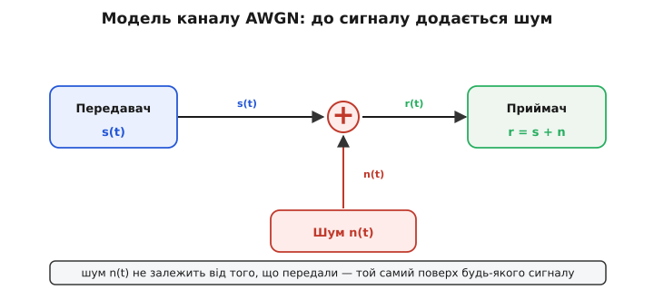
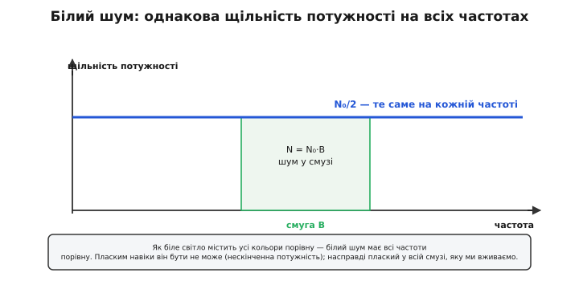
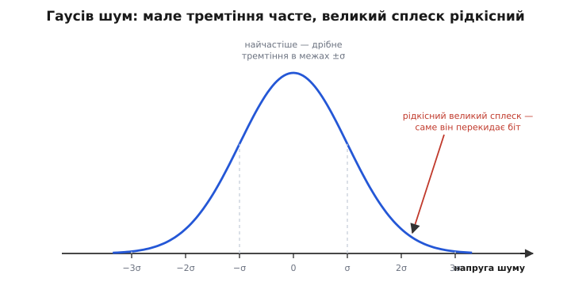
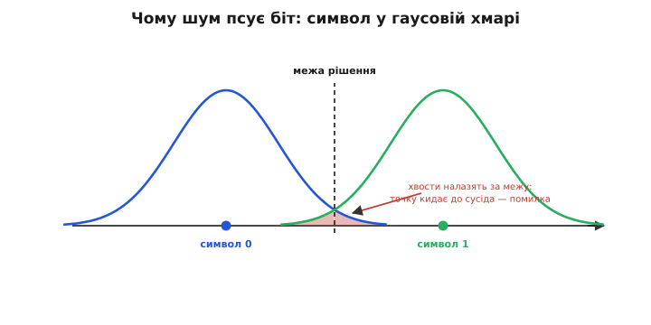

# Канал AWGN

<preknowlist>
- [Потужність і децибели](topic:communications/power-decibels) — логарифмічна шкала дБ і дБм; як перевести потужність у децибели, щоб рахувати рівень шуму.
- [Нормальний розподіл](topic:math/normal-distribution) — дзвоноподібна («гаусова») крива ймовірності: мале відхилення часте, велике рідкісне, ширину задає σ.
- [Центральна гранична теорема](topic:math/central-limit) — сума багатьох незалежних випадкових доданків прямує до нормального розподілу незалежно від того, який кожен доданок.
- [Тепловий шум](topic:physics/thermal-noise) — будь-який провідник за температури вище абсолютного нуля шумить; звідки береться щільність N₀ = k·T.
</preknowlist>

Жоден реальний канал не доносить сигнал недоторканим — дорогою до нього завжди щось домішується. Щоб міркувати про **будь-яку** лінію зв'язку — порахувати, скільки вона пропустить, обрати модуляцію, передбачити частку помилок, — потрібна не жива плутанина справжніх завад, а **математична модель** того, що псує сигнал. Модель AWGN — це і є така модель: найпростіша, найфундаментальніша й до того ж фізично найчесніша з усіх. Вона для теорії зв'язку — те саме, що ідеальний газ для термодинаміки чи безтертьова площина для механіки: точка, з якої **завжди починають**.

Уся модель уміщається в один короткий запис того, що приходить на приймач:

```
r(t) = s(t) + n(t)
```

Прийнятий сигнал **r** — це переданий сигнал **s** плюс якась випадкова добавка **n**, шум. Не спотворений, не перекручений — саме **доданий**. Ось і вся суть, і навколо цього «плюса» будується все інше.

Сама назва — скорочення чотирьох англійських слів: **A**dditive **W**hite **G**aussian **N**oise, адитивний білий гаусів шум (укр. АБГШ). І це не просто ярлик: кожне з чотирьох слів — окреме, точне **припущення** про природу того шуму. Розберімо їх по черзі — саме в них уся модель.

### A — адитивний: шум додається

**Адитивний** (лат. *additivus* — доданий) означає рівно те, що видно у формулі: шум **додається** до сигналу, `r = s + n`. І тут ховається друга, тонша частина припущення — шум **не залежить від того, що ви передали**. Канал підмішує той самий випадковий шурхіт хоч під гучний символ, хоч під тихий, хоч під одиницю, хоч під нуль. Це просто фонове шипіння, накладене поверх вашого сигналу, — воно живе своїм життям і про сигнал «не знає».


*Уся модель — один суматор: до сигналу s(t) додається незалежний шум n(t), і на вихід іде r(t) = s(t) + n(t). Шум той самий, хоч що передавай.*

Варто одразу сказати, чого адитивна модель **не** описує. Коли сигнал не забруднюється добавкою, а **гойдається** сам — то гучнішає, то майже зникає, бо різні шляхи його приходу складаються то в лад, то навпаки, — це вже не додавання, а множення амплітуди, зовсім інший звір ([багатопроменеве завмирання](topic:communications/multipath-fading)). AWGN — про просте додавання, і саме воно описує **головну** заваду більшості ліній: рівне фонове шипіння.

### W — білий: усі частоти порівну

**Білий** — за прямою аналогією з білим світлом. Біле світло тому й біле, що змішує всі кольори веселки **порівну**; так само білий шум містить усі частоти порівну — жодна не гучніша за іншу. Мовою спектра це означає, що **спектральна щільність потужності** шуму пласка: на кожній частоті лежить та сама величина, яку заведено позначати N₀/2 ват на герц.


*Щільність потужності білого шуму однакова на кожній частоті (пласка лінія N₀/2). Потужність шуму, що потрапляє в канал, — це площа під нею в межах смуги: N = N₀·B. Ширша смуга впускає пропорційно більше шуму.*

Де аналогія з білим світлом ламається — теж повчально. Ідеально білий шум, плаский **на всіх частотах аж до нескінченності**, ніс би нескінченну повну потужність (площа під пласкою лінією нескінченної ширини). Такого в природі немає. Реальний шум плаский лише до якоїсь дуже високої частоти — набагато вищої за будь-яку смугу, яку ми вживаємо, — тож **у межах нашого каналу** він білий для всіх практичних потреб. І звідси прямий, важливий наслідок: потужність шуму, яку ви насправді ловите, — це просто пласка щільність, помножена на ширину вашої смуги:

```
N = N₀ · B
```

Ширша смуга — пропорційно більше впущеного шуму. Ось чому смуга ніколи не буває безплатною: розширив канал, щоб пропустити більше даних, — упустив і більше шуму (тонше цей обмін розкриває [межа Шеннона](topic:communications/bandwidth-capacity)).

### G — гаусів: дзвін розподілу

**Гаусів** (за ім'ям Карла Фрідріха Гаусса — хоча саму криву першим вивів ще Абрахам де Муавр 1733 року) описує, **як** тремтить шумова напруга в кожну мить. Її миттєве значення — це випадкове число, узяте з **нормального розподілу**, тієї самої дзвоноподібної кривої: мале відхилення трапляється часто, велике — рідко, і все симетрично (плюс і мінус однаково ймовірні). Увесь дзвін описує **одне** число — його ширина, стандартне відхилення σ; а квадрат цієї ширини, σ², і є **потужність** шуму.


*Миттєва напруга шуму — випадкове число з нормального розподілу. Майже завжди це дрібне тремтіння в межах ±σ; великий сплеск за ±3σ рідкісний — і саме такий рідкісний сплеск перекидає біт у помилку.*

### Чому саме дзвін — і чому це так важливо

Тут природне питання: чому шум тремтить саме **дзвоном**, а не за якоюсь іншою випадковою формою? Відповідь на диво гарна, і вона пояснює, чому гаусове припущення таке всюдисуще й таке надійне.

Шум у дроті — це не один процес, а **сума незліченних крихітних незалежних внесків**. Кожен із приблизно 10²³ електронів у провіднику смикається від тепла й дає напрузі свій мікроскопічний випадковий поштовх. А коли ти складаєш дуже багато малих незалежних випадковостей, сума **завжди** збирається в дзвін — байдуже, який на вигляд кожен окремий поштовх. Це [центральна гранична теорема](topic:math/central-limit), і саме вона робить гаусову модель універсальною: не треба знати мікроскопічний безлад у деталях — сукупність усе одно виходить тим самим дзвоном. Природа підсовує тобі гаусів розподіл, хочеш ти того чи ні. (Точну форму кривої, зв'язок σ² із потужністю та як із дзвона порахувати ймовірність помилки — розгортає [математична вставка](topic:communications/awgn-channel/math-gaussian-noise.md).)

### Звідки шум береться насправді

Модель — моделлю, але «N» у назві має цілком конкретне фізичне джерело, і від нього нікуди не дітися. Це [тепловий шум](topic:physics/thermal-noise) — той самий випадковий тепловий рух електронів у будь-якому провіднику, тепліший за абсолютний нуль. Його виміряв Джон Джонсон, а пояснив Гаррі Найквіст (швед за походженням, що працював в американській Bell Labs) — обидва 1928 року. Їхній результат приголомшливо простий: щільність потужності шуму залежить **лише від температури**:

```
N₀ = k · T
```

де k — стала Больцмана (1.38·10⁻²³ Дж/К), а T — температура в кельвінах. Ні матеріалу, ні схеми, ні частоти — сама температура. (Як із термодинаміки випливає саме kT і чому це виявилося універсальним, оповідає [історична вставка](topic:communications/awgn-channel/hist-johnson-nyquist.md).) Помноживши щільність на смугу, дістаємо потужність шуму `N = k·T·B` — і це ставить **абсолютну підлогу**, нижче за яку сигнал не витягти. За кімнатної температури (стандартна опорна T₀ = 290 К) ця підлога — славнозвісне число, яке напам'ять знає кожен радіоінженер.

**Приклад (теплова підлога −174 дБм/Гц).** Порахуймо щільність шуму за кімнатної температури й переведімо її в дБм — децибели відносно одного мілівата:

```
N₀ = k·T = 1.38·10⁻²³ · 290 ≈ 4.0·10⁻²¹ Вт/Гц
у дБм:  10·log₁₀(4.0·10⁻²¹ / 10⁻³) ≈ 10·(−17.4) ≈ −174 дБм/Гц
```

Отже в кожнім герці смуги за кімнатної температури сидить −174 дБм шуму, якого не прибрати нічим. У ширшій смузі його більше — рівно на 10·log₁₀(B):

```
смуга 20 МГц (канал Wi-Fi):  −174 + 10·log₁₀(20 000 000) ≈ −174 + 73 = −101 дБм
```

Будь-який сигнал, слабший за приблизно −101 дБм у цьому каналі, тоне в тепловому шумі. Ось та тверда фізична стіна, яку й схоплює модель AWGN, — і ось чому найчутливіші приймачі (радіотелескопи, зв'язок із далеким космосом) **охолоджують**: менша T — нижча підлога, менший шум.

> 🔧 **Навіщо це.** «Припустімо канал AWGN» — перша фраза майже кожного розрахунку в зв'язку, і теплова підлога kTB — перший рядок будь-якого бюджету лінії. Перш ніж рахувати дальність, антену чи модуляцію, інженер бере −174 дБм/Гц, додає 10·log₁₀(смуги) і коефіцієнт шуму свого приймача — і одразу бачить, наскільки слабкий сигнал ще зможе почути. Без цієї моделі «чутливість приймача» була б порожнім словом; з нею — конкретне число у ват.

### Чому це псує біти — картина в модуляції

Повернімо все до справжніх бітів — там абстракція стає відчутною. У модуляції кожен переданий символ — це точка: якесь значення напруги або точка на [площині I/Q](topic:communications/fsk-psk). Канал додає гаусів шумовий вектор, тож прийнята точка лягає не точно на символ, а в **розмиту гаусову хмару** навколо нього. Приймач вибирає найближчий символ — ділить простір на області рішення. Поки хмари не налазять одна на одну, він угадує правильно.


*Кожен символ шум розмиває в гаусову хмару. Рідкісний великий сплеск перекидає прийняту точку за межу рішення — у сусідню область, і це помилка біта. Щільніші символи або більший шум → більше перекриття хвостів → більше помилок.*

Але рідкісний великий сплеск шуму — той самий «хвіст» дзвона за ±3σ — може штовхнути прийняту точку **за межу**, в область сусіда. І це помилка біта. Зсунь символи щільніше або дай шуму вирости (менше відношення сигнал/шум) — хвости хмар перекриються сильніше, і помилок стане більше. Ось мікроскопічне походження [кривої помилок BER](topic:communications/ber-snr-curve): частка збитих бітів — це просто площа того хвоста, що перелазить за межу рішення. Тому відношення сигнал/шум і керує в зв'язку всім. (Робочу симуляцію каналу AWGN, що вимірює цю частку помилок у коді, зібрано в [окремій вставці](topic:communications/awgn-channel/proj-awgn-simulation.md).)

### Чому саме AWGN — опорна модель усього

Лишається головне питання: чому саме ця модель, з усіх можливих, стала універсальним еталоном? Три причини сходяться разом.

**Вона фізично чесна.** Тепловий шум справді адитивний, справді білий і справді гаусів — модель не зручна вигадка, а опис тієї самої неуникної завади, що є в кожній лінії. Це та рідкість, коли найпростіша модель водночас і найправдивіша.

**Вона — найгірший випадок за даної потужності.** З усіх шумів однакової потужності гаусів несе найбільше [ентропії](topic:communications/shannon-entropy) — він найнепередбачуваніший, з нього найважче виловити хоч якусь закономірність, щоб відняти. Тому система, розрахована долати AWGN, має **консервативну гарантію**: реальний, структурованіший шум (у якому є що передбачити й прибрати) ніколи не буде важчим. Здолати гаусів шум — означає здолати будь-який шум тієї самої потужності.

**Вона — чиста основа, на яку кладуть решту.** Реальний канал додає зверху свої біди — завмирання, сторонні завади, імпульсні тріски. Але починають **завжди** з AWGN і нашаровують ускладнення на нього. Обдери реальний канал до неминучого осердя — і те, що лишиться, буде саме AWGN.

Ці ж три причини роблять AWGN фундаментом найвідомішого результату в зв'язку. Формула Шеннона `C = B·log₂(1 + S/N)` — це пропускна здатність **саме** каналу AWGN; заміни шум на негаусів — і формула зміниться. Тож AWGN не просто зручна стартова модель, а той ґрунт, на якому стоїть межа Шеннона й уся будова теорії інформації.

І все ж це модель, а не остаточна правда. Коли головна завада — не рівне теплове шипіння, а щось інше (сигнал, що завмирає від інтерференції шляхів; тріск іскри чи блискавки, зовсім не гаусів; потужний сусід на тій самій частоті), — картина AWGN лишається тільки відправною точкою, на яку накладають реальні ефекти. Але навіть тоді теплова гаусова підлога завжди там, унизу, — той єдиний шум, від якого не втекти нікому.
