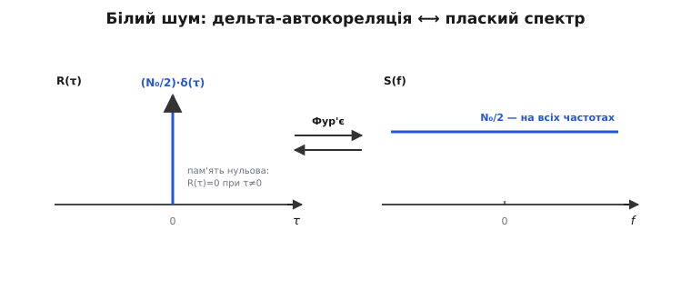
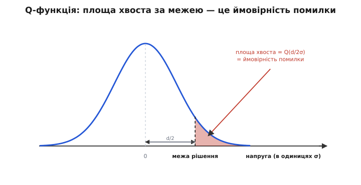

# 🧮 Математика гаусового шуму

Слово «AWGN» — це три точні математичні твердження, стиснуті в чотири літери: розподіл **гаусів**, спектр **білий**, а число, що задає ширину дзвона, дорівнює **потужності** шуму. Кожне з них — не гасло, а конкретний об'єкт, яким можна рахувати. Розгорнімо цей апарат до першопричин: звідки точна формула дзвона, чому сума мільярдів дрібних безладів **приречена** злитися саме в цю форму, як «білий» живе одночасно у спектрі й у пам'яті процесу, як із плаского спектра випадає потужність `N = N₀·B`, і як один-єдиний інтеграл-хвіст — Q-функція — перетворює σ й відстань між символами на ймовірність помилки. Кожне число, яке інженер називає для лінії зв'язку, стоїть саме на цьому апараті.

### Одне число — і це вся статистика шуму

Миттєве значення шумової напруги — випадкове число, узяте з **нормального розподілу** (його щільність першим вивів Абрахам де Муавр 1733 року як наближення до біноміального, а ім'я закріпилося за Карлом Фрідріхом Гауссом). Для шуму із середнім нуль щільність імовірності така:

```
p(n) = 1 / (σ·√(2π)) · e^(−n² / (2σ²))
```

Прочитаймо цю формулу, а не просто занотуймо. У показнику стоїть **−n²**: імовірність падає як експонента від **квадрата** відхилення — тому мале тремтіння часте, а великий сплеск різко рідкісний, і падіння симетричне (плюс і мінус однаково ймовірні, бо `n²` не розрізняє знак). Множник `1/(σ√(2π))` — просто нормування: він підганяє повну площу під кривою рівно до одиниці, бо якесь значення напруга таки має. А **вся** ширина дзвона схована в одному σ у знаменнику показника: збільш σ — і те саме відхилення `n` дає менший показник, крива розповзається; зменш σ — стискається в шпиль.

Тепер ключове, звідки береться зв'язок «дисперсія = потужність». Для сигналу із середнім нуль **середня потужність — це просто середній квадрат** (на опорі 1 Ом, як заведено рахувати в теорії сигналів). А середній квадрат випадкової величини з нульовим середнім **за означенням** і є її дисперсія:

```
E[n]  = 0        середнє шуму — нуль
E[n²] = σ²       середній квадрат = дисперсія = середня потужність
```

Тож σ² — це **одночасно** квадрат ширини дзвона й потужність шуму: одне число у двох ролях. І тут криється те, що робить увесь апарат AWGN таким чистим: нормальний розподіл **повністю** описується середнім і дисперсією — усі інші його характеристики (асиметрія, гостровершинність, кожен старший момент, імовірність вискочити за будь-який поріг) **виводяться** з цих двох. Оскільки середнє тут нуль, **уся** статистика шуму — до останньої дрібниці — замкнена в самому σ². Більше ні про що знати не треба. (Форму самої кривої, її моменти й чому саме два параметри її задають, розгортає стаття про [нормальний розподіл](topic:math/normal-distribution).)

> 🔧 **Навіщо це.** Саме тому, що σ² = потужність, одне вимірювання потужності шуму — показ ватметра або порахований `k·T·B` — миттєво дає **повний імовірнісний закон** кожного відліку. Не роблячи жодного додаткового заміру, інженер уже знає, як часто шум перескочить будь-який поріг: підставив поріг у хвіст гаусіани — дістав частоту. Уся передбачуваність приймача виростає з цього єдиного числа.

### Чому саме дзвін — гранична форма, яку не обійти

Що шум — сума безлічі дрібних незалежних поштовхів (кожен із ~10²³ електронів смикається від тепла й додає свій мікроскопічний внесок), змушує суму збиратися в дзвін через [центральну граничну теорему](topic:math/central-limit). Але чому саме **дзвін**, а не якась інша гранична форма? Відповідь глибша за «так виходить», і найпрозоріше її видно через **характеристичну функцію**.

Характеристична функція розподілу — це усереднення `E[e^(iωn)]`, тобто перетворення Фур'є його щільності. Її чарівна властивість: коли ти **додаєш** незалежні випадкові величини, їхні характеристичні функції **перемножуються**. (Причина проста: щільність суми — це згортка щільностей, а перетворення Фур'є перетворює згортку на добуток.) Отже «додати багато незалежних поштовхів» мовою характеристичних функцій — це «перемножити багато співмножників». Візьмімо логарифм, щоб добуток став сумою, і розкладімо для малих ω (середнє нуль, дисперсія σ²):

```
φ(ω)     = E[e^(iωn)] = 1 − σ²·ω²/2 + (члени з ω³, ω⁴, …)
ln φ(ω)  = −σ²·ω²/2 + (внески асиметрії, гостровершинності — вищі степені ω)
```

А тепер складаємо `N` таких незалежних внесків і перемасштабовуємо суму на `1/√N`, щоб дисперсія лишалася скінченною. Квадратичний член `−σ²ω²/2` при цьому **зберігається незмінним**, а всі вищі члени (з ω³, ω⁴, …) гаснуть як степені `1/√N` і в границі зникають. Лишається рівно одне:

```
ln φ_суми(ω) → −σ²·ω²/2      ⇒      φ_суми(ω) → e^(−σ²·ω²/2)
```

А обернене перетворення Фур'є від `e^(−σ²ω²/2)` — це **точно гаусова щільність**. Ось де народжується неминучість: дзвін — не один варіант серед багатьох, а **єдина нерухома точка** операції «додай незалежне, перемасштабуй». Хоч би який на вигляд був окремий поштовх, сума багатьох сідає саме на цю форму. Є й друге обличчя того самого факту: перетворення Фур'є гаусіани — знову гаусіана. Дзвін нерухомий і під самим перетворенням Фур'є — тому він і виявляється тим тяжінням, до якого все стягується.

Де ця неминучість **ламається** — не менш важливо, бо саме там ламається й уся модель AWGN. Уся конструкція трималася на слові «скінченна дисперсія». Якщо окремі поштовхи мають **нескінченну** дисперсію — важкі хвости, коли зрідка трапляється велетенський викид, — квадратичний член розкладу вже не панує, і границя виходить **не** гаусова (це стійкі розподіли Леві з важкими хвостами). Саме тому теплова гаусова модель безвідмовна для рівного шипіння багатьох дрібних внесків, але **не** описує імпульсну заваду — тріск блискавки чи іскри комутації, де один рідкісний удар несе непропорційно багато енергії. Такий шум не гаусів, і система, розрахована лише на AWGN, під ним спотикається.

І остання причина, чому гаусіана — природний еталон: серед **усіх** розподілів заданої дисперсії саме вона несе найбільшу [ентропію](topic:communications/shannon-entropy) — вона найрозмитіша, найменш структурована, з неї найважче виловити закономірність, щоб відняти. Максимально невизначена форма — і водночас нерухома точка додавання. Це не збіг: обидві властивості кажуть те саме — гаусіана є «найбезладніший» результат складання безлічі незалежних дрібниць.

### Від миттєвого числа до процесу — автокореляція й спектр

Досі `n` було одним випадковим числом. Та шум — це напруга `n(t)`, що живе в часі, **випадковий процес**. Щоб його описати, замало розподілу однієї миті; треба знати його **структуру в часі**: наскільки значення зараз пов'язане зі значенням трохи згодом. Цю пам'ять міряє **автокореляція** — усереднений добуток шуму на його ж копію, зсунуту на τ:

```
R(τ) = E[ n(t)·n(t+τ) ]
```

«Білий» означає **нульову пам'ять**: шум цієї миті не каже про шум наступної миті **нічого** — кожен момент є свіжий незалежний розіграш. Тому `R(τ) = 0` за будь-якого `τ ≠ 0`, а в самій точці `τ = 0` автокореляція — це `E[n²]`, тобто потужність. Ідеалізація записує це однією гострою голкою — дельтою Дірака в нулі:

```
R(τ) = (N₀/2)·δ(τ)
```

Як звідси випливає **плаский спектр**? Через **теорему Вінера–Хінчина**: спектральна щільність потужності процесу — це перетворення Фур'є його автокореляції. (Її довів Норберт Вінер 1930 року для детермінованого випадку; імовірнісний аналог для стаціонарних процесів дав радянський математик Олександр Хінчин 1934 року, а сам зв'язок ще 1914-го начерком описав Айнштайн.)

```
S(f) = ∫ R(τ)·e^(−i2πfτ) dτ
```

Перетворення Фур'є від дельти — це **стала**. Тож `R(τ) = (N₀/2)·δ(τ)` дає `S(f) = N₀/2` на кожній частоті, і навпаки — плаский спектр обертається дельтою. Отже три твердження, які звучать по-різному, — це **один факт трьома мовами**:

```
білий  ⟺  δ-автокореляція  ⟺  плаский спектр
(кожна    (нульова пам'ять    (усі частоти
 мить       у часі)             порівну)
 незалежна)
```


*Нульова пам'ять у часі й рівність усіх частот у спектрі — це одне й те саме, зв'язане перетворенням Фур'є. Дельта-голка автокореляції обертається пласким спектром, і навпаки.*

Ідеалізація тут чесно зізнається у своїй межі. У точці нуль `R(0) = (N₀/2)·δ(0) = ∞` — нескінченна дисперсія, нескінченна повна потужність. Ідеально білого шуму в природі немає (пласка лінія до нескінченних частот несла б нескінченну енергію). Реальний шум має крихітний **час кореляції** τ_c: замість дельти автокореляція — вузька голка скінченної висоти й ширини порядку τ_c, а спектр плаский лише до частот порядку `1/τ_c`. У межах будь-якої реальної смуги він білий для всіх практичних потреб — і, що важливо, саме ця межа робить потужність **скінченною**, щойно ми смугу обмежуємо.

### Плаский спектр і потужність шуму N = N₀·B

Порахуймо тепер потужність, яку приймач насправді ловить. Потужність процесу — це **площа під його спектральною щільністю**, інтеграл `S(f)` за частотою. Приймач пропускає лише свою смугу `B`; поза нею його фільтр шум зрізає. Тут і з'являється сумнозвісний множник ½, на якому спотикаються всі, — розберімо його раз і назавжди.

Двобічна щільність `N₀/2` визначена для **всіх** частот, і додатних, і від'ємних. Від'ємні частоти не фізичні — це бухгалтерія двобічного перетворення Фур'є, у якому кожен реальний косинус розпадається на дзеркальну пару `+f` і `−f`. Потужність кожної фізичної частоти в цьому записі **розкладена навпіл** між двома дзеркальними записами, по `N₀/2` кожен — ось звідки те «/2». Проінтегруймо для ідеального фільтра нижніх частот, що пропускає `|f| ≤ B`:

```
N = ∫₋ᵦ⁺ᵇ (N₀/2) df = (N₀/2)·(2B) = N₀·B
```

Однобічна умовність робить те саме, але прибирає уявні від'ємні частоти: згортає від'ємну половину спектра на додатну, і кожна фізична частота дістає **один** запис удвічі вищий — `N₀` замість `N₀/2`. Так показують аналізатори спектра: у них є лише вісь `f ≥ 0`.

```
N = ∫₀ᴮ N₀ df = N₀·B
```

![Угорі двобічна щільність висотою N₀/2 від −∞ до +∞, заштрихована смуга [−B,+B], площа (N₀/2)·2B; унизу однобічна щільність удвічі вища N₀ лише для f≥0, смуга [0,B], площа N₀·B](/book/communications/information-theory/awgn-channel/img/twosided-onesided.svg)
*Той самий N₀·B двома записами. Множник ½ у висоті двобічної щільності точно гаситься подвоєнням, коли від'ємні частоти згортають на додатні. Читаючи N₀ у будь-якій формулі, звіряй умовність: математичні виведення люблять двобічну N₀/2, а бюджети лінії й даташити — однобічну N₀.*

Обидва записи дають однакове `N₀·B` — «/2» двобічної висоти рівно гаситься подвоєнням від згортання. Ось і вся загадка множника: він не помилка й не окраса, а слід того, що спектр писали симетричним навколо нуля.

Тепер замкнімо коло з першим розділом. Ідеальний білий процес мав нескінченну дисперсію (`R(0) = ∞`), та смугообмежувальний фільтр приймача зрізає її до скінченної потужності `N₀·B`. І **саме ця** відфільтрована потужність і є `σ²` того гаусового відліку, з якого ми починали:

```
σ² = N = N₀·B
```

Абстрактне «одне число» першого розділу виявилося цілком конкретним: пласка щільність, помножена на смугу. Усе сходиться в один ланцюг — спектр задає дисперсію, дисперсія є потужність, потужність є квадрат ширини дзвона.

**Приклад (потужність шуму в смузі 1 МГц).** Візьмімо теплову щільність за кімнатної температури (`N₀ = k·T`, де k — стала Больцмана, T = 290 К — стандартна опорна температура; звідки саме `k·T`, пояснює [тепловий шум](topic:physics/thermal-noise)) і проінтегруймо по мегагерцовій смузі:

```
N₀ = k·T   = 1.38·10⁻²³ · 290      ≈ 4.0·10⁻²¹ Вт/Гц
N  = N₀·B  = 4.0·10⁻²¹ · 10⁶       ≈ 4.0·10⁻¹⁵ Вт
у дБм: 10·log₁₀(4.0·10⁻¹⁵ / 10⁻³)  ≈ −114 дБм
```

Отже σ = √N ≈ 6.3·10⁻⁸ (у корені з ватів на 1 Ом) — це стандартне відхилення шумового відліку на вході. Переведення у дБм тут — просто логарифмічна шкала потужності відносно мілівата ([потужність і децибели](topic:communications/power-decibels)): у смузі 1 МГц теплова підлога сидить на −114 дБм, і жоден сигнал, слабший за неї, з цього шуму не витягти.

### Q-функція — від σ до ймовірності помилки

Тепер винагорода за весь апарат. Усе попереднє відповідало на одне питання: **як часто шум перекине біт?** Картина рішення проста. Символ сидить на якомусь значенні напруги; шум додає гаусів поштовх; приймач вибирає найближчий символ. Помилка — коли поштовх заносить прийняту точку **за межу рішення**, в область сусіда. Отже ймовірність помилки — це ймовірність того, що гаусова величина перевищить відстань до межі. А це **площа хвоста** дзвона.

І тут випливає, чому потрібна окрема функція. Гаусів хвіст не має елементарного первісного — інтеграл від `e^(−u²)` не виражається через елементарні функції (це наслідок теореми Ліувілля), тож площу під хвостом просто **називають**. Q-функція — це площа стандартної (σ = 1, середнє 0) гаусіани праворуч від точки x:

```
Q(x) = P(Z > x) = ∫ₓ^∞ (1/√(2π))·e^(−u²/2) du
```

Її поведінка очевидна з картинки: `Q(0) = ½` (половина площі), `Q(+∞) = 0`, і хвіст худне дуже швидко. Це та сама класична крива помилок, лише в іншому вбранні: через функцію помилок erf і додаткову erfc

```
Q(x) = ½·erfc(x/√2) = ½·(1 − erf(x/√2))
```

— тому в коді ймовірність помилки рахують як `0.5·erfc(x/√2)`, це буквально Q(x).

Наш шум має розподіл `N(0, σ²)`, а не стандартний `N(0,1)`. Щоб скористатися Q, ділимо поріг на σ — «скільки сигм до порога». Імовірність, що шум перевищить поріг `a`:

```
P(n > a) = Q(a/σ)
```

Тепер геометрія двох символів. Хай вони на відстані `d`, межа рішення — посередині, на `d/2` від кожного. Помилка стається, коли шум переносить точку через межу, тобто коли шумовий поштовх більший за `d/2`:

```
P = P(n > d/2) = Q( (d/2) / σ ) = Q( d / (2σ) )
```


*Імовірність помилки — це площа хвоста дзвона, що перелазить за межу рішення. Аргумент d/2σ — піввідстань між символами, зміряна в одиницях σ: скільки «сигм чистого поля» відділяє символ від межі.*

Прочитаймо аргумент `d/2σ` — у ньому вся суть. Це **піввідстань між символами, зміряна в одиницях σ**: скільки стандартних відхилень шуму вміщається між символом і межею рішення. Одне це безрозмірне число вирішує все — а воно і є амплітудне відношення сигнал/шум перевдягнене. Розсунь символи (більше `d`) або приший шум (менше σ) — аргумент зростає, `Q` падає, помилок меншає. І падає `Q` як `e^(−x²/2)` — надекспоненційно: зсув аргументу на одиницю (пара децибелів SNR) кидає ймовірність помилки на **порядки**. Ось звідки крута «водоспадна» форма [кривої помилок BER](topic:communications/ber-snr-curve): дрібна зміна SNR — обвал імовірності помилки.

**Приклад (класична межа BPSK).** Складімо все докупи на найпростішій модуляції — двійковій фазовій (BPSK), де символи протилежні: `±√Eb` (Eb — енергія на біт), тож відстань `d = 2√Eb`. Дисперсія шуму на виході узгодженого фільтра на **одну** дійсну координату — це якраз двобічна щільність, `σ² = N₀/2` (ось де `N₀/2` опиняється у своїй природній ролі; геометрію символів на площині I/Q розкриває [FSK і PSK](topic:communications/fsk-psk)). Підставмо в `Q(d/2σ)`:

```
d/(2σ) = 2√Eb / (2·√(N₀/2)) = √( Eb / (N₀/2) ) = √( 2·Eb/N₀ )

P_b = Q( √( 2·Eb/N₀ ) )
```

Це найцитованіша формула цифрового зв'язку — ймовірність помилки біта BPSK, — і кожен її шматок родом із цього апарата: гаусів розподіл (гранична теорема), хвіст (Q-функція), дисперсія на координату (двобічна `N₀/2`), відстань символів (з модуляції). Порахуймо славнозвісну точку:

```
Eb/N₀ = 9.6 дБ → 10^0.96          ≈ 9.12
√(2·9.12)                          ≈ 4.27
P_b = Q(4.27) = ½·erfc(4.27/√2)   ≈ 1·10⁻⁵
```

Звідси й береться інженерне правило «BPSK потребує близько 9.6 дБ Eb/N₀ на частку помилок 10⁻⁵» — усе воно виводиться з площі одного гаусового хвоста.

### Де це працює — усе на одному апараті

Складімо ланцюг, яким тепер можна пройти від фізики до частки помилок, не пропустивши жодної ланки. Теплова щільність `N₀ = k·T` — задана самою температурою. Помножена на смугу, вона дає `N₀·B` — водночас **потужність шуму** й **дисперсію** `σ²` гаусового відліку, тобто квадрат ширини дзвона. Форма цього дзвона не довільна: її **приречує** гранична теорема, бо шум — сума безлічі незалежних дрібниць зі скінченною дисперсією. «Білий» означає плаский спектр і, те саме мовою часу, незалежні відліки (дельта-автокореляція) — тож кожне рішення приймача зустрічає **один свіжий** розіграш `N(0, σ²)`. А ймовірність, що цей розіграш перекине біт, — площа гаусового хвоста, `Q(d/2σ)`, яка для BPSK згортається в `Q(√(2·Eb/N₀))`.

«Припустімо канал AWGN» — це стенографія рівно цього стосу: одне число `σ² = N₀·B`, одна форма — дзвін, одна функція — `Q`. Уся передбачувальна сила моделі стоїть на цих трьох. І дивовижна тут ощадливість: три прості об'єкти передбачають частку помилок будь-якого реального радіо з точністю до децибела. Саме ця економія й робить AWGN першою моделлю, яку опановують, і останньою, від якої відмовляються.
