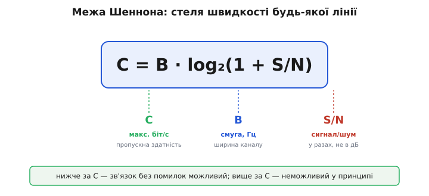
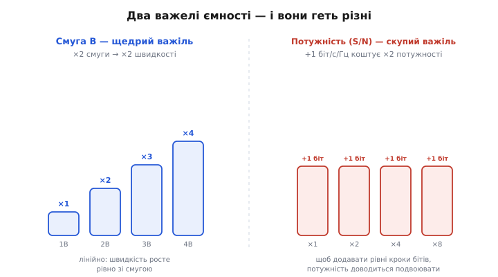
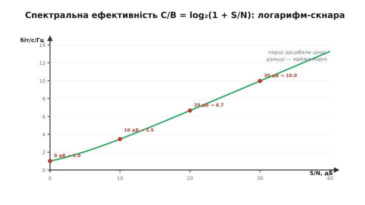
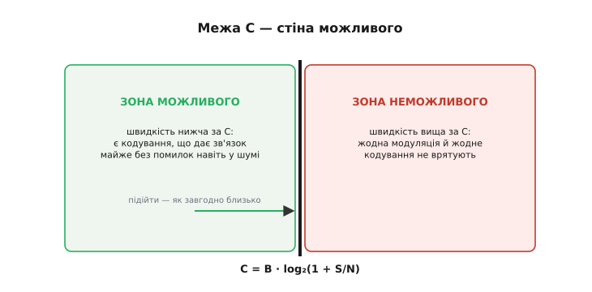
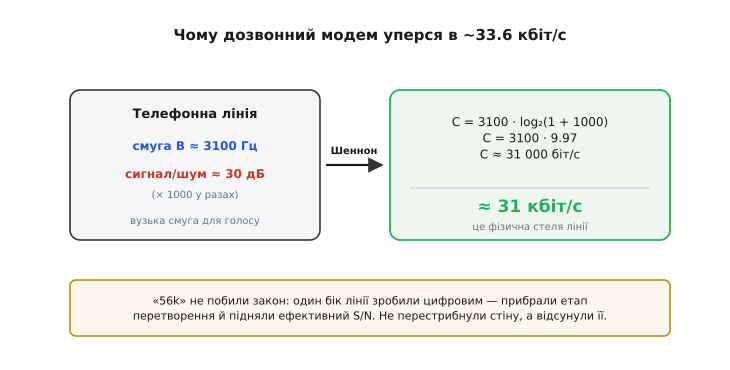
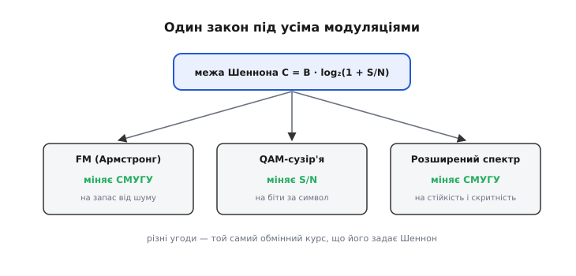
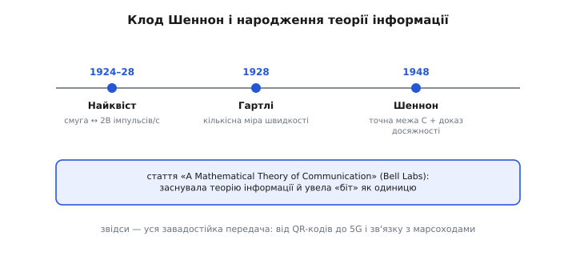

# Смуга і межа Шеннона

Кожна розмова про модуляцію — про FM, про сузір'я, про адаптивну зміну схеми — впирається в одне питання: **скільки** даних канал узагалі здатен пропустити? І щоразу стають дві стіни — **смуга** й **шум**. Перша спокуса інженера — вважати їх тимчасовими перешкодами, які колись хтось обійде кращою схемою. Але це не перешкоди, а прояв **фундаментального закону**, такого ж непорушного, як закон збереження енергії. 1948 року його вивів **Клод Шеннон** (*Claude Shannon*) — і закон каже точно, яка **максимальна** швидкість можлива в каналі з даною смугою й даним шумом. Не «приблизно», не «за нинішніх технологій» — а **назавжди**.

Одна коротка формула тут раптом висвітлює цілий розділ техніки зв'язку: пояснює, чому всі схеми модуляції поводяться саме так, а не інакше, і де в кожній лінії захована її стеля.

### Формула, що ставить стелю

Ось вона — одна з найважливіших формул у всій техніці зв'язку:


*C = B · log₂(1 + S/N). Тут C — максимальна швидкість без помилок (біт/с), B — смуга каналу (Гц), S/N — відношення потужності сигналу до потужності шуму у **разах** (не в децибелах). Нижче за C зв'язок без помилок можливий; вище — неможливий за жодних хитрощів.*

Зліва — **C**, *capacity*, пропускна здатність: гранична швидкість у бітах за секунду, яку канал здатен пропустити **без помилок**. Справа — два множники. **B** — смуга каналу в герцах (та сама, яку займає сигнал [AM чи FM](book:communications/am-fm)). І **S/N** — відношення потужності сигналу до потужності шуму, **в разах** (не в децибелах). Логарифм за основою 2 перетворює це на біти. Уся глибина — в тому, **як саме** C залежить від цих двох важелів: залежить вона дуже по-різному, і саме ця різниця визначає всю інженерію зв'язку.

### Два важелі — і вони нерівноцінні

B стоїть **множником** попереду, а S/N — **усередині логарифма**. Через це два способи наростити швидкість працюють зовсім не однаково.


*Смуга B — щедрий важіль: подвоїв смугу — подвоїв швидкість (лінійна залежність). Потужність (S/N) — скупий важіль: щоб додати лише один біт/с на кожен герц смуги, потужність треба **подвоїти**; а ще один біт — знову подвоїти, і так далі.*

**Смуга** входить лінійно: удвічі ширша смуга — удвічі більша ємність, утричі — утричі. Чесний, щедрий обмін. А **потужність** захована в логарифмі, і логарифм — скнара. Щоб додати фіксовану кількість бітів, потужність треба не додавати, а **множити**. Звідси проста й глибока істина: **розширювати смугу ефективніше, ніж нарощувати потужність**. Можна качати енергію в передавач хоч до посиніння — виграш у швидкості зростатиме лише крихітними логарифмічними кроками.

### Чому потужність дає так мало

Логарифм у формулі пояснює багато дивних на перший погляд речей у радіо — варто розписати його на числах.


*Крива C/B = log₂(1 + S/N) — **спектральна ефективність** (біт/с на кожен герц смуги). Вона росте з потужністю, але дедалі повільніше: кожні додаткові +10 дБ сигналу дають лише близько +3.3 біт/с/Гц. Перші децибели цінні, дальші — майже марні.*

**Приклад (як дорого коштує кожен біт).** Спектральна ефективність C/B = log₂(1 + S/N) для кількох рівнів сигналу:

```
S/N =  0 дБ (×1)    : log₂(1 + 1)    = 1.0  біт/с/Гц
S/N = 10 дБ (×10)   : log₂(1 + 10)   ≈ 3.5  біт/с/Гц
S/N = 20 дБ (×100)  : log₂(1 + 100)  ≈ 6.7  біт/с/Гц
S/N = 30 дБ (×1000) : log₂(1 + 1000) ≈ 10.0 біт/с/Гц
```

Закономірність видно одразу: стрибок із 0 до 10 дБ (удесятеро більше потужності!) додав 2.5 біта; наступні +10 дБ (ще вдесятеро) — лише 3.2. А загальне правило для сильного сигналу таке: **+3 дБ потужності (удвічі) додають лише ~1 біт/с/Гц**. Ось чому в радіо не «вирішують проблему потужністю»: після певної межі це дорого й майже безрезультатно. Сама природа [децибельної шкали](book:communications/power-decibels) робить так, що потужність тане швидко, а купувати нею біти виходить дедалі дорожче. (Звідки в логарифмі береться саме така ціна біта — розгортає [математична вставка](book:communications/bandwidth-capacity/math-shannon-capacity.md), що виводить формулу з підрахунку розрізнюваних рівнів сигналу в шумі.)

### Стіна можливого

Найважливіше у формулі Шеннона — слово **межа**. C — це не «типове значення» й не «рекорд». Це **абсолютна стіна**.


*Ліворуч від межі (нижчі швидкості) — зона **можливого**: існує таке кодування, що дає зв'язок майже без помилок навіть у шумі. Праворуч (вище за C) — зона **неможливого**: жодна модуляція, жодне кодування, жодна геніальність не дадуть надійного зв'язку. Підійти до стіни можна скільки завгодно близько — перетнути не можна.*

Тут — найнесподіваніше у відкритті Шеннона. Він довів **дві** речі одразу. По-перше, що вище за C надійний зв'язок **неможливий** — хоч що роби. По-друге — і це його справжній тріумф — що **до самої межі** C можна підійти **скільки завгодно близько**, зробивши зв'язок майже без помилок навіть у сильному шумі, якщо застосувати достатньо розумне **кодування**. Доти інженери вірили, що шум неминуче псує частину повідомлень і вдіяти з цим нічого не можна. Шеннон показав інше: поки ти **під** межею, помилки можна загнати як завгодно близько до нуля. Уся сучасна **завадостійка** передача — від QR-кодів до 5G і зв'язку з марсоходами — виросла саме з цієї обіцянки.

### Класичний приклад: чому модем застряг на 33.6k

На конкретному числі абстракція робиться відчутною. Найвідоміший приклад — **дозвонний модем** (*dial-up modem*), яким виходили в інтернет через телефонну лінію.


*Телефонна лінія: смуга ≈ 3100 Гц, сигнал-шум ≈ 30 дБ (×1000). Підстановка у Шеннона: C ≈ 3100 · log₂(1001) ≈ 31 000 біт/с. Ось чому дозвонні модеми вперлися саме в ~33.6 кбіт/с — це фізична стеля самої лінії, а не вада техніки.*

**Приклад (межа телефонної лінії).** Телефонна лінія пропускає смугу близько 3.1 кГц, а типове відношення сигнал-шум на ній — близько 30 дБ, тобто ×1000:

```
C = B · log₂(1 + S/N)
C = 3100 · log₂(1 + 1000)
C = 3100 · 9.97  ≈  30 900 біт/с  ≈  31 кбіт/с
```

І ось розгадка історичної загадки: дозвонні модеми **десятиліттями** вдосконалювали — а вони вперто застрягали біля **33.6 кбіт/с** (стандарт V.34). Не тому, що інженери були недолугі, а тому, що це **межа Шеннона** для телефонної лінії. Підійти до неї ближче можна, перейти — ні. А славнозвісні «56k»-модеми (V.90) закону не побили — вони **змінили умову задачі**: зробили один бік лінії, з боку провайдера, повністю цифровим, прибравши один етап перетворення й піднявши тим ефективний S/N. Не перестрибнули стіну, а **відсунули** її, змінивши сам канал. Закон лишився непорушним — недарма й сама вихідна швидкість «56k»-модема (вгору, від абонента) так і лишилася на старих 33.6 кбіт/с, бо там канал не змінили.

### Один закон під усіма модуляціями

Маючи цю формулу, на будь-яку схему модуляції дивишся новими очима — як на окрему стратегію торгівлі в межах однієї й тієї самої стелі.


*FM Армстронга міняє **смугу** на запас від шуму. QAM-сузір'я міняють **S/N** на біти за символ. Розширений спектр міняє смугу на стійкість і скритність. Різні угоди — один і той самий «обмінний курс», що його задає Шеннон.*

> 🔧 **Навіщо це.** Межа Шеннона — це компас для радіоінженера. Вона **не каже**, *як* побудувати лінію (це робота модуляції й кодування), зате каже, *скільки* в принципі можливо — і тим рятує від гонитви за неможливим. Не качається потрібна швидкість? Формула одразу показує, де важіль: розширити смугу (щедро, лінійно) чи підняти S/N (скупо, логарифмічно — більша антена, ближче, менше завад). Саме так міркують, проєктуючи Wi-Fi, стільниковий зв'язок, супутникові лінії й телеметрію дрона. А ще вона тверезить: коли реклама обіцяє «безмежну швидкість», ти знаєш — межа є, і вона має ім'я.

### Людина за межею

За цією стелею стоїть один з найбільших умів XX століття.


*Клод Шеннон (1916–2001) у статті «A Mathematical Theory of Communication» (1948, Bell Labs) заснував **теорію інформації**, увів у науку **біт** як одиницю інформації й довів межу C. Чесно про попередників: Гаррі Найквіст (1924–28) і Ралф Гартлі (1928) із тих самих Bell Labs заклали підвалини — тому теорему звуть «Шеннон–Гартлі».*

**Клод Шеннон** — американський математик та інженер із Bell Labs, якого по праву називають батьком **теорії інформації**. Його стаття 1948 року зробила те, що до неї здавалося неможливим: перетворила розпливчасте поняття «інформація» на **точну, вимірювану величину**. Звідти в науку ввійшов **біт** (*binary digit*, двійкова цифра — термін запропонував колега Шеннона Джон Тʼюкі) як одиниця інформації — та сама, якою міряють усе цифрове.

Шеннон спирався на попередників, і це варто назвати чесно. **Гаррі Найквіст** (*Harry Nyquist*) у працях 1924 і 1928 років показав, що канал смугою B пропускає не більше за 2B незалежних імпульсів за секунду — зв'язав смугу з темпом символів. **Ралф Гартлі** (*Ralph Hartley*, 1928), теж із Bell Labs, додав кількісну міру самої інформації й швидкості лінії. Обидва результати були потужні, але **окремі**, без шуму й без поняття межі. Саме синтез 1948 року — що ввів у гру шум, дав точну, остаточну стелю C і довів досяжність майже-безпомилкового зв'язку — належить Шеннону; через внесок Гартлі повну назву теореми й пишуть як «**Шеннон–Гартлі**». Це чесний розклад: наука колективна, але буває й момент генія, що зводить усе докупи.

Найприродніший спосіб піднятися до стелі, як показує формула, — **розширити смугу**. Але широка смуга дає не лише швидкість: якщо «розмазати» сигнал по дуже широкій смузі особливим чином, він стає на диво **стійким до завад** і навіть **непомітним** для чужого вуха. На цьому стоїть [розширений спектр](book:communications/spread-spectrum) — контрінтуїтивна ідея, що обертає щедрість смуги на захищеність і скритність.

---
