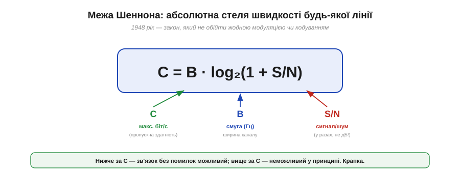

# Смуга й швидкість (натяк на межу Шеннона)

Будь-яка розмова про модуляцію — про FM, про сузір'я, про адаптивну зміну схеми — крутиться навколо одного питання: **скільки** даних можна пропхати через канал? І щоразу постають дві стіни: **смуга** й **шум**. Виявляється, ці дві стіни — не випадкові перешкоди, які колись хитрий інженер обійде. Вони — прояв **фундаментального закону природи**, такого ж непорушного, як закон збереження енергії. Цей закон 1948 року вивів **Клод Шеннон** (*Claude Shannon*), і він каже точно, яка **максимальна** швидкість можлива в каналі з даною смугою й даним шумом. Не «приблизно», не «за нинішніх технологій» — а **назавжди**.

> ⚠️ Це тема-«натяк»: тут немає ні виведення формули, ні занурення в математику теорії інформації. Мета — відчути **зміст** межі Шеннона й те, як вона пояснює поведінку всіх схем модуляції. Це той випадок, коли одна проста формула раптом висвітлює цілий розділ техніки зв'язку.

### Формула, що ставить стелю

Ось вона — одна з найважливіших формул у всій техніці зв'язку:


*Рис. C = B · log₂(1 + S/N). Тут C — максимальна швидкість без помилок (біт/с), B — смуга каналу (Гц), S/N — відношення сигнал/шум (у **разах**, не в децибелах). Нижче за C зв'язок без помилок можливий; вище — неможливий за жодних хитрощів.*

Прочитаймо її по-людськи. Зліва — **C**, *capacity*, пропускна здатність: гранична швидкість у бітах за секунду, яку канал узагалі здатен пропустити **без помилок**. Справа — два множники. **B** — смуга каналу в герцах (та сама, яку займає сигнал [AM чи FM](book:communications/am-fm)). І **S/N** — відношення потужності сигналу до потужності шуму, **в разах** (увага: не в децибелах!). Логарифм за основою 2 перетворює це на біти. Уся глибина — в тому, **як саме** C залежить від цих двох важелів. Бо залежить вона дуже по-різному.

### Два важелі — і вони нерівноцінні

Подивись на формулу уважно: B стоїть **множником** попереду, а S/N — **усередині логарифма**. Це означає, що два способи наростити швидкість працюють зовсім не однаково.


*Рис. Смуга B — щедрий важіль: подвоїв смугу — подвоїв швидкість (лінійна залежність). Потужність (S/N) — скупий важіль: щоб додати лише один біт/с на кожен герц смуги, треба **подвоїти** потужність; а ще один біт — знову подвоїти, і так далі.*

**Смуга** входить лінійно: удвічі ширша смуга — удвічі більша ємність, утричі — утричі. Чесний, щедрий обмін. А от **потужність** захована в логарифмі, і логарифм — скнара. Щоб додати фіксовану кількість бітів, потужність треба не додавати, а **множити**. Звідси проста й глибока істина: **розширювати смугу — ефективніше, ніж нарощувати потужність**. Можна качати енергію в передавач хоч до посиніння — а виграш у швидкості зростатиме лише крихітними логарифмічними кроками.

### Чому потужність дає так мало

Придивімося до цього логарифма уважніше — він пояснює багато дивних на перший погляд речей у радіо.


*Рис. Крива C/B = log₂(1 + S/N) — **спектральна ефективність** (біт/с на кожен герц). Вона росте з потужністю, але дедалі повільніше: кожні додаткові +10 дБ сигналу дають лише близько +3.3 біт/с/Гц. Перші децибели цінні, дальші — майже марні.*

**Приклад (як дорого коштує кожен біт).** Порахуймо спектральну ефективність C/B = log₂(1 + S/N) для кількох рівнів сигналу:

```
S/N =  0 дБ (×1)    : log₂(1+1)    = 1.0  біт/с/Гц
S/N = 10 дБ (×10)   : log₂(1+10)   ≈ 3.5  біт/с/Гц
S/N = 20 дБ (×100)  : log₂(1+100)  ≈ 6.7  біт/с/Гц
S/N = 30 дБ (×1000) : log₂(1+1000) ≈ 10.0 біт/с/Гц
```

Бачиш закономірність? Стрибок із 0 до 10 дБ (удесятеро більше потужності!) додав 2.5 біта; наступні +10 дБ (ще вдесятеро) — лише 3.2. А загальне правило для сильного сигналу таке: **+3 дБ потужності (удвічі) додають лише ~1 біт/с/Гц**. Ось чому в радіо не «вирішують проблему потужністю»: після певної межі це дорого й майже безрезультатно. Сама природа [децибельної шкали](book:communications/power-decibels) робить так, що потужність тане швидко, а купувати нею біти виходить дедалі дорожче.

### Стіна можливого

Найважливіше у формулі Шеннона — слово **межа**. C — це не «типове значення» й не «рекорд». Це **абсолютна стіна**.


*Рис. Ліворуч від межі (нижчі швидкості) — зона **можливого**: існує таке кодування, що дає зв'язок майже без помилок навіть у шумі. Праворуч (вище за C) — зона **неможливого**: жодна модуляція, жодне кодування, жодна геніальність не дадуть надійного зв'язку. Підійти до стіни можна скільки завгодно близько — перетнути не можна.*

І тут — найкрасивіше й найнесподіваніше у відкритті Шеннона. Він довів **дві** речі одразу. По-перше, що вище за C надійний зв'язок **неможливий** — хоч що роби. Але по-друге — і це його справжній тріумф — що **до самої межі** C можна підійти **скільки завгодно близько**, зробивши зв'язок майже без помилок навіть у сильному шумі, якщо застосувати достатньо розумне **кодування**. До Шеннона інженери вірили, що шум неминуче псує частину повідомлень і з цим нічого не вдієш. Шеннон показав: ні — поки ти **під** межею, помилки можна загнати як завгодно близько до нуля. Уся сучасна **завадостійка** передача (від QR-кодів до 5G і зв'язку з марсоходами) виросла з цієї обіцянки.

### Класичний приклад: чому модем застряг на 33.6k

Абстракція ожива́є на конкретному числі. Найвідоміший приклад — **дозвонний модем** (*dial-up modem*), яким користувалися для виходу в інтернет через телефонну лінію.


*Рис. Телефонна лінія: смуга ≈ 3100 Гц, сигнал/шум ≈ 30 дБ (×1000). Підставляємо у Шеннона: C ≈ 3100 · log₂(1001) ≈ 31 000 біт/с. Ось чому дозвонні модеми вперлися саме в ~33.6 кбіт/с — це фізична стеля самої лінії, а не вада техніки.*

**Приклад (межа телефонної лінії).** Телефонна лінія пропускає смугу близько 3.1 кГц, а типове відношення сигнал/шум на ній — близько 30 дБ, тобто ×1000:

```
C = B · log₂(1 + S/N)
C = 3100 · log₂(1 + 1000)
C = 3100 · 9.97 ≈ 30 900 біт/с  ≈  31 кбіт/с
```

І ось вона, розгадка історичної загадки: дозвонні модеми **десятиліттями** вдосконалювали — а вони вперто застрягали біля **33.6 кбіт/с**. Не тому, що інженери були недолугі, а тому, що це **межа Шеннона** для телефонної лінії. Підійти до неї ближче можна, перейти — ні. А славнозвісні «56k»-модеми? Вони не побили закон Шеннона — вони **змінили умову задачі**: зробили один бік лінії (з боку провайдера) повністю цифровим, прибравши один етап перетворення й піднявши тим ефективний S/N. Інакше кажучи, не перестрибнули стіну, а **відсунули** її, змінивши канал. Закон лишився непорушним.

### Один закон під усіма модуляціями

Маючи цю формулу, на всі способи модуляції можна поглянути новими очима.


*Рис. Усі модуляції — це різні стратегії торгівлі в межах Шеннона. FM Армстронга міняє **смугу** на запас від шуму. QAM-сузір'я міняють **S/N** на біти за символ. Розширений спектр міняє смугу на стійкість і скритність. Різні угоди — один і той самий «обмінний курс», що його задає Шеннон.*

> 🔧 **Навіщо це.** Межа Шеннона — це компас для будь-якого радіоінженера. Вона **не каже**, *як* побудувати лінію (це робота модуляції й кодування), зате каже, *скільки* в принципі можливо — і тим рятує від гонитви за неможливим. Не качається потрібна швидкість? Формула одразу показує, де важіль: розширити смугу (щедро, лінійно) чи підняти S/N (скупо, логарифмічно — більша антена, ближче, менше завад). Саме так міркують, проєктуючи Wi-Fi, стільниковий зв'язок, супутникові лінії й телеметрію дрона. А ще вона тверезить: коли реклама обіцяє «безмежну швидкість», ти знаєш — межа є, і вона має ім'я.

### Людина за межею

Цю стелю варто пов'язати з людиною, бо за нею стоїть один з найбільших умів XX століття.


*Рис. Клод Шеннон (1916–2001) у статті «A Mathematical Theory of Communication» (1948, Bell Labs) заснував **теорію інформації**, ввів у науку **біт** як одиницю інформації й довів межу C. Чесно про попередників: Гаррі Найквіст (1924) і Ралф Гартлі (1928) із тих самих Bell Labs заклали підвалини — тому теорему й звуть «Шеннон–Гартлі».*

**Клод Шеннон** — американський математик та інженер із Bell Labs, якого по праву називають батьком **теорії інформації**. Його стаття 1948 року зробила те, що до неї здавалося неможливим: перетворила розпливчасте поняття «інформація» на **точну, вимірювану величину**. Саме звідти в науку ввійшов **біт** як одиниця інформації — та сама, якою ми міряємо все цифрове. Як завжди в історії техніки, Шеннон стояв на плечах попередників: **Гаррі Найквіст** (*Harry Nyquist*, 1924) і **Ралф Гартлі** (*Ralph Hartley*, 1928), теж із Bell Labs, заклали підвалини — і тому повну назву теореми пишуть як «**Шеннон–Гартлі**». Але саме синтез 1948 року, що дав точну, остаточну межу й довів досяжність майже-безпомилкового зв'язку, належить Шеннону. Це чесний розклад: наука колективна, але буває й момент генія, що зводить усе в одне.

Отже, маємо стелю. Найприродніший спосіб піднятися до неї, як підказує формула, — **розширити смугу**. Але широка смуга дає не лише швидкість: якщо «розмазати» сигнал по дуже широкій смузі особливим чином, він стає на диво **стійким до завад** і навіть **непомітним** для чужого вуха. Саме на цьому стоїть [розширений спектр](book:communications/spread-spectrum) — контрінтуїтивна ідея, що обертає щедрість смуги на захищеність і скритність.

---
