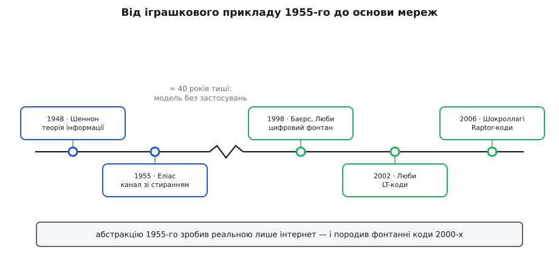

# 📜 Пітер Еліас і сорокарічний сон каналу зі стиранням

Ця модель народилася 1955 року як математична іграшка — найпростіший канал, на якому зручно міркувати про шум, — і мовчки пролежала сорок років, доки інтернет несподівано не виявився точнісінько таким каналом. Історія тут не про формулу, а про дивовижну затримку між чистою думкою й тим днем, коли вона раптом стала описувати кожен пакет у мережі.

Щоб відчути її, треба стати на місце теоретика середини 1950-х. [Клод Шеннон](topic:communications/channel-coding-theorem) щойно, 1948-го, довів разючу річ: у кожного зашумленого каналу є число — пропускна здатність, — і нижче за нього можна передавати як завгодно надійно, а вище не можна ніяк. Та теорема каже, що надійний код **існує**, але не подає його на блюді й не пояснює, на яких найпростіших каналах усе це порахувати наскрізь. Теорії потрібні були іграшкові канали — досить прості, щоб довести до кінця, і досить справжні, щоб чогось навчити. Один із таких і склав Пітер Еліас.

## Один короткий виступ 1955 року

У березні 1955-го на національній конвенції IRE в Нью-Йорку Пітер Еліас (Peter Elias) — молодий викладач MIT — виголосив доповідь «Coding for Noisy Channels», що вийшла того ж року в *IRE Convention Record*. Це один із тих рідкісних текстів, де в кількох сторінках закладено відразу кілька гілок майбутньої науки. У ньому Еліас увів [згорткові коди](topic:communications/convolutional-codes) — коди, де захист розмазано вздовж потоку, а не нарізано незалежними блоками. І в ньому ж він увів двійковий канал зі стиранням.

Хто був цей чоловік, варто сказати окремо, бо його часто називають найважливішим раннім дослідником теорії інформації після самого Шеннона. Еліас народився 1923 року в Нью-Брансвіку, штат Нью-Джерсі; його батько, хімік-інженер Натаніель Мендель Еліас (Nathaniel Mendel Elias), працював у лабораторії Томаса Едісона — інженерія була в домі змалку. Пітер здобув освіту в MIT і Гарварді, з 1953-го й до кінця кар'єри лишався на факультеті MIT, керував там кафедрою електротехніки. Він — американець, і жодних імперських переписувань його родоводу тут немає: рівний колега Шеннона по MIT, який розбудовував нову науку зсередини.

Навіщо йому взагалі знадобився ще один канал, коли поряд уже був [двійковий симетричний](topic:communications/binary-symmetric-channel) — модель, де біт нишком перевертається? Саме тому, що симетричний канал **важкий**. Щоб на ньому щось довести до дна, доводиться боротися з тим, що приймач не знає навіть, котрі біти збрехали. Еліас узяв найм'якший можливий різновид зіпсуття: канал, що не бреше про біт, а чесно губить його й **зізнається** у втраті, позначаючи діру знаком «?». Це найпростіший нетривіальний канал, який тільки можна вигадати, — він усе ще втрачає інформацію, але робить це так відверто, що його пропускна здатність видно майже без обчислень, одним рядком 1 − ε. Ідеальний навчальний приклад.

І тут важливо назвати статус того, що сталося. Це була **ідея та публікація** — математична зручність, викладена в матеріалах конференції. Ніхто тоді не будував пристрою, що поводився б як цей канал; ніхто й не збирався. (Деякі довідники датують модель 1954-м; найнадійніша прив'язка — саме опублікований запис 1955 року.)


*Дві події зліва — чиста теорія 1940–50-х. Тоді довгий порожній проміжок: модель існує, але ніщо в світі під неї не підходить. І аж наприкінці 1990-х, коли інтернет зробив канал зі стиранням буденністю, за чотири роки виростає ціла родина кодів під нього.*

## Іграшка, що пролежала сорок років

Далі сталося найдивніше: майже нічого. Десятиліттями канал зі стиранням лишався прикладом із дошки, який розв'язують на лекції саме тому, що він легкий, — а не тому, що чийсь дріт так поводиться. І причина проста, коли поставити її прямо. Реальні канали 1950–80-х псували біти **потай**: телефонна лінія, радіозв'язок із далеким космосом, магнітна стрічка — усюди шум додавався до сигналу й час від часу перевертав біт, не лишаючи ні найменшої позначки, де саме. Світ був симетричним каналом, а не каналом зі стиранням.

Тому й уся інженерна енергія тих років ішла на боротьбу саме з переворотами. Коди Геммінга, Ріда — Соломона, згорткові коди з декодером Вітербі — усі вони заточені знаходити захований збій і аж тоді його виправляти. Стирання ж, де половина роботи вже зроблена задарма, здавалося майже шахрайським спрощенням: гарне для іспиту, ні до чого в житті. Модель була бездоганна й непотрібна водночас — рідкісний випадок, коли правильна відповідь десятиліттями чекає, доки хтось нарешті поставить під неї правильне запитання.

## Інтернет робить стирання реальним

Запитання поставила комутація пакетів. Коли дані порізано на пакети й кожен несе власну [контрольну суму](topic:communications/checksums) — коротке число, що підтверджує цілість вмісту, — картина шуму перевертається з ніг на голову. Пакет, у якому хоч один біт побився дорогою, не приймають напівзламаним і не передають вище зіпсованим: контрольна сума не сходиться, і його **викидають цілком**. А пакет, що загубився в переповненому буфері або спізнився, просто не приходить. За розривом у нумерації приймач бачить рівно, котрого шматка бракує.

Придивімося, що з цього вийшло. Спотворення на рівні бітів — потайні перевороти всередині пакета — на рівні пакетів обертаються на **чесне стирання**: ти або одержуєш цілий добрий пакет, або одержуєш позначену діру на його місці. Хибного пакета, що вдає справжній, майже не буває — його відсіює контрольна сума. Це і є двійковий канал зі стиранням, тільки символом тепер служить не біт, а цілий пакет; уся мережа поверх пакетів поводиться як одне велике BEC. Абстракція Еліаса раптом описувала інтернет точніше за будь-яку іншу модель — і, що дивовижно, сама модель ані на йоту не змінилася. Змінився світ: люди збудували систему, яка нарешті збіглася з давнім припущенням про канал, що радше чесно губить, ніж потай бреше.

## Фонтан, що ллється, доки не набереш досить

Коли мережа — це канал зі стиранням, під неї потрібні свої коди, і в короткий проміжок наприкінці 1990-х вони народилися один за одним.

Першим прийшло **бачення**. 1998 року Джон Баєрс, Майкл Люби, Майкл Мітценмахер і Ашу Реге (John Byers, Michael Luby, Michael Mitzenmacher, Ashu Rege) на конференції ACM SIGCOMM подали ідею з назвою, що сама все пояснює, — «A digital fountain approach to reliable distribution of bulk data», «цифровий фонтан». Уявіть джерело, що ллє нескінченний струмінь закодованих порцій, як фонтан — краплі. Приймачеві байдуже, котрі краплі він проґавив: щойно він набере досить будь-яких — файл складається назад.

```
файл на K·l бітів  →  ллємо порції по l бітів, скільки треба
приймач зловив ≈K будь-яких із них  →  файл відновлено повністю
```

Це саме концепція (і однойменний стартап Digital Fountain), а не готовий код — обіцянка того, як усе мало б працювати. **Робочий код** дав 2002 року Майкл Люби статтею «LT Codes»: перший практичний код без наперед заданої швидкості (англ. *rateless*), що справді втілює фонтан. Кодує він до сорому просто — складає (операцією «виключне або») випадкові підмножини бітів повідомлення; декодує, послідовно «знімаючи» вже відомі порції. Придумав його Люби ще близько 1998-го, а опублікував 2002-го — тож ідея й друк тут теж розділені кількома роками.

Останнім прийшла **інженерія**. 2006 року Амін Шокроллагі (Amin Shokrollahi) — математик іранського походження — у статті «Raptor Codes» додав перед LT ще один, попередній код. Ця маленька добудова прибрала останню ваду: декодування стало лінійним за часом, а для складання файлу вистачає ледь-ледь більше за K порцій. Саме Raptor-коди пішли в справжні стандарти — у 3GPP для мобільного мовлення (MBMS), в IETF, — тобто в мільйони пристроїв. Родовід замкнувся: усе це — [фонтанні коди](topic:communications/fountain-codes), рідні саме для каналу зі стиранням, а не припасовані до нього згодом.

Пройдіть цю арку очима ще раз. Приклад із дошки, який Еліас накидав 1955-го, щоб зручніше було думати, півстоліття вважали надто простим для життя. А тоді світ збудував інтернет — і виявилося, що ця «іграшка» описує його точніше за все інше, і що телефон, який ловить широкомовний потік краплями з фонтана, працює рівно на тій математиці, яку молодий викладач MIT виклав на кількох сторінках матеріалів конференції.
